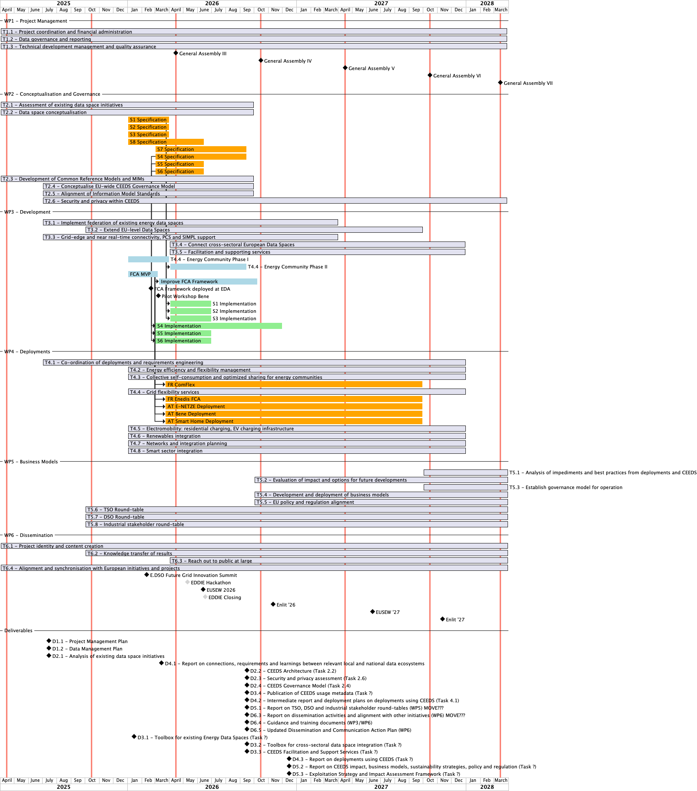

## Executive Summary
INSIEME (Italian for 'together') aims to deploy a Common European Energy Data Space (CEEDS) to facilitate data sharing, interoperability, and innovation in the energy sector.
The project will build on previous initiatives like the Energy Data Space Cluster Projects and establish a federated architecture to connect existing data exchange platforms across Europe.
Key objectives include developing standardized data formats, security protocols, governance frameworks, and business models to enable secure and trusted data exchange between utilities, market actors, energy communities, and consumers.
INSIEME will implement core CEEDS components and deploy them across multiple use cases and pilots in over 15 EU countries, covering areas such as energy efficiency, flexibility management, collective self-consumption, grid services, electromobility, renewable integration, and sector coupling. 
The versatile consortium comprises of partners, including technology providers, data space operators, distribution and transmission system operators, energy community platforms, artificial intelligence experts, and EU associations.
Through field tests, standards development, and stakeholder engagement, INSIEME aims to provide a secure, interoperable, and financially sustainable data space that accelerates the clean energy transition by enabling innovative energy services and empowering consumers across borders.

## INSIEME Roadmap

