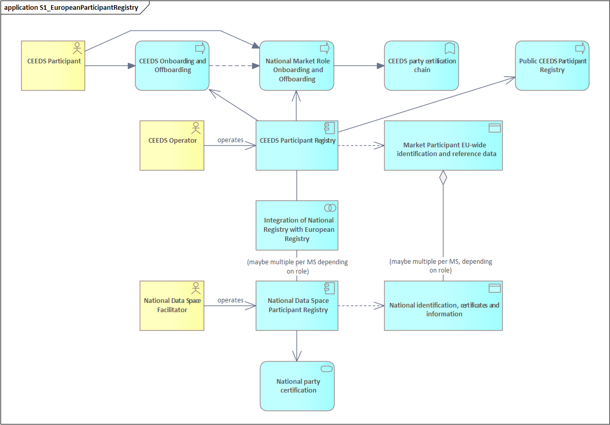

## Contributors

| Responsibility | Name                   | E-Mail                                 |
|----------------|------------------------|----------------------------------------|
| Leader         | Benjamin Ellmer        | benjamin.ellmer@fh-hagenberg.at        |
| Contributor    | Georg Hartner          | georg.hartner@eddie.energy             |
| Contributor    | Florian Weingartshofer | florian.weingartshofer@fh-hagenberg.at |
| Contributor    | Aya Mohamed            | aya.Mohamed@fh-hagenberg.at            |

## Function and Objective

The CEEDS Participants Registry (CPR) establishes a single European interface connecting national participant registries.
It enables streamlined cross-border onboarding through the use of electronic identification means in accordance
with [eID](https://ec.europa.eu/digital-building-blocks/sites/spaces/DIGITAL/pages/467109253/eID) and [eIDAS](https://digital-strategy.ec.europa.eu/en/policies/eidas-regulation).
The CPR serves as a single point of reference for European-level market participants for all national and European data spaces and platforms relevant for data exchange within the CEEDS functional
scope.

The CPR supports a broad range of use cases across the energy data ecosystem. These include, but are not limited to, the following:

- onboarding to national data hubs e.g. Energinet Data Hub
- onboarding to national data exchange environments e.g. Energy Data Exchange Austria (EDA), ebutilities.at
- prequalification of local and balancing service providers
- registration of Collective Energy Sharing units, including Energy Communities.

In line with the recommendations of the Identification and Authentication Group, CEEDS implementing acts are expected to promote the broad adoption
of [eID](https://ec.europa.eu/digital-building-blocks/sites/spaces/DIGITAL/pages/467109253/eID), [eIDAS](https://digital-strategy.ec.europa.eu/en/policies/eidas-regulation),
and [European Digital Identity Wallets](https://ec.europa.eu/digital-building-blocks/sites/spaces/EUDIGITALIDENTITYWALLET/pages/791609471/What+is+the+Wallet).
This approach aims to minimise administrative and compliance costs at both Union and national level for market participants and onboarding platform operators.

Registration under the CPR is possible across the entire internal market within a reasonable timeframe. It does not require the establishment of legal entities in host Member States, nor does it
involve unnecessary administrative or procedural burdens.

## Business Architecture

<!-- 
The Business Architecture focuses on business requirements. It outlines the structure and operation of an organization, including business goals, functions, processes, and organizational structure. 
See: https://www.fconsulting.tech/togaf-10-understanding-the-7-core-concepts/
-->

### Archimate Service Realisation Viewpoint

<!-- 
The Service Realization Viewpoint pattern creates elements that show how one or more business services are realized by the underlying processes (and sometimes by application components). 
Thus, it forms the bridge between the business products viewpoint and the business process view. It provides a "view from the outside" on one or more business processes. 
See: https://sparxsystems.com/resources/tutorials/archimate/#Service-Realization-Viewpoint
-->

#### Component Descriptions

The **CEEDS Onboarding and Offboarding function** provides a European entry point for participants. It manages the lifecycle of participation at CEEDS level, including initial registration, updates,
and termination.
This process interfaces with national onboarding mechanisms to ensure that European-level registration is aligned with national market role requirements, while avoiding unnecessary duplication for
participants.

The **National Market Role Onboarding and Offboarding** block represents national-level processes that assign and manage market roles required under national regulation (e.g. supplier, aggregator,
balancing service provider).
The CEEDS onboarding process connects to these national processes to enable recognition of roles across borders, while respecting national legal frameworks. Multiple national instances may exist
depending on Member State requirements and role definitions.

The **CEEDS Party Certification Chain** ensures that participants meet the trust, security, and compliance requirements applicable at European level. It links identity verification, certification, and
validation processes to support mutual trust between national and European systems and enables secure participation in CEEDS data exchanges.

The **Public CEEDS Participant Registry** provides publicly accessible reference information on CEEDS participants. It supports transparency and trust by allowing authorised stakeholders to verify
participant status, identifiers, and relevant attributes.
The public registry is derived from the authoritative CEEDS Participants Registry and reflects validated and up-to-date information.

The **Market Participant EU-wide Identification and Reference Data** component contains identification data and reference attributes that are valid across the EU market. It enables consistent
identification of participants across national systems and supports interoperability between data spaces.
The data may be linked to multiple national datasets, depending on the participant’s roles and activities in different Member States.

The **Integration of National Registry with European Registry** block represents the technical and organisational integration between the CEEDS Participant Registry and national registries.
National Data Space Facilitators are responsible for integrating and maintaining the connection between their National Data Space Participant Registry and the CEEDS Participant Registry. This
integration is implemented in a fully digital, interoperable, and machine-processable manner, based on the standardised interfaces provided by the CEEDS Facilitator.

The **National Data Space Participant Registry** is the authoritative registry at national level. It contains participant information required under national rules and supports national onboarding,
certification, and data exchange processes.
Each registry is operated by the respective National Data Space Facilitator and may exist in multiple instances per Member State, depending on national roles and regulatory structures.

The **National Identification, Certificates and Information** block covers national-level identity data, certificates, and supporting information required for participation in national markets and
data spaces.
The national registry exchanges relevant information with the European-level identification and reference data to ensure consistency and mutual recognition.

**National Party Certification** represents national certification and compliance mechanisms that validate participants against national requirements.
These certifications feed into the overall trust framework and are aligned with the European certification chain to enable cross-border participation without redundant procedures.

## Data Architecture

<!-- 
Data Architecture pertains to the management of data, both physical and logical.
It involves data assets, databases, data models, and the governance of data across the enterprise.
See: https://www.fconsulting.tech/togaf-10-understanding-the-7-core-concepts/
-->

### Data Objects

#### EU-wide market participant information

| Attribute   | Data Type        | Existence | Comments                                   |
|-------------|------------------|-----------|--------------------------------------------|
| eID         | UUID             | mandatory | eID of Market Participant                  |
| eID Node    | UUID             | mandatory | eID of Market Participant (REF_DATA->link) |
| name        | String           | mandatory | Name of the market participant             |
| email       | Email            | mandatory | Email of the MP                            |
| role        | Market Role(s)   | mandatory | Market Roles in the sense of the HEMRM.    |
| status      | OnboardingStatus | mandatory | Lifecycle state                            |
| certificate | Cert Info        | optional  | Certificate information / public key       |

#### National market participant information

**Note:** There may be multiple national market participant information(s) depending on the National Data Space the MP is onboarded to.

| Attribute   | Data Type        | Existence   | Comments                                                                    |
|-------------|------------------|-------------|-----------------------------------------------------------------------------|
| National Id | UUID             | mandatory   | eID of Market Participant                                                   |
| eID         | UUID             | mandatory   | eID of Market Participant (REF_DATA->link)                                  |
| roles       | String           | mandatory   | Name of the market participant relevant for the national market participant |
| ndso_id     | Email            | mandatory   | Identifier of the National Data Space Operator (REF_DATA->link)             |
| status      | OnboardingStatus | mandatory   | Lifecycle state                                                             |
| certificate | Cert Info        | conditional | Certificate information / public key                                        |

### Reference Data Requirements

* List of National Data Space Operators
* List of Harmonised Roles
* List of eID Nodes

## Application Architecture

<!-- 
The Application Architecture describes individual applications and their interactions.
It addresses software applications and their role in supporting business processes and functions.
See: https://www.fconsulting.tech/togaf-10-understanding-the-7-core-concepts/
-->

### Application Cooperation Viewpoint

<!--
The Application Cooperation Viewpoint pattern creates elements a diagram that describe the relationships between applications components  and their locations, the services they provide or utilize and the information that flows between them.
See: https://sparxsystems.com/resources/tutorials/archimate/#Application-Cooperation-Viewpoint
-->

<!-- TODO: Insert ArchiMate Cooperation Viewpoint diagram -->

#### Component Descriptions

<!-- TODO: Insert descriptions of Application Cooperation Viewpoint components -->

## Technology Architecture

<!--
The Technology Architecture involves the IT infrastructure, including hardware, software, networks, and services.
It ensures that the infrastructure supports the application and data requirements of the business.
See: https://www.fconsulting.tech/togaf-10-understanding-the-7-core-concepts/
-->

<!--
E.g. sequence diagrams for e.g. onboarding, offboarding etc.
* registry wiederverwenden
-->

### Deployment View

<!-- 
The Implementation and Deployment Viewpoint pattern creates elements and a diagram that relate programs and projects to the parts of the architecture that they implement.
This view allows modeling of the scope of programs, projects, project activities in terms of the plateaus that are realized or the individual architecture elements that are affected.
In addition, the way the elements are affected may be indicated by annotating the relationships.
See: https://sparxsystems.com/resources/tutorials/archimate/#Application-Cooperation-Viewpoint
-->

<!-- TODO: Insert ArchiMate Deployment View diagram -->

#### Component Descriptions

<!-- TODO: Insert descriptions of Deployment View components -->
