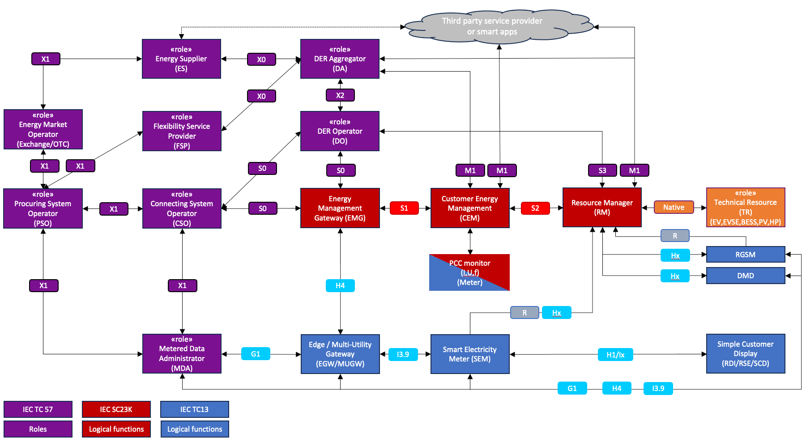

## Function and Objective

The *Digital Customer Interface (DCI)* class of services provides trusted user access to federated energy services. It enables customer consent management, access to data services, participation in service marketplaces, and interaction with optimisation and flexibility services. DCI aligns with implementations such as AIIDA and Power Grid User Interfaces and ensures customer-level sovereignty enforcement.

**Market-Edge architecture as recommended by Data4Energy expert group  (Source: Joint Report of Data4Energy, Sustainable Transport Forum (STF) and Coalition of the Willing for Smart and Bi-directional charging (CoW))**

The figure above - Market-Edge architecture as recommended by Data4Energy - shows the the proposed overall reference view as developed by the European Commission’s Data4Energy expert group. The input for this architecture is based on the architecture from the TC13/SC23K JAG4 defined by the experts of standardisation work groups IEC TC57 WG21 (purple boxes), TC 13 WG14 (blue boxes) and SC23K WG3 (red boxes).
Digital and closer-to-realtime communication of system operators, service providers and DER Operators/Aggregators with final customers is gaining increasing importance for the implementation of both rules-based and market-based, as well as both implicit and explicit flexibility schemas. Yet, different data space environments offer different solutions for the architectural building block, often realising solutions for both the Energy Management Gateway (EMG), Consumer Energy Management (CEM) and the PCC Monitor. As an example, EDDIE includes AIIDA (Administrative Interface for In-house Data Access adding Customer Sovereignty, Edge Autonomy and Consent Management), whereas the RomeFlex/OneNet/Sogno Cluster puts forwards the “Power Grids User Interface” (PGUI). Other developments – like the Dutch NextGen Smart Meter Initiative – are evaluating similar concepts.

As part of the *INSIEME Federation Strategy*, solutions and relevant procedures are piloted to identify and update available standards, to make them interoperable and allow for competition, markets and choice at the grid-edge.

## Business Architecture

<!-- 
The Business Architecture focuses on business requirements. It outlines the structure and operation of an organization, including business goals, functions, processes, and organizational structure. 
See: https://www.fconsulting.tech/togaf-10-understanding-the-7-core-concepts/
-->

### Service Realization Viewpoint

<!-- 
The Service Realization Viewpoint pattern creates elements that show how one or more business services are realized by the underlying processes (and sometimes by application components). 
Thus, it forms the bridge between the business products viewpoint and the business process view. It provides a "view from the outside" on one or more business processes. 
See: https://sparxsystems.com/resources/tutorials/archimate/#Service-Realization-Viewpoint
-->

<!-- TODO: Insert ArchiMate Service Realization Viewpoint diagram -->

#### Component Descriptions

<!-- TODO: Insert descriptions of Realization Viewpoint components -->

## Data Architecture

<!-- 
Data Architecture pertains to the management of data, both physical and logical.
It involves data assets, databases, data models, and the governance of data across the enterprise.
See: https://www.fconsulting.tech/togaf-10-understanding-the-7-core-concepts/
-->

### Data Objects

<!-- TODO: Insert list/table of data objects and their descriptions -->

## Application Architecture

<!-- 
The Application Architecture describes individual applications and their interactions.
It addresses software applications and their role in supporting business processes and functions.
See: https://www.fconsulting.tech/togaf-10-understanding-the-7-core-concepts/
-->

### Application Cooperation Viewpoint

<!--
The Application Cooperation Viewpoint pattern creates elements a diagram that describe the relationships between applications components  and their locations, the services they provide or utilize and the information that flows between them.
See: https://sparxsystems.com/resources/tutorials/archimate/#Application-Cooperation-Viewpoint
-->

<!-- TODO: Insert ArchiMate Cooperation Viewpoint diagram -->

#### Component Descriptions

<!-- TODO: Insert descriptions of Application Cooperation Viewpoint components -->

## Technology Architecture

<!--
The Technology Architecture involves the IT infrastructure, including hardware, software, networks, and services.
It ensures that the infrastructure supports the application and data requirements of the business.
See: https://www.fconsulting.tech/togaf-10-understanding-the-7-core-concepts/
-->

### Deployment View

<!-- 
The Implementation and Deployment Viewpoint pattern creates elements and a diagram that relate programs and projects to the parts of the architecture that they implement.
This view allows modeling of the scope of programs, projects, project activities in terms of the plateaus that are realized or the individual architecture elements that are affected.
In addition, the way the elements are affected may be indicated by annotating the relationships.
See: https://sparxsystems.com/resources/tutorials/archimate/#Application-Cooperation-Viewpoint
-->

<!-- TODO: Insert ArchiMate Deployment View diagram -->

#### Component Descriptions

<!-- TODO: Insert descriptions of Deployment View components -->
