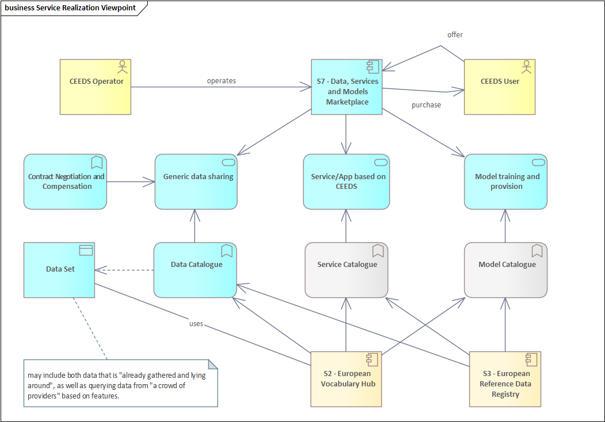

## Contributors

| Responsibility | Name             | E-Mail                  |
|----------------|------------------|-------------------------|
| Engineering    | Ferdinando Bosco | ferdinando.bosco@eng.it |
| FHOOE | Georg Hartner | georg.hartner@eddie.energy |

## Function and Objective

Provides a regulated environment for accessing, sharing, and commercialising energy-related data. The EDSM should contain a data catalogue for data indexing and discovery.

Data service providers may link into this marketplace to offer their services, such as:

- Forecasting and data analysis for pivotal information model data
- Crowdsourcing of data based (e.g. feature-based request for data)
- Refinement of data
- Storage and accessibility of regulated data (e.g. forecast charging capacity of charging stations collected from Charge Point Operators (CPO), data from the ENTSO-E Transparency Platform, market
  data, etc.)
- Storage and accessibility of statistical data
- Privacy and pseudonymisation

EDSM should contain – possibly in close co-operation with SIMPL – a concept for data provision contract negotiation, cost renumeration and commercialization of data, as well as settlement of
transactions. EDSM should cover both free-of-charge and chargeable services. 

## Business Architecture

<!-- 
The Business Architecture focuses on business requirements. It outlines the structure and operation of an organization, including business goals, functions, processes, and organizational structure. 
See: https://www.fconsulting.tech/togaf-10-understanding-the-7-core-concepts/
-->

### Service Realization Viewpoint

<!-- 
The Service Realization Viewpoint pattern creates elements that show how one or more business services are realized by the underlying processes (and sometimes by application components). 
Thus, it forms the bridge between the business products viewpoint and the business process view. It provides a "view from the outside" on one or more business processes. 
See: https://sparxsystems.com/resources/tutorials/archimate/#Service-Realization-Viewpoint
-->

<!-- TODO: Insert ArchiMate Service Realization Viewpoint diagram -->

#### Component Descriptions

<!-- TODO: Insert descriptions of Realization Viewpoint components -->

## Data Architecture

<!-- 
Data Architecture pertains to the management of data, both physical and logical.
It involves data assets, databases, data models, and the governance of data across the enterprise.
See: https://www.fconsulting.tech/togaf-10-understanding-the-7-core-concepts/
-->

### Data Objects

<!-- TODO: Insert list/table of data objects and their descriptions -->

## Application Architecture

<!-- 
The Application Architecture describes individual applications and their interactions.
It addresses software applications and their role in supporting business processes and functions.
See: https://www.fconsulting.tech/togaf-10-understanding-the-7-core-concepts/
-->

### Application Cooperation Viewpoint

<!--
The Application Cooperation Viewpoint pattern creates elements a diagram that describe the relationships between applications components  and their locations, the services they provide or utilize and the information that flows between them.
See: https://sparxsystems.com/resources/tutorials/archimate/#Application-Cooperation-Viewpoint
-->

<!-- TODO: Insert ArchiMate Cooperation Viewpoint diagram -->

#### Component Descriptions

<!-- TODO: Insert descriptions of Application Cooperation Viewpoint components -->

## Technology Architecture

<!--
The Technology Architecture involves the IT infrastructure, including hardware, software, networks, and services.
It ensures that the infrastructure supports the application and data requirements of the business.
See: https://www.fconsulting.tech/togaf-10-understanding-the-7-core-concepts/
-->

### Deployment View

<!-- 
The Implementation and Deployment Viewpoint pattern creates elements and a diagram that relate programs and projects to the parts of the architecture that they implement.
This view allows modeling of the scope of programs, projects, project activities in terms of the plateaus that are realized or the individual architecture elements that are affected.
In addition, the way the elements are affected may be indicated by annotating the relationships.
See: https://sparxsystems.com/resources/tutorials/archimate/#Application-Cooperation-Viewpoint
-->

<!-- TODO: Insert ArchiMate Deployment View diagram -->

#### Component Descriptions

<!-- TODO: Insert descriptions of Deployment View components -->
