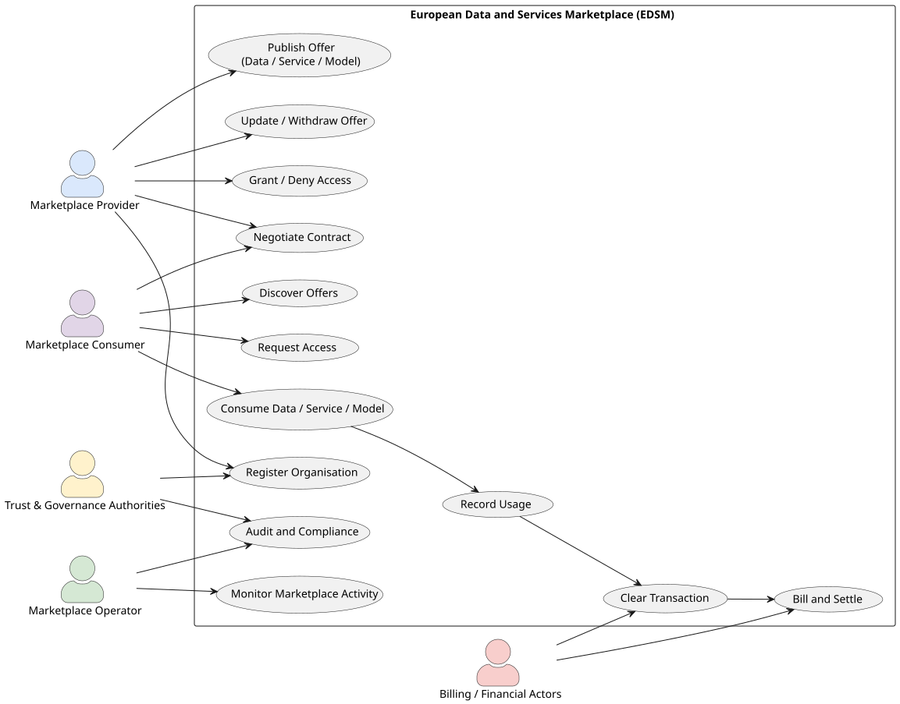
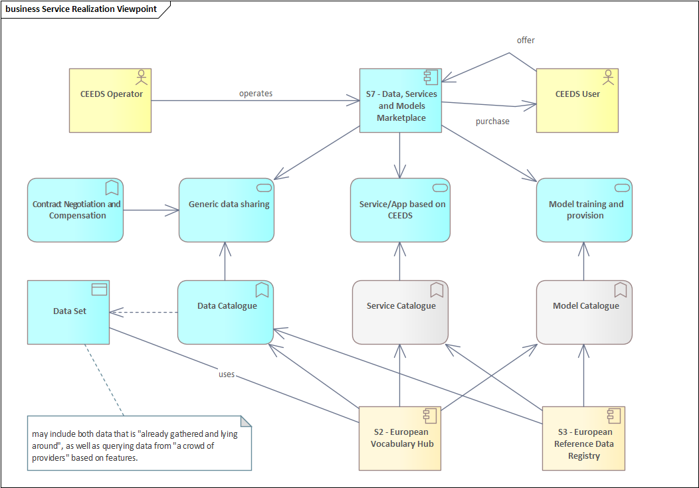
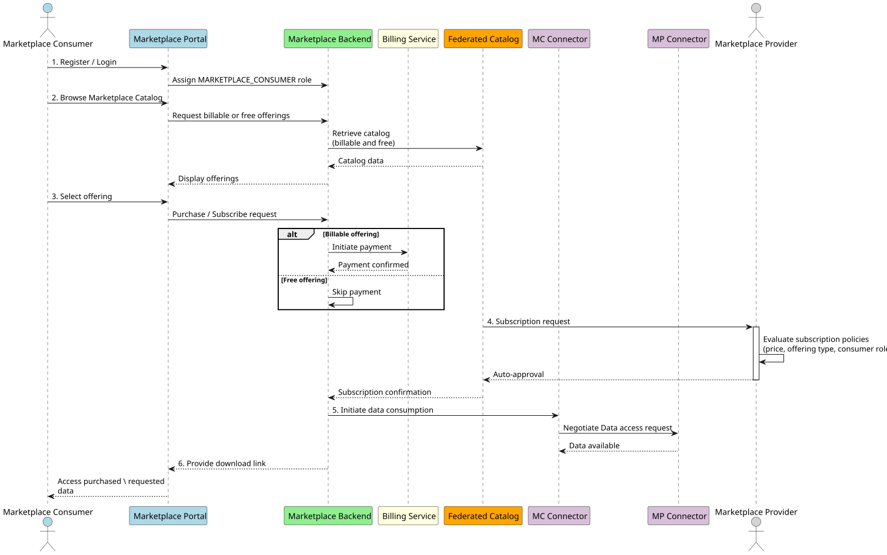

## Function and Objective

The European Data and Services Marketplace (EDSM) is a **meta-level operating service** designed to enable **trusted discovery, access, contracting, and monetisation** of data products and digital services within federated data space ecosystems.

Its primary function is to act as a **marketplace and coordination layer** that connects data and service providers with consumers, making offerings visible and comparable, enabling controlled access, supporting contractual relationships, and managing the economic flows associated with data and service consumption.

EDSM does not participate in the operational exchange of data itself (see Data Space Connector); instead, it orchestrates the *commercial, contractual, and governance aspects* that precede and accompany data and service usage.

### Scope of the EDSM

Within its functional scope, the EDSM provides the core operational functions of the marketplace environment, including:

- Participant onboarding and role management under shared governance rules  
- Offer lifecycle management, including publication, update, and withdrawal  
- Support for offer discovery through federated catalogues  
- Management of access request workflows and contractual agreements  
- Coordination of provisioning via references to external data access mechanisms (connectors) and endpoints  
- Support for metering, clearing, billing, and settlement processes  
- Monitoring, auditability, and reporting for operational and compliance purposes  

These functions describe *what the EDSM does*, while the Business Capabilities section defines *how these functions are structured and grouped* within the marketplace.  

Data service providers may link into this marketplace to offer their services, such as:

- Forecasting and data analysis for pivotal information model data
- Crowdsourcing of data based (e.g. feature-based request for data)
- Refinement of data
- Storage and accessibility of regulated data (e.g. forecast charging capacity of charging stations collected from Charge Point Operators (CPO), data from the ENTSO-E Transparency Platform, market
  data, etc.)
- Storage and accessibility of statistical data
- Privacy and pseudonymisation

---

### Positioning within the Data Space Architecture

The EDSM operates at **meta-level** within the overall data space architecture, above individual data providers and consumers, and in coordination with other cross-cutting services such as:

- Identity and Trust services  
- Vocabulary and semantic services  
- Reference data registries  
- Connector-based data exchange infrastructures  

From an architectural perspective, the EDSM combines and extends established **Data Space patterns**, including:

- **Federated Catalogue** capabilities, inspired by Gaia-X catalogues, for offer publication and discovery  
- **Connector and Marketplace** functionalities as described in the IDS Reference Architecture Model (IDS-RAM)  
- **Contracting and Clearing** patterns aligned with IDS Clearing House concepts, enabling billing and settlement  

In this positioning, the EDSM provides a unifying marketplace layer
that integrates discovery, trust, contracting, and economic coordination,
while remaining decoupled from the underlying data exchange mechanisms.

---

### Separation of Responsibilities

The EDSM operates as a marketplace and orchestration layer, clearly separated from
the technical data exchange infrastructure.

- The **EDSM Marketplace** is responsible for:
  - Offer publication and discovery  
  - Contract definition and agreement  
  - Access request management  
  - Economic coordination (clearing, billing, settlement)  

- The **Data Space Connectors** are responsible for:
  - Technical enforcement of access policies  
  - Secure data and service exchange  
  - Execution of data transfers and service interactions  

This separation ensures that the EDSM manages the *business and contractual aspects*
of data sharing, while the connectors manage the *technical execution and enforcement*
of data exchange operations.

---

## Business Architecture
<!-- 
The Business Architecture focuses on business requirements. It outlines the structure and operation of an organization, including business goals, functions, processes, and organizational structure. 
See: https://www.fconsulting.tech/togaf-10-understanding-the-7-core-concepts/
-->

This section describes the business architecture of the European Data and Services Marketplace (EDSM),
covering business goals, core capabilities, actors, and their interactions,
providing a structured view of how business value is created and exchanged within the marketplace ecosystem.

### Business Goals

The European Data and Services Marketplace (EDSM) aims to establish a **trusted, regulated, and interoperable European market infrastructure** for energy-related data, services, and models.  
The strategic business goals of the EDSM are:

- **Enable a European energy data economy** by facilitating cross-border data sharing and interoperability  
- **Support digital innovation** through data-driven and AI-based services  
- **Create sustainable business models** for data, services, and models  
- **Enable monetisation** of digital assets while supporting free-of-charge offerings  
- **Ensure regulatory compliance**, trust, and data sovereignty  
- **Foster ecosystem growth** by enabling multi-stakeholder participation  
- **Promote reuse and interoperability** of existing European digital infrastructures  
- **Support federated governance models** aligned with European dataspace principles  

The EDSM acts as a **market-enabling platform** that transforms data into economic, operational, and strategic value for the European energy sector.

---

### Business Capabilities

To achieve these goals, the EDSM provides the following core business capabilities:

#### Market Enablement
- Digital marketplace creation  
- Data, service, and model commercialisation  
- Ecosystem orchestration  
- Multi-actor market participation  

#### Data Economy Enablement
- Data discovery and indexing  
- Federated data access  
- Trusted data sharing  
- Data sovereignty preservation  

#### Service Economy Enablement
- Data-driven service provisioning  
- AI service provisioning  
- Model training and provision  
- Application and service marketplace support  

#### Governance and Trust
- Identity and trust management  
- Contract-based access control  
- Policy enforcement  
- Regulatory compliance support  
- Auditability and traceability  

#### Economic and Financial Management
- Contract negotiation  
- Compensation mechanisms  
- Transaction tracking  
- Clearing services  
- Billing and invoicing  
- Settlement and monetisation  

#### Interoperability and Federation
- Semantic interoperability  
- Cross-platform integration  
- Dataspace federation  
- Connector-based interoperability  
- Cross-project infrastructure reuse  

These capabilities position the EDSM as a **foundational business infrastructure** for the European energy data ecosystem, enabling scalable, sustainable, and trustworthy digital markets.

From a business perspective, the EDSM acts as a **market-enabling infrastructure** that connects:
- Data providers (e.g. grid operators, CPOs, market operators, statistical authorities)
- Service providers (analytics, forecasting, refinement services)
- Model and AI service providers
- Consumers (energy companies, aggregators, researchers, public authorities)
- Platform operators and regulatory stakeholders

The marketplace supports the full business lifecycle of data, services, and models, including:  
**discovery → negotiation → access → usage → transaction tracking → clearing → billing → settlement**, enabling sustainable economic flows and long-term ecosystem viability.

---

### Business Lifecycle

The EDSM supports the following end-to-end lifecycle:

Discovery → Contracting → Access → Usage → Clearing → Billing → Settlement

This lifecycle is consistently reflected across use cases,
application flows, and supporting architectural components.

---

### Actors and Business Roles
The EDSM business architecture involves the following primary actors:

- **Marketplace Providers**: organisations offering data, models, or services  
- **Marketplace Consumers**: organisations consuming marketplace offerings  
- **Marketplace Operator**: entity responsible for operating and governing the platform  
- **Trust and Governance Authorities**: entities ensuring identity, trust, and compliance  
- **Billing / Financial Actors**: entities supporting financial execution and settlement   

These actors interact through the EDSM to establish business relationships that are later realised through technical data exchanges outside the marketplace boundary. 

The following table summarises the main business actors interacting within the EDSM ecosystem,
highlighting their roles and responsibilities in the marketplace.

| Actor | Description | Role in EDSM |
|------|-------------|--------------|
| **Marketplace Providers** | Organisations that publish data products, models, or digital services through the marketplace, define commercial terms, and receive compensation for usage. | Provide offerings to the marketplace and manage pricing, access conditions, and monetisation. |
| **Marketplace Consumers** | Organisations that search, access, and consume data products, models, or services under agreed contractual and pricing conditions. | Discover, request access to, and consume marketplace offerings under defined contracts. |
| **Marketplace Operator** | Entity responsible for operating and governing the EDSM, ensuring availability, trustworthiness, and correct execution of marketplace processes, including billing. | Ensures platform operation, governance, policy enforcement, and overall marketplace coordination. |
| **Trust and Governance Authorities** | Entities (or federated services) that define participation rules, validate identities and credentials, and support trust and compliance across the ecosystem. | Enable trust, identity validation, and enforcement of governance rules and compliance requirements. |
| **Billing / Financial Actors (internal or external)** | Actors involved in payment execution, financial settlement, or regulatory compliance related to invoicing and taxation. | Support billing, payment processing, settlement, and financial compliance within the marketplace ecosystem. |

The following table maps business actors to the core capabilities of the EDSM.

| Actor | Key Capabilities |
|------|----------------|
| Marketplace Providers | Offer management, pricing, contract negotiation, access control |
| Marketplace Consumers | Discovery, access request, consumption |
| Marketplace Operator | Governance, monitoring, policy enforcement |
| Trust and Governance Authorities | Identity validation, compliance, trust enforcement |
| Billing / Financial Actors | Clearing, billing, payment, settlement |

---

### Involved Systems and External Dependencies
From a business architecture perspective, the EDSM interacts
with the following external systems and services.

These elements are described here in terms of their business role,
while their technical realisation is further detailed in the
Service Realization Viewpoint. 

- **S1 – Identity Register**, providing authentication, authorisation, and credential validation 

- **S2 – European Vocabulary Hub**, ensuring consistent interpretation and classification of offers 

- **S3 – European Reference Data Registry**, supplying authoritative codes and classifications used in business processes 

- **Federated Catalogue**, providing the publication, indexing, and discovery of offers related to data products, models, and digital services 

- **Data Space Connectors**, enabling the contractual access, secure exchange, and actual consumption of data, models, and services based on the results of marketplace discovery and contracting workflows 

- **Billing, Accounting, and Payment Systems**, supporting invoicing, payments, and financial reconciliation

The following table summarises the main systems and external dependencies
interacting with the EDSM, highlighting their role within the marketplace ecosystem.

| System / Service | Type | Description | Role in EDSM |
|-----------------|------|------------|--------------|
| **S1 – Identity Register** | External Core Service | Provides authentication, authorisation, and credential validation. | Enables trusted access control and identity management for all marketplace participants. |
| **S2 – European Vocabulary Hub** | External Core Service | Ensures consistent interpretation and classification of offers. | Supports semantic interoperability and harmonised understanding of data, models, and services. |
| **S3 – European Reference Data Registry** | External Core Service | Supplies authoritative codes and classifications used in business processes. | Provides standardized reference data to ensure consistency in transactions and contracts. |
| **Federated Catalogue** | Core Marketplace Service | Provides publication, indexing, and discovery of offers related to data products, models, and services. | Enables marketplace discovery and visibility of available offerings across the ecosystem. |
| **Data Space Connectors** | Infrastructure / Integration Layer | Enable contractual access, secure exchange, and actual consumption of data, models, and services. | Execute data exchange and enforce access policies based on marketplace discovery and contracts. |
| **Billing, Accounting, and Payment Systems** | External Financial Systems | Support invoicing, payments, and financial reconciliation. | Manage monetisation processes including billing, payment handling, and settlement. |

These systems support the EDSM business operations but remain
logically independent, enabling a federated and interoperable architecture.

---

### Offer Types

Within the EDSM, all offerings exposed through the marketplace are classified into one of the following **Offer Types**. This classification is used consistently across business, functional, and component views of the architecture.

- **Data Offer**  
  An offering providing access to datasets or data products. Data offers describe the content, structure, semantics, quality attributes, access conditions, and pricing of the data, while the actual data exchange is performed externally via data space connectors.

- **Model Offer**  
  An offering providing access to analytical, simulation, or AI/ML models. Model offers describe model purpose, inputs and outputs, execution conditions, licensing, and pricing. Models may be consumed as services or deployed and executed in external environments, but are discovered, contracted, and monetised through the EDSM.

- **Service Offer**  
  An offering providing access to digital services, APIs, or applications. Service offers describe functionality, interfaces, service levels, usage policies, and commercial terms, while service execution remains outside the EDSM boundary.

The term **offer** is used generically throughout this document to refer to any of the above offer types (Data, Model, or Service), unless stated otherwise.

---

### Use Case Viewpoint

The Use Case Viewpoint describes the main business-level interactions between ecosystem actors
and the European Data and Services Marketplace (EDSM).
It captures *who* interacts with the marketplace and *for what purpose*, focusing on value creation,
responsibilities, governance, and contractual relationships, independently from any technical or implementation details.

This viewpoint provides a clear and shared understanding of the EDSM business scope,
highlighting how data, services, and models are discovered, accessed, governed, and monetised
within a federated European dataspace ecosystem.

The use cases presented below form the business foundation for the EDSM
and are subsequently realised through the services, platforms, and components
described in the Service Realization Viewpoint.

| Actor | Description | Main Interactions with EDSM |
|------|-------------|-----------------------------|
| **Marketplace Providers** | Organisations that publish data products, models, or digital services through the marketplace, define commercial terms, and receive compensation for usage. | Register organisation; publish, update or withdraw offers; negotiate contracts; grant or deny access to offerings. |
| **Marketplace Consumers** | Organisations that search, access, and consume data products, models, or services under agreed contractual and pricing conditions. | Discover offers; request access; negotiate contracts; consume offerings. |
| **Marketplace Operator** | Entity responsible for operating and governing the EDSM, ensuring availability, trustworthiness, and correct execution of marketplace processes, including billing. | Monitor marketplace activity, ensure platform operation, and enforce governance and policies. |
| **Trust and Governance Authorities** | Entities (or federated services) that define participation rules, validate identities and credentials, and support trust and compliance across the ecosystem. | Support identity validation, enforce participation rules, and enable audit and compliance processes. |
| **Billing / Financial Actors** | Actors involved in payment execution, financial settlement, or regulatory compliance related to invoicing and taxation. | Support transaction clearing, billing, invoicing, payment processing, and financial settlement. |

Each use case contributes to the realisation of one or more business capabilities,
ensuring alignment between business goals, actor interactions, and marketplace functionality.

**Note:**  
The use cases *Record Usage*, *Clear Transaction*, and *Bill and Settle* represent
internal marketplace processes supporting transaction tracking, validation,
and economic settlement across the ecosystem. These processes may involve
external financial systems and clearing mechanisms interacting with the EDSM.

The above use cases represent the core business interactions supported by the EDSM
and are realised through the services and architectural components described
in the following Service Realization Viewpoint.

Together, these use cases reflect the full lifecycle of marketplace
interaction, from discovery to economic settlement.

---

### Traceability between Actors, Use Cases, Capabilities and Components

The following table provides a traceability view linking business actors,
use cases, business capabilities, and supporting architectural components.
This ensures alignment between business objectives, system functionality,
and technical realisation within the EDSM.

| Actor | Use Case | Business Capability | Supporting Components |
|------|----------|--------------------|-----------------------|
| Marketplace Providers | Register Organisation | Governance and Trust | Middleware, Identity Services (S1) |
| Marketplace Providers | Publish / Update / Withdraw Offer | Market Enablement | Marketplace, Federated Catalogue |
| Marketplace Providers | Negotiate Contract | Economic and Financial Management | Marketplace, Contracting Services |
| Marketplace Providers | Grant / Deny Access | Governance and Trust | Marketplace, Connector |
| Marketplace Consumers | Discover Offers | Data Economy Enablement | Federated Catalogue, Marketplace |
| Marketplace Consumers | Request Access | Economic and Financial Management | Marketplace, Contracting Services |
| Marketplace Consumers | Negotiate Contract | Economic and Financial Management | Marketplace |
| Marketplace Consumers | Consume Data / Service / Model | Service Economy Enablement | Data Space Connector |
| Marketplace Operator | Monitor Marketplace Activity | Governance and Trust | Middleware, Marketplace |
| Marketplace Operator | Audit and Compliance | Governance and Trust | Middleware, Clearing House |
| Trust and Governance Authorities | Register Organisation | Governance and Trust | Identity Services (S1), Middleware |
| Trust and Governance Authorities | Audit and Compliance | Governance and Trust | Clearing House, Middleware |
| Billing / Financial Actors | Clear Transaction | Economic and Financial Management | Clearing House |
| Billing / Financial Actors | Bill and Settle | Economic and Financial Management | Billing System |
| Billing / Financial Actors | Record Usage | Economic and Financial Management | Connector, Clearing House |

---

### Service Realization Viewpoint

<!-- 
The Service Realization Viewpoint pattern creates elements that show how one or more business services are realized by the underlying processes (and sometimes by application components). 
Thus, it forms the bridge between the business products viewpoint and the business process view. It provides a "view from the outside" on one or more business processes. 
See: https://sparxsystems.com/resources/tutorials/archimate/#Service-Realization-Viewpoint
-->

<!-- TODO: Update ArchiMate Service Realization Viewpoint diagram -->

The Service Realization Viewpoint describes how business objectives are implemented through **digital services, platforms, and technical components** within the EDSM ecosystem.

#### Middleware Layer

Providing governance, identity management, semantic interoperability, and discovery services, including:

- **Federated Catalog Discovery**
  - **Data Catalog**
  - **Service Catalog**
  - **Model Catalog**
- Identity management
- Data model services
- Semantic interoperability
- Integration with European core services (S1, S2, S3)
- **Integration with the OneNet Connector**

The Middleware acts as the **control and governance plane** of the EDSM ecosystem.

---

#### Data Space Connector Layer

The **Data Space Connector** layer enables **trusted and federated data exchange**.

This layer provides:
- Generic data sharing  
- Dataset management  
- Secure data exchange  
- Enforcement of negotiated contracts and compensation mechanisms  
- Policy-based access control  
- Data service creation  
- End-to-end encrypted communication  

**Implementation assumption:**
- The **OneNet Connector** can be used as the technical implementation of the connector layer  
- The Data Space Connector layer is **integrated with the OneNet Middleware**

This layer represents the **transactional and operational core** of data sharing and data exchange.

---

#### Marketplace Layer *(To Be Identified and Evaluated)*

The Marketplace represents the **commercial and user-facing interface** of the EDSM.

It provides:
- **Data Catalog**
- **Service Catalog**
- **Model Catalog**
- **Model Training and Provision**
- Service and application provisioning
- User interaction interfaces
- Access to AI services and data-driven applications
- Integration with billing and invoicing systems

**Marketplace identification assumptions:**
The Marketplace solution is **not yet defined** and will be identified and evaluated based on:
- Reuse of existing project solutions
- Alignment with European dataspace initiatives
- Interoperability and governance requirements

**Candidate solutions under evaluation:**
- **ENERSHARE**
- **Other existing European platforms or project solutions**

---

#### Clearing House *(To Be Identified and Evaluated)*

The Clearing House is a **separate and independent component**, integrated with the **Data Space Connector layer**.

It provides:
- Data transaction logging  
- Monitoring of data exchanges  
- Traceability of data flows  
- Auditability of transactions  
- Integration with Data Space and Marketplace  

The Clearing House ensures **transparency, accountability, and trust** across all data exchanges.

To Be Identified... ??

---

#### Billing System *(To Be Identified and Evaluated)*

The Billing System is integrated with the **Marketplace** and provides:
- Cost calculation  
- Invoicing  
- Payment management  
- Support for free-of-charge and chargeable services  
- Integration with external financial systems  

It enables **data, service, and model monetisation** and supports sustainable business models.

To Be Identified... ??

---

#### External Integration Services

The EDSM integrates with other services:

- **S1 – Identity Register**  
  Authentication, identity management, trust services

- **S2 – European Vocabulary Hub**  
  Semantic interoperability and controlled vocabularies

- **S3 – European Reference Data Registry**  
  Reference data governance and harmonisation

#### Component Descriptions

##### Middleware
Central governance and orchestration layer providing:
- Federated discovery (Data, Service, Model)
- Identity management
- Semantic interoperability
- Integration with OneNet Connector
- Integration with European core services (S1, S2, S3)

---

##### Data Space Connector
Operational layer providing:
- Federated data sharing
- Secure data exchange
- Contract-based access
- Compensation mechanisms
- Policy enforcement
- Integration with OneNet Middleware
- Implementation through OneNet Connector

---

##### Marketplace *(To Be Identified and Evaluated)*
Commercial layer providing:
- Data, Service, and Model catalogs
- Model training and provision
- Application and service provisioning
- User access interfaces
- Billing and monetisation integration

Candidate implementations under evaluation:  
**ENERSHARE or other open European solutions**

---

##### Clearing House
Governance and trust layer providing:
- Transaction logging
- Exchange monitoring
- Traceability
- Auditability
- Integration with Data Space + Connector and Marketplace

---

##### Billing System
Economic layer providing:
- Cost calculation
- Invoicing
- Payments
- Monetisation support
- Financial integration

---

##### External Core Services
- **S1 – Identity Register**
- **S2 – European Vocabulary Hub**
- **S3 – European Reference Data Registry**

<!-- TODO: Insert descriptions of Realization Viewpoint components -->

### Architectural Principles

- Separation of business and technical responsibilities  
- Federated interaction model  
- Data sovereignty by design  
- Interoperability and standard alignment  
- Modular and extensible architecture  

---

## Data Architecture

<!-- 
Data Architecture pertains to the management of data, both physical and logical.
It involves data assets, databases, data models, and the governance of data across the enterprise.
See: https://www.fconsulting.tech/togaf-10-understanding-the-7-core-concepts/
-->

(Placeholder – to be completed) 

This section will describe the Data Architecture of the EDSM, including: 
- Core data concepts and information objects (e.g. Offer, Contract, Usage Record) 
- Data ownership and responsibility boundaries 
- Interaction with external data space services (catalogues, registries, connectors) 
- Data lifecycle, data quality, and governance considerations 

### Data Objects

<!-- TODO: Insert list/table of data objects and their descriptions -->

## Application Architecture

## Scope and Architectural Principles
This section defines the Application Architecture of the European Data and Services Marketplace (EDSM) at a logical, technology‑agnostic level. 

The Application Architecture describes how the functional capabilities are realised through a set of application components and application services, and how these components cooperate to deliver end‑to‑end marketplace behaviour. 

## Core Functional Capabilities
From a functional viewpoint, EDSM provides the following capability domains.

### Participant and Offer Onboarding
- Registration of organisations and users 
- Validation of identities and credentials 
- Association of participants with roles (provider, consumer) 

### Offer and Metadata Management
The EDSM manages offers in a type-aware but uniform manner, applying common governance and lifecycle rules while supporting specific metadata dimensions depending on the Offer Type (Data, Model, Service).

### Discovery and Search
- Federated search across published offers 
- Filtering, ranking, and comparison

### Access Request and Contracting
- Submission and tracking of access requests 
- Negotiation of contractual terms 
- Management of contract agreements 

### Metering, Clearing, and Billing
- Collection or ingestion of usage events 
- Rating and pricing 
- Invoicing and settlement 

### Governance, Monitoring, and Audit
- Enforcement of marketplace governance rules 
- Operational, compliance, and financial reporting 
- Auditable traceability of actions and events 

## Application Components Overview
The Application Architecture of the EDSM is composed of a coherent set of logical application components. For clarity, components are grouped into logical application domains, without implying deployment or ownership boundaries. 

User Interaction 

- FC‑01 Marketplace Portal 

Provides user‑facing access for data and service providers and consumers, acting as the primary interaction entry point to EDSM capabilities. 

Marketplace Core Services 

- FC‑02 Federated Catalogue - Discover & Search Engine 

Manages offer metadata, publication, versioning, and lifecycle, and exposes offers at marketplace level. It also enables federated search, filtering, ranking, and comparison of offers. 

- FC‑03 Data Space Connector 

Enable the contractual access, secure exchange, and actual consumption of data, models, and services based on the results of marketplace discovery and contracting workflows 

Contracting and Economic Coordination 

- FC‑04 Contracting and Policy Management 

Manages access requests, negotiations, contract agreements, and associated commercial and usage policies. 

- FC‑05 Metering and Usage Collection 

Collects and aggregates usage evidence related to offer consumption. 

- FC‑06 Billing Management 

Performs rating, invoicing, and settlement based on contractual terms and observed usage. 

Governance and Trust 

- FC‑07 Trust, Governance, and Compliance 

Enforces marketplace governance rules, eligibility checks, compliance monitoring, and auditability. 

### Mapping between Business Capabilities and Application Components

| Business Capability | Supporting Components |
|--------------------|----------------------|
| Market Enablement | Marketplace, Federated Catalogue |
| Data Economy Enablement | Federated Catalogue, Connector |
| Service Economy Enablement | Connector, Marketplace |
| Governance and Trust | Middleware, S1 |
| Economic and Financial Management | Clearing House, Billing |
| Interoperability and Federation | Connector, Middleware |

## Application Services and Responsibilities
Each application component exposes one or more Application Services that collectively realise the functional capabilities described in Section 4.2 

Indicative application‑service responsibilities include: 

- Marketplace Portal (FC‑01) 

  - User interaction for offer management, discovery, contracting, and billing views 
  
- Federated Catalogue and Offer Registry (FC‑02) 

  - Offer publication and lifecycle management 
  - Offer metadata retrieval and subscription to lifecycle events 

- Discovery and Search Engine (FC‑02) 
  - Federated search execution 
  - Filtering, ranking, and comparison of offers

- Data Space Connector (FC‑03)
  - Negotiation of technical access requests with external connectors  
  - Establishment of secure communication channels for data and service exchange  
  - Enforcement of access and usage policies defined in contracts  
  - Execution of data/service consumption through connector-based interaction  

- Contracting and Policy Management (FC‑04) 
  - Access request handling and negotiation support 
  - Contract agreement and lifecycle management 
  - Association of policies and commercial terms to offers 

- Metering and Usage Collection (FC‑05) 
  - Ingestion of usage events 
  - Aggregation and validation of usage evidence 

- Billing and Clearing (FC‑06) 
  - Usage rating and pricing 
  - Invoice generation and settlement coordination 

- Trust, Governance, and Compliance (FC‑07) 
  - Participant and offer eligibility evaluation 
  - Enforcement of governance rules 
  - Audit logging and compliance reporting 

#### Interaction Flows (Sequence Viewpoint)
The following interaction flows illustrate how the EDSM components
collaborate to realise the key business use cases described previously.

These sequence diagrams provide a dynamic view of the system,
showing the exchange of information between actors and components
during typical interactions such as offer discovery, access request,
contract negotiation, and usage tracking.

They complement the Service Realization Viewpoint by detailing
how services are orchestrated at runtime across the EDSM ecosystem.

The sequence diagram illustrates the end-to-end interaction flow for a marketplace consumer
accessing data or service offerings through the EDSM.

The interaction flow can be grouped into three main phases:
(1–2) Discovery, (3–4) Contracting, and (5–6) Consumption.

**(1) Registration and authentication.**  
The process starts with the Marketplace Consumer accessing the Marketplace UI to perform
registration or login. Upon successful authentication, the Marketplace Backend assigns the
appropriate *MARKETPLACE_CONSUMER* role, enabling access to marketplace functionalities.

**(2) Discovery of offerings.**  
The consumer browses the marketplace catalog through the UI. The Marketplace Backend retrieves
available offerings (both billable and free) from the Federated Catalog and presents them to
the user for exploration and comparison.

**(3) Selection and purchase / subscription request.**  
Once an offering is selected, the consumer initiates a purchase or subscription request.
For billable offerings, the Marketplace Backend interacts with the Payment Service to process
the payment and waits for confirmation before proceeding. For free offerings, the payment step
is skipped.

**(4) Subscription approval by the provider.**  
Following the request, a subscription request is forwarded to the Marketplace Provider via the
Federated Catalog. The provider evaluates the request according to predefined policies
(e.g. pricing conditions, offering type, and consumer role) and returns an approval, which is
propagated back to the Marketplace Backend.

**(5) Data access negotiation and consumption.**  
After subscription confirmation, the Marketplace Backend initiates the data consumption process
through the Marketplace Connector. The connector negotiates access with the Provider Connector,
establishing the conditions for data or service access. Once the negotiation is successful,
the requested resource becomes available.

**(6) Delivery and access to the resource.**  
Finally, the Marketplace Backend provides a download or access link to the user via the UI,
allowing the Marketplace Consumer to access the purchased or requested data or service.

This interaction flow demonstrates how the EDSM orchestrates user interaction, catalog discovery,
subscription management, and federated data access across distributed components, while ensuring
consistent handling of both free and billable offerings.

These phases correspond to the business lifecycle defined in the Business Architecture.

<!-- 
The Application Architecture describes individual applications and their interactions.
It addresses software applications and their role in supporting business processes and functions.
See: https://www.fconsulting.tech/togaf-10-understanding-the-7-core-concepts/
-->

### Application Cooperation Viewpoint

<!--
The Application Cooperation Viewpoint pattern creates elements a diagram that describe the relationships between applications components  and their locations, the services they provide or utilize and the information that flows between them.
See: https://sparxsystems.com/resources/tutorials/archimate/#Application-Cooperation-Viewpoint
-->

<!-- TODO: Insert ArchiMate Cooperation Viewpoint diagram -->

#### Component Descriptions

<!-- TODO: Insert descriptions of Application Cooperation Viewpoint components -->

## Technology Architecture

<!--
The Technology Architecture involves the IT infrastructure, including hardware, software, networks, and services.
It ensures that the infrastructure supports the application and data requirements of the business.
See: https://www.fconsulting.tech/togaf-10-understanding-the-7-core-concepts/
-->

(Placeholder – to be completed) 

This section will describe the Technical Architecture supporting the EDSM, including: 

- Deployment and infrastructure assumptions 
- Integration with external platforms and services 
- Security, networking, and operational aspects 
- Constraints derived from regulatory or organisational contexts 

### Deployment View

<!-- 
The Implementation and Deployment Viewpoint pattern creates elements and a diagram that relate programs and projects to the parts of the architecture that they implement.
This view allows modeling of the scope of programs, projects, project activities in terms of the plateaus that are realized or the individual architecture elements that are affected.
In addition, the way the elements are affected may be indicated by annotating the relationships.
See: https://sparxsystems.com/resources/tutorials/archimate/#Application-Cooperation-Viewpoint
-->

<!-- TODO: Insert ArchiMate Deployment View diagram -->

#### Component Descriptions

<!-- TODO: Insert descriptions of Deployment View components -->
