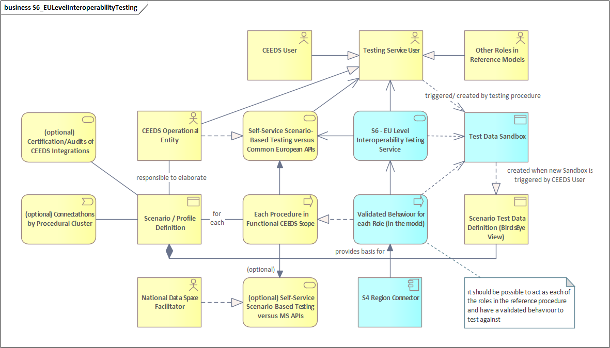
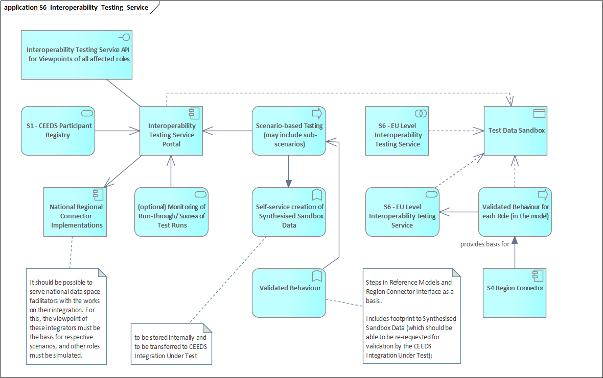

## Function and Objective

The **European Interoperability Testing Service (EITS)** provides **validated, quality-assured test sandboxes** and **scenario-based interoperability tests** for **CEEDS Users** implementing integrations across the **regulated-domain scope** of the **Common European Energy Data Space (CEEDS)**. Its objective is to make **testing and quality assurance** **cheap**, **easy**, and **automatable**, so that interoperability is achieved early (“**shift-left**”) and repeatedly, rather than as a costly late-stage activity.

EITS enables CEEDS Users to trigger **pre-validated test environments** (with pinned **vocabulary versions**, **reference data snapshots**, and realistic **identities/roles/permissions**) and execute **end-to-end scenario test suites** aligned to **CEEDS functional building blocks** and **reference procedures**. Test execution produces **machine- and human-readable evidence bundles** (assertions, logs/traces, timestamps, environment fingerprints), enabling repeatability, comparability, and—later—**certification-ready evidence**.

At **European level**, EITS is **curated and governed** by the **CEEDS Operational Entity (OE)**, ensuring consistent interpretation of procedures and controlled evolution of scenarios and test datasets. Optionally, **National Data Space Facilitators (NDSFs)** may operate **national instances** aligned to the European baseline, including national profiles and extensions where necessary—supporting **federation without fragmentation**.

---

## Business Architecture

### Service Realization Viewpoint

#### Component Descriptions

- **Business Service – S6 Interoperability Testing Service**: The externally consumed capability providing **validated sandboxes**, **scenario test execution**, and **QA evidence** for CEEDS integrations.
- **CEEDS User / Implementer**: Initiates sandbox provisioning, selects scenarios, runs tests, consumes evidence outputs for development QA and onboarding readiness.
- **CEEDS Operational Entity (Curator)**: Maintains the **scenario catalogue**, quality criteria, release/version governance, and adjudicates ambiguities in expected behaviour.
- **National Data Space Facilitator (optional)**: Operates a national instance aligned to EU baseline and may extend with national profiles, while keeping **traceable compatibility**.
- **Assessor (optional)**: In later phases, reviews locked-version evidence bundles for **formal certification/attestation** or supervised conformity checks.

**Application services (realising the business service):**
- **Sandbox Provisioning API**: Creates/resets/tears down sandboxes; manages lifecycle, TTL, and deterministic environment configuration.
- **Scenario Orchestration API**: Executes scenario packs; coordinates step sequencing, counterpart simulation, and controlled error paths.
- **Evidence & Reporting API**: Provides structured test outputs (reports, metrics, traces) and exports **evidence bundles**.
- **Scenario Catalogue API**: Exposes scenario packs, profiles, coverage metadata, versions, and deprecation status.

**Application components (realising the application services):**
- **Sandbox Manager**: Produces validated datasets/endpoints, provisions identities and authorisation contexts; pins semantics and versions.
- **Test Orchestrator**: Drives scenario execution, schedules test runs, coordinates harness and SUT, and triggers evidence capture.
- **Test Harness**: Acts as **qualified counterpart** (or controlled simulator), performs assertions, and supports both synchronous and asynchronous patterns.
- **Evidence Store**: Persists execution artefacts, logs/traces, assertions, and exports evidence bundles (machine + human readable).
- **Scenario Catalogue**: Stores scenario definitions, test profiles, requirements mapping, and version lifecycle metadata.

**Key dependencies:**
- **S2 European Vocabulary Hub (EVH)**: Provides **vocabulary resolution** and version pinning to stabilise semantics during testing.
- **S3 European Reference Data Registry (ERDR)**: Supplies **reference data snapshots** used to validate and populate test sandboxes.
- **IAM / Trust Services**: Issues sandbox identities, roles, credentials, and scoped permissions to represent realistic access contexts.

---

## Data Architecture

EITS uses a structured set of **test artefacts** to ensure repeatable and automatable quality assurance. Data is versioned to guarantee reproducibility and comparability across time, implementations, and jurisdictions.

### Data Objects

- **Scenario Definition**: A versioned description of a business-relevant test case including prerequisites, steps, expected outcomes, and negative/error paths.
- **Scenario Pack / Profile**: A curated collection of scenarios grouped by building block, reference procedure, and actor viewpoint (e.g., DSO, service provider).
- **Sandbox Configuration**: A deterministic description of the sandbox environment: endpoints, enabled services, pinned versions, and lifecycle parameters.
- **Test Dataset**: Synthetic or derived data aligned to CEEDS reference models, including pinned vocabulary versions and reference data snapshots.
- **Test Identities & Roles**: Test accounts/identities with scoped roles and permissions/consents representing realistic access patterns.
- **Execution Log / Trace**: Structured records of interactions and events during scenario execution, correlation IDs, and timing metrics.
- **Assertion Results**: Machine-readable test verdicts per step and per scenario (pass/fail/partial), including diagnostics.
- **Evidence Bundle**: Exportable package combining scenario versions, environment fingerprint, logs/traces, assertions, and timestamps for QA and audit.
- **Coverage Map**: Mapping from requirements/reference procedures to scenarios and assertions, enabling test completeness measurement.

---

## Application Architecture

EITS is built around a **scenario-driven orchestration** pattern, where the **SUT (system under test)** interacts with a **qualified counterpart** (test harness) inside a controlled sandbox, with end-to-end evidence captured by the platform.

### Application Cooperation Viewpoint

#### Component Descriptions

- **CEEDS Integration Under Test (SUT)**: The implementation being validated (vendor platform, DSO connector, gateway, service backend).
- **S6 Test Orchestrator**: Coordinates scenario execution, triggers sandbox provisioning, drives steps, and controls sequencing and timing.
- **S6 Test Harness**: Simulates/implements the counterpart role(s) needed for scenarios and performs assertions on expected behaviour.
- **S6 Sandbox Manager**: Provisions sandbox datasets, endpoints, and access contexts; pins semantics and versions (EVH/ERDR/IAM).
- **S6 Evidence Store**: Aggregates execution artefacts and exports evidence bundles (for QA, onboarding readiness, later certification).

**Cooperation flows (typical test lifecycle):**
1. **Provision sandbox**: Orchestrator requests sandbox with chosen profile/version set; Sandbox Manager retrieves pinned vocabularies (EVH), reference snapshots (ERDR), and issues test credentials (IAM).
2. **Execute scenarios**: Orchestrator drives steps and triggers interactions between SUT and Test Harness via API/messaging patterns.
3. **Capture evidence**: Orchestrator and Harness produce logs/traces/assertions; Evidence Store compiles a structured bundle for export.
4. **Automate & repeat**: CI/CD pipelines can call the APIs to run regression suites and compare outcomes across releases.

---

## Technology Architecture

EITS is intended to be operated as a **highly automated platform service**, supporting ephemeral sandboxes, reproducible environments, and API-first automation.

### Deployment View

**Deployment concept (high-level):**
- **European instance** operated by the **CEEDS OE**:
  - multi-tenant access for CEEDS Users
  - curated EU baseline scenarios and versioned artefacts
  - shared evidence store and reporting interfaces
- **Optional national instances** operated by **NDSFs**:
  - national profiles and extensions
  - alignment to EU baseline scenario packs and version governance
  - optional local connectivity/testing constraints

**Typical runtime elements:**
- **API gateway / ingress** for provisioning/orchestration/reporting endpoints
- **Sandbox runtime** (ephemeral environments, datasets, credentials)
- **Orchestrator & harness execution** (scalable workers)
- **Observability stack** (logs/traces/metrics)
- **Evidence store** (object storage + metadata DB)
- **Integration connectors** to EVH/ERDR/IAM and other CEEDS services

#### Component Descriptions

- **Orchestrator Workers**: Stateless executors scaling horizontally for parallel scenario runs.
- **Sandbox Runtime**: Short-lived, reproducible test environments with TTL and reset support.
- **Evidence Storage**: Durable storage for bundles + metadata; supports export and retention policies.
- **Integration Layer**: Standardised connectors to EVH, ERDR, IAM and observability services.
- **Governance & Release Tooling**: Controls publication of scenario packs, dataset versions, and deprecation cycles.

---