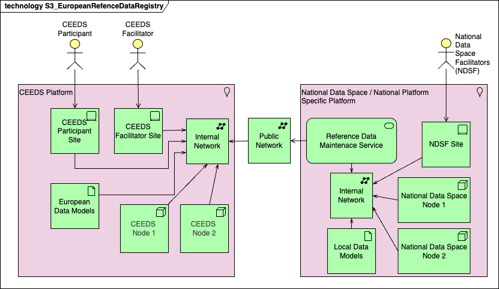
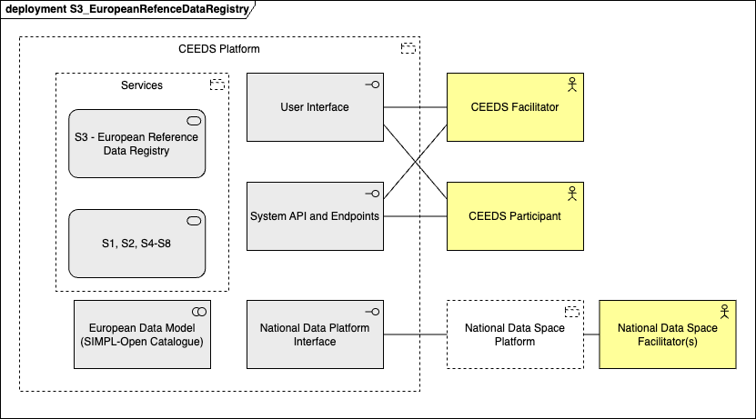

## Function and Objective

Hosts certified reference data on roles, actors, and market infrastructures essential for automation.

Typically, this structural data (e.g. lists of important data on Permission Administrators, DSOs or Market Platforms) is highly needed to guarantee an efficient functioning of automated solutions
within the scope of CEEDS. The lack of accessibility of this data places a huge gap for data-driven energy markets as of now (see Deliverable 5.2 of Project EDDIE).

CEEDS Facilitator is responsible to provide standardized interfaces in a Common Information Model for National Data Space Facilitators (NDSF) to provide that data in a standardized manner, as well as
keeping audits and versioning. NDSFs should be responsible to collect and maintain updates of the reference data, and to certify its correctness.

Based on DSSC business and organisational building blocks the motivation for an European Reference Data Registry can be resumed by:
- **Use Case Development**: Data space use cases are settings where two or more participants create business, societal or environmental value from data sharing. Use case development amplifies such value of a data space.
- **Data Space Offering**: The data space offering consists of the set of offerings available in a data space to participants. Offerings contain data product(s), service(s), and the offering description that provides all the information needed for a potential consumer to make a decision whether to consume the data product(s) and/or the service(s) or not.

The main technical building blocks addressed by European Reference Data Registry are:
- **Data Models**: Data models ensure that data is accurately and consistently interpreted when exchanged within a data space. The data model consists of metadata that provides information about semantics, helping to interpret the actual exchanged data. Versioning and version management is a must have functionality for Data Models management.
- **Provenance and traceability**: additional metadata alongside the shared data for auditing and compliance purposes might be required.  

The main functions:
- common European metadata definition and management, including explicit versioning responsibility of CEEDS Facilitator
- common energy market reference data model representation, maintenance by CEEDS Facilitator
- reference data model access for CEEDS Participants
- national reference data model definition and management can be maintained by National Data Space Facilitator (NDSF)
- enhancement and mapping of national reference data model to European reference data model will be under the responsibility of National Data Space Facilitator (NDSF)

## Business Architecture

<!-- 
The Business Architecture focuses on business requirements. It outlines the structure and operation of an organization, including business goals, functions, processes, and organizational structure. 
See: https://www.fconsulting.tech/togaf-10-understanding-the-7-core-concepts/
-->

The main actors and systems interacting with European Reference Data Registry service:

Actor/System | Description
---|---
National Data Space Facilitators (NDSF) | Actor responsible for National Data Space management, in particular the definition and maintenance of the specific metadata that can be shared with CEEDS Participants about national data models. The NDSF has access via the National Reference Data Maintenance Service. NDSF are responsible for providing and maintaining updates of the mappings of national data models to common European data model. 
CEEDS Facilitator | Actor having access to the European Reference Data Registry interface for metadata management. This includes data catalog, service catalog, access management, rights management. The main responsibility is to define and enhance European reference data standard model.
CEEDS Participant | Participant having access to the services related to common European reference data model.
Energy Market Reference Data | A collection of reference data specific to each national data space used to aggregate specific code lists, taxonomies, schemas, data models.
S3 - European Reference Data Registry | CEEDS service providing access to common European reference data model to CEEDS Participants.

### Service Realization Viewpoint

<!-- 
The Service Realization Viewpoint pattern creates elements that show how one or more business services are realized by the underlying processes (and sometimes by application components). 
Thus, it forms the bridge between the business products viewpoint and the business process view. It provides a "view from the outside" on one or more business processes. 
See: https://sparxsystems.com/resources/tutorials/archimate/#Service-Realization-Viewpoint
-->

<!--

-->
#### Component Descriptions

<!-- TODO: Insert descriptions of Realization Viewpoint components -->

Component | Description
---|---
National Reference Data Maintenance Service | Service allowing the National Data Space Facilitators (NDSF) to create and maintain national reference data and to create mappings from national data models to common European data models.
Interface for NDSF to update national reference data | Interface allowing the NDSF to maintain national reference data models and feeds the to Reference Data Maintenance Service.
Reference Data Maintenance Service | Service ingesting the national data curated and prepared by NDSF and feeding it to the European Reference Data Registry.
Energy Market Refrence Data | Aggregated reference data at national data space level. It has multiple data models and various data sources, including administrative permissions and access rights. The data model is maintained by NDSF.
European Reference Data Registry | Component that ingests data from national data space and transforms it into common European data format. The common European data models are maintained by the CEEDS Facilitator.
Reference Data Provision Service | Service allowing the transformed data to be exposed to CEEDS Participants.
Common European-wide unique identification | Function part of the Reference Data Provision Service that exposes the UUID of a specific CEEDS Participant 
Change Notifications | Function part of the Reference Data Provision Service that notifies changes of a specific national data model or changes in common European data model.
Query reference data | Function part of the Reference Data Provision Service that allow for querying and searching of both national and common European data models.
CEEDS Participant Application | Application facing the CEEDS Participant exposing the functions of Reference Data Provision Service via Web interface.

## Data Architecture

<!-- 
Data Architecture pertains to the management of data, both physical and logical.
It involves data assets, databases, data models, and the governance of data across the enterprise.
See: https://www.fconsulting.tech/togaf-10-understanding-the-7-core-concepts/
-->

The European Reference Data Registry should be able to handle multiple data models, and versions of same data model. It should contain a repository of metadata that allows defining, storing, and managing the currently identified national data models and the common European data model. The recommended data architecture is a combination of data catalog, meta data repository and basic data transformation tools - from national data model to and from common European data model, allowing transparent data transactions between CEEDS participants.

Looking at the exiting tools proposed by DSSC that can be used to implement the data architecture the following candidates are suggested:
- SIMPL-Open Catalogue
- Ocean Enterpirse Catalogue and Aquearius Catalogue Cache

### Data Objects

CEEDS data model is based on the reference model for metering and consumption data access as specified in [Annex I of Commission Implementing Regulation (EU) 2023/1162](https://eur-lex.europa.eu/legal-content/EN/TXT/HTML/?uri=CELEX:32023R1162#anx_1)

The data exchange shall be based on an ETSI-CEN-CENELEC set of standards (e.g. EN IEC 62325-351 and considering other relevant European initiatives such as the Harmonised Electricity Market Role Model (HEMRM) and the International Electrotechnical Commission’s Common Information Model (CIM).

Here are the references for data objects to be used:
- **EN IEC 62325-351** the European Style Market Document (ESMP) as published by [ENTSO-E](https://www.entsoe.eu/publications/electronic-data-interchange-edi-library/#Common_information_model__CIM__European_style_market_profile) consisting of a user guide, XSD, code list and component
- **ISO8601** for date/time formats
- **ISO19139** for annotation of high-value datasets in geometadata.

Further usage of other standards, especially dealing with electro mobility, are still part of ongoing discussion in the CIM TC57 working group 21. The result will be published at the Bridge energy schemas Github.

The data model used by this service is based on reuse of work from previous European projects: [EDDIE](https://github.com/eddie-energy/eddie/tree/main/masterdata), [ENTSO-E](https://www.entsoe.eu), and [Digital4Grids](https://github.com/Digital4Grids/) 

#### List and Specification of Reference Data Objects

Based on identified [Reference models](../../reference-models/reference-models.html), the service S3 will be used by the following procedures:

Procedure: **T4-2_01 Access to Metering and Consumption Data**
- 02 Access to validated historical metering and consumption data by an eligible party
- 03 Termination of service by an eligible party

Pocedure: **T4-2_02 Access to Basic Master Data**
- 02 Access to accounting point master data by an eligible party
- 03 Termination of access to accounting point master data by the eligible party
- 05 Revocation of access to accounting point master data by the final customer
- 06 Access to market party master data
- 07 Access to list of market parties by their role

Procedure: **T4-2_03 Access to implicit flexibility signals**
- 01 Access to residual supply price for period
- 02 Access to residual grid fee for period
- 03 Access to CESU supply price for period
- 04 Access to CESU grid fee for period

Procedure: **T4-2_04 Customer Switching**
- 01 Switching supplier
- _02 Cancellation of switching supplier (optional)_

Procedure: **T4-3_01 Collective Self-Consumption and Energy Communities**
- 01 Registration of a collective energy sharing unit
- 02 CESU operator queries if metering point may be assigned
- 03 Final customer queries if metering point may be assigned to a CESU
- 04 CESU operator requests metering point to be added to the unit [optionally] with the info of
- 05 CESU operator requests metering point to be assigned to CESU data eligible party too
- 06 CESU operator requests accounting point to be removed from CESU a
- 07 Final customer requests its accounting point to be removed from CESU
- 08 Support to short-term flexibility markets
- 09 Energy management w/wo flexibility provision
- 10a Flexibility verification and settlement done by FRP
- 10b Flexibility verification and settlement done by flexibility market operator or other third-party support tool
- 11a Receive self-consumption information for CESU without CESU intervention
- 11b Receive self-consumption information for CESU from CESU dynamic allocation
- 12 CESU internal settlement w/wo flexibility provision
- 13 Direct access to its own data by CESU member
- 14 Change the allocation mechanism of the CESU
- 15 Company qualification for participating in flexibility markets
- 16 Assets qualification for participating in flexibility markets

The payload for each procedure must be modeled and stored in the European Reference Data Registry. 

We will provide in the next sections a non exhaustive list of samples of data models. The European Reference Data Registry must be able to handle any type of data models and data model changes. 

Common European data models extracted form [Annex I of Commission Implementing Regulation (EU) 2023/1162](https://eur-lex.europa.eu/legal-content/EN/TXT/HTML/?uri=CELEX:32023R1162#anx_1)

I1. National Competent Authority

I2. Information on Member State data management set-up

I3. Information about metered data administrators in a Member State

I4. Information about metering point administrators in a Member State

I5. Information about data access provider

I6. Information about permission administrators in a Member State

I7. Information about standardised near real-time interfaces of smart meters or smart metering systems in a Member State

National and platform data models extracted from [EDDIE](https://github.com/eddie-energy/eddie/tree/main/masterdata)

Data Access Provider

Data Exchange Environment

Metered Data Administrator

Metering Point Administrator

National Competent Authority

Near Realtime Data Interface

Permission Administrator

## Application Architecture

<!-- 
The Application Architecture describes individual applications and their interactions.
It addresses software applications and their role in supporting business processes and functions.
See: https://www.fconsulting.tech/togaf-10-understanding-the-7-core-concepts/
-->

The European Reference Data Registry service main function is to store and serve the common European data model and data catalogue. As secondary function should provide services (API and/or UI) that allows national data platform facilitators to create, store and manage national data models, and to provide the mappings from national data models to common European data models.  
The service can be developed and hosted by National Data Space platform for the part concerning the national data model management and mapping. For the common European data model and data catalogue the service should be centralised and the models must be synchronized (in case of distributed implementation). The service should have the possibility to function off-line, it is the responsibility of National Data Space platform to synchronise and update the data from CEEDS.

### Application Cooperation Viewpoint

<!--
The Application Cooperation Viewpoint pattern creates elements a diagram that describe the relationships between applications components  and their locations, the services they provide or utilize and the information that flows between them.
See: https://sparxsystems.com/resources/tutorials/archimate/#Application-Cooperation-Viewpoint
-->

The European Reference Data Registry service main function is to store and provide common European data model for CEEDS participants facilitating data exchange. This implies explicit version management of data models. The mapping of national data models to common European data model is the direct responsibility of the National Data Space Facilitator and to synchronize with the latest version of common European data model. The National Data Space Facilitator must share the mapping with the CEEDS platform so that that all CEEDS participants are able to use the mapping for data transactions.

Taking into account the dynamics of common European data model updates, it is safe to say that offline service is acceptable and S3 - European Reference Data Registry is not on the critical path for CEEDS operations. It is the responsibility of the local National Data Space Facilitator to synchronize National Data Space reference data repository with CEEDS reference data repository.

#### Main operations and procedures

Actor | Operation | Description
---|---|---
National Data Space Facilitator | Manages Energy Market Reference Data | The NDSF is responsible for gathering, updating and maintaining all versions of national reference data, including the access rights structures and service catalogue.
National Data Space Facilitator | Manages Mapping to common European data model | The NDSF is responsible for updating the local copy of the common European data model (including multiple versions) and the mapping of national data model to common European data model. The system should allow the National Data Space Facilitator to push the mappings to CEEDS platform to S3- European Reference Data Registry.
CEEDS Facilitators | Manages common European data model(s) | The CEEDS Facilitator must maintain multiple versions of common European data model as Reference Data Model. A copy of mappings to national data models will be stored along each version of common European data model.
CEEDS Participant | Reads and queries common European data model | The CEEDS Participant should be able to retrieve the data catalogue, including multiple versions, and query the European Reference Data Registry.

#### Component Descriptions

<!-- TODO: Insert descriptions of Application Cooperation Viewpoint components -->

Module | Componenet | Description
---|---|---
National Data Space | Energy Market Reference Data Object | It is collection and national specific data models, including permission administrtor, that is used for data exchange. The NDSF must maintain all current and past versions, and keep track of the services and service versions that are using those data.
National Data Space | National Reference Data Maintenance Service | Interface allowing the NDSF to maintain the local national data models and their corresponding meta models.
National Data Space | Reference Data Maintenance Service | This services allows the NDSF to create and maintain the mappings between national data models and the common European data model. Both national data models and common European data models can have multiple active versions.
CEEDS Platform | European Reference Data Registry | Interface allowing the CEEDS Facilitator to create and maintain the common European data model. Multiple versions may be active at the same time. The interface has an API for connecting to National Data Space Reference Data Maintenance Service allowing NDS to retrieve and store the latest version(s) of common European data models.
CEEDS Platform | Reference Data Provision Service | Back end service aggregator providing read and query access to CEEDS Participants for common European data model.
CEEDS Platform | CEEDS Participant Application Service | UI and API exposing the common European data models to CEEDS Participants and their paltforms/systems.

## Technology Architecture

<!--
The Technology Architecture involves the IT infrastructure, including hardware, software, networks, and services.
It ensures that the infrastructure supports the application and data requirements of the business.
See: https://www.fconsulting.tech/togaf-10-understanding-the-7-core-concepts/
-->

The motivation behing the proposed technology architecture is to guarantee the separation of functionalities and responsibilites. On CEEDS platform side, the European Reference Data Registry service can be offline for short periods and can be implemented in a distributed manner. The part of the service that is hosted on National Data Space platform must store the common European refrence data and implement a mechanism to check and sychronize with CEEDS.

### Deployment View

<!-- 
The Implementation and Deployment Viewpoint pattern creates elements and a diagram that relate programs and projects to the parts of the architecture that they implement.
This view allows modeling of the scope of programs, projects, project activities in terms of the plateaus that are realized or the individual architecture elements that are affected.
In addition, the way the elements are affected may be indicated by annotating the relationships.
See: https://sparxsystems.com/resources/tutorials/archimate/#Application-Cooperation-Viewpoint
-->

The deployment should take into consideration modern technologies such as: containerisation (Docker, Kubernetes, OpenShift) and/or virtualization (Vagrant). The deployment can be done both in the Cloud or On Premise. Considering hybrid deployment should not be an option, this will introduce more complexity to the overall solution.

The following software solutions were considered for European Data Model storage and management:
- [SIMPL-Open Catalogue](https://code.europa.eu/simpl)
- [Ocean Enterpirse Catalogue and Aquearius Catalogue Cache](https://docs.oceanprotocol.com/developers/metadata)

For the existing National Data Space platform, it is recommended to use the already existing modules or compatible solutions for data model management. A specific service and connector should be developed in order to communicate with CEEDS. This component will connect to CEEDS National Data Platform Interface to push local data model mappings to CEEDS common European data model and to synchronize local National Data Space platform with CEEDS common European data model.

#### Component Descriptions

Component | Service | Deployment description
---|---|---
CEEDS Platform | Service S3 - European Data Registry | Internal component of CEEDS allowing to store and manage common European data models. It stores the mappings between national data models and common European data models provided by National Data Space platform.
CEEDS Platform | European Data Model component | The main functionality is to store and manage common European data models. It can be read or queried by CEEDS Participants and it is managed by CEEDS Facilitators.
CEEDS Platform | User interface | Web application offering access to CEEDS platform for CEEDS Facilitator and CEEDS Participants 
CEEDS Platform | System API and Endpoints | Direct access CEEDS platform for system to system communication.
CEEDS Platform | National Data Platform Interface | Interface used by National Data Platform Reference Data Maintenance Service to send mappings of local data models to common European data model to CEEDS and also to synchronize local common European data model with CEEDS version of the model.  

A general requirement for European Data Model component is to be able to manage multiple versions of data models and to store mappings of local national data models to common European data model. This will allow multiple versions of data models to be used by CEEDS Participants in their transactions. We do expect to have a dynamic period at the beggining of CEEDS and multiple versions for common data models, schema and other metadata to be used in parallel. The objective for the medium/long term is to use maximum 2 major version of the data model in parallel. The proposed versioning schema is [semantic versioning](https://semver.org/):
- each version is described by 3 numbers separated by full stop Major.minor.patch
- a Major version bump implies breaking changes in the data model
- a minor version bump implies backward compatibility within the same Major version
- a patch version bump implies backward compatibility within the same Major and minor version

The Reference Data Maintenance Service must be developed and implemented by the National Data Space manager. This service may reuse the client libraries developed for S2 - European Vocabulary Hub.

#### Solution Analysis

##### Introduction and objectives

We will proceed to a comparative analysis of the possible technical solutions that could be considered for the implementation of European Reference Data Registry service. The main functions that should be covered by the Reference Data Registry (according to [DSSC](https://toolbox.dssc.eu/?pane=technical&f%5Bquery%5D=fair&technical=data-models)) is to enable semantic interoperability among data space participants through the use of shared data models. This allows:
- participants of dataspaces to interpret each other's data.
- the development, reuse and governance of data models within and across data spaces.
- the semantic annotations of datasets.

The retained capabilities:
- **Data model development** - reuse or develop data models to ensure uniformity and interoperability
- **Data model governance** -  governance and management aspect of data models, including tools and processes to maintain data models and to ensure wide consensus regarding the data model used in the data space.
- **Data model integration** - the description of the data offering should include a reference to the data model that explains the structure and semantics of the datasets.
- **Data models across data spaces** - standardized discovery of data models across data spaces, support multiple data spaces to become semantic interoperable.

We are looking particularly to host and manage:
- **Application Profile**: An application profile is a data model for applications that fulfill a particular use case. In addition to shared semantics, it also allows additional restrictions to be imposed, such as recording cardinalities or the use of certain code lists. An application profile can serve as documentation for analysts and developers
- **Data Schema**: Data exchange technology specific representation of the application profile, including the syntax, structure, data types, and constraints for the data exchange

From technical point of view we are comparing:
- Integration with third-party systems: REST-ful API and DCAP-AP compatible
- Data model formats: RDF schema, SHACK for RDF, OWL, SKOS, JSON Schema, XML Schema, Schematron.

##### Analysis

Criteria | SIMPL-Open Catalogue | Ocean Catalogue and Aquearius Catalogue 
---|---|---
Data model development | Schema Registry that is used by Catalogue component. | Limited to Ocean protocol 
Data model integration | Search engine, Vocabulary Datastore, Management Service, Syntax validation service, semantic validation service | Data model discovery on blockchain
Data models across data spaces | Schema management | Limited to blockchain 
Application profile | Schema management | None 
Data Schema | Schema management |  Blockchain specific
Integration with thirdparty systems | API | None
Data model formats | RDF, SHACL, JSON Schema | JSON Schema 

##### Recommendations

SIMPL-Open seems to be ready for use and deployment. We do recommend that a PoC should be performed before any decission and commitment is made. The major concern is the compatibility with the other technology that will be used for the rest of the servicecs.