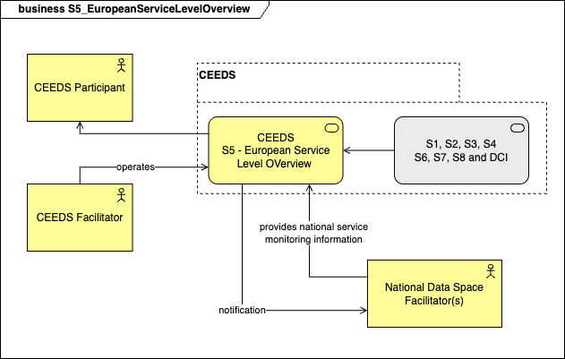
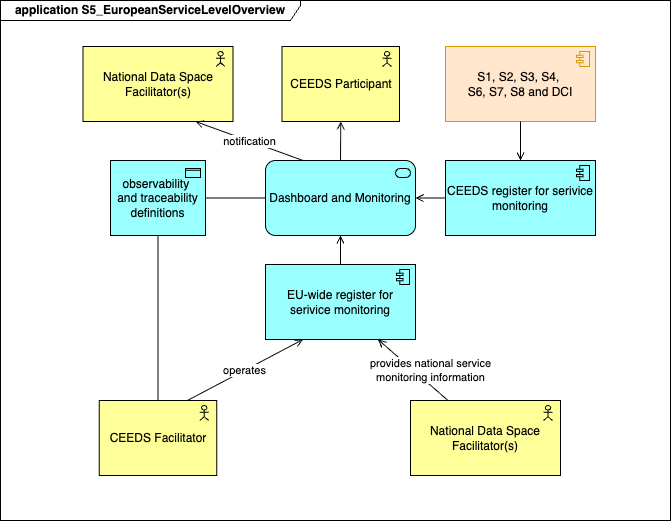
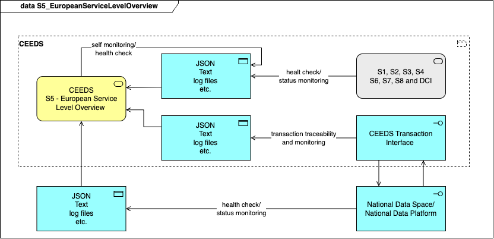
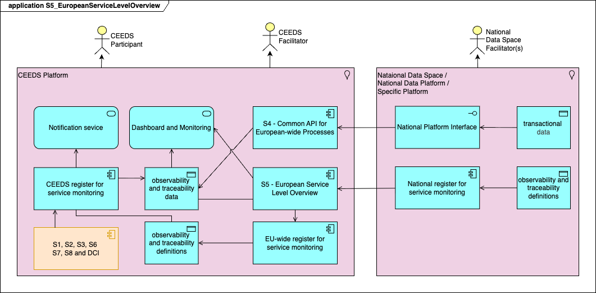
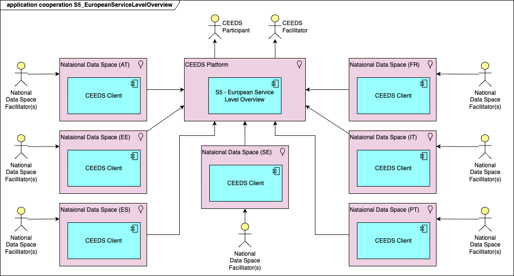
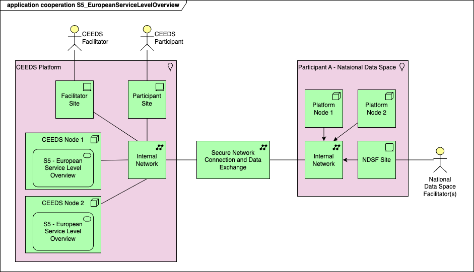
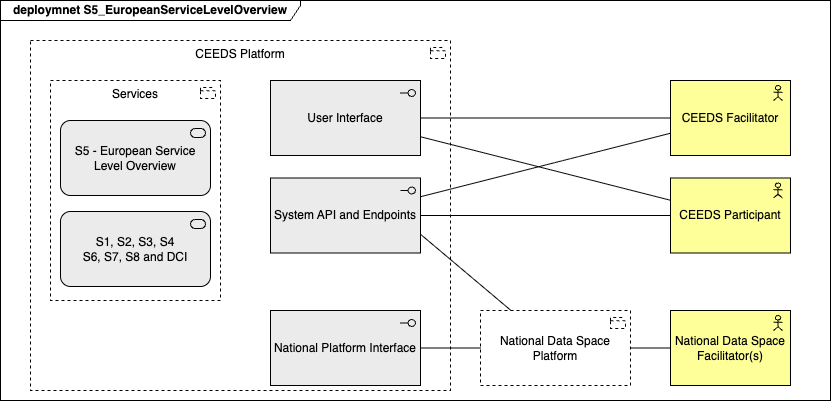

## Function and Objective
Monitors and publishes service availability, reliability, and KPIs across CEEDS and Member States Data Space or Data Solutions. 

National Data Space Facilitators (NDSF) shall be responsible to provide reliable, up-to-date and valid assessments of service levels for National Data Platform, whilst the CEEDS Facilitator shall be responsible for CEEDS services and transaction monitoring setup. CEEDS should publish a visual overview, and machine-readable information for the operational use by European-wide actors. 

The European Service Level Overview should cover the following functionalities:
- CEEDS services self check and report,
- Registration API for periodical health check of CEEDS services and Participant services
- Visual dashboard for direct monitoring of the service status
- Notification mechanisms (email, SMS, direct message etc.) of the responsible in case of service degradation or intervention. The support for CEEDS services are responsibility of CEEDS facilitator and the support for National Data Spaces or National Data Platforms are the responsibility of the NDSFs.
- Establish a framework for a trusted environment by providing verifiable evidence that services and processes are functioning and executed according to agreed rules and regulations.

From DSSC point of view the service must cover:
1. **Observability** - the ability to monitor, measure and understand the internal states of processes through its outputs such as logs, metrics and traces.
1. **Traceability** - the quality of having an origin or course of development that may be found or followed.
1. **Provenance** - the place of origin or earliest known history of something. Usually it is the backwards-looking direction of a data value chain which is also referred to as provenance tracking.

| Roles | Responsibilities |
|---|---|
National Data Space Facilitator(s) (NDFS) | <ul><li>Creates National Data Space entries for observability and traceability</li><li>Registers the information with S5 - European Service Level Monitoring.</li><li>Designates contact information in case of National Data Service malfunction or interruption.</li></ul>
CEEDS Facilitator | <ul><li>Manages the observability and traceability entries.</li><li>Creates CEEDS self check entries</li><li>Designates the contacts in case of intervention and support.</li></ul>
CEEDS Participant | <ul><li>Can access and visualize the dashboard, and status reports.</li><li>Can request to register new observability and traceability entries.</li></ul>

## Business Architecture

<!-- 
The Business Architecture focuses on business requirements. It outlines the structure and operation of an organization, including business goals, functions, processes, and organizational structure. 
See: https://www.fconsulting.tech/togaf-10-understanding-the-7-core-concepts/
-->

The S5 service - European Service Level Overview provides services for and interacts with the following actors and systems:

| Actor/System | Description |
---|---
National Data Space Facilitator (NDSF) | The NDSF interacts with S5 via API or the Web interface allowing to define the national systems observability and traceability parameters. This includes mandatory contact for system support and service.
National Data Space / National Data Platform | Each system that interacts with CEEDS or provides specific data and/or services from a Participant at CEEDS. The system must be able to respond to check calls from S5. The NDSF will define and configure those endpoints so that the data collected for monitoring and alert by CEEDS S5 should be fully available. The list of services provided by NDS must contain the services defined in the [Reference Models](../../reference-models/reference-models.html).
CEEDS Participant | Any physical person or system that will interact with CEEDS. In particular, S5 service must be able to register the transactions between participants for audit and traceability.
CEEDS Facilitator | A physical person that will configure the internal CEEDS services data for monitoring and traceability. The responsibility is only to CEEDS components and services, for national data spaces and national systems the NDSF is responsible.
CEEDS services | Any service that is part of CEEDS:<ul><li>S1 - CEEDS Participants Registry (CPR)</li><li>S2 - European Vocabulary Hub (EVH)</li><li>S3 - European Reference Data Registry (ERDR)</li><li>S4 - Common API for European-wide Processes (CAEP)</li><li>S6 - European Interoperability Testing Service (EITS)</li><li>S7 - EU-wide Regulated-Domain Services (ERDS)</li><li>S8 - European Data and Services Marketplace (EDSM)</li><li>Digital Customer Interface (DCI)</li></ul> Those services must implement an API allowing health check and status request.

### Service Realization Viewpoint

<!-- 
The Service Realization Viewpoint pattern creates elements that show how one or more business services are realized by the underlying processes (and sometimes by application components). 
Thus, it forms the bridge between the business products viewpoint and the business process view. It provides a "view from the outside" on one or more business processes. 
See: https://sparxsystems.com/resources/tutorials/archimate/#Service-Realization-Viewpoint
-->

The S5 service must allow NDSF and CEEDS Facilitators to dynamically register and configure the end points to be monitored, the contact information for intervention and support, and to access the dashboard and reports. S5 service should allow the CEEDS Facilitator to define transactions and data flows that should be monitored together with the notifications that should be send in case of error of failure.

#### Component Descriptions

<!-- TODO: Insert descriptions of Realization Viewpoint components -->

| Component | Description |
|---|---|
| CEEDS register for service monitoring | The interface is available for the CEEDS Facilitator to register the status and health check information for CEEDS service and for S5 self diagnostic.
| EU-wide register for service monitoring | The interface allows the NDSFs to register the information about National Data Spaces status and health check information. The execution rights are managed by the CEEDS Facilitator. 
| Observability and traceability definition | Internal repository where all check points are stored, both CEEDS and National Data Space specific. The data collected by the execution of those controls will be processed and displayed on the dashboard.
| Dashboard and Monitoring | Application facing the users: CEEDS Participants and NDSFs designated contacts.

## Data Architecture

<!-- 
Data Architecture pertains to the management of data, both physical and logical.
It involves data assets, databases, data models, and the governance of data across the enterprise.
See: https://www.fconsulting.tech/togaf-10-understanding-the-7-core-concepts/
-->
The European Service Level Overview should be able to collect data about the system status and service health of internal CEEDS services, including itself and of all external national data spaces or data platforms that are supposed to be available for transactions between CEEDS Participants. For National Data Spaces CEEDS will collect information about the endpoints only, the systems and interfaces that are exposed and interacting with CEEDS. The S5 service should be able to collect data for dashboards and alert generation. The CEEDS Facilitator and CEEDS maintainers responsibility and intervention area is limited only to CEEDS platform or parts of the platform. For National Data Space the NDSF must designate a contact to be notified automatically and trigger the intervention to reestablish the service.

### Data Objects

<!-- TODO: Insert list/table of data objects and their descriptions -->

The data collected by the S5 service - European Service Level Overview must provide a concise and clear status of the CEEDS ecosystem, both central Data Space level and national level. This includes self diagnostic data. The type of data collected is explicitly defined by either CEEDS Facilitator or by NDSFs. The data is related to:
- System status (e.g. OK/NOK)
- System health check (e.g. 200 OK, 500 INTERNAL SERVE ERROR)
- System availability (e.g. 501 NOT IMPLEMENTED, 503 SERVICE UNAVAILABLE)
- Transaction status (e.g. INITIATED, IN PROGRESS, FAILED, OK, Transaction initiated, Payment received)
- CEEDS Participant activity (e.g. Successful login, Failed authentication, Data request)

The data can be in any format: JSON, plain text, XML, log files, database etc. and should be processed and displayed in an uniform way by the tool that will be selected for implementation.

List of CEEDS services to be monitored:
- S1 - CEEDS Participants Registry
- S2 - European Vocabulary Hub
- S3 - European Reference Data Registry
- S4 - Common API for European-wide Process
- S5 - European Service Level Overview (self check and monitoring)
- S6 - EU-level Interoperability Testing Service
- S7 - EU-wide Regulated-Domain Services
- S8 - European Data and Service Marketplace
- DCI - Digital Customer Interface

The services and transactions associated with the [Reference Models](../../reference-models/reference-models.html) Deployment Procedures, that will implement: Commercial Domain Reference Procedures, Regulated Domain Reference Procedures, and Data Sharing Focused Procedures. For each of those procedures the NDSF must provide the full URL for service health check, the expected response for OK and NOK, and contact information (email) in case of NOK response. Transactions initiated by Data Space Users will be monitored and traced by the S5 service. In case of failure or error, the designated person will be notified, also the subsequent transactions involving the degraded service should be put on hold. The recommendation is to queue the transaction requests and process them once the service is re-established.

## Application Architecture

<!-- 
The Application Architecture describes individual applications and their interactions.
It addresses software applications and their role in supporting business processes and functions.
See: https://www.fconsulting.tech/togaf-10-understanding-the-7-core-concepts/
-->

The main function of the European Service Level Overview is to implement observability and traceability for CEEDS and for the services that CEEDS transactions depend on - offered by National Data Spaces. The following functionalities must be implemented:

- Register and define monitoring external endpoint (for National Data Spaces) with associated notification owner in case of check failure or service unavailability
- Monitoring of CEEDS internal services
- Self monitoring and health check for the service S5
- Notification service for both CEEDS maintainers and National Data Spaces maintainers
- Transaction monitoring
- Transaction traceability

### Application Cooperation Viewpoint

<!--
The Application Cooperation Viewpoint pattern creates elements a diagram that describe the relationships between applications components  and their locations, the services they provide or utilize and the information that flows between them.
See: https://sparxsystems.com/resources/tutorials/archimate/#Application-Cooperation-Viewpoint
-->

<!-- TODO: Insert ArchiMate Cooperation Viewpoint diagram -->

National Data Spaces interaction with CEEDS Platform. 

#### Component Descriptions

<!-- TODO: Insert descriptions of Application Cooperation Viewpoint components -->
The CEEDS must be able to monitor and summarize the status and the activity of Participants, including transactions status. For internal status and activity monitoring the CEEDS Facilitator will ensure the definition and setup of the monitoring endpoints and relevant parameters, also should designate a contact email for automatic notification of the corresponding persons in case of error or service discontinuity.  
The data collected form monitoring will be processed and displayed via dashboards so that CEEDS Users can view the historical evolution of the services and the downtime.  
For National Data Spaces, the National Data Space Facilitator (NDSF) is responsible to catalogue, define and provide the necessary information for the observability of the services involved in CEEDS transactions. Only for those services exposed to CEEDS. The NDSFs must provide full information, including contact information in case of service error or unavailability, so that the S5 service can monitor those external services and collect data about their availability. This data will be displayed on CEEDS dashboards.

Actor | Operation | Description
---|---|---
National Data Space Facilitator | Catalogues of relevant services | Maintains the list of all relevant services that will involved in CEEDS transactions, especially those services that involve data transactions.
National Data Space Facilitator | Defines the list of observability parameters | For each service from the previously defined catalogue, the observability parameters must be provided so that the monitoring and alerts can be setup programmatically via the interface of S5 service.
CEEDS Facilitator | Test and setup observability scripts | Every service that must be observed, both CEEDS internal and National Data Space specific should be setup via scripts or descriptive flows so that observability is done automatically of can be automated to a high degree.
CEEDS Facilitator | Designates the CEEDS intervention team | For each CEEDS internal or external service a contact person should be defined to be contacted in case of error or disruption of service.
CEEDS User | Has access to dashboards | Each CEEDS User should have access to the dashboard of the CEEDS Platform so that they can view live dashboards, extract historical data and create reports about the status and evolution of CEEDS platform. 

## Technology Architecture

<!--
The Technology Architecture involves the IT infrastructure, including hardware, software, networks, and services.
It ensures that the infrastructure supports the application and data requirements of the business.
See: https://www.fconsulting.tech/togaf-10-understanding-the-7-core-concepts/
-->

The rationale behind the proposed technology architecture is to guarantee high availability, scalability by design, and secure data exchange. The solution from the perspective of Data Space Participant should be adapted to specific National Data Space implementation. The main building blocks that should be considered for the National Data Space:

- National Data Space Facilitator must have an interface to define and test the observability setup.
- All endpoints that are involved in CEEDS data transactions must be declared and registered for monitoring and logging purpose.
- The data exchange is via secure communication channels.
- National Data Space must provide high availability for critical services.
- NDSFs must designate a contact point for transaction errors and service maintenance.

CEEDS platform must provide User Interface for Participants and Facilitators. In particular dashboards and reporting functionality must be provided by the S5 service. The Facilitator must define the observability parameters for CEEDS internal services and for data transaction monitoring, and to approve the setup proposed by the NDSFs for National Data Space platform. The CEEDS Facilitator must designate contact points for intervention and maintenance of internal services. The service S5 must trigger automatically alerts and send messages to those contacts.

The following software solutions were considered for European Service Level Overview:

- [Apache Airflow](https://airflow.apache.org/) with [n8n](https://n8n.io/), [DAG Sketch Tool](https://github.com/camilocbarrera/dst), or [EasyDAG](https://www.easydag.com/) for workflow design
- [Apache NiFi](https://nifi.apache.org/) with [n8n](https://n8n.io/) for workflow design
- [Kestra](https://kestra.io/)

### Deployment View

<!-- 
The Implementation and Deployment Viewpoint pattern creates elements and a diagram that relate programs and projects to the parts of the architecture that they implement.
This view allows modeling of the scope of programs, projects, project activities in terms of the plateaus that are realized or the individual architecture elements that are affected.
In addition, the way the elements are affected may be indicated by annotating the relationships.
See: https://sparxsystems.com/resources/tutorials/archimate/#Application-Cooperation-Viewpoint
-->

<!-- TODO: Insert ArchiMate Deployment View diagram -->

The service S5 can be deployed in a central setup, with a hot standby instance that will be able to continue the operations in case of failure of primary active service. The service in itself is not a critical component of the CEEDS and it should be made available as soon as possible so that the alerting system is operational for the entire CEEDS platform. The most useful functionality of service S5 is checking the health of the overall systems so that the data transactions can be performed seamlessly and in case of error the corresponding parties to be notified. Logging and monitoring are secondary functionalities and help the CEEDS Participants to have a quick view on the state of the system and to produce historical reports.

#### Component Descriptions

<!-- TODO: Insert descriptions of Deployment View components -->

Component | Service | Deployment description
---|---|---
CEEDS Platform | S5 - European Service Level Overview | Service allowing the CEEDS Facilitator and National Data Space Facilitator to register monitoring and logging hooks. The service has a build in mechanism to send alerts to designated persons. The monitoring is for both internal and external services.
CEEDS Platform | S1, S2, S3, S4, S6, S7, S8, DCI | CEEDS services that must be registered with S5 for monitoring and logging. In particular the transactions that are performed via S4 - Common API for European-wide Processes should be monitored so that the concerned parties are notified in case of data transaction failure.
CEEDS Platform | User Interface | The Web User Interface that allow CEEDS Participants and CEEDS Facilitators to connect to the dashboard provided by service S5. The interface should allow the users to produce and extract reports about the historical status of the monitored systems. The UI should allow the CEEDS Facilitator to manage and validate observability scripts and scenario.
CEEDS Platform | System API and Endpoints | API and Endpoints intended for machine to machine communication, they are used to implement remote communication and exchange between CEEDS Participants, in particular for service S5 should be possible to extract and export data for reporting and processing.
CEEDS Platform | National Platform Interface | Dedicated interface for each National Data Space or National Data Platform. This interface should allow National Data Space Facilitators to connect and exchange information about observability flows with CEEDS. The User Interaction part is developed and hosted on National Data Space platform. Only the technical interface is present on CEEDS.

#### Solution Analysis
##### Introduction and Objectives

This section of the document presents a comparative analysis of the technical solutions that might be considered for the implementation of the European Service Level Overview. The main functions that should be covered by the service, based on Data Space Support Center (DSSC) recommendations:

1. **Data Transaction Execution** monitoring and reporting - provide verifiable evidence that the processes have been executed according to agreed rules and regulations.
1. **Data Traceability and Provenance** increase transparency and trust among participant by allowing activities related to data usage to be traced and verified.
1. **Transaction Reporting** enable dispute resolution by recording meta data that might serve as objective proof in case of conflict between participants on data transactions.
1. **Support operational and business purposes** by providing monitoring of highly valuable datasets also supporting billing and charging. Monitoring service availability and  
1. **Data observability** is ensured by monitoring services and data transactions and triggering alerts in case or error of systems unavailability.

The objective is to compare the following tools:

- [Apache Airflow](https://airflow.apache.org/)
- [Apache NiFi](https://nifi.apache.org/)
- [Kestra](https://kestra.io/)

All tools are either full Open-Source or have the core functionalities Open-Source. In the comparison only Open-Source version is used.

##### General business requirements

The **Observability** of service status and data transactions together with the **Monitoring and Alerting** is a requirement for a good functioning of the CEEDS Platform and to enhance the trust between CEEDS Participants. The main objective is to be able to ensure end to end trusted data transactions.  

The availability of the S5 service is not mandatory for the technical operation of CEEDS, though the luck of observability data raises a question of data traceability and provenance, also degrades the availability of the entire platform. This makes service S5 a necessary service for a functioning CEEDS system, including National Data Space endpoints.

It is strongly recommended that service S5 availability should be agreed between CEEDS Participants and the SLA must clearly designate the support and maintenance actors and backup/fallback solutions.

##### Architectural and design requirements

1. CEEDS Participant interface
   - Web User Interface must be available for monitoring dashboards and reporting
   - Role-based access control
   - Historic data export

1. Observability hooks definition
   - Scriptable hooks that allow data collection from multiple data sources and supporting multiple data formats
   - Monitoring and logging of internal CEEDS data transactions
   - Possibility to define conditions for errors and check failure with associated actions. In particular sending e-mails
   - Visual design of the hooks is a plus

##### System and integration requirements

The system and integration requirements should provide developers with necessary information and details to facilitate the implementation phase.

1. Observability hooks definition
   - The local platform (National Data Space) should provide a web interface for National Data Space Facilitator to define and test observability hook before submitting them to CEEDS
   - A contact information (email) must be always defined for the case of error or unavailability of the service
1. Data models and formats
   - Data can be collected from: API, endpoints, log files, databases
   - Data format may be: JSON, XML, and text
1. Data transaction traceability
   - Metadata should be provided for all data sets that are subject to data transactions, in particular information about data provenance
   - The endpoint/API that is exposing the data should be fully documented using OpenAPI Specifications (OAS)
   - Highly valuable datasets must contain specific information in the metadata
1. Historical data import
   - The host system (National Data Space) should allow historical data import of data transactions from CEEDS

##### Analysis

| Criteria | Apache Airflow | Apache NiFi | Kestra |
| --- | --- | --- | --- |
| Data transaction execution | Yes | Yes | Yes |
| Data traceability and provenance | Yes | Yes | Yes |
| Transaction reporting | Yes | Yes | Yes |
| Support operational and business purposes | Yes | Yes  | No |
| Data observability | Yes | Yes | Yes |
| Web Interface | Yes | No | Yes |
| Observability hooks definition | Yes | No | Yes |

##### Recommendations

