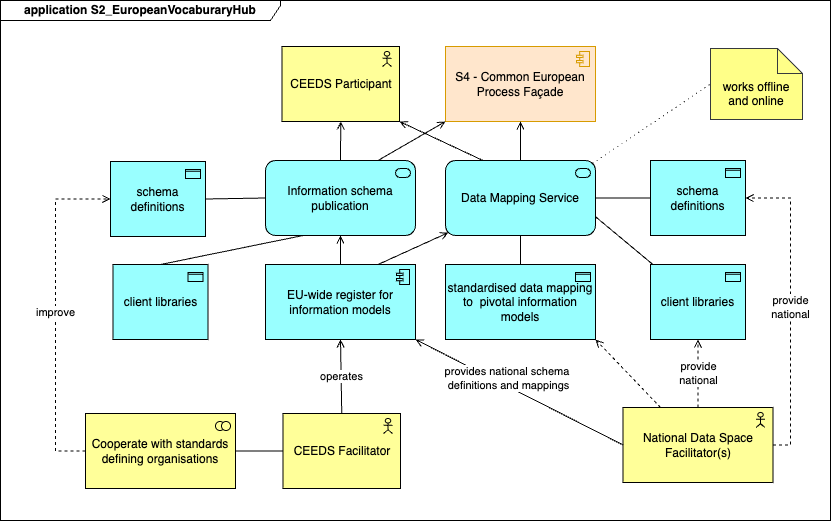

## Function and Objective

The European Vocabulary hub maintains the European Common Information Model and maps national vocabularies for semantic interoperability. The current work is based on previous EU projects: [EDDIE](https://eddie.energy/), [BRIDGE initiative](https://bridge-smart-grid-storage-systems-digital-projects.ec.europa.eu/), [Synergies](https://synergies-project.eu/), [ENTSO-E](https://www.entsoe.eu/data/cim/role-models/), [DSSC - Data Spaces Support Center](https://dssc.eu/), [Gaia-X](https://gaia-x.eu/), [SIMPL-Open](https://code.europa.eu/simpl/simpl-open/architecture/-/blob/master/functional_and_technical_architecture_specifications/Functional-and-Technical-Architecture-Specifications.md?ref_type=heads) that established a solid foundation for CEEDS.

The main objective is to provide single reference for common European code lists, thesauri, ontologies, data models, data catalogues, service catalogues, schemas that are used to map national specific data models and formats to common European data format so that CREEDS participants are enabled to perform seamless data transactions. The European Vocabulary Hub must store nad maintain the common European data model so that all CEEDS Participants can use the information and be enabled to perform data exchanges via CEEDS.

European Vocabulary Hub functions should be fully aligned with the DSSC standard functions describing the Vocabulary Hub:
1. **Storing vocabularies**: The Vocabulary Hub stores and lists valid vocabularies, making them available for the public and long-term use.
1. **Search on the semantic sources**: the Vocabulary Hub allows data space participants to search for semantic resources based on specified criteria, providing a qualified results list with links to vocabularies and other semantic resources.
1. **Documenting non-standardised data**: the Vocabulary Hub permits data space participants to include semantic information about non-standardised data during ingestion, making this information discoverable within the data space.
1. **Export semantic sources**: the Vocabulary Hub enables data space participants to export semantic sources in various formats, including serialization options or human-readable formats.
1. **Automatic integration with the catalog**: the Vocabulary Hub offers continuous integration, ensuring that the catalog of vocabularies has complete access to the semantic information of a vocabulary with appropriate user permissions.
1. **Validation of data**: the Vocabulary Hub allows data space participants to validate their data against specific vocabularies. The validation is performed at structural and eventually data type level (e.g. validation against XSD, JSON Schema, Schematron). This function can be used by S6 - European Interoperability Testing service.

Roles | Responsibilities
---|---
National Data Space Facilitator(s) (NDSF) | <ul><li>Creates and maintains the national data model, vocabularies, schemas, data catalogue etc.</li><li>Creates and maintains the mapping between the national data model and common European data model</li><li>Stores and maintains all version of common European data model</li></ul>
CEEDS Facilitator/Operator | <ul><li>Creates and maintains the common European data model, schemas, data catalogue etc.</li><li>Maintains the access rights of CEEDS Participants to S2 service.</li></ul>
CEEDS Participant/User | <ul><li>Has access to read the information from CEEDS</li><li>Can search the CEEDS data catalogue, schema etc.</li></ul>

## Business Architecture

The European Vocabulary Hub provides services for and interacts with the following actors and systems:

| Actor/System                        | Description                                                                                                                                                                                                                                                                                       |
|-------------------------------------|---------------------------------------------------------------------------------------------------------------------------------------------------------------------------------------------------------------------------------------------------------------------------------------------------|
| National Data Space Facilitator (NDSF)      | Actor responsible for National Data Space management, in particular  the definition of the specific metadata that can be shared with CEEDS, the maintenance of the corresponding ontology and maintenance of the corresponding data mapping service from National metadata to European Vocabulary metadata. NDSF are responsible for providing and maintaining updates of the mappings. Only specific National Data Space Platforms will connect to CEEDS. The access will be limited to specific participants in the CEEDS project and only specific services and data sets will be exchanged. The service catalog should be provided and maintained by NDSF.|
| CEEDS Participant                          | Participant having access to the services related to Information Schema.                                                                                                                                                                                                                                |
| CEEDS Facilitator                      | Participant having access to the European Vocabulary HUB interface for metadata management. This includes code lists, thesauri, ontology, data service catalog, data catalog, access management, rights management. It cooperates with Standard Definition Organisation to define and enhance European standard model.  One of the key responsibilities is to actively engage in the activities conducted by Standards Defining Organisations (SDOs) concerning the adoption and enhancement of the pivotal European information models.                                                                                  |
| S4 - Common European Process Facade | Service connected to S2 - European Vocabulary HUB.                                                                                                                                                                                                                                                |
| EU Vocabularies                     | EU platform maintained by Publications Office of EU, repository for code lists, vocabularies, ontologies.                                                                                                                                                                                        |

<!-- 
The Business Architecture focuses on business requirements. It outlines the structure and operation of an organization, including business goals, functions, processes, and organizational structure. 
See: https://www.fconsulting.tech/togaf-10-understanding-the-7-core-concepts/
-->

### Service Realisation Viewpoint

<!-- 
The Service Realisation Viewpoint pattern creates elements that show how one or more business services are realized by the underlying processes (and sometimes by application components). 
Thus, it forms the bridge between the business products viewpoint and the business process view. It provides a "view from the outside" on one or more business processes. 
See: https://sparxsystems.com/resources/tutorials/archimate/#Service-Realization-Viewpoint
-->

#### Component Descriptions

Component | Description
---|---
Data mapping service | The data mapping service should provide the following services and functions: <ul><li>allows national data space facilitators to map national data models into European data models</li><li>uses local schema definitions, data model to map those to common European data model</li></ul> The communication between National Data Platforms and CEEDS is via client libraries. 
Data mapping service - schema definitions | Registers and maintains all the necessary data models for exchanging and converting national data to CEEDS data models. In the process of establishing a data mapping service, communication is needed between the relevant stakeholders to semantically harmonise the data models.
Data mapping service - client libraries | Client libraries are specific for to each national data space / national platform of specific platform. They provide the following functions: <ul><li>facilitates the management of national or platform specific code lists, ontologies, data models, data catalogues, service catalogues</li><li>allows the update of local common European data model from the central repository</li><li>facilitates the data exchange between CEEDS Participants</li></ul>
standardised data mapping to pivotal information models | Data mapping from national data model to CEEDS data model. This should support default values for missing data events.
EU-wide register for information models | The register European model(s) is managed by CEEDS facilitators and contributed to National Data Space Facilitator(s). The register comprises a data model repository together with data mapping and transformation for each version, from national data model to European common data model.
Information schema publication | Service exposing the European common data model, the schema definitions via the client libraries. CEEDS Participants must use specific client library to access the common European schema.
Information schema publication - schema definitions | Common European schema definitions comprising the minimum mandatory European schema that allows for data exchange between the participants at CEEDS Data Space.
Information schema publication - client libraries | The client libraries used by information schema publication services for data exchange data in common European formats. Those client libraries provide the following functions: <ul><li>provide API for system-to-system data exchange</li><li>allow CEEDS Participants to read data and to query common European schema, data models, data catalogue</li><li>allow CEEDS Facilitator to create and maintain common European data model.</li></ul>

## Data Architecture

### Data Objects

The data exchange shall be based on an ETSI-CEN-CENELEC set of standards (e.g. EN IEC 62325-351 and considering other relevant European initiatives such as the Harmonised Electricity Market Role Model (HEMRM) and the International Electrotechnical Commission’s Common Information Model (CIM).

Here are the references for data objects to be used:
- **EN IEC 62325-351** the European Style Market Document (ESMP) as published by [ENTSO-E](https://www.entsoe.eu/publications/electronic-data-interchange-edi-library/#Common_information_model__CIM__European_style_market_profile) consisting of a user guide, XSD, code list and component
- [IEC62746-4-1 Ed.1 Explicit](https://github.com/Digital4Grids/Bridge_energy_schemas/tree/main/IEC62746-4/IEC62746-4-1%20Explicit) ESMP model for explicit flexibility
- [IEC62746-4-1 Ed.1 Implicit](https://github.com/Digital4Grids/Bridge_energy_schemas/tree/main/IEC62746-4/IEC62746-4-2%20Implicit) ESMP model for implicit flexibility
The last two provisional standards are published by Bridge energy schemas Github repository is shared on the [Digital4Grid - Bridge energy schemas](https://github.com/Digital4Grids/Bridge_energy_schemas). 
Further usage of other standards, especially dealing with electro mobility, are still part of ongoing discussion in the CIM TC57 working group 21. The result will be published at the Bridge energy schemas Github.

We will provide in the next sections a non exhaustive list of samples for code lists and data models. 

#### Code lists

The latest version of code list can be found on [ENTSO-E](https://www.entsoe.eu/publications/electronic-data-interchange-edi-library/).

The following CIMs are considered as a basis for common European Vocabulary Hub:

Validated Historical Data

Full details can be found in the document: [Validated Historical Data](https://github.com/Digital4Grids/Bridge_energy_schemas/blob/main/CEEDS/VHD/Pre-standardised/Profile%20Documentation%20for%20ValidatedHistoricalData%20message.pdf)

Redistribution Transaction Request

Full details can be found in the document: [Redistribution Transaction Request](https://github.com/Digital4Grids/Bridge_energy_schemas/tree/main/CEEDS/RTR/Project)

Real Time Data

Full details can be found in the document: [Real Time Data](https://github.com/Digital4Grids/Bridge_energy_schemas/blob/main/CEEDS/RTD/Pre-standardised/Profile%20Documentation%20for%20RealTimeData%20message.pdf)

Permission Data

Full details can be found in the document: [Permission Data](https://github.com/Digital4Grids/Bridge_energy_schemas/blob/main/CEEDS/RequestPermission/Profile%20Documentation%20for%20RequestPermission%20message.pdf)

### Reference data objects

The main models have been identified in [Reference Models](../../reference-models/reference-models.html), S2 service is used by the following procedures:

<!-- Update and sync with ../../reference-models/reference-models.html list-->

Procedure: **T4-2_01 Access to Metering and Consumption Data**
- 01	Access to validated historical metering and consumption data by the final customer
- 02	Access to validated historical metering and consumption data by an eligible party
- 03	Termination of service by an eligible party
- 06	Read near real-time data from smart meter or smart metering system

Procedure: **T4-2_02 Access to Basic Master Data**
- 01	Access to accounting point master data by the final customer
- 02	Access to accounting point master data by an eligible party
- 03	Termination of access to accounting point master data by the eligible party
- 04	Revocation of access to accounting point master data by the final customer
- 05	Access to market party master data
- 06	Access to list of market parties by their role

Procedure: **T4-2_03 Access to implicit flexibility signals**
- 01	Access to residual supply price for period
- 02	Access to residual grid fee for period
- 03	Access to CESU supply price for period
- 04	Access to CESU grid fee for period

Procedure: **T4-2_04 Customer Switching**
- 01	Switching supplier
- 02	[optional] Cancellation of switching supplier

Procedure: **T4-3_01 Collective Self-Consumption and Energy Communities**
- 01	Registration of a collective energy sharing unit
- 02	CESU operator queries if metering point may be assigned
- 03	Final customer queries if metering point may be assigned to a CESU
- 04	CESU operator requests metering point to be added to the unit [optionally] with the info of
- 05	CESU operator requests metering point to be assigned to CESU data eligible party too
- 06	CESU operator requests accounting point to be removed from CESU a
- 07	Final customer requests its accounting point to be removed from CESU
- 08	Support to short-term flexibility markets
- 09	Energy management w/wo flexibility provision
- 10a	Flexibility verification and settlement done by FRP
- 10b	Flexibility verification and settlement done by flexibility market operator or other third-party support tool
- 11a	Receive self-consumption information for CESU without CESU intervention
- 11b	Receive self-consumption information for CESU from CESU dynamic allocation
- 12	CESU internal settlement w/wo flexibility provision
- 13	Direct access to its own data by CESU member
- 14	Change the allocation mechanism of the CESU
- 15	Company qualification for participating in flexibility markets
- 16	Assets qualification for participating in flexibility markets

Procedure: **T4-4_01 Flexible Connection Agreements**
- 01	Initialization of Digital Customer Interface
- 02	Onboarding of Flexible Customer to FCA
- 03	Revocation of Flexible Connection Agreement by Customer
- 04	Termination of Flexible Connection Agreement by CSO
- 05	Activation or Limitation of Flexibility Event

Procedure: **T4-4_02 Demand Response Procedures**
- 01	General access to Controllable Unit master data by an entitled party
- 02	Controllable Unit registration
- 03	Update Controllable Unit information
- 04	De-registration of Controllable Unit
- 05	Suspension of Controllable Unit
- 06	Re-activation of Controllable Unit
- 07	Service Provider registration
- 08	Service Provider application for qualification
- 09	Service contract revocation by Final Customer
- 10	Service contract termination by Service Provider
- 11	SP customer switching or new CU registration
- 12	Cancellation of SP registration on CU
- 13	Update service provider profile information
- 14	Update service provider critical information
- 15	De-registration of Service Provider
- 16	Suspension of Service Provider qualification
- 17	Revocation of Service Provider qualification
- 18	Reactivation of Service Provider
- 19	SPU or SPG grid pre-qualification
- 20	SPU or SPG product pre-qualification
- 21	SPU or SPG product verification
- 22	SPU or SPG registration
- 23	SPU or SPG update
- 24	SPU or SPG de-registration
- 25	SPU or SPG application
- 26	SPU or SPG suspension
- 27	SPU or SPG re-activation
- 28	General access to SPU or SPG master data
- 29	Bidding and activation of a flexibility product
- 30	Temporary limits
- 31	Baseline data handling
- 32	Making measurement data available
- 33	Quantification

## Application Architecture

<!-- 
The Application Architecture describes individual applications and their interactions.
It addresses software applications and their role in supporting business processes and functions.
See: https://www.fconsulting.tech/togaf-10-understanding-the-7-core-concepts/
-->

The main function of European Vocabulary Hub is to facilitate the data exchange and interoperability between the federation of existing and future Data Spaces by providing a common ontology and standardised way of communication. The European Vocabulary HUB creates the minimum common data models that will allow existing and future systems and platforms to exchange information in a seamless way.
The implementation and deployment is modular and National Platform modules can be deployed on National or Specific Data Spaces. The Common European Vocabulary module can be deployed as a EU shared service or as distributed services. The main requirement for the Common European Vocabulary module is maintaining coherence of the common code lists, ontology, data model, service catalog, and data catalog. By design all data models must support versioning. We expect the common data model evolve and multiple versions may coexist at a given moment. It is recommended for that participants of CEEDS use the latest version of the vocabulary.
The Application Architecture of the European Vocabulary Hub contains:
- Common European module containing: code lists, thesaurus, ontology, data model, data and service catalog
- National or platform specific module containing: data model, data and service catalog
- Data mapping service for data conversion from national or platform specific to common European model
- Governance modules for identity management and data access management. Data access management is performed by the National Platform Facilitator

| Module                                                      | Component                             | Description                                                                                                                                                                                                                                                                                                                                                     |
|-------------------------------------------------------------|---------------------------------------|-----------------------------------------------------------------------------------------------------------------------------------------------------------------------------------------------------------------------------------------------------------------------------------------------------------------------------------------------------------------|
| National Data Space / National Platform / Specific Platform | Client library                        | Software library facilitating the data exchange in a trustful manner between the European Vocabulary Hub and National Data Space / National Platform or Specific Platform.                                                                                                                                                                                         |
| National Data Space / National Platform / Specific Platform | National Platform interface           | Public interface facilitating the communication and data exchange with the National Data Space / National Platform / Specific Platform via the client library.                                                                                                                                                                                                   |
| National Data Space / National Platform / Specific Platform | Data model                            | The data model for a specific National Data Space that is used for data transactions between the European Vocabulary Hub and the National Data Space. Used by National Platform interface, client library and Data Mapping service.                                                                                                                               |
| National Data Space / National Platform / Specific Platform | Ontology                              | Optional component that can be used to map and transform the specific data model into European data model. This component is necessary for the systematic alignment with the European Vocabulary module in a systematic way.                                                                                                                                                   |
| National Data Space / National Platform / Specific Platform | Service Catalog                       | The service catalog provided by the specific National Data Space. Those are the services available for data transactions for the other participants at CEEDS.                                                                                                                                                                                                    |
| Data Mapping                                                | Data Mapping service                  | Ensures the transformation of National Data Space data to common European Vocabulary format. This module can be part of the National Data Space or Specific Platform                                                                                                                                                                                            |
| Governance module                                           | Governance                            | Facilitates the Identity Access Management and the Access Rights Management for the interoperability of National Data Spaces / National Platforms, Specific Platforms with European Vocabulary Hub service. This should consider the national legislation concerning the data sharing and explicitly implement those restrictions at data model level. |
| Common European Vocabulary module                           | Data Mapping interface                | Interface facilitating the connection and data exchange between the common European Vocabulary module and National Data Space / National Data / Specific platform via the Data Mapping service.                                                                                                                                                                  |
| Common European Vocabulary module                           | Code lists                            | The collection of code lists used by common European ontology and implicitly by Data Model. The code list implementation should be compatible with EU Vocabularies standards (OASIS GC, RDF).                                                                                                                                                        |
| Common European Vocabulary module                           | Thesauri                              | The collection of thesaurus used by common European ontology and Data Model. The thesaurus implementation should be compatible with EU Vocabularies standards.                                                                                                                                                                                        |
| Common European Vocabulary module                           | Ontology                              | The collection of ontologies used as basis for common European Data Model. The ontology implementation should be compatible with EU Vocabularies standards.                                                                                                                                                                                          |
| Common European Vocabulary module                           | Data Model                            | The common European Vocabulary central concept is the Data Model. This is the standard that must be used for data exchanges between all participants at data transactions via CEEDS. The data model is maintained by CEEDS Facilitator and National Data Space Facilitators.                             |
| Common European Vocabulary module                           | Data Catalog                          | The publicly available catalog for Data Discovery. The data available in the catalog must be available from National Data Spaces and/or Specific Platforms.                                                                                                                                                                                                     |
| Common European Vocabulary module                           | Service Catalog                       | The publicly available catalog of services. Service composition might be necessary to accommodate for data requests.                                                                                                                                                                                                                                              |
| Common European Vocabulary module                           | Aggregated services                   | Service aggregator that will expose the available Service Catalog, Data Catalog, Data Models, Schema and Ontologies to CEEDS Participant via Information schema publication service.                                                                                                                                                                                   |
| Common European Vocabulary module  | Information schema publication                         | Service that makes available the aggregated internal services. The user will send  requests via this service.                                                                                                                                                                                                                                                |
| Common European Vocabulary module                           | European Vocabulary managed interface | Interface that will allow the CEEDS facilitator to connect and manage the metadata of common European Vocabulary.                                                                                                                                                                                                                          |
| Common European Vocabulary module                           | Client library                        | Software library allowing the CEEDS Facilitator or CEEDS Participant to connect to common European Vocabulary module. The Governance is performed at CEEDS level as part of the overall Governance.                                                                                                                                                                       |

### Application Cooperation Viewpoint

<!--
The Application Cooperation Viewpoint pattern creates elements a diagram that describe the relationships between applications components  and their locations, the services they provide or utilize and the information that flows between them.
See: https://sparxsystems.com/resources/tutorials/archimate/#Application-Cooperation-Viewpoint
-->

National Platforms interaction with CEEDS Platform

Each National Data Space or Specific platform will connect to CEEDS Platform using the client library software. The EU Publications Office provides publicly available EU Vocabularies service. This is a repository for authority tables, code lists, thesauri, alignments, taxonomies, schemas, ontologies and related common data. It is a recommendation to have CEEDS code lists, taxonomies, and ontologies aligned with EU Vocabularies at least at data format level (genericode format, RDF/OWL, SHACL forms) for future migration and integration.

Main operations and procedures

Actor | Operation | Description
---|---|---
National Data Space Facilitator | Onboard to CEEDS | FFacilitate local user of the National Data Space platform to onboard CEEDS so as to provide and maintain national schema definitions, data models, ontologies, data mappings and all client libraries that will allow secure connection and data exchange between participants. 
National Data Space Facilitator | Manage client libraries  | Authenticated local user can update and deploy client libraries.
National Data Space Facilitator | Manage national schema definitions  | Authenticated local user can update and upload national schema definitions.
National Data Space Facilitator | Manage data mappings  | Authenticated local user can update and upload new version of data mappings. Those models should contain the mapping of local, national format, data to common European data model.
National Data Space Facilitator | Manage European information model  | Authenticated local user can update and register common European models, the National specific part.
CEEDS Facilitators | Manage common European Vocabulary | Authenticated CEEDS Participant with the role of Operator can upload, update and deprecate common European Vocabulary data model, data catalogs, service catalogs, ontologies, code lists, thesauri via European Vocabulary management interface.
CEEDS Participant | Exchange data through CEEDS | Registered users, via the Onboarding procedure will be able to exchange data with the other CEEDS participants to CEEDS data space. The main resource that is of interest is the common European data model.

#### Component Descriptions

Component | Description 
---|---
National Data Space | Specific implementation of Data Space at national level. It may be a specific data space, also. The system is managed by National Data Space Facilitator and it communicates with CEEDS via National Data Space client libraries.
CEEDS Platform | European Data Space for connecting National Data Spaces and transforming data to and from those systems into common European data format as defined and managed by service S2 - European Vocabulary Hub. 
EU Vocabularies | EEU Public platform managed by the Publications Office of EU that can serve as central repository for common EU information as: code lists, thesauri, and ontologies. This component may not be part of the initial implementation. It is recommended that data formats in CEEDS be compatible, when possible, data formats in EU Vocabularies.

The main interactions of service S2 - European Vocabulary Hub are:
- system to system with National Data Space via client libraries, for data exchange and transformation
- user interface with CEEDS Participants for data transactions in common European format 
- user interface with CEEDS facilitators for managing the common European format. It is possible to have an alternative way interacting system-to-system using client libraries.

## Technology Architecture

<!--
The Technology Architecture involves the IT infrastructure, including hardware, software, networks, and services.
It ensures that the infrastructure supports the application and data requirements of the business.
See: https://www.fconsulting.tech/togaf-10-understanding-the-7-core-concepts/
-->

The rationale behind the proposed technology architecture is to guarantee high availability, scalability by design, and secure data exchange. The actual technical and technology solutions will differ amongst participants, according to their specific National Data Space platform or Specific platform. We consider that the separation of responsibilities for this solution is at the National level. Each Participant is responsible to implement the most efficient solution fitting this design. Communications between National Data Space platform and the CEEDS platform must be secured and follow industry standards.

### Deployment View

<!-- 
The Implementation and Deployment Viewpoint pattern creates elements and a diagram that relate programs and projects to the parts of the architecture that they implement.
This view allows modeling of the scope of programs, projects, project activities in terms of the plateaus that are realized or the individual architecture elements that are affected.
In addition, the way the elements are affected may be indicated by annotating the relationships.
See: https://sparxsystems.com/resources/tutorials/archimate/#Application-Cooperation-Viewpoint
-->

A support component is recommended to be deployed that will provide a ticketing system for support and user feedback. This component is not part of the functional architecture nevertheless it is highly recommended to provide support for CEEDS Participants and CEEDS Facilitators. Possible technical solutions (all Open Source): [Redmine](https://www.redmine.org/), [Trac](https://trac.edgewall.org/), [Mantis Bug Tracker](https://mantisbt.org/), [NocoBase](https://github.com/nocobase/nocobase), or [Zammad](https://zammad.org/). The operational part of the support should be planned and implemented as separate project.

The recommendation is to group the CEEDS Platform tools and components in a single location and a single unitary form of deployment: containers (Docker, Kubernetes, OpenShift) or virtualized solutions (Vagrant). The deployment can be done both in the Cloud or on Premise. Considering a hybrid deployment should not be an option. The solution Semantic Treehouse may be considered for Ontology, Code Lists, Data models, and Schema storage and management. Another possible solution is SIMPL-Open Vocabularies Service. 

For existing National Data Space platform or Specific Platform, the existing deployments should be used if they can interact with CEEDS platform via secured channels. Developing the  Client Libraries should be performed using the common standards so that the resulting solutions should connect seamlessly to CEEDS, independent of the choice of technology. For the newly developed components we strongly recommend using the same strategy: containerized applications and services.

#### Component Descriptions

Component | Service | Deployment description
---|---|---
CEEDS Platform | Service S2 - European Vocabulary Hub | Deployed on a centralized infrastructure. Highly recommended to be container based (Docker, K8S, OpenShift, K3S) using an Open Source solution.
CEEDS Platform | Ontology and Code lists management solution | Should be deployed in the same cluster as Service S2. Options that should be investigated: Semantic Treehouse, SIPL-Open Vocabularies.
CEEDS Platform | User interface | Front end application that allows direct interaction of CEEDS participants with the Service S2. All functionalities should also be available as APIs. The expected dynamics of direct User interaction is expected to be very low and most  interaction will be via API.
CEEDS Platform / National Data Space | National Platform Interface | System to System interface allowing transparent integration of National Data Space Platform with CEEDS. It can be deployed on the National Data Space Platform with secure communication with CEEDS or directly on CEEDS. The responsibility for developing the Interface will be allocated to National Data Space team, in particular for the client library. It is recommended to use a containerized deployment.
CEEDS Platform | Interface with EU Vocabularies | It is highly recommended to use EU Vocabularies as storage and sharing for code lists, thesauri, and ontologies. The interface should be direct since the access to EU Vocabularies is open and public.

One particular aspect of managing data is versioning. We do expect to have a dynamic period at the beginning of CEEDS and multiple versions for vocabularies, data models, schema and other metadata to be used in parallel. The objective for the medium/long term is to use maximum 2 major version of the data model in parallel. The proposed versioning schema is [semantic versioning](https://semver.org/):
-  each version is described by 3 numbers separated by full stop Major.minor.patch
- a Major version bump implies breaking changes in the data model
- a minor version bump implies backward compatibility within the same Major version
- a patch version bump implies backward compatibility within the same Major and minor version

This versioning must be implemented by the solution that manages the common European data model and is directly operated by CEEDS Facilitator. Each time a new version is available, a notice will be sent to the National Data Space Facilitator. It is the responsibility of National Data Space Facilitator to check the notification, retrieve the new version of the common European data model and create the mappings of local data mode to common European data model. The target is to maintain for the first year of CEEDS operations at least 3 Major versions mapping and subsequently to reduce it to maximum 2 Major versions.

#### Solution Analysis

##### Introdution and objectives

This document presents a comparative analysis of the technical solutions that should be considered for the implementation of the European Vocabulary Hub.
The main functions that should be covered by the Vocabulary Hub, as described by Data Spaces Support Center (DSSC):
1. **Storing vocabularies**
1. **Search on the semantic sources**
1. **Documenting non-standardised data**
1. **Export semantic sources**
1. **Automaic integration with the catalog**
1. **Validation of data**

The objective is to compare [Semantic Treehouse](https://www.semantic-treehouse.nl/) application versus [SIMPL-Open](https://simpl-programme.ec.europa.eu/dashboard/home) Vocabularies module for a possible solution for European Vocabulary Hub main component so that a recommandation can be made for the implementer.

##### General business requirement 

Semantic interoperability: the Vocabulary Hub shall ensure semantic interoperability within the designated data space. It should provide a standardised mechanism for representing and managing vocabularies to enable seamless communication and data integration among diverse applications and systems. A vocabulary hub should help you and/or a community to agree on, define, improve, publish and use data models. 

##### Architectural and design requirements

1. CEEDS User interface
   - Intuitive web-based interface for user interaction and management
   - Role-based access control
   - Search and browsing features 

1. Backend services
   - RESTfull APIs for seamless interaction with other systems and applications
E.g. API for the interaction with a Catalogue in DCAT-AP

1. Catalogue Component
   -  A catalogue that stores Catalogue Resources about the metadata of data models & formats. For example, a Catalogue Resource in DCAT-AP.

1. Schema Repository
   - A Vocabulary Hub consist of a schema repository. It involves all the schemas where data can be expressed in.
   - This enables data providers and consumers to access the schemas corresponding to their Catalogue Resources.

1. Schema editing
   -  Vocabulary Hub should allow CEEDS Facilitators to create, edit and maintain their data models having built in versioning management.

Catalogue Component as a catalogue that stores datasets potentially provided by data providers and consumed by data consumers. It must support versioning.

##### System and integration requirements

These requirements should provide developers with the necessary information and detail to start coding. For example, the building block shall use standard vocabularies and ontologies to ensure semantic interoperability.

1. Integration with third-party systems
   - RESTful APIs: well defined APIs to facilitate seamless integration with third party systems and applications.
   - DCAT-AP is to be used for the interaction with other third-party systems and applications.

1. Authentication and Authorisation
   - Integration of authentication mechanisms for secure API access

1. Data Models and Formats
   - Support for standard vocabulary formats e.g. Vocabulary - SKOS; Ontology - OWL, RDF, UML; Application profile - SHACL, XML, JSON; Data schema - JSON Schema, XML Schema.

##### Analysis

| Criteria | Sematic Treehouse | SIMPL-Open Vocabularies |
---|---|---
Storing vocabularies | Yes, can store mappings, ontologies, taxonomies, code lists, business rules | Yes, can store: vocabularies, ontologies, schemas
Search on semantic terms | Built in search engine | Yes, via search engine module
Documenting non-standardised  data| Message model wizard | Possibility to add attributes of a self-description for a dataset/application/infrastructure 
Export semantic sources | Direct export  | Yes, via API
Automatic integration with the catalog | Yes. Including application profile | Yes. Possibility of catalogue sharing
Validation of data | Yes, via SHACL, XSD and JSON Schema. | Yes, via Semantic Validation
User interface | Web, RESTful API | Web, RESTful API
Backend services | RESTful API | RESTful API
Catalogue component | Possible via ontologies and technical standards | GAIA-X federated catalogue
Schema repository | Yes. Both JSON and XML. | Yes. Has Schema Registry and Schema Management
Schema editing | Yes, versioning included | Yes, versioning included
Integration with third party systems | Possible via RESTful API - needs development | Possible via SIMPL-OPEN Agents
Authentication and authorisation | Built-in module for access control, role management | Build-in ACT module: RBAC, ABAC, AIA. eIDAS - EUDI integration
Data models and formats | JSON Schema, XSD,  SHACL, RDF/XML, JSON-LD, N3, OWL, SKOS, Schematron, XSLT  | JSON-LD, Turtle, RDF/XML, OWL/RDFS, SHACL

##### Recommendations

Both systems, Semantic Treehouse and SIMPL-Open are fit for basic Vocabulary Hub component. Both systems are still under development and should be updated accordingly (each time a new version is released). This may generate technical debt if updates are not performed systematically and may introduce breaking changes in case of major version updates. In both cases a proper software update management policy should be implemented both by CEEDS administrators and National Data Space Facilitator(s).

From integration perspective Semantic Treehouse was designed as an independent component and it will need specific further development for scalability and incorporation into a distributed platform. From this perspective, SIMPL-Open has the advantage to be distributed by design and ready for Data Space integration. This specific advantage will make SIMP-Open a strong candidate for CEEDS European Vocabulary Hub service implementation. The main disadvantage is the maturity level of the component that will generate extra work in the future. If planned accordingly this risk could be mitigated.

A PoC and fit tests should be run before a decision is taken.
