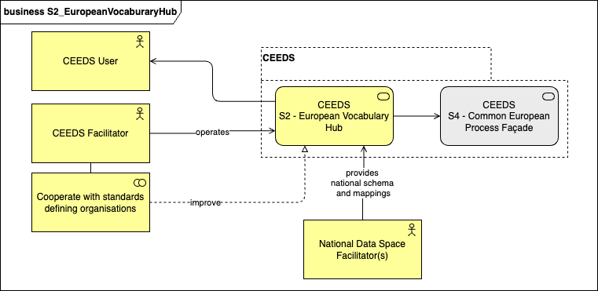
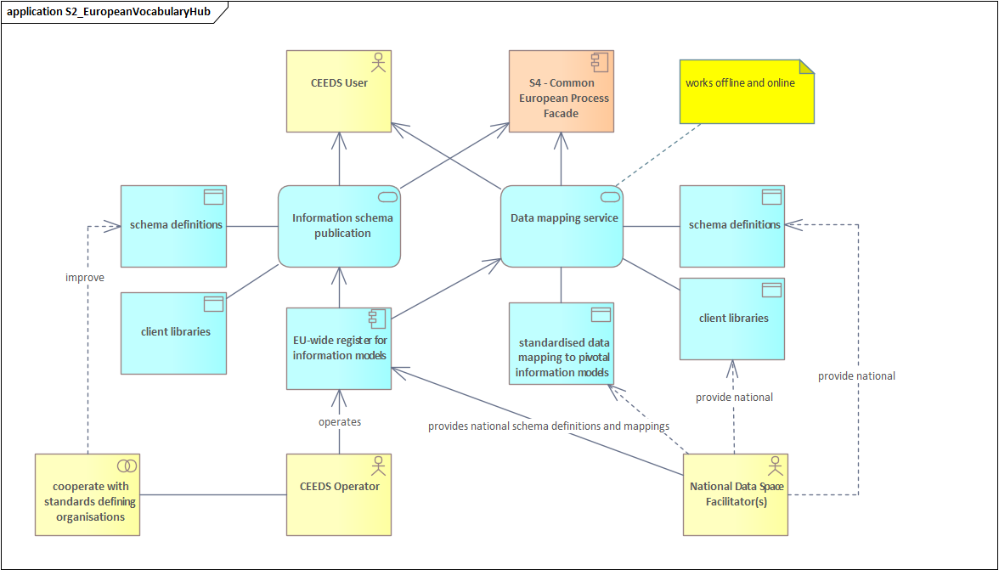
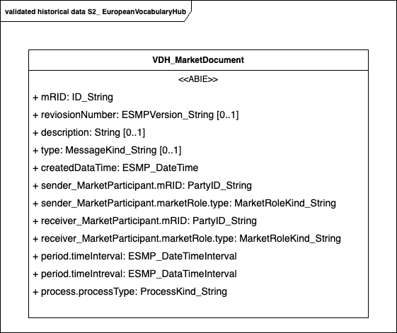
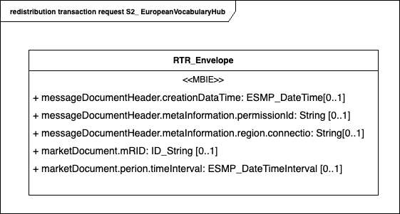
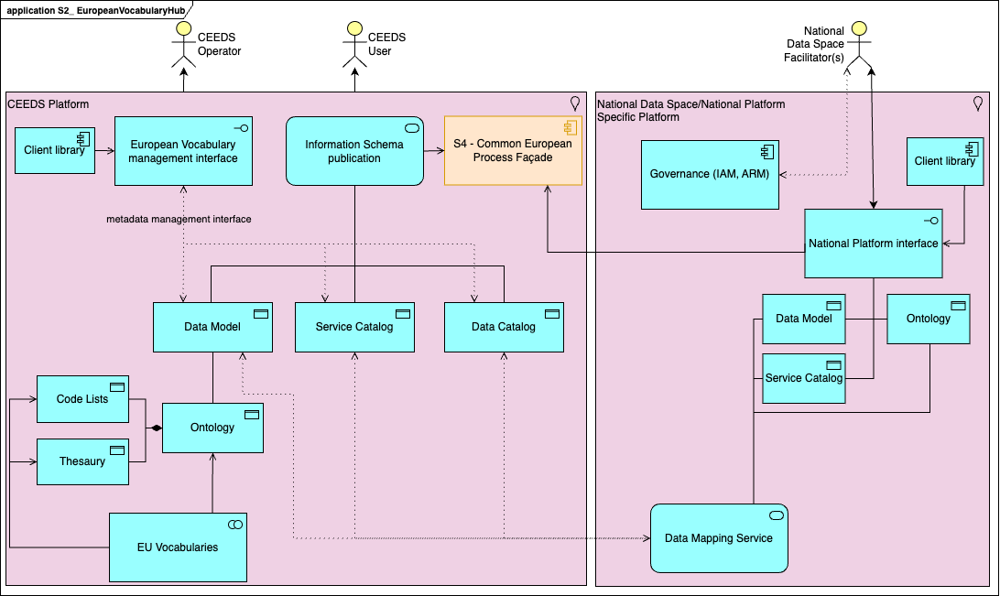
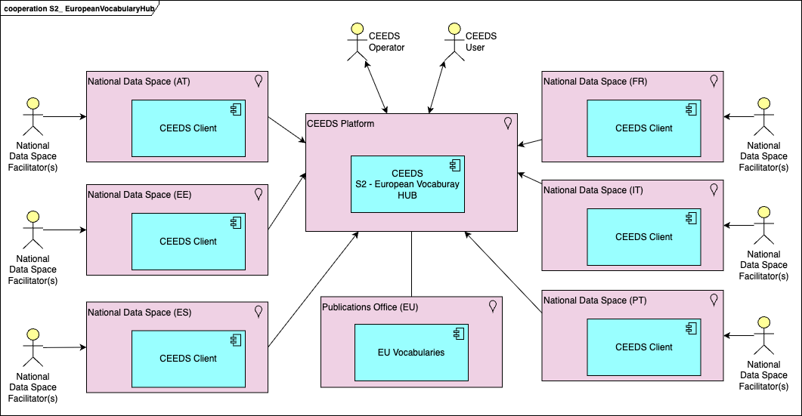
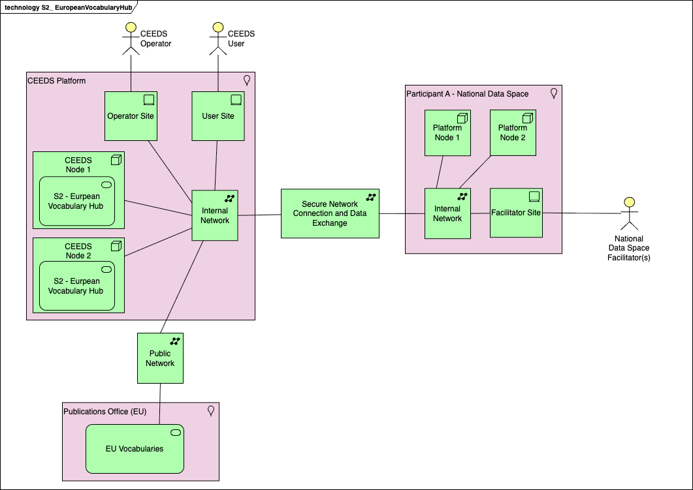
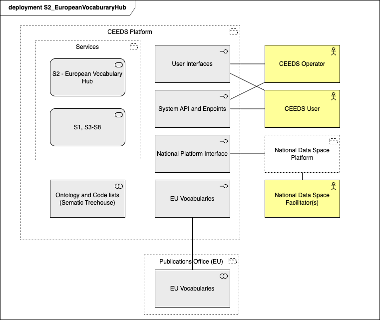

## Contributors

| Responsibility | Name                     | E-Mail                                |
|----------------|--------------------------|---------------------------------------|
| Leader         | Dragos-Constantin Stoica | dragos.stoica@lnds.lu                 |
| Contributor    | Wout van Voornveld       | w.van.voornveld@expertmodeller.energy |
| Contributor    | Tomé Ferreira            | tome.ferreira@ri.se                   |

## Function and Objective

Maintains the European Common Information Model and maps national vocabularies for semantic interoperability.

It is one responsibility of the **CEEDS Facilitator** to actively participate in the works under the umbrella of Standards Defining Organisations (SDOs) on the adoption and extension of the pivotal
European information models. **National Data Space Facilitators** should be responsible to provide and maintain updates of the mappings.

## Business Architecture

<!-- 
The Business Architecture focuses on business requirements. It outlines the structure and operation of an organization, including business goals, functions, processes, and organizational structure. 
See: https://www.fconsulting.tech/togaf-10-understanding-the-7-core-concepts/
-->

### Service Realization Viewpoint

<!-- 
The Service Realization Viewpoint pattern creates elements that show how one or more business services are realized by the underlying processes (and sometimes by application components). 
Thus, it forms the bridge between the business products viewpoint and the business process view. It provides a "view from the outside" on one or more business processes. 
See: https://sparxsystems.com/resources/tutorials/archimate/#Service-Realization-Viewpoint
-->

#### Component Descriptions

Component | Description
---|---
Data mapping service | Service that transforms national data models into European wide models. Uses schema definitions and client libraries. The communication with National Data Platforms is done via client libraries.
Data mapping service - schema definitions | All necessary data models for exchanging and converting national data to CEEDS data models.
Data mapping service - client libraries | The client libraries are specific for each national data space / national platform of specific platform and facilitates the management of national or platform specific code lists, ontologies, data models, data catalogs, service catalogs that are necessary for exchanging data with CEEDS.
standardised data mapping to pivotal information models | Data transformation from national data model to CEEDS data model. This should support defaul values in case of missing data.
EU-wide register for information models | The register European model(s) is managed by CEEDS operators and fed by National Data Space Facilitator(s). The register is used a data model repository together with data mapping and trasnformation for each verison, from national data model to European common data model.
Information schema publication | Service exposing the European common data model, the schema definitions via the client libraries. Any pariticipant at CEEDS Data Space must have a client library.
Information schema publication - schema definitions | Common European schema definitions. This is the minimum mandatory European schema that allows data exchange between the participants at CEEDS Data Space.
Information schema publication - client libraries | The client libraries used by information schema publication service to exchange data in common Europead format.

## Data Architecture

### Data Objects

The following standards should be used:
- __IEC62746-4__ ESMP model for common European data model
- __ISO8601__ for date/time formats
- __ISO19139__ for annotation of high-value datasets in geometadata. 

The data objects are extracted from [Digital4Grid - Bridge energy schemas](https://github.com/Digital4Grids/Bridge_energy_schemas) previous works as basis for European Data Space data model.

The main code list published by Bridge energey schemas is shared on project's [public repository](https://github.com/Digital4Grids/Bridge_energy_schemas/blob/main/IEC62746-4/IEC62746-4-1%20Explicit/urn-entsoe-eu-wgedi-codelists.xsd). This is the ENTSO-E code list used by ENTSO-E XML electronic documents and CIM XML electronic documents. The data model and code list usage is detailed in ENTSO-E document [Procedures for access to metering and consumption data](https://eepublicdownloads.entsoe.eu/clean-documents/EDI/Library/cim_based/amcd/IG_FinalDraft_Implementation_Guide_access_to_metering_and_consumption_data_ICTC_Approved.pdf).

#### Code lists
<!--
Name | List ID | Description
---|---|---
StandardAllocationModeTypeList | ET0040 | The identification of the method of allocation in an auction.
StandardAnalogTypeList | MXM000 | The identification of an analog value.
StandardAssetTypeList | ET0031 | The identification of the type of asset.
StandardAuctionTypeList | ET0030 | The coded representation of different types of auction.
StandardBusinessTypeList | ET0017 | The exact business nature identifying the principal characteristic of a time series.
StandardCategoryTypeList | ET0037 | The product category of an auction.
StandardClassificationTypeList | ET0013 | Indicates the classification mechanism used to group a set of objects together. The grouping may be of a detailed or a summary nature.
StandardCodingSchemeTypeList | ET0004 | Codification scheme used to identify the coding scheme used for the set of coded values to identify specific objects.
StandardCoordinateSystemTypeList | ET0108 | The identification of the coordinate system used for the location position.
StandardContractTypeList | ET0010 | The contract type defines the conditions under which the capacity is allocated and handled, e.g. daily auction, weekly auction, monthly auction, yearly auction, etc.  The significance of this type is dependent on area specific coded working methods.
StandardCurrencyTypeList | ET0024 | The coded identification of legal tender using ISO 4217 3 alpha codes.
StandardCurveTypeList | ET0042 | The type of curve being defined in the time series.
StandardDirectionTypeList | ET0026 | The coded identification of the direction of energy flow.
StandardEicTypeList | ET0028 | The coded identification of the type of an EIC code.
StandardEnergyProductTypeList | ET0008 | The identification of the nature of an energy product such as power, energy, reactive power, etc.
StandardFuelTypeList | ET0051 | The identification of the type of fuel.
StandardHVDCModeTypeList | MXM000 | The coded identification of the HVDC mode.
StandardIndicatorTypeList | ET0029 | A boolean indicator to express Yes or No or True or False.
StandardMessageTypeList | ET0003 | The coded type of a document. The message type describes the principal characteristic of a document. This enumeration is used in the XML instances based on IEC 62325.
StandardMarketProductTypeList | ET0008 | The identification of the type of a product on a market view
StandardObjectAggregationTypeList | ET0018 | The identification of the domain that is the common dominator used to aggregate a time series.
StandardPaymentTermsTypeList | ET0041 | The identification of the different terms of payment.
StandardPriceCategoryTypeList | ET0048 | Indicates the category of the calculation to be applied to a price.
StandardPriceComponentTypeList | ET0052 | Indicates the component type for  a price.
StandardPriceDirectionTypeList | ET0049 | The nature of a price, i.e. an impacted area system operator pays to internal market parties or inverse.
StandardProcessTypeList | ET0020 | Indicates the nature of process that the document addresses.
StandardQualityTypeList | ET0036 | The quality of an object.
StandardReasonCodeTypeList | ET0015 | The coded motivation of an act.
StandardRightsTypeList | ET0938 | The rights of use that is accorded to what is acquired in an auction.
StandardRoleTypeList | ET0005 | Identification of the role played by a party.
StandardStatusTypeList | ET0025 | The condition or position of an object with regard to its standing.
StandardTarifTypeTypeList | ET0039 | The standard tariff types as defined in the RGCE policies.
StandardTimeframeTypeList | ET0053 | The identification of the timeframe.
StandardUnitMultiplier | MXM001 | The unit multipliers defined for the CIM.
StandardUnitOfMeasureTypeList | ET0011 | (synonym MeasurementUnit) The unit of measure that is applied to a quantity. The measurement units shall be in compliance with UN/ECE Recommendation 20.
StandardUnitSymbol | MXM000 | The coded representation of different units from IEC 61970.
StandardDocumentTypeList | ET0003 | The DocumentTypeList is only used in XML instances using deprecated ENTSO-E schema; otherwise for XML instances based CIM, the codelist is MessageTypeList.  Therefore, you are kindly advised to refer to the MessageType enumeration, which includes the same enumeration codes.
-->

<b>Name</b>: StandardAllocationModeTypeList <b>List ID</b>: ET0040 <b>Description</b>: The identification of the method of allocation in an auction.

Value | Title |  Definition
---|---|---
A01 | Order by price with pro rata | The allocation method is by price with eventual pro rata.
A02 | Order by price with first come - first served | The allocation method is by price with eventual use of first come first served.
A03 | First come - First served | The allocation method is first come first served.
A04 | Pro rata | The allocation method is pro rata.

<b>Name</b>: StandardAnalogTypeList <b>List ID</b>: MXM000 <b>Description</b>: The identification of an analog value.

Value | Title |  Definition
---|---|---
A01 | Flow | This is the computed flow for the monitored element in the constraint situation ("N situation", "N-1 situation" ...) after the capacity calculation. The flow is expressed in A, %, or MW.
A02 | Permanent admissible transmission limit (PATL) | The permanent load of transmission system elements which is allowed for an unlimited period and which does not cause physical damage to the transmission system elements as long as the defined threshold is respected.
A03 | Flow reliability margin | This is the flow reliability margin for a given critical network element. The amount of MW or A that is reserved for this critical network element and shall not be used for the computed outage situation, in order to secure the power network.
A04 | Spanning margin value | This is the margin that is taken into account when spanning (fall-back process) is applied. Spanning marginal value is an historical based parameter which specifies the amount of MW that reduces the RAM when spanning is applied.
A05 | Long term allocation margin | This is the amount of MW that is added to the capacity of the critical network element in order to automatically include the long term allocation domain into the flow based domain.
A06 | Final adjustment margin value | This is the margin that is manually added or subtracted to the capacity of the critical network element. A negative value for final adjustment value simulates the effect of an additional margin due to complex remedial actions (RA) which cannot be modeled and so calculated in the flow based parameter calculation. A positive value for FAV as a consequence of the verification phase of the flow based domain, leading to the need to reduce the margin on one or more CBs for system security reasons.
A07 | Transitory admissible transmission limit (TATL) | The temporary overload of transmission system elements which is allowed for a limited period and which does not cause physical damage to the transmission system elements as long as the defined duration and thresholds are respected.
A08 | Long admissible flow | This is the value, expressed in A or MW, that the overload flow in a network element shall not exceed for a duration no longer than the long duration. The long duration value depends on the TSO network operating rules.
A09 | Negative Final adjustment margin value | This is the margin that is manually added to the capacity of the critical network element in order to simulate the effect of an additional margin due to complex remedial actions (RA) which cannot be modeled and so calculated in the flow based parameter calculation.
A10 | Minimum voltage level | This is the minimum voltage that can be supported by a network element without involving a risk for the security of supply.
A11 | Maximum voltage level | This is the maximum voltage that can be supported by a network element without involving a risk for the security of supply.
A12 | TATL after automatic RA | The Transitory admissible transmission limit (TATL) which is allowed after an automatic Remedial Action (RA) has been applied.
A13 | TATL after curative RA | The Transitory admissible transmission limit (TATL) which is allowed after a curative Remedial Action (RA) has been applied.
A14 | Computed Voltage | This is the computed voltage for a given monitored element.
A15 | Zero-Balance flow | This is the amount of power affected by a contingency that reflects a situation with a scheduled exchange of zero.
A16 | Available margin after remedial actions | This is the available flow margin adjusted for the consideration of remedial actions in capacity calculation.
A17 | Loss Factor | This is the loss factor for an asset.
A18 | Adjustment for minimum RAM | This is the adjustment applied to the capacity of a branch to have a minimum RAM (Remaining Available Margin) available for commercial exchanges.
A19 | Tap changer | The position of a Tap changer.
A20 | Regulator mode | A measurement type indicating the control mode of a regulator, i.e. from voltage regulation to fixed MVAR regulation.
A21 | Regulator set-point | The set-point of a regulator. A regulator can be a tap changer, a synchronous machine, a SVC or a shunt.
A22 | Reference Flow | This is the amount of power affected by a contingency that reflects a situation with scheduled exchanges from a reference situation.
A23 | CO2 emission | This is the CO2 emission from one or several assets.
A24 | Maximum admissible current (Imax) | The maximum admissible current of a critical network element or a critical network element and contingency.
A25 | Individual value adjustment (IVA) | Individual value adjustment resulting from TSO validation process.
A26 | Linear flow approximation (F0) | The linear approximation of a flow in the reference net position in a situation without any cross-zonal exchanges.
A27 | Flow without commercial exchanges (F0_Wce) | Flow per critical network element and contingency without commercial exchanges within a capacity calculation region.
A28 | Flow without commercial exchanges between areas (F0_all) | Flow per critical network element and contingency without commercial exchanges between bidding zones within the same or different synchronous areas.
A29 | Flow due to non-costly remedial actions (F_nrao) | Expected flow change due to non-costly remedial actions.
A30 | Flow after long-term nominations (F_LTN) | Flow after consideration of long-term nominations.
A31 | Coordinated value adjustment (CVA) | Coordinated value adjustment resulting from coordinated validation process.
A32 | Minimum remaining available margin as ratio of maximum allowable power flow (Ramr) | Percentage of the maximum allowable power flow that needs to be available as minimum Remaining Available Margin.
A33 | Flows from already allocated cross-zonal capacities (Faac) | Flows resulting from previously allocated cross-zonal capacities.
A34 | Flow from remedial action (FRA) | Flow for increasing the Remaining Available Margin due to remedial action.
A35 | Assumed external exchanges | Flow resulting from assumed commercial exchanges outside the region (F_uaf).
A36 | Minimum remaining available margin target | Target capacity for exchanges by deducing the exchanges not related to the region.

<b>Name</b>: StandardAssetTypeList <b>List ID</b>: ET0031 <b>Description</b>: The identification of the type of asset.

Value | Title |  Definition
---|---|---
A01 | Tie line | A high voltage line used for cross border energy interconnections.
A02 | Line | A specific electric line within a country.
A03 | Resource Object | A resource that can either produce or consume energy.
A04 | Generation | A resource that can produce energy.
A05 | Load | A resource that can consume energy.
A06 | Phase Shift Transformer | An electrical device for controlling the power flow through specific lines in a power transmission network.
A07 | Circuit Breaker | An electrical switch designed to protect an electrical circuit from damage caused by overcurrent/overload or short circuit.
A08 | Busbar | A specific element within a substation to connect grid elements for energy distribution purposes.
A09 | Capacitor | A transmission element designed to inject reactive power into the transmission network.
A10 | Inductor | A transmission element designed to compensate reactive power in the transmission network.
A11 | Power plant connection | All the network equipment that link the generating unit to the grid.
A12 | FACTS | Flexible Alternating Current Transmission System
A13 | Production unit | A production unit is a composition of one or several generation units.
A14 | Internal tie line | An internal tie line is a line between two scheduling areas within the same bidding zone.
B01 | Biomass | A resource using biomass for energy.
B02 | Fossil Brown coal/Lignite | A resource using Fossil Brown coal/Lignite for energy.
B03 | Fossil Coal-derived gas | A resource using Fossil Coal-derived gas for energy.
B04 | Fossil Gas | A resource using Fossil Gas for energy.
B05 | Fossil Hard coal | A resource using Fossil Hard coal for energy.
B06 | Fossil Oil | A resource using Fossil Oil for energy.
B07 | Fossil Oil shale | A resource using Fossil Oil shale for energy.
B08 | Fossil Peat | A resource using Fossil Peat for energy.
B09 | Geothermal | A resource using Geothermal for energy.
B10 | Hydro-electric pure pumped storage head installation | Unit in which moving water energy is converted to electricity using flowing water to generate electricity with a large dam and reservoirs. Pure pumped storage plants store water in an upper reservoir with no natural inflows.
B11 | Hydro Run-of-river head installation | Unit in which moving water energy is converted to electricity using flowing water to generate electricity in the absence of a large dam and reservoirs.
B12 | Hydro-electric storage head installation | Unit in which moving water energy is converted to electricity using flowing water to generate electricity with a large dam and reservoirs.
B13 | Marine unspecified | Unit in which marine energy is converted to electricity with equipment/devices not specified.
B14 | Nuclear unspecified | A unit in which the heat source is a nuclear reactor of type that is not specified in other nuclear types.
B15 | Other renewable | A resource using Other renewable for energy.
B16 | Solar unspecified | Unit in which solar energy is converted to electricity with equipment/devices not specified.
B17 | Waste | A resource using Waste for energy.
B18 | Wind Offshore | Unit in which wind energy is converted to electricity using wind farms constructed in bodies of water, usually in the ocean.
B19 | Wind Onshore | Unit in which wind energy is converted to electricity using wind farms constructed on land.
B20 | Other unspecified | Other unspecified technology.
B21 | AC Link | Overhead line or cable which is used to transmit electrical power via Alternative Current.
B22 | DC Link | Overhead line or cable which is used to transmit electrical power via Direct Current.
B23 | Substation | An assembly of equipment in an electric power system through which electric energy is passed for transmission, transformation, distribution or switching.
B24 | Transformer | Electrical device that transfers energy from one voltage level to another voltage level.
B25 | Energy storage | A resource that stores energy. It could be gas, electricity, etc.
B26 | Demand Side Response | A resource that change its electricity consumption patterns in response to a signal or incentive.
B27 | Dispatchable hydro resource | A resource referring to dispatchable hydro generation.
B28 | Solar photovoltaic | Unit in which solar energy is converted to electricity using a technology based on the photoelectric effect.
B29 | Solar concentration | Unit in which solar energy is converted to electricity using mirrors to concentrate the sun's energy to drive traditional steam turbines or engines.
B30 | Wind unspecified | Unit in which wind energy is converted to electricity with equipment/devices not specified.
B31 | Hydro-electric unspecified | Unit in which moving water energy is converted to electricity with equipment/devices not specified.
B32 | Hydro-electric mixed pumped storage head installation | Unit in which moving water energy is converted to electricity using flowing water to generate electricity with a large dam and reservoirs. Mixed pumped storage plants use a combination of pumped storage and conventional hydroelectric plants with an upper reservoir that is replenished in part by natural inflows from a stream or river.
B33 | Marine tidal | Unit in which marine energy from tides is converted to electricity.
B34 | Marine wave | Unit in which marine energy from waves is converted to electricity.
B35 | Marine currents | Unit in which marine energy from currents is converted to electricity.
B36 | Marine pressure | Unit in which marine energy from pressure is converted to electricity.
B37 | Thermal unspecified | Unit in which heat energy is converted to electricity with equipment/devices not specified in other thermal types.
B38 | Thermal combined cycle gas turbine with heat recovery | Unit in which heat energy is converted to electricity called Combined Cycle Gas Turbine. The power is generated by the single or multiple gas turbine(s) in combination with the steam turbine(s). The unit might be equipped with waste heat recovery (e.g. to district heating network).
B39 | Thermal steam turbine with back-pressure turbine (open cycle) | Unit in which heat energy is converted to electricity. The power is generated with the steam that is expanded in the back-pressure steam turbine with or without heat output (e.g. to district heating network).
B40 | Thermal steam turbine with condensation turbine (closed cycle) | Unit in which heat energy is converted to electricity. The power is generated with the steam that is expanded in the condensation steam turbine with or without heat output (e.g. to district heating network).
B41 | Thermal gas turbine with heat recovery | Unit in which heat energy is converted to electricity called Simple Cycle Gas Turbine. The power is generated by the gas turbine and the flue gas waste heat is recovered (e.g. to district heating network).
B42 | Thermal internal combustion engine | An internal combustion engine is a heat engine in which the combustion of a fuel occurs with an oxidizer (usually air) in a combustion chamber that is an integral part of the working fluid flow circuit (e.g. reciprocating engine). The unit might be equipped with waste heat recovery (e.g. to district heating network).
B43 | Thermal micro-turbine | Unit in which heat energy is converted to electricity called Simple Cycle Gas Turbine. The power is generated by the gas turbine (capacity less than 500kWe). The unit might be equipped with waste heat recovery (e.g. to district heating network).
B44 | Thermal Stirling engine | A Stirling engine is a heat engine that is operated by the cyclic compression and expansion of air or other gas (the working fluid) at different temperatures, resulting in a net conversion of heat energy to mechanical work.
B45 | Thermal fuel cell | A fuel cell is an electrochemical cell that converts the chemical energy of a fuel (e.g. hydrogen) and an oxidizing agent (e.g. oxygen) into electricity through a pair of redox reactions.
B46 | Thermal steam engine | A steam engine is a heat engine that performs mechanical work using steam as its working fluid. The steam engine uses the force produced by steam pressure to push a piston back and forth inside a cylinder.
B47 | Thermal organic Rankine cycle | The Organic Rankine Cycle (ORC) is named for its use of an organic, high molecular mass fluid with a liquid-vapor phase change, or boiling point, occurring at a lower temperature than the water-steam phase change. The fluid allows Rankine cycle heat recovery from lower temperature sources such as biomass combustion, industrial waste heat, geothermal heat, solar ponds etc. The low-temperature heat is converted into useful work, that can itself be converted into electricity.
B48 | Thermal gas turbine without heat recovery | Unit in which heat energy is converted to electricity called Simple Cycle Gas Turbine. The power is generated by the gas turbine and there is no flue gas waste heat recovery.
B49 | Nuclear heavy water reactor | A unit in which the heat source is a pressurized heavy-water reactor (PHWR) that is a nuclear reactor that uses heavy water (deuterium oxide D2O) as its coolant and neutron moderator.
B50 | Nuclear light water reactor | A unit in which the heat source is a light-water reactor (LWR) that is a type of thermal-neutron reactor that uses normal water, as both its coolant and neutron moderator – furthermore a solid form of fissile elements is used as fuel.
B51 | Nuclear breeder | A unit in which the heat source is a nuclear reactor that generates more fissile material than it consumes.
B52 | Nuclear graphite reactor | A unit in which the heat source is a graphite-moderated reactor that is a nuclear reactor that uses carbon as a neutron moderator, which allows natural uranium to be used as nuclear fuel.
B53 | Temporary energy storage | A resource that is temporarily connected to the grid and that may store energy when connected, such as an electric vehicle.
B54 | Permanent energy storage | A resource that is permanently connected to the grid and that may store energy when connected, such as a pumped hydro.
B55 | Electric vehicle battery | A resource using electric vehicle batteries, commercial and private. The reason for separating vehicle batteries and non-vehicle batteries is that the vehicle batteries not necessarily is connected to the charger.
B56 | Heat pump specified | A heat pump is a device that uses work to transfer heat from a cool space to a warm space by transferring thermal energy using a refrigeration cycle
B57 | Heat pump electrical | A heat pump is a device that uses electricity to transfer heat from a cool space to a warm space by transferring thermal energy using a refrigeration cycle.
B58 | Heat pump absorption | A heat pump is a device that uses absorption technology to transfer heat from a cool space to a warm space by transferring thermal energy using a refrigeration cycle.
B59 | Auxiliary power unit | A technology that provides energy as a backup.
B60 | Water electrolysis unspecified | Unspecified water electrolysis.
B61 | Water electrolysis low temperature unspecified | Unspecified water electrolysis at low temperature as in an Alkaline or Proto-Exchange Membrane (PEM) fuel cell.
B62 | Water electrolysis low temperature main product | Main product water electrolysis at low temperature as in an Alkaline or Proto-Exchange Membrane (PEM) fuel cell.
B63 | Water electrolysis high temperature unspecified | Unspecified water electrolysis at high temperature as in a Solid Oxide Electrolysis Cell (SOEC) fuel cell.
B64 | Steam methane reforming unspecified | Unspecified methane reforming.
B65 | Steam methane reforming without CCS/CCU  unspecified | Main product methane reforming without Carbon Capture and Sequestration (CCS)/Carbon Capture and Use (CCU).
B66 | Steam methane reforming with CCS/CCU  unspecified | Unspecified methane reforming with Carbon Capture and Sequestration (CCS)/Carbon Capture and Use (CCU).
B67 | Steam methane reforming with CCS/CCU  main product | Main product methane reforming with Carbon Capture and Sequestration (CCS)/Carbon Capture and Use (CCU).
B68 | Partial oxidation unspecified | Unspecified partial oxidation.
B69 | Autothermal reforming unspecified | Unspecified autothermal reforming.
B70 | Methanol reforming unspecified | Unspecified methanol reforming.
B71 | Ammonia reforming unspecified | Unspecified ammonia reforming.
B72 | Ammonia gasification | Unspecified gasification.
B73 | Chlor-alkali electrolysis unspecified | Unspecified alkali electrolysis.
B74 | Chlor-alkali electrolysis by-product | Alkali electrolysis product.

<b>Name</b>: StandardAuctionTypeList <b>List ID</b>: ET0030 <b>Description</b>: The coded representation of different types of auction.

Value | Title |  Definition
---|---|---
A01 | Implicit | The auction is an implicit auction.
A02 | Explicit | The auction is an explicit auction.
A03 | Rule Based | The auction is a rule based auction.
A04 | Mixed | The auction is partially implicit and partially explicit.
A05 | Explicit/split | The auction concerns two explicit auctions on a split border.
A06 | Shadow auction | An explicit auction carried out in the case of the failure of an implicit auction.
A07 | Flow-based | The allocation is an implicit auction using flow-based capacity calculation.
A08 | Continuous | The auction type is continuous, i.e. there is no gate closure time when bids from the market participants are collected. Instead allocation procedure takes place immediately.

<b>Name</b>: StandardBusinessTypeList <b>List ID</b>: ET0017 <b>Description</b>: The exact business nature identifying the principal characteristic of a time series.

Value | Title |  Definition
---|---|---
A01 | Production | The nature of the business being described is production details.
A02 | Internal trade | The nature of the business being described is internal trade details.
A03 | External trade explicit capacity | The nature of the business being described is external trade details between two areas with limited capacity requiring a capacity agreement identification.
A04 | Consumption | The nature of the business being described is consumption details.
A05 | External trade total | The nature of the business being described is external trade total.
A06 | External trade without explicit capacity | The nature of the business being described is external trade details between two areas without requiring capacity allocation information.
A07 | Net Production / Consumption | Net production/consumption - where signed values will be used. With the following rules: In area=Out area, In party=Out party, + means production and - means consumption.
A08 | Net internal trade | Net internal trade - where the direction from out party (seller) to in party (buyer) is positive and the opposite direction is negative (with minus signs).
A09 | IPP (Independent Power Producer) | A time series concerning the production schedule from an IPP.
A10 | Tertiary control | A time series concerning tertiary reserve.
A11 | Primary control | A time series concerning primary reserve.
A12 | Secondary control | A time series concerning secondary reserve.
A13 | Load profile | A time series concerning a load profile as calculated by a metered data aggregator.
A14 | Aggregated energy data | A time series concerning adjusted metered readings received from a metered data collector and aggregated and validated by a metered data aggregator.
A15 | Losses | A time series concerning losses that have been calculated for a tieline or an area.
A16 | Transits (CBT) | A time series concerning inter area transit flows determined for CBT requirements.
A17 | Settlement deviation | A time series concerning the imbalance energy calculated by an imbalance settlement responsible.
A18 | Technical constraint deviation | A time series defining the imbalance between schedules accepted by the system operator due to technical constraints and schedules declared by the balance responsible party.
A19 | Balance energy deviation | A time series defining the imbalance between the schedule of a balance responsible party that has been corrected by the system operator after using balance energy bids and the schedule that was accepted by the system operator due to technical constraints.
A20 | Imbalance volume | A time series defining the imbalance between the actual meter readings and the schedule of the balance responsible party corrected by the system operator after using balance energy bids.
A21 | Unintended energy | A timeseries concerning the volume of an unintended cross-border exchange of energy.
A22 | Frequency control | A time series concerning primary and secondary reserve.
A23 | Balance management | A time series concerning energy balancing services.
A24 | Total trade | A time series concerning the total of both the internal and external trades.
A25 | General Capacity Information | A time series providing the total capacity available on a TSO border.
A26 | Available transfer capacity (ATC) | Available transfer capacity for cross-border exchanges.
A27 | Net transfer capacity (NTC) | Net transfer capacity for cross-border exchanges.
A28 | Control Area Program | A time series providing the total exchanges between two TSOs (including the commercial transactions, the compensation program and the losses compensation program). Note this definition might change when UCTE brings forward its coding requirements.
A29 | Already allocated capacity (AAC) | The already allocated capacity is the total amount of allocated transmission rights.
A30 | Internal inter area trade | A trade that occurs between internal areas within a market balance area.
A31 | Offered Capacity | The time series provides the offered capacity.
A32 | Capacity transfer notification | The time series provides information concerning the notification of the transfer of capacity to another market participant.
A33 | Authorised AAC | The time series in question provides the amount of transmission capacity rights to be nominated.
A34 | Capacity rights | The time series in question provides the capacity rights allocated for a given border.
A35 | Minimum authorised AAC | The time series in question provides the minimum amount of transmission capacity rights to be nominated.
A36 | Maximum authorised AAC | The time series in question provides the maximum amount of transmission capacity rights to be nominated.
A37 | Installed generation | The time series in question provides the installed generation.
A38 | Available generation | The time series in question provides the available generation.
A40 | Interconnection Trade Responsible Designation | The Time series in question provides the designation of the ITR that may nominate the capacity in question.
A41 | Released AAC | The already allocated capacity (AAC) that has been released for resale.
A42 | Requested capacity (with price) | The time series in question provides information concerning the requested capacity including price information.
A43 | Requested capacity (without price) | The time series in question provides information concerning the requested capacity but excludes price information.
A44 | Compensation program | Compensation of unintentional deviation is performed by exporting to / importing from the interconnected system during the compensation period by means of schedules as calculated during the accounting of unintentional deviations.
A45 | Schedule activated reserves | The cross border or internal reserves that are to be activated through schedule nomination.
A46 | System Operator redispatching | The cross border redispatching between System Operators that are to be activated through schedule nomination.
A47 | Market capacity price | The price of the capacity offered on a given market.
A48 | Market capacity price differential | The difference between the price of capacity in a Market Balance Area receiving the capacity (In Area) and the price of capacity in a Market Balance Area providing the capacity (Out Area), i.e. In Area Price - Out Area price.
A49 | Inflow | The volume of water that flows into a reservoir in a given interval.
A50 | Water extraction | The volume of water that can be extracted from a reservoir in a given interval.
A51 | Turbined water | The volume of water that can be turbined in a plant in a given interval.
A52 | Water spillage | The volume of water that is not turbined going through the spillway in a given interval.
A53 | Planned maintenance | Maintenance has been planned for the object in question with a forecast ending date.
A54 | Unplanned outage | An unplanned outage has occurred on the object in question.
A55 | Use it Or Sell it (UIOSI) pricing | The time series provides information on the capacity resold in the "use it or sell it" process and its corresponding price.
A56 | Compensation for auction cancellation where capacity is for resale | The time series provides information on the compensation of the capacity for resale following an auction cancellation.
A57 | Resale pricing | For each Physical Transmission Rights holder, this document contains the resold capacity and its corresponding price.
A58 | Curtailed capacity compensation | The time series provides information to compensate a party when curtailment is applied on the capacity obtained in a previous auction, resale or transfer.
A59 | Use it Or Sell it (UIOSI) compensation | The time series provides information on the compensation for the capacity following an auction cancellation.
A60 | Minimum possible | The time series provides a schedule of minimum possible values for a Resource Object. The nature of the flow could be defined by the attribute Direction.
A61 | Maximum available | The time series provides a schedule of maximum available values for a Resource Object. The nature of the flow could be defined by the attribute Direction.
A62 | Spot price | The time series provides the market spot prices from an auction.
A63 | Minimum ATC | The Available Transmission Capacity that must be guaranteed because of regulatory constraints.
A64 | Meter Measurement data | The data as provided for a meter measurement source.
A65 | Accounting Point Relevant data | The metered data that is to be considered relevant for accounting purposes.
A66 | Energy flow | Energy flow information.
A67 | Power plant energy Schedule | Energy flow scheduled for a power plant.
A68 | Compensation Requirements for the compensation period | The time series provides the compensation requirements for a given compensation period.
A69 | Market coupling results | The time series provides the results of a market coupling auction.
A70 | Production, unavailable | Production capacity that normally would be available, but due to maintenance or similar is temporarily unavailable.
A71 | Supplementary available generation | The supplementary generation that is available.
A72 | Interruptible consumption | The consumption that may be interrupted on request.
A73 | Summarised Market Balance Area Schedule | A time series providing the total exchanges based on commercial transactions between two Market Balance Areas.
A74 | Load Frequency Control Program Schedule | A time series providing the schedule information for the Load Frequency Control Program.
A75 | Timeframe Independent Schedule | A time series providing the total exchanges of Timeframe Independent Schedules between two System Operators.
A76 | Consumption curtailment | A time series providing the amount of voluntary consumption curtailed by the energy supplier of an end-consumer.
A77 | Production, dispatchable | The nature of the business being described is dispatchable production details, i.e. generation output that can be changed by a request (activation order) of the TSO according with the applicable Market Rules.
A78 | Consumption, dispatchable | The nature of the business being described is dispatchable consumption details, i.e. consumption output that can be changed by a request (activation order) of the TSO according with the applicable Market Rules.
A79 | Production, non-dispatchable | The nature of the business being described is non-dispatchable production details, i.e. generation output that cannot be modified by an activation order.
A80 | Consumption, non-dispatchable | The nature of the business being described is non-dispatchable consumption details, i.e. consumption output that cannot be modified by an activation order.
A81 | Total Transfer Capacity (TTC) | The Total Transfer Capacity is the maximum exchange program between two areas compatible with operational security standards applicable at each system if future network conditions, generation and load patterns were perfectly known in advance.
A82 | Mutual Emergency Assistance Service (MEAS) | The cross border Mutual Emergency Assistance Service between System Operators that are to be activated through schedule nomination.
A83 | Auction cancelation | The time series covers auction cancellation right.
A84 | Nomination curtailment | The time series covers nomination curtailment rights
A85 | Internal redispatch | Redispatch to relieve Market Balance Area internal congestion.
A86 | Control area balance energy | A sum of secondary, tertiary control as well as other energy that was used to balance a control area.
A87 | Balancing energy price | Price of energy used to balance.
A88 | Economised secondary reserve | The activated secondary reserve that had been economised due to pooled reserve management.
A89 | Spinning reserve | The extra generating capacity that is available by increasing the production of generators that are already connected to the power system.
A90 | Solar | The business being described concerns solar power.
A91 | positive forecast margin | The business being described concerns a positive forecast margin.
A92 | Negative forecast margin | The business being described concerns a negative forecast margin.
A93 | Wind generation | The business being described concerns wind generation.
A94 | Solar generation | The business being described concerns solar generation.
A95 | Frequency containment reserve | The business being described concerns frequency containment reserve.
A96 | Automatic frequency restoration reserve | The business being described concerns automatic frequency restoration reserve.
A97 | Manual frequency restoration reserve | The business being described concerns manual frequency restoration reserve.
A98 | Replacement reserve | The business being described concerns replacement reserve.
A99 | Financial information | The business being described concerns financial information.
B01 | Interconnector network evolution | The business being described concerns interconnector network evolution.
B02 | Interconnector network dismantling | The business being described concerns interconnector network dismantling.
B03 | Counter trade | The business being described concerns counter trades.
B04 | Congestion costs | The business being described concerns congestion costs.
B05 | Capacity allocated (including price) | The business being described concerns capacity allocation and includes price information.
B06 | DC link constraint | The business being described concerns DC link constraints.
B07 | Auction revenue | The business being described concerns auction revenue.
B08 | Total nominated capacity | The business being described concerns the total nominated capacity.
B09 | Net position | The business being described concerns net position.
B10 | Congestion income | The business being described concerns congestion income.
B11 | Production unit | The business being described concerns a production unit.
B12 | Rounded market coupling results | Rounded outputs of the market coupling to be sent to TSOs and Market Participants.
B13 | Allocation Revenue | The time series provides information on the revenue generated by the allocations.
B14 | Production deviation | A time series concerning the imbalance energy between the metered production and the schedules calculated by an imbalance settlement responsible.
B15 | Consumption deviation | A time series concerning the imbalance energy between  metered consumption and the forecasted consumption calculated by an imbalance settlement responsible.
B16 | Transmission asset | The business being described concerns a transmission asset.
B17 | Consumption unit | The business being described concerns a consumption unit.
B18 | In-feed ATC | Available Transfer Capacity at the in-feed side of a DC tieline.
B19 | Out-feed ATC | Available Transfer Capacity at the out-feed side of a DC tieline.
B20 | Balance up regulation price | A time series concerning balance regulation market prices for up regulation.
B21 | Balance down regulation price | A time series concerning balance regulation market prices for down regulation.
B22 | Main direction | A time series concerning the direction of balance regulations.
B23 | Consumption imbalance price | A time series concerning imbalance prices for consumption.
B24 | Production sales imbalance price | A time series concerning imbalance prices for production sales.
B25 | Production purchase imbalance price | A time series concerning imbalance prices for production purchase.
B26 | Average balance price between MBAs | A time series concerning the average prices between Market Balance Areas.
B27 | Pumped | A time series concerning the electricity consumption related to pumping.
B28 | Large installation consumption | A time series concerning consumption from large installation.
B29 | Metering Grid Area (MGA) imbalance | A time series concerning imbalance between reported consumption, production and exchange in a Metering Grid Area.
B30 | HVDC Link settings | The time series in question provides HVDC Link settings.
B31 | Transmission Reliability Margin (TRM) | A time series concerning Transmission Reliability Margin (TRM).
B32 | Imbalance component for a pool | This information is used to provide to a pool manager the combined imbalance of all the pool participants.
B33 | Area Control error (ACE) | The sum of the instantaneous difference between the actual and the set-point value of the measured total power value and Control Program including Virtual Tie-Lines for the power interchange of a LFC Area or a LFC Block and the frequency bias given by the product of the K-Factor of the LFC Area or the LFC Block and the Frequency Deviation.
B34 | Area Control Error after Imbalance Netting | A time series concerning the Area Control Error after applying the  imbalance netting energy correction.
B35 | Implicit and explicit trade total | The sum of cross border schedules based on implicit and explicit trades including long term, yearly, monthly, weekly, daily processes.
B36 | Production units own consumption | The consumption of one or more production units.
B37 | Constraint situation | The timeseries describes the constraint situation for a given TimeInterval. A constraint situation can be: <ul><li>composed of a list of network elements in outage associated for each outage to a list of network elements on which remedial actions have been carried out accordingly to contingency process</li><li>or it can be an external constraint.</li></ul>
B38 | Initial domain | The timeseries describe the full flow based domain for a given TimeInterval. Critical network elements are displayed in details and their impact on the market is quantified.
B39 | Flow based domain adjusted to long term schedules | The timeseries describe the full flow based domain for a given TimeInterval adjusted to the latest update of the schedules. Critical network elements are displayed in details and their impact on the market is quantified.
B40 | Network element constraint | The timeSeries describes limiting elements which are overloaded.
B41 | Calculation opposition (Red Flag) | The timeSeries describes a party who is opposed to the calculation result and imposes its transfer capacity value.
B42 | Base case proportional shift key | The GSK or LSK are proportional to the base case generation or load.
B43 | Proportional to participation factors shift key | The GSK or LSK are proportional to the participation factors.
B44 | Proportional to the remaining capacity shift key | The GSK is proportional to the remaining available capacity.
B45 | Merit order shift key | The GSK is proportional to a merit order list.
B46 | Wind speed | The TimeSeries provides information on the wind speed.
B47 | Wind direction | The TimeSeries provides information on the wind direction.
B48 | Solar irradiance | The TimeSeries provides information on the power per unit area produced by the sun in the form of electromagnetic radiation.
B49 | Air temperature | The TimeSeries provides information on the air temperature.
B50 | Cloudiness | The TimeSeries provides information on the cloudiness, i.e. the level of coverage of the sky with clouds.
B51 | Air humidity | The TimeSeries provides information on the level of humidity of the air.
B52 | Atmospheric pressure | The TimeSeries provides information on the atmospheric pressure.
B53 | Precipitation | The TimeSeries provides information on the amount of rain, snow, etc. that falls on the ground.
B54 | Network constraint situation that constraints the market | The TimeSeries describes the network elements, that constraints the market, to be taken into account to simulate a network constraint during the network load flow studies. The network situation includes the contingencies, the remedial actions, the monitored network elements and the potential additional constraints.
B55 | Contingency | The TimeSeries describes the network elements part of the contingency to be simulated for a given TimeInterval.
B56 | Remedial Action | The TimeSeries describes a set of remedial actions for a given TimeInterval.
B57 | Monitored Network Element | The TimeSeries describes the network elements to be monitored during the network load flow studies.
B58 | Busbar | The TimeSeries describes the network elements that composed a busbar.
B59 | Network Element | The TimeSeries describes network elements.
B60 | SPS | The TimeSeries describes the network elements managed by a Special Protection System (automation).
B61 | Aggregated netted external market schedule | The aggregated netted external market schedules for a given border.
B62 | Aggregated netted external TSO schedule | The aggregated netted external TSO schedules for a given border.
B63 | Aggregated netted external schedule | The aggregated netted external schedules for a given border.
B64 | Netted area AC position | The AC position for a given area.
B65 | Netted area position | The netted aggregation of all AC external schedules of an area plus the aggregated External Netted Schedules of related HVDC links of an area.
B66 | Interconnection shift key | The shift key series describes the amount of power to be shifted from a border area.
B67 | DC flow with losses | DC flow with losses refers to the values at the importing end of the DC line.
B68 | DC flow without losses | DC flow without losses refers to the values at the exporting end of the DC line.
B69 | minimum value of netted area position | That value which a netted area position must not fall below for a given area.
B70 | maximum value of netted area position | That value which a netted area position must not exceed for a given optimisation area.
B71 | maximum value of DC flow | That value which a balanced DC flow must not exceed for a given DC line on exporting end. When aligning DC flows CGMA algorithm will respect this constraint.
B72 | minimum value of DC flow | That value which a balanced DC flow must not fall below for a given DC line on exporting end. Currently this business type is only included for consistency reasons. It is always set to 0. This constraint might, however, be used in future. When aligning DC flows the CGMA algorithm will respect this constraint.
B73 | indicative AC flow | It is the hypothetical flow on the aggregate of all AC tie lines of an electrical border between two optimisation areas. It results from the adjustments to the preliminary netted area positions of all optimisation areas made by the CGMA algorithm. Indicative AC flows are an artefact of the CGMA algorithm, and do not correspond to physical flows
B74 | Offer | The time series provides an offer to provide reserves.
B75 | Need | The time series provides a requirement for reserves.
B76 | Opportunity costs or benefits | The time series describes any opportunity costs or benefits.
B77 | Financial compensation or penalties | The time series describes any financial compensation or penalties
B78 | Global radiation | The total short-wave radiation from the Global radiation is the total short-wave radiation from the sky falling onto a horizontal surface on the ground. It includes both the direct solar radiation and the diffuse radiation resulting from reflected or scattered sunlight.
B79 | Diffuse radiation | Radiation resulting from reflected or scattered sunlight.
B80 | Direct solar radiation | Radiation resulting from direct sunlight
B81 | Outage (OUT) | Outage process: Element is out of operation due to planned maintenance or due to an unplanned/forced outage. Outage may be used as a synonym for unavailability.
B82 | Special switching state (SSS) | Outage Process: This state applies to grid elements which are in operation in an exceptional state (e.g. separated nodes operation).
B83 | Testing (TEST) | Outage process: TESTING means any element status is possible - ON or OUT. This status applies either between first connection and final commissioning of the relevant asset, or directly following maintenance of the relevant asset.
B84 | Auxiliary busbar operation | Outage process: Element is in operation but connected via auxiliary busbar
B85 | Automatic reclosing | Outage process: Protection function Automatic reclosing is switched off for electric line
B86 | Busbar protection | Protection function busbar protection is switched off
B87 | Phase Shift Angle | The maximum phase shift angle allowed between two network elements.
B88 | Base Case Network Situation | The TimeSeries describes the network elements to be taken into account to simulate a base case network situation during the network load flow studies, without any contingency.
B89 | Inter-TSO assistance | Cross border assistance schedule between TSOs not interconnected directly.
B90 | FlexibleNeed | The business type indicates that the need is optional.
B91 | GLSK Limitation | A constraint related to a GLSK maximum or minimum limitation in the production or/and consumption shift.
B92 | Capacity ramping limitation | A constraint related to a ramping limitation on the capacity offered at a given border.
B93 | interconnector capacity | The maximum capacity that can be exchanged on an interconnector, excluding external factor on both ends.
B94 | Must Run | A time series concerning must run generation.
B95 | Procured capacity | An accepted offer of balancing capacity.
B96 | Used capacity | The used cross-zonal balancing capacity.
B97 | Estimated costs | Estimated costs of the process.
B98 | Estimated benefits | Estimated benefits of the process.
B99 | Load Shedding | A time series concerning a load shedding used to avoid failure of the power system.
C01 | Remaining Capacity | A time series concerning the remaining capacity.
C02 | Indicator of generation capacity adequacy | Indicator of adequacy, it indicates if there is final generation remaining capacity after SMTA calculation.
C03 | Income from price divergence without congestions | The time series describes income due to price divergence without congestion between bidding zones.
C04 | Push-button | The cross-border Push-button service between System Operators.
C05 | Intertripping | The cross-border Intertripping service between System Operators.
C06 | Emergency instruction | The cross-border Emergency instruction service between System Operators.
C07 | Ramp management | The schedule resulting from cross-border Ramp management service between System Operators.
C08 | Profile smoothing | The schedule resulting from cross-border Profile smoothing service between System Operators.
C09 | Emergency reallocation deselection | The schedule resulting from cross-border Emergency reallocation deselection service between System Operators.
C10 | SO-SO-trade | The generic cross border trade between System Operators.
C11 | Production reduction | A time series providing the volume of production reduced by an energy provider / producer / supplier.
C12 | Maximum power exchange | The timeseries provides the maximum admissible power flow between two bidding zones respecting operational security limits taking into account N-1 criterion.
C13 | Maximum power exchange after remedial actions | The timeseries provides the maximum admissible power flow between two bidding zones after remedial actions.
C14 | Network constraint situation that cannot limit the market | The TimeSeries describes the network elements, that cannot limit the market, to be taken into account to simulate a network constraint during the network load flow studies. The network situation includes the contingencies, the remedial actions, the monitored network elements and the potential additional constraints.
C15 | Flat participation for all generators or loads | Flat GSK factors of all generators or loads, independently of the size.
C16 | Proportional to installed capacity of generators | Generators participate relative to their maximum (installed) capacity (MW).
C17 | Market price and total volume | A time series concerning market price and total volume.
C18 | Import price | A time series concerning import price (the volume-weighted price average of all accepted bids).
C19 | Capacity allocated (excluding price) | The business being described concerns capacity allocation and excludes price information.
C20 | Common Grid Model Equipment | The timeseries provides equipment related to the Common Grid Model (CGM).
C21 | Exchanged balancing reserve capacity | The balancing reserve capacity exchanged between areas.
C22 | Shared balancing reserve capacity | The balancing reserve capacity shared between areas.
C23 | Share of reserve capacity | A time series concerning the share of reserve capacity.
C24 | Actual reserve capacity | A timeseries concerning actual reserve capacity.
C25 | K-factor | K-factor as stated in the SO GL Art. 2 (45). It is also known as Frequency Bias.
C26 | Frequency Containment Reserve-Normal (FCR-N) | FCR-N is a reserve that is automatically activated in both directions around a set point when the frequency varies between 50.10 Hz and 49.90 Hz after an imbalance.
C27 | Frequency Containment Reserve-Disturbance (FCR-D) | FCR-D is a reserve that is automatically activated when the frequency falls below 49.90 Hz or rises above 50.1 Hz after an imbalance.
C28 | Internal trade difference | A time series concerning internal trade difference, within an area, such as a Bidding Zone or Scheduling Area. The internal trade difference is the difference between trades reported from an out party (seller) and an in party (buyer).
C29 | Small scale production | Production from small scale production plants.
C30 | System price | The system price is an unconstrained market clearing reference price. It is calculated without any congestion restrictions by setting capacities to infinity.
C31 | Wind gust | An increase in the speed of the wind lasting for a short period.
C32 | Area imbalance | A time series concerning imbalance between planned consumption, production and exchange in an Area.
C33 | Unintended energy price | A timeseries concerning the price of the unintended cross-border exchange of energy.
C34 | Frequency containment process energy | A timeseries containing the volume of energy resulting from the frequency containment process.
C35 | Frequency containment process energy price | A timeseries containing the energy price from the frequency containment process.
C36 | Ramping period energy | A timeseries containing the volume of energy exchanged as a result of ramping between different ANES values.
C37 | Ramping period energy price | A timeseries containing the price of the energy exchanged as a result of ramping between different ANES values.
C38 | Frequency deviation | A timeseries concerning the difference between the actual and the nominal frequency of a synchronous area.
C39 | Day-Ahead market price | A timeseries concerning Day-Ahead market prices.
C40 | Conditional bid | Standard product bid that is conditional on bids submitted outside of common platform.
C41 | Thermal limit | The current causing a given network element to work outside of the range of safe operating temperatures.
C42 | Frequency Limit | A constraint related to the containment of frequency deviations within a given area.
C43 | Voltage limit | The maximum or minimum permissible voltage within normal operation state of a given network element.
C44 | Current limit | The maximum permissible current within normal operation state of a given network element.
C45 | Short circuit current limit | The maximum permissible short-circuit current within normal operation state of a given network element.
C46 | Dynamic stability limit | A maximum permissible load ensuring the control of oscillations in the grid and avoiding the loss of synchronism.
C47 | Disconnection | A timeseries describing disconnection of a TSO from a common platform.
C48 | Intended energy with positive price | A timeseries concerning the amount of intended energy with prices higher than zero (and including zero).
C49 | Intended energy with negative price | A timeseries concerning the amount of intended energy with prices lower than zero (excluding zero).
C50 | Decopuling | A time series describing decoupling of an area.
C51 | Resource capacity unit | A timeseries containing information about resource capacity units.
C52 | Resource entry capacity data | A timeseries containing the resource capacity that can be allocated to an eligible resource capacity operator from another area.
C53 | Resource capacity obligation data | A timeseries containing the resource capacity operator obligation to guarantee delivery.
C54 | Available energy | A timeseries concerning the available energy.
C55 | Production curtailment | A timeseries concerning the curtailment of production.
C56 | Rounding error | A timeseries describing a rounding error.
C57 | Metered frequency | The timeseries provides information about metered frequency.
C58 | Adjusted TTC to the nominal criteria | The exchange program between two areas which guarantees that the Margin Available for Cross-Zonal Trade (MACZT) fulfils the nominal criteria at least on the most limiting Critical Network Element with Contingency (CNEC) which limits the transfer capacity.
C59 | Adjusted TTC to the nominal criteria with TSOs limitation | The exchange program between two areas which allows the Margin Available for Cross-Zonal Trade (MACZT) on, at least, the most limiting Critical Network Element with Contingency (CNEC) to get closer to the nominal criteria fulfilment with a limited impact on the rest of the network.
C60 | Frequency deviation larger than standard deviation | Total time in which the absolute value of the instantaneous frequency deviation was larger than the standard frequency deviation.
C61 | Frequency deviation larger than maximum deviation | Total time in which the absolute value of the instantaneous frequency deviation was larger than the maximum instantaneous frequency deviation.
C62 | Frequency deviation not returned to 50% | Number of events in which the absolute value of the instantaneous frequency deviation of the synchronous area exceeded 200 % of the standard frequency deviation as stated in SO GL (EU) regulation Art 131.1.a.vi.
C63 | Frequency deviation not returned to restoration range | Number of events in which the absolute value of the instantaneous frequency deviation of the synchronous area exceeded 200 % of the standard frequency deviation.
C64 | Frequency deviation outside recovery range | Number of events for which the absolute value of the instantaneous frequency deviation was outside of the frequency recovery range.
C65 | Frequency | A time series describing measurement frequency.
C66 | Mean value | A time series describing mean values.
C67 | Standard deviation | A time series describing standard deviation.
C68 | Percentile | A time series describing percentiles.
C69 | Measured frequency resolution | A time series describing the resolution of a measured frequency.
C70 | Accuracy | A time series describing measurement accuracy.
C71 | FRCE outside level 1 range | The number of time intervals in which the average value of the FRCE was outside the Level 1 FRCE range as stated in SO GL. (EU) regulation Art 131.1.b.i.
C72 | FRCE outside level 2 range | The number of time intervals in which the average value of the FRCE was outside the Level 2 FRCE range as stated in SO GL (EU) regulation. Art 131.1.b.i.
C73 | FRCE exceeded 60% of FRR capacity | The number of events for which the FRCE exceeded 60 % of the reserve capacity on FRR as stated in SO GL (EU) regulation Art 131.1.b.ii.
C74 | FRCE exceeded steady state deviation | The number of events for which the absolute value of the FRCE exceeded the maximum steady-state frequency deviation.
C75 | FRCE calculation and accuracy descriptor | A time series describing how FRCE is calculated and its accuracy.
C76 | Forecasted capacity | A time series describing forecasted capacity.
C77 | Minimum available capacity | A time series describing minimum available capacity.
C78 | Average available capacity | A time series describing average available capacity.
C79 | Maximum available capacity | A time series describing maximum available capacity.
C80 | Frequency and accuracy descriptor | A time series describing how system frequency and accuracy are determined.
C81 | Long-Term internal redispatch | A time series describing long-term redispatch to relieve Scheduling Area internal congestion.
C82 | Other unavailability | This is an unplanned unavailability. Not considered by market participants as a planned maintenance.
C83 | Faster than standard FAT | Bids that can support a “Full Activation Time” (FAT) that is faster than standard FAT. Fast activation can be done for bids with activation time shorter than the minimum requirement for the standard product. When circumstances call for it, the TSO can order activation of such bids on a shorter notice.
C84 | Faster than standard deactivation time | Fast deactivation can be done for bids with activation time shorter than the minimum requirement for the standard product. When circumstances call for it, the TSO can order activation of such bids on a shorter notice.
C85 | Slower than standard FAT | Bids that can support a Full Activation Time (FAT) that is slower than standard FAT.
C86 | Remedial action cost summary | A timeseries summarizing all incurred costs and/or revenues per party related to the activated remedial actions eligible to Cost Sharing.
C87 | Settlement result | A timeseries representing the cost sharing settlement results between parties (i.e. which party will be paying and/or receiving money for the concerned period).
C88 | Reserved cross zonal capacity | The reserved cross zonal capacity for system operator needs (EBGL art. 38(1)(b) and art. 41.).
C89 | Energy reserves | A timeseries describing energy reserves.
C90 | Combined dynamic constraint | The time series describes a combined dynamic constraint, being defined as a limit on the sum of power flows on a set of network elements or partial flows on a set of network elements for the purpose to respect dynamic stability limits.
C91 | Anonymised constraint | The time series describes an anonymised constraint.
C92 | Synchronous condenser activation | Activates a number of generators or other units in synchronous condenser mode.
C93 | Permission administration details | A timeseries describing permission details such as authorisations, licenses or related regulatory requirements.

<b>Name</b>: StandardCategoryTypeList <b>List ID</b>: ET0037 <b>Description</b>: The product category of an auction.
  

Value | Title |  Definition
---|---|---
A01 | Base | The auction is for a base period.
A02 | Peak | The auction is for a peak period.
A03 | Off peak | The auction is for an off peak period.
A04 | Hourly | The auction is for an hourly period.

<b>Name</b>: StandardClassificationTypeList <b>List ID</b>: ET0013 <b>Description</b>: Indicates the classification mechanism used to group a set of objects together. The grouping may be of a detailed or a summary nature.

Value | Title |  Definition
---|---|---
A01 | Detail type | The Time Series content provides detailed information.
A02 | Summary type | The Time Series content provides aggregated information.

<b>Name</b>: StandardCodingSchemeTypeList <b>List ID</b>: ET0004 <b>Description</b>: Codification scheme used to identify the coding scheme used for the set of coded values to identify specific objects.

Value | Title |  Definition
---|---|---
A01 | EIC | The coding scheme is the Energy Identification Coding Scheme (EIC), maintained by ENTSO-E.
A02 | CGM | The coding scheme used for Common Grid Model Exchange Standard (CGMES).
A10 | GS1 | The coding scheme for the preceding attribute is the Global Location Number (GLN 13) or Global Service Relation Number (GSRN 18), maintained by GS1.
NAD | Andorra National coding scheme | The National coding scheme of the country in question.
NAL | Albania National coding scheme | The National coding scheme of the country in question.
NAM | Armenia National coding scheme | The National coding scheme of the country in question.
NAT | Austria National coding scheme | The National coding scheme of the country in question.
NAZ | Azerbaijan National coding scheme | The National coding scheme of the country in question.
NBA | Bosnia and Herzegovina National coding scheme | The National coding scheme of the country in question.
NBE | Belgium National coding scheme | The National coding scheme of the country in question.
NBG | Bulgaria National coding scheme | The National coding scheme of the country in question.
NCH | Switzerland National coding scheme | The National coding scheme of the country in question.
NCS | Serbia and Montenegro National coding scheme | The National coding scheme of the country in question.
NCY | Cyprus National coding scheme | The National coding scheme of the country in question.
NCZ | Czech Republic National coding scheme | The National coding scheme of the country in question.
NDE | Germany National coding scheme | The National coding scheme of the country in question.
NDK | Denmark National coding scheme | The National coding scheme of the country in question.
NEE | Estonia National coding scheme | The National coding scheme of the country in question.
NES | Spain National coding scheme | The National coding scheme of the country in question.
NFI | Finland National coding scheme | The National coding scheme of the country in question.
NFR | France National coding scheme | The National coding scheme of the country in question.
NGB | United Kingdom National coding scheme | The National coding scheme of the country in question.
NGE | Georgia National coding scheme | The National coding scheme of the country in question.
NGI | Gibraltar National coding scheme | The National coding scheme of the country in question.
NGR | Greece National coding scheme | The National coding scheme of the country in question.
NHR | Croatia National coding scheme | The National coding scheme of the country in question.
NHU | Hungary National coding scheme | The National coding scheme of the country in question.
NIE | Ireland National coding scheme | The National coding scheme of the country in question.
NIT | Italy National coding scheme | The National coding scheme of the country in question.
NKG | Kyrgyzstan National coding scheme | The National coding scheme of the country in question.
NKZ | Kazakhstan National coding scheme | The National coding scheme of the country in question.
NLI | Liechtenstein National coding scheme | The National coding scheme of the country in question.
NLT | Lithuania National coding scheme | The National coding scheme of the country in question.
NLU | Luxembourg National coding scheme | The National coding scheme of the country in question.
NLV | Latvia National coding scheme | The National coding scheme of the country in question.
NMA | Morocco National coding scheme | The National coding scheme of the country in question.
NMD | Moldavia National coding scheme | The National coding scheme of the country in question.
NMK | Macedonia National coding scheme | The National coding scheme of the country in question.
NNL | Netherlands National coding scheme | The National coding scheme of the country in question.
NNN | Nordic Regional coding scheme | The coding scheme of the Nordic region which covers Denmark, Finland, Norway and Sweden.
NNO | Norway National coding scheme | The National coding scheme of the country in question.
NPL | Poland National coding scheme | The National coding scheme of the country in question.
NPT | Portugal National coding scheme | The National coding scheme of the country in question.
NRO | Romania National coding scheme | The National coding scheme of the country in question.
NRU | Russian Federation National coding scheme | The National coding scheme of the country in question.
NSE | Sweden National coding scheme | The National coding scheme of the country in question.
NSI | Slovenia National coding scheme | The National coding scheme of the country in question.
NSK | Slovakia National coding scheme | The National coding scheme of the country in question.
NTR | Turkey National coding scheme | The National coding scheme of the country in question.
NUA | Ukraine National coding scheme | The National coding scheme of the country in question.

<b>Name</b>: StandardCoordinateSystemTypeList <b>List ID</b>: ET0108 <b>Description</b>: The identification of the coordinate system used for the location position.

Value | Title |  Definition
---|---|---
A01 | ED50 | ED 50 (European Datum 1950) is a geodetic datum which was defined after World War II for the international connection of geodetic networks.
A02 | OSGB36 | Ordinance Survey Great Britain 1936. The Ordinance Survey (OS) devised the national grid reference system, and it is heavily used in their survey data, and in maps (whether published by the Ordinance Survey or commercial map producers) based on those surveys.
A03 | WGS84 | The World Geodetic System version 1984. for use in cartography, geodesy, and navigation including by GPS. It comprises a standard coordinate system for the earth, a standard spheroidal reference surface (the datum or reference ellipsoid) for raw altitude data, and a gravitational equipotential surface (the geoid) that defines the nominal sea level.
A04 | GTRF | Galileo Terrestrial Reference Frame

<b>Name</b>: StandardContractTypeList <b>List ID</b>: ET0010 <b>Description</b>: The contract type defines the conditions under which the capacity is allocated and handled, e.g. daily auction, weekly auction, monthly auction, yearly auction, etc.  The significance of this type is dependent on area specific coded working methods.

Value | Title |  Definition
---|---|---
A01 | Daily contract | The condition under which capacity is allocated and handled is by daily auction or a daily transmission allocation procedure.
A02 | Weekly contract | The condition under which capacity is allocated and handled is by weekly auction or a weekly transmission allocation procedure.
A03 | Monthly contract | The condition under which capacity is allocated and handled is by monthly auction or a monthly transmission allocation procedure.
A04 | Yearly contract | The condition under which capacity is allocated and handled is by yearly auction or a yearly transmission allocation procedure.
A05 | Total contract | This is the sum of all capacity contract types for the period covered.
A06 | Long term contract | The condition under which capacity is allocated and handled is by long term trade agreements according to European regulations (EU Directive 1228/2003).
A07 | Intraday contract | The condition under which the capacity is allocated and handled is through an intraday auction and allocation process.
A08 | Quarter yearly contract | The condition under which capacity is allocated and handled is by quarter yearly auction or a quarter yearly transmission allocation procedure.
A09 | Semestrial contract | The condition under which capacity is allocated and handled is by half yearly auction or a half yearly transmission allocation procedure.
A10 | Multiple year contract | The condition under which capacity is allocated and handled is by multiple year auctions.
A11 | Intraday balancing mechanism contract | The condition under which the capacity is allocated and handled is through intraday energy balancing services.
A12 | Historical contract | A Contract established before the EU directive that are valid until the term of the contract.
A13 | Hourly contract | The condition under which capacity is allocated and handled is by hourly auctions.
A14 | First intraday auction contract | The first intraday auction contract (IDA1).
A15 | Second intraday auction contract | The second intraday auction contract (IDA2).
A16 | Third intraday auction contract | The third intraday auction contract (IDA3).

<b>Name</b>: StandardCurrencyTypeList <b>List ID</b>: ET0024 <b>Description</b>: The coded identification of legal tender using ISO 4217 3 alpha codes.

Value | Title |  Definition
---|---|---
BAM | Bosnian convertible marka | The Legal tender of Bosnia and Herzegovina.
BGN | Bulgarian lev | The Legal tender of Bulgaria.
CHF | Swiss Franc | The Legal tender of Switzerland.
CZK | Czech Koruna | The legal tender of the Czech Republic.
DKK | Danish Kroner | The Legal tender of Denmark.
EUR | EURO | The European legal tender.
GBP | Pound Sterling | The Legal tender of the United Kingdom.
HRK | Croatian kuna | The legal tender of Croatia.
HUF | Hungarian Forint | The Legal tender of Hungary.
ISK | Icelandic krona | The Legal tender of Iceland.
LEK | Albanian lek | The Legal tender of Albania.
LTL | Lithuanian litas | The Legal tender of Lithuania
MKD | Macedonian denar | The Legal tender of FYROM.
NOK | Norwegian Kroner | The Legal tender of Norway.
PLN | Polish zloty | The Legal tender of Poland.
RON | Romanian Leu | The Legal tender of Romania.
RSD | Serbian dinar | The Legal tender of Serbian Republic.
SAR | Saudi Arabian Riyal | The Legal tender of Saudi Arabia.
SEK | Swedish kroner | The Legal tender of Sweden.
SKK | Slovak Koruna | The legal tender of Slovakia.
TRY | New Turkish Lira | The Legal tender of Turkey.
UAH | Ukrainian hryvnia | The legal tender of Ukraine.
USD | US Dollar | The legal tender of the USA.

<b>Name</b>: StandardCurveTypeList <b>List ID</b>: ET0042 <b>Description</b>: The type of curve being defined in the time series.

Value | Title |  Definition
---|---|---
A01 | Sequential fixed size block | The curve is made of successive Intervals of time (Blocks) of constant duration (size), where the size of the Blocks is equal to the Resolution of the Period.
A02 | Point | The curve is made of successive instants of time (Points).
A03 | Variable sized Block | The curve is made of successive Intervals of time (Blocks) of variable duration (size), where the end date and end time of each Block are equal to the start date and start time of the next Interval. For the last Block the end date and end time of the last Interval would be equal to EndDateTime of TimeInterval.
A04 | Overlapping breakpoint | The curve is made of successive Intervals of time of variable duration (size), where the end date and end time of each interval are equal to the start date and start time of the next Interval.
A05 | Non-overlapping breakpoint | This curve is a restriction of the curve type A04, i.e. overlapping breakpoints. The restriction is that a single Period is allowed.

<b>Name</b>: StandardDirectionTypeList <b>List ID</b>: ET0026 <b>Description</b>: The coded identification of the direction of energy flow.

Value | Title |  Definition
---|---|---
A01 | UP | Up signifies that the available power can be used by the Purchasing area to increase energy.
A02 | DOWN | Down signifies that the available power can be used by the Purchasing area to decrease energy.
A03 | UP and DOWN | Up and Down signifies that the UP and Down values are equal.
A04 | Stable | The direction at a given instant in time is considered to be stable.

<b>Name</b>: StandardEicTypeList <b>List ID</b>: ET0028 <b>Description</b>: The coded identification of the type of an EIC code.

Value | Title |  Definition
---|---|---
A | Substation | An EIC code to substations.
T | Tieline | An EIC code to identify tielines.
V | Location | An EIC code to identify locations.
W | Resource Object | An EIC code to identify resource objects.
X | Party | An EIC code to identify parties.
Y | Area or Domain | An EIC code to identify areas or domains.
Z | Measurement point | An EIC code to identify measurement points.

<b>Name</b> StandardEnergyProductTypeList <b>List ID</b>: ET0008 <b>Description</b>: The identification of the nature of an energy product such as power, energy, reactive power, etc.

Value | Title |  Definition
---|---|---
8716867000016 | Active power | The product of voltage and the in-phase component of alternating current measured in units of watts and standard multiples thereof.
8716867000023 | Reactive power | The product of voltage and current and the sine of the phase angle between them, measured in units of voltamperes reactive and standard multiples thereof. (not used for planned schedules).
8716867000030 | Active energy | The electrical energy produced, flowing or supplied by an electrical circuit during a time interval, being the integral with respect to time of instantaneous active power, measured in units of watt-hours, or standard multiples thereof.
8716867000047 | Reactive energy | The integral with respect to time of reactive power (not used for planned schedules).
8716867000115 | Capacitive reactive power | Capacitive reactive power.
8716867000122 | Inductive reactive power | Inductive reactive power.
8716867000139 | Capacitive Reactive energy | Capacitive reactive energy.
8716867000146 | Inductive Reactive energy | Inductive reactive energy.
8716867009911 | Water | For hydro power stations, this enables the identification of the quantity of water stored behind a dam (volume, head level, etc.), or the constraints in the flow of water.

<b>Name</b>: StandardFuelTypeList <b>List ID</b>: ET0051 <b>Description</b>: The identification of the type of fuel.

Value | Title |  Definition
---|---|---
A01 | Unspecified | Fuel that cannot be associated with any of available fuel codes.
A02 | Renewable solid unspecified | Fuel produced in a solid form from renewable resources that cannot be associated with any of available renewable solid fuel codes.
A03 | Renewable solid municipal waste | Solid waste of biological material produced by households, hospitals and the tertiary sector (in general all waste that resembles household waste).
A04 | Renewable solid industrial and commercial waste | Solid waste generated by businesses, production units, bureaus and offices.
A05 | Renewable solid wood | Solid wood energy resource.
A06 | Renewable solid animal fats | Solid animal fats energy resource.
A07 | Renewable solid biomass from agriculture | Solid by-products and residues from agriculture.
A08 | Renewable liquid unspecified | Fuel produced in form of liquid from renewable resources that cannot be associated with any of available renewable liquid fuel codes.
A09 | Renewable liquid municipal biodegradable waste | Liquid municipal waste capable of undergoing anaerobic or aerobic decomposition.
A10 | Renewable liquid black liquor | Alkaline-spent liquor obtained from the digesters during the production of sulphate or soda pulp.
A11 | Renewable liquid pure plant oil | Oil produced from plants, mainly from rapeseed and sunflower crops.
A12 | Renewable liquid waste plant oil | Oil produced from plants that is no longer usable for its originally intended purpose.
A13 | Renewable liquid refined vegetable oil | Oil produced from plants and transformed into fuel by refining process (hydrocracking or hydrogenation).
A14 | Renewable gaseous unspecified | Fuel produced in form of gas from renewable resources that cannot be associated with any of available renewable gaseous fuel codes.
A15 | Renewable gaseous landfill gas | Gas produced by digestion of land filled waste.
A16 | Renewable gaseous sewage gas | Gas produced from the anaerobic fermentation of sewage sludge.
A17 | Renewable gaseous agricultural gas | Gas produced from agricultural processes.
A18 | Renewable gaseous gas from organic waste digestion | Gas produced by anaerobic digestion process from organic waste.
A19 | Renewable gaseous process gas | Gas produced by an industrial process as a consequence.
A20 | Renewable gaseous other biogenic sources | Gas produced by form of biogenic resource transformation that cannot be associated with any of available renewable gaseous fuel codes that use biogenic energy resource.
A21 | Renewable heating and cooling solar | Sunlight energy source.
A22 | Renewable heating and cooling geothermal | Geothermal energy source.
A23 | Renewable heating and cooling aerothermal | Thermal energy obtained from air.
A24 | Renewable heating and cooling hydrothermal | Thermal energy obtained from large body of water.
A25 | Renewable heating and cooling process heat | Thermal energy obtained from process heat.
A26 | Renewable mechanical unspecified | Energy from renewable resource transformed into mechanical energy that cannot be associated with any of available renewable mechanical fuel codes.
A27 | Renewable mechanical wind | Kinetic energy of wind transformed into mechanical energy.
A28 | Renewable mechanical hydro and marine | Falling or flowing water energy or energy derived from tidal movement, wave motion or ocean current.
A29 | Fossil unspecified | Unspecified fossil energy source.
A30 | Fossil solid unspecified | Unspecified fossil solid energy source.
A31 | Fossil solid hard coal | Hard coal solid fossil energy source. This includes Anthracite, Bituminous coal, Coking coal, Coke-oven coke and Lignite coke.
A32 | Fossil solid brown coal | Brown coal solid fossil energy source. This includes Sub-bituminous coal, Lignite, Brown coal briquette and Peat briquette.
A33 | Fossil solid peat | Solid fossil peat energy source.
A34 | Fossil solid municipal waste | Solid fossil municipal waste energy source.
A35 | Fossil solid industrial and commercial waste | Solid fossil industrial and commercial waste energy source.
A36 | Fossil liquid unspecified | Unspecified fossil liquid energy source.
A37 | Fossil liquid crude oil | Liquid crude oil fossil energy source. This includes shale oil or other types.
A38 | Fossil liquid natural gas liquids (NGL) | Liquid natural gas liquids (NGL) fossil energy source.
A39 | Fossil liquid petroleum products | Liquid petroleum products energy source. This includes Ethane,Naphtha, Aviation gasoline , Motor gasoline, Aviation turbine fuel,Other kerosene,Gas/diesel oil , Fuel oil, low sulphur ,Fuel oil, high sulphur ,Liquid Petroleum Gas , Orimulsion , Bitumen ,Lubricants ,Petroleum coke , Refinery Feedstock.
A40 | Fossil gaseous unspecified | Unspecified fossil gaseous  energy source.
A41 | Fossil gaseous natural gas | Fossil gaseous natural gas energy source.
A42 | Fossil gaseous coal-derived gas | Fossil gaseous coal-derived gas energy source. This includes Blast furnace gas,Coke-oven gas or other types.
A43 | Fossil gaseous petroleum products | Fossil gaseous petroleum products energy  source. This includes Propane, Butane, Refinery gas, Chemical waste gas or other types.
A44 | Fossil gaseous municipal gas plant | Fossil gaseous municipal gas plant energy source.
A45 | Fossil gaseous process gas | Fossil gaseous process gas energy source. This includes Carbon monoxide, Methane , Hydrogen (fossil sourced) ,Phosphor gas ,Oxy gas and other types.
A46 | Fossil heat unspecified | Unspecified fossil heat energy source.
A47 | Fossil heat process heat | Fossil process heat energy source.
A48 | Nuclear solid radioactive fuel | Solid Nuclear  radioactive energy source. This includes UOX, AGR, MOX or other types.
A49 | Gas synthesis unspecified | Unspecified gas synthesis energy source.
A50 | Gas synthesis furnace gas | Gas synthesis from furnace gas energy source.
A51 | Waste heat and cold unspecified | Unspecified Waste heat and cold energy source.
A52 | Waste heat and cold By-product in industrial installation | Waste heat and cold from by-product in industrial installation energy source.
A53 | Waste heat and cold By-product in power generation | Waste heat and cold from by-product in power generation energy source.
A54 | Waste heat and cold By-product in tertiary sector | Waste heat and cold from by-product in tertiary sector energy  source.
A55 | Hydrogen | Hydrogen energy source.

<b>Name</b>: StandardHVDCModeTypeList <b>List ID</b>: MXM000 <b>Description</b>: The coded identification of the HVDC mode.

Value | Title |  Definition
---|---|---
A01 | Setpoint schedule | The code for the "power setpoint" mode of operation of the HVDC link.
A02 | Proportional external signal | The code for the "Proportional external signal" mode of operation of the HVDC link.
A03 | AC emulation | The code for the "AC emulation" mode of operation of the HVDC link.

<b>Name</b>: StandardIndicatorTypeList <b>List ID</b>: ET0029 <b>Description</b>: A boolean indicator to express Yes or No or True or False.

Value | Title |  Definition
---|---|---
A01 | YES | A positive indication.
A02 | NO | A negative indication.

<b>Name</b>: StandardMessageTypeList <b>List ID</b>: ET0003 <b>Description</b>: The coded type of a document. The message type describes the principal characteristic of a document. This enumeration is used in the XML instances based on IEC 62325.

Value | Title |  Definition
---|---|---
A01 | Balance responsible schedule | A schedule which has been prepared by a balance responsible party providing planned schedule information.
A02 | Allocated capacity schedule | A schedule which has been prepared by a capacity allocator providing allocated capacity.
A03 | Balance area schedule | A schedule that provides the planned schedule information for a balance area.
A04 | System Operator area schedule | A compilation of all external schedules concerning two System Operator areas or a connector concerning two System Operator of all balance responsible parties.
A05 | Control block area schedule | A compilation of all the exchange programs of all control areas for one control block with all neighbouring control areas of a neighbouring control block.
A06 | Coordination center area schedule | A compilation of the exchange programs of all exchange blocks divided into UCTE south and north.
A07 | Intermediate confirmation report | An intermediate confirmation report that may be produced between final cutoffs.
A08 | Final confirmation report | A final confirmation report that is produced after a final cutoff.
A09 | Finalised schedule | A compilation of a set of schedules that have been finalized after a given cutoff.
A10 | Regulation data report | A compilation of the time series employed on a given day to ensure the balance of the system.
A11 | Aggregated energy data report | A compilation of the time series of all the meter readings or their equivalent for a given period.
A12 | Imbalance report | The report containing the complete situation of a given period for a party and including the schedules, regulation data and actual or calculated readings.
A13 | Interconnection Capacity | Document for cross-border capacity exchanges.
A14 | Resource Provider Resource Schedule | A document providing the schedules for resource objects submitted by a resource provider.
A15 | Acquiring System Operator Reserve Schedule | A document providing reserve purchases submitted by an Acquiring System Operator.
A16 | Anomaly Report | A document providing anomaly information for the receiving party to correct.
A17 | Acknowledgement Document | A document providing acknowledgement information.
A18 | Confirmation report | A document providing confirmation information.
A19 | Capacity for Resale | A document providing information about capacity for resale.
A20 | Approved Capacity Transfer | A document to approve a capacity transfer.
A21 | Capacity transfer notification | A document notifying a capacity transfer.
A22 | Transmission rights portfolio | A document providing the portfolio of the transmission capacity rights of a market participant.
A23 | Allocations | A document providing the capacity allocations for a border.
A24 | Bid document | A document providing bid information.
A25 | Allocation result document | A document providing the allocation results of an auction.
A26 | Capacity document | A document providing capacity information.
A27 | Rights document | A document providing transmission capacity rights information.
A28 | Generation availability schedule | This document contains information related to energy availability.
A30 | Cross border schedule | This document contains the cross border schedules for all the borders of a given country where energy is exchanged.
A31 | Agreed capacity | The capacity agreed between parties.
A32 | Proposed capacity | The capacity proposed for agreement between parties.
A33 | System vertical load | The sum of all flows out of the transmission grid via directly connected transformers and lines to distribution grids and end consumers as known by the System Operator.
A34 | Escalation document | A document which requesting the escalation of a situation.
A35 | Trouble shooting document | A document providing trouble shooting information for the resolution of a problem.
A36 | Deactivation document | A document providing deactivation information.
A37 | Reserve tender document | The document that is used for the tendering for reserves within the ERRP process.
A38 | Reserve Allocation Result Document | The document used to provide the results of a Reserve auction.
A39 | SATCR activation | The document is used to provide the activation of reserves through the SATCR process.
A40 | DATCR activation | The document is used to provide the activation of reserves through the DATCR process.
A41 | Activation response | The document is used to provide a response to a request to activate reserves.
A42 | Tender reduction | The document is used to provide information concerning the reduction of a previously submitted tender.
A43 | MOL Document | The document is used to provide Merit Order List information.
A44 | Price Document | The document is used to provide market price information.
A45 | Measurement Value Document | The document is used to provide measurement information from measurement devices.
A46 | SOAM Document | The document is used to provide system operator accounting data for matching.
A47 | SOVA Document | The document is used to provide system operator validated accounting data.
A48 | CCVA Document | The document is used to provide coordination center validated accounting data.
A49 | Daily settlement document | The document is used to provide daily settlement information.
A50 | Weekly settlement document | The document is used to provide weekly settlement information.
A51 | Capacity Auction Specification Document | The document is used to provide capacity auction specification information.
A52 | Market Coupling Results Document | The document is used to provide the results of a market coupling auction.
A53 | Outage publication Document | The document is used to provide the outage information for publication.
A54 | Forced generation outage Document | A document providing information on forced generation outages.
A55 | Summarised Market Schedule | A compilation of all external schedules concerning two Market Balance Areas of all balance responsible parties.
A56 | Compensation Program Schedule | A schedule that provides the schedule information for the compensation of unintended deviation.
A57 | Load Frequency Control Program Schedule | A schedule that provides the schedule information for the Load Frequency Control Program of a Control Area or a Control Block.
A58 | Timeframe Independent Schedule | A compilation of all external Timeframe Independent Schedules concerning two System Operators.
A59 | Information request | An information request being made concerning some specific information.
A60 | status request for a position independently from a specific process | A status request concerning the position of an object independently of any ongoing processes.
A61 | Estimated Net Transfer Capacity | The estimated net transfer capacity for a given border.
A62 | Compensation rights | The capacity rights that have been allocated as compensation.
A63 | Redispatch notice | A notice to confirm the actions agreed between System Operators to resolve a congestion situation through redispatch.
A64 | Tender reduction response | A response to a tender reduction request that provides  corrections to the initial document.
A65 | System total load | Total load', including losses without power used for energy storage, is equal to generation deducted with exports, added with imports and deducted with power used for energy storage.
A66 | Final MOL | A document providing the information concerning the situation of the MOL at the end of an activation period.
A67 | Resource Provider Schedule for production/consumption | A document providing the schedules for production/consumption for resource objects submitted by a resource provider.
A68 | Installed generation per type | A document providing the installed generation per generation type.
A69 | Wind and solar forecast | A document providing the forecast of wind and solar generation.
A70 | Load forecast margin | A document providing the load forecast margin for a period.
A71 | Generation forecast | A document providing the generation forecast for a period.
A72 | Reservoir filling information | A document providing information concerning the filling of reservoirs.
A73 | Actual generation | A document providing the actual generation for a period.
A74 | Wind and solar generation | A document providing the generation of wind and solar energy for a period.
A75 | Actual generation per type | A document providing the actual generation per generation type for a period.
A76 | Load unavailability | A document providing the unavailability of units providing load on the network.
A77 | Production unavailability | A document providing the unavailability of production units providing energy to the network.
A78 | Transmission unavailability | A document providing the unavailability of transmission capacity on the network.
A79 | Offshore grid infrastructure unavailability | A document providing the unavailability of an offshore grid infrastructure to the network.
A80 | Generation unavailability | A document providing the unavailability of generation units providing energy to the network.
A81 | Contracted reserves | A document providing the reserves contracted for a period.
A82 | Accepted offers | A document providing the offers of reserves that have been accepted for a period.
A83 | Activated balancing quantities | A document providing the quantities of reserves that have been activated for balancing.
A84 | Activated balancing prices | A document providing the prices of the reserves that have been activated for balancing.
A85 | Imbalance prices | A document providing the prices of reserves due to imbalance for a period.
A86 | Imbalance volume | A document providing the volume of the imbalance for a period.
A87 | Financial situation | A document providing the financial situation for reserves.
A88 | Cross border balancing | A document providing the cross border balancing requirements for a period.
A89 | Contracted reserve prices | A document providing the price of reserves contracted for a period.
A90 | Interconnection network expansion | A document providing information on the expansion of the interconnection network.
A91 | Counter trade notice | A document providing information on counter trades for a period.
A92 | Congestion costs | A document providing the cost of congestion for a period.
A93 | DC link capacity | A document providing the DC links for a period.
A94 | Non EU allocations | A document providing allocations made to non EU member states.
A95 | Configuration document | A document providing configuration information.
A96 | Redispatch activation document | A document enabling the activation of a redispatch notice.
A97 | Detailed activation history document | A document enabling a detailed history of activations.
A98 | Aggregated activation history document | A document enabling an aggregated history of activations.
A99 | HVDC Link constraints | A document providing the information concerning the maximum and minimum active power flow through each link can limited.
B01 | HVDC Configuration | A document providing the information concerning the power set point. The mode in which the  HVDC is managed.
B02 | HVDC Schedule | A document providing the information for operating DC links.
B03 | EIC code request | A document providing the information requesting a new EIC code.
B04 | EIC code information | A document providing EIC information  in a central registry exchange or information to an EIC participant.
B05 | EIC code publication | A document providing EIC publication information in a web site publication of a limited set of information.
B06 | Critical network element determination | A document providing all the elements necessary for the capacity coordinator to determine the transfer capacity and the associated critical network elements.
B07 | Critical network element publication | A document providing all the elements necessary for the market information aggregator and TSOs to know the critical network elements which limit the transfer capacity.
B08 | Flow based domain | A document providing the capacity domain and its limits available for the TSO.
B09 | Flow based domain publication | A document providing the capacity domain and its limits available for the market.
B10 | Flow based domain market impact publication | A document providing the capacity domain and its impacts on the market to be published.
B11 | Anonymized flow based parameters publication | A document providing all the relevant flow based parameters in case of flow based capacity allocation.
B12 | Critical network element market impact publication | A document providing the critical network elements and its impacts on the market to be published.
B13 | Weather document | An estimation or prediction in advance of the weather by analysis of meteorological data and the results of what actually happened with the weather.
B14 | Energy prognosis document | A document to provide the prognosis of energy production/load for a given period.
B15 | Network constraint document | A document providing the network constraint situations used for the load flow studies. A network constraint situation includes contingencies, monitored elements and remedial actions.
B16 | Aggregated netted external market schedule document | A document used to report aggregated netted external market schedules for a given border.
B17 | Aggregated netted external TSO schedule document | A document used to report aggregated netted external TSO schedules for a given border.
B18 | Reporting status market document | A document used to report the status of aggregated netted external market schedules, aggregated netted external TSO schedules and compensation program schedules on a given border.
B19 | Reporting information market document | A document used to report  the information concerning aggregated netted external schedules, aggregated netted external market schedules, aggregated netted external TSO schedules, compensation program schedules, netted area position schedules and netted area AC position schedules to an interested party.
B20 | Status request for a reporting information market document | A document requesting the provision of a reporting information document.
B21 | Reserve need document | Used by a TSO to send its reserve needs.
B22 | Generation and load shift keys document | A document providing the values of the generation and load shift keys to be used on network model.
B23 | Offers to be activated | A document containing the outcome of the process, with the list of offers that are to be activated by the TSO concerned and the results for its reserve needs.
B24 | Clearing price | A document containing the outcome of the process, with the clearing prices for a period.
B25 | Security analysis report | A document providing a report on a performed security analysis.
B26 | Aggregated netted external schedule document | A document used to report aggregated netted external schedules for a given border.
B27 | External TSO schedule | A document used to report external TSO schedules for a given border or interconnector.
B28 | Move of scheduled production | A document indication a move of scheduled production.
B29 | PS&LC results document | A document providing Pole Splitting &amp; Loss Calculation results.
B30 | Notification data market document | A document used to notify data to any information receiver.
B31 | Additional Constraint document | A document describing additional constraints for a capacity calculation process.
B32 | Operational state document | A document used for exchanging operational states for grid assets.
B33 | Published offered capacity | A document providing the most recent values of offered capacity.
B34 | Market result document | Published prices and volumes
B35 | Area Configuration document | A document containing the definition of areas.
B36 | Area Composition document | A document containing the relations between areas, i.e which Metering Grid Areas a Bidding Zone composed of.
B37 | Connected Areas document | A document containing which other areas an area is connected to i.e. which Metering Grid Areas a Metering Grid Area is connected to.
B38 | Settlement document | A document providing settlement information.
B39 | Imbalance prognosis document | A document to provide the prognosis of energy imbalances for a given period.
B40 | Complete set of bids | Submission of complete set of bids. If there are existing bids, they should be replaced.
B41 | Merged MOL notice | A notice providing information on the MOL merging process.
B42 | K-factor document | A document providing K-factor values.
B43 | Settlement coordination document | A document providing settlement information for coordination between different parties.
B44 | Financial settlement document | A document providing financial settlement information.
B45 | Bid availability document | A document providing the detailed reasons for changing the availability or volume of a bid.
B46 | Resource capacity unit document | A document providing information about resource capacity units.
B47 | Other market information | A document providing other market information.
B48 | Permission document | A document that contains detailed information about permissions.
B49 | Requested capacity | A document providing requested capacity (e.g. ATC, CZCL) value.
B50 | Voltage control activation document | A document providing the number of generating units to activate for voltage control, by means of their operation in synchronous condenser mode.

<b>Name</b>: StandardMarketProductTypeList <b>List ID</b>: ET0008 <b>Description</b>: The identification of the type of a product on a market view

Value | Title |  Definition
---|---|---
A01 | Standard balancing product | A harmonised balancing product defined by all TSOs for the exchange of balancing services.
A02 | Specific balancing product | A product different from a standard product.
A03 | Product from integrated scheduling process | From the EBGL Article 2 (19), means an iterative process that uses at least integrated scheduling process bids that contain commercial data, complex technical data of individual power generating facilities or demand facilities and explicitly includes the start-up characteristics, the latest control area adequacy analysis and the operational security limits as an input to the process.
A04 | Local balancing product | A balancing product that is neither standard nor specific. This type may be applicable only in the interim period until standard and specific products have been defined within the given scheduling area.
A05 | Standard mFRR product eligible for scheduled activation | Standard mFRR product eligible for scheduled activation.
A06 | Standard mFRR product eligible for direct activation | Standard mFRR product eligible for direct activation.
A07 | Standard mFRR product eligible for direct and scheduled activation | Standard mFRR product eligible for direct as well as scheduled activation.
A08 | Market wide resource capacity mechanism | This is a market-wide resource capacity mechanism where all resource capacity required to ensure security of supply receives payment. These mechanisms are open for participation to all capacity resources contributing to adequacy.
A09 | Strategic reserve resource capacity mechanism | This is a market resource capacity mechanism that is kept outside of the electricity market and only used if the market participants do not offer enough generation to meet short-term demand.
A10 | Other resource capacity mechanism | This is any other kind of market resource capacity mechanism.
A11 | Fast activation product | The fast activation product shall be considered as a fall-back solution for situations where coordination with all parties is no longer possible due to insufficient time and the regular product could not be properly applied.

<b>Name</b>: StandardObjectAggregationTypeList <b>List ID</b>: ET0018 <b>Description</b>: The identification of the domain that is the common dominator used to aggregate a time series.

Value | Title |  Definition
---|---|---
A01 | Area | The object being described concerns an area.
A02 | Metering point | The object being described concerns a metering point.
A03 | Party | The object being described concerns a party.
A04 | Agreement Identification | The object being described concerns an agreement identification.
A05 | Accounting point | The object being described concerns an accounting point.
A06 | Resource Object | The object being described concerns a resource object.
A07 | Tieline | The object being described concerns a tieline.
A08 | Resource type | The object being described concerns a resource type.
A09 | DC link | The object being described concerns a DC link.
A10 | AC link | The object being described concerns an AC link.
A11 | Merchant line | The object being described concerns a merchant line.
A12 | Bidding zone | The largest geographical area within which market participants are able to exchange energy without capacity allocation.
A13 | Virtual bidding zone | A non-geographical bidding zone to be able to apply extra constraints to Bidding Zones.
A14 | Metering grid area | A physical area where consumption, production and exchange can be measured. It is delimited by the placement of meters for continuous measurement for input to, and withdrawal from the area.
A15 | Scheduling area | An area within which the TSOs' obligations regarding scheduling apply due to operational or organisational needs.
A16 | Exchange point | The object being described concerns an exchange point.

<b>Name</b>: StandardPaymentTermsTypeList <b>List ID</b>: ET0041 <b>Description</b>: The identification of the different terms of payment.

Value | Title |  Definition
---|---|---
A01 | Pay as bid | The amount to be paid shall correspond to the amount bid.
A02 | Pay as cleared | The amount to be paid shall correspond to the amount calculated for clearing.
A03 | No payment terms | There are no payment terms to be used.

<b>Name</b>: StandardPriceCategoryTypeList <b>List ID</b>: ET0048 <b>Description</b>: Indicates the category of the calculation to be applied to a price.

Value | Title |  Definition
---|---|---
A01 | Category 1 | A category one price calculation is to be applied.
A02 | Category 2 | A category two price calculation is to be applied.
A03 | Category 3 | A category three price calculation is to be applied.
A04 | Excess balance | The category concerns excess balance.
A05 | Insufficient balance | A category concerns insufficient balance.
A06 | Average bid price | The average bid price for a given product.
A07 | Single marginal bid price | The downwards activated bid price  or the upwards activated  bid price for activated balancing reserves.
A08 | Cross-border marginal price | The price determined in accordance with article 3 of the methodology for pricing balancing energy.

<b>Name</b>: StandardPriceComponentTypeList <b>List ID</b>: ET0052 <b>Description</b>: Indicates the component type for  a price.

Value | Title |  Definition
---|---|---
A01 | Scarcity | A scarcity component to be used in nationally defined scarcity situations.
A02 | Incentive | An incentive component to be used to fulfil nationally defined boundary conditions.
A03 | Financial neutrality | A component related to the financial neutrality of the connecting TSO.

<b>Name</b>: StandardPriceDirectionTypeList <b>List ID</b>: ET0049 <b>Description</b>: The nature of a price, i.e. an impacted area system operator pays to internal market parties or inverse.

Value | Title |  Definition
---|---|---
A01 | Expenditure. | Expenditure, i.e. the Impacted Area System Operator pays to the internal Market Parties.
A02 | Income. | Income, i.e. The Impacted Area System Operator receives from the internal Market Parties.

<b>Name</b>: StandardProcessTypeList <b>List ID</b>: ET0020 <b>Description</b>: Indicates the nature of process that the document addresses.

Value | Title |  Definition
---|---|---
A01 | Day ahead | The information provided concerns a day ahead process.
A02 | Intra day incremental | The information provided concerns an intra day schedule.
A03 | Inter-area transit | The information provided concerns an inter area transit schedule. The rules governing this process are market dependent
A04 | System operation closure | The information provided concerns the closure of a given period of both scheduled and regulation information.
A05 | Metered data aggregation | The information provided concerns the aggregation process of metered information.
A06 | Imbalance settlement | The information provided concerns the imbalance settlement for a given period for a balance responsible party or parties.
A07 | Capacity allocation | The information provided concerns the capacity allocation process.
A08 | Central reconciliation | The process carried out to finalise the imbalance settlement based on actual metered values against provisional values from profiled metering points.
A09 | Released capacity allocation | The process concerns the notification of capacity rights that are being released.
A10 | Proposed capacity allocation | The process concerns the proposed capacity to be allocated for a given border.
A11 | Agreed capacity allocation | The process concerns the capacity that has been agreed for allocation for a border.
A12 | Long term | The process concerns scheduling all schedules except daily and intraday contracts.
A13 | Post scheduling adjustment | The process concerns the adjustments made to previous schedules after the period of execution.
A14 | Forecast | The data contained in the document are to be handled in short, medium, long term forecasting process.
A15 | Capacity determination | The process of determining the capacity for use.
A16 | Realised | The process for the treatment of realised data as opposed to forecast data.
A17 | Schedule day | The process concerns the day ahead, intraday and eventually ex-post scheduling in a single document. The schedule will be transferred within the total  position including historic information.
A18 | Intraday total | This process concerns an intraday schedule which contains the accumulated day ahead and intraday current position.
A19 | Intraday accumulated | This process concerns a single intraday schedule process where only intraday evolutions occur through version changes.
A20 | SOMA process | System Operator meter alignment process.
A21 | SOVM process | System Operator validated measurement process.
A22 | RGCE accounting process | The document provides ENTSO-E Regional Group Continental Europe accounting process information.
A23 | CCSR RGCE Settlement | The process concerns the control center settlement report for the whole of the ENTSO-E Regional Group Continental Europe.
A24 | CBSR Settlement | The process concerns the control block settlement report.
A25 | CASR Settlement | The process concerns the control area settlement report.
A26 | Outage information | The process concerns TSO publication of outages on its power system.
A27 | Reserve resource process | The process being described is for general reserve resources.
A28 | Primary reserve process | The process being described is for primary reserves.
A29 | Secondary reserve process | The process being described is for secondary reserves.
A30 | Tertiary reserve process | The process being described is for tertiary reserves.
A31 | Week ahead | The process being described is for the week ahead.
A32 | Month ahead | The process being described is for the month ahead.
A33 | Year ahead | The process being described is for the year ahead.
A34 | Contracted | The process being described is for contracted information.
A35 | Network information | The process being described is for network information.
A36 | Creation | The process being described is for the creation of information.
A37 | Modification | The process being described is for the modification of information.
A38 | Deactivation process | The process being described is for deactivation of information.
A39 | Synchronisation process | The process being described is for the synchronisation of information.
A40 | Intraday process | The process being described is for intraday process.
A41 | Redispatch process | The process being described is for redispatch activation.
A42 | Activation history process | The process being described is for the provision of an activation history.
A43 | Flow based domain constraint day-ahead | The information provided concerns the flow-based process in day ahead.
A44 | Flow based domain constraint intraday | The information provided concerns the flow-based process in intraday.
A45 | Two days ahead | Two days ahead.
A46 | Replacement reserve | A process being described is for replacement reserves (RR) to restore or support the required level of frequency restoration reserves.
A47 | Manual frequency restoration reserve | A process being described is for manual frequency restoration reserves (mFRR).
A48 | Day-ahead capacity determination | The process run at the day-ahead timeframe to determine the capacity for use.
A49 | Intraday capacity determination | The process run at the intraday timeframe to determine the capacity for use.
A50 | Long term capacity determination | The process run at the long term timeframe to determine the capacity for use.
A51 | Automatic frequency restoration reserve | A process being described is for automatic frequency restoration reserves (aFRR).
A52 | Frequency containment reserve | A process being described is for frequency containment reserves (FCR).
A53 | Common Grid Model (CGM) merging process | The process for merging individual grid models to form the common grid model.
A54 | Coordinated security analysis | The process being described is used for coordinated security analysis.
A55 | Exchange of master data | A process for exchanging master data.
A56 | Frequency restoration reserve | The process being described is for general frequency restoration reserve.
A57 | FSKAR settlement | The information provided concerns the Financial Settlement of K?f, ACE and ramping period settlement for a given period.
A58 | mFRR capacity market | Processes related to the Reserve option market to assure that there are enough available reserves for the manual FRR market.
A59 | Internal trade reporting | The process related to internal trade reporting.
A60 | Scheduled activation mFRR | mFRR being subject to scheduled activation.
A61 | Direct activation mFRR | mFRR being subject to direct activation.
A62 | Registration | A process related to the registration and management of object information.
A63 | Imbalance Netting | The process described is for imbalance netting.
A64 | Criteria application for instantaneous frequency | The  process describes criteria application for instantaneous frequency.
A65 | Criteria application for frequency restoration | The process describes criteria application for frequency restoration.
A66 | Cost sharing | The process describes the cost sharing process for costly remedial actions.
A67 | Central selection aFRR | aFRR subject to central selection of bids for activation.
A68 | Local selection aFRR | aFRR subject to local selection of bids for activation.
A69 | Common grid model alignment | The process for aligning bidding zone net positions.
A70 | Pan-European verification function | The process for verifying bidding zone net positions.
A71 | Outage planning coordination | The process being described is used for outage planning coordination.
A72 | Short term adequacy | The process being described is used for short term adequacy calculations.
A73 | Coordinated capacity calculation | The process being described is used for coordinated capacity calculation.
A74 | Access to metered data | Access to meter readings of electricity consumption from or electricity feed into the grid.

<b>Name</b>: StandardQualityTypeList <b>List ID</b>: ET0036 <b>Description</b>: The quality of an object.

Value | Title |  Definition
---|---|---
A01 | Adjusted | The contents of the object have been adjusted.
A02 | Not available | The contents of the object are not available.
A03 | Estimated | The contents of the object are estimated. The code is typically used when measured values are missing and an estimate is made based on historical data.
A04 | As provided | The contents of the object are as provided.
A05 | Incomplete | The contents of the object are calculated based on incomplete data.
A06 | Calculated | The contents of the object are calculated. The code is typically used when a value is calculated based on several other known values.

<b>Name</b>: StandardReasonCodeTypeList <b>List ID</b>: ET0015 <b>Description</b>: The coded motivation of an act.

Value | Title |  Definition
---|---|---
999 | Errors not specifically identified | This code is used to identify errors that have not been specifically addressed in the Reason code list. It can be used at any level and refers to the level for which it has been identified.
A01 | Message fully accepted | The message has been fully accepted for application processing.
A02 | Message fully rejected | No part of the message has been accepted for application processing, e.g. Global position incomplete.
A03 | Message contains errors at the time series level | Part of the message contents, i.e. certain time series, has been accepted for application processing. It is necessary to look at the time series level to determine the time series that have been rejected. The time series is excluded from the global position.
A04 | Time interval incorrect | The schedule time interval is not within the contractual agreement or the period does not agree with the schedule time interval.
A05 | Sender without valid contract | The sender has no current valid contract with the TSO. The message consequently will be fully rejected.
A06 | Schedule accepted | The schedule of the recipient as presented has been completely accepted.
A07 | Schedule partially accepted | The schedule of the recipient as presented has been partially accepted. It is necessary to look at the time series level to determine the changes (time series rejected, modified, etc.).
A08 | Schedule rejected | The schedule of the recipient as presented has been totally rejected. The cause could be the non presentation of a counter part for the involved trades.
A09 | Time series not matching | Time series mismatches.
A10 | Credit limit exceeded | The contractual credit limit has been exceeded and as such the message has been rejected.
A20 | Time series fully rejected | The time series has been fully rejected. In the case of a confirmation report, this reason code is used in conjunction with either A26 or A30.
A21 | Time series accepted with specific time interval errors | The time series has been accepted but some time interval quantities have been rectified or zeroed out.
A22 | In party/Out party invalid | There is no contract for the parties indicated or the rules for cross border nominations are not being respected. The time series has been rejected.
A23 | Area invalid | The area is unknown or not allowed. The time series has been rejected.
A24 | A24 not applicable | This code is no longer applicable.
A25 | A25 not applicable | This code is no longer applicable.
A26 | Default time series applied | The time series has been rejected and replaced with a default time series profile. This reason code may not be used in conjunction with A30.
A27 | Cross border capacity exceeded | The cross border capacity has been exceeded. The time series has been rejected or adjusted.
A28 | Counterpart time series missing | This provides an indication that the time series has not got a counterpart time series. In the case of an Intermediate Confirmation Report this is advising the recipient that the time series may be rejected at nomination closure if the counterpart time series is not received. In the case of a Final Confirmation Report this is informing the recipient that the time series has been rejected because the counterpart time series has not been forthcoming.
A29 | Counterpart time series quantity differences | The time series has been rejected as it does not match that of the counterpart who is considered by market rules to be correct.
A30 | Imposed Time series from nominated party's time series (party identified in reason text) | The nominated party's time series has replaced the current time series. This reason code may not be used in conjunction with A26.
A41 | Resolution inconsistency | The resolution is not coherent with the time interval, or resolution not valid.
A42 | Quantity inconsistency | The quantity is not coherent. For example a time period with the same version number but different quantities or an non permitted number of digits after the decimal point, etc.
A43 | Quantity increased | The quantity has been increased in order to satisfy minimum constraints.
A44 | Quantity decreased | The quantity has been decreased in order to satisfy congestion constraints.
A45 | Default quantity applied | The default quantity has been applied as the current quantity does not satisfy contractual obligations.
A46 | Quantities must not be signed values | The quantity proposed is illegal since signed values are only permitted in specific circumstances.
A47 | A47 not applicable | This code is no longer applicable.
A48 | Modification reason | In an intraday transmission, the reason for the modification is as follows (in the reason text).
A49 | Position inconsistency | A position is missing or too many.
A50 | Senders time series version conflict | There is an error in the sender time series version, i.e. it could be superior to the message version or is inconsistent with the existing data. The time series has been rejected.
A51 | Message identification or version conflict | The message identification is already in the receiving system. Or a higher version already exists. Message rejected.
A52 | Time series missing from new version of message | A time series is not contained in a new version of the message. Message rejected.
A53 | Receiving party incorrect | The receiving party is incorrect. Message rejected.
A54 | Global position not in balance | The message does not balance out to zero. Market rules might require that the message is rejected.
A55 | Time series identification conflict | The identification of the time series is duplicated or incorrect. Time series will be rejected.
A56 | Corresponding Time series not netted | All corresponding time series must be netted. Time series rejected.
A57 | Deadline limit exceeded/Gate not open | The deadline for receiving schedule messages has passed. Message or time series rejected.
A58 | One to one nomination inconsistency | There is a one to one nomination inconstancy with the in/out parties or areas. Time series rejected.
A59 | Not compliant to local market rules | The level in which this is identified is not in compliance with local market rules. The level in question has been rejected.
A60 | Inter-area transit schedule exceeds nominated schedule | The inter-area transit schedule exceeds the nominated schedule for the same time interval. The inter-area transit schedule is rejected.
A61 | Currency invalid | The currency is not in compliance with ISO 4217.
A62 | Invalid business type | The business type does not belong to the valid set of business types for the process in question.
A63 | Time Series modified | The time series has been modified.
A64 | Resource Object Invalid | The Resource Object defined in the document is not valid.
A65 | Reserve object Technical  limits exceeded | Reserve objects aggregated values are not within technical/prequalified limits
A66 | Planned reserves do not correspond with contractual data | Planned reserves do not correspond with contractual data.
A67 | Limit Data is not available | Limit Data is not available.
A68 | Reserve Object not qualified for reserve type | Reserve Object is not qualified for reserve type.
A69 | Mandatory attributes missing | Mandatory attributes missing.
A70 | Curtailment | The capacity in question has been curtailed.
A71 | Linked bid rejected due to associated bid unsuccessful | The bid in question has been rejected because an associated bid has been unsuccessful.
A72 | Original bid divided to permit acceptance | The original bid quantity has been divided to enable it to be accepted.
A73 | Bid accepted | The bid in question has been accepted.
A74 | Auction Status | The information in the Reason Text provides auction status information.
A75 | Right status information | The information in the Reason Text provides status information concerning the transmission rights in question.
A76 | Agreement identification inconsistency | There is an inconsistency between the contract type and the agreement identification.
A77 | Dependency matrix not respected | There is an inconsistency between the document contents and the dependency matrix.
A78 | Sender identification and/or role invalid | The identification of the sender or the sender/role combination is invalid.
A79 | Process type invalid | The process type does not figure in the list of valid process types for this document.
A80 | Domain invalid | The domain does not figure in the list of valid domains for this document and process.
A81 | Matching period invalid | The period is not within the expected limits.
A82 | In/Out area inconsistent with domain | The in and out area does not figure within the domain specified.
A83 | Disagree with matching results | The matching results provided are not consistent.
A84 | Confirmation ignored due to higher version already received | The report has been ignored since a higher version has been received.
A85 | Confirmation without adjustment (time series have been matched without change) | The report has been successfully matched without any changes.
A86 | Confirmation with adjustment (time series have been modified) | The report has been matched but required adjustment.
A87 | For action (only in intermediate confirmation - time series need mutual agreement and action) | The report in question is only for action in an intermediate stage.
A88 | Time series matched | The time series has been successfully matched.
A89 | Time series ignored (note: this can only apply to time series that are set to zero - see matching principles) | The time series has been ignored and not matched since it does not figure in a counterparty transmission. All are correctly equal to zero.
A90 | Modification proposal (intermediate confirmation) | The document is a proposal for change before finalization.
A91 | Expected document not received | The document that is expected has not been received within the expected timeframe.
A92 | Not possible to send document on time, but estimated delivery time is provided | The document that is due cannot be transmitted within the required timeframe. An estimated time of transmission is provided.
A93 | Not possible to send document on time, and furthermore no expected time of return to normal situation | The document that is due cannot be transmitted within the required timeframe. The time of transmission of the document is unknown.
A94 | Document cannot be processed by receiving system | The receiving system cannot process that document in question.
A95 | Complementary information | Additional text is provided in order to further explain a condition, for example to provide details of an outage.
A96 | Technical constraint | A technical constraint has been applied.
A97 | Force majeure curtailment | Curtailment due to Force Majeure. A code that enables the identification of the curtailment reason for settlement purposes.
A98 | Network security curtailment | Curtailment due to network security reasons A code that enables the identification of the curtailment reason for settlement purposes.
A99 | Auction cancelled | The auction has been cancelled.
B01 | Incomplete document | The document is incomplete and cannot be processed.
B02 | Accounting Point (tie-line) Time Series missing | The document is incomplete as a time series for an accounting point is missing.
B03 | Meter data Time series missing | The document is incomplete as a time series for meter data is missing.
B04 | Estimated values not allowed in first transmission | The document is in its initial form and estimated values are not allowed.
B05 | No quantity values allowed for a quality that is not available | No quantity values are allowed for a quality that is not available.
B06 | Time series accepted | Time series accepted.
B07 | Auction without bids being entered | The auction has terminated without any bids being submitted. The ReasonText may provide the identification of the auction in question.
B08 | Data not yet available | It is not possible to perform the necessary action since the required data for this action is not yet available.
B09 | Bid not accepted | The bid in question has not been accepted.
B10 | Initiator area problem | The problem concerns the initiator area.
B11 | Cooperating area problem | The problem concerns the cooperating area.
B12 | Communication status currently active | The status within the system indicates that the communication capability is currently active.
B13 | Communication status currently inactive | The status within the system indicates that the communication capability is currently inactive.
B14 | Communication status currently restricted | The status within the system indicates that the communication capability is currently restricted.
B15 | Problem associated with both areas | The problem concerns both areas.
B16 | Tender unavailable in MOL list | A tender that has been requested is no longer available in the MOL.
B17 | Price based on preliminary exchange rate | The price is based on a preliminary exchange rate.
B18 | Failure | A failure has occurred.
B19 | Foreseen maintenance | Maintenance is foreseen.
B20 | Shutdown | A shutdown has occurred.
B21 | Official exchange rate approved | The official exchange rate has been approved.
B22 | System regulation | The information provided regards a regulation for system purposes.
B23 | Frequency regulation | The information provided regards a regulation for frequency purposes.
B24 | Load flow overload | Situation in the grid, where loading of a certain grid element, e.g. overhead line, is above defined technical limits.
B25 | Voltage level adjustment | A TSO activity to maintain an acceptable voltage profile throughout the network. This is achieved by balancing of the respective reactive power requirements of the network and the customers.
B26 | Emergency situation curtailment | Curtailment due to emergency situation. A code that enables the identification of the curtailment reason for settlement purposes.
B27 | Calculation process failed | The calculation has not been performed.
B28 | No capacity constraint impact on the market | The market position is such as no capacity constraint is applied to limit the cross border exchanges.
B29 | Special Condition | Special condition need to be fulfilled.
B30 | Unverified | Missing or not validated data.
B31 | Verified | Data has successfully passed the verification process.
B32 | CGM inconsistency | Describes an element which was not found in the CGM.
B33 | Network dictionary inconsistency | Describes an element which was not found in the network dictionary.
B34 | Capacity reduced by TSO | Describes a capacity that was reduced by a TSO.
B35 | Overload | Describes an N-k or N state overload.
B36 | GLSK limitation | Describes a situation in which there is not enough power adjustment in the GLSK file to cover the capacity.
B37 | Voltage constraint | Describes an N-k or N state voltage violation.
B38 | Angle constraint | Describes an N-k or N state angle violation.
B39 | Stability | Describes a situation in which the dynamic behaviour of the network violated.
B40 | Loadflow divergence | Describes a network situation in which the provided capacity values are part of a load flow divergence situation.
B41 | Exclusion for SoS reasons | This is the adjustment applied to the capacity of a branch to have a minimum RAM (Remaining Available Margin) available for commercial exchanges.
B42 | Constraint by the market | A constraint due to market restrictions.
B43 | Ordinary | The contingency is ordinary (methodology for coordinating operational security analysis, article 6).
B44 | Exceptional | The contingency is exceptional (methodology for coordinating operational security analysis, article 6).
B45 | Out of range | The contingency is out of range (methodology for coordinating operational security analysis, article 6).
B46 | Internal congestion | A temporary congestion within a bidding zone or scheduling area.
B47 | Operational security constraints | Operational security constraints identified by TSOs.
B48 | Estimated value | Describes a situation where a calculation process has failed and extrapolated or interpolated values will be applied.
B49 | Balancing | Activated for balancing purposes.
B50 | Values shared | Values of this time series are also valid for counter-party.
B51 | Outside price limits | The offered price is not within the valid limits.
B52 | Previous timeframe data | In case of processing issue, sent data are based on the previous timeframe.
B53 | MOL merging succesful | The merging of the Merit Order List has been successfully processed.
B54 | MOL merging failed | The merging of the Merit Order List has failed.
B55 | Because of redispatching | Because of redispatching according to Article 2(26) of Commission Regulation (EU) 543/2013
B56 | Because of countertrading | Because of countertrading according to Article 2(13) of Commission Regulation (EU) 543/2013
B57 | Because of other remedial action | Not available because of any remedial action.
B58 | Insufficiency of reserves | The reserve capacity is not sufficient.
B59 | Unavailability of reserve providing unit | The unit providing the reserve is subject to technical unavailability.
B60 | Unavailability of automatic protection systems | Unavailability of tools to detect predetermined system conditions that have a high probability of causing unusual stress on the power system, for which pre-planned remedial action is considered necessary or for which automatic protective actions may be triggered such as special protection schemes or automatic load shedding.
B61 | Physical cable or converter restrictions | Limitation due to physical cable or converter restrictions.
B62 | Constraints in controller systems | Limitation due to constraints in controller systems.
B63 | Adjusted because of expected violation of operational security | The capacity is adjusted because of an expected violation of operational security limits of physical transmission assets.
B64 | Adjusted because already considered remedial actions are assessed as not sufficient | The capacity is adjusted because the remedial actions were assessed as not sufficient or ineffective to avoid the expected violation of operational security limit(s).
B65 | Time series partially accepted | The time series is partially accepted.
B66 | Demand fully netted | Demand was fully netted against other demand(s).
B67 | Bid activated in same direction | One or several bids were activated in the same direction within the same uncongested area as the demand.
B68 | Optimization in progress | The activation optimisation framework is being executed.
B69 | Wrong energy market timeframe | The given energy market timeframe is invalid or wrong.
B70 | Message partially accepted | The detailed transactions of the received document are partially accepted. It is necessary to look at the detailed (transaction) level to determine if the transaction is accepted, rejected etc.

<b>Name</b>: StandardRightsTypeList <b>List ID</b>: ET0938 <b>Description</b>: The rights of use that is accorded to what is acquired in an auction.

Value | Title |  Definition
---|---|---
A01 | Use It Or Lose It | Any rights not nominated shall be lost.
A02 | Use It Or Sell It | Any rights that are not nominated shall be sold.
A03 | Allocation curtailment possible | Rights acquired may be curtailed.
A04 | Nomination curtailment possible | Rights acquired may be curtailed at nomination.
A05 | Resale possible | Acquired rights may be resold.
A06 | Transfer possible | Acquired rights may be transferred.

<b>Name</b>: StandardRoleTypeList <b>List ID</b>: ET0005 <b>Description</b>: Identification of the role played by a party.

Value | Title |  Definition
---|---|---
A01 | Trade responsible party | Refer to role model definitions in the ENTSO-E Harmonised Role Model Document.
A02 | Identity service provider | Refer to role model definitions in the ENTSO-E Harmonised Role Model Document.
A03 | Combined power exchange (not to be used) | This role is no longer in the ENTSO-E Harmonised Role Model Document.
A04 | System operator | Refer to role model definitions in the ENTSO-E Harmonised Role Model Document.
A05 | Imbalance settlement responsible | Refer to role model definitions in the ENTSO-E Harmonised Role Model Document.
A06 | Production responsible party | Refer to role model definitions in the ENTSO-E Harmonised Role Model Document.
A07 | Transmission capacity allocator | Refer to role model definitions in the ENTSO-E Harmonised Role Model Document.
A08 | Balance responsible party | Refer to role model definitions in the ENTSO-E Harmonised Role Model Document.
A09 | Metered data aggregator | Refer to role model definitions in the ENTSO-E Harmonised Role Model Document.
A10 | Billing agent | Refer to role model definitions in the ENTSO-E Harmonised Role Model Document.
A11 | Market operator | Refer to role model definitions in the ENTSO-E Harmonised Role Model Document.
A12 | Energy supplier | Refer to role model definitions in the ENTSO-E Harmonised Role Model Document.
A13 | Consumer | Refer to role model definitions in the ENTSO-E Harmonised Role Model Document.
A14 | Control area operator | Refer to role model definitions in the ENTSO-E Harmonised Role Model Document.
A15 | Control block operator | Refer to role model definitions in the ENTSO-E Harmonised Role Model Document.
A16 | Coordination centre operator | Refer to role model definitions in the ENTSO-E Harmonised Role Model Document.
A17 | Grid access provider | Refer to role model definitions in the ENTSO-E Harmonised Role Model Document.
A18 | Grid operator | Refer to role model definitions in the ENTSO-E Harmonised Role Model Document.
A19 | Meter administrator | Refer to role model definitions in the ENTSO-E Harmonised Role Model Document.
A20 | Party connected to grid | Refer to role model definitions in the ENTSO-E Harmonised Role Model Document.
A21 | Producer | Refer to role model definitions in the ENTSO-E Harmonised Role Model Document.
A22 | Profile maintenance party | Refer to role model definitions in the ENTSO-E Harmonised Role Model Document.
A23 | Meter operator | Refer to role model definitions in the ENTSO-E Harmonised Role Model Document.
A24 | Metered data collector | Refer to role model definitions in the ENTSO-E Harmonised Role Model Document.
A25 | Metered data responsible | Refer to role model definitions in the ENTSO-E Harmonised Role Model Document.
A26 | Metering point administrator | Refer to role model definitions in the ENTSO-E Harmonised Role Model Document.
A27 | Resource Provider | Refer to role model definitions in the ENTSO-E Harmonised Role Model Document.
A28 | Scheduling coordinator | Refer to role model definitions in the ENTSO-E Harmonised Role Model Document.
A29 | Capacity Trader | Refer to role model definitions in the ENTSO-E Harmonised Role Model Document.
A30 | Interconnection Trade Responsible | Refer to role model definitions in the ENTSO-E Harmonised Role Model Document.
A31 | Nomination Validator | Refer to role model definitions in the ENTSO-E Harmonised Role Model Document.
A32 | Market information aggregator | Refer to role model definitions in the ENTSO-E Harmonised Role Model Document. A party that collects information from different sources and assembles  it to provide a summary of the market.
A33 | Information receiver | Refer to role model definitions in the ENTSO-E Harmonised Role Model Document. A party, not necessarily a market participant, which receives information about the market.
A34 | Reserve Allocator | Refer to role model definitions in the ENTSO-E Harmonised Role Model Document. A party that informs the market of reserve requirements, receives tenders against the requirements and in compliance with the prequalification criteria, determines what tenders meet requirements and assigns tenders.
A35 | MOL Responsible | Refer to role model definitions in the ENTSO-E Harmonised Role Model Document. A party that Informs the market of reserve requirements, receives tenders against the requirements and in compliance with the prequalification criteria, determines what tenders meet requirements and assigns tenders.
A36 | Capacity Coordinator | A party, acting on behalf of the SOs involved, responsible for establishing a coordinated Offered Capacity and/or NTC and/or ATC between several Scheduling Areas.
A37 | Reconciliation Accountable | Refer to role model definitions in the ENTSO-E Harmonised Role Model Document. A party that is financially accountable for the reconciled volume of energy products for a profiled local metering point.
A38 | Reconciliation Responsible | A party that is responsible for reconciling, within a metering grid area, the volumes used in the imbalance settlement process for profiled metering points and the actual metered quantities.
A39 | Data provider | A party that is responsible for providing information to a central authority.
A40 | Local Issuing Office (LIO) | A party that is responsible for operating a Local Issuing Office (LIO).
A41 | Central Issuing Office (CIO) | A party that is responsible for operating a Central Issuing Office (CIO).
A42 | EIC Participant | A party that participates in the EIC environment.
A43 | Weather analyser | A party that analyses the current and forecast weather situation and establishes a prognosis of its impact on the renewable energy environment as well as the overall load.
A44 | Regional Security Coordinator (RSC) | The RSC as defined in the System Operation guideline.
A45 | Energy Service Company (ESCO) | A party offering energy-related services to the Party Connected to Grid, but not directly active in the energy value chain or the physical infrastructure itself. The ESCO may provide insight services as well as energy management services.
A46 | Balancing Service Provider | A party with reserve-providing units or reserve-providing groups able to provide balancing services to LFC Operators.
A47 | Energy trader | A party that is selling or buying energy.
A48 | LFC Operator | A party that is responsible for the Load Frequency Control of its LFC Area or LFC Block.
A49 | Transmission System Operator (TSO) | The Transmission System Operator (TSO) is responsible for the transport of electricity on the extra high-voltage and high-voltage interconnected system. This is a market participant and not a role in Harmonised Role Model.
A50 | Distribution System Operator (DSO) | Distribution System Operator (DSO) is responsible for transport of electricity on high-voltage (optionally), medium-voltage and low-voltage distribution systems. This is a market participant and not a role in Harmonised Role Model.
A51 | Resource Capacity Mechanism Operator | Resource capacity mechanism operator is the party responsible to operate the resource capacity mechanism in a member state. It can either be the TSO or an independent party.
A52 | Resource aggregator | A party that aggregates resources for usage by a service provider for energy market services.
A53 | Cost sharing calculator | A party responsible for the mapping of the costs between areas and parties.
A54 | Settlement responsible | A party responsible for settling the costs.
A55 | Coordinated Capacity Calculator | Coordinated Capacity Calculator is the entity or entities with the task of calculating transmission capacity, at regional level or above.
A56 | Flexibility service provider | A party that offers flexibility services based on acquired (aggregated) resources.
A57 | Data access provider | A party responsible for facilitating access to data.
A58 | Metered data administrator | A party responsible for storing and distributing validated measured data.
A59 | Permission administrator | A party responsible for administrating a register of data access permissions for a set of metering points, making this information available to final customers and eligible parties in the sector, on request.

<b>Name</b>: StandardStatusTypeList <b>List ID</b>: ET0025 <b>Description</b>: The condition or position of an object with regard to its standing.

Value | Title |  Definition
---|---|---
A01 | Intermediate | The document is in a non finalized state.
A02 | Final | The document is in a definitive state.
A03 | Deactivated | The object being reported has been deactivated.
A04 | Reactivated | The object being reported has been reactivated.
A05 | Active | The object being reported is currently active.
A06 | Available | The volumes (one or more) are available.
A07 | Activated | The quantities in the time series have been activated.
A08 | In process | The quantities in the time series are in the process of activation (an activation request has been made).
A09 | Cancelled | The tender indicated in the time series has been completely cancelled. In this case the resources are no longer available to all Acquiring System Operators
A10 | Ordered | The quantities in the time series are to be activated.
A11 | Unavailable | The volumes (one or more) are unavailable.
A12 | RGCE agreed | The information has been agreed within the ENTSO-E Regional Group Continental Europe process.
A13 | Withdrawn | The information has been withdrawn by the submitter.
A14 | Creation | The action requested to be carried out is the creation of a new object.
A15 | Update | The action requested to be carried out is the update an existing object.
A16 | Deactivation | The action requested to be carried out is to deactivate an existing object.
A17 | Reactivation | The action requested to be carried out is to reactivate a previously deactivated object.
A18 | Preventive | The remedial action is applied to prevent an outage.
A19 | Curative | The remedial action is applied after an outage has occurred, in order to maintain the operational security.
A20 | Automatic | The remedial action being described is applied by an automation when an outage occurs.
A21 | Open | The action being described consists of disconnecting the network element  to the transmission network.
A22 | Close | The action being described consists of connecting the network element  to the transmission network.
A23 | Stop | The action being described consists of stopping the production or consumption connected to a network element.
A24 | Start | The action being described consists of starting the production or consumption connected to a network element.
A25 | Relative | The quantity being described is a relative value to an initial state.
A26 | Absolute | The quantity being described is an absolute value.
A27 | Curative or preventive | The remedial action can be applied to prevent an outage or after an outage has occurred in order to maintain the operational security.
A28 | Unshared bid | Used to indicate that the bid cannot be shared.
A29 | Pre Processed | to be process
A30 | Substituted | Substituted pre-processing data.
A31 | Modified | Modified pre-processing data by RSC or CGMA platform.
A32 | Result | Result
A33 | Not satisfied | The need described in the time series cannot be satisfied.
A34 | Rejected | The document rejected by one or more parties.
A35 | Preliminary | Indicative information only for initial planning purposes.
A36 | Planned | Is planned.
A37 | Confirmed | The status is  confirmed.
A38 | Shall Be Used | The object defined in the series shall be used.
A39 | Could Be Used | The object defined in the series could be used.
A40 | Proposed | The status of the information is proposed.
A41 | Individual Network Data | The network data provided in the document or series concerns the the unique TSO area describes by the document or series.
A42 | Common Network Data | The network data provided in the document or series concerns the whole area describes by the document or series.
A43 | Setpoint schedule | The code for the power setpoint mode of operation of the HVDC link.
A44 | Proportional external signal | The code for the proportional external signal mode of operation of the HVDC link.
A45 | AC emulation | The code for the AC emulation mode of operation of the HVDC link.
A46 | Importing element | An importing network element in which the flow measurement enters.
A47 | Exporting element | An exporting network element from which the flow measurement comes out.
A48 | To be optimized | Describes an element which needs to be optimized by an optimization process.
A49 | To be monitored | Describes an element which needs to be monitored by an optimization process.
A50 | To be included in capacity calculation | Describes an element which needs to be taken into account in a capacity calculation process.
A51 | Relative to previous point in time | The quantity being described is a relative value to a previous point in time.
A52 | For flow optimization | Describes an element which needs to be optimized by a flow optimization process.
A53 | For voltage optimization | Describes an element which needs to be optimized by a voltage optimization process.
A54 | Presolved | Describes an active constraint that limits the exchanges. It is part of the presolved domain.
A55 | Not available if linked bid activated | Bid not available if linked bid activated.
A56 | Not available if linked bid rejected | Bid not available if linked bid rejected.
A57 | Not available for DA if linked bid subject to DA | Bid not available for direct activation if linked bid subject to direct activation.
A58 | Not available for DA if linked bid subject to SA | Bid not available for direct activation if linked bid subject to scheduled activation.
A59 | Not available if linked bid subject to SA | Bid not available if linked bid subject to scheduled activation.
A60 | Not available if linked bid subject to DA | Bid not available if linked bid subject to direct activation.
A61 | Primary market | A value is traded for the first time.
A62 | Secondary market | A value is traded for the second or next times between two parties.
A63 | Interesting | Describes an asset which is considered as interesting.
A64 | Relevant | Describes an asset which is considered as relevant.
A65 | Conditionally available | Bid available as long as none of the conditions associated with the linked bids materialise.
A66 | Conditionally unavailable | Bid unavailable as long as none of the conditions associated with the linked bids materialise.
A67 | Available if linked bid activated | Bid available if linked bid activated.
A68 | Available if linked bid rejected | Bid available if linked bid rejected.
A69 | Available if linked bid subject to SA | Bid available if linked bid subject to scheduled activation.
A70 | Available if linked bid subject to DA | Bid available if linked bid subject to direct activation.
A71 | Available for DA if linked bid subject to DA | Bid available for direct activation if linked bid subject to direct activation.
A72 | Available for DA if linked bid subject to SA | Bid available for direct activation if linked bid subject to scheduled activation.
A73 | Delta | Describes a status representing a difference between two values.

<b>Name</b>: StandardTarifTypeTypeList <b>List ID</b>: ET0039 <b>Description</b>: The standard tariff types as defined in the RGCE policies.

Value | Title |  Definition
---|---|---
A01 | Winter HT | Winter HT tariff.
A02 | Winter HHT | Winter HHT tariff.
A03 | Winter NT | Winter NT tariff.
A04 | Summer HT | Summer HT tariff.
A05 | Summer HHT1 | Summer HHT1 tariff.
A06 | Summer HHT2 | Summer HHT2 tariff.
A07 | Summer NT | Summer NT tariff.

<b>Name</b>: StandardTimeframeTypeList <b>List ID</b>: ET0053 <b>Description</b>: The identification of the timeframe.

Value | Title |  Definition
---|---|---
A01 | Real time | The information provided concerns real time timeframe.
A02 | Intraday | The information provided concerns an intra day timeframe.
A03 | Hour-1 | The information provided concerns 1 hour ahead for given delivery hour.
A04 | Hour-2 | The information provided concerns 2 hours ahead for given delivery hour.
A05 | Hour-3 | The information provided concerns 3 hours ahead for given delivery hour.
A06 | Hour-4 | The information provided concerns 4 hours ahead for given delivery hour.
A07 | Hour-5 | The information provided concerns 5 hours ahead for given delivery hour.
A08 | Hour-6 | The information provided concerns 6 hours ahead for given delivery hour.
A09 | Hour-7 | The information provided concerns 7 hours ahead for given delivery hour.
A10 | Hour-8 | The information provided concerns 8 hours ahead for given delivery hour.
A11 | Hour-9 | The information provided concerns 9 hours ahead for given delivery hour.
A12 | Hour-10 | The information provided concerns 10 hours ahead for given delivery hour.
A13 | Hour-11 | The information provided concerns 11 hours ahead for given delivery hour.
A14 | Hour-12 | The information provided concerns 12 hours ahead for given delivery hour.
A15 | Hour-13 | The information provided concerns 13 hours ahead for given delivery hour.
A16 | Hour-14 | The information provided concerns 14 hours ahead for given delivery hour.
A17 | Hour-15 | The information provided concerns 15 hours ahead for given delivery hour.
A18 | Hour-16 | The information provided concerns 16 hours ahead for given delivery hour.
A19 | Hour-17 | The information provided concerns 17 hours ahead for given delivery hour.
A20 | Hour-18 | The information provided concerns 18 hours ahead for given delivery hour.
A21 | Hour-19 | The information provided concerns 19 hours ahead for given delivery hour.
A22 | Hour-20 | The information provided concerns 20 hours ahead for given delivery hour.
A23 | Hour-21 | The information provided concerns 21 hours ahead for given delivery hour.
A24 | Hour-22 | The information provided concerns 22 hours ahead for given delivery hour.
A25 | Hour-23 | The information provided concerns 23 hours ahead for given delivery hour.
A26 | Hour-24 | The information provided concerns 24 hours ahead for given delivery hour.
A27 | Hour-25 | The information provided concerns 25 hours ahead for given delivery hour.
A28 | Hour-26 | The information provided concerns 26 hours ahead for given delivery hour.
A29 | Hour-27 | The information provided concerns 27 hours ahead for given delivery hour.
A30 | Hour-28 | The information provided concerns 28 hours ahead for given delivery hour.
A31 | Hour-29 | The information provided concerns 29 hours ahead for given delivery hour.
A32 | Hour-30 | The information provided concerns 30 hours ahead for given delivery hour.
A33 | Hour-31 | The information provided concerns 31 hours ahead for given delivery hour.
A34 | Day ahead | The information provided concerns day ahead timeframe.
A35 | Day-2 | The information provided concerns two days ahead timeframe.
A36 | Day-3 | The information provided concerns three days ahead timeframe.
A37 | Day-4 | The information provided concerns four days ahead timeframe.
A38 | Day-5 | The information provided concerns five days ahead timeframe.
A39 | Day-6 | The information provided concerns six days ahead timeframe.
A40 | Day-7 | The information provided concerns seven days ahead timeframe.
A41 | Week ahead | The information provided concerns next week ahead timeframe.
A42 | Week-0 | The information provided concerns current week timeframe.
A43 | Week+1 | The information provided concerns previous week timeframe.
A44 | Month ahead | The information provided concerns month ahead timeframe.
A45 | Year ahead | The information provided concerns year ahead timeframe.
A46 | Year-10 | The information provided concerns 10 years ahead timeframe.

<b>Name</b>: StandardUnitMultiplier <b>List ID</b>: MXM001 <b>Description</b>: The unit multipliers defined for the CIM.

Value | Title |  Definition
---|---|---
1  | none | No multiplier or equivalently multiply by 1.

<b>Name</b>: StandardUnitOfMeasureTypeList <b>List ID</b>: ET0011 <b>Description</b>: (synonym MeasurementUnit) The unit of measure that is applied to a quantity. The measurement units shall be in compliance with UN/ECE Recommendation 20.

Value | Title |  Definition
---|---|---
A59 | OKTA unit | A unit of measurement of the cloudiness expressed in OKTA or OCTA, i.e. A unit of count defining the number of eighth-parts as a measure of the celestial dome cloud coverage.
A90 | gigawatt | GW unit as per UN/CEFACT recommendation 20.
A97 | hectopascal | A unit of measurement of the pressure expressed in hectopascal.
AMP | ampere | The unit of electrical current in the International system of Units (SI) equivalent to one Coulomb per second.
C62 | One | A unit for dimensionless quantities, also called quantities of dimension one.
CEL | Celsius | A unit of measurement of temperature expressed in degree Celsius.
D54 | watt per square meter | A unit of measurement of the density of heat flow rate expressed in watt per square meter.
DD | degree (unit of angle) | A unit of measurement of angles expressed in a 0 to 360 degree gradient.
E08 | Megawatt per Hertz | A unit of energy expressed as the load change in million watts that will cause a frequency shift of one hertz.
GWH | gigawatt hour | GWh unit as per UN/CEFACT recommendation 20.
HMQ | cubic hectometres | A unit of volume equal to one million cubic metres.
HTZ | Hertz | HTZ unit as per UN/CEFACT recommendation 20.
KEL | K (Kelvin) | Temperature unit refer ISO 80000-5 (Quantities and units, Part 5: Thermodynamics).
KMT | kilometre | km unit as per UN/CEFACT recommendation 20.
KVR | kilovolt ampere reactive | A unit of electrical reactive power represented by a current of one thousand amperes flowing due to a potential difference of one thousand volts where the sine of the phase angle between them is 1. The unity power factor is expressed in thousands of a volt ampere reactive.
KVT | kilovolt | kV unit as per UN/CEFACT recommendation 20.
KWH | kilowatt hour | A total amount of electrical energy transferred or consumed in one hour.
KWT | kilowatt | A unit of bulk power flow, which can be defined as the rate of energy transfer /consumption when a current of 1000 amperes flows due to a potential of 1000 volts at unity power factor expressed in thousands of a watt.
MAH | megavolt ampere reactive hours | Total amount of reactive power across a power system.
MAR | megavolt ampere reactive | A unit of electrical reactive power represented by a current of one thousand amperes flowing due to a potential difference of one thousand volts where the sine of the phase angle between them is 1.
MAW | megawatt | A unit of bulk power flow, which can be defined as the rate of energy transfer /consumption when a current of 1000 amperes flows due to a potential of 1000 volts at unity power factor expressed in millions of a watt.
MIN | minute | A period of time equal to sixty seconds.
MMT | millimeter | A unit of measurement of length expressed in millimeter.
MQS | cubic metres per second | The volume flow rate of cubic metre per second.
MTQ | cubic metre | A Cubic metre.
MTR | metre | The length of a metre.
MTS | meter per second | A unit of measurement of the speed expressed in m/s.
MTZ | millihertz | A unit of frequency equal to 0.001 cycle per second.
MVA | megavolt-ampere | MVA unit as per UN/CEFACT recommendation 20.
MWH | megawatt hours | The total amount of bulk energy transferred or consumed.
P1 | percent | A unit of proportion equal to 0.01.
SEC | second | A period of time equal to one second.
WTT | watt | The watt is the International System of Units (SI) standard unit of power (energy per unit time), the equivalent of one joule per second.

<b>Name</b>: StandardUnitSymbol <b>List ID</b>: MXM000 <b>Description</b>: The coded representation of different units from IEC 61970.

Value | Title |  Definition
---|---|---
AMP | Ampere | The unit of electrical current in the International system of Units (SI) equivalent to one Coulomb per second.
C62 | One | A unit for dimensionless quantities, also called quantities of dimension one.
DD | degree (unit of angle) | A unit of measurement of angles expressed in a 0 to 360 degree gradient.
GKH | grams per kilowatt hour | It represents the mass rate of emissions per unit of work accomplished.
HTZ | Hertz | HTZ unit as per UN/CEFACT recommendation 20
KVT | kV | The symbol of kV
MAR | MVAr | The symbol of MVAr
MAW | MW | The symbol of MW
MVA | megavolt-ampere | MVA unit as per UN/CEFACT recommendation 20
OHM | Ohm | The symbol of Ohm Unit
P1 | Percent | A unit of proportion equal to 0.01.

<b>Name</b>: StandardDocumentTypeList <b>List ID</b>: ET0003 <b>Description</b>: The DocumentTypeList is only used in XML instances using deprecated ENTSO-E schema; otherwise for XML instances based CIM, the codelist is MessageTypeList. Therefore, you are kindly advised to refer to the MessageType enumeration, which includes the same enumeration codes.

Value | Title |  Definition
---|---|---
A01 | Balance responsible schedule | A schedule which has been prepared by a balance responsible party providing planned schedule information.
A02 | Allocated capacity schedule | A schedule which has been prepared by a capacity allocator providing allocated capacity.
A03 | Balance area schedule | A schedule that provides the planned schedule information for a balance area.
A04 | System Operator area schedule | A compilation of all external schedules concerning two System Operator areas of all balance responsible parties.
A05 | Control block area schedule | A compilation of all the exchange programs of all control areas for one control block with all neighbouring control areas of a neighbouring control block.
A06 | Coordination center area schedule | A compilation of the exchange programs of all exchange blocks divided into UCTE south and north.
A07 | Intermediate confirmation report | An intermediate confirmation report that may be produced between final cutoffs.
A08 | Final confirmation report | A final confirmation report that is produced after a final cutoff.
A09 | Finalised schedule | A compilation of a set of schedules that have been finalized after a given cutoff.
A10 | Regulation data report | A compilation of the time series employed on a given day to ensure the balance of the system.
A11 | Aggregated energy data report | A compilation of the time series of all the meter readings or their equivalent for a given period.
A12 | Imbalance report | The report containing the complete situation of a given period for a party and including the schedules, regulation data and actual or calculated readings.
A13 | Interconnection Capacity | Document for cross-border capacity exchanges.
A14 | Resource Provider Resource Schedule | A document providing the schedules for resource objects submitted by a resource provider.
A15 | Acquiring System Operator Reserve Schedule | A document providing reserve purchases submitted by an Acquiring System Operator.
A16 | Anomaly Report | A document providing anomaly information for the receiving party to correct.
A17 | Acknowledgement Document | A document providing acknowledgement information.
A18 | Confirmation report | A document providing confirmation information.
A19 | Capacity for Resale | A document providing information about capacity for resale.
A20 | Approved Capacity Transfer | A document to approve a capacity transfer.
A21 | Capacity transfer notification | A document notifying a capacity transfer.
A22 | Transmission rights portfolio | A document providing the portfolio of the transmission capacity rights of a market participant.
A23 | Allocations | A document providing the capacity allocations for a border.
A24 | Bid document | A document providing bid information.
A25 | Allocation result document | A document providing the allocation results of an auction.
A26 | Capacity document | A document providing capacity information.
A27 | Rights document | A document providing transmission capacity rights information.
A28 | Generation availability schedule | This document contains information related to energy availability.
A30 | Cross border schedule | This document contains the cross border schedules for all the borders of a given country where energy is exchanged.
A31 | Agreed capacity | The capacity agreed between parties.
A32 | Proposed capacity | The capacity proposed for agreement between parties.
A33 | System vertical load | The sum of all flows out of the transmission grid via directly connected transformers and lines to distribution grids and end consumers as known by the System Operator.
A34 | Escalation document | A document which requesting the escalation of a situation.
A35 | Trouble shooting document | A document providing trouble shooting information for the resolution of a problem.
A36 | Deactivation document | The capacity proposed for agreement between parties.
A37 | Reserve tender document | The document that is used for the tendering for reserves within the ERRP process.
A38 | Reserve Allocation Result Document | The document used to provide the results of a Reserve auction.
A39 | SATCR activation | The document is used to provide the activation of reserves through the SATCR process.
A40 | DATCR activation | The document is used to provide the activation of reserves through the DATCR process.
A41 | Activation response | The document is used to provide a response to a request to activate reserves.
A42 | Tender reduction | The document is used to provide information concerning the reduction of a previously submitted tender.
A43 | MOL Document | The document is used to provide Merit Order List information.
A44 | Price Document | The document is used to provide market spot price information.
A45 | Measurement Value Document | The document is used to provide measurement information from measurement devices.
A46 | SOAM Document | The document is used to provide system operator accounting data for matching.
A47 | SOVA Document | The document is used to provide system operator validated accounting data.
A48 | CCVA Document | The document is used to provide coordination center validated accounting data.
A49 | Daily settlement document | The document is used to provide daily settlement information.
A50 | Weekly settlement document | The document is used to provide weekly settlement information.
A51 | Capacity Auction Specification Document | The document is used to provide capacity auction specification information.
A52 | Market Coupling Results Document | The document is used to provide the results of a market coupling auction.
A53 | Outage publication Document | The document is used to provide the outage information for publication.
A54 | Forced generation outage Document | A document providing information on forced generation outages.
A55 | Summarised Market Schedule | A compilation of all external schedules concerning two Market Balance Areas of all balance responsible parties.
A56 | Compensation Program Schedule | A schedule that provides the schedule information for the compensation of unintended deviation.
A57 | Load Frequency Control Program Schedule | A schedule that provides the schedule information for the Load Frequency Control Program of a Control Area or a Control Block.
A58 | Timeframe Independent Schedule | A compilation of all external Timeframe Independent Schedules concerning two System Operators.
A59 | Status request for a status within a process | A status request being made concerning the status of information within the context of a specific ongoing process.
A60 | status request for a position independently from a specific process | A status request concerning the position of an object independently of any ongoing processes.
A61 | Estimated Net Transfer Capacity | The estimated net transfer capacity for a given border.
A62 | Compensation rights | The capacity rights that have been allocated as compensation.
A63 | Redispatch notice | A notice to confirm the actions agreed between System Operators to resolve a congestion situation through redispatch.
A64 | Tender reduction response | A response to a tender reduction request that provides  corrections to the initial document.
A65 | System total load | Total load', including losses without power used for energy storage, is equal to generation deducted with exports, added with imports and deducted with power used for energy storage.
A66 | Final MOL | A document providing the information concerning the situation of the MOL at the end of an activation period.
A67 | Resource Provider Schedule for production/consumption | A document providing the schedules for production/consumption for resource objects submitted by a resource provider.
A68 | Installed generation per type | A document providing the installed generation per generation type.
A69 | Wind and solar forecast | A document providing the forecast of wind and solar generation.
A70 | Load forecast margin | A document providing the load forecast margin for a period.
A71 | Generation forecast | A document providing the generation forecast for a period.
A72 | Reservoir filling information | A document providing information concerning the filling of reservoirs.
A73 | Actual generation | A document providing the actual generation for a period.
A74 | Wind and solar generation | A document providing the generation of wind and solar energy for a period.
A75 | Actual generation per type | A document providing the actual generation per generation type for a period.
A76 | Load unavailability | A document providing the unavailability of units providing load on the network.
A77 | Production unavailability | A document providing the unavailability of production units providing energy to the network.
A78 | Transmission unavailability | A document providing the unavailability of transmission capacity on the network.
A79 | Offshore grid infrastructure unavailability | A document providing the unavailability of an offshore grid infrastructure to the network.
A80 | Generation unavailability | A document providing the unavailability of generation units providing energy to the network.
A81 | Contracted reserves | A document providing the reserves contracted for a period.
A82 | Accepted offers | A document providing the offers of reserves that have been accepted for a period.
A83 | Activated balancing quantities | A document providing the quantities of reserves that have been activated for balancing.
A84 | Activated balancing prices | A document providing the prices of the reserves that have been activated for balancing.
A85 | Imbalance prices | A document providing the prices of reserves due to imbalance for a period.
A86 | Imbalance volume | A document providing the volume of the imbalance for a period.
A87 | Financial situation | A document providing the financial situation for reserves.
A88 | Cross border balancing | A document providing the cross border balancing requirements for a period.
A89 | Contracted reserve prices | A document providing the price of reserves contracted for a period.
A90 | Interconnection network expansion | A document providing information on the expansion of the interconnection network.
A91 | Counter trade notice | A document providing information on counter trades for a period.
A92 | Congestion costs | A document providing the cost of congestion for a period.
A93 | DC link capacity | A document providing the DC links for a period.
A94 | Non EU allocations | A document providing allocations made to non EU member states.
A95 | Configuration document | A document providing configuration information for the network.
A96 | Redispatch activation document | A document enabling the activation of a redispatch notice.
A97 | Detailed activation history document | A document enabling a detailed history of activations.
A98 | Aggregated activation history document | A document enabling an aggregated history of activations.
A99 | HVDC Link constraints | A document providing the information concerning the maximum and minimum active power flow through each link can limited.
B01 | HVDC Configuration | A document providing the information concerning the power set point. The mode in which the  HVDC is managed.
B02 | HVDC Schedule | A document providing the information for operating DC links.
B03 | EIC code request | A document providing the information requesting a new EIC code.
B04 | EIC code information | A document providing EIC information  in a central registry exchange or information to an EIC participant.
B05 | EIC code publication | A document providing EIC publication information in a web site publication of a limited set of information.

The following CIMs are considered for common European Vocabulary Hub:

Full details can be found in the document: [Validated Historical Data](https://github.com/Digital4Grids/Bridge_energy_schemas/blob/main/EDDIE/VHD/Pre-standardised/Profile%20Documentation%20for%20ValidatedHistoricalData%20message.pdf)

Full details can be found in the document: [Redistribution Transaction Request](https://github.com/Digital4Grids/Bridge_energy_schemas/tree/main/EDDIE/RTR/Project)

Full details can be found in the document: [Real Time Data](https://github.com/Digital4Grids/Bridge_energy_schemas/blob/main/EDDIE/RTD/Pre-standardised/Profile%20Documentation%20for%20RealTimeData%20message.pdf)

Full details can be found in the document: [Permission Data](https://github.com/Digital4Grids/Bridge_energy_schemas/blob/main/EDDIE/RequestPermission/Profile%20Documentation%20for%20RequestPermission%20message.pdf)

### Reference data objects

The main models have been identified in [Reference Models](https://insieme-web.projekte.fh-hagenberg.at/architecture/reference-models/reference-models.html) part. S2 service is used by the folowing procedures:

| Model name                       | Procedure                                                                | 
|----------------------------------|--------------------------------------------------------------------------|
| IR Demand Response               | 1: General access to Controllable Unit master data by an entitled party 
| IR Demand Response               | 2: Controllable Unit registration                                        
| IR Demand Response               | 5: Suspension of Controllable Unit by an entitled party                  
| IR Demand Response               | 6: Re-activation of Controllable Unit                                    
| IR Demand Response               | 29: Bidding and activation of a flexibility product                      
| IR Demand Response               | 30: Temporary limits                                                     
| IR Demand Response               | 31: Baseline data handling                                               
| IR Demand Response               | 32: Making measurement data available                                    
| IR Demand Response               | 33: Quantification                                                       
| IR Demand Response               | 34: (Optional) Baseline Validation                                       
| Household Footprint Calculation  | 1: Customer onboarding                                                   
| Customer Energy Management       | 6: Access to data for demand response or third-party services            
| Customer Energy Management       | 7: Termination, Revocation and offboarding                               
| Collective Energy Sharing (CESU) | 8: Support to short-term flexibility markets                             
| Flexible Connection Agreement    | 2: Onboarding of flexible customer to FCA in DCI                         
| Flexible Connection Agreements   | 3: Revocation of flexible connection agreement by flexible customer      
| Flexible Connection Agreements   | 4: Termination of FCA by Connecting System Operator                      
| eHDV Long-term Power Forecast    | 3: Access to Grid hosting capacity information                           

## Application Architecture

<!-- 
The Application Architecture describes individual applications and their interactions.
It addresses software applications and their role in supporting business processes and functions.
See: https://www.fconsulting.tech/togaf-10-understanding-the-7-core-concepts/
-->

The main function of European Vocabulary Hub is to facilitate the data exchange and interoperability between the federation of existing and future Data Spaces by providing a common ontology and
standardised way of communication. The European Vocabulary HUB creates the common minimum data model that will allow existing and future systems and platforms to exchange information in a seeamless way.

The implementation and deployment is modular and National Platform module can be deployed on the National or Specific Data Space. The Common European Vocabulary module can be deployed as EU shared
service or as distributed service. The main constraint for the Common European Vocabulary module is maintaining the coherence of the common code lists, ontology, data model, service catalor, and data catalog. By design all data models must support versioning. We expect that common data model to have a natural evoulution and multiple versions may coexists at a given moment. It is higly recommended for the participants at CEEDS to use the latest version of the vocabulary.

The Application Architecture of the European Vocabulary Hub contains:

- Common European module containing: code lists, thesaurus, ontology, data model, data and service catalog
- National or platform specific module containing: data model, data and service catalog
- Data mapping service for data conversion from national or platform specific to common European model
- Governance module for identity management and data access management. The data access management is done by the National Platform Facilitator

| Module                                                      | Component                             | Description                                                                                                                                                                                                                                                                                                                                                     |
|-------------------------------------------------------------|---------------------------------------|-----------------------------------------------------------------------------------------------------------------------------------------------------------------------------------------------------------------------------------------------------------------------------------------------------------------------------------------------------------------|
| National Data Space / National Platform / Specific Platform | Client library                        | Software library failitating the data exchange in a trustfull way between the European Vocabulary Hub and National Data Space / National Platform or Specific Platform.                                                                                                                                                                                         |
| National Data Space / National Platform / Specific Platform | National Platform intreface           | Public interface facilitating the communication and data exchage with the National Data Space / National Platform / Specific Platform via the client library.                                                                                                                                                                                                   |
| National Data Space / National Platform / Specific Platform | Data model                            | The data model for specific National Data Space that is used for data transactions between European Vocabulary Hub and National Data Space. This is used by National Platform interface, client library and Data Mapping service.                                                                                                                               |
| National Data Space / National Platform / Specific Platform | Ontology                              | Optional component that can be used to map and transform the specific data model into European data model. This component is necessary for the alignment with European Vocabulary module in a systematic way.                                                                                                                                                   |
| National Data Space / National Platform / Specific Platform | Service Catalog                       | The service catalog provided by the specific National Data Space. Those are the services available for data transactions for the other participats at CEEDS.                                                                                                                                                                                                    |
| Data Mapping                                                | Data Mapping service                  | Ensures the transformation of National Data Space data to common European Vocabulary format. This module can be part of the National Data Space or Specific Platform                                                                                                                                                                                            |
| Governance module                                           | Governance                            | Facilitates the Identity Access Mamagement and the Access Rights Management for the interoperability of National Data Spaces / National Platforms, Specific Platforms with European Vocabulary Hub service. This should take into account the national legislation concerning the data sharing and explicitly implement those restrictions at data model level. |
| Common European Vocabulary module                           | Data Mapping interface                | Intreface facilitating the connection and data exchage between the common European Vocabulary module and National Data Space / National Data / Specific platform via the Data Mapping service.                                                                                                                                                                  |
| Common European Vocabulary module                           | Code lists                            | The collection of code lists used by common European ontology and implicitly by Data Model. The code list implementation is recommended to be compatible with EU Vocabularies standards (OASIS GC, RDF).                                                                                                                                                        |
| Common European Vocabulary module                           | Thesaury                              | The collection of thesaury used by common European ontology and Data Model. The thesaurus implementation is recommended to be compatible with EU Vocabularies standards.                                                                                                                                                                                        |
| Common European Vocabulary module                           | Ontology                              | The collection of ontologies used as basis for common European Data Model. The ontology implementation is recommended to be compatible with EU Vocabularies standards.                                                                                                                                                                                          |
| Common European Vocabulary module                           | Data Model                            | The common European Vocabulary central concept is the Data Model. This is the traget common data format used by all participants. The Data Model is the targe model for the data comming from National Data Spaces / National Data / Specific platform. The Data Model is managed via the European Vocabulary management interface.                             |
| Common European Vocabulary module                           | Data Catalog                          | The publicly available catalog for Data Discovery. The data available in the catalog must be available from National Data Spaces and/or Specific Platforms.                                                                                                                                                                                                     |
| Common European Vocabulary module                           | Service Catalog                       | The publicly avaialble catalog o services. Service composition might be necessary to accomodate the data requests.                                                                                                                                                                                                                                              |
| Common European Vocabulary module                           | Aggregated services                   | Service aggregator that will expose the avaialble Service Catalog, Data Catalog, Data Models, Schema and Ontologies to CEEDS user via Infromation schema publication service.                                                                                                                                                                                   |
| Common European Vocabulary module                           | Information Schema publication        | Service that exposes publicly the agreggated internal services. The user will send the reqeust via this service.                                                                                                                                                                                                                                                |
| Common European Vocabulary module                           | European Vocabulary managed interface | Intreface that will allow the CEEDS operator to connect and operator to connect and manage the metadata of common European Vocabulary.                                                                                                                                                                                                                          |
| Common European Vocabulary module                           | Client library                        | Software library allowing the CEEDS Operator or CEEDS user to connect to common European Vocabulary module. The Governance is performed at CEEDS level as part of the overall Governance.                                                                                                                                                                       |

The European Vocabulary Hub provides services for and interacts with the following actors and systems:

| Actor/System                        | Description                                                                                                                                                                                                                                                                                       |
|-------------------------------------|---------------------------------------------------------------------------------------------------------------------------------------------------------------------------------------------------------------------------------------------------------------------------------------------------|
| Specific National Platform          | This is a system to system interaction. Only selected National Energy Platforms will connect to CEEDS. The access will be limited only to the selected list from the participants in CEEDS project and only specific sercies and data sets will be exchanged.                                     |
| National Platform Facilitator       | Actor responsible for National Platoform management, in paritcular defineing the specific metadata that can be shared with CEEDS, the maintenance of the corresponding ontology and maintenance of the corresponding data mapping service from National metadata to European Vocabulary metadata. |
| CEEDS User                          | Actor having access to the services related to Information Schema.                                                                                                                                                                                                                                |
| CEEDS Operator                      | Actor having access to the European Vocabulary HUB intreface for metadata management. This includes code lists, thesaury, ontology, data service catalog, data catalog, access management, rights management.                                                                                     |
| S4 - Common European Process Façade | Service connected to S2 - European Vocabulary HUB.                                                                                                                                                                                                                                                |
| EU Vocabularies                     | EU platform maintained by Publications Office of EU, repository for code lists, vocabularies, ontrologies.                                                                                                                                                                                        |

### Application Cooperation Viewpoint

<!--
The Application Cooperation Viewpoint pattern creates elements a diagram that describe the relationships between applications components  and their locations, the services they provide or utilize and the information that flows between them.
See: https://sparxsystems.com/resources/tutorials/archimate/#Application-Cooperation-Viewpoint
-->

National Platforms interaction with CEEDS Platform

Each National Data Space or Specific platform will connect to CEEDS Platform using the clinet library software. The EU Publications Office provides publicly available EU Vocabularies service. This is a repository for authority tables, code lists, thesauri, alignments, taxonomies, schemas, ontologies and related common data. It a recommendation to have CEEDS code lists, taxonomies, and ontologies aligned with EU Vocabularies at least at data format level (genericode format, RDF/OWL, SHACL forms) for future migration and integration.

Main operations and procedures

Actor | Operation | Description
---|---|---
National Data Space Facilitator | Onboard to CEEDS | Facilitate local user of the National Data Space platform to onboard CEEDS so that they can prodivide and maintain national schema definitions, data models, ontologies, data mappings and all client libraries that will allow scure connection and data exchange between participants. 
National Data Space Facilitator | Manage client libraries  | Authenticated local user can update and deploy client libraries.
National Data Space Facilitator | Manage national schema definitions  | Authenticated local user can update and upload national schema definitions.
National Data Space Facilitator | Manage data mappings  | Authenticated local user can update and upload new version of data mappings to pivotal information models. Those models should contain the mapping of local, national format, data to common European data model.
National Data Space Facilitator | Manage European information model  | Authenticated local user can update and registre common European models, the National specific part.
CEEDS Opeators | Manage common European Vocabulary | Authenticated CEEDS user with the role of Operator can upload, update and deprecate common European Vocabulary data model, data catalogs, service catalogs, ontologies, code lists, thesaury via European Vocabulary management interface.
CEEDS User | Exchange data through CEEDS | Regsitered users, via the Onboarding procedure will be able to exchange data with the other participants to CEEDS data space. It is higly dependent from technology point of view of National Data Space data model, the mapping between the common European Vocabulary Data format, the Data Mapping Service. The availability of this information should be exposed to CEEDS users via a dashboard.

#### Component Descriptions

Component | Description 
---|---
National Data Space | Specific implementation of Data Space at national level. It may be a specific data space, also. The system is managed by National Data Space Facilitator and it communicates with CEEDS via National Data Space client libraries.
CEEDS Platform | Europeean Data Space for connecting National Data Spaces and transforming data to and from those systems into common European data format as defined and managed by service S2 - European Vocabulary Hub. 
EU Vocabularies | EU Public platform managed by the Publications Office of EU that can be used as central repository for common EU information as: code lists, thesaury, and ontologies. This component may not be part of the initial implementation. It is recommended that the data data format of same infomation stored in CEEDS to be compatible or the same format that the one of EU Vocabularies.

The main interactions of sercive S2 - European Vocabulary Hub are:
- system to sytem with National Data Space via client libraries, for data exchange and transformation
- user interface with CEEDS users for data transactions in common European format 
- user interface with CEEDS operators for managing the common European format. It is possible to have an alterntive way intreacting system to system using client libraries.

## Technology Architecture

<!--
The Technology Architecture involves the IT infrastructure, including hardware, software, networks, and services.
It ensures that the infrastructure supports the application and data requirements of the business.
See: https://www.fconsulting.tech/togaf-10-understanding-the-7-core-concepts/
-->

The rationale behind the proposed technology architecture is to guarantee high availability, scalablility by design, and secure data exchange. The actual technical and technology solutions will differ from one Participant to another, according to their specific Nationanl Data Space platform or Specific platform. We consider that the boundary of this solution is at the National level. Each Participant is repsonsible to implement the most efficient solution taking into account this design. The communications between National Data Space platform and the CEEDS platform must be secured following industry standards.

EU Vocabularies is a service provided by EU Publications Office and may be used as a central repository for code lists and ontologies. The recommendation is that the technical solution that will be implemented to be compatible with EU Vocabularies standard for future integration.

### Deployment View

<!-- 
The Implementation and Deployment Viewpoint pattern creates elements and a diagram that relate programs and projects to the parts of the architecture that they implement.
This view allows modeling of the scope of programs, projects, project activities in terms of the plateaus that are realized or the individual architecture elements that are affected.
In addition, the way the elements are affected may be indicated by annotating the relationships.
See: https://sparxsystems.com/resources/tutorials/archimate/#Application-Cooperation-Viewpoint
-->

The recommandation is to group the CEEDS Platform tools and components in a single location and a single unitary form of deployment: containers (Docker, Kubernetes, OpenShift) or virtualized solutions (Vagrant). The deployment can be done both in the Cloud or on Premise. Considering a hybrid deployment should not be an option. 
The solution Semantic Treehouse may be considered for Ontology, Code Lists, Data models, and Schema storage and management. 

For existing National Data Space platform or Specific Platfrom the exisiting deployments should be used if they can inteactc with CEEDS platform via secured channel. Developing the Client Libraries should be using the common standards so that the resulting solution should connect seamlessly to CEEDS independent of the choice of technology.  For the newly developed components we strongly recommend using the same strategy: containerized applications and services.

#### Component Descriptions

Component | Service | Deployment description
---|---|---
CEEDS Platform | Service S2 - European Vocabulary Hub | Deployed on a centralized infrastructure. Higly recomended to be container based (Docker, K8S, OpenShift, K3S) using an Open Source solution. 
CEEDS Platform | Ontology and Code lists management solution | Should be deployed in the same cluster as Service S2. One option may be Semantic Treehouse.
CEEDS Platform | User intreface | Front end application that allows direct interaction of CEEDS users with the Service S2. All functionalites should be available as API too. The expected dynamics of direct User interaction is expected to be very low and most of the intraction will be via API.
CEEDS Platform / National Data Space | National Platform Interface | System to System interface allowing transparent integration of National Data Space Platform with CEEDS. It can be deployed on the National Data Space Platform with secure communication with CEEDS or directly on CEEDS. The responsibility for devloping the Interface will be allocated to National Data Space team, in particular for the client library. It is recommended to use a containerized deployment.
CEEDS Platform | Interface with EU Vocabularies | It is higly recommended to use EU Vocabularies as storage and sharing  for code lists, thesaury, and ontologies. The interface should be direct since the access to EU Vocabulries is open and public.

<!-- TODO: Insert descriptions of Deployment View components -->
