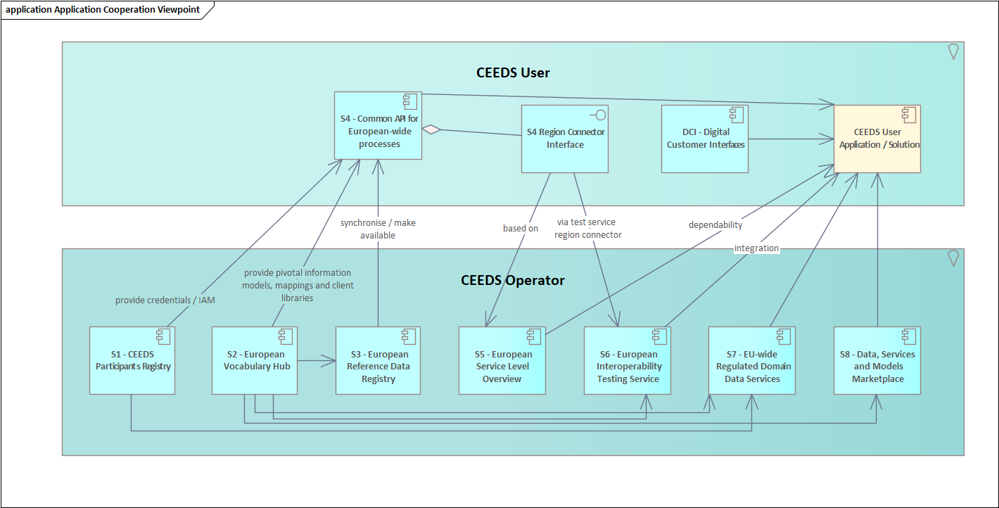

| ID  | Operating Service                                                                                                                   | Acronym |
|-----|-------------------------------------------------------------------------------------------------------------------------------------|---------|
| S1  | [CEEDS Participants Registry](ceeds-participants-registry/ceeds-participants-registry.md)                                           | CPR     |
| S2  | [European Vocabulary Hub](european-vocabulary-hub/european-vocabulary-hub.md)                                                       | EVH     |
| S3  | [European Reference Data Registry](european-reference-data-registry/european-reference-data-registry.md)                            | ERDR    |
| S4  | [Common API for European-wide Processes](common-api-for-european-wide-processes/common-api-for-european-wide-processes.md)          | CAEP    |
| S5  | [European Service Level Overview](european-service-level-overview/european-service-level-overview.md)                               | ESLO    |      
| S6  | [European Interoperability Testing Service](european-interoperability-testing-service/european-interoperability-testing-service.md) | EITS    |
| S7  | [European Data and Services Marketplace](european-data-and-services-marketplace/european-data-and-services-marketplace.md)          | EDSM    |
| S8  | [EU-wide Regulated-Domain Services](eu-wide-regulated-domain-services/eu-wide-regulated-domain-services.md)                         | ERDS    |
| DCI | [Digital Customer Interface](digital-customer-interface/digital-customer-interface.md)                                              | DCI     |

