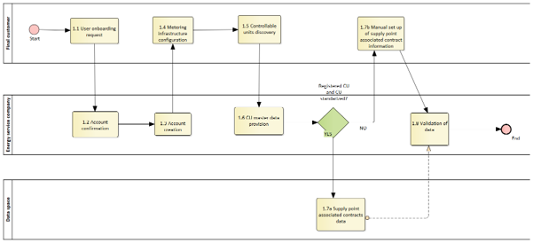
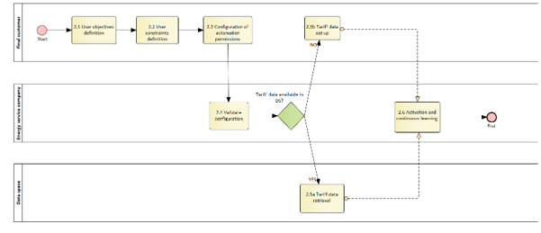
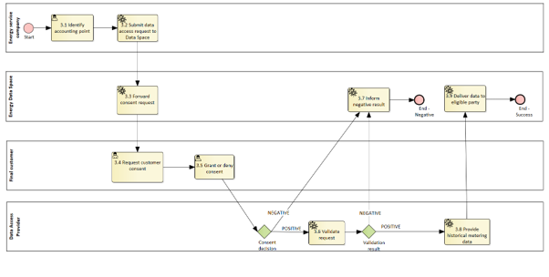
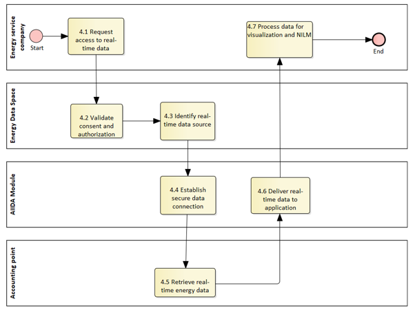
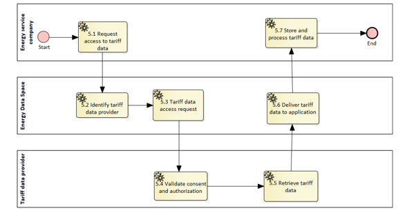
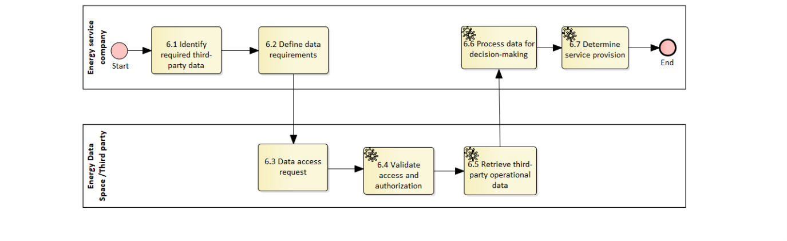
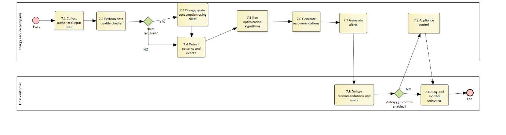
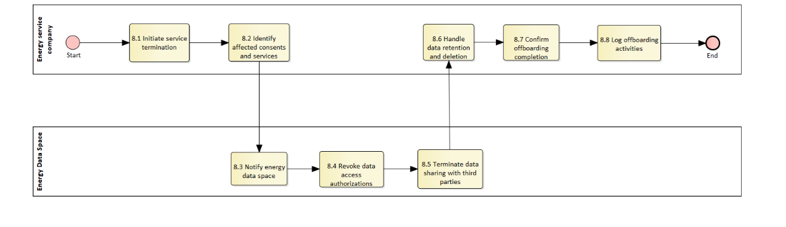

# Task 4.2 – Customer energy management

## Context/ Whereas

(1)     (1)	[TODO] If possible, please write explanations like recitals.

## Definitions

**CHAPTER I – GENERAL PROVISIONS**

*Issue 1* – On subject matter and scope

* [IGNORE FOR NOW]

*Issue 2* – On definitions

For the purpose of this implementing regulation, the definitions in Article 2 of Directive (EU) 2019/944 [TODO and state that the definitions in other pieces of European Legislation] shall apply. In addition, the following definitions shall apply:

(1)	[EXAMPLE] ‘market party’, in the context of this act, means organisations that take part in data exchange for the access to metering and consumption data, master data, supplier switching, demand response and other energy services.
(2)	[TODO] provide your additional definitions

**CHAPTER II – Regarding [YOUR USE CASE]**

**[NOTE]** Typically define responsibilities last and in close coordination with *T5.5 EU Policy and regulation alignment*

*Article XX*

### Responsibilities of ROLE1

* ROLE1 shall …

## Annex

**ANNEX A**

**A1. The reference model for [YOUR USE CASE]**

Table I contains information needed by [Stakeholder1 AND Stakeholder2] to set up for utilising [YOUR USE CASE] in a Member State.

### General Information

***Table I - General information on Member State environments***

Table I contains information needed by **[Stakeholder1 AND Stakeholder2]** to set up for utilising **[YOUR USE CASE]** in a Member State.

| ID | Name | Description |
|----|------|-------------|
| I1 | National competent authority | *Name* - Name of appointed national competent authority. *Website* - Website of appointed national competent authority. *Official contact* - Contact details for managing the mappings of national practices. |
| I2 | Information about permission administrators in a Member State (at least one mapping per each active consent administrator in a Member State) | *Name* - Name of the organisation. *Type of identification* - May be ACER registration code, Legal Entity Identifier (LEI), Bank Identifier Code (BIC), Energy Identification Code (EIC), Global Location Number (GLN/GS1) or National Identification Code (NIC). *Identification of organisation* - Code or identification within the identification space nominated above. *Website* - If applicable, link to website of a web application that is used for consent administration. *User interface* - URL or user portal. *Official contact* - Contact details for data sharing. *Consent management responsibility for* - Data Access Providers for which the consent administrator manages consents. Note that it is also valid for a Data Access Provider to utilise several consent administrators, and for a consent administrator to act for multiple Data Access Providers. *Documentation of access* - A self-sufficient explanation of the Member State provisions with regards to utilising access to validated historical consumption data by an eligible party. It is recommended to also include an English version of this documentation. *Identity service provider* - Identity service provider utilised by the consent administrator to authenticate final customers. *Eligible party onboarding* - Either a link to the English documentation of the onboarding procedure or a complete, self-sufficient English explanation for how an eligible party can onboard to the productive environment to utilise sharing of validated historical consumption data with an eligible party. *Eligible party test onboarding* - If applicable, either a link to the English documentation of the onboarding procedure or a complete, self-sufficient English explanation for how an eligible party can onboard to a test environment to utilise sharing of validated historical consumption data with an eligible party. *Price list for access to data by eligible parties* - Exhaustive description of all costs for eligible parties. |

### Relevant Roles

**[TODO]** Please describe all **HARMONISED ROLES** below.

***Table II - Roles***

| Role name | Role type | Role description |
|-----------|-----------|------------------|
| Final customer | Business | A party connected to the grid that purchases electricity for its own use. Please note that this also includes the case of an active customer. |
| Data provider | Business | A party that has a mandate to provide information to other parties in the energy market. |
| Data Access Provider | Business | A party responsible for facilitating access to data by the party connected to the grid or by other parties. |
| Eligible party | Business | An eligible party is an entity offering energy-related services to Final Customers, such as suppliers, transmission and distribution system operators, delegated operators and other third parties, aggregators, energy service companies, renewable energy communities, citizen energy communities and balancing service providers, as far as they offer energy-related services to Final Customers. |
| Energy service company | Business | A party offering energy-related services to the Party Connected to Grid, but not directly active in the energy value chain or the physical infrastructure itself. The Energy Service Company (ESCO) may provide insight services as well as energy management services. |
| Collective Energy Sharing Unit (CESU) operator | Business | A party responsible for organising a collective energy sharing unit settlement and billing. |
| Tariff data provider | Business | A party responsible for gathering and facilitating the tariff data of a final customer. Depending on the national regulation, the tariff data provider can be the DSO and/or the retailer. |                                                                                                                                                                                       All roles of type Business are expected to be acting in secure, authenticated manner and through trusted communication channels. For this reason, the authentication steps used for these communication partners are not listed in the scenarios below. 

### Procedures

**PROCEDURES**

***Table III - Procedure Conditions***

| No. | Procedure name | Primary actor | Pre-condition |
|------|----------------|---------------|---------------|
| 1 | Customer onboarding to energy management service | Final customer | • Application deployed • EDDIE framework connected to the national data hub/energy data space |
| 2 | Configuration of goals and preferences | Final customer | • User registered in the application • First time using the application / user wants to change their preferences |
| 3 | Access to historical metering and consumption data | Energy service company / Data Access Provider | • Smart meter deployed in the accounting point • EDDIE Framework deployed in the Member State |
| 4 | Access to real-time or near real-time data | Energy service company | • Access to smart meter RT data • Sub-metering data • < 15 minutes consumption data resolution • AIIDA module deployed in the country |
| 5 | Access to energy tariff data (grid fees, energy price and CESU prices) | Energy service company / Tariff data provider | • Customer tariff data available in the data space |
| 6 | Access to data for demand response or third-party services | Energy service company | • Third-party operational data accessible via the energy data space or authorized external interfaces |
| 7 | Provision of recommendations and alerts | Energy service company | • Previous procedures completed |
| 8 | Termination, Revocation and offboarding | Final customer | None specified |

All diagrams describing the scenarios are of an illustrative nature and follow Business Process Model and Notation 2.0 . Information objects referred in columns Information exchanged (IDs) are defined in Table IV.

#### Procedure 1 – Customer onboarding to energy management service– Category: Onboarding

***Table IV.1 – Customer onboarding to energy management service– Category: Onboarding***

| Step No. | Step | Step description | Information producer (actor) | Information receiver (actor) | Information exchanged (IDs) |
|-----------|------|------------------|------------------------------|------------------------------|-----------------------------|
| 1.1 | User onboarding request | The user sends a registration request, including basic data. | Final customer | Energy service company | A – User’s Basic data |
| 1.2 | Account confirmation | The user receives an email to confirm the registration. | Energy service company | Final customer | B – Account confirmation message |
| 1.3 | Account creation | The user confirms through the email link. | Final customer | Energy service company | C – Accounting point identification |
| 1.4 | Metering infrastructure configuration | The user fills data related to the metering and sub-metering infrastructure, such as device serial numbers and accounting meter identifiers. | Final customer | Energy service company | D – Metering device’s data |
| 1.5 | Controllable units discovery | The energy service company queries the Energy Data Space or associated registries to identify whether controllable units associated with the customer are already registered and accessible. | Energy service company | CU module administrator | E – CU master data |
| 1.6 | CU master data provision (Conditional: if the final customer has not registered any CU or the CU registration is not standardized) | The user provides information about the controllable units installed in their household. | Final customer | Energy service company | E – CU master data |
| 1.7a | Supply point associated contract information | If available, the energy service company retrieves the contract data associated with the supply point from the data space. | Energy service company | Data space | F – Supply point associated contracts data |
| 1.7b | Manual set up of supply point associated contract information | The user provides information related to their contracts, including contracted retailer, CESU and associated sharing coefficient, and DSO. | Final customer | Energy service company | F – Supply point associated contracts data |
| 1.8 | Validation of data | The application loads information sources according to the information provided in the previous steps and checks whether the data is available. If the data is not available, the application warns the user. | Energy service company | Final customer | G – Data validation |

Figure 1. Diagram corresponding to the procedure in Table IV.1.
#### Procedure 2 - Configuration of goals and preferences 

***Table IV.2 – Configuration of goals and preferences ***

| Step No. | Step | Step description | Information producer (actor) | Information receiver (actor) | Information exchanged (IDs) |
|-----------|------|------------------|------------------------------|------------------------------|-----------------------------|
| 2.1 | User objectives definition | The user defines their objectives (reduction of CO₂ emissions, reduction of energy consumption, minimal energy costs, etc.). | Final customer | Energy service company | H – User preferences and constraints |
| 2.2 | User constraints definition | The user defines their constraints related to minimum and maximum comfort boundaries, expected occupancy, times when each device must not be activated, and other relevant preferences. | Final customer | Energy service company | H – User preferences and constraints |
| 2.3 | Configuration of automation permissions | The user defines whether they agree to automatic actuation of devices or prefer to receive recommendations and manually actuate the devices. | Final customer | Energy service company | H – User preferences and constraints |
| 2.4 | Validate configuration | The application displays a summary of the preferences and constraints for the user to validate. | Energy service company | Final customer | — |
| 2.5a | Tariff data retrieval (condition: tariff data available in data space) | The application checks whether tariff data is available in the data space. If available, Procedure 5 is initiated. | Energy service company | Data Space | I – Energy tariff data |
| 2.5b | Tariff data set up (condition: if there is no tariff data available in the data space) | If tariff data is not available in the data space, the user manually enters their contract data through the application. | Final customer | Energy service company | I – Energy tariff data |
| 2.6 | Activation and continuous learning | Activation of the configuration and initiation of continuous monitoring and learning processes to refine recommendations and control strategies based on user behaviour and system performance. | Energy service company | Energy service company | — |

Figure 2. Diagram corresponding to the procedure in Table IV.2.

#### Procedure 3 - Access to historical metering and consumption data – Category: dataset creation

***Table IV.3 – Access to historical metering and consumption data – Category: dataset creation***

| Step No. | Step | Step description | Information producer (actor) | Information receiver (actor) | Information exchanged (IDs) |
|-----------|------|------------------|------------------------------|------------------------------|-----------------------------|
| 3.1 | Identify accounting point | The energy service company identifies the accounting point(s) for which historical metering and consumption data is required. | Energy service company | Energy service company | C – Accounting point identification |
| 3.2 | Submit data access request to Data Space | The eligible party submits a request to access historical metering and consumption data to the Energy Data Space, specifying the accounting point(s), scope, and purpose. | Energy service company | Energy Data Space | J – Data access request |
| 3.3 | Forward consent request | The Energy Data Space forwards the data access request to the Data Access Provider to initiate the customer consent process. | Energy Data Space | Data Access Provider | J – Data access request |
| 3.4 | Request customer consent | The Data Access Provider requests explicit consent from the final customer for the specified data access. | Data Access Provider | Final customer | K – Customer consent request |
| 3.5 | Grant or deny consent | The final customer grants or denies consent for the requested data access under the defined conditions. | Final customer | Data Access Provider | L – Customer consent decision |
| 3.6 | Validate request at Data Access Provider | Upon positive consent, the Data Access Provider and/or the responsible metering point administrator validates the request in terms of entitlement, scope, and regulatory compliance. | Data Access Provider | Energy Data Space | M – Request validation result |
| 3.7 | Inform energy service company about negative result | In case of negative consent or validation, the Energy Data Space informs the eligible party, including the reason for rejection. | Energy Data Space | Energy service company | M – Request validation result |
| 3.8 | Provide historical metering data | The Data Access Provider provides the authorised historical metering and consumption data. | Data Access Provider | Energy Data Space | N – Historical metering and consumption data |
| 3.9 | Deliver data to energy service company | The Energy Data Space delivers the authorised data to the energy service company. | Energy Data Space | Energy service company | N – Historical metering and consumption data |

Figure 3. Diagram corresponding to the procedure in Table IV.3. The components represented in blue are currently under consideration. 

#### Procedure 4 - Access to real-time or near real-time data

***Table IV.4 – Access to real-time or near real-time data***

| Step No. | Step | Step description | Information producer (actor) | Information receiver (actor) | Information exchanged (IDs) |
|-----------|------|------------------|------------------------------|------------------------------|-----------------------------|
| 4.1 | Request access to real-time data | The application requests access to real-time or near real-time energy data associated with the customer, specifying the type of data required (e.g. active power, appliance-level consumption) and the intended purpose (real-time visualization, NILM processing). | Energy service company | Energy data space | O – Real-time data access request, data type, purpose, customer ID |
| 4.2 | Validate consent and authorization | The energy data space verifies that the customer has provided valid consent for accessing real-time or near real-time data and checks authorization rules in accordance with data governance policies. | Energy data space | Energy data space | — |
| 4.3 | Identify real-time data source | The data space identifies the appropriate real-time data sources, including smart meters and smart devices connected via the AIIDA module. | Energy data space | AIIDA Module | P – Data source metadata |
| 4.4 | Establish secure data connection | The AIIDA module establishes a secure connection with the available real-time data sources associated with the customer in compliance with security and interoperability requirements. | AIIDA Module | Smart Meter / Smart Devices | Q – Device communication setup |
| 4.5 | Retrieve real-time energy data | Real-time or near real-time energy consumption and production data is collected from the smart meter and smart devices through the AIIDA module. | Accounting point | AIIDA Module | R – Real-time energy measurements |
| 4.6 | Deliver real-time data to application | The data space delivers the authorised real-time or near real-time energy data to the energy application via the data space. | AIIDA Module | Energy service company | R – Real-time energy measurements |
| 4.7 | Process data for visualization and NILM | The application processes the incoming real-time data for live visualization and feeds it to the NILM module to disaggregate appliance-level consumption (if not already available). | Energy service company | Energy service company | — |

Figure 4. Diagram corresponding to the procedure in Table IV.4. The components represented in blue are currently under consideration. 

#### Procedure 5– Access to energy tariff data (including grid fees, energy price and CESU prices)

***Table IV.5 – Access to energy tariff data (including grid fees, energy price and CESU prices)***
| Step No. | Step | Step description | Information producer (actor) | Information receiver (actor) | Information exchanged (IDs) |
|-----------|------|------------------|------------------------------|------------------------------|-----------------------------|
| 5.1 | Request access to tariff data | The energy application requests access to the customer’s applicable energy tariff data, including energy prices, grid fees and CESU prices (Collective Energy Sharing Unit), specifying the intended use for energy management and visualization purposes. | Energy service company | Energy Data Space | S – Tariff data access request |
| 5.2 | Identify tariff data provider | The Energy Data Space identifies the tariff data provider associated with the customer (e.g. DSO and/or energy retailer) based on the metadata of the tariff data sets available in the data space. | Energy Data Space | Energy Data Space | — |
| 5.3 | Request access to tariff data | The Energy Data Space forwards the request for access to tariff data to the tariff data provider, stating the identification of the energy service company and the purpose for accessing the data. | Energy Data Space | Tariff data provider | S – Tariff data access request |
| 5.4 | Validate consent and authorization | The tariff data provider verifies that the customer has granted consent to access the requested tariff data, validates authorization rules, and notifies the authorization to the energy service company. | Tariff data provider | Energy service company | T – Consent validation |
| 5.5 | Retrieve tariff data | Upon successful authorization, the Energy Data Space retrieves the applicable tariff data already available within the data space, including energy prices, grid fees and CESU-related pricing information. | Tariff data provider | Energy Data Space | I – Energy tariff data (energy price, grid fees, CESU prices) |
| 5.6 | Deliver tariff data to application | The authorised tariff data is delivered to the energy application for further processing and visualization. | Energy Data Space | Energy service company | I – Energy tariff data (energy price, grid fees, CESU prices) |
| 5.7 | Store and process tariff data | The energy application stores and processes the tariff data to enable cost-aware visualization and subsequent energy management services. | Energy service company | Energy service company | — |

Figure 5. Diagram corresponding to the procedure in Table IV.5. The components represented in blue are currently under consideration. 

#### Procedure 6 – Access to data for demand response or third-party services

***Table IV.6 – Access to data for demand response or third-party services***

| Step No. | Step | Step description | Information producer (actor) | Information receiver (actor) | Information exchanged (IDs) |
|-----------|------|------------------|------------------------------|------------------------------|-----------------------------|
| 6.1 | Identify required third-party data | The application identifies the third-party actors whose data is required to assess the provision of flexibility services or other third-party services (e.g. DSO, TSO, market platform, aggregator). | Energy service company | Energy service company | — |
| 6.2 | Define data requirements | The application determines the specific datasets needed to evaluate service activation conditions, such as flexibility requests, activation signals, market prices, technical constraints or service windows. | Energy service company | Energy service company | — |
| 6.3 | Request access to third-party data | The application requests access to the identified third-party operational data through the energy data space or other authorised interfaces, in accordance with applicable governance and access rules. | Energy service company | Energy data space / Third-party actor | U – Data access request to third-party data |
| 6.4 | Validate access and authorization | The energy data space or third-party actor validates the access request according to contractual agreements, authorization rules and data governance policies. | Energy data space / Third-party actor | Energy data space / Energy service company | V – Authorization confirmation |
| 6.5 | Retrieve third-party operational data | Upon successful authorization, the application retrieves the required third-party operational data needed for service evaluation and decision-making. | Energy data space / Third-party actor | Energy service company | W – Flexibility requests, activation signals, market or service data |
| 6.6 | Process data for decision-making | The application processes and contextualises the retrieved data and makes it available to the optimisation and decision-making logic. | Energy service company | Energy service company | — |
| 6.7 | Determine service provision | Based on the third-party data and internal optimisation logic, the application determines whether flexibility services or other third-party services should be provided and under which conditions. | Energy service company | Energy service company | — |

Figure 6. Diagram corresponding to the procedure in Table IV.6. The components represented in blue are currently under consideration. 

#### Procedure 7 – Provision of recommendations and alerts

***Table IV.7 – Provision of recommendations and alerts***

| Step No. | Step | Step description | Information producer (actor) | Information receiver (actor) | Information exchanged (IDs) |
|-----------|------|------------------|------------------------------|------------------------------|-----------------------------|
| 7.1 | Collect authorized input data | The energy application collects all authorized data required for recommendation generation, including historical consumption data, real-time or near real-time data, energy tariff information, CESU-related data, and data from demand response or third-party services. | Energy service company | Energy service company | — |
| 7.2 | Perform data quality checks | The application performs data validation and consistency checks to ensure completeness, timeliness, and reliability of the input data. | Energy service company | Energy service company | — |
| 7.3 | Disaggregate consumption using NILM (Conditional: if there is no device-level data) | The NILM module processes consumption data to disaggregate energy use at appliance level and identify consumption patterns. | Energy service company | Energy service company | — |
| 7.4 | Detect patterns and events | The application analyses historical and real-time data to detect relevant patterns, anomalies, or events, such as peak consumption periods, inefficient appliance usage, or deviations from user-defined preferences. | Energy service company | Energy service company | — |
| 7.5 | Run optimization algorithms | Optimization algorithms combine appliance-level consumption, tariff structures, CESU conditions, and demand response signals to identify energy-saving and cost-optimization opportunities. This includes implicit flexibility optimization and optimal explicit flexibility participation. | Energy service company | Energy service company | — |
| 7.6 | Generate recommendations | Based on the optimization results and user preferences, the application generates personalized energy consumption recommendations. | Energy service company | Energy service company | — |
| 7.7 | Generate alerts | The application generates alerts in response to relevant events, such as unusually high consumption, tariff changes, or demand response signals requiring user attention. | Energy service company | Energy service company | — |
| 7.8 | Deliver recommendations and alerts | The generated recommendations and alerts are delivered to the customer through the user interface of the application and as push notifications. | Energy service company | Final customer | X – Recommendations and alerts |
| 7.9 | Appliance control (Conditional: if the final customer allows automatic control over the appliances and it is possible) | If the user provides explicit authorization for automatic actuation on appliances that have recommended actions, and the appliance allows it, the application connects to and controls the appliance to implement the recommendation or demand response action. | Energy service company | Final customer | Y – Control command |
| 7.10 | Log and monitor outcomes | The application logs delivered recommendations and alerts to support monitoring, evaluation, and continuous improvement of the energy management service. | Energy service company | Energy service company | — |

Figure 7. Diagram corresponding to the procedure in Table IV.7. The components represented in blue are currently under consideration. 

#### Procedure 8 – Termination, Revocation and offboarding

***Table IV.8 – Termination, Revocation and offboarding***

| Step No. | Step | Step description | Information producer (actor) | Information receiver (actor) | Information exchanged (IDs) |
|-----------|------|------------------|------------------------------|------------------------------|-----------------------------|
| 8.1 | Initiate service termination | The customer initiates the termination of the energy management service or requests the revocation of previously granted data access and consents. | Final customer | Energy service company | Z – Revocation request |
| 8.2 | Identify affected consents and services | The application identifies the active services, data access permissions, and third-party authorizations affected by the termination or revocation request. | Energy service company | Energy service company | — |
| 8.3 | Notify energy data space | The application notifies the Energy Data Space of the termination or revocation request, specifying the consents and data flows to be revoked. | Energy service company | Energy data space | AA – Revocation request |
| 8.4 | Revoke data access authorizations | The Energy Data Space revokes the relevant data access authorizations in accordance with data space policies. | Energy data space | Energy data space | — |
| 8.5 | Terminate data sharing with third parties | The Energy Data Space ensures that data sharing with Data Access Providers, demand response services, and authorized third-party services is terminated in line with the revocation. | Energy data space | Third-party Services / Data Access Provider | AB – Data access termination notice |
| 8.6 | Handle data retention and deletion | The application and involved services handle data retention, deletion, or anonymization in accordance with contractual agreements, regulatory requirements, and data governance policies. | Energy service company | Energy service company | — |
| 8.7 | Confirm offboarding completion | The application confirms to the customer that the termination, revocation, and offboarding process has been successfully completed. | Energy service company | Final customer | AC – Offboarding confirmation |
| 8.8 | Log offboarding activities | The application logs the termination and offboarding actions to support auditability, compliance, and reporting. | Energy service company | Energy service company | — |

Figure 8. Diagram corresponding to the procedure in Table IV.8. The components represented in blue are currently under consideration. 

### Data Exchanged

**INFORMATION OBJECTS**

| Information exchanged, ID | Name of information | Description of information exchanged |
|---------------------------|---------------------|--------------------------------------|
| A | User basic's data | Basic data of the user that enables their registration. |
| B | Account confirmation | Validation of basic data provided by the user. |
| C | Accounting point identification | Identification data of the customer's accounting point(s), including meter identifiers and related metadata required to enable access to metering and consumption data. |
| D | Metering devices data | Master data related to the metering and sub-metering devices, including: • Metering point identifier • Sub-metering devices type • Sub-metering device manufacturer • Sub-metering devices controllability capabilities • Devices connected to the sub-metering devices |
| E | CU master data | Master data of the Controllable Units installed in the household of the user, including: • CU ID • Type of unit (HVAC, EV, PV, BESS, etc.) • Technology category (generation, storage, load) • Manufacturer • Installation location (building, household, CESU) • Power (kW) • Controllable power (min and max) • Energy capacity (for storage units) • Controllability type (setpoint-based, On/Off, Scheduled-based) |
| F | Supply point associated contracts data | Information about all contracts associated with the user, including: • Retailer • Associated DSO • Type of self-consumption • CESU contracts (if applicable) and coefficients |
| G | Data validation | Information provided by the application to the final customer, indicating which data is not available and explaining the resulting limitations on the application functionalities. |
| H | User preferences and constraints | Definition of the primary energy management objectives and constraints of the user, including: • User goals: cost optimisation, self-consumption maximisation, comfort preservation • Comfort constraints: temperature ranges, minimum SOC (for ESS), appliance usage constraints • Flexibility preferences: participation in flexibility services (yes/no) • Tariff-related parameters: tariff confirmation (if tariff data is available in the data space) or user-provided tariff data (if not available) • CESU-related preferences (if applicable) • Consent confirmation for optimisation and automatic control actions |
| I | Energy tariff data | Applicable energy tariff data for the customer, including energy prices and periods, grid fees, and CESU-related pricing information. |
| J | Data access request | Request to access consumption data of the customer sent through the data space. |
| K | Customer consent request | Consent request presented to the final customer, describing the requesting party, the data requested, the purpose of processing, and the validity conditions of the consent. |
| L | Customer consent decision | Explicit decision of the final customer granting or denying consent for the requested data access, including consent scope and validity status. |
| M | Request validation result | Result of the authorization and entitlement validation process, indicating approval or rejection of the data access request and, if applicable, the reason for rejection. |
| N | Historical metering and consumption data | Validated historical energy consumption and production data associated with the accounting point, provided at the available temporal resolution and in accordance with national regulations. |
| O | Real-time data access request | Request to access real-time or near real-time energy data, specifying customer identification, data type, temporal resolution, and intended use. |
| P | Data source metadata | Metadata describing the available real-time data sources, including device identifiers, data types, supported interfaces, and connectivity information. |
| Q | Device communication setup | Technical parameters and security credentials required to establish a secure communication channel with smart meters and smart devices. |
| R | Real-time energy measurements | Real-time or near real-time energy measurements, including consumption and production data, transmitted at the available temporal resolution. |
| S | Tariff data access request | Request to access customer-specific tariff data, including identification of the requesting energy service company and the intended use of the data. |
| T | Consent validation | Confirmation that valid customer consent and authorization exist for accessing the requested tariff data. |
| U | Data access request to third-party data | Request to access third-party operational data required for evaluating flexibility provision or other third-party services, including service context and data scope. |
| V | Authorization confirmation | Confirmation that access to the requested third-party operational data has been authorized under the applicable contractual and governance conditions. |
| W | Flexibility requests, activation signals, market or service data | Operational data provided by third parties, such as flexibility requests, activation signals, market-related information, or service constraints, used to support decision-making. |
| X | Recommendations and alerts | Personalised recommendations and alerts generated by the application, aimed at improving energy efficiency, optimising costs, and supporting informed customer decisions, based on historical data, real-time data, tariff information, and third-party service signals. |
| Y | Control command | Control command issued by the application to an appliance or controllable unit, specifying the requested action, timing, and operational parameters. |
| AA | Revocation request | Request initiated by the final customer to terminate the energy management service and/or revoke previously granted data access consents. |
| AB | Data access termination notice | Notification indicating that previously authorised data access has been terminated and propagated to the relevant data providers and third-party services in accordance with consent revocation and offboarding procedures. |
| AC | Offboarding confirmation | Confirmation that the termination, revocation, and offboarding process has been completed, including confirmation of data access revocation and service deactivation. |
