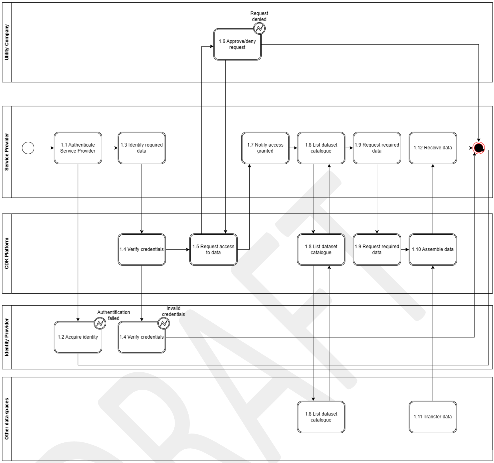
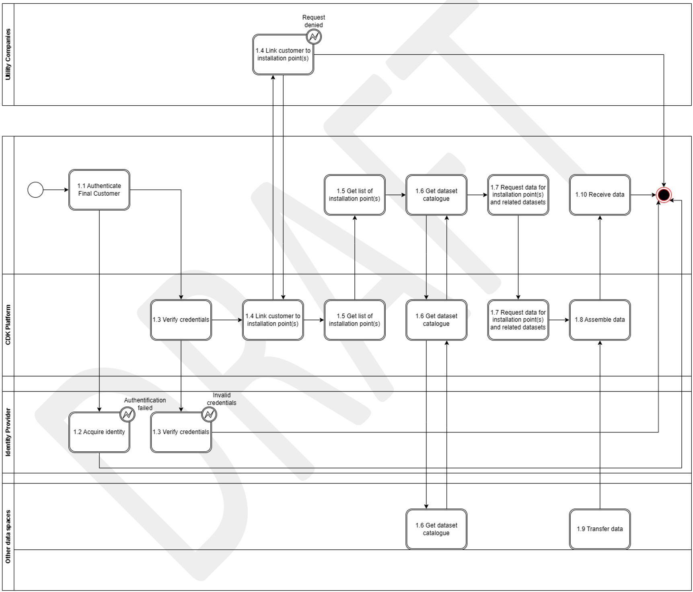

## Context/ Whereas

(1) [TODO] If possible, please write explanations like recitals.

CHAPTER I

**Regarding GENERAL PROVISIONS**

*Issue 1*

**On subject matter and scope**

(1) [IGNORE FOR NOW]

## Definitions

*Issue 2*

**On definitions**

For the purpose of this implementing regulation, the definitions in Article 2 of Directive (EU) 2019/944 [TODO and state that the definitions in other pieces of European Legislation] shall apply. In addition, the following definitions shall apply:

(1) [EXAMPLE] 'market party', in the context of this act, means organisations that take part in data exchange for the access to metering and consumption data, master data, supplier switching, demand response and other energy services.

(2) [TODO] provide your additional definitions

## Responsibilities of Market Roles

CHAPTER II

**Regarding Sector-Coupled Data Integration (SCDI) Use case 14**

**[NOTE] Typically define responsibilities last and in close coordination with *T5.5 EU Policy and regulation alignment***

*Article XX*

**On responsibilities of ROLE1**

1. ROLE1 shall ...

## Annex

ANNEX A

**A1. The reference model for Sector-Coupled Data Integration (SCDI) Use case 14**

***Table I - General information on Member State environments***

Table I contains information needed by stakeholder 1 and 2 to set up for utilising Sector-Coupled Data Integration (SCDI) Use case 14 in a Member State.

| ID  | Name                                                              | Description                                                                                                                                                                                                           |
|-----|-------------------------------------------------------------------|-----------------------------------------------------------------------------------------------------------------------------------------------------------------------------------------------------------------------|
| I1  | National competent authority                                      | *Name* - Ministry of Digital affairs Denmark (Digitaliseringsministeriet) *Website* - https://www.digmin.dk/ *Official contact* - Dansk Data Space Forum. (tobpan@digst.dk) |
| I2  | Information about permission administrators in a Member State (at least *one mapping per each active consent administrator in a Member State*) | *Name* - Center Denmark. *Type of identification* - CVR nr. 40176764 *Identification of organisation* - (Code or identification within the identification space nominated above). *Website* - https://www.centerdenmark.com/ *User interface* - https://portal.centerdenmark.com/en-US/ *Official contact* - dataservices@centerdenmark.com *Consent management responsibility for* - *Trefor (https://www.trefor.dk/) DSO district heating, electricity and water.* *Documentation of access* - *TBD* *Identity service provider* - *TBD* *Eligible party onboarding* - *TBD* *Eligible party test onboarding* - *TBD* *Price list for access to data by eligible parties* - *TBD* |

**Please describe all *HARMONISED ROLES* below.**

### Relevant Roles

***Table II - Roles***

| Role name                                     | Role type | Role     description                                                                                                                                                                                                                                                                                                                                                                                                     |
|-----------------------------------------------|-----------|----------------------------------------------------------------------------------------------------------------------------------------------------------------------------------------------------------------------------------------------------------------------------------------------------------------------------------------------------------------------------------------------------------------------|
| Final Customer                                | Business  | A party connected to the grid that providing district heating, electricity or water.                                                                                                                                                                                                                                                                                                                                  |
| Connecting system operator (CSO)              | Business  | The national competent authority providing the mappings of national practices. It makes them available online and in an easily usable and publicly accessible form[^1].                                                                                                                                                                                                                                               |
| Digital customer interface (DCI)              | System    | A system -- hardware or cloud-based -- that: monitors and makes available to entitled actors measurement data from customer premises (e.g. close-to-realtime smart metering data, data from controllable units); receives command-and-control data from (connecting) system operator(s) and other entitled actors and makes it available to entitled actors. For the abovementioned activities, the *Digital Customer Interface* manages the consent of the *Final Customer*. |
| Energy management system (EMS)                | System    | A system that optimises the flow of district heating, electricity or/and water at the connection agreement point by controlling technical resources (e.g. batteries, inverters, charging stations, heat pumps etc.) at final customer premises. **Note:** EMS may exist in a very comprehensive and advanced form (e.g. a building automation system controlling the vast majority of appliances), or in rudimentary versions (e.g. an inverter combined with a battery management system just controlling the most significant assets in a household). |
| Load control system (LCS)                     | System    | A system employed by the CSO that monitors the state of critical network elements (CNEC) within a grid area, and makes available that data to other systems.                                                                                                                                                                                                                                                         |
| Flexible connection dispatching system (FCDS) | System    | A system employed by the CSO that processes measured and calculated data from other systems (e.g. the LCS or DCS), and assigns dynamic connection limitations to the connection agreement points under management.                                                                                                                                                                                                    |

All roles of type *Business* are expected to be acting in secure, authenticated manner and through trusted communication channels. For this reason, the authentication steps used for these communication partners are not listed in the scenarios below.

### Procedures

**List of procedures.**

***Table III - Procedure Conditions***

| No. | Procedure name                                                                                                                                                                     | Primary actor                  | Pre-condition                                              |
|-----|------------------------------------------------------------------------------------------------------------------------------------------------------------------------------------|--------------------------------|------------------------------------------------------------|
| 1   | Setup of the digital customer interface with secure login and ability to select relevant datasets and give 3 party vendors access to data with access equivalent to what is agreed between the parties | Customer and 3. party vendor   | Customer has an active contract                            |
| 2   | Revocation of data connection agreement by the customer                                                                                                                            | Customer                       | Customer has access to functionality within the platform   |
| 3   | Termination of the data connection agreement by the connecting system operator.                                                                                                    | Eligible party                 | Customer has access to functionality within the platform   |
| 4   | Operation of the data connection agreement                                                                                                                                         | Connecting system operator     | Connectors available through common data space             |
| 5   | Onboarding of the existing and new customers                                                                                                                                       | Customer                       | Contracts with costumer in place and data definition       |

#### Procedure 1 -- Service Provider access data

| Step No. | Step                          | Step description                                                                                                                                                                                  | Information producer (actor) | Information receiver (actor) | Information exchanged (IDs) |
|----------|-------------------------------|---------------------------------------------------------------------------------------------------------------------------------------------------------------------------------------------------|------------------------------|------------------------------|-----------------------------|
| 1.1      | Authenticate Service Provider | The service provider logs in to the platform through an identity provider                                                                                                                         | Service provider             | Service provider             | A - Identity                |
| 1.2      | Acquire identity              | The identity provider grants the service provider an identity in the form of a token                                                                                                              | Service provider             | Identity Provider            | A -- Identity               |
| 1.3      | Identify required data        | The service provider identifies the data required to provide their service                                                                                                                        | Service provider             | Service provider             | \-                          |
| 1.4      | Verify credentials            | The service provider accesses the CDK platform and starts out by identifying themselves with the previously acquired token. The token is then verified against the identity provider.             | CDK                          | Identity Provider            | A -- Identity               |
| 1.5      | Request access to data        | The service provider creates a data access request in the platform for the required data.                                                                                                         | Service provider             | CDK                          | B -- Data access request    |
| 1.6      | Approve/deny request          | The utility company is notified of the request and processes it.                                                                                                                                  | CDK                          | Utility Company              | B -- Data access request    |
| 1.7      | Notify access granted         | The service provider is notified of the result of their request.                                                                                                                                  | Utility Company              | CDK                          | C -- Request response       |
| 1.8      | List dataset catalogue        | The service provider views a list of datasets, which can be combined with the metering data. These datasets are both from within the CDK platform and any other data space connected platform     | CDK/data spaces              | Service provider             | F -- List of datasets       |
| 1.9      | Request required data         | If their request has been granted, the service provider can request the data through the CDK platform.                                                                                            | Service provider             | CDK                          | D -- Data request           |
| 1.10     | Assemble data                 | If necessary, the required data can be coupled together from different sources. These sources could both be different sources within the CDK platform and data from other data spaces.            | CDK                          | CDK                          | D -- Data request           |
| 1.11     | Transfer data                 | If data from other data spaces is required, the platform fetches this data and provides it to the service provider.                                                                               | CDK                          | Data Space                   | D -- Data request           |
| 1.12     | Receive data                  | The service provider receives the requested data.                                                                                                                                                 | CDK                          | Service provider             | E - Data                    |

#### Procedure 2 -- Final Customer access data

| Step No. | Step                                   | Step description                                                                                                                                                                                  | Information producer (actor) | Information receiver (actor) | Information exchanged (IDs)    |
|----------|----------------------------------------|---------------------------------------------------------------------------------------------------------------------------------------------------------------------------------------------------|------------------------------|------------------------------|--------------------------------|
| 1.1      | Authenticate Final Customer            | The final customer logs in to the platform through an identity provider                                                                                                                           | Final Customer               | Final Customer               | A - Identity                   |
| 1.2      | Acquire identity                       | The identity provider grants the Final Customer an identity in the form of a token                                                                                                                | Final Customer               | Identity Provider            | A -- Identity                  |
| 1.3      | Verify credentials                     | The Final Customer accesses the CDK platform and starts out by identifying themselves with the previously acquired token. The token is then verified against the identity provider.               | CDK                          | Identity Provider            | A -- Identity                  |
| 1.4      | Link customer to installation point(s) | The Final Customer is linked to their installation points                                                                                                                                         | CDK                          | Utility Company              | F -- Installation point ownership |
| 1.5      | Get list of installation point(s)      | The Final Customer can see their own installation point(s)                                                                                                                                        | CDK                          | Final Customer               | G - Installation point list    |
| 1.6      | List dataset catalogue                 | The final customer views a list of datasets, which can be combined with the metering data. These datasets are both from within the CDK platform and any other data space connected platform       | CDK/data spaces              | Final Customer               | F -- List of datasets          |
| 1.7      | Request data for installation point(s) | The Final Customer requests the data for one or more installation points                                                                                                                          | Final Customer               | CDK                          | D -- Data request              |
| 1.8      | Assemble data                          | If necessary, the required data can be coupled together from different sources. These sources could both be different sources within the CDK platform and data from other data spaces.            | CDK                          | CDK                          | D -- Data request              |
| 1.9      | Transfer data                          | If data from other data spaces is required, the platform fetches this data and provides it to the final customer.                                                                                 | CDK                          | Data Space                   | D -- Data request              |
| 1.10     | Receive data                           | The final customer receives the requested data.                                                                                                                                                   | CDK                          | Service provider             | E - Data                       |

***Table IV - Information exchanged***

| Information exchanged, ID | Name of information   | Description of information exchanged |
|---------------------------|-----------------------|--------------------------------------|
| A                         | Identity              |                                      |
| B                         | Data access request   |                                      |
| C                         | Request response      |                                      |
| D                         | Data request          |                                      |
| E                         | Data                  |                                      |

[^1]: Note that the referred information will also be published and accessible from the *EU Advisory Authority*.
