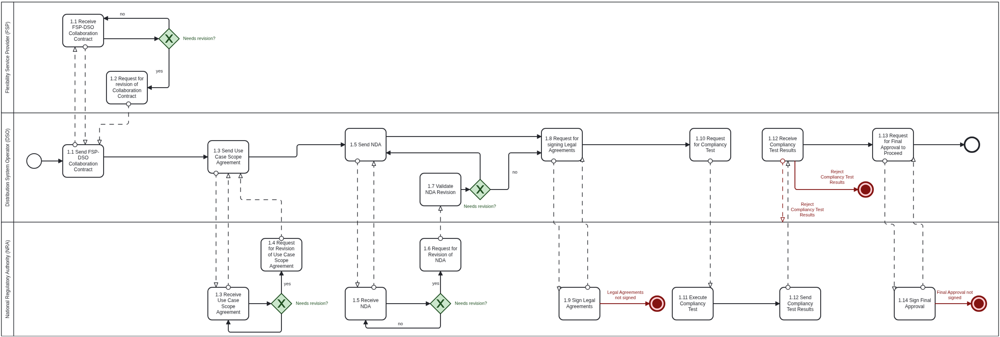
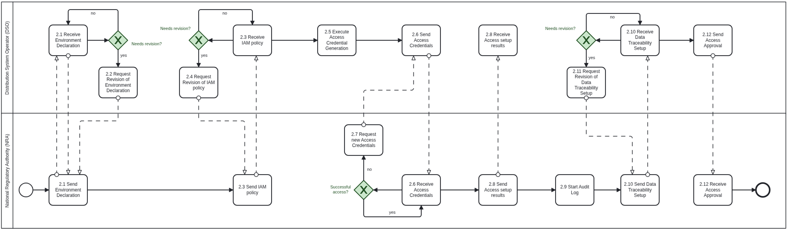
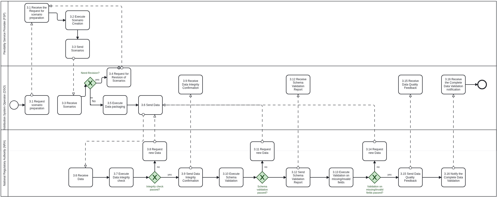
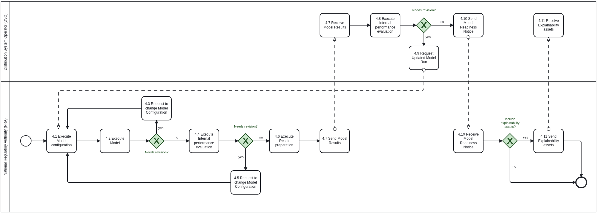
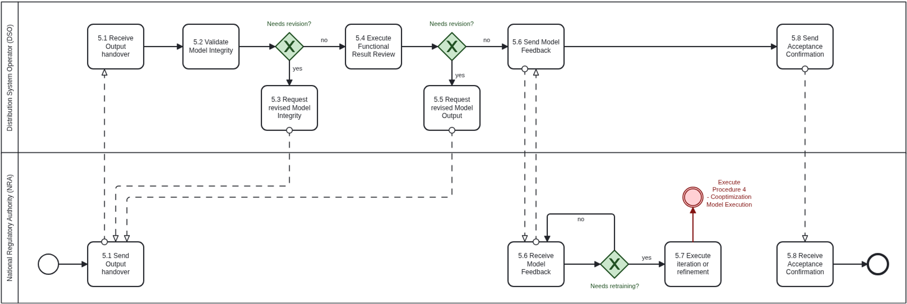
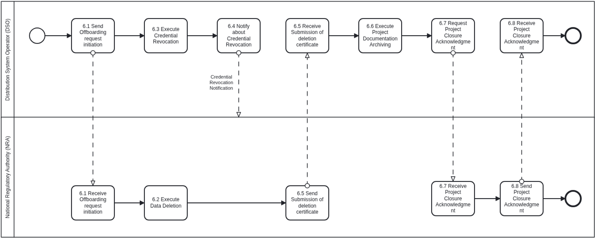
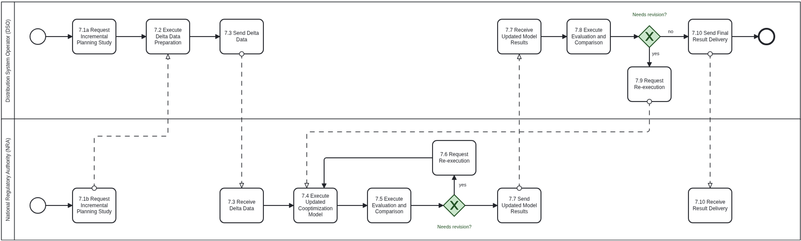

## Context

As Distributed Energy Resources' (DER) penetration rate levels and distributed flexibility investments are continuously growing, various smart grid actors need to coordinate their planning decisions under a co-optimized DER siting/sizing and Distribution Network Expansion Planning (DNEP) framework. From DSO's perspective, state-of-the-art DNEP-related models opt for system-friendly DER investments, which satisfy the required technical standards regarding reliability and security of supply, but do not guarantee the financial sustainability of profit-based DER investments made by private companies called Energy or Flexibility Service Providers (ESPs/FSPs). On the other hand, ESPs/FSPs opt for profit-maximizing DER planning decisions, which may lead to unnecessarily higher DNEP-related costs for the DSO or may also lead to unpredictably higher RES spillage in the long term. This use case proposes a novel ESP-DSO coordination scheme, which strikes an optimal balance between regulated DNEP-related investments (made by the DSO) and profit-based DER investments (made by the ESP/FSP). The proposed service can be exploited as a regulatory sandbox to be used by the national regulatory authorities (or policy makers) towards validating and promoting sophisticated Flexible Connection Agreements (FCAs) that maximize the long-term social welfare and accelerate the clean energy transition. This reference model outlines the roles, procedures, agreements and responsibilities necessary to implement such Public-Private-Partnership (PPP) schemes within a Member State.

CHAPTER I

**Regarding GENERAL PROVISIONS**

*Issue 1*

**On subject matter and scope**

(1) [IGNORE FOR NOW]

## Definitions

*Issue 2*

**On definitions**

In addition to the definitions in Article 2 of Directive (EU) 2019/944 and relevant provisions of the Data Governance Act, the following definitions shall apply:

- **"Distribution System Operator (DSO)"** means the entity responsible for operating, maintaining, and developing the distribution system for electricity in a given territory, ensuring system reliability, security of supply, and non-discriminatory access to the grid. In the context of this reference model, the DSO acts as the data provider, infrastructure operator, and recipient of the regulatory sandbox's outputs for distribution network expansion planning (DNEP) and optimal DERs' sizing and siting within a given DN territory.

- **"Energy/Flexibility Service Providers (ESPs/FSPs)"** are market entities that aggregate, manage and offer flexibility resources---such as distributed RES (PV, wind, etc.), storage, and controllable loads into electricity markets or directly to system operators. Their role is to provide balancing, congestion management and ancillary services by adjusting consumption or generation in response to market signals or grid needs. ESPs/FSPs may not necessarily own physical assets; they often act as intermediaries or aggregators, enabling small-scale DERs to participate competitively in energy markets. In the context of this reference model, the ESP/FSP acts as the data provider, DER operator and recipient of the regulatory sandbox's outputs for optimal DERs' sizing and siting within a given DN territory. ESPs/FSPs are profit-seeking private companies aiming at maximizing their expected profits from the long-term DER planning decisions.

- **"National Regulatory Authority (NRA)"** is responsible for overseeing the national implementation of EU energy legislation and market rules. NRAs approve tariffs, monitor market behavior, approve/review network codes and investment plans. Within the scope of this use case, the proposed FSP-DSO coordination scheme is supervised, reviewed and approved by the NRA via the use of the proposed regulatory sandbox (simulation tool).

- **"Data Hosting Agreement"** refers to a legally binding agreement between the involved actors (i.e. DSO, FSP and NRA) that defines the terms under which the NRA may temporarily store, access and process DSO/FSP-provided data within its secure infrastructure, including provisions on data confidentiality, security, access limitations and deletion obligations.

- **"Data Processing Agreement (DPA)"** means a legally binding agreement under Article 28 of the General Data Protection Regulation (GDPR), defining the roles, responsibilities and technical safeguards related to the processing of personal data by the NRA on behalf of the DSO and FSP.

- **"Model output"** refers to the results produced by the regulatory sandbox, such as the long-term DER/DNEP planning results and KPIs, which are provided back to the DSO and FSP.

- **"Intellectual Property Rights (IPR)"** addresses legal rights concerning proprietary models, algorithms, software and documentation developed independently by the DSO or FSP during the execution of the contract, excluding DSO/FSP-owned data or results derived solely from such data.

- **Add more?**

## Responsibilities of Market Roles

CHAPTER II

**Regarding [INTERFLEX USE CASE]**

### Article 1 - On responsibilities of the Distribution System Operator (DSO) and the Flexibility Service Provider (FSP)

**The DSO and FSP shall:**

1. **Define Use Case Scope**
   The two actors will co-determine the scope of the co-optimized DER/DNEP objectives, the required datasets and future scenarios to be used as input to the simulation tool.

2. **Legal and Contractual Framework**
   Conclude all necessary legal instruments, including:
   - A Non-Disclosure Agreement (NDA);
   - A Data Hosting Agreement (DHA) specifying conditions for off-site data storage;
   - A Data Processing Agreement (DPA) in line with applicable data protection regulations;
   - Clauses covering the treatment of Intellectual Property Rights (IPR).

3. **Data Provisioning and Documentation**
   Curate and prepare the datasets to be shared, accompanied by schema definitions, metadata and access instructions.

4. **Data Transfer**
   Facilitate secure transfer of the data to the NRA-hosted secure environment, using encrypted channels and formats.

5. **Monitoring and Auditing**
   Maintain oversight of data access logs and audit trails, either directly or through shared mechanisms provided by the NRA.

6. **Output Evaluation and Feedback**
   Review the model outputs received from the NRA (i.e. long-term DNEP/DER planning results and related KPIs) and provide feedback or request iterations.

7. **Termination and Data Recall**
   Ensure that data shared under the agreement is deleted or returned at the end of the project and that a deletion certificate is received from the NRA.

### Article 2 - On responsibilities of the NRA

**The NRA shall:**

1. **Operate a Secure Compute Environment**
   Provide and maintain a secure regulatory sandbox environment for processing DSO and FSP data.

2. **Handle and Process Data Responsibly**
   Use the DSO- and FSP-provided data only for the agreed use case, in accordance with the Data Hosting and Processing Agreement and applicable law.

3. **Respect Intellectual Property Rights (IPR)**
   - Retain ownership of pre-existing models, algorithms and toolchains (Background IP).
   - Clearly mark and document any proprietary components used in the project deliverables.

4. **Run and Evaluate Optimization Models**
   Execute optimization models within the secure environment, ensuring transparency in methods and reproducibility of results.

5. **Deliver Outputs to the DSO and FSP**
   Provide the DSO and FSP with the resulting long-term DNEP and DER planning decisions respectively, performance KPIs, or other relevant deliverables in the required format and timeframe.

6. **Ensure Data Deletion**
   At project end or upon DSO's or FSP's request, delete all copies of the shared data and submit a signed data deletion confirmation or certificate.

## Annex

ANNEX A

**A1. The reference model for [INTERFLEX USE CASE]**

### General Information

***Table I - General information on Member State environments***

Table I contains information needed by [Stakeholder1 AND Stakeholder2] to set up for utilising [YOUR USE CASE] in a Member State.

| ID  | Name                         | Description                                                                                                                                                                                                           |
|-----|------------------------------|-----------------------------------------------------------------------------------------------------------------------------------------------------------------------------------------------------------------------|
| I1  | National competent authority | *Name* - Entidade Reguladora dos Serviços Energéticos (ERSE) *Website* - [https://www.erse.pt](https://www.erse.pt) *Official contact* - erse@erse.pt |
| I2  | Permission Administrators | *Name* - REN - Rede Eléctrica Nacional, S.A. (Portuguese TSO) *Type of identification* - Energy Identification Code (EIC) *Identification of organisation* - 10XPT-REN------9 *Website* - [https://www.ren.pt/](https://www.ren.pt/) *User interface* - URL or user portal. *Official contact* - Contact details for data sharing. *Consent Management Responsibility* - Responsible for managing data access and consent-related provisions for historical grid operation data, and system operational data. *Documentation of Access* - Access to operational and historical data is governed by national energy regulations, with additional provisions defined by ERSE and REN. Specific project-level data sharing is managed through bilateral agreements. *Identity Service Provider* - Corporate federated authentication systems and REN internal identity management platform. *Eligible party onboarding* - Eligible parties (e.g., contracted AI vendors) must first enter into a formal agreement with the Portuguese TSO (REN) covering confidentiality, data hosting, and access control. A compliance review ensures IAM, RBAC, and audit logging are properly configured. Final approval is confirmed by REN. *Eligible party test onboarding* - See Eligible party onboarding. *Price list for access to data by eligible parties* - Free of charge. |

**[TODO] Please describe all *HARMONISED ROLES* below.**

### Relevant Roles

***Table II - Roles***

| Role name                             | Role type | Role description                                                                                                                                                                                                                                                                 |
|---------------------------------------|-----------|----------------------------------------------------------------------------------------------------------------------------------------------------------------------------------------------------------------------------------------------------------------------------------|
| Distribution System Operator (DSO)    | Business  | The entity responsible for managing the distribution grid and acting as data provider and consumer. Data Provider, KPI Consumer, Compliance Authority                                                                                                                            |
| Flexibility Service Provider (FSP)    | Business  | The entity responsible for investing, managing and operating a DER portfolio acting as data provider and consumer. Data Provider, KPI consumer                                                                                                                                   |
| NRA-Hosted Secure Compute environment | System    | A secure simulation environment (regulatory sandbox), managed by the NRA, for testing, experimenting and evaluating DER/DNEP co-optimization model outputs based on the data provided by the DSO and FSP for a given territory (or else distribution network branch/microgrid). Data Consumer, Secure Host, Optimization Model Developer, KPI & Result Provider |

All roles of type *Business* are expected to be acting in secure, authenticated manner and through trusted communication channels. For this reason, the authentication steps used for these communication partners are not listed in the scenarios below.

### Procedures

**[TODO] First step should be to clearly state the list of procedures.**

***Table III - Procedure Conditions***

| No. | Procedure name                                                                                    | Primary actor | Pre-condition                                                                                                              |
|-----|---------------------------------------------------------------------------------------------------|---------------|----------------------------------------------------------------------------------------------------------------------------|
| 1   | Legal Onboarding & Agreement Setup                                                                | DSO/FSP & NRA | Collaboration scope (use case) defined; NDA, DPA and Data Hosting Agreement signed                                         |
| 2   | Credential provision & access configuration                                                       | DSO & FSP     | Legal agreements signed; environment declared compliant                                                                    |
| 3   | Data Preparation, scenario creation & transfer to regulatory sandbox (simulation) environment     | DSO & FSP     | Secure channel established; Credentials active; Infrastructure and access control setup at NRA side                        |
| 4   | Co-Optimization Model Execution                                                                   | NRA           | Data successfully transferred and validated                                                                                |
| 5   | Result Submission & Delivery to DSO and FSP                                                       | NRA           | Outputs generated and integrity checks passed                                                                              |
| 6   | Data deletion and offboarding                                                                     | NRA           | Project completed or terminated; all obligations under data handling contract fulfilled                                     |
| 7   | Incremental decision making for future updated coordinated DNEP/DER planning studies              | NRA           | DNEP/DER-related investments have taken place and real-life market results are assessed for incremental decision making     |

All diagrams describing the scenarios are of an illustrative nature and follow *Business Process Model and Notation 2.0*[^1]*.* Information objects referred in columns *Information exchanged (IDs)* are defined in Table IV.

#### Procedure 1 - Legal Onboarding & Agreement Setup

| Step No. | Step                                                               | Step description                                                                                                                                        | Information producer (actor) | Information receiver (actor) | Information exchanged (IDs)                |
|----------|--------------------------------------------------------------------|---------------------------------------------------------------------------------------------------------------------------------------------------------|------------------------------|------------------------------|--------------------------------------------|
| 1.1      | Send FSP-DSO Collaboration Contract                                | Formalize collaboration scope, including all grid-related data provided by DSO and business-related data of FSP                                         | DSO                          | FSP                          | A - FSP-DSO Collaboration Scope Agreement |
| 1.2      | [Conditional] Request for Revision of FSP-DSO Collaboration Contract | Request updates to the FSP-DSO collaboration scope or clarify terms before acceptance                                                                 | FSP                          | DSO                          | A - FSP-DSO Collaboration Scope Agreement |
| 1.3      | Send Use Case Scope Agreement                                      | Formalize collaboration scope, including goals (e.g., optimization tool's parameters and decision variables for co-optimized DER/DNEP planning) and boundaries. | DSO                    | NRA                          | B - Use Case Scope Agreement              |
| 1.4      | [Conditional] Request for revision of Use Case Scope Agreement     | Request updates and clarifications w.r.t. each actor's contributions in the FSP-DSO coordinated planning scheme                                        | NRA                          | DSO (& FSP)                  | B - Use Case Scope Agreement              |
| 1.5      | Send NDA                                                           | Draft and exchange a non-disclosure agreement for mutual confidentiality.                                                                               | DSO                          | NRA                          | C - NDA Document                          |
| 1.6      | [Conditional] Request for revision of NDA - NRA                    | Request changes to NDA terms before signing - NRA side.                                                                                                | NRA                          | DSO                          | C - NDA Document                          |
| 1.7      | [Conditional] Request for revision of NDA - DSO                    | Request changes to NDA terms before signing - DSO side.                                                                                                | DSO                          | NRA                          | C - NDA Document                          |
| 1.8      | Request for signing Legal Agreements                               | Initiate the process of signing the finalized use case scope agreement and NDA.                                                                         | DSO                          | NRA                          | D - Signed Legal Agreements               |
| 1.9      | Sign Legal Agreements                                              | Officially sign all required legal documents (use case scope agreement, NDA, etc.).                                                                     | NRA                          | DSO                          | D - Signed Legal Agreements               |
| 1.10     | Request for Compliancy Test                                        | Ask NRA to conduct a test demonstrating compliance with required regulatory sandbox (simulation environment) standards.                                  | DSO                          | NRA                          | E - Regulatory Sandbox Compliance Report  |
| 1.11     | Execute compliancy test                                            | Perform tests to ensure that the regulatory sandbox (simulation tool) complies with legal, business and technical requirements.                          | NRA                          | NRA                          | [not relevant]                             |
| 1.12     | Send Compliancy Test Results                                       | Submit formal results of the compliance test to both actors (DSO & FSP). In case of a failed test, a meaningful indication is provided.                  | NRA                          | DSO (& FSP)                  | E - Regulatory Sandbox Compliance Report  |
| 1.13     | Request for Final Approval to Proceed                              | Grant formal approval to proceed with technical onboarding and data sharing.                                                                            | DSO                          | NRA                          | F - Legal Onboarding Approval             |
| 1.14     | Sign Final Approval                                                | Confirm final legal onboarding approval, enabling the start of the technical phase.                                                                     | NRA                          | DSO (& FSP)                  | F - Legal Onboarding Approval             |

***Table IV - Information exchanged***

| Information exchanged, ID | Name of information                   | Description of information exchanged |
|---------------------------|---------------------------------------|--------------------------------------|
| A                         | FSP-DSO Collaboration Scope Agreement | *Use case title* - Short description of the FSP-DSO collaboration purpose. *Operational goal* - Short explanation of each actor's BAU planning/investment studies and how the proposed collaboration will produce "win-win" business contexts. *Scope boundaries* - Limits on functionality, planning horizon timeframe, data classes, data privacy, data granularity, etc. *Required data domains* - DSO grid-related data and FSP business-related data. |
| B                         | Use Case Scope Agreement              | *Use case title* - Short description of the use case purpose. *Operational goal* - Planning objectives, such as co-optimized DNEP and DER planning and over-arching KPIs. *Scope boundaries* - Limits on functionality, timeframe, or data classes. *Required data domains* - Forecasts, grid topology, asset data, DER data, CAPEX data, OPEX data, etc. |
| C                         | NDA Document                          | *NDA terms* - Draft clauses on confidentiality, duration, and allowed disclosures. *Document version* - Internal version number for traceability. *Signatory roles* - Identified individuals or positions expected to sign. |
| D                         | Signed Legal Agreements               | *Signed NDA* - Final mutual confidentiality agreement. *Signed DHA* - Data Hosting Agreement defining secure processing conditions. *Signed DPA* - GDPR-compliant Data Processing Agreement. *IPR provisions* - Ownership clauses for pre-existing and project-specific IP. |
| E                         | Regulatory Sandbox Compliance Report  | *Hosting description* - Cloud/on-prem environment, provider, isolation model. *Security controls* - Encryption at rest/in transit, firewall, etc. *Access management* - RBAC, IAM setup, personnel roles. *Audit readiness* - Logging configuration, traceability. *DEMO results* - Basic KPIs, illustrative figures, etc. demonstrating simulation tool's capabilities |
| F                         | Legal Onboarding Approval             | *Approval status* - Confirmation that all required legal and technical documents have been reviewed. *Timestamp* - Date/time of approval issuance. *Approving party* - Name or unit within each actor authorizing onboarding. |

#### Procedure 2 - Credential Provision & Access Configuration

| Step No. | Step                                                        | Step description                                                                                     | Information producer (actor) | Information receiver (actor) | Information exchanged (IDs)        |
|----------|-------------------------------------------------------------|------------------------------------------------------------------------------------------------------|------------------------------|------------------------------|------------------------------------|
| 2.1      | Send Environment Declaration                                | The NRA describes the technical specifications of its secure regulatory sandbox environment.          | NRA                          | DSO (& FSP)                  | G - Environment Declaration       |
| 2.2      | [Conditional] Request for Revision of Environment Declaration | Request changes to the Environment Declaration.                                                    | DSO                          | NRA                          | G - Environment Declaration       |
| 2.3      | Send IAM policy submission                                  | The NRA provides its identity & access management (IAM) policy.                                      | NRA                          | DSO (& FSP)                  | H - IAM & RBAC Policy             |
| 2.4      | [Conditional] Request for Revision of IAM policy            | The DSO requests changes to the IAM policy.                                                          | DSO                          | NRA                          | H - IAM & RBAC Policy             |
| 2.5      | Execute Access Credentials Generation                       | The DSO creates secure credentials for the NRA.                                                      | DSO                          | DSO                          | I - Access Credentials            |
| 2.6      | Send Access Credentials                                     | The DSO sends the secure Access Credentials to the NRA.                                              | DSO                          | NRA                          | I - Access Credentials            |
| 2.7      | [Conditional] Request new Access Credentials                | The NRA requests new Access Credentials in case the provided Credentials fail.                       | NRA                          | DSO                          | I - Access Credentials            |
| 2.8      | Send Access setup results                                   | The NRA confirms the secure Access Credentials are correctly integrated.                             | NRA                          | DSO                          | J - Access Setup Report           |
| 2.9      | Start Audit Log                                             | The NRA activates audit logging and confirms Data Traceability Setup.                                | NRA                          | NRA                          | K - Audit Log Activation Notice   |
| 2.10     | Send Data Traceability Setup                                | The NRA provides the Data Traceability Setup.                                                        | NRA                          | DSO                          | K - Audit Log Activation Notice   |
| 2.11     | [Conditional] Request Revision of Data Traceability Setup   | The DSO requests revision of the Data Traceability Setup.                                            | DSO                          | NRA                          | K - Audit Log Activation Notice   |
| 2.12     | Send Access Approval                                        | The DSO gives final approval to start data transfer.                                                 | DSO                          | NRA                          | L - Access Go-Ahead Confirmation  |

***Table IV - Information exchanged***

| Information exchanged, ID | Name of information          | Description of information exchanged |
|---------------------------|------------------------------|--------------------------------------|
| G                         | Environment Declaration      | *Compute environment type* - Description of the technical infrastructure (e.g., dedicated cloud tenancy, on-premises cluster). *Cloud service provider* - Name of the provider (e.g., AWS, Azure, GCP), if applicable. *Physical/geographic location* - Region or country where the infrastructure is hosted. *Isolation guarantees* - Explanation of how the environment is separated from other tenants (e.g., virtual private cloud, dedicated instances). *Network perimeter controls* - Firewall configuration, ingress/egress filtering, DMZ presence. *Data storage architecture* - Local vs. distributed, object or block storage, and encryption methods used. *Optimization framework* - Description of commercial optimization solvers, open-source code, technical documentation, algorithmic operation, input parameters, decision variables. |
| H                         | IAM & RBAC Policy            | *IAM framework* - Type of identity management system used (e.g., OAuth2, SAML, custom IAM). *Role-based access control (RBAC)* - List of access roles (e.g., admin, analyst) and their associated privileges. *Access provisioning process* - Description of how users are onboarded and permissions are granted. *De-provisioning procedures* - Process for revoking access upon offboarding or role change. *Personnel assignments* - Names and roles of personnel responsible for technical and data access. |
| I                         | Access Credentials           | *Credential type* - Format of credential (e.g., API key, VPN certificate, authentication token). *Scope of access* - What systems or datasets the credentials permit access to. *Issuance metadata* - Time of creation, expiration rules, and issuing authority. *Transmission method* - Secure method used to deliver credentials (e.g., encrypted email, one-time token URL). |
| J                         | Access Setup Report          | *Setup confirmation status* - Whether the access setup succeeded or failed (e.g., success flag or status code). *Endpoint integration* - Confirmation that the intended endpoint (e.g., API gateway) was reached. *Test transaction result* - Outcome of a test connection or data pull. *Responsible integrator* - Name and contact details of the person who conducted the access setup. |
| K                         | Audit Log Activation Notice  | *Logging system used* - Platform or tool used for logging (e.g., ELK, CloudTrail, custom). *Activated log types* - Types of events being logged (e.g., login attempts, data access, configuration changes). *Retention period* - Duration logs will be stored (e.g., 6 months, 1 year). *Traceability mechanisms* - Whether logs can be tied to specific users/actions with timestamps. *Compliance reference* - Reference to compliance standards being met (e.g., ISO 27001, GDPR). |
| L                         | Access Go-Ahead Confirmation | *Approval status* - Formal approval signal (e.g., "Approved", "Access Granted"). *Timestamp* - Date and time when the access was approved. *Approving entity* - Name of the unit, team, or authority at the DSO (and FSP) responsible for final approval. *Conditions or notes* - Any caveats or follow-up checks required after access approval. |

#### Procedure 3 - Data Preparation, scenario creation & transfer to regulatory sandbox (simulation) environment

| Step No. | Step                                              | Step description                                                                                                                  | Information producer (actor) | Information receiver (actor) | Information exchanged (IDs)          |
|----------|---------------------------------------------------|-----------------------------------------------------------------------------------------------------------------------------------|------------------------------|------------------------------|--------------------------------------|
| 3.1      | Request scenario preparation                      | The DSO requests business-related scenarios for the FSP's optimal DER planning problem.                                           | DSO                          | FSP                          | M - Scenario Creation                |
| 3.2      | Execute Scenario Creation                         | The FSP runs its own optimal DER planning problem and short-lists the most important and representative future scenarios.         | FSP                          | FSP                          | M - Scenario Creation                |
| 3.3      | Send scenarios                                    | The FSP sends its business-related scenarios.                                                                                     | FSP                          | DSO                          | M - Scenario Creation                |
| 3.4      | [Conditional] Request for Revision of Scenarios   | Request changes to FSP's scenarios.                                                                                               | DSO                          | FSP                          | M - Scenario Creation                |
| 3.5      | Execute Data Packaging                            | The DSO compiles and prepares all input datasets and scenarios for the co-optimized DNEP/DEP planning problem                     | DSO                          | DSO                          | N - Dataset & Metadata Bundle        |
| 3.6      | Send Data                                         | The DSO transfers the input datasets via a secure encrypted channel to the NRA                                                    | DSO                          | NRA                          | O - Secure Data Transfer Notice     |
| 3.7      | Execute Data Integrity check                      | The NRA performs checksum/hash verification of the received data.                                                                 | NRA                          | NRA                          | P - Data Integrity Confirmation     |
| 3.8      | [Conditional] Request new Data                    | The NRA requests new data in case the integrity check failed.                                                                     | NRA                          | DSO                          | P - Data Integrity Confirmation     |
| 3.9      | Send Data Integrity Confirmation                  | The NRA provides the Data Integrity Confirmation                                                                                  | NRA                          | DSO                          | P - Data Integrity Confirmation     |
| 3.10     | Execute Schema Validation                         | The NRA validates the structure, format, and consistency of the input datasets.                                                   | NRA                          | NRA                          | Q - Schema Validation Report        |
| 3.11     | [Conditional] Request new Data                    | The NRA requests new data in case the Schema Validation failed.                                                                   | NRA                          | DSO                          | Q - Schema Validation Report        |
| 3.12     | Send Schema Validation Report                     | The NRA provides the Schema Validation Report to the DSO.                                                                         | NRA                          | DSO                          | Q - Schema Validation Report        |
| 3.13     | Execute Validation on missing/invalid fields      | The NRA validates the dataset for missing/invalid fields.                                                                         | NRA                          | NRA                          | R - Data Quality Feedback           |
| 3.14     | [Conditional] Request new Data                    | The NRA requests new data in case the Validation on missing/invalid fields failed.                                                | NRA                          | DSO                          | R - Data Quality Feedback           |
| 3.15     | Send Data Quality Feedback                        | The NRA provides the Feedback on the Data Quality to the DSO.                                                                     | NRA                          | DSO                          | R - Data Quality Feedback           |
| 3.16     | Notify the Complete Data Validation               | Once all data is validated, NRA sends readiness signal to begin co-optimization model execution.                                  | NRA                          | DSO                          | S - Data Validation Complete Notice |

***Table IV - Information exchanged***

| Information exchanged, ID | Name of information           | Description of information exchanged |
|---------------------------|-------------------------------|--------------------------------------|
| M                         | Scenario Creation             | *Demand/supply curves* - Future projections (forecasts) data (e.g. based on optimistic/normal/pessimistic scenarios) *Market prices* - Future projections of day-ahead market prices *Investment parameters & constraints* - Maximum available budget for new DN lines and DERs, Investment risk levels, confidence levels, etc. *Planning horizon parameters* - Time & space related granularities and constraints, incremental vs. long-term planning, etc. *Representative days* - Definition of the exact number of representative days together with their weights. |
| N                         | Dataset & Metadata Bundle     | *Time-series load and generation (injection) data* - Historical injection measurements per grid node or zone. *Grid topology* - Network structure including buses, lines, substations, transformers, technical grid constraints, etc. *Asset data* - Static and dynamic properties of DERs and grid infrastructure (e.g., ratings, failure histories, operational models, etc.). *Metadata schema* - Description of dataset columns, types, units, and constraints. *Data extraction timestamp* - Time when the snapshot was compiled, for traceability. |
| O                         | Secure Data Transfer Notice   | *Transfer confirmation* - Signal that the data was uploaded and is available in the NRA's environment. *Transfer protocol* - Method used for transfer (e.g., SFTP, HTTPS upload, VPN channel). *Encryption method* - Details on encryption in transit (e.g., TLS 1.3, AES-256). *Upload location* - Secure file path or storage endpoint. *Timestamp* - Date and time of successful upload. |
| P                         | Data Integrity Confirmation   | *Hash/checksum values* - Cryptographic hash values used to verify file integrity (e.g., SHA-256). *Comparison result* - Boolean or match indicator showing successful validation. *Tool used* - Software or command-line utility applied for hash calculation. *Verifier identity* - Name or role of individual/system who performed the check. |
| Q                         | Schema Validation Report      | *Validation status* - Pass/fail or structured result per dataset/table. *Expected schema vs. actual* - Description of discrepancies (if any). *Parsing issues* - Records or fields that failed structural parsing. *Schema compliance standard* - Reference to expected data model or schema document. |
| R                         | Data Quality Feedback         | *Missing values report* - Fields or records with nulls or blanks. *Outliers or inconsistencies* - Statistical anomalies or format mismatches. *Datatype mismatches* - Detected columns with incorrect or unexpected data types. *Corrective recommendations* - Instructions or suggestions for reformatting, re-upload, or clarification. *Responsible validator* - Contact information of the QA party at the NRA. |
| S                         | Data Validation Complete Notice | *Approval status* - Confirmation that data is fully ready for model execution and experimentation. *Scope of approval* - Which data domains or files are covered (e.g., all vs. partial dataset). *Timestamp* - Date and time of readiness confirmation. *Approving team/entity* - Technical or project lead responsible for issuing the go-ahead. |

#### Procedure 4 - Co-Optimization Model Execution

| Step No. | Step                                                  | Step description                                                                                                                          | Information producer (actor) | Information receiver (actor) | Information exchanged (IDs)                            |
|----------|-------------------------------------------------------|-------------------------------------------------------------------------------------------------------------------------------------------|------------------------------|------------------------------|--------------------------------------------------------|
| 4.1      | Execute Model Configuration                           | NRA prepares the input parameters, decision variables and KPIs and selects appropriate model architecture.                                | NRA                          | NRA                          | T - Model Configuration Record                        |
| 4.2      | Execute Model                                         | NRA runs the co-optimization model using its secure infrastructure.                                                                       | NRA                          | NRA                          | U - Model Run Log files                               |
| 4.3      | [Conditional] Request to change Model Configuration   | The NRA requests new Model configuration in case the Model Execution failed.                                                              | NRA                          | NRA                          | U - Model Run Log files                               |
| 4.4      | Execute Internal performance evaluation               | The NRA evaluates model output using internal validation sets.                                                                            | NRA                          | NRA                          | V - Evaluation Summary Report                         |
| 4.5      | [Conditional] Request to change Model Configuration   | The NRA requests new Model configuration in case the Model performance evaluation failed.                                                 | NRA                          | NRA                          | V - Evaluation Summary Report                         |
| 4.6      | Execute Result preparation                            | Outputs (e.g., long-term planning decisions, risk assessment, KPIs) are prepared in agreed format.                                        | NRA                          | NRA                          | W - Result Package                                    |
| 4.7      | Send Model Results                                    | The NRA provides the training results to the DSO and FSP.                                                                                 | NRA                          | DSO (& FSP)                  | W - Result Package, X - Model Output Readiness Notice |
| 4.8      | Execute Internal performance evaluation               | The DSO evaluates model output using internal validation sets.                                                                            | DSO                          | DSO                          | V - Evaluation Summary Report                         |
| 4.9      | [Conditional] Request updated Model Run               | The DSO requests updated Model Configurations and Runs in case the resulting performance is out of pre-defined boundaries/constraints     | DSO                          | NRA                          | V - Evaluation Summary Report                         |
| 4.10     | Send Model Readiness Notice                           | The DSO sends the Model readiness notification to the NRA.                                                                                | DSO                          | NRA                          | X - Model Output Readiness Notice                     |
| 4.11     | [Conditional] Send Explainability assets              | Optional technical annexes (e.g., sensitivity analysis on specific KPIs, visualizations) are attached.                                    | NRA                          | DSO (& FSP)                  | Y - Explainability Annex                              |

***Table IV - Information exchanged***

| Information exchanged, ID | Name of information           | Description of information exchanged |
|---------------------------|-------------------------------|--------------------------------------|
| T                         | Model Configuration Record    | *Model architecture* - Name or type of model used (e.g. co-optimization, multi-objective optimization). *Simulation setup parameters* - Simulation time, convergence parameters, scalability parameters, technical confidence levels, unit granularity levels, etc. *Hyperparameters* - Regularization settings, dropout rate, search depth, etc. *Software environment* - Libraries, frameworks (e.g., Python version, TensorFlow, etc), commercial optimization solvers. *Input data specification* - Description of which input fields from the dataset are used and how they are pre-processed. |
| U                         | Model Run Log files           | *Execution timestamps* - Start and end time of optimization model. *Resource utilization* - CPU/GPU consumption, memory footprint, disk I/O. *Run ID/version tag* - Unique identifier for reproducibility. *Error logs (if any)* - Captured warnings, divergence indicators, lack of memory warnings, optimality gap divergence, etc. *Checkpoints or snapshots* - Intermediate model states saved for rollback, continuation or parallel execution. |
| V                         | Evaluation Summary Report     | *Validation metrics* - Key Performance indicators (KPIs) such as planning decisions, annual total DER profits, total DNEP-related CAPEX, consumers' bills decrease, generation cost decrease, satisfaction/violation of grid/business-related constraints, etc. *Evaluation datasets* - Description of internal data used for validation. *Optimality gap analysis* - Gap between the theoretical optimum and validation performance. *Run comparison* - If multiple configurations were tested, comparative results. *Remarks from analyst* - Qualitative insights or flags about performance variance. |
| W                         | Result Package                | *Planning decisions* - Where, how much and what type of DERs are to be installed across the entire area of the DN under consideration, how many and capacity of new DN lines to be installed to upgrade/ reinforce the DN *KPI estimates* - Key Performance indicators (KPIs) such as planning decisions, annual total DER profits, total DNEP-related CAPEX, consumers' bills decrease, generation cost decrease, satisfaction/violation of grid/business-related constraints, business risk sensitivity analysis, etc. *Data format* - Delivered format (e.g., JSON, CSV). *Timestamp of generation* - Exact time when the result files were finalized. *Schema or dictionary* - File defining structure and meaning of delivered data. |
| X                         | Model Output Readiness Notice | *QC status* - Confirmation that outputs passed internal validation and QC gates. *Validation date* - Date of final check. *Responsible reviewer* - Technical lead or quality control contact. *Approval version/tag* - Tagged release of the result set being shared. |
| Y                         | Explainability Annex          | *Feature attribution plots* - SHAP, LIME, or permutation importance charts. *Visual diagnostics* - Histograms, bar charts, line charts, pie charts, etc. *Model confidence summaries* - Confidence intervals or probability distributions for key outputs. *KPI breakdowns* - Decomposition of risk or performance metrics by feature or segment. *Export format* - PDF reports, Jupyter notebooks, HTML dashboards, etc. |

#### Procedure 5 - Result Submission & Delivery to DSO and FSP

| Step No. | Step                                            | Step description                                                                                  | Information producer (actor) | Information receiver (actor) | Information exchanged (IDs)    |
|----------|-------------------------------------------------|---------------------------------------------------------------------------------------------------|------------------------------|------------------------------|--------------------------------|
| 5.1      | Send Output handover                            | The NRA transfers the model output package to the DSO and FSP in a secure manner.                 | NRA                          | DSO (& FSP)                  | Z - Final Output Submission   |
| 5.2      | Validate Model Integrity                        | The DSO (and FSP) validate the structure, schema and completeness of received data.               | DSO (FSP)                    | DSO (FSP)                    | AA - Output Integrity Log     |
| 5.3      | [Conditional] Request revised Model Integrity   | The DSO requests a revised Model Integrity in case the integrity validation failed.               | DSO                          | NRA                          | AA - Output Integrity Log     |
| 5.4      | Execute Functional Result Review                | The DSO evaluates KPIs and planning outputs for operational usability.                            | DSO                          | DSO                          | AB - Output Assessment Report |
| 5.5      | [Conditional] Request revised Model Output      | The DSO requests a revised Model Output in case the functional result review failed.              | DSO                          | NRA                          | AB - Output Assessment Report |
| 5.6      | Send Model Feedback                             | The DSO provides comments or identifies issues, if any, for correction or iteration.              | DSO                          | NRA                          | AC - Result Feedback Note     |
| 5.7      | [Conditional] Execute iteration or refinement   | If needed, NRA re-executes and fine-tunes the co-optimization model for improved results.         | NRA                          | DSO                          | AD - Iteration Response Log   |
| 5.8      | Send Acceptance Confirmation                    | The DSO formally accepts the result package and marks use case as successfully completed.         | DSO                          | NRA                          | AE - Result Acceptance Notice |

***Table IV - Information exchanged***

| Information exchanged, ID | Name of information        | Description of information exchanged |
|---------------------------|----------------------------|--------------------------------------|
| Z                         | Final Output Submission    | *Model outputs* - Optimal DNEP/DER planning decisions, expected KPI values (for each model variant and scenario), predictions, operational recommendations. *Data format* - Structured delivery (e.g., JSON, CSV, XML) as per agreement. *Supporting metadata* - Column descriptions, timestamps, run ID, model version. *Encryption or upload method* - Secure transmission details (e.g., VPN, HTTPS). *Delivery timestamp* - Exact time and date of submission. |
| AA                        | Output Integrity Log       | *Checksum/hash match* - Verification of file integrity via cryptographic methods. *Schema compliance* - Whether all fields and types match expected format. *Completeness check* - Confirmation that no files, rows, or key values are missing. *Validator identity* - Team or system at DSO and FSP that performed the validation. *Date of verification* - Timestamp of completed validation. |
| AB                        | Output Assessment Report   | *Technical evaluation* - Accuracy of forecasts, completeness of KPIs, adherence to functional specifications and business requirements/constraints. *Operational relevance* - Usability in long-term planning to proceed with commonly agreed, coordinated and "win-win" DNEP/DER investments in real-life. *Observed anomalies* - Any unexpected behavior or values in outputs. *Score or threshold result* - Quantified performance metrics vs. acceptance criteria. *Reviewer notes* - Comments or caveats for downstream users. |
| AC                        | Result Feedback Note       | *Feedback type* - Clarification request, error flag, improvement proposal. *Affected components* - Specific fields or outputs needing revision. *Correction urgency* - Critical/important/optional categorization. *DSO contact info* - Person/team responsible for feedback communication. *Requested turnaround time* - Expected timing for a response or fix. |
| AD                        | Iteration Response Log     | *Updated model details* - What changes were made (e.g., retraining, hyperparameter tuning). *Result delta* - Difference in KPI values or forecasts from prior versions. *Validation re-run status* - Whether new results passed internal tests. *Version identifier* - New run ID or version tag. *Submission timestamp* - Time of updated output delivery. |
| AE                        | Result Acceptance Notice   | *Acceptance status* - Final go-ahead for short-listing the result package as one of the candidate long-term planning solutions. *Scope of acceptance* - Whether full or partial dataset/model has been accepted. *Authorized signer/team* - DSO and FSP contact confirming approval. *Document reference* - ID or link to signed record of acceptance. *Timestamp* - Date of acceptance issuance. |

#### Procedure 6 - Data deletion and offboarding

| Step No. | Step                                        | Step description                                                                                            | Information producer (actor) | Information receiver (actor) | Information exchanged (IDs)                      |
|----------|---------------------------------------------|-------------------------------------------------------------------------------------------------------------|------------------------------|------------------------------|--------------------------------------------------|
| 6.1      | Send Offboarding request initiation         | The DSO initiates closure by issuing formal offboarding instructions.                                       | DSO                          | NRA                          | AF - Offboarding Instruction                    |
| 6.2      | Execute Data Deletion                       | The NRA deletes all DSO/FSP-provided data and logs the action.                                              | NRA                          | NRA                          | AG - Data Deletion Log                          |
| 6.3      | Execute Credential Revocation               | The DSO revokes or disables NRA access to secure interfaces.                                                | DSO                          | DSO                          | [not relevant]                                   |
| 6.4      | Notify about Credential Revocation          | The DSO notifies the NRA about the credential revocation.                                                   | DSO                          | NRA                          | AH - Access Termination Notice                  |
| 6.5      | Send Submission of deletion certificate     | NRA provides formal signed confirmation of deletion.                                                        | NRA                          | DSO (& FSP)                  | AI - Data Deletion Certificate, AG - Data Deletion Log |
| 6.6      | Execute Project Documentation Archiving     | The DSO stores final project records for traceability, compliance and future verification purposes.         | DSO                          | DSO                          | AJ - Final Archive Index                        |
| 6.7      | Request Project Closure Acknowledgment      | The DSO acknowledges the project closure and regulatory compliance.                                         | DSO                          | NRA                          | AK - Collaboration Closure Memo                 |
| 6.8      | Send Project Closure Acknowledgment         | The NRA acknowledges the project closure and regulatory compliance.                                         | NRA                          | DSO (& FSP)                  | AK - Collaboration Closure Memo                 |

***Table IV - Information exchanged***

| Information exchanged, ID | Name of information          | Description of information exchanged |
|---------------------------|------------------------------|--------------------------------------|
| AF                        | Offboarding Instruction      | *Instruction type* - Formal request to initiate offboarding. *Effective date* - Date on which data deletion and access removal should begin. *Included data scope* - Specific folders, datasets and services to be deleted. *Reference documents* - Linked agreements or data hosting terms. *DSO point of contact* - Responsible party issuing the offboarding request. |
| AG                        | Data Deletion Log            | *Deletion timestamps* - Time each dataset or file was removed. *Files/directories affected* - List of data objects deleted. *Tool or script used* - Deletion method or utility name. *System confirmation codes* - Return values or confirmations from deletion process. *Performed by* - Identity of the person/system that executed deletion. |
| AH                        | Access Termination Notice    | *Credential types revoked* - API keys, user accounts, VPN certificates. *Revocation time* - Timestamp of when each credential was disabled. *Systems affected* - Portals, storage endpoints, or access points. *Change verification* - Confirmation from IAM system or logs. *SO security contact* - Person responsible for access deprovisioning. |
| AI                        | Data Deletion Certificate    | *Statement of deletion* - Declaration confirming all DSO and FSP data has been purged. *Authorized signature* - Legally accountable person or officer at NRA. *Date of certification* - When the declaration was finalized. *Covered data scope* - Listing of datasets, models, logs, or backups included. *Optional attachment* - Snapshot of deletion logs or logs digest. |
| AJ                        | Final Archive Index          | *List of archived documents* - Contracts, final outputs, audit reports, certificates. *Storage location* - Internal archive location or system reference. *Retention policy* - Duration and regulatory basis for storage. *Access controls* - Who can view or retrieve the archive. *Archival timestamp* - Date/time when archiving was completed. |
| AK                        | Collaboration Closure Memo   | *Closure summary* - Confirmation that offboarding steps were completed. *Parties involved* - DSO, FSP and NRA representatives. *Reference to artifacts* - Links or identifiers for deletion logs, certificates, archive index. *Final sign-off* - Names and signatures or approval emails. *Date of closure* - Official project closure date. |

#### Procedure 7 - Incremental decision making for future updated coordinated DNEP/DER planning studies

| Step No. | Step                                      | Step description                                                                                                                          | Information producer (actor) | Information receiver (actor) | Information exchanged (IDs)                    |
|----------|-------------------------------------------|-------------------------------------------------------------------------------------------------------------------------------------------|------------------------------|------------------------------|------------------------------------------------|
| 7.1a     | Request Incremental Planning Study        | The DSO detects a need for updating the past FSP-DSO collaborative investment based on updated data context.                              | DSO                          | NRA                          | AL - Updated Co-optimization Trigger Notice   |
| 7.1b     | Request Incremental Planning Study        | The NRA detects a need for updating the past FSP-DSO collaborative investment based on updated data context.                              | NRA                          | DSO                          | AL - Updated Co-optimization Trigger Notice   |
| 7.2      | Execute Delta Data Preparation            | The DSO prepares new data (e.g., operational data, updated KPIs, updated forecasts & projections)                                         | DSO                          | DSO                          | AM - Delta Dataset                            |
| 7.3      | Send Delta Data                           | The DSO provides new data to the NRA (e.g., operational data, updated KPIs, updated forecasts & projections).                             | DSO                          | NRA                          | AM - Delta Dataset                            |
| 7.4      | Execute Updated Co-optimization Model     | The NRA performs the updated investment study following the same procedures with the original one.                                         | NRA                          | NRA                          | AN - Re-execution Log                         |
| 7.5      | Execute Evaluation and Comparison         | The updated model is benchmarked against prior version.                                                                                   | NRA                          | NRA                          | AO - Evaluation Comparison Report             |
| 7.6      | [Conditional] Request Re-execution        | The NRA requests for re-execution in case internal Evaluation and Comparison failed.                                                      | NRA                          | NRA                          | AO - Evaluation Comparison Report             |
| 7.7      | Send Updated Model Results                | The NRA provides the updated model results to the DSO (and FSP).                                                                          | NRA                          | DSO (& FSP)                  | AO - Evaluation Comparison Report             |
| 7.8      | Execute Evaluation and Comparison         | The updated model is benchmarked against prior version.                                                                                   | DSO                          | DSO                          | AO - Evaluation Comparison Report             |
| 7.9      | [Conditional] Request Re-execution        | The DSO requests for re-execution in case internal Evaluation and Comparison failed or specific comments need to be addressed             | DSO                          | NRA                          | AO - Evaluation Comparison Report             |
| 7.10     | Send Final Result Delivery                | Final updated model output results are delivered back to DSO (and FSP).                                                                   | NRA                          | DSO (& FSP)                  | AP - Updated Result Package                   |

***Table IV - Information exchanged***

| Information exchanged, ID | Name of information                    | Description of information exchanged |
|---------------------------|----------------------------------------|--------------------------------------|
| AL                        | Updated Co-optimization Trigger Notice | *Trigger source* - DSO operator request, performance monitoring alert, or user feedback. *Observed degradation* - Description of issue (e.g., prediction error, concept drift, KPI drop, regulatory changes, constraint violations, updated projections out of agreed confidence/risk intervals, etc). *Trigger date* - When the re-execution need was logged. *Requested improvement goal* - Target KPIs or use-case behavior post-re-execution. *Responsible requester* - Role or team initiating the re-execution process. |
| AM                        | Delta Dataset                          | *Data type* - New data, corrected labels, expanded features, new forecast data, etc. *Volume and scope* - Size (rows/MB), time range, or coverage of data. *Schema version* - Reference to the schema document or spec for this dataset. *Secure transfer method* - How the dataset was delivered (e.g., encrypted SFTP, GCS link). *Timestamp of provision* - When the delta data was uploaded/shared. |
| AN                        | Re-execution Log                       | *Run configuration* - Updated simulation setup, input parameters, decision variables, KPIs, hyperparameters, etc. *Model lineage ID* - Version tree link to the prior model. *Compute environment* - Hardware, GPU type, RAM, provider used. *Runtime duration* - Start and end timestamps. *Error log (if any)* - Training halts, anomalies, or warnings. |
| AO                        | Evaluation Comparison Report           | *Old vs. new KPIs* - Before-and-after performance summary. *Validation method* - Hold-out, k-fold cross-validation, live A/B test. *Risk/robustness checks* - Stress tests, error bounds, outlier impact. *Model confidence delta* - Change in confidence intervals or prediction uncertainty. *Evaluation reviewer* - Analyst or data scientist who signed off on comparison. |
| AP                        | Updated Result Package                 | *Updated model output* - Forecasts, decisions, or control signals generated by an updated model. *Deployment readiness* - Whether the output has passed QC and is ready to replace the previous version. *Version metadata* - Model hash, version tag, re-execution date, lineage reference. *Change log* - What has improved or changed functionally. *Delivery format* - Structured format (e.g., JSON, CSV, serialized object). |

[^1]: Business Process Model and Notation 2.0: [https://www.omg.org/spec/BPMN/2.0.2/PDF](https://www.omg.org/spec/BPMN/2.0.2/PDF)
