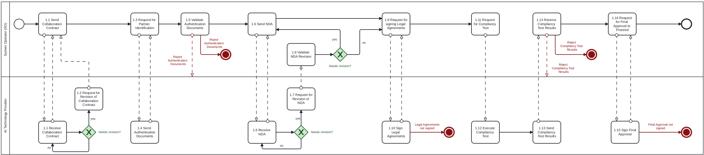
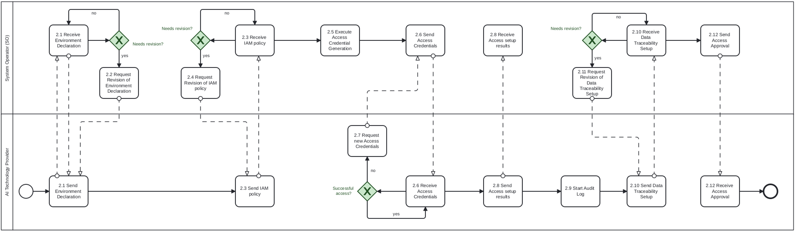
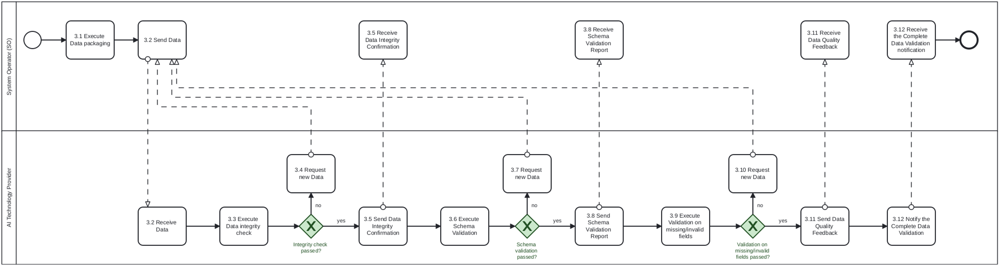
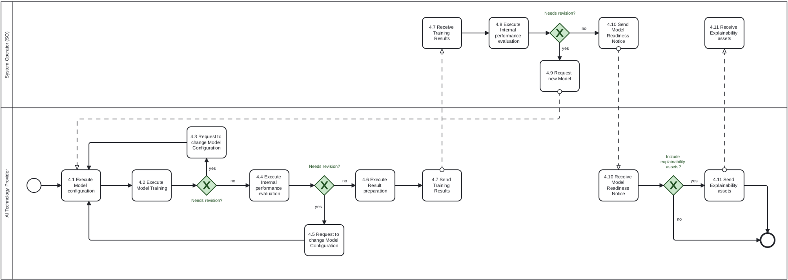
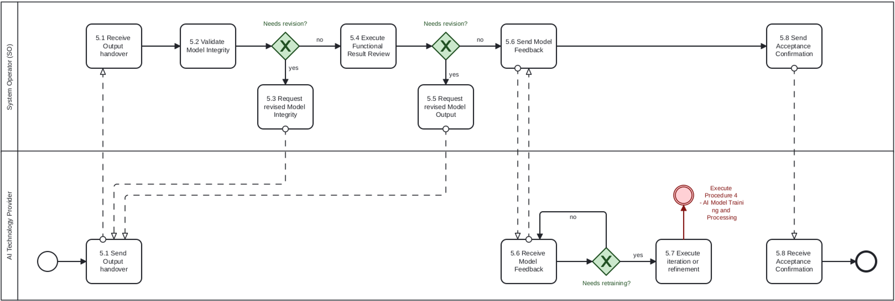
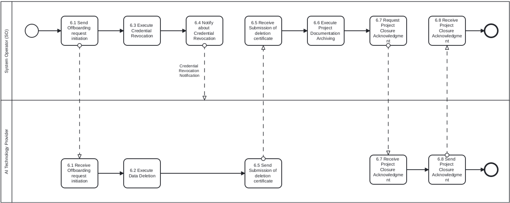
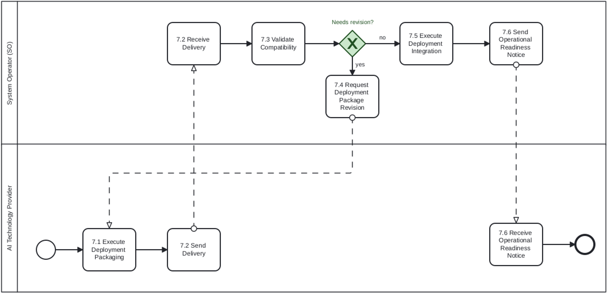
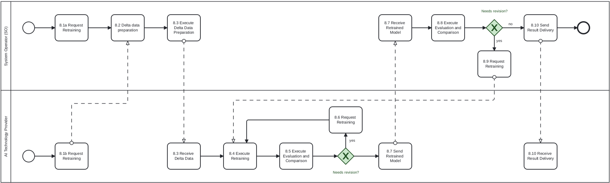

## Context

In order to support the digitalization of transmission system operations and promote innovation in AI technology provider the energy sector, it is necessary to enable secure, legally compliant and trustworthy data exchange between system operators (SOs) and third-party technology providers. This use case concerns the cooperation between a SO and an AI technology provider for the purpose of training and deploying artificial intelligence solutions to support day-ahead grid planning. The collaboration is based on clearly defined data access frameworks, legal agreements and cybersecurity controls that ensure that the SO retains data sovereignty while leveraging the innovation potential of external solution providers. Whereas the AI technology provider may utilize proprietary methods, algorithms, or frameworks as part of the AI development, the Parties agree to specify the treatment of intellectual property rights to protect both pre-existing and project-specific IP. This reference model outlines the roles, procedures, agreements, and responsibilities necessary to implement such collaborations within a Member State.

CHAPTER I

**Regarding GENERAL PROVISIONS**

*Issue 1*

**On subject matter and scope**

(1) [IGNORE FOR NOW]

## Definitions

*Issue 2*

**On definitions**

In addition to the definitions in Article 2 of Directive (EU) 2019/944 and relevant provisions of the Data Governance Act, the following definitions shall apply:

- **"System Operator (SO)"** means the entity responsible for operating, maintaining, and developing the system for electricity in a given territory, ensuring system reliability, security of supply, and non-discriminatory access to the grid. In the context of this regulation, the SO acts as the data provider, infrastructure operator, and recipient of AI-generated outputs for grid planning and operational decision support.

- **"AI Technology Provider"** addresses a technology partner whose mission is to deliver AI- and optimization-driven solutions that enhance the operational decision-making of the System Operator. These solutions may include topology optimization, DER envelope assignment, and setpoint control to support secure and efficient grid management.

- **"Vendor-hosted secure environment"** refers to a secure and access-controlled infrastructure, operated and maintained by the AI technology provider, where SO-provided data is processed, including training, inference, and result generation activities.

- **"Data Hosting Agreement"** refers to a legally binding agreement between the SO and the AI technology provider that defines the terms under which the AI technology provider may temporarily store, access, and process SO-provided data within their secure infrastructure, including provisions on data confidentiality, security, access limitations, and deletion obligations.

- **"Data Processing Agreement (DPA)"** means a legally binding agreement under Article 28 of the General Data Protection Regulation (GDPR), defining the roles, responsibilities, and technical safeguards related to the processing of personal data by the AI technology provider on behalf of the SO.

- **"Training data"** means a dataset derived from grid operation, forecasts, or market data, used by the AI technology provider to train machine learning models.

- **"Model output"** refers to the results produced by the AI application, such as day-ahead grid plans and/or KPIs, which are provided back to the SO.

- **"Intellectual Property Rights (IPR)"** addresses legal rights concerning proprietary models, algorithms, software, and documentation developed independently by the AI technology provider or during the execution of the contract, excluding SO-owned data or results derived solely from such data.

## Responsibilities of Market Roles

CHAPTER II

**Regarding [YOUR USE CASE]**

### Article 1 - On responsibilities of the System Operator (SO)

**The SO shall:**

1. **Define Use Case Scope**
   Determine, in collaboration with the AI technology provider, the scope of the planning objective and the required datasets.

2. **Legal and Contractual Framework**
   Conclude all necessary legal instruments, including:
   - A Non-Disclosure Agreement (NDA);
   - A Data Hosting Agreement (DHA) specifying conditions for off-site data storage;
   - A Data Processing Agreement (DPA) in line with applicable data protection regulations;
   - Clauses covering the treatment of Intellectual Property Rights (IPR).

3. **Data Provisioning and Documentation**
   Curate and prepare the datasets to be shared, accompanied by schema definitions, metadata, and access instructions.

4. **Data Transfer**
   Facilitate secure transfer of the data to the vendor-hosted secure environment, using encrypted channels and formats.

5. **Monitoring and Auditing**
   Maintain oversight of data access logs and audit trails, either directly or through shared mechanisms provided by the vendor.

6. **Output Evaluation and Feedback**
   Review the model outputs received from the AI technology provider (e.g., day-ahead plans, KPIs) and provide feedback or request iterations. Relevant KPIs are to be clearly defined. Compare AI-generated outputs against historical data, expert judgment/strategies, or predefined benchmarks and baselines to assess performance and reliability.

7. **Termination and Data Recall**
   Ensure that data shared under the agreement is deleted or returned at the end of the project, and that a deletion certificate is received from the AI technology provider.

### Article 2 - On responsibilities of the AI Technology Provider

**The AI Technology Provider shall:**

1. **Operate a Secure Compute Environment**
   Provide and maintain a vendor-hosted secure environment for processing SO data, with:
   - Encryption at rest and in transit;
   - Role-based access controls (RBAC);
   - Identity and Access Management (IAM);
   - Full audit logging capabilities.

2. **Handle and Process Data Responsibly**
   Use the SO-provided data only for the agreed use case, in accordance with the Data Hosting and Processing Agreement and applicable law.

3. **Respect Intellectual Property Rights (IPR)**
   - Retain ownership of pre-existing models, algorithms, and toolchains (Background IP).
   - Clearly mark and document any proprietary components used in the project deliverables.

4. **Train and Evaluate AI Models**
   Perform AI model training, tuning, and inference tasks within the secure environment, ensuring transparency in methods and reproducibility of results.

5. **Deliver Outputs to the SO**
   Provide the SO with the resulting day-ahead grid plans, performance KPIs, or other relevant deliverables in the required format and timeframe.

6. **Ensure Data Deletion**
   At project end or upon SO request, delete all copies of the shared data and submit a signed data deletion confirmation or certificate.

## Annex

ANNEX A

**A1. The reference model for [YOUR USE CASE]**

### General Information

Table I contains information needed by [Stakeholder1 AND Stakeholder2] to set up for utilising [YOUR USE CASE] in a Member State.
***Table I - General information on Member State environments***

| ID  | Name                         | Description                                                                                                                                                                                                           |
|-----|------------------------------|-----------------------------------------------------------------------------------------------------------------------------------------------------------------------------------------------------------------------|
| I1  | National competent authority | *Name* - Entidade Reguladora dos Serviços Energéticos (ERSE) *Website* - [https://www.erse.pt](https://www.erse.pt) *Official contact* - erse@erse.pt |
| I2  | Permission Administrators | *Name* - REN - Rede Eléctrica Nacional, S.A. (Portuguese TSO) *Type of identification* - Energy Identification Code (EIC) *Identification of organisation* - 10XPT-REN------9 *Website* - [https://www.ren.pt/](https://www.ren.pt/) *User interface* - URL or user portal. *Official contact* - Contact details for data sharing. *Consent Management Responsibility* - Responsible for managing data access and consent-related provisions for historical grid operation data, and system operational data. *Documentation of Access* - Access to operational and historical data is governed by national energy regulations, with additional provisions defined by ERSE and REN. Specific project-level data sharing is managed through bilateral agreements. *Identity Service Provider* - Corporate federated authentication systems and REN internal identity management platform. *Eligible party onboarding* - Eligible parties (e.g., contracted AI technology providers) must first enter into a formal agreement with the Portuguese TSO (REN) covering confidentiality, data hosting, and access control. A compliance review ensures IAM, RBAC, and audit logging are properly configured. Final approval is confirmed by REN. *Eligible party test onboarding* - See Eligible party onboarding. *Price list for access to data by eligible parties* - Free of charge. |

**[TODO] Please describe all *HARMONISED ROLES* below.**

### Relevant Roles

***Table II - Roles***

| Role name                              | Role type | Role description                                                                                                                                                |
|----------------------------------------|-----------|-----------------------------------------------------------------------------------------------------------------------------------------------------------------|
| System Operator (SO)                   | Business  | The entity responsible for managing the transmission grid and acting as data provider and consumer. Data Provider, KPI Consumer, Compliance Authority           |
| AI Technology Provider (ATP)           | Business  | A contracted third-party organization/partner with the technical capability to process SO data and deliver AI-based planning outputs. Data Consumer, Secure Host, AI Developer, Result Provider |
| Vendor-Hosted Secure Compute Cluster   | System    | A secure environment, managed by the AI technology provider, for training and evaluating AI models on SO data.                                                  |

All roles of type *Business* are expected to be acting in secure, authenticated manner and through trusted communication channels. For this reason, the authentication steps used for these communication partners are not listed in the scenarios below.

### Procedures

**[TODO] First step should be to clearly state the list of procedures.**

***Table III - Procedure Conditions***

| No. | Procedure name                                    | Primary actor | Pre-condition                                                                                     |
|-----|---------------------------------------------------|---------------|---------------------------------------------------------------------------------------------------|
| 1   | Legal Onboarding & Agreement Setup                | SO & ATP      | Collaboration scope (use case) defined; NDA, DPA, and Data Hosting Agreement signed               |
| 2   | Credential provision & access config              | SO            | Legal agreements signed; environment declared compliant                                           |
| 3   | Data Preparation & Transfer to ATP environment    | SO            | Secure channel established; Credentials active; Infrastructure and access control setup at ATP side |
| 4   | AI Model Training and Processing                  | ATP           | Data successfully transferred and validated                                                       |
| 5   | Result Submission & Delivery to SO                | ATP           | Outputs generated and integrity checks passed                                                     |
| 6   | Data deletion and offboarding                     | ATP           | Project completed or terminated; all obligations under data handling contract fulfilled            |
| 7   | Agent Deployment & Handover to System Operator    | ATP           | Model outputs validated and accepted by SO                                                        |
| 8   | Agent Retraining & Model Lifecycle Extension      | SO & ATP      | Performance degradation observed or new data becomes available                                     |

All diagrams describing the scenarios are of an illustrative nature and follow *Business Process Model and Notation 2.0*[^1]*.* Information objects referred in columns *Information exchanged (IDs)* are defined in Table IV.

#### Procedure 1 - Legal Onboarding & Agreement Setup

| Step No. | Step                                                       | Step description                                                                                    | Information producer (actor) | Information receiver (actor) | Information exchanged (IDs)      |
|----------|------------------------------------------------------------|-----------------------------------------------------------------------------------------------------|------------------------------|------------------------------|----------------------------------|
| 1.1      | Send Collaboration Contract                                | Formalize collaboration scope, including goals (e.g., AI for grid planning) and boundaries.         | SO                           | ATP                          | A - Collaboration Scope Agreement |
| 1.2      | [Conditional] Request for Revision of Collaboration Contract | Request updates to the collaboration scope or clarify terms before acceptance.                     | ATP                          | SO                           | A - Collaboration Scope Agreement |
| 1.3      | Request for Partner Identification                         | Verify legal and technical identity of the ATP (e.g., LEI, legal name, address).                    | SO                           | ATP                          | B - ATP Identification Data     |
| 1.4      | Send Authentication Documents                              | Provide official legal documents to verify identity.                                                | ATP                          | SO                           | B - ATP Identification Data     |
| 1.5      | Validate Authentication Documents                          | Review and confirm the authenticity and correctness of submitted legal documents. In case of a rejection, a meaningful indication is provided. | SO                           | SO                           | [not relevant]                   |
| 1.6      | Send NDA                                                   | Draft and exchange a non-disclosure agreement for mutual confidentiality.                           | SO                           | ATP                          | C - NDA Document                |
| 1.7      | [Conditional] Request for Revision of NDA - ATP           | Request changes to NDA terms before signing - ATP side.                                            | ATP                          | SO                           | C - NDA Document                |
| 1.8      | [Conditional] Request for Revision of NDA - SO            | Request changes to NDA terms before signing - SO side.                                             | SO                           | ATP                          | C - NDA Document                |
| 1.9      | Request for signing Legal Agreements                       | Initiate the process of signing the finalized collaboration scope and NDA.                          | SO                           | ATP                          | D - Signed Legal Agreements     |
| 1.10     | Sign Legal Agreements                                      | Officially sign all required legal documents (collaboration scope, NDA, etc.).                      | ATP                          | SO                           | D - Signed Legal Agreements     |
| 1.11     | Request for Compliancy Test                                | Ask ATP to conduct a test demonstrating compliance with required infrastructure standards.          | SO                           | ATP                          | E - Infrastructure Compliance Report |
| 1.12     | Execute Compliancy Test                                    | Perform tests to ensure infrastructure complies with legal and technical onboarding requirements.   | ATP                          | ATP                          | [not relevant]                   |
| 1.13     | Send Compliancy Test Results                               | Submit formal results of the compliance test to the System Operator. In case of a failed test, a meaningful indication is provided. | ATP                          | SO                           | E - Infrastructure Compliance Report |
| 1.14     | Request for Final Approval to Proceed                      | Grant formal approval to proceed with technical onboarding and data sharing.                        | SO                           | ATP                          | F - Legal Onboarding Approval   |
| 1.15     | Sign Final Approval                                        | Confirm final legal onboarding approval, enabling the start of the technical phase.                 | ATP                          | SO                           | F - Legal Onboarding Approval   |

***Table IV - Information exchanged***

| Information exchanged, ID | Name of information            | Description of information exchanged |
|---------------------------|--------------------------------|--------------------------------------|
| A                         | Collaboration Scope Agreement  | *Use case title* - Short descriptive name of the collaboration purpose. *Operational goal* - Planning objectives, such as AI for grid optimization. *Scope boundaries* - Limits on functionality, timeframe, or data classes. *Required data domains* - Forecasts, grid topology, asset data, DER metadata, etc. |
| B                         | ATP Identification Data        | *Legal entity name* - Registered company name of the AI partner. *Legal address* - Registered headquarters. *Legal Entity Identifier (LEI)* - Unique entity identification number. *Technical point of contact* - Name, email, and phone of technical lead. |
| C                         | NDA Document                   | *NDA terms* - Draft clauses on confidentiality, duration, and allowed disclosures. *Document version* - Internal version number for traceability. *Signatory roles* - Identified individuals or positions expected to sign. |
| D                         | Signed Legal Agreements        | *Signed NDA* - Final mutual confidentiality agreement. *Signed DHA* - Data Hosting Agreement defining secure processing conditions. *Signed DPA* - GDPR-compliant Data Processing Agreement. *IPR provisions* - Ownership clauses for pre-existing and project-specific IP. |
| E                         | Infrastructure Compliance Report | *Hosting description* - Cloud/on-prem environment, provider, isolation model. *Security controls* - Encryption at rest/in transit, firewall, etc. *Access management* - RBAC, IAM setup, personnel roles. *Audit readiness* - Logging configuration, traceability. |
| F                         | Legal Onboarding Approval      | *Approval status* - Confirmation that all required legal and technical documents have been reviewed. *Timestamp* - Date/time of approval issuance. *Approving party* - Name or unit within the System Operator authorizing onboarding. |

#### Procedure 2 - Credential Provision & Access Configuration

| Step No. | Step                                                        | Step description                                                                                  | Information producer (actor) | Information receiver (actor) | Information exchanged (IDs)        |
|----------|-------------------------------------------------------------|---------------------------------------------------------------------------------------------------|------------------------------|------------------------------|------------------------------------|
| 2.1      | Send Environment Declaration                                | The ATP describes the technical specifications of its secure environment.                         | ATP                          | SO                           | G - Environment Declaration       |
| 2.2      | [Conditional] Request for Revision of Environment Declaration | Request changes to the Environment Declaration.                                                 | SO                           | ATP                          | G - Environment Declaration       |
| 2.3      | Send IAM policy submission                                  | The ATP provides its identity & access management (IAM) policy.                                   | ATP                          | SO                           | H - IAM & RBAC Policy             |
| 2.4      | [Conditional] Request for Revision of IAM policy            | The SO request changes to the IAM policy.                                                         | SO                           | ATP                          | H - IAM & RBAC Policy             |
| 2.5      | Execute Access Credentials Generation                       | The SO generates secure Access Credentials for the ATP.                                           | SO                           | SO                           | I - Access Credentials            |
| 2.6      | Send Access Credentials                                     | The SO sends the secure Access Credentials to the ATP.                                            | SO                           | ATP                          | I - Access Credentials            |
| 2.7      | [Conditional] Request new Access Credentials                | The ATP Request new Access Credentials in case the provided Credentials fail.                     | ATP                          | SO                           | I - Access Credentials            |
| 2.8      | Send Access setup results                                   | The ATP confirms the secure Access Credentials are correctly integrated.                          | ATP                          | SO                           | J - Access Setup Report           |
| 2.9      | Start Audit Log                                             | The ATP activates audit logging and confirms Data Traceability Setup.                             | ATP                          | ATP                          | K - Audit Log Activation Notice   |
| 2.10     | Send Data Traceability Setup                                | The ATP provides the Data Traceability Setup.                                                     | ATP                          | SO                           | K - Audit Log Activation Notice   |
| 2.11     | [Conditional] Request Revision of Data Traceability Setup   | The SO requests revision of the Data Traceability Setup.                                          | SO                           | ATP                          | K - Audit Log Activation Notice   |
| 2.12     | Send Access Approval                                        | The SO gives final approval to start data transfer.                                               | SO                           | ATP                          | L - Access Go-Ahead Confirmation  |

***Table IV - Information exchanged***

| Information exchanged, ID | Name of information          | Description of information exchanged |
|---------------------------|------------------------------|--------------------------------------|
| G                         | Environment Declaration      | *Compute environment type* - Description of the technical infrastructure (e.g., dedicated cloud tenancy, on-premises cluster). *Cloud service provider* - Name of the provider (e.g., AWS, Azure, GCP), if applicable. *Physical/geographic location* - Region or country where the infrastructure is hosted. *Isolation guarantees* - Explanation of how the environment is separated from other tenants (e.g., virtual private cloud, dedicated instances). *Network perimeter controls* - Firewall configuration, ingress/egress filtering, DMZ presence. *Data storage architecture* - Local vs. distributed, object or block storage, and encryption methods used. |
| H                         | IAM & RBAC Policy            | *IAM framework* - Type of identity management system used (e.g., OAuth2, SAML, custom IAM). *Role-based access control (RBAC)* - List of access roles (e.g., admin, analyst) and their associated privileges. *Access provisioning process* - Description of how users are onboarded and permissions are granted. *De-provisioning procedures* - Process for revoking access upon offboarding or role change. *Personnel assignments* - Names and roles of personnel responsible for technical and data access. |
| I                         | Access Credentials           | *Credential type* - Format of credential (e.g., API key, VPN certificate, authentication token). *Scope of access* - What systems or datasets the credentials permit access to. *Issuance metadata* - Time of creation, expiration rules, and issuing authority. *Transmission method* - Secure method used to deliver credentials (e.g., encrypted email, one-time token URL). |
| J                         | Access Setup Report          | *Setup confirmation status* - Whether the access setup succeeded or failed (e.g., success flag or status code). *Endpoint integration* - Confirmation that the intended endpoint (e.g., API gateway) was reached. *Test transaction result* - Outcome of a test connection or data pull. *Responsible integrator* - Name and contact details of the person who conducted the access setup. |
| K                         | Audit Log Activation Notice  | *Logging system used* - Platform or tool used for logging (e.g., ELK, CloudTrail, custom). *Activated log types* - Types of events being logged (e.g., login attempts, data access, configuration changes). *Retention period* - Duration logs will be stored (e.g., 6 months, 1 year). *Traceability mechanisms* - Whether logs can be tied to specific users/actions with timestamps. *Compliance reference* - Reference to compliance standards being met (e.g., ISO 27001, GDPR). |
| L                         | Access Go-Ahead Confirmation | *Approval status* - Formal approval signal (e.g., "Approved", "Access Granted"). *Timestamp* - Date and time when the access was approved. *Approving entity* - Name of the unit, team, or authority at the SO responsible for final approval. *Conditions or notes* - Any caveats or follow-up checks required after access approval. |

#### Procedure 3 - Data Preparation & Transfer to AI Technology Provider environment

| Step No. | Step                                         | Step description                                                                                   | Information producer (actor) | Information receiver (actor) | Information exchanged (IDs)         |
|----------|----------------------------------------------|----------------------------------------------------------------------------------------------------|------------------------------|------------------------------|-------------------------------------|
| 3.1      | Execute Data Packaging                       | The SO compiles and prepares the training dataset and documentation.                               | SO                           | SO                           | M - Dataset & Metadata Bundle      |
| 3.2      | Send Data                                    | The SO transfers the dataset via a secure encrypted channel to the ATP.                            | SO                           | ATP                          | N - Secure Data Transfer Notice    |
| 3.3      | Execute Data Integrity check                 | The ATP performs checksum/hash verification of the received data.                                  | ATP                          | ATP                          | O - Data Integrity Confirmation    |
| 3.4      | [Conditional] Request new Data               | The ATP requests new data in case the integrity check failed.                                      | ATP                          | SO                           | O - Data Integrity Confirmation    |
| 3.5      | Send Data Integrity Confirmation             | The ATP provides the Data Integrity Confirmation                                                   | ATP                          | SO                           | O - Data Integrity Confirmation    |
| 3.6      | Execute Schema Validation                    | The ATP validates the structure, format, and consistency of the dataset.                           | ATP                          | ATP                          | P - Schema Validation Report       |
| 3.7      | [Conditional] Request new Data               | The ATP requests new data in case the Schema Validation failed.                                    | ATP                          | SO                           | P - Schema Validation Report       |
| 3.8      | Send Schema Validation Report                | The ATP provides the Schema Validation Report to the SO.                                           | ATP                          | SO                           | P - Schema Validation Report       |
| 3.9      | Execute Validation on missing/invalid fields | The ATP validates the dataset for missing/invalid fields.                                          | ATP                          | ATP                          | Q - Data Quality Feedback          |
| 3.10     | [Conditional] Request new Data               | The ATP requests new data in case the Validation on missing/invalid fields failed.                 | ATP                          | SO                           | Q - Data Quality Feedback          |
| 3.11     | Send Data Quality Feedback                   | The ATP provides the Feedback on the Data Quality to the SO.                                       | ATP                          | SO                           | Q - Data Quality Feedback          |
| 3.12     | Notify the Complete Data Validation          | Once all data is validated, ATP sends readiness signal to begin AI processing.                     | ATP                          | SO                           | R - Data Validation Complete Notice |

***Table IV - Information exchanged***

| Information exchanged, ID | Name of information           | Description of information exchanged |
|---------------------------|-------------------------------|--------------------------------------|
| M                         | Dataset & Metadata Bundle     | *Time-series load and generation (injection) data* - Historical injection measurements per grid node or zone. *Grid topology* - Network structure including buses, lines, substations, transformers. *Asset data* - Static and dynamic properties of infrastructure (e.g., ratings, failure histories). *Metadata schema* - Description of dataset columns, types, units, and constraints. *Data extraction timestamp* - Time when the snapshot was compiled, for traceability. |
| N                         | Secure Data Transfer Notice   | *Transfer confirmation* - Signal that the data was uploaded and is available in the vendor's environment. *Transfer protocol* - Method used for transfer (e.g., SFTP, HTTPS upload, VPN channel). *Encryption method* - Details on encryption in transit (e.g., TLS 1.3, AES-256). *Upload location* - Secure file path or storage endpoint. *Timestamp* - Date and time of successful upload. |
| O                         | Data Integrity Confirmation   | *Hash/checksum values* - Cryptographic hash values used to verify file integrity (e.g., SHA-256). *Comparison result* - Boolean or match indicator showing successful validation. *Tool used* - Software or command-line utility applied for hash calculation. *Verifier identity* - Name or role of individual/system who performed the check. |
| P                         | Schema Validation Report      | *Validation status* - Pass/fail or structured result per dataset/table. *Expected schema vs. actual* - Description of discrepancies if any. *Parsing issues* - Records or fields that failed structural parsing. *Schema compliance standard* - Reference to expected data model or schema document. |
| Q                         | Data Quality Feedback         | *Missing values report* - Fields or records with nulls or blanks. *Outliers or inconsistencies* - Statistical anomalies or format mismatches. *Datatype mismatches* - Detected columns with incorrect or unexpected data types. *Corrective recommendations* - Instructions or suggestions for reformatting, re-upload, or clarification. *Responsible validator* - Contact information of the QA party at the vendor. |
| R                         | Data Validation Complete Notice | *Approval status* - Confirmation that data is fully ready for model training or experimentation. *Scope of approval* - Which data domains or files are covered (e.g., all vs. partial dataset). *Timestamp* - Date and time of readiness confirmation. *Approving team/entity* - Technical or project lead responsible for issuing the go-ahead. |

#### Procedure 4 - AI Model Training and Processing

| Step No. | Step                                                  | Step description                                                                                  | Information producer (actor) | Information receiver (actor) | Information exchanged (IDs)         |
|----------|-------------------------------------------------------|---------------------------------------------------------------------------------------------------|------------------------------|------------------------------|-------------------------------------|
| 4.1      | Execute Model Configuration                           | ATP prepares training parameters and selects appropriate model architecture.                      | ATP                          | ATP                          | S - Model Configuration Record     |
| 4.2      | Execute Model Training                                | ATP executes training process using vendor-hosted secure infrastructure.                          | ATP                          | ATP                          | T - Model Training Run Log         |
| 4.3      | [Conditional] Request to change Model Configuration   | The ATP requests new Model configuration in case the Model Training failed.                       | ATP                          | ATP                          | T - Model Training Run Log         |
| 4.4      | Execute Internal performance evaluation               | The ATP evaluates model output using internal validation sets.                                    | ATP                          | ATP                          | U - Evaluation Summary Report      |
| 4.5      | [Conditional] Request to change Model Configuration   | The ATP requests new Model configuration in case the Model performance evaluation failed.         | ATP                          | ATP                          | U - Evaluation Summary Report      |
| 4.6      | Execute Result preparation                            | Outputs (e.g., day-ahead plans, risk KPIs) are prepared in agreed format.                         | ATP                          | ATP                          | V - Result Package                 |
| 4.7      | Send Training Results                                 | The ATP provides the training results to the SO.                                                  | ATP                          | SO                           | V - Result Package, W - Model Output Readiness Notice |
| 4.8      | Execute Internal performance evaluation               | The SO evaluates model output using internal validation sets.                                     | SO                           | SO                           | U - Evaluation Summary Report      |
| 4.9      | [Conditional] Request new Model                       | The SO requests new Model in case the resulting performance                                       | SO                           | ATP                          | U - Evaluation Summary Report      |
| 4.10     | Send Model Readiness Notice                           | The SO sends the Model readiness notification to the ATP.                                         | SO                           | ATP                          | W - Model Output Readiness Notice  |
| 4.11     | [Conditional] Send Explainability assets              | Optional technical annexes (e.g., feature importance, visualizations) are attached.               | ATP                          | SO                           | X - Explainability Annex           |

***Table IV - Information exchanged***

| Information exchanged, ID | Name of information           | Description of information exchanged |
|---------------------------|-------------------------------|--------------------------------------|
| S                         | Model Configuration Record    | *Model architecture* - Name or type of model used (e.g., LSTM, XGBoost, Transformer). *Training parameters* - Learning rate, batch size, number of epochs, etc. *Hyperparameters* - Regularization settings, dropout rate, tree depth, etc. *Software environment* - Libraries and frameworks (e.g., Python version, TensorFlow 2.12). *Input data specification* - Description of which input fields from the dataset are used and how they are preprocessed. |
| T                         | Model Training Run Log        | *Training timestamps* - Start and end time of model training. *Resource utilization* - CPU/GPU consumption, memory footprint, disk I/O. *Run ID/version tag* - Unique identifier for reproducibility. *Error logs (if any)* - Captured warnings, failed epochs, divergence indicators. *Checkpoints or snapshots* - Intermediate model states saved for rollback or continuation. |
| U                         | Evaluation Summary Report     | *Validation metrics* - Performance indicators like RMSE, MAE, R², classification accuracy. *Evaluation datasets* - Description of internal data used for validation. *Overfitting analysis* - Gap between training and validation performance. *Run comparison* - If multiple configurations were tested, comparative results. *Remarks from analyst* - Qualitative insights or flags about performance variance. |
| V                         | Result Package                | *Forecast outputs* - Day-ahead grid plans, load or generation forecasts. *KPI estimates* - Risk, volatility, reserve margins, or planning confidence indicators. *Data format* - Delivered format (e.g., JSON, CSV, HDF5). *Timestamp of generation* - Exact time when the result files were finalized. *Schema or dictionary* - File defining structure and meaning of delivered data. |
| W                         | Model Output Readiness Notice | *QC status* - Confirmation that outputs passed internal validation and QC gates. *Validation date* - Date of final check. *Responsible reviewer* - Technical lead or quality control contact. *Approval version/tag* - Tagged release of the result set being shared. |
| X                         | Explainability Annex          | *Feature attribution plots* - SHAP, LIME, or permutation importance charts. *Visual diagnostics* - Training curves, confusion matrices, or residual histograms. *Model confidence summaries* - Confidence intervals or probability distributions for key outputs. *KPI breakdowns* - Decomposition of risk or performance metrics by feature or segment. *Export format* - PDF reports, Jupyter notebooks, HTML dashboards, etc. |

#### Procedure 5 - Result Submission & Delivery to SO

| Step No. | Step                                            | Step description                                                                                  | Information producer (actor) | Information receiver (actor) | Information exchanged (IDs)   |
|----------|-------------------------------------------------|---------------------------------------------------------------------------------------------------|------------------------------|------------------------------|-------------------------------|
| 5.1      | Send Output handover                            | The ATP transfers the model output package to the SO in a secure manner.                          | ATP                          | SO                           | Y - Final Output Submission  |
| 5.2      | Validate Model Integrity                        | The SO validates the structure, schema, and completeness of received data.                        | SO                           | SO                           | Z - Output Integrity Log     |
| 5.3      | [Conditional] Request revised Model Integrity   | The SO requests a revised Model Integrity in case the integrity validation failed.                | SO                           | ATP                          | Z - Output Integrity Log     |
| 5.4      | Execute Functional Result Review                | The SO evaluates KPIs and planning outputs for operational usability.                             | SO                           | SO                           | AA - Output Assessment Report |
| 5.5      | [Conditional] Request revised Model Output      | The SO requests a revised Model Output in case the functional result review failed.               | SO                           | ATP                          | AA - Output Assessment Report |
| 5.6      | Send Model Feedback                             | The SO provides comments or identifies issues, if any, for correction or iteration.               | SO                           | ATP                          | AB - Result Feedback Note    |
| 5.7      | [Conditional] Execute iteration or refinement   | If needed, vendor retrains or fine-tunes model for improved results.                              | ATP                          | SO                           | AC - Iteration Response Log  |
| 5.8      | Send Acceptance Confirmation                    | The SO formally accepts the result package and marks use case as successfully completed.          | SO                           | ATP                          | AD - Result Acceptance Notice |

***Table IV - Information exchanged***

| Information exchanged, ID | Name of information        | Description of information exchanged |
|---------------------------|----------------------------|--------------------------------------|
| Y                         | Final Output Submission    | *Model outputs* - KPI values, predictions, operational recommendations. *Data format* - Structured delivery (e.g., JSON, CSV, XML) as per agreement. *Supporting metadata* - Column descriptions, timestamps, run ID, model version. *Encryption or upload method* - Secure transmission details (e.g., VPN, HTTPS). *Delivery timestamp* - Exact time and date of submission. |
| Z                         | Output Integrity Log       | *Checksum/hash match* - Verification of file integrity via cryptographic methods. *Schema compliance* - Whether all fields and types match expected format. *Completeness check* - Confirmation that no files, rows, or key values are missing. *Validator identity* - Team or system at SO that performed the validation. *Date of verification* - Timestamp of completed validation. |
| AA                        | Output Assessment Report   | *Technical evaluation* - Accuracy of forecasts, completeness of KPIs, adherence to functional specs. *Operational relevance* - Usability in day-ahead planning or grid operation context. *Observed anomalies* - Any unexpected behavior or values in outputs. *Score or threshold result* - Quantified performance metrics vs. acceptance criteria. *Reviewer notes* - Comments or caveats for downstream users. |
| AB                        | Result Feedback Note       | *Feedback type* - Clarification request, error flag, improvement proposal. *Affected components* - Specific fields or outputs needing revision. *Correction urgency* - Critical/important/optional categorization. *SO contact info* - Person/team responsible for feedback communication. *Requested turnaround time* - Expected timing for a response or fix. |
| AC                        | Iteration Response Log     | *Updated model details* - What changes were made (e.g., retraining, hyperparameter tuning). *Result delta* - Difference in KPI values or forecasts from prior versions. *Validation rerun status* - Whether new results passed internal tests. *Version identifier* - New run ID or version tag. *Submission timestamp* - Time of updated output delivery. |
| AD                        | Result Acceptance Notice   | *Acceptance status* - Final go-ahead for use of the result package. *Scope of acceptance* - Whether full or partial dataset/model has been accepted. *Authorized signer/team* - SO contact confirming approval. *Document reference* - ID or link to signed record of acceptance. *Timestamp* - Date of acceptance issuance. |

#### Procedure 6 - Data deletion and offboarding

| Step No. | Step                                        | Step description                                                                             | Information producer (actor) | Information receiver (actor) | Information exchanged (IDs)           |
|----------|---------------------------------------------|----------------------------------------------------------------------------------------------|------------------------------|------------------------------|---------------------------------------|
| 6.1      | Send Offboarding request initiation         | The SO initiates closure by issuing formal offboarding instructions.                         | SO                           | ATP                          | AE - Offboarding Instruction         |
| 6.2      | Execute Data Deletion                       | The ATP deletes all SO-provided data and logs the action.                                    | ATP                          | ATP                          | AF - Data Deletion Log               |
| 6.3      | Execute Credential Revocation               | The SO revokes or disables ATP access to secure interfaces.                                  | SO                           | SO                           | [not relevant]                        |
| 6.4      | Notify about Credential Revocation          | The SO notifies the ATP about the credential revocation.                                     | SO                           | ATP                          | AG - Access Termination Notice       |
| 6.5      | Send Submission of deletion certificate     | ATP provides formal signed confirmation of deletion.                                         | ATP                          | SO                           | AH - Data Deletion Certificate, AF - Data Deletion Log |
| 6.6      | Execute Project Documentation Archiving     | The SO stores final project records for traceability and compliance.                         | SO                           | SO                           | AI - Final Archive Index             |
| 6.7      | Request Project Closure Acknowledgment      | The SO acknowledges the project closure and regulatory compliance.                           | SO                           | ATP                          | AJ - Collaboration Closure Memo      |
| 6.8      | Send Project Closure Acknowledgment         | The ATP acknowledges the project closure and regulatory compliance.                          | ATP                          | SO                           | AJ - Collaboration Closure Memo      |

***Table IV - Information exchanged***

| Information exchanged, ID | Name of information          | Description of information exchanged |
|---------------------------|------------------------------|--------------------------------------|
| AE                        | Offboarding Instruction      | *Instruction type* - Formal request to initiate offboarding. *Effective date* - Date on which data deletion and access removal should begin. *Included data scope* - Specific folders, datasets, and services to be deleted. *Reference documents* - Linked agreements or data hosting terms. *SO point of contact* - Responsible party issuing the offboarding request. |
| AF                        | Data Deletion Log            | *Deletion timestamps* - Time each dataset or file was removed. *Files/directories affected* - List of data objects deleted. *Tool or script used* - Deletion method or utility name. *System confirmation codes* - Return values or confirmations from deletion process. *Performed by* - Identity of the person/system that executed deletion. |
| AG                        | Access Termination Notice    | *Credential types revoked* - API keys, user accounts, VPN certificates. *Revocation time* - Timestamp of when each credential was disabled. *Systems affected* - Portals, storage endpoints, or access points. *Change verification* - Confirmation from IAM system or logs. *SO security contact* - Person responsible for access deprovisioning. |
| AH                        | Data Deletion Certificate    | *Statement of deletion* - Declaration confirming all SO data has been purged. *Authorized signature* - Legally accountable person or officer at ATP. *Date of certification* - When the declaration was finalized. *Covered data scope* - Listing of datasets, models, logs, or backups included. *Optional attachment* - Snapshot of deletion logs or logs digest. |
| AI                        | Final Archive Index          | *List of archived documents* - Contracts, final outputs, audit reports, certificates. *Storage location* - Internal archive location or system reference. *Retention policy* - Duration and regulatory basis for storage. *Access controls* - Who can view or retrieve the archive. *Archival timestamp* - Date/time when archiving was completed. |
| AJ                        | Collaboration Closure Memo   | *Closure summary* - Confirmation that offboarding steps were completed. *Parties involved* - SO and ATP representatives. *Reference to artifacts* - Links or identifiers for deletion logs, certificates, archive index. *Final sign-off* - Names and signatures or approval emails. *Date of closure* - Official project closure date. |

#### Procedure 7 - Agent Deployment & Handover to System Operator

| Step No. | Step                                                | Step description                                                                                | Information producer (actor) | Information receiver (actor) | Information exchanged (IDs)         |
|----------|-----------------------------------------------------|-------------------------------------------------------------------------------------------------|------------------------------|------------------------------|-------------------------------------|
| 7.1      | Execute Deployment Packaging                        | The ATP prepares and packages the trained agent (e.g., model, interface)                        | ATP                          | ATP                          | AK - Deployment Package            |
| 7.2      | Send Delivery                                       | The ATP securely transfers agent and integration documentation                                  | ATP                          | SO                           | AL - Secure Delivery Record        |
| 7.3      | Validate Compatibility                              | The SO verifies that agent meets runtime, interface, and API contract expectations              | SO                           | SO                           | AM - Compatibility Report          |
| 7.4      | [Conditional] Request Deployment Package Revision   | The SO requests a revision of the Deployment Package if the compatibility check failed.         | SO                           | ATP                          | AM - Compatibility Report          |
| 7.5      | Execute Deployment Integration                      | The SO integrates agent into the operational environment (test or prod)                         | SO                           | SO                           | AN - Deployment Log                |
| 7.6      | Send Operational Readiness Notice                   | The SO confirms agent is ready for functional evaluation or live use                            | SO                           | ATP                          | AO - Operational Readiness Notice  |

***Table IV - Information exchanged***

| Information exchanged, ID | Name of information          | Description of information exchanged |
|---------------------------|------------------------------|--------------------------------------|
| AK                        | Deployment Package           | *Model artifact* - Serialized or containerized agent (e.g., .pt, .onnx, .pkl, Docker image). *Inference interface* - API definition, gRPC/REST schema, or CLI wrapper. *Runtime dependencies* - Required packages, versions, and environment specs. *Container image (if any)* - Full deployment image with base OS and dependencies. *Version manifest* - Commit hash, build ID, training date, and changelog. *Export format* - ZIP, TAR.GZ, OCI-compliant container, etc. |
| AL                        | Secure Delivery Record       | *Transfer channel* - Secure mechanism used (e.g., SFTP, HTTPS upload, signed URL). *Encryption protocol* - TLS version, PGP signing, or file-level encryption method. *Transfer timestamp* - Date/time when the agent was delivered. *File integrity proof* - SHA256 or other cryptographic hash verification. *Download receipt* - Confirmation from SO of successful and complete retrieval. |
| AM                        | Compatibility Report         | *Runtime check result* - Whether an agent runs in SO's environment without modification. *Dependency conflicts* - Missing packages, version mismatches, etc. *System integration notes* - Observations on API structure, response format, or interface quirks. *Deployment platform* - Host system: cloud provider, OS version, orchestration framework. *Compliance check* - Review of internal compliance with SO's IT or regulatory standards. |
| AN                        | Deployment Log               | *Deployment mode* - Test, staging, production, or sandbox. *System components involved* - Internal modules where the agent is linked or invoked. *Configuration parameters* - Runtime variables or environment flags set during deployment. *Automated integration status* - CI/CD job references or manual override notes. *Deployment timestamp* - Time when deployment was completed. |
| AO                        | Operational Readiness Notice | *Readiness status* - "Ready for validation" / "Ready for operational testing". *Preconditions met* - Summary of checks completed before handover (e.g., API call success, integration test pass). *Responsible reviewer* - SO team member or unit confirming readiness. *Test environment info* - URL, endpoint, or sandbox ID for QA phase. *Date of confirmation* - Timestamp of readiness notice. |

#### Procedure 8 - Agent Retraining & Model Lifecycle Extension

| Step No. | Step                               | Step description                                                                                   | Information producer (actor) | Information receiver (actor) | Information exchanged (IDs)         |
|----------|------------------------------------|----------------------------------------------------------------------------------------------------|------------------------------|------------------------------|-------------------------------------|
| 8.1a     | Request Retraining                 | The SO detects a need for improved performance or updated data context.                            | SO                           | ATP                          | AP - Retraining Trigger Notice     |
| 8.1b     | Request Retraining                 | The ATP detects a need for improved performance or updated data context.                           | AI                           | SO                           | AP - Retraining Trigger Notice     |
| 8.2      | Execute Delta Data Preparation     | The SO prepares new data (e.g., operational data, updated KPIs)                                    | SO                           | SO                           | AQ - Delta Dataset                 |
| 8.3      | Send Delta Data                    | The SO provides new data to the ATP (e.g., operational data, updated KPIs).                        | SO                           | ATP                          | AQ - Delta Dataset                 |
| 8.4      | Execute Retraining                 | The ATP performs full or incremental retraining.                                                   | ATP                          | ATP                          | AR - Retraining Execution Log      |
| 8.5      | Execute Evaluation and Comparison  | The retrained model is benchmarked against prior version.                                          | ATP                          | ATP                          | AS - Evaluation Comparison Report  |
| 8.6      | [Conditional] Request Retraining   | The ATP requests for retraining in case internal Evaluation and Comparison failed.                 | ATP                          | ATP                          | AS - Evaluation Comparison Report  |
| 8.7      | Send Retrained Model               | The ATP provides the retrained Model to the SO.                                                    | ATP                          | SO                           | AS - Evaluation Comparison Report  |
| 8.8      | Execute Evaluation and Comparison  | The retrained model is benchmarked against prior version.                                          | SO                           | SO                           | AS - Evaluation Comparison Report  |
| 8.9      | [Conditional] Request Retraining   | The SO requests for retraining in case internal Evaluation and Comparison failed.                  | SO                           | ATP                          | AS - Evaluation Comparison Report  |
| 8.10     | Send Result Delivery               | Updated model output or agent is delivered back to SO.                                             | ATP                          | SO                           | AT - Updated Result Package        |

***Table IV - Information exchanged***

| Information exchanged, ID | Name of information          | Description of information exchanged |
|---------------------------|------------------------------|--------------------------------------|
| AP                        | Retraining Trigger Notice    | *Trigger source* - SO operator request, performance monitoring alert, or user feedback. *Observed degradation* - Description of issue (e.g., prediction error, concept drift, KPI drop). *Trigger date* - When the retraining need was logged. *Requested improvement goal* - Target KPI or use-case behavior post-retraining. *Responsible requester* - Role or team initiating the retraining process. |
| AQ                        | Delta Dataset                | *Data type* - New training data, corrected labels, expanded features, etc. *Volume and scope* - Size (rows/MB), time range, or coverage of data. *Schema version* - Reference to the schema document or spec for this dataset. *Secure transfer method* - How the dataset was delivered (e.g., encrypted SFTP, GCS link). *Timestamp of provision* - When the delta data was uploaded/shared. |
| AR                        | Retraining Execution Log     | *Run configuration* - Updated hyperparameters, learning schedule, or training type (full/incremental). *Model lineage ID* - Version tree link to the prior model. *Compute environment* - Hardware, GPU type, RAM, provider used. *Runtime duration* - Start and end timestamps. *Error log (if any)* - Training halts, anomalies, or warnings. |
| AS                        | Evaluation Comparison Report | *Old vs. new KPIs* - Before-and-after performance summary. *Validation method* - Hold-out, k-fold cross-validation, live A/B test. *Risk/robustness checks* - Stress tests, error bounds, outlier impact. *Model confidence delta* - Change in confidence intervals or prediction certainty. *Evaluation reviewer* - Analyst or data scientist who signed off on comparison. |
| AT                        | Updated Result Package       | *Updated model output* - Forecasts, decisions, or control signals generated by a retrained model. *Deployment readiness* - Whether the output has passed QC and is ready to replace the previous version. *Version metadata* - Model hash, version tag, training date, lineage reference. *Change log* - What has improved or changed functionally. *Delivery format* - Structured format (e.g., JSON, CSV, serialized object). |

[^1]: Business Process Model and Notation 2.0: [https://www.omg.org/spec/BPMN/2.0.2/PDF](https://www.omg.org/spec/BPMN/2.0.2/PDF)
