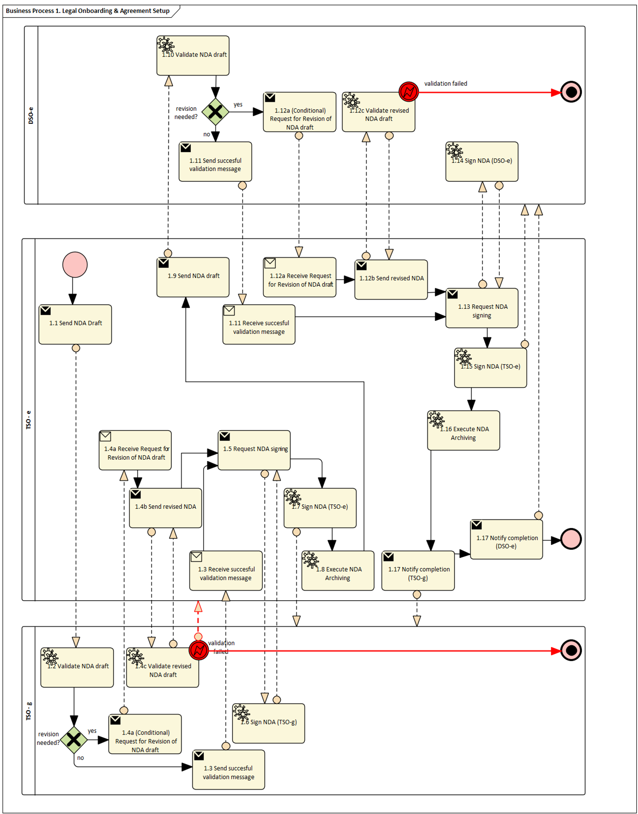
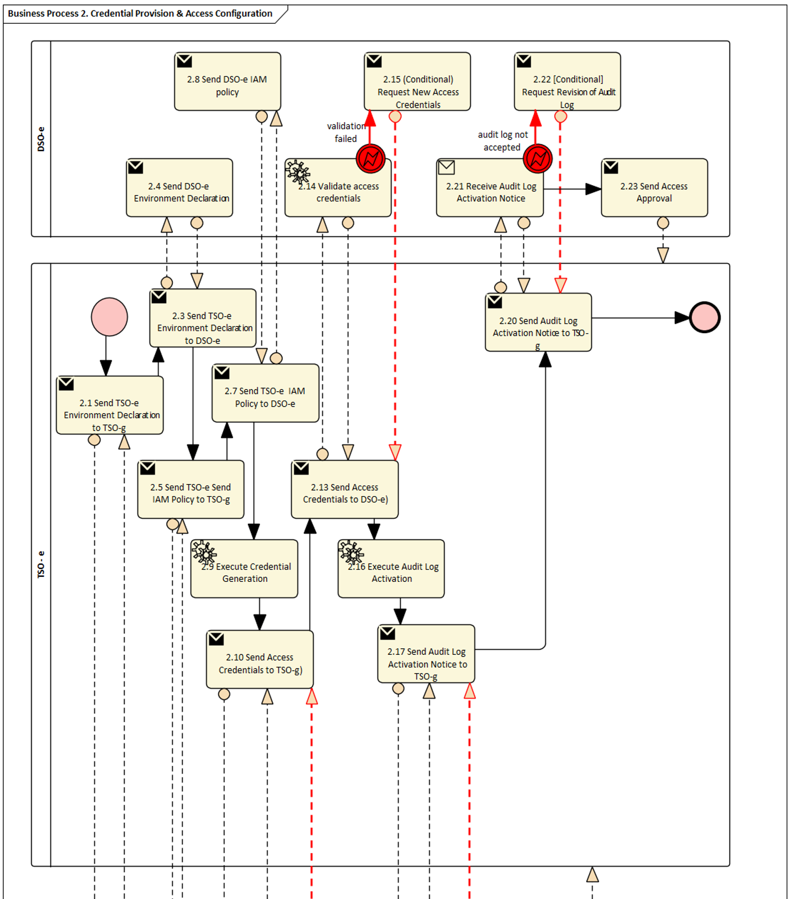
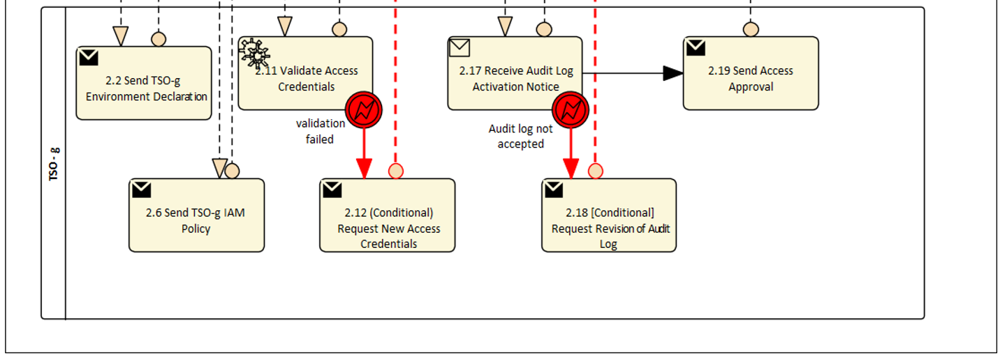
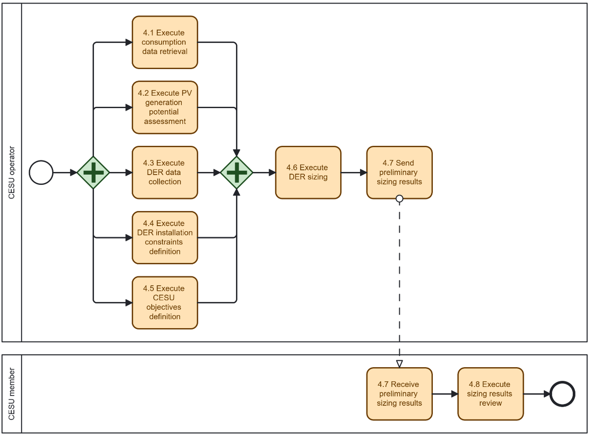

## Context/ Whereas

(1) [TODO] If possible, please write explanations like recitals.

CHAPTER I

**Regarding GENERAL PROVISIONS**

*Issue 1*

**On subject matter and scope**

(1) [IGNORE FOR NOW]

## Definitions

*Issue 2*

**On definitions**

For the purpose of this implementing regulation, the definitions in Article 2 of Directive (EU) 2019/944 [TODO and state that the definitions in other pieces of European Legislation] shall apply. In addition, the following definitions shall apply:

* (1) [EXAMPLE] 'market party', in the context of this act, means organisations that take part in data exchange for the access to metering and consumption data, master data, supplier switching, demand response and other energy services.

* (2) [TODO] provide your additional definitions

## Responsibilities of Market Roles

CHAPTER II

**Regarding [YOUR USE CASE]**

**[NOTE] Typically define responsibilities last and in close coordination with *T5.5 EU Policy and regulation alignment***

*Article XX*

**On responsibilities of ROLE1**

1. ROLE1 shall ...

## Annex

ANNEX A

**A1. The reference model for [YOUR USE CASE]**

### General Information

***Table I - General information on Member State environments***

Table I contains information needed by [Stakeholder1 AND Stakeholder2] to set up for utilising [YOUR USE CASE] in a Member State.

| ID  | Name                         | Description                                                                                                                                                                                                           |
|-----|------------------------------|-----------------------------------------------------------------------------------------------------------------------------------------------------------------------------------------------------------------------|
| I1  | [EXAMPLE] National competent authority | *Name* - Name of appointed national competent authority. *Website* - Website of appointed national competent authority. *Official contact* - Contact details for managing the mappings of national practices. |
| I2  | [EXAMPLE] Information about permission administrators in a Member State (at least *one mapping per each active consent administrator in a Member State*) | *Name* - Name of the organisation. *Type of identification* - May be ACER registration code, Legal Entity Identifier (LEI), Bank Identifier Code (BIC), Energy Identification Code (EIC), Global Location Number (GLN/GS1) or National Identification Code (NIC). *Identification of organisation* - Code or identification within the identification space nominated above. *Website* - If applicable, link to website of a web application that is used for consent administration. *User inface* - URL or user portal. *Official contact* - Contact details for data sharing. *Consent management responsibility for* - Metered data administrators for which the consent administrator manages consents. Note that it is also valid for a metered data administrator to utilize several consent administrators for a consent administrator to act for multiple metered data administrators. *Documentation of access* - A self-sufficient explanation of the Member State provisions with regards to utilize *access to validated historical consumption data by an eligible party*. It is recommended to also include an English version of this documentation. *Identity service provider* - Identity service provider utilized by the consent administrator to authenticate final customers. *Eligible party onboarding* - Either a link to the English documentation of the onboarding procedure or a complete, self-sufficient English explanation for how an eligible party can onboard to the productive environment to utilize *sharing of validated historical consumption data with an eligible party*. *Eligible party test onboarding* - If applicable, either a link to the English documentation of the onboarding procedure or a complete, self-sufficient English explanation for how an eligible party can onboard to a test environment to utilize *sharing of validated historical consumption data with an eligible party*. *Price list for access to data by eligible parties* - Exhaustive description of all costs for eligible parties. |

**[TODO] Please describe all *HARMONISED ROLES* below.**

### Relevant Roles

***Table II - Roles***

| Role name                                | Role type | Role description                                                                                                                                                                                                                                                                                                       |
|------------------------------------------|-----------|------------------------------------------------------------------------------------------------------------------------------------------------------------------------------------------------------------------------------------------------------------------------------------------------------------------------|
| [EXAMPLE] Final customer                 | Business  | A party connected to the grid that purchases electricity for its own use. Please note, that this also includes the case of active customer.                                                                                                                                                                            |
| [EXAMPLE] Competent authority            | Business  | The national competent authority providing the mappings of national practices. It makes them available online and in an easily usable and publicly accessible form[^1].                                                                                                                                                  |
| [EXAMPLE] Party administrator            | Business  | A party responsible for maintaining the market party characteristics for the energy sector.                                                                                                                                                                                                                             |
| CESU operator                            | Business  | A party responsible for organising a collective energy sharing unit settlement and billing.                                                                                                                                                                                                                             |
| CESU member                              | Business  | Member of a collective energy sharing unit.                                                                                                                                                                                                                                                                            |
| Flexibility service provider (FSP)       | Business  | A market participant with a legal or contractual obligation to supply local or balancing services to the system operator.                                                                                                                                                                                               |
| System Operator (SO)                     | Business  | DSO or TSO procuring balancing or local services.                                                                                                                                                                                                                                                                      |
| Flexibility requesting party (FRP)       | Business  | A party that has an agreement with one or more flexibility service providers to provide a flexibility service [[ref](https://www.vlaamsenutsregulator.be/sites/default/files/document/2023-updated_market_guide_flex_v1.1_.pdf)][[ref](https://beflexible.eu/wp-content/uploads/2024/04/BeFlexible-D1.2-Framework-for-Flexibility-Centric-Energy.pdf)]. Can be a DSO, TSO, or BRP [[ref](https://www.usef.energy/app/uploads/2021/03/08032021-White-paper-Flexibility-Deployment-in-Europe-version-1.0-3.pdf)]. |
| Flexibility market operator (FMO)        | Business  | A party responsible for operating a flexibility market, i.e., provides a service whereby the offers to sell flexibility are matched with bids to buy flexibility (adapted from [[ENTSO-E](https://energy.ec.europa.eu/system/files/2021-06/bridge_wg_regulation_eu_bridge_hemrm_report_2020-2021_0.pdf)]).                |

All roles of type *Business* are expected to be acting in secure, authenticated manner and through trusted communication channels. For this reason, the authentication steps used for these communication partners are not listed in the scenarios below.

### Procedures

**[TODO] First step should be to clearly state the list of procedures.**

***Table III - Procedure Conditions***

| No. | Procedure name                                              | Primary actor               | Pre-condition        |
|-----|-------------------------------------------------------------|-----------------------------|----------------------|
| 1   | Legal Onboarding & Agreement Setup                          | TSO-e, TSO-g, DSO-e        |                      |
| 2   | Credential Provision & Access Configuration                 | TSO-e, TSO-g                |                      |
| 3   | TSO-DSO Data Sharing for Flexibility Planning               | TSO-e, DSO-e                |                      |
| 4   | Energy Community Flexibility Quantification & Asset Sharing | TSO-e, DSO-e, CESU Operator (?) | CESU is established. |
| 5   | Cross-Sector Data Exchange Initialization (Gas/Electricity) | TSO-e, TSO-g                |                      |
| 6   | Digital Twin Setup & Calibration (Electricity/Gas)          | TSO-e, TSO-g                |                      |
| 7   | Co-Optimization Model Execution (Electricity/Gas)           | TSO-e                       |                      |
| 8   | Result Submission & Delivery to Operators                   | TSO-e                       |                      |
| 9   | Hydrogen Electrolyser Integration Assessment                | TSO-e, TSO-g                |                      |
| 10  | Data Deletion and Offboarding                               | TSO-e, TSO-g, DSO-e        |                      |

All diagrams describing the scenarios are of an illustrative nature and follow *Business Process Model and Notation 2.0*[^2]*.* Information objects referred in columns *Information exchanged (IDs)* are defined in Table IV.

**[TODO DEFINE NEEDED PROCEDURES STEP BY STEP TOGETHER WITH INFORMATION EXCHANGED]**

1  Note that the referred information will also be published and accessible from the EU Advisory Authority.
2  Business Process Model and Notation 2.0: https://www.omg.org/spec/BPMN/2.0.2/PDF 

#### Procedure 1 - Legal Onboarding & Agreement Setup

| Step No. | Step                                             | Step description                                                                                    | Information producer (actor) | Information receiver (actor) | Information exchanged (IDs)      |
|----------|--------------------------------------------------|-----------------------------------------------------------------------------------------------------|------------------------------|------------------------------|----------------------------------|
| 1.1      | Send NDA Draft (TSO-g)                           | Provide NDA draft text for confidentiality agreement between TSO-e and TSO-g.                       | TSO-e                        | TSO-g                        | AA - NDA Draft Document         |
| 1.2      | Execute NDA Draft Validation (TSO-g)             | Check completeness, consistency, and compliance of NDA draft with internal and regulatory requirements. | TSO-g                     | TSO-g                        | [not relevant]                   |
| 1.3      | [Conditional] Request for Revision of NDA - TSO-g | Request changes to NDA clauses based on validation outcome.                                        | TSO-g                        | TSO-e                        | AA - NDA Draft Document         |
| 1.4      | [Conditional] Send Revised NDA Draft (TSO-g)     | Provide updated NDA draft reflecting requested changes.                                             | TSO-e                        | TSO-g                        | AA - NDA Draft Document         |
| 1.5      | Execute Revised NDA Draft Validation (TSO-g)     | Re-check completeness and compliance after revision.                                                | TSO-g                        | TSO-g                        | [not relevant]                   |
| 1.6      | Send NDA Signing Request (TSO-g)                 | Request signature of finalized NDA.                                                                 | TSO-e                        | TSO-g                        | AB - NDA Signing Request        |
| 1.7      | Sign NDA (TSO-g)                                 | Formally sign the NDA.                                                                              | TSO-g                        | TSO-e                        | AC - Signed NDA (TSO-e/TSO-g)   |
| 1.8      | Sign NDA (TSO-e)                                 | Formally sign the NDA after receiving counterpart signature.                                        | TSO-e                        | TSO-g                        | AC - Signed NDA (TSO-e/TSO-g)   |
| 1.9      | Acknowledge NDA Archiving (TSO-e)                | Record and archive signed NDA for compliance.                                                       | TSO-e                        | TSO-e                        | [not relevant]                   |
| 1.10     | Send NDA Draft (DSO-e)                           | Provide NDA draft text for confidentiality agreement.                                               | TSO-e                        | DSO-e                        | AA - NDA Draft Document         |
| 1.11     | Execute NDA Draft Validation (DSO-e)             | Check completeness, consistency, and compliance of NDA draft with internal and regulatory requirements. | DSO-e                     | DSO-e                        | [not relevant]                   |
| 1.12     | [Conditional] Request for Revision of NDA - DSO-e | Request changes to NDA clauses based on validation outcome.                                       | DSO-e                        | TSO-e                        | AA - NDA Draft Document         |
| 1.13     | [Conditional] Send Revised NDA Draft (DSO-e)     | Provide updated NDA draft reflecting requested changes.                                             | TSO-e                        | DSO-e                        | AA - NDA Draft Document         |
| 1.14     | Execute Revised NDA Draft Validation (DSO-e)     | Re-check completeness and compliance after revision.                                                | DSO-e                        | DSO-e                        | [not relevant]                   |
| 1.15     | Send NDA Signing Request (DSO-e)                 | Request signature of finalized NDA.                                                                 | TSO-e                        | DSO-e                        | AB - NDA Signing Request        |
| 1.16     | Sign NDA (DSO-e)                                 | Formally sign the NDA.                                                                              | DSO-e                        | TSO-e                        | AC - Signed NDA (TSO-e/DSO-e)   |
| 1.17     | Sign NDA (TSO-e)                                 | Formally sign the NDA after receiving counterpart signature.                                        | TSO-e                        | DSO-e                        | AC - Signed NDA (TSO-e/DSO-e)   |
| 1.18     | Acknowledge NDA Archiving (TSO-e)                | Record and archive signed NDA for compliance.                                                       | TSO-e                        | TSO-e                        | [not relevant]                   |
| 1.19     | Notify NDA Completion (TSO-g)                    | Notify TSO-g that both NDA agreement is finalized and legal onboarding is complete.                 | TSO-e                        | TSO-g                        | AD - NDA Completion Notification |
| 1.20     | Notify NDA Completion (DSO-e)                    | Notify DSO that both NDA agreement is finalized and legal onboarding is complete.                   | TSO-e                        | DSO-e                        | AD - NDA Completion Notification |

Diagram 1 -- At the end, please provide Sequence Diagrams, BPMN Charts, even Class Diagrams -- everything that helps for an understanding

***Table IV - Information exchanged***

| Information exchanged, ID | Name of information         | Description of information exchanged                            |
|---------------------------|-----------------------------|-----------------------------------------------------------------|
| AA                        | NDA Draft Document          | NDA Terms - Legal confidentiality clauses                      |
|                           |                             | Document version - Internal version number for traceability    |
|                           |                             | Signatory roles - Entities expected to sign                    |
| AB                        | NDA Signing Request         | Reference to NDA draft version - Link to agreed text           |
|                           |                             | Request date - Date when signing request sent                  |
|                           |                             | Signature deadline - Latest acceptable signing date            |
| AC                        | Signed NDA                  | Final NDA text - Legally binding clauses                       |
|                           |                             | Signatures of both parties - Signatures                        |
|                           |                             | Signing date - Date of final agreement                         |
| AD                        | NDA Completion Notification | NDA ID/reference - Unique identifier for NDA                   |
|                           |                             | Effective date - Start of legal effect                         |
|                           |                             | Confirmation of archiving - Recorded in compliance system      |

**[TODO] If it helps for understanding, please add EER and/or class Diagrams for *Aggregated* and *Message Information Models***

#### Procedure 2 - Credential Provision & Access Configuration

| Step No. | Step                                                        | Step description                                                                                  | Information producer (actor) | Information receiver (actor) | Information exchanged (IDs)               |
|----------|-------------------------------------------------------------|---------------------------------------------------------------------------------------------------|------------------------------|------------------------------|-------------------------------------------|
| 2.1      | Send Environment Declaration (TSO-e > TSO-g)                | Provide technical specifications of TSO-e secure IT environment.                                  | TSO-e                        | TSO-g                        | BA – Environment Declaration              |
| 2.2      | Send Environment Declaration (TSO-e > DSO-e)                | Provide technical specifications of TSO-e secure IT environment.                                  | TSO-e                        | DSO-e                        | BA – Environment Declaration              |
| 2.3      | Send Environment Declaration (TSO-g > TSO-e)                | Provide technical specifications of TSO-g secure IT environment.                                  | TSO-g                        | TSO-e                        | BA – Environment Declaration              |
| 2.4      | Send Environment Declaration (DSO-e > TSO-e)                | Provide technical specifications of DSO-e secure IT environment.                                  | DSO-e                        | TSO-e                        | BA – Environment Declaration              |
| 2.5      | Send IAM Policy (TSO-e > TSO-g)                             | Provide identity & access management (IAM) and role-based access control (RBAC) policy.           | TSO-e                        | TSO-g                        | BB – IAM & RBAC Policy                    |
| 2.6      | Send IAM Policy (TSO-e > DSO-e)                             | Provide identity & access management (IAM) and role-based access control (RBAC) policy.           | TSO-e                        | DSO-e                        | BB – IAM & RBAC Policy                    |
| 2.7      | Send IAM Policy (TSO-g > TSO-e)                             | Provide identity & access management (IAM) and role-based access control (RBAC) policy.           | TSO-g                        | TSO-e                        | BB – IAM & RBAC Policy                    |
| 2.8      | Send IAM Policy (DSO-e > TSO-e)                             | Provide identity & access management (IAM) and role-based access control (RBAC) policy.           | DSO-e                        | TSO-e                        | BB – IAM & RBAC Policy                    |
| 2.9      | Execute Credential Generation (TSO-e)                       | Generate secure credentials (e.g., keys, certificates, user IDs) to grant access for external operators. | TSO-e                   | TSO-e                        | BC – Access Credentials (internal record) |
| 2.10     | Send Access Credentials (TSO-e > TSO-g)                     | Provide generated credentials for secure access to TSO-e's environment.                           | TSO-e                        | TSO-g                        | BC – Access Credentials                   |
| 2.11     | Send Access Credentials (TSO-e > DSO-e)                     | Provide generated credentials for secure access to TSO-e's environment.                           | TSO-e                        | DSO-e                        | BC – Access Credentials                   |
| 2.12     | Execute Access Credentials Validation (TSO-g)               | Verify correctness and usability of received credentials in TSO-g systems.                        | TSO-g                        | TSO-g                        | [validation record]                       |
| 2.13     | Execute Access Credentials Validation (DSO-e)               | Verify correctness and usability of received credentials in DSO-e systems.                        | DSO-e                        | DSO-e                        | [validation record]                       |
| 2.14     | [Conditional] Request New Access Credentials (TSO-g)        | Request replacement credentials in case of validation failure.                                    | TSO-g                        | TSO-e                        | BC – Access Credentials (reissue request) |
| 2.15     | [Conditional] Request New Access Credentials (DSO-e)        | Request replacement credentials in case of validation failure.                                    | DSO-e                        | TSO-e                        | BC – Access Credentials (reissue request) |
| 2.16     | Execute Audit Log Activation (TSO-e)                        | Activate audit logging and traceability mechanisms for all credential-based access.               | TSO-e                        | TSO-e                        | BD – Audit Log Activation Record          |
| 2.17     | Send Audit Log Activation Notice (TSO-e > TSO-g)            | Provide audit log activation details for transparency and oversight.                              | TSO-e                        | TSO-g                        | BD – Audit Log Activation Notice          |
| 2.18     | Send Audit Log Activation Notice (TSO-e > DSO-e)            | Provide audit log activation details for transparency and oversight.                              | TSO-e                        | DSO-e                        | BD – Audit Log Activation Notice          |
| 2.19     | [Conditional] Request Revision of Audit Log Setup (TSO-g)   | Request updates or corrections to audit log setup.                                                | TSO-g                        | TSO-e                        | BD – Audit Log Activation Notice          |
| 2.20     | [Conditional] Request Revision of Audit Log Setup (DSO-e)   | Request updates or corrections to audit log setup.                                                | DSO-e                        | TSO-e                        | BD – Audit Log Activation Notice          |
| 2.21     | Send Access Approval (TSO-g > TSO-e)                        | Confirm readiness of TSO-g to exchange data securely.                                             | TSO-g                        | TSO-e                        | BE – Access Go-Ahead Confirmation         |
| 2.22     | Send Access Approval (DSO-e > TSO-e)                        | Confirm readiness of DSO to exchange data securely.                                               | DSO-e                        | TSO-e                        | BE – Access Go-Ahead Confirmation         |

***Table IV - Information exchanged***

| Information exchanged, ID | Name of information          | Description of information exchanged                              |
|---------------------------|------------------------------|-------------------------------------------------------------------|
| BA                        | Environment Declaration      | Technical specifications - System architecture, interfaces       |
|                           |                              | Compliance standards - Security & regulatory references          |
|                           |                              | Version reference - Internal version for traceability            |
| BB                        | IAM & RBAC Policy            | Identity management rules - User authentication process          |
|                           |                              | Role-based access matrix - Who can access what                   |
|                           |                              | Policy version - Internal policy reference number                |
| BC                        | Access Credentials           | Credential type - Keys, certificates, IDs                        |
|                           |                              | Validity period - Activation and expiry date                     |
|                           |                              | Issuing entity - Operator responsible for generation             |
| BD                        | Audit Log Activation Notice  | Log scope - Systems and activities monitored                     |
|                           |                              | Activation date - Date when logging was enabled                  |
|                           |                              | Traceability details - Records and retention rules               |
| BE                        | Access Go-Ahead Confirmation | Confirmation reference - Unique approval ID                      |
|                           |                              | Approval date - Date when readiness confirmed                    |
|                           |                              | Authorized scope - What activities are approved                  |

#### Procedure 3 - TSO-DSO Data Sharing for Flexibility Planning

| Step No. | Step | Step description | Information producer (actor) | Information receiver (actor) | Information exchanged (IDs) |
|----------|------|------------------|------------------------------|------------------------------|-----------------------------|
|          |      |                  |                              |                              |                             |
|          |      |                  |                              |                              |                             |
|          |      |                  |                              |                              |                             |
|          |      |                  |                              |                              |                             |
|          |      |                  |                              |                              |                             |
|          |      |                  |                              |                              |                             |
|          |      |                  |                              |                              |                             |
|          |      |                  |                              |                              |                             |
|          |      |                  |                              |                              |                             |
|          |      |                  |                              |                              |                             |
|          |      |                  |                              |                              |                             |
|          |      |                  |                              |                              |                             |

***Table IV - Information exchanged***

| Information exchanged, ID | Name of information | Description of information exchanged |
|---------------------------|---------------------|--------------------------------------|
| CA                        |                     |                                      |
| CB                        |                     |                                      |
| CC                        |                     |                                      |
| CD                        |                     |                                      |
| CE                        |                     |                                      |

#### Procedure 4 - Energy Community Flexibility Quantification & Asset Sharing

Following EU directives, flexibility markets are expected to provide flexibility services for system operators (SOs). As natural aggregators, flexibility can be offered by collective energy sharing units (CESUs) to flexibility requesting parties (FRPs), either directly as a flexibility service provider (FSP) or as technical aggregators and contracting a FSP as a market representant. There are two types of FRPs: commercial FRPs procuring flexibility for balancing, such as market agents in intraday-like markets, and regulated FRPs, such as DSOs requesting flexibility for local grid congestion, and TSOs requesting flexibility for global balancing purposes.

TSO flexibility services have been in place for several years, although being now extended to include distributed energy resources (DERs), and can be consulted in TSOs operational procedures. Meanwhile, DSO flexibility services are still in a much less mature stage. In general, distributed flexibility for SOs is a complex topic that involves different grid services for DSO and TSO and the need for coordination mechanism, as explained in [[ref](https://www.mdpi.com/1996-1073/14/15/4451)]. Moreover, the existence of multiple grid services and TSO-DSO coordination mechanisms makes it difficult to standardize these procedures.

Thus, it was decided, at this stage, to focus on the provision of flexibility in a day-ahead flexibility market, based on the approach for DSOs in [[ref](https://beflexible.eu/wp-content/uploads/2024/04/BeFlexible-D1.2-Framework-for-Flexibility-Centric-Energy.pdf)][[ref](https://www.sciencedirect.com/science/article/abs/pii/S0957178725001444)], but mostly valid for TSOs as well. However, when providing flexibility for TSO, as already mentioned, TSO-DSO coordination mechanisms must be in place so that the activation of distributed flexibility by the TSO does not compromise the operation of the distribution grid by the DSO. It should be remarked that flexibility markets with DERs are still at a very initial stage of development, but they are expected to become relevant tools for future grid operation.

When providing flexibility to SOs, particularly to TSOs, a CESU must comply with requirements for the provision of ancillary services, namely manual frequency restoration reserves (mFRR). These requirements cover several dimensions, including:

- Quality of service: strict, pre-defined response times and minimum bid capacities, which can even require the aggregation of multiple CESUs under a single FSP/BSP.

- Data availability and communication: continuous data availability validate data exchanges and use communication protocols compatible with TSOs' systems.

- Pre-qualification: consisting of multiple technical tests to demonstrate the CESU is able to exchange bids, receive and follow dispatch instructions, and ensure DERs control.

This section focuses on the CESUs planning procedure considering the participation in flexibility markets with the provision of explicit flexibility. The CESU provides the explicit flexibility to FRPs such as TSOs or DSOs, negotiated in a day-ahead flexibility market. The CESU operation with flexibility is included in Procedure 8 (Task 4.3).

Sizing a CESU involves computing potential new investments in DER to optimize predefined objectives, such as the total energy cost minimization. Therefore, the objective is to determine the optimal capacity of new DERs that balances capital expenditure (Capex) with operational expenditure (Opex), while profiting from the additional revenues of providing flexibility services.

INESC TEC has been developing a tool for CESU DER sizing, called SITEC, that determines the optimal contracted power as well as PV and BESS capacities for each CESU member. A complete overview of SITEC without considering flexibility, including its mathematical formulation, can be consulted in [[ref](https://ieeexplore.ieee.org/abstract/document/11050164)]. Extending this MILP to include flexibility is not straightforward, since DER sizing with flexibility requires the computation of optimal DERs capacities for a given baseline, which itself depends on those capacities. This dependence leads to a complex bilevel optimization problem. To address this challenge, INESC is currently working on alternative approaches, such as grid search methods (change DER capacity and verify the impact on Capex and Opex), and metaheuristic-based algorithms.

Operation, described in Procedure 8 (Task 4.3), addresses the daily management of the CESU and its DERs. This includes the scheduling and dispatch of DERs, and, optionally, the computation of flexibility bids to participate in the day-ahead flexibility market, as well as the CESU baseline corresponding to its net consumption when no flexibility is provided.

INESC TEC has also been developing a tool for the operation of DERs within CESUs (or energy communities), called OSTEC. It determines the optimal setpoints for the DERs, includes PV panels, BESS, electric vehicles (EVs) and electric water heaters (EWHs). A complete overview of OSTEC, including its mathematical formulation, is provided in [[ref](https://ieeexplore.ieee.org/abstract/document/11050324)]. Beyond DER scheduling, OSTEC can compute, for a given flexibility request, the optimal flexibility bids at CESU-level for participation in a day-ahead flexibility market, as well as the individual baselines of the CESU members, required for verification and settlement of the provided flexibility.

This procedure describes the process for sizing DERs, including PV panels and battery energy storage systems (BESS), for members of a CESU. The objective is to determine the optimal capacities of DERs for each CESU member, as well as their optimal contracted power, that minimize CESU costs. In addition, the procedure considers the potential revenues from the participation of the CESU in a flexibility market managed by a system operator (SOs) such as a DSO or a TSO (who, in this context, also takes the role of flexibility market operator (FMO)).

**Prerequisites**: consumers have joined the CESU, becoming CESU members; the CESU platform supports data specific for the sizing process, and have these data previously uploaded (these main data include: community structure definition, historical consumption data from smart meters, opportunity costs of each CESU member (buying price from its retailer and selling price to its aggregator), data on pre-existing DERs (PV and BESS), data on other relevant assets with potential flexibility, such as EVs and EWHs, etc., investments costs in new DERs, and contracted power tariffs. Prequalification to participate in the flexibility market (see Procedures 15 and 16, Task 4.3) is only required for the actual participation and not during the planning phase.

| Step No. | Step                                            | Step description                                                                                                                                                                                                                                                          | Information producer (actor) | Information receiver (actor) | Information exchanged (IDs)   |
|----------|-------------------------------------------------|---------------------------------------------------------------------------------------------------------------------------------------------------------------------------------------------------------------------------------------------------------------------------|------------------------------|------------------------------|-------------------------------|
| 4.1      | Execute consumption data retrieval              | CESU operator retrieves historical energy consumption for each CESU member.                                                                                                                                                                                               | CESU operator                | [internal]                   | DA - Metering data            |
| 4.2      | Execute PV generation potential assessment      | CESU operator evaluates rooftop solar PV generation potential for each CESU member. If member-specific data are available (location, roof orientation, irradiation), generation profiles are assessed. If such data are unavailable, standard generation profiles may be applied. | CESU operator                | [internal]                   | [not relevant]                |
| 4.3      | Execute DER data collection                     | CESU operator collects technical and economic DERs data (e.g., costs, incentives, lifetimes, degradation rates, efficiencies).                                                                                                                                            | CESU operator                | [internal]                   | [not relevant]                |
| 4.4      | Execute DER installation constraints definition | CESU operator, in agreement with CESU members, defines constraints for DER installation based on technical, economic and regulatory criteria, to limit DER sizes.                                                                                                         | CESU operator                | [internal]                   | [not relevant]                |
| 4.5      | Execute CESU objectives definition              | CESU operator, in agreement with CESU members, defines sizing objectives (e.g., total costs minimization w/wo flexibility market participation).                                                                                                                          | CESU operator                | [internal]                   | [not relevant]                |
| 4.6      | Execute DER sizing                              | Using an internal algorithm, the CESU operator determines the optimal PV and BESS capacity and contracted power for each CESU member, considering an estimation of the expected flexibility requirements and market price.                                                 | CESU operator                | [internal]                   | [not relevant]                |
| 4.7      | Send preliminary sizing results                 | CESU operator shares preliminary sizing results with CESU members for review.                                                                                                                                                                                             | CESU operator                | CESU member                  | DB - Preliminary sizing results |
| 4.8      | Execute sizing results review                   | CESU members review sizing results, confirm budgets.                                                                                                                                                                                                                      | CESU member                  | [internal]                   | [not relevant]                |

Diagram 2 - Procedure 'Energy Community Flexibility Quantification & Asset Sharing'

***Table IV - Information exchanged***

| Information exchanged, ID | Name of information        | Description of information exchanged                                                                                                        |
|---------------------------|----------------------------|---------------------------------------------------------------------------------------------------------------------------------------------|
| DA                        | Metering data              | Verified energy measurements, used for self-consumption calculations.                                                                       |
| DB                        | Preliminary sizing results | Preliminary DER sizing results per CESU member, including contracted power and PV and BESS capacities. Pending CESU members approval.       |

#### Procedure 5 - Cross-Sector Data Exchange Initialization (Gas/Electricity)

| Step No. | Step                                          | Step description                                                                                          | Information producer (actor) | Information receiver (actor) | Information exchanged (IDs)   |
|----------|-----------------------------------------------|-----------------------------------------------------------------------------------------------------------|------------------------------|------------------------------|-------------------------------|
| 5.1      | Execute Gas-Electrolyser Data Packaging       | Compile dataset on hydrogen electrolysers (TBA).                                                          | TSO-g                        | TSO-g                        | EA - Gas-Electrolyser Dataset |
| 5.2      | Send Gas-Electrolyser Data                    | Transfer packaged dataset to electricity TSO (Data Management).                                           | TSO-g                        | TSO-e                        | EA - Gas-Electrolyser Dataset |
| 5.3      | Execute Dataset Integrity Validation          | Verify dataset integrity (completeness, metadata consistency, etc).                                       | TSO-e                        | TSO-e                        | EB - Dataset Integrity Report |
| 5.4      | [Conditional] Request Dataset Resubmission    | Request new dataset if integrity check fails.                                                             | TSO-e                        | TSO-g                        | EB - Dataset Integrity Report |
| 5.5      | [Conditional] Send Resubmitted Dataset        | Provide corrected dataset.                                                                                | TSO-g                        | TSO-e                        | EA - Gas-Electrolyser Dataset |
| 5.6      | Execute Schema Validation                     | Validate dataset structure, format, and compliance with expected model (electrolyser data mapping to grid model). | TSO-e                  | TSO-e                        | EC - Schema Validation Report |
| 5.7      | [Conditional] Request Dataset Revision        | Request dataset correction if schema mismatches found.                                                    | TSO-e                        | TSO-g                        | EC - Schema Validation Report |
| 5.8      | [Conditional] Send Revised Dataset            | Provide revised dataset with corrected schema.                                                            | TSO-g                        | TSO-e                        | EA - Gas-Electrolyser Dataset |
| 5.9      | Execute Data Quality Validation               | Validate dataset content for missing values, invalid ranges, or inconsistent fields.                      | TSO-e                        | TSO-e                        | ED - Data Quality Report      |
| 5.10     | [Conditional] Request Dataset Revision (Quality) | Request dataset correction if quality issues found.                                                    | TSO-e                        | TSO-g                        | ED - Data Quality Report      |
| 5.11     | [Conditional] Send Revised Dataset (Quality)  | Provide corrected dataset with improved quality.                                                          | TSO-g                        | TSO-e                        | EA - Gas-Electrolyser Dataset |

***Table IV - Information exchanged***

| Information exchanged, ID | Name of information        | Description of information exchanged                                          |
|---------------------------|----------------------------|-------------------------------------------------------------------------------|
| EA                        | Gas-Electrolyser Dataset   | Location of electrolysers - Coordinates (electrical substation connection), nodes |
|                           |                            | Installed capacity - MW, operational status                                  |
|                           |                            | Gas consumption profile - Time series                                        |
|                           |                            | Flexibility potential - Up/down regulation capability                         |
| EB                        | Dataset Integrity Report   | integrity check result - Pass/fail                                           |
|                           |                            | Detected issues - Missing files, errors                                      |
|                           |                            | Validation timestamp - Date when test executed                               |
| EC                        | Schema Validation Report   | Schema conformity - Format, structure compliance                             |
|                           |                            | Mapping checks - Fields align with model                                     |
|                           |                            | Report version - Internal version for traceability                           |
| ED                        | Data Quality Report        | Missing/invalid values - Detected gaps                                       |
|                           |                            | Range inconsistencies - Out-of-bounds entries                                |
|                           |                            | Correction recommendations - Fields to adjust                                |

#### Procedure 6 - Digital Twin Setup & Calibration (Electricity/Gas)

| Step No. | Step                                              | Step description                                                                                  | Information producer (actor) | Information receiver (actor) | Information exchanged (IDs)        |
|----------|---------------------------------------------------|---------------------------------------------------------------------------------------------------|------------------------------|------------------------------|------------------------------------|
| 6.1      | Send Electrical Network Dataset                   | Provide electricity network dataset (topology, generation, load, power flows) for DT input.       | TSO-e                        | TSO-e                        | FA - Electrical Network Dataset   |
| 6.2      | Execute Digital Twin Initialization               | Initialize the digital twin environment with baseline datasets.                                   | TSO-e                        | TSO-e                        | FB - Digital Twin Setup Record    |
| 6.3      | Execute Dataset Compatibility Validation          | Validate compatibility between electrical network dataset and gas-electrolyser dataset.           | TSO-e                        | TSO-e                        | FC - Dataset Compatibility Report |
| 6.4      | Execute Test Simulation                           | Run preliminary simulations to test DT behaviour and detect anomalies.                            | TSO-e                        | TSO-e                        | FD - Test Simulation Report       |
| 6.5      | [Conditional] Request Dataset Adjustments (TSO-g) | Request corrected gas-electrolyser dataset if anomalies are linked to gas-side data.              | TSO-e                        | TSO-g                        | FD - Test Simulation Report       |
| 6.6      | [Conditional] Request Dataset Adjustments (TSO-e) | Request corrected electricity dataset if anomalies are linked to electrical data.                 | TSO-e                        | TSO-e                        | FD - Test Simulation Report       |
| 6.7      | Send Revised Dataset (TSO-g)                      | Provide corrected gas-electrolyser dataset.                                                       | TSO-g                        | TSO-e                        | EA - Gas-Electrolyser Dataset     |
| 6.8      | Send Revised Dataset (TSO-e)                      | Provide corrected electricity network dataset.                                                    | TSO-e                        | TSO-e                        | FA - Electrical Network Dataset   |
| 6.9      | Execute Recalibration of Digital Twin             | Calibrate DT parameters and confirm readiness for scenario-based assessments.                     | TSO-e                        | TSO-e                        | FE - DT Calibration Report        |

***Table IV - Information exchanged***

| Information exchanged, ID | Name of information          | Description of information exchanged                                                   |
|---------------------------|------------------------------|----------------------------------------------------------------------------------------|
| FA                        | Electrical Network Dataset   | Grid topology - Nodes, Lines, Transformers, Generation units, Shunt Reactors, etc.    |
|                           |                              | Generation and load data - Time series (generation and load data)                     |
|                           |                              | Power flows - Historical time series                                                  |
| FB                        | Digital Twin Setup Record    | Initialization status - DT creation timestamp                                         |
|                           |                              | Input dataset references - IDs of loaded datasets                                     |
|                           |                              | Responsible entity - Entity who executed initialization                               |
| FC                        | Dataset Compatibility Report | Mapping validation - Electrolysers to grid nodes                                      |
|                           |                              | Balance checks - Load vs. generation impact                                           |
|                           |                              | Inconsistency log - Issues for correction                                             |
| FD                        | Test Simulation Report       | Test scenario description - What was simulated                                        |
|                           |                              | Detected anomalies - Data or model issues                                             |
|                           |                              | Recommendation - Required corrections                                                 |
| FE                        | DT Calibration Report        | Calibration parameters - Adjusted coefficients, settings                              |
|                           |                              | Validation results - Calibration test outcomes                                        |
|                           |                              | Ready status - Confirmation for use in simulations                                    |

#### Procedure 7 - Co-Optimization Model Execution (Electricity/Gas)

| Step No. | Step | Step description | Information producer (actor) | Information receiver (actor) | Information exchanged (IDs) |
|----------|------|------------------|------------------------------|------------------------------|-----------------------------|
|          |      |                  |                              |                              |                             |
|          |      |                  |                              |                              |                             |
|          |      |                  |                              |                              |                             |
|          |      |                  |                              |                              |                             |
|          |      |                  |                              |                              |                             |
|          |      |                  |                              |                              |                             |
|          |      |                  |                              |                              |                             |
|          |      |                  |                              |                              |                             |
|          |      |                  |                              |                              |                             |
|          |      |                  |                              |                              |                             |
|          |      |                  |                              |                              |                             |
|          |      |                  |                              |                              |                             |

***Table IV - Information exchanged***

| Information exchanged, ID | Name of information | Description of information exchanged |
|---------------------------|---------------------|--------------------------------------|
| GA                        |                     |                                      |
| GB                        |                     |                                      |
| GC                        |                     |                                      |
| GD                        |                     |                                      |
| GE                        |                     |                                      |

#### Procedure 8 - Result Submission & Delivery to Operators

| Step No. | Step | Step description | Information producer (actor) | Information receiver (actor) | Information exchanged (IDs) |
|----------|------|------------------|------------------------------|------------------------------|-----------------------------|
|          |      |                  |                              |                              |                             |
|          |      |                  |                              |                              |                             |
|          |      |                  |                              |                              |                             |
|          |      |                  |                              |                              |                             |
|          |      |                  |                              |                              |                             |
|          |      |                  |                              |                              |                             |
|          |      |                  |                              |                              |                             |
|          |      |                  |                              |                              |                             |
|          |      |                  |                              |                              |                             |
|          |      |                  |                              |                              |                             |
|          |      |                  |                              |                              |                             |
|          |      |                  |                              |                              |                             |
|          |      |                  |                              |                              |                             |
|          |      |                  |                              |                              |                             |
|          |      |                  |                              |                              |                             |
|          |      |                  |                              |                              |                             |
|          |      |                  |                              |                              |                             |
|          |      |                  |                              |                              |                             |
|          |      |                  |                              |                              |                             |
|          |      |                  |                              |                              |                             |
|          |      |                  |                              |                              |                             |
|          |      |                  |                              |                              |                             |

***Table IV - Information exchanged***

| Information exchanged, ID | Name of information | Description of information exchanged |
|---------------------------|---------------------|--------------------------------------|
| HA                        |                     |                                      |
| HB                        |                     |                                      |
| HC                        |                     |                                      |
| HD                        |                     |                                      |
| HE                        |                     |                                      |

#### Procedure 9 - Hydrogen Electrolyser Integration Assessment

| Step No. | Step                                        | Step description                                                                                 | Information producer (actor) | Information receiver (actor) | Information exchanged (IDs)            |
|----------|---------------------------------------------|--------------------------------------------------------------------------------------------------|------------------------------|------------------------------|----------------------------------------|
| 9.1      | Execute Electrolyser Integration Simulation | Run simulation scenarios to assess electrolyser deployment (TBA).                                | TSO-e                        | TSO-e                        | IA - Simulation Results Dataset       |
| 9.2      | Send Simulation Results                     | Share simulation outcomes (impacts on grid reliability, storage contribution, etc.).              | TSO-e                        | TSO-g                        | IA - Simulation Results Dataset       |
| 9.3      | Send Initialization Completion Notice       | Confirm successful initialization and data exchange cycle completed.                             | TSO-e                        | TSO-e                        | IB - Initialization Completion Notice |

***Table IV - Information exchanged***

| Information exchanged, ID | Name of information              | Description of information exchanged                                |
|---------------------------|----------------------------------|---------------------------------------------------------------------|
| IA                        | Simulation Results Dataset       | Grid impact metrics - Voltage stability, congestion                |
|                           |                                  | Storage contribution - MW equivalent from electrolysers            |
|                           |                                  | Renewable integration effects - Curtailment reduction, etc.        |
| IB                        | Initialization Completion Notice | Reference ID - unique identifier                                   |
|                           |                                  | Completion date - Date when process finalized                      |
|                           |                                  | Confirmation of readiness - Validation and initialization          |

#### Procedure 10 - Data Deletion and Offboarding

| Step No. | Step                                                | Step description                                                                                    | Information producer (actor) | Information receiver (actor) | Information exchanged (IDs)      |
|----------|-----------------------------------------------------|-----------------------------------------------------------------------------------------------------|------------------------------|------------------------------|----------------------------------|
| 10.1     | Send Offboarding Instruction (to TSO-g)             | Issue formal request to initiate offboarding and data cleanup                                       | TSO-e                        | TSO-g                        | JA - Offboarding Instruction    |
| 10.2     | Send Offboarding Instruction (to DSO-e)             | Issue formal request to initiate offboarding and data cleanup                                       | TSO-e                        | DSO-e                        | JA - Offboarding Instruction    |
| 10.3     | Execute Data Deletion (TSO-g)                       | Delete all electricity TSO-provided datasets from TSO-g systems and log the action                  | TSO-g                        | TSO-g                        | JB - Data Deletion Log          |
| 10.4     | Execute Data Deletion (DSO-e)                       | Delete all electricity TSO-provided datasets from DSO-e systems and log the action                  | DSO-e                        | DSO-e                        | JB - Data Deletion Log          |
| 10.5     | Execute Credential Revocation (TSO-e)               | Disable user accounts, API keys, or certificates previously assigned to TSO-g and DSO-e             | TSO-e                        | TSO-e                        | JC - Access Termination Record  |
| 10.6     | Notify Access Termination (TSO-e > TSO-g)           | Notify TSO-g that credentials have been revoked                                                     | TSO-e                        | TSO-g                        | JC - Access Termination Notice  |
| 10.7     | Notify Access Termination (TSO-e > DSO-e)           | Notify DSO-e that credentials have been revoked                                                     | TSO-e                        | DSO-e                        | JC - Access Termination Notice  |
| 10.8     | Send Data Deletion Certificate (TSO-g > TSO-e)      | Provide signed confirmation that all TSO-e datasets were deleted                                    | TSO-g                        | TSO-e                        | JD - Data Deletion Certificate  |
| 10.9     | Send Data Deletion Certificate (DSO-e > TSO-e)      | Provide signed confirmation that all TSO-e datasets were deleted                                    | DSO-e                        | TSO-e                        | JD - Data Deletion Certificate  |
| 10.10    | Execute Project Documentation Archiving (TSO-e)     | Archive project-related documents for traceability and compliance                                   | TSO-e                        | TSO-e                        | JE - Final Archive Index        |
| 10.11    | Request Project Closure Acknowledgment (TSO-g)      | Request closure acknowledgment from TSO-g                                                           | TSO-e                        | TSO-g                        | JF - Collaboration Closure Memo |
| 10.12    | Send Project Closure Acknowledgment (TSO-g)         | Confirm closure and compliance                                                                      | TSO-g                        | TSO-e                        | JF - Collaboration Closure Memo |
| 10.13    | Request Project Closure Acknowledgment (DSO-e)      | Request closure acknowledgment from DSO-e                                                           | TSO-e                        | DSO-e                        | JF - Collaboration Closure Memo |
| 10.14    | Send Project Closure Acknowledgment (DSO-e)         | Confirm closure and compliance                                                                      | DSO-e                        | TSO-e                        | JF - Collaboration Closure Memo |

***Table IV - Information exchanged***

| Information exchanged, ID | Name of information          | Description of information exchanged                                  |
|---------------------------|------------------------------|-----------------------------------------------------------------------|
| JA                        | Offboarding Instruction      | Instruction type - Formal offboarding request                        |
|                           |                              | Effective date - Date when deletion starts                           |
|                           |                              | Data scope - Datasets and services to delete                         |
| JB                        | Data Deletion Log            | Deletion timestamps - Timestamps per dataset/file                    |
|                           |                              | Affected files/directories - What exactly was removed                |
|                           |                              | Deletion method - Tool, script, process used, etc.                   |
| JC                        | Access Termination Record    | Credential types revoked - API keys, accounts, certificates          |
|                           |                              | Revocation time - Timestamp of deactivation                          |
|                           |                              | Systems affected - Portals, storage, access points, etc.             |
| JD                        | Access Termination Notice    | Confirmation of revocation - Credentials removed                     |
|                           |                              | Reference IDs - For deactivated accounts/keys                        |
|                           |                              | Contact for verification - Responsible security officer              |
| JE                        | Data Deletion Certificate    | Declaration of deletion - Official statement                         |
|                           |                              | Signature - Authorized officer at TSO-g or DSO-e                     |
|                           |                              | Covered data scope - Datasets, logs, backups                         |
| JF                        | Final Archive Index          | Archived items - Contracts, outputs, audit reports                   |
|                           |                              | Archive location - System reference, path                            |
|                           |                              | Retention policy - Duration and legal basis                          |
| JG                        | Collaboration Closure Memo   | Closure summary - Confirmation of completion                         |
|                           |                              | Parties involved - TSO-e, TSO-g, DSO-e                               |
|                           |                              | Reference to artifacts - Logs, certificates, archive index           |

 