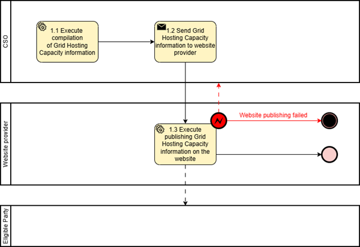

# Task 4-5_01 – Electromobility: Grid Hosting Capacity Information  

## Context

(1) It has been identified that delays in connecting new generation and demand installations such as renewable energy, EV charging and energy storage often stem from insufficient grid capacity. One of the reasons for such delays is the lack of information about time and location for available grid capacity at the location chosen by the investor.  
(2) To support energy investments in Europe both Distribution System Operators (DSOs) and Transmission System Operators (TSOs) are required to publish and regularly update information on available capacity This transparency aims to give investors easier access to connection opportunities and accelerate their decision-making processes.  
(3) DSOs shall update their capacity information at least quarterly, whereas TSOs shall update their capacity information monthly.   
(4) System operators shall publish in a clear and transparent manner information on the capacity available for new connections in their area of operation with high spatial granularity, respecting public security and data confidentiality, including the capacity under connection request and the possibility of flexible connection in congested areas. Member States may exempt electricity undertakings serving fewer than 100 000 customer connections or operating small isolated systems from the frequent publication requirement. However, system operators are encouraged to promote annual publication of available capacity for new connections and cooperation between smaller DSOs to maintain transparency for investors.  
(5) TSOs must provide information on the status and treatment of connection requests within three months, similar to DSOs, and must update this information quarterly when the request remains pending. Where applicable, TSOs must also include details related to flexible connection agreements.  
(6) DSOs and TSOs are required to cooperate closely to publish capacity information in a consistent, harmonised manner across both distribution and transmission levels. This cooperation is intended to provide developers and network users with coherent, granular visibility across the entire electricity system, reducing uncertainty and supporting efficient project development.  
(7) EU DSOs and ENTSO:e are tasked in the Grid Action Plan with providing a pan-EU-overview of grid hosting capacity.  
(8) This document introduces a reference model that will support the possibility for stakeholders to get information on available capacity for new connection in a clear, machine-readable manner adequate for information exchange with stakeholders.   
(9) The European Commission has acknowledged the gap between grid capacity and connection demand as an issue that must be addressed and launched several initiatives on network development plans, grid hosting capacity information and flexibility need assessment. (Regulation 2024/1747 and Directive 2024/1711) 
(10) Standardized data exchange for available capacity for new connections contributes to Grid Action Plan Action 6 to *‘(…) establish a pan-EU overview that should give visibility to project developers when conceptualising their projects, such as new renewable or EV recharging infrastructure projects and help developers estimate the risk of connection request approval delays and, thus, have a clearer forecast about when projects can start receiving revenues’*.   
(11) In line with project INSIEME’s Task 4.5 and in the context of the present document motivation is taken from the needs of Electric Heavy-Duty vehicles (eHDV).  
(12) The eHDV regulation framework includes the CO2 regulation (EU 2019/1242) to reduce tailpipe CO2 with 45% to 2030 vs. 2019. Since the regulation addresses limiting tailpipe emissions, zero-emission vehicles (ZEVs) are the only viable alternative for complying with the regulation. Approximately one third of new vehicle registrations 2030 must be zero-emission. The majority (~90%) will be Battery Electric Vehicles [“The technological and market readiness of heavy-duty road transport vehicles” DG Move May 27, 2025].   
(13) It is essential for the fulfilment of the CO2 regulation that connection of ~40.000 fast chargers and ~400.000 slow chargers in Europe can be enabled to support a fleet of 400.000 ZEVs. As of Q2 2025, there is an estimated ~1000-1100 eHDV accessible fast chargers (>350kW) in Europe [Source: EY and Milence].   
(14) Regulation (EU) 2023/18042 on the deployment of alternative fuels infrastructure (AFIR) is under implementation in member states to support the roll-out of zero-emission vehicles.   
(15) AFIR sets minimum requirements. However, considerably more fast charging and private or private shared charging in depots is required to support the fleet size derived from the CO2 regulation.  
(16) Information om available capacity for new connections is a useful tool to evaluate where and when grid capacity will be available for connecting these charging hubs to the grid. Each member state is responsible for providing AFIR compliance plans to the commission.   
(17) Electricity grid project developers require long-term grid hosting capacity information from CSOs in order to make future energy infrastructure investments.  

## Chapter I – General Provisions

### Issue 1 — Subject matter and scope  
### Issue 2 — Definitions

For the purpose of this document, the following definitions shall apply: 
(1)	‘Grid hosting capacity information’ in the context of this document, means a forecast for grid hosting capacity information from the System Operator that is an indication of available capacity for new connections 1-10 years in the future.

## Chapter II – Use Case

## Annex A 

### A1. Fundamental setup

### Table I – General information on Member State environments

| ID | Name | Description |
|----|------|-------------|
|I1|CSO|A Connecting System Operator that connects the final customer to the grid|
|I2|Publisher of grid hosting capacity information|An actor who publishes grid hosting capacity information|

## Roles

### Table II – Roles

| Role name | Role type | Role Description |
|----------|----------|-------------|
|Eligible Party|All|An ‘eligible party’ is an entity offering energy-related services to Final Customers. Examples include transmission and distribution system operators, delegated operators and other third parties, aggregators, energy service companies, renewable energy communities, citizen energy communities and balancing service providers, authorities and others.|
|Connecting System Operator CSO|Business|A Connecting System Operator that connects the final customer to the grid|
|Grid hosting capacity website provider|Business|A party who provides Grid hosting capacity website| 

## Procedures

All roles are expected to be accessing information in secure, authenticated manner and through trusted communication channels. For this reason, the authentication steps used for these communication partners are not listed in the scenarios below.   
An overview of the main procedures for the use case is presented in Table III. Further details are included in Table IV.1.

### Table III – Procedure Conditions

| No. | Procedure Name | Primary Actor | Pre-condition |
|----|----------|--------------|--------------|
|1|Access to Grid hosting capacity information (Category: Result Submission & Delivery)|Connecting System Operator (CSO)|None|

## Procedure Details

All diagrams describing the procedures are of an illustrative nature. Information objects referred to in columns Information exchanged (IDs) are defined in Table V. Table IV.1 explains the procedure from Table III in further detail, step by step, together with the information exchanged.

### Table IV.1 – Access eHDV Data

| Step no.| Step | Step Description | Information Producer (actor) | Information receiver (actor) |Information exchanged (IDs)|
|------|-------------|----------|----------|----------|----------|
|1.1|Execute compilation of Grid Hosting Capacity information|Internal activity. CSO checks for grid hosting capacity|CSO||		
|1.2|Send Grid Hosting Capacity information to the website provider|CSO provides Grid hosting capacity information to grid hosting capacity website provider|CSO|Grid hosting capacity website provider|(A)-(D)|
|1.3|Execute publishing Grid Hosting Capacity information on the website|Grid hosting capacity website provider publishes grid hosting capacity information on website. Eligible party can read Grid hosting capacity information for the selected area directly on the webpage. In case of unsuccessful publication, a meaningful indication is provided.|Grid hosting capacity website provider|Eligible Party|(A)-(D)|

*Figure 1: Diagram corresponding to the procedure in Table IV.1.*

## Information Objects

### Table V

| Information exchanged | Name of information | Description of information exchanged |
|----------------------------|--------------------|--------------------------------------|
|(A) Location (one or more fields must be provided for identification of the resource)|Location of grid hosting capacity information (all fields are optional; not all fields may be left empty; information ensures unique identification)|**mrID** The Master Resource ID of the station. Identifies the station. **Station Name** The name of the station. **Position point** The position point of the asset as a single location as (x,y,z) **Grid Hosting Capacity Service Area** The name of the grid hosting capacity service area (full text name or an abbreviation), could for example be a license area **Polygon** A polygonal area defined by a set of coordinates **Municipality** Municipality **Region**Region **Country** Country **Postal Code** Postal Code **Voltage level** The nominal voltage level in Kilovolts (kV) **Other relevant information**Field for further locational information (for example Master Resource ID of final customer or address of final customer)|
|(B) Grid hosting capacity information|Grid hosting capacity Information (all fields are optional; not all fields may be left empty)|**Information of available capacity for new connections** Information on firm capacity available for new connections. Requirement for grid hosting capacity information in (EU) 2019/943 and (EU) 2019/944. **Information of connection request** Information on connection requests. Requirement for grid hosting capacity information in (EU) 2019/943 and (EU) 2019/944 **Information of possibility of flexible connection** Information on possibility of flexible connection. Requirement for grid hosting capacity information in (EU) 2019/943 and (EU) 2019/944. **Information of total capacity for new connections** Information on total capacity for new connections including firm capacity available for new connections and Information on connection requests. **Capacity information year** The year or year-range of the grid hosting capacity. **Connection year** Possible year or year-range for customer connection. Lead-time from connection contract to delivered connection. **Timestamp of data**	Timestamp of data publishing. **Further Capacity Information** Further capacity-related information, e.g. description of the SO description of the data provided (values, ranges, colour codes, etc.) **Consideration of overlying grid** The capacity shown is with or without consideration of available capacity from overlying grid.  **Flexibility level description** Description of flexible connection agreement (e.g. 2 percent of yearly energy, 20 percent of capacity, seasonal difference of capacity).|
|(C) Customer Connection Type|Customer Connection Type (all fields are optional; not all fields may be left empty)|**Generation** The customer connection type relevant for the capacity data is production. **Wind** The customer connection type relevant for the capacity data is wind. **Solar**The customer connection type relevant for the capacity data is solar. **Consumption** The customer connection type relevant for the capacity data is consumption. **EV charger light vehicle** The customer connection type relevant for the capacity data is EV chargers light vehicles. **EV charger heavy duty vehicle** The customer connection type relevant for the capacity data is EV chargers Heavy Duty vehicle. **Consumption - High user** The customer connection type relevant for the capacity data is consumption customer often industry – high usage of connection. **Consumption - Average user** The customer connection type relevant for the capacity data is consumption customer, for example smaller industries, companies and larger commercial buildings – average usage of connection. **Energy storage** The customer connection type relevant for the capacity data is Industry customer – energy storage. **Hybrid park** The customer connection type relevant for the capacity data is a customer with both production and energy storage behind the connection point – hybrid park.|
|(D) Disclaimer information|Disclaimer information from on the grid hosting capacity information provided (all fields are optional)|**Information text** Text with the required legal information from the information provider (CSO) **Website** URL pointing to the required legal information from the information provider (CSO)|

