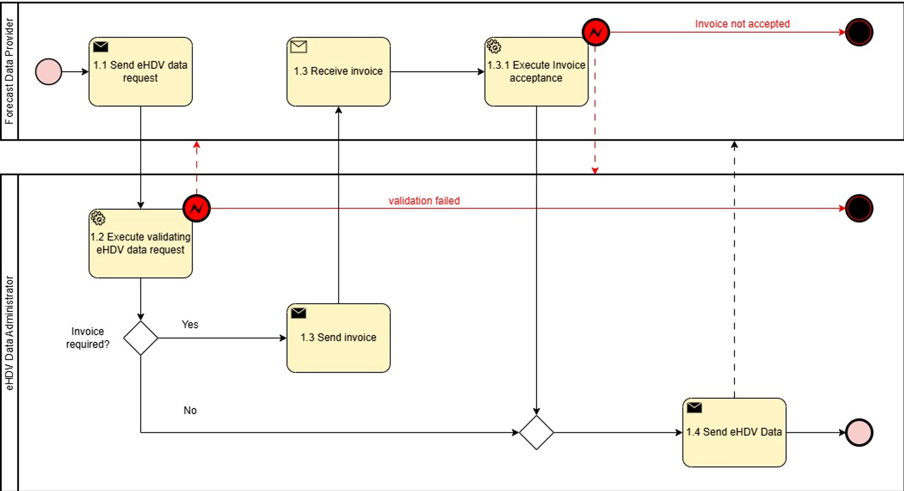
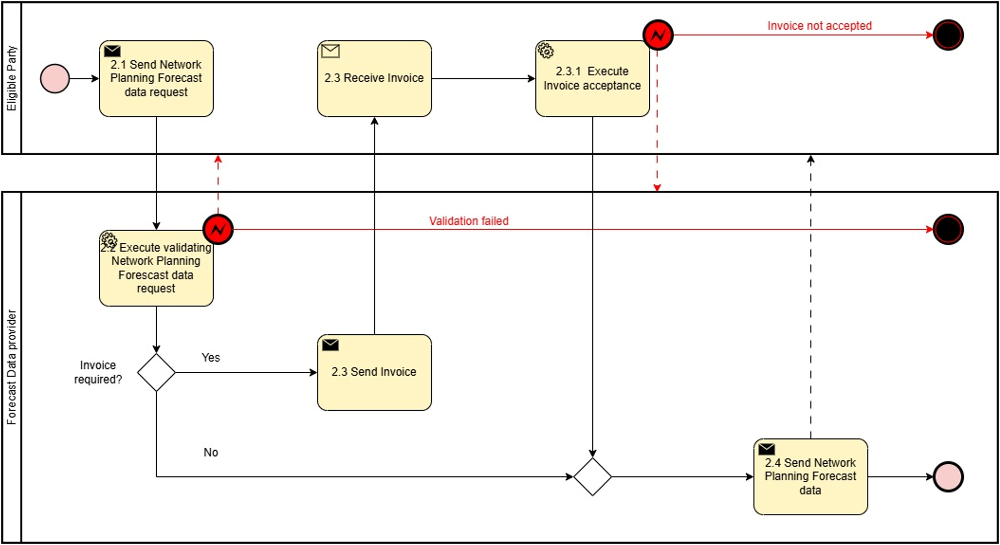

# Task 4.5 – Electromobility: Network Planning Forecast
 

## Context/ Whereas

(1)     The present document focuses on information exchange between Connecting System Operator (CSO) and electric Heavy-Duty Vehicle (eHDV) for the purpose of improving long-term grid hosting capacity forecasts and improving access for the eHDV sector to CSO's grid hosting capacity forecasts.

(2)     In the context of the present document, a network planning forecast considers a time horizon of 0-10 years.

(3)     The reference model describes two processes. The first process is concerns accessing eHDV data, whilst the second process concerns accessing a network planning forecast based on the eHDV data.

(4)     The ambition of the present reference model is to ensure network planning forecasts are as generic as possible and easily extend to information exchange between CSO and other stakeholders.

(5)     Presently, CSOs do not have any access to representative and standardised network planning forecast requirements from future eHDV fleets.

(6)     Information on future power needs of eHDV fleets is required by CSOs primarily for facilitating better plans for future grid expansion and for the development of new business models. Nonetheless, the former is can also be considered for improving grid hosting capacity information provided to investors. The power demand from eHDVs has a significant impact on CSOs and should be included in CSO network planning efforts and in the future mandatory 10-year Network Development Plans (Draft TYNDP from ENTSO-E to ACER May 2025).

(7)     The eHDV regulation framework includes the CO2 regulation (EU 2019/1242) to reduce tailpipe CO2 with 45% to 2030 vs. 2019. Since the regulation addresses limiting tailpipe emissions, zero-emission vehicles (ZEVs) are the only viable alternative for complying with the regulation. Approximately one third of new vehicle registrations 2030 must be zero-emission. The majority (~90%) will be Battery Electric Vehicles ["The technological and market readiness of heavy-duty road transport vehicles" DG Move May 27, 2025].

(8)     It is essential for the fulfilment of the CO2 regulation that SOs can prepare the grid in time to enable connection of ~40.000 fast chargers and ~400.000 slow chargers in Europe to support a fleet of 400.000 ZEVs. As of Q2 2025, there is an estimated ~1000-1100 eHDV accessible fast chargers (>350kW) in Europe [Source: EY and Milence].

(9)     Regulation (EU) 2023/18042 on the deployment of alternative fuels infrastructure (AFIR) is under implementation in member states to support the roll-out of zero-emission vehicles. The same regulation imposes demands on charging hubs of 7.2 MW every 60 km along the TEN-T core network and 3.0 MW along the TEN-T comprehensive network.

(10)    AFIR sets minimum requirements. However, considerably more fast charging and private or private shared charging in depots is required to support the fleet size derived from the CO2 regulation.

(11)    Each member state is responsible for providing AFIR compliance plans to the commission.

(12)    Electricity grid project developers require grid hosting capacity information from CSOs in order to make future energy infrastructure investments.

(13)    CSOs need information on customers' and other relevant stakeholders' future needs for grid hosting capacity for network development plans, assessing future flexibility needs and reliable grid hosting capacity planning forecasts.

(14)    Forecasts for future charging capacity needs of eHDVs can be based on (i) historic driving patterns of HDVs and (II) energy consumption and charging data from existing eHDVs. Currently, there is a limited number of eHDVs circulating but, with new data continuously collected, more accurate forecasts are likely. For CSOs, the requirement are the future charging capacity needs for the various grid locations (in MW).

(15)    To respect privacy and ensure competitiveness, forecasts from eHDVs charging capacity needs are currently made for geographical areas that do not necessarily align with the ones defined by grid structure. Finding ways to bridge this misalignment is essential.

(16)    Forecasts for eHDVs' future charging capacity needs are to be restricted to parties with access rights.

(17)    The energy sector is undergoing rapid transformation, driven by decarbonization, decentralization, digitalisation and electrification. Network planning forecasts are essential to anticipate future energy demand, generation capacity and infrastructure needs. Such forecasts enable proactive investment and policy planning, efficient grid use and the avoidance of stranded assets.

(18)    Stakeholders, including transmission and distribution system operators, regulators, and market participants—require a harmonized approach to forecasting for aligning national and regional strategies. This document addresses a common framework for the development, validation and use of network planning forecasts that encourages the consistent and transparent application of long-term forecasting practices in support of a resilient and sustainable energy system.

## Definitions

**CHAPTER I – Regarding GENERAL PROVISIONS**

*Issue 1* – On subject matter and scope

*Issue 2* – On definitions

For the purpose of this document, the following definitions shall apply:

* 'eHDV', in the context of this document, means electric Heavy-Duty Vehicle
* 'eHDV data', in the context of this document, means data related to and from electric Heavy-Duty Vehicles
* 'eHDV long-term power forecast', in the context of this document, means a forecast about electric Heavy-Duty Vehicles future need for charging capacity (current forecasts are often derived from information for a mix of current diesel and electrical vehicles)

## Responsibilities of Market Roles

**CHAPTER II – Regarding [YOUR USE CASE]**

**[NOTE]** Typically define responsibilities last and in close coordination with *T5.5 EU Policy and regulation alignment*

*Article XX*

### Responsibilities of ROLE1

* ROLE1 shall …

## Annex

**ANNEX A**

**A1. The reference model for [YOUR USE CASE]**

Table I contains information needed by [Stakeholder1 AND Stakeholder2] to set up for utilising [YOUR USE CASE] in a Member State. Do we need Table 1?

### General Information

***Table I - General information on Member State environments***

| ID  | Name | Description |
|-----|------|-------------|
|     |      |             |

### Relevant Roles

Please describe all **HARMONISED ROLES** below.

***Table II - Roles***

| Role name                    | Role type | Role description                                                                                                                                                                              |
|------------------------------|-----------|-----------------------------------------------------------------------------------------------------------------------------------------------------------------------------------------------|
| Eligible Party               | All       | An 'eligible party' is an entity offering energy-related services to Final Customers. Examples include transmission and distribution system operators, delegated operators and other third parties, aggregators, energy service companies, renewable energy communities, citizen energy communities and balancing service providers, authorities and others. |
| eHDV Data Administrator      | Business  | A party responsible for eHDV data and distributing these data to eHDV Forecast producers or other relevant parties.                                                                           |
| Power Forecast Data Provider | Business  | A party responsible for providing power forecast data.                                                                                                                                        |

### Procedures

**PROCEDURES**

All roles are expected to be accessing information in secure, authenticated manner and through trusted communication channels. For this reason, the authentication steps used for these communication partners are not listed in the scenarios below.

An overview of the main procedures for the use case is presented in Table III. Further details are included in Tables IV.1 – IV.2.

***Table III - Procedure Conditions***

| No. | Procedure name                                                              | Primary actor                | Pre-condition                                                                                   |
|-----|-----------------------------------------------------------------------------|------------------------------|-------------------------------------------------------------------------------------------------|
| 1   | Access to eHDV data (Category: Dataset & Scenario Creation)                 | eHDV data administrator      | The eligible party has permission to access the requested data. User consent or regulation.    |
| 2   | Access to network planning forecast data (Category: Result Submission & Delivery) | Power forecast data provider | The eligible party has permission to access the requested data. User consent or regulation.    |

All diagrams describing the procedures are of an illustrative nature. Information objects referred to in columns Information exchanged (IDs) are defined in Table V. Table IV.1 and IV.2 explain the procedures from Table III in further detail, step by step, together with the information exchanged.

#### Procedure 1 - Access to eHDV data

***Table IV.1 – Procedure steps to access eHDV data***

| Step No. | Step                                 | Step description                                                                                                                   | Information producer (actor) | Information receiver (actor)  | Information exchanged (IDs)        |
|----------|--------------------------------------|------------------------------------------------------------------------------------------------------------------------------------|------------------------------|-------------------------------|------------------------------------|
| 1.1      | Send eHDV data request               | Process Step for eHDV data transfer. Forecast producer specifies the requests for eHDV data.                                       | Power Forecast data provider | eHDV Data Administrator       | (A) eHDV data request              |
| 1.2      | Execute validating eHDV data request | Validate request from Forecast data provider. In case of an invalid request, a meaningful indication is provided.                  | eHDV Data Administrator      |                               |                                    |
| 1.3      | Send Invoice                         | [Optional] If billing is required, the eHDV Data Administrator provides an invoice. Otherwise, continue with Step 1.4              | eHDV Data Administrator      | Power Forecast data provider  | (B) eHDV Data Invoice              |
| 1.3.1    | Execute Invoice acceptance           | Step for acceptance of the invoice. In case of rejection of the invoice, a meaningful indication is provided.                      | Power forecast data provider | eHDV Data Administrator       | (C) eHDV Data Invoice acceptance   |
| 1.4      | Send eHDV data                       | Process Step to send eHDV data. Forecast producer receives the requested data under NDA.                                           | eHDV Data Administrator      | Power forecast data provider  | (D) eHDV data                      |

 

Figure 1. Diagram corresponding to the procedure in Table IV.1

#### Procedure 2 - Access to network planning forecast data

***Table IV.2 – Procedure steps to access network planning forecast data (\*)***

| Step No. | Step                                                 | Step description                                                                                                            | Information producer (actor) | Information receiver (actor) | Information exchanged (IDs)                       |
|----------|------------------------------------------------------|-----------------------------------------------------------------------------------------------------------------------------|------------------------------|------------------------------|---------------------------------------------------|
| 2.1      | Send Network Planning Forecast data request          | Process steps for network planning forecast data request. The eligible party requests forecast data for specific areas /mRID object | Eligible party               | Power forecast data provider | (E) Network planning forecast data request        |
| 2.2      | Execute validating Network planning forecast data request | Validate request from eligible party. In case of an invalid request, a meaningful indication is provided.                  | Power forecast data provider |                              |                                                   |
| 2.3      | Send invoice                                         | [Optional] If billing is required, the Forecast data provider provides an invoice. Otherwise, continue with Step 2.4        | Power forecast data provider | Eligible party               | (F) Network planning forecast data invoice        |
| 2.3.1    | Execute Invoice acceptance                           | Step for acceptance of the invoice. In case of rejection of the invoice, a meaningful indication is provided.               | Eligible party               | Forecast data provider       | (G) Network planning forecast data invoice acceptance |
| 2.4      | Send Network planning forecast data                  | Process Step to send network planning forecast data. Eligible party receives the requested data under NDA.                  | Power forecast data provider | Eligible party               | (H) Network planning forecast data                |

(\*) The procedure can be made more specific by making explicit reference to the eHDV power forecast data.

Figure 2. Diagram corresponding to the procedure in Table IV.2

### Data Exchanged

**INFORMATION OBJECTS**

*Table V*

| Information exchanged, ID                                                                | Name of information                                                                                                   | Attribute                                 | Description of information exchanged                                                                                                                                                         |
|------------------------------------------------------------------------------------------|-----------------------------------------------------------------------------------------------------------------------|-------------------------------------------|----------------------------------------------------------------------------------------------------------------------------------------------------------------------------------------------|
| (A) eHDV data request                                                                    | The request comprises of a set of information objects (A1)-(A6)                                                       |                                           |                                                                                                                                                                                              |
| (A1) Location (one or more fields must be provided for identification of the resource)   | Location (all fields are optional; not all fields may be left empty; information ensures unique identification)       | Position point                            | The position point of the asset as a single location as coordinates. E.g. specific CPO location.                                                                                            |
|                                                                                          |                                                                                                                       | Grid Hosting Capacity Service Area        | The name of the grid hosting capacity service area (full text name or an abbreviation), could for example be a license area                                                                 |
|                                                                                          |                                                                                                                       | Connection Point                          | Identification of customer connection                                                                                                                                                        |
|                                                                                          |                                                                                                                       | Polygon                                   | A polygonal area defined by a set of coordinates                                                                                                                                             |
|                                                                                          |                                                                                                                       | Municipality                              | Municipality                                                                                                                                                                                 |
|                                                                                          |                                                                                                                       | Region                                    | Region                                                                                                                                                                                       |
|                                                                                          |                                                                                                                       | Country                                   | Country                                                                                                                                                                                      |
|                                                                                          |                                                                                                                       | Postal Code                               | Postal Code                                                                                                                                                                                  |
|                                                                                          |                                                                                                                       | Other relevant information                | Field for further locational information (for example Master Resource ID of final customer or address of final customer)                                                                    |
| (A2) eHDV data request – time window                                                     | eHDV data request – time window                                                                                       | Time interval                             | Time interval for the data request TimeIntervalStart, TimeIntervalEnd.                                                                                                                       |
| (A3) Battery capacity                                                                    | eHDV battery capacity restriction (optional)                                                                          | Power capacity range                      | Restrict data to events when vehicle battery power capacity falls in interval: BatteryCapacityLowerBound, BatteryCapacityUpperBound                                                          |
| (A4) Gross Weight                                                                        | eHDV Vehicle Gross Weight restriction (optional)                                                                      | Gross Weight range                        | Restrict data to events when vehicle max allowed tonnage falls in interval: MaxTonnageLowerBound, MaxTonnageUpperBound                                                                       |
| (A5) Charger Type                                                                        | Charger Type (optional)                                                                                               | Charger Type                              | Restrict data to events when charger type is one of: FastCharger, SlowCharger and All. Defaults to All.                                                                                     |
| (A6) Charging Operator                                                                   | Charging Operator (optional)                                                                                          | Charging Operator                         | Restrict data to events when charger operator is one of: Residential, Private or Depot, Private Shared, Public and All. Defaults to All.                                                    |
| (B) eHDV Data Invoice                                                                    | eHDV Data Invoice                                                                                                     | Timestamp                                 | Timestamp when data request was processed. Datetime object according to ISO8601                                                                                                              |
|                                                                                          |                                                                                                                       | Invoice Specifications                    | A standard invoice generated in line with the supplier's specifications                                                                                                                      |
| (C) eHDV Data Invoice acceptance                                                         | eHDV Data Invoice acceptance                                                                                          | Timestamp                                 | Timestamp when Invoice was processed. Datetime object according to ISO8601                                                                                                                   |
|                                                                                          |                                                                                                                       | Acceptance acknowledgement                | A standard invoice acceptance acknowledgement generated in line with the customer's specifications                                                                                           |
| (D) eHDV data                                                                            | A set of one of more charging events described by (D1) - (D12) as below                                               |                                           |                                                                                                                                                                                              |
| (D1) Time of event                                                                       | Charging interval – time window                                                                                       | Time interval                             | Time interval for the charging event: ChargingStart, ChargingEnd.                                                                                                                            |
| (D2) Charged Energy                                                                      | Total chargedEnergy                                                                                                   | kWh                                       | Total energy charged in kWh.                                                                                                                                                                 |
| (D3) Charged Status %                                                                    | ChargedStatus% (optional)                                                                                             | % interval                                | Battery status before and after charging event as % of battery capacity startCharge%, endCharge%                                                                                             |
| (D4) Charged Status                                                                      | ChargedStatus (optional)                                                                                              | KWh interval                              | Battery status before and after charging event in kWh startChargeStatus, endChargeStatus                                                                                                     |
| (D5) Peak power                                                                          | Peak power (optional)                                                                                                 | kW                                        | Peak (max) power during charging event.                                                                                                                                                      |
| (D6) Trough power                                                                        | Trough power (optional)                                                                                               | kW                                        | Trough (min) power during charging event.                                                                                                                                                    |
| (D7) Average power                                                                       | AveragePower (kW)                                                                                                     | kW                                        | Average power during charging event.                                                                                                                                                         |
| (D8) Battery specification                                                               | Battery specification (optional)                                                                                      | Description                               | Further information on the vehicle's battery specification.                                                                                                                                  |
| (D9) Vehicle Gross weight                                                                | Gross weight (optional)                                                                                               | kg                                        | The vehicle's gross weight specification.                                                                                                                                                    |
| (D10) Charger Type                                                                       | Charger Type (optional)                                                                                               | Charger Type                              | Charger type information: One of: FastCharger, SlowCharger and All. Defaults to All.                                                                                                        |
| (D11) Charging Operator                                                                  | Charging Operator (optional)                                                                                          | Charging Operator                         | Charger operator information: One of: Residential, Private or Depot, Private Shared, Public and All. Defaults to All.                                                                      |
| (D12) Further Information                                                                | Further Information (optional)                                                                                        | Completing information                    | Further information regarding the charging event. E.g. temperature at start of charging event, plated power. Can include more detailed location information or charging point information. |
| (E) Network planning forecast data request                                               | The request comprises of a set of information objects (E1)-(E6) as below                                              |                                           |                                                                                                                                                                                              |
| (E1) Location                                                                            | Location (all fields are optional; not all fields may be left empty; information ensures unique identification)       | mrID                                      | Catchment area defined by the Master Resource ID of the station.                                                                                                                             |
|                                                                                          |                                                                                                                       | Station Name                              | Catchment area defined by the station.                                                                                                                                                       |
|                                                                                          |                                                                                                                       | License Area                              | Catchment area defined by the license area (full text name or an abbreviation used in the license).                                                                                          |
|                                                                                          |                                                                                                                       | Polygonal Area                            | A polygonal area defined by a set of vertices, each of which is provided by longitude and latitude.                                                                                          |
|                                                                                          |                                                                                                                       | Municipality                              | Municipality                                                                                                                                                                                 |
|                                                                                          |                                                                                                                       | Region                                    | Region                                                                                                                                                                                       |
|                                                                                          |                                                                                                                       | Country                                   | Country                                                                                                                                                                                      |
|                                                                                          |                                                                                                                       | Post Code                                 | Post Code                                                                                                                                                                                    |
| (E2) Periodicity                                                                         | Periodicity                                                                                                           | Periodicity for the forecast delivery     | Specification of the periodicity for the forecast. One of: 15-minutely, hourly, daily, monthly,                                                                                              |
| (E3) Data Aggregation                                                                    | Data Aggregation                                                                                                      | Aggregation                               | Information on whether the data is to be provided as a continuous time series or is to be aggregated as to represent typical days, typical weekend days, typical weekdays, or typical weeks per month or per season. TBD |
| (E4) Forecast Object                                                                     | Forecast Object                                                                                                       | Forecasted quantity                       | Definition of the forecast object. One of: peak power, trough power or total demand.                                                                                                         |
| (E5) Time Interval                                                                       | Time Interval                                                                                                         | Time interval                             | Time Interval for the forecast aligning with the chosen periodicity startForecastDateTime, endForecastDateTime                                                                               |
| (E6) Confidence level                                                                    | Confidence level (optional)                                                                                           | Coverage level                            | Requested confidence level for the forecast. Used for confidence bands.                                                                                                                      |
| (E7) Type of charger                                                                     | Type of charger (optinal)                                                                                             | Type of charger                           | Defines the type of charger. One of: fastChargingOnly, slowChargingOnly or All. Defaults to All.                                                                                             |
| (F) Network planning forecast data Invoice                                               | Network planning forecast data Invoice                                                                                | Timestamp                                 | Timestamp when data request was processed. Datetime object according to ISO8601.                                                                                                             |
|                                                                                          |                                                                                                                       | Invoice Specifications                    | A standard invoice generated in line with the supplier's specifications.                                                                                                                     |
| (G) Network planning forecast data Invoice acceptance                                    | Network planning forecast data Invoice acceptance                                                                     | Timestamp                                 | Timestamp when Invoice was processed.                                                                                                                                                        |
|                                                                                          |                                                                                                                       | Acceptance acknowledgement                | A standard invoice acceptance acknowledgement generated in line with the customer's specifications.                                                                                          |
| (H) Network planning forecast data                                                       | The forecast comprises of a set of information objects (H1)-(H6)                                                      |                                           |                                                                                                                                                                                              |
| (H1) Power forecast                                                                      | Power forecast                                                                                                        | TimeSeries                                | A time series with the adequate periodicity specified in E2 for the forecast object defined in E3.                                                                                           |
| (H2) Confidence Lower Bound                                                              | Confidence Lower Bound (optional)                                                                                     | TimeSeries                                | A time series with the adequate periodicity specified in E2 with the estimated lower bound for the forecast.                                                                                 |
| (H3) Confidence Upper Bound                                                              | Confidence Upper Bound (optional)                                                                                     | TimeSeries                                | A time series with the adequate periodicity specified in E2 with the estimated upper bound for the forecast.                                                                                 |
| (H4) Other uncertainty information                                                       | Other uncertainty information (optional)                                                                              | Uncertainty description                   | Further information regarding the forecast's uncertainty.                                                                                                                                    |
| (H5) Methodology information                                                             | Methodology information (Optional)                                                                                    | Methodology description                   | Methodological information regarding the methodology used in producing the forecast.                                                                                                         |
| (H6) Other information                                                                   | Other information (Optional)                                                                                          | Completing information                    | Further information, e.g. disclaimer information.                                                                                                                                            |
