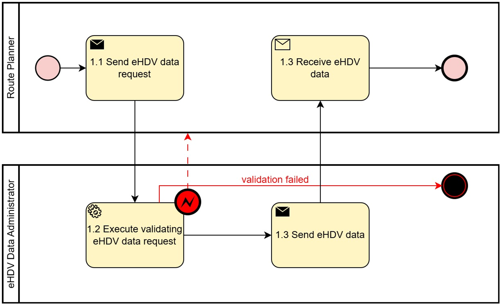
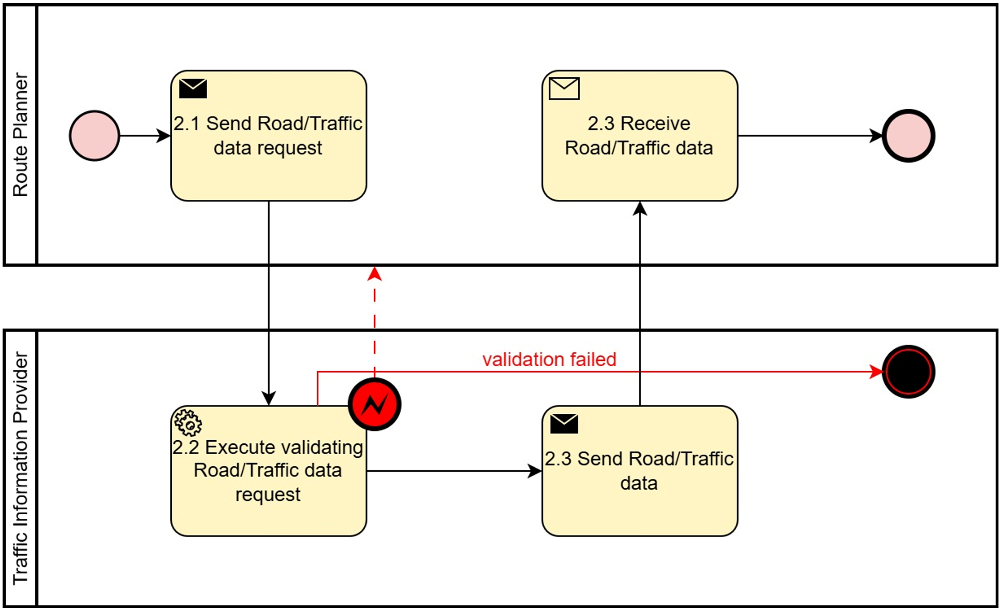
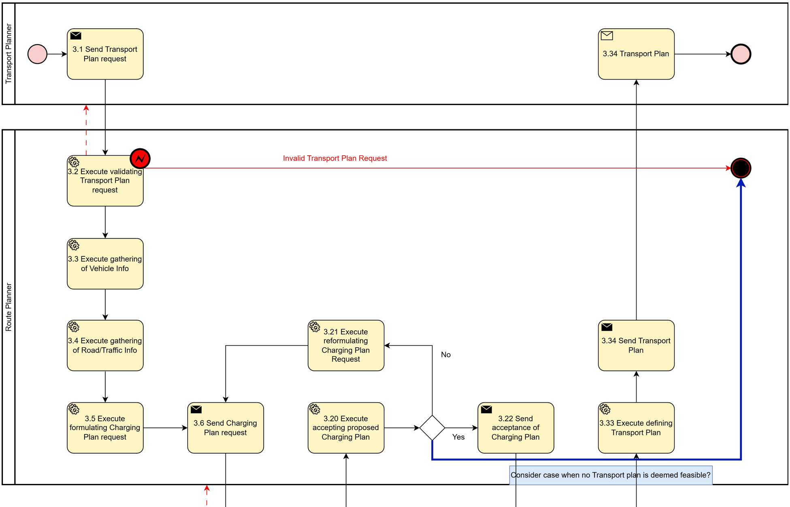
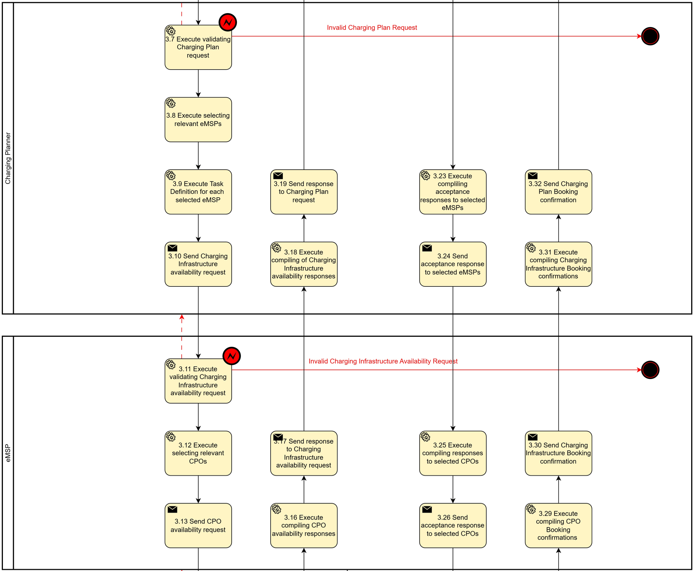
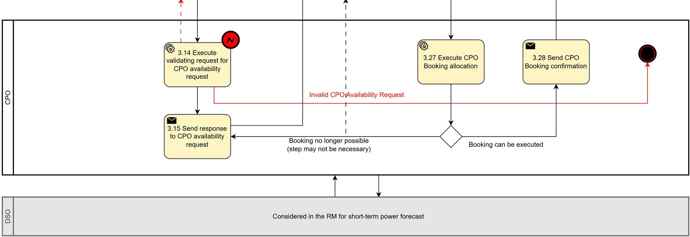

# Task 4.5 – Electromobility: Electric Heavy-Duty Vehicle power short-term forecast

## Context/ Whereas

(1)     The energy sector is undergoing a rapid transformation driven by decarbonization, decentralization, and digitalization. The expected rapid increased power needs of eHDV fleets makes it necessary for the system operator to include them in the grid operational planning with a short horizon from a few weeks to hours or even minutes.

(2)     The eHDV regulation framework includes the CO2 regulation (EU 2019/1242) to reduce tailpipe CO2 with 45% to 2030 vs. 2019. Since the regulation addresses limiting tailpipe emissions, zero-emission vehicles (ZEVs) are the only valid alternative for complying with the regulation. Approximately one third of new vehicle registrations 2030 need to be zero-emission, with the amount rising to 60% in 2035. The majority, around 90%, will be Battery Electric Vehicles ("The technological and market readiness of heavy-duty road transport vehicles" DG Move May 27, 2025).

(3)     Deployment of eHDVs puts much higher demands on predictability of charging power than passenger cars. Freight transport is a B2B-activity and the shippers (goods owners) have very tight requirements regarding pick-up time and delivery time of goods. Freight transport is tightly connected to other planned activities in society like just-in-time deliveries to factories or delivery slots of 15 min for grocery supplies to a logistic hub. This makes it essential for the Logistic Service Providers and Transport Companies to be able to make an efficient route planning including an optimized charge planning. The charge plan should have a minimum of negative impact on productivity and it should be robust in a sense that the actual charging time should have a minimum of deviation vs. the in advance planned charging time for a certain amount of energy.

(4)     There could be different reasons for deviations in delivered power compared to the peak power, e.g. flexible connection agreements between the CPO and DSO, load balancing by the DSO or the CPO, or limitations in the eHDV. The charge hub could also have a time-based power contract, meaning that the available power will differ depending on time of day, weekday, season or similar.

(5)     The reasons above create a need to exchange information between the energy sector and the freight sector about needed power and available power.

## Definitions

**CHAPTER I – GENERAL PROVISIONS**

*Issue 1* – On subject matter and scope

* [IGNORE FOR NOW]

*Issue 2* – On definitions

For the purpose of this document, the following definitions shall apply:

* 'eHDV', in the context of this document means electric Heavy-Duty Vehicle
* 'eHDV data', in the context of this document means data relating to electric Heavy-Duty Vehicles
* 'Road/Traffic Data', in the context of this document means static or dynamic data relating to Road and/or Traffic information
* 'Transport plan', in the context of this document means the set of information required to perform a logistics task (mission), using a specific vehicle and at a specific point in time
* 'Charging plan', in the context of this document means the set of information related to the charging schedule for a specific eHDV perform a logistics task at a specific point in time

**CHAPTER II – Regarding [YOUR USE CASE]**

**[NOTE]** Typically define responsibilities last and in close coordination with *T5.5 EU Policy and regulation alignment*

*Article XX*

### Responsibilities of ROLE1

* ROLE1 shall …

## Annex

**ANNEX A**

**A1. The reference model for [YOUR USE CASE]**

Table I contains information needed by [Stakeholder1 AND Stakeholder2] to set up for utilising [YOUR USE CASE] in a Member State.

### General Information

***Table I - General information on Member State environments***

| ID  | Name | Description |
|-----|------|-------------|
|     |      |             |

### Relevant Roles

**[TODO]** Please describe all **HARMONISED ROLES** below.

***Table II - Roles***

| Role name                          | Role type | Role description                                                                                                                                                                                                                                                                   |
|------------------------------------|-----------|------------------------------------------------------------------------------------------------------------------------------------------------------------------------------------------------------------------------------------------------------------------------------------|
| eHDV Data Administrator            | Business  | A party responsible for eHDV data and distributing these data to eligible parties.                                                                                                                                                                                                 |
| Traffic Information Provider       | Business  | Provides access to static and/or live Road and Traffic information.                                                                                                                                                                                                                |
| Transport Planner                  | Business  | Plans transport missions for a fleet of trucks (logistics, timetables, loads). In this context, narrowed to planning for the journey of a single truck.                                                                                                                            |
| Route Planner                      | Business  | Plans the road journey for the journey of a single truck from A to B. Chooses route alternatives based on traffic and road data.                                                                                                                                                   |
| Charging planner                   | Business  | Determines where and when to charge along the route and decides the SoC target at each stop. Chooses location for charging events based on multiple parameters including available power, price of charging, driving/resting regulation of driver and historical performance of CPOs. |
| E-Mobility Service Provider (eMSP) | Business  | Handles booking, authentication, and payment. Aggregates charging station information for route/charging planners. This is a dual role.                                                                                                                                            |
| Charge Point Operator (CPO)        | Business  | Owns and operates the charging stations.                                                                                                                                                                                                                                           |
| Distribution System Operator (DSO) | Business  | Grid operator and is responsible for the grid connection to the CPO.                                                                                                                                                                                                               |

All roles are expected to be accessing information in secure, authenticated manner and through trusted communication channels. For this reason, the authentication steps used for these communication partners are not listed in the scenarios below.

### Procedures

**PROCEDURES**

All roles are expected to be accessing information in secure, authenticated manner and through trusted communication channels. For this reason, the authentication steps used for these communication partners are not listed in the scenarios below.

An overview of the main procedures for the use case is presented in Table III. More detail will be included in Tables IV.1 – IV. 3.

***Table III - Procedure Conditions***

| No. | Procedure name                                              | Primary actor                | Pre-condition                                                                                                                                           |
|-----|-------------------------------------------------------------|------------------------------|---------------------------------------------------------------------------------------------------------------------------------------------------------|
| 1   | Access Vehicle data (Category: Dataset & Scenario Creation) | eHDV Data Administrator      | Can be either the data owner or an entitled party acting on behalf of the data owner, with permission to access the requested data. User consent or regulation. |
| 2   | Access Map/Road/Traffic data (Category: Dataset & Scenario Creation) | Traffic Information Provider | The entitled party has permission to access the requested data. User consent or regulation.                                                             |
| 3   | Determine Transport Plan (Category: Optimisation)           | Transport planner            | None                                                                                                                                                    |

All diagrams describing the procedures are of an illustrative nature. Information objects referred to in columns Information exchanged (IDs) are defined in Table V (work in progress). Table IV.1, IV.2 and IV.3 explain the procedures from Table III in further detail, step by step, together with the information exchanged.

#### Procedure 1 - Access Vehicle data

***Table IV.1 – Procedure Access Vehicle data***

| Step No. | Step                                  | Step description                                                                                                  | Information producer (actor) | Information receiver (actor) | Information exchanged (IDs) |
|----------|---------------------------------------|-------------------------------------------------------------------------------------------------------------------|------------------------------|------------------------------|-----------------------------|
| 1.1      | Send eHDV data request                | Request eHDV data (static, dynamic or both)                                                                       | Route Planner                | eHDV Data Administrator      | (A) eHDV data request       |
| 1.2      | Execute validating eHDV data request. | eHDV Data Administrator validates request. In case of an invalid request, a meaningful indication is provided.    | eHDV Data Administrator      |                              |                             |
| 1.3      | Send eHDV data                        | Process Step for sending eHDV data.                                                                               | eHDV Data Administrator      | Route planner                | (B) eHDV data               |

Figure 1. Diagram corresponding to the procedure in Table IV.1.
#### Procedure 2 - Access Road/Traffic data

***Table IV.2 – Procedure Access Road/Traffic data***

| Step No. | Step                                         | Step description                                                                                                  | Information producer (actor) | Information receiver (actor) | Information exchanged (IDs)  |
|----------|----------------------------------------------|-------------------------------------------------------------------------------------------------------------------|------------------------------|------------------------------|------------------------------|
| 2.1      | Send Road/Traffic data request               | Request Road/Traffic data                                                                                         | Route Planner                | Traffic Information Provider | (C) Road/Traffic data request |
| 2.2      | Execute validating Road/Traffic data request | Transport Planner validates request. In case of an invalid request, a meaningful indication is provided.          | Traffic Information Provider |                              |                              |
| 2.3      | Send Road/Traffic data                       | Process Step for sending Road/Traffic data                                                                        | Traffic Information Provider | Route planner                | (D) Road/Traffic data        |

Figure 2. Diagram corresponding to the procedure in Table IV.2.

#### Procedure 3 - Determine Transport Plan

***Table IV.3 – Procedure Determine Transport Plan***

| Step No. | Step                                                                              | Step description                                                                                                                                                 | Information producer (actor) | Information receiver (actor) | Information exchanged (IDs)                      |
|----------|-----------------------------------------------------------------------------------|------------------------------------------------------------------------------------------------------------------------------------------------------------------|------------------------------|------------------------------|--------------------------------------------------|
| 3.1      | Send Transport Plan request                                                       | Transport Planner request a Transport Plan for a specific mission                                                                                                | Transport Planner            | Route Planner                | (F) Transport Plan Request                       |
| 3.2      | Execute validating Transport Plan request                                         | Route Planner validates request. In case of an invalid request, a meaningful indication is provided.                                                             | Route Planner                |                              |                                                  |
| 3.3      | Execute gathering of vehicle information                                          | Procedure as in Table IV.1                                                                                                                                       | Route Planner                |                              | (B) eHDV Data                                    |
| 3.4      | Execute gathering of road/traffic information                                     | Procedure as in Table IV.2                                                                                                                                       | Route Planner                |                              | (D) Road/Traffic Data                            |
| 3.5      | Execute formulating Charging Plan request                                         | Given the Transport Plan details and other information formulate the Charging Plan request                                                                       | Route Planner                |                              |                                                  |
| 3.6      | Send Charging Plan request                                                        | Request Charging Plan for the mission                                                                                                                            | Route Planner                | Charging Planner             | (H) Charging Plan Request                        |
| 3.7      | Execute validating Charging Plan request                                          | Charging Planner validates request. In case of an invalid request, a meaningful indication is provided.                                                          | Charging Planner             |                              |                                                  |
| 3.8      | Execute selecting relevant eMSPs                                                  | From the set of potential eMSPs select the subset of appropriate for the mission.                                                                                | Charging Planner             |                              |                                                  |
| 3.9      | Execute defining task for each selected eMSP                                      | Formulate the request details for each eMSP                                                                                                                      | Charging Planner             |                              |                                                  |
| 3.10     | Send Charging Infrastructure availability request                                 | Request Charging Infrastructure availability in the eMSP's infrastructure                                                                                        | Charging Planner             | eMSP                         | (J) Charging Infrastructure availability request |
| 3.11     | Execute validating Charging Infrastructure availability request                   | eMSP validates request. In case of an invalid request, a meaningful indication is provided.                                                                      | eMSP                         |                              |                                                  |
| 3.12     | Execute selecting relevant CPOs                                                   | Request information about availability in CPO's infrastructure                                                                                                   | eMSP                         |                              |                                                  |
| 3.13     | Send CPO availability request                                                     | Request information about availability in CPO's infrastructure                                                                                                   | eMSP                         | CPO                          | (L) CPO availability request                     |
| 3.14     | Execute validating CPO availability request                                       | CPO validates request. In case of an invalid request, a meaningful indication is provided.                                                                       | CPO                          |                              |                                                  |
|          | CPO-DSO comms                                                                     | Considered in the RM for short-term power forecast                                                                                                               |                              | TBD                          | TBD                                              |
| 3.15     | Send response to CPO availability request                                         | CPO responds to request for availability.                                                                                                                        | CPO                          | eMSP                         | (N) Charge Slot Response                         |
| 3.16     | Execute compiling CPO availability responses                                      | eMSP gathers and processes the responses from the different CPOs                                                                                                 | eMSP                         |                              |                                                  |
| 3.17     | Send response to Charging Infrastructure availability request                     | eMSP responds to request for Charging Infrastructure availability                                                                                                | eMSP                         | Charging Planner             | (P) Charging Infrastructure availability Response |
| 3.18     | Execute compiling of Charging Infrastructure availability responses               | Charging Planner gathers and processes the responses from the different eMSPs                                                                                    | Charging Planner             |                              |                                                  |
| 3.19     | Send response to Charging Plan request                                            | Charging Planner responds to request for Charging Plan                                                                                                           | Charging Planner             | Route Planner                | (Q) Charging Plan Response                       |
| 3.20     | Execute accepting proposed Charging Plan                                          | The Route Planner ensure that the Charging Plan is adequate to the mission. If it is not, continue to 3.21, otherwise continue to 3.22.                          | Route Planner                |                              |                                                  |
| 3.21     | Execute reformulating Charging Plan request.                                      | As the current Charging Plan was deemed inadequate, a changed Charging Plan request must be defined and resent. Proceed to step 3.6.                             | Route Planner                | Charging Planner             | (H) Charging Plan Request                        |
| 3.22     | Send acceptance of Charging Plan                                                  | The Charging Plan is accepted for further processing.                                                                                                            | Route Planner                | Charging Planner             | (S) Charging Plan Booking Request                |
| 3.23     | Execute compiling acceptance responses to selected eMSPs                          | Formulate responses to be sent to set of selected eMSPs                                                                                                          | Charging Planner             |                              |                                                  |
| 3.24     | Send acceptance response to selected eMSPs with chosen Charging Infrastructure    | Send tailored responses to selected eMSPs with chosen Charging Infrastructure.                                                                                   | Charging Planner             | eMSP                         | (T) Charging Infrastructure Booking Request      |
| 3.25     | Execute compiling responses to selected CPOs                                      | Determine responses to be send to selected set of CPOs.                                                                                                          | eMSP                         |                              |                                                  |
| 3.26     | Send acceptance response to selected CPOs with chosen CPO booking details         | Send tailored booking requests to selected CPOs.                                                                                                                 | eMSP                         | CPO                          | (W) Charge Slot Booking Request                  |
| 3.27     | Execute CPO Booking allocation                                                    | CPO tries to execute Booking request. If booking fails, send fail notice to eMSP and the process reverts to 3.13 Otherwise, process continues to 3.28            | CPO                          |                              |                                                  |
| 3.28     | Send CPO Booking confirmation                                                     | The booking was successfully completed                                                                                                                           | CPO                          | eMSP                         | (X) Charge Slot Booking Confirmation             |
| 3.29     | Execute compiling CPO Booking confirmations                                       | EMSP compiles list of confirmed bookings from CPOs                                                                                                               | eMSP                         |                              |                                                  |
| 3.30     | Send Charging Infrastructure Booking confirmation                                 | EMSP confirm booking of Charging Infrastructure                                                                                                                  | eMSP                         | Charging Planner             | (AA) Charging Infrastructure Booking Confirmation |
| 3.31     | Execute compiling Charging Infrastructure Booking confirmations                   | Charging Planner compiles list of confirmations from eMSPs                                                                                                       | Charging Planner             |                              |                                                  |
| 3.32     | Send Charging Plan booking confirmation                                           | Charging Planner confirm booking of Charging Plan                                                                                                                | Charging Planner             | Route Planner                | (AB) Charging Plan Booking Confirmation          |
| 3.33     | Execute defining Transport Plan                                                   | Route Planner completely defines Transport Plan based on the Charging plan and possibly other information                                                        | Route Planner                |                              |                                                  |
| 3.34     | Send Transport Plan                                                               | Route Planner responds to Transport Plan request in 3.1                                                                                                          | Route Planner                | Transport Planner            | (AC) Transport Plan                              |

Figure 3. Diagram corresponding to the procedure in Table IV.3. The components represented in blue are currently under consideration. 

 

### Data Exchanged

**INFORMATION OBJECTS**

The technical specification of information objects is under development. Table V introduces solely conceptual information.

*Table V*

| Information exchanged, ID                         | Name of information                           | Attribute                                                                                                                                                                         | Description of information exchanged                                                                                         |
|---------------------------------------------------|-----------------------------------------------|-----------------------------------------------------------------------------------------------------------------------------------------------------------------------------------|------------------------------------------------------------------------------------------------------------------------------|
| (A) eHDV data request                             | eHDV data request                             | Timestamp                                                                                                                                                                         | Timestamp when the data package has been generated                                                                           |
|                                                   |                                               | Vehicle Identifier                                                                                                                                                                | Unique Vehicle identifier                                                                                                    |
| (B) eHDV Data                                     | eHDV Static Data                              | Vehicle Identifier                                                                                                                                                                | Unique Vehicle identifier                                                                                                    |
|                                                   |                                               | Usable battery capacity                                                                                                                                                           | [kWh]                                                                                                                        |
|                                                   |                                               | Maximum charging capacity                                                                                                                                                         | [kW]                                                                                                                         |
|                                                   |                                               | Maximum Gross Weight                                                                                                                                                              | Kg                                                                                                                           |
|                                                   | eHDV Dynamic Data                             | Timestamp                                                                                                                                                                         | Timestamp when the data extract has been generated                                                                           |
|                                                   |                                               | Driver Identifier                                                                                                                                                                 | Unique Driver identifier                                                                                                     |
|                                                   |                                               | Driving Time Information                                                                                                                                                          | Driving time Restrictions                                                                                                    |
|                                                   |                                               | Vehicle Gross Weight                                                                                                                                                              | kg                                                                                                                           |
|                                                   |                                               | Vehicle Height                                                                                                                                                                    | Meters                                                                                                                       |
|                                                   |                                               | Vehicle Width                                                                                                                                                                     | Meters                                                                                                                       |
|                                                   |                                               | Vehicle Length                                                                                                                                                                    | Meters                                                                                                                       |
|                                                   |                                               | State of Charge                                                                                                                                                                   | [% or kWh]                                                                                                                   |
|                                                   |                                               | Odometer                                                                                                                                                                          | km                                                                                                                           |
|                                                   |                                               | Average energy consumption                                                                                                                                                        | [kWh/km]                                                                                                                     |
|                                                   |                                               | Trailer connected                                                                                                                                                                 | Y/N                                                                                                                          |
| (C) Road/Traffic data request                     | Road/Traffic data request                     | Specific to service provider. TBD Likely to include: Road segments (geometry, identifiers)  Traffic flow (speed, congestion)  Incidents (accidents, closures, construction, etc.)  Timestamps and confidence levels | Specific to service provider. TBD                                                                                            |
| (D) Road/Traffic data                             | Road/Traffic data                             | Specific to service provider. TBD                                                                                                                                                 | Specific to service provider. TBD                                                                                            |
| (E) Restricted Current eHDV Specifications        | Restricted Current eHDV Specifications        | Current Gross Weight                                                                                                                                                              | Kg                                                                                                                           |
|                                                   |                                               | Current Gross Height                                                                                                                                                              | Meters                                                                                                                       |
|                                                   |                                               | Current Gross Length                                                                                                                                                              | Meters                                                                                                                       |
|                                                   |                                               | Current Gross Width                                                                                                                                                               | Meters                                                                                                                       |
|                                                   |                                               | Other Vehicle Information                                                                                                                                                         | Configuration, #Axes                                                                                                         |
|                                                   |                                               | Special Cargo Information                                                                                                                                                         | e.g. chemicals.                                                                                                              |
| (F) Transport Plan Request                        | Transport Plan Request                        | Transport Plan Request ID                                                                                                                                                         | Unique identifier                                                                                                            |
|                                                   |                                               | Fleet ID                                                                                                                                                                          | Unique identifier                                                                                                            |
|                                                   |                                               | Vehicle ID                                                                                                                                                                        | Unique identifier                                                                                                            |
|                                                   |                                               | Driver ID                                                                                                                                                                         | Unique identifier                                                                                                            |
|                                                   |                                               | Start Time                                                                                                                                                                        | DateTime element                                                                                                             |
|                                                   |                                               | Initial Location                                                                                                                                                                  | Coordinates                                                                                                                  |
|                                                   |                                               | Initial State of Charge                                                                                                                                                           | kWh                                                                                                                          |
|                                                   |                                               | Initial (E) Restricted Current eHDV Specifications                                                                                                                                | See element (E)                                                                                                              |
|                                                   |                                               | Additional drive time restrictions                                                                                                                                                | Text instructions                                                                                                            |
|                                                   |                                               | A set of **Transport Segments** (G) that define the operational stops required for the mission.                                                                                   | See element (G)                                                                                                              |
| (G) Transport Segment                             | Transport Segment                             | Transport Segment ID                                                                                                                                                              | Unique identifier                                                                                                            |
|                                                   |                                               | Destination Location                                                                                                                                                              | Coordinates for the operational stop                                                                                         |
|                                                   |                                               | Operational time window                                                                                                                                                           | [Start, End] of the allowed stop time window                                                                                 |
|                                                   |                                               | Vehicle Specs at the end of Stop (E)                                                                                                                                              | Cargo, trailers, dimension may have changed during the stop                                                                  |
|                                                   |                                               | Segment Order Number (optional)                                                                                                                                                   | The route request may specify a specific order for some stops.                                                               |
|                                                   |                                               | Previous Transport Segment ID                                                                                                                                                     | The route request may specify a specific order for some stops.                                                               |
| (H) Charging Plan Request                         | Charging Plan Request                         | Charging Plan Request ID                                                                                                                                                          | Unique identifier                                                                                                            |
|                                                   |                                               | Fleet ID                                                                                                                                                                          | Unique identifier                                                                                                            |
|                                                   |                                               | Usable battery capacity                                                                                                                                                           | kWh                                                                                                                          |
|                                                   |                                               | Maximum charging capacity                                                                                                                                                         | kW                                                                                                                           |
|                                                   |                                               | Initial State of Charge                                                                                                                                                           | kWh or %                                                                                                                     |
|                                                   |                                               | Additional drive time restrictions                                                                                                                                                | Additional drive time restrictions                                                                                           |
|                                                   |                                               | An ordered set of **Journey Segments** (I) that are defined by not having pre-planned stops. Element (E) may change between one journey segment and the next.                     | See element (I)                                                                                                              |
| (I) Journey Segment                               | Journey Segment                               | Journey Segment ID                                                                                                                                                                | Unique identifier                                                                                                            |
|                                                   |                                               | Origin Location                                                                                                                                                                   | Coordinates                                                                                                                  |
|                                                   |                                               | Departure time window                                                                                                                                                             | [Start, End] of the departure time window                                                                                    |
|                                                   |                                               | Vehicle Specs at Departure                                                                                                                                                        | Element (E)                                                                                                                  |
|                                                   |                                               | Destination Location                                                                                                                                                              | Coordinates                                                                                                                  |
|                                                   |                                               | Arrival time window                                                                                                                                                               | [Start, End] of the arrival time window                                                                                      |
| (J) Charging Infrastructure availability request  | Charging Infrastructure availability request  | After determining the adequate areas, timing and energy requirements where charging is likely to be desirable. A set of relevant eMSPs is selected. To each selected eMSP, one or more Charge Event Request (K) are sent. | See element (K)                                                                                                              |
| (K) Charge Event Request                          | Charge Event Request                          | Charge Event Request ID                                                                                                                                                           | Unique identifier                                                                                                            |
|                                                   |                                               | Fleet ID                                                                                                                                                                          | Unique identifier                                                                                                            |
|                                                   |                                               | Location                                                                                                                                                                          | A polygon defining a geographic area where the charging event may take place.                                                |
|                                                   |                                               | Vehicle Specs                                                                                                                                                                     | Element (E)                                                                                                                  |
|                                                   |                                               | Charging time window                                                                                                                                                              | [Start, End] of the charging time window                                                                                     |
|                                                   |                                               | Required energy amount                                                                                                                                                            | kWh                                                                                                                          |
|                                                   |                                               | Maximum charging capacity                                                                                                                                                         | kW                                                                                                                           |
| (L) CPO availability request                      | CPO availability request                      | Each eMSP selects the CPOs that are in the adequate location and have the capability to fulfil the requirements of the charge request. To each selected CPO, one or Charge Slot Request (M) are sent. | See Element (K)                                                                                                              |
| (M) Charge Slot Request                           | Charge Slot Request                           | Fleet ID                                                                                                                                                                          | Unique identifier                                                                                                            |
|                                                   |                                               | Charge Slot Request ID                                                                                                                                                            | Unique identifier                                                                                                            |
|                                                   |                                               | Charge slot window                                                                                                                                                                | [Start, End] of the charging time slot                                                                                       |
|                                                   |                                               | Vehicle Specs (E)                                                                                                                                                                 | Element (E)                                                                                                                  |
|                                                   |                                               | Maximum charging capacity                                                                                                                                                         | kW                                                                                                                           |
| (N) Charge Slot Response                          | Charge Slot Response                          | Charge Slot Request ID                                                                                                                                                            | Unique identifier                                                                                                            |
|                                                   |                                               | Charge Slot Response ID                                                                                                                                                           | Unique identifier                                                                                                            |
|                                                   |                                               | Estimated energy delivery                                                                                                                                                         | kWh, **Time series**, periodicity 15 min.                                                                                    |
|                                                   |                                               | Likelihood of delivery                                                                                                                                                            | %, **Time series**, periodicity 15 min.                                                                                      |
|                                                   |                                               | Price                                                                                                                                                                             | $, **Time series**, periodicity 15 min.                                                                                      |
|                                                   |                                               | Maximum charging capacity                                                                                                                                                         | kW                                                                                                                           |
|                                                   |                                               | Booking type                                                                                                                                                                      | Bookable Y/N, noShowNoFee Y/N, etc.                                                                                          |
|                                                   |                                               | Other Information                                                                                                                                                                 |                                                                                                                              |
|                                                   |                                               | Note: The same CPO may want to provide several slot responses for the same Charge Slot Request. They may have different types of charges, different tariff profiles, etc.        |                                                                                                                              |
| (O) Charge Event Response                         | Charge Event Response                         | Each eMSP compiles the information from (N) for their respective CPOS and constructs the response for the Charge Event Request (M). Each eMSP may send one or more Charge Event Responses. |                                                                                                                              |
|                                                   |                                               | Charge Event Request ID                                                                                                                                                           | Unique identifier                                                                                                            |
|                                                   |                                               | Charge Event Response ID                                                                                                                                                          | Unique identifier                                                                                                            |
|                                                   |                                               | CPO ID                                                                                                                                                                            | Unique identifier                                                                                                            |
|                                                   |                                               | Charge slot window                                                                                                                                                                | [Start, End] of the charging time slot. This may not be the complete interval provided by the CPO in (N)                     |
|                                                   |                                               | Estimated energy delivery                                                                                                                                                         | kWh                                                                                                                          |
|                                                   |                                               | Likelihood of delivery                                                                                                                                                            | %                                                                                                                            |
|                                                   |                                               | Total Price                                                                                                                                                                       | $                                                                                                                            |
|                                                   |                                               | Booking type                                                                                                                                                                      | Bookable Y/N, noShowNoFee Y/N, etc.                                                                                          |
|                                                   |                                               | Other Information                                                                                                                                                                 |                                                                                                                              |
| (P) Charging Infrastructure availability Response | Charging Infrastructure availability Response | For each eMSP, the Charging Infrastructure availability Response is the corresponding set of Charge Event Resposes (O)                                                            | Set of (O)                                                                                                                   |
| (Q) Charging Plan Response                        | Charging Plan Response                        | Charging Plan Request ID                                                                                                                                                          | Unique identifier                                                                                                            |
|                                                   |                                               | Charging Plan Response ID                                                                                                                                                         | Unique identifier                                                                                                            |
|                                                   |                                               | A set of Charging Segments Proposal (R). Each (R) either divides a Journey Segment (I) or is positioned between two consecutive Journey Segments (I).                             | Set of (R)                                                                                                                   |
| (R) Charging Segments Proposal                    | Charging Segments                             | Charging Segment ID                                                                                                                                                               | Unique identifier                                                                                                            |
|                                                   |                                               | CPO ID                                                                                                                                                                            | Unique identifier                                                                                                            |
|                                                   |                                               | Charging time window                                                                                                                                                              | [Start, End] of the charging time slot.                                                                                      |
|                                                   |                                               | Estimated energy delivery                                                                                                                                                         | kWh                                                                                                                          |
|                                                   |                                               | Likelihood of delivery                                                                                                                                                            | %                                                                                                                            |
|                                                   |                                               | Price                                                                                                                                                                             | $                                                                                                                            |
|                                                   |                                               | Estimated achieved State of Charge                                                                                                                                                | kWh or %                                                                                                                     |
|                                                   |                                               | Booking type                                                                                                                                                                      | Bookable Y/N, noShowNoFee Y/N, etc.                                                                                          |
|                                                   |                                               | Other Information                                                                                                                                                                 |                                                                                                                              |
| (S) Charging Plan Booking Request                 | Charging Plan Booking Request                 | Charging Plan Response ID                                                                                                                                                         | Unique identifier                                                                                                            |
|                                                   |                                               | Charging Plan Booking Request                                                                                                                                                     | Y/N                                                                                                                          |
|                                                   |                                               | Charging Plan Booking Request ID                                                                                                                                                  | Unique identifier                                                                                                            |
| (T) Charging Infrastructure Booking Request       | Charging Infrastructure Booking Request       | For each eMSP, for each Charge Event Response (O) send the appropriate a Charge Event Booking Request (U)                                                                         | See element (U)                                                                                                              |
| (U) Charge Event Booking Request                  | Charge Event Booking Request                  | Charge Event Request ID                                                                                                                                                           | Unique identifier                                                                                                            |
|                                                   |                                               | Charge Event Response ID                                                                                                                                                          | Unique identifier                                                                                                            |
|                                                   |                                               | Charge Event Booking Request ID                                                                                                                                                   | Unique identifier                                                                                                            |
|                                                   |                                               | Charge slot window                                                                                                                                                                | [Start, End] of the charging time slot. This may not be the complete interval provided by the CPO in (N)                     |
| (V) CPO availability Booking request              | CPO availability Booking request              | For each CPO, for Charge Slot Response (N) send a Charge Slot Booking Request (W)                                                                                                 | See element (W)                                                                                                              |
| (W) Charge Slot Booking Request                   | Charge Slot Booking Request                   | Charge Slot Request ID                                                                                                                                                            | Unique identifier                                                                                                            |
|                                                   |                                               | Charge Slot Response ID                                                                                                                                                           | Unique identifier                                                                                                            |
|                                                   |                                               | Charge Slot Booking Request                                                                                                                                                       | Y/N                                                                                                                          |
|                                                   |                                               | Charge Slot Booking Request ID                                                                                                                                                    | Unique identifier                                                                                                            |
|                                                   |                                               | Required energy delivery                                                                                                                                                          | kWh, Time series, periodicity 15 min.                                                                                        |
|                                                   |                                               | Total Price                                                                                                                                                                       | $                                                                                                                            |
| (X) Charge Slot Booking Confirmation              | Charge Slot Booking Confirmation              | Charge Slot Booking Request ID                                                                                                                                                    | Unique identifier                                                                                                            |
|                                                   |                                               | Charge Slot Booking Confirmation                                                                                                                                                  | Y/N                                                                                                                          |
|                                                   |                                               | Charge Slot Booking Confirmation ID                                                                                                                                               | Unique identifier                                                                                                            |
| (Y) CPO availability Booking Confirmation         | CPO availability Booking Confirmation         | For each CPO, gather the responses (X)                                                                                                                                            | See element (X)                                                                                                              |
| (Z) Charge Event Booking Confirmation             | Charge Event Booking Confirmation             | Charge Event Booking Request ID                                                                                                                                                   | Unique identifier                                                                                                            |
|                                                   |                                               | Charge Event Booking Confirmation                                                                                                                                                 | Y/N                                                                                                                          |
|                                                   |                                               | Charge Event Booking Confirmation ID                                                                                                                                              | Unique identifier                                                                                                            |
| (AA) Charging Infrastructure Booking Confirmation | Charging Infrastructure Booking Confirmation  | For each eMSP, gather all the Charge Events Booking Confirmations (Z)                                                                                                             | See element (Z)                                                                                                              |
| (AB) Charging Plan Booking Confirmation           | Charging Plan Booking Confirmation            | Charging Plan Booking Request ID                                                                                                                                                  | Unique identifier                                                                                                            |
|                                                   |                                               | Charging Plan Booking Confirmation                                                                                                                                                | Y/N                                                                                                                          |
|                                                   |                                               | Charging Plan Booking Confirmation ID                                                                                                                                             | Unique identifier                                                                                                            |
| (AC) Transport Plan                               | Transport Plan                                | Transport Plan Request ID                                                                                                                                                         | Unique identifier                                                                                                            |
|                                                   |                                               | Transport Plan Response ID                                                                                                                                                        | Unique identifier                                                                                                            |
|                                                   |                                               | Total Charge Price                                                                                                                                                                | $                                                                                                                            |
|                                                   |                                               | Estimated energy delivered                                                                                                                                                        | kWh                                                                                                                          |
|                                                   |                                               | Set of confirmed Charging Segments (R)                                                                                                                                            | See element (R)                                                                                                              |
|                                                   |                                               | Set time ordered sequence of elements (AD) – (AG).                                                                                                                                | See elements (AD)-(AG)                                                                                                       |
| (AD) Road Segment                                 | Road Segment                                  | Road ID                                                                                                                                                                           | Unique identifier                                                                                                            |
|                                                   |                                               | Start Location                                                                                                                                                                    | Coordinates                                                                                                                  |
|                                                   |                                               | Estimated Start Time                                                                                                                                                              | DateTime                                                                                                                     |
|                                                   |                                               | End Location                                                                                                                                                                      | Unique identifier                                                                                                            |
|                                                   |                                               | Estimated End Time                                                                                                                                                                | DateTime                                                                                                                     |
| (AE) Transport Stop                               | Transport Stop                                | Transport Segment ID                                                                                                                                                              | Unique identifier                                                                                                            |
|                                                   |                                               | Estimated Arrival Time                                                                                                                                                            | DateTime                                                                                                                     |
|                                                   |                                               | Estimated Departure Time                                                                                                                                                          | DateTime                                                                                                                     |
| (AF) Charge Stop                                  | Charge Stop                                   | Charging Segment ID                                                                                                                                                               | Unique identifier                                                                                                            |
|                                                   |                                               | Estimated Arrival Time                                                                                                                                                            | May be different from charging time start                                                                                    |
|                                                   |                                               | Estimated Departure Time                                                                                                                                                          | May be different from charging time end                                                                                      |
|                                                   |                                               | Other Information                                                                                                                                                                 |                                                                                                                              |
| (AG) Driver Stop                                  | Driver Stop                                   | Location                                                                                                                                                                          | Coordinates                                                                                                                  |
|                                                   |                                               | Estimated Arrival Time                                                                                                                                                            | DateTime                                                                                                                     |
|                                                   |                                               | Estimated Departure Time                                                                                                                                                          | DateTime                                                                                                                     |
