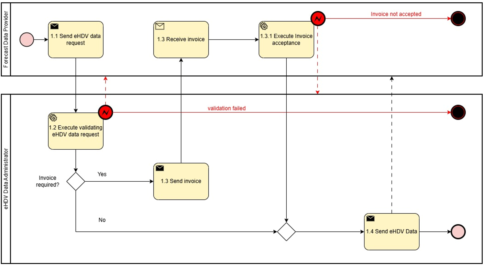
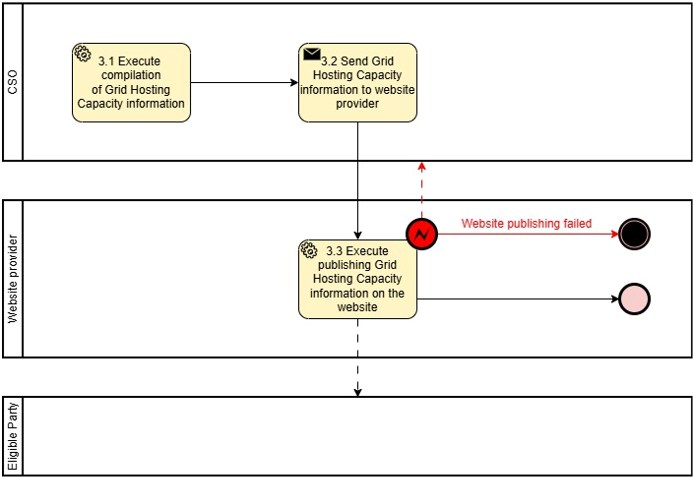

# Reference model for *Long-term Power Forecast -- Connecting System Operator and electric Heavy-Duty Vehicles*

Task 4.5 -- Electromobility: Long-term Power Forecast -- Connecting System Operator and electric Heavy-Duty Vehicles

## Context

(1)     The present document focuses on information exchange between Connecting System Operator (CSO) and electric Heavy-Duty Vehicle (eHDV) for the purpose of improving long-term grid hosting capacity forecasts and improving access for the eHDV sector to CSO's grid hosting capacity forecasts.

(2)     In the context of the present document, a long-term forecast considers a time horizon of 0-10 years and differs from a short-term forecast that covers the period from the current operational hour up to several weeks ahead.

(3)     The ambition in this reference model is to make forecasts as generic as possible, suitable for information exchange between CSO and other stakeholders.

(4)     Presently, the eHDV sector does not have access to information on future grid hosting capacity.

(5)     A new requirement for electricity CSOs, at both transmission and distribution levels, is to publish and update information on the capacity available for new connections in their areas of operation, both for production and consumption.

(6)     The European Commission has acknowledged a gap between grid capacity and connection demand as an issue that must be addressed and launched several initiatives on network development plans, grid hosting capacity information and flexibility need assessment. (Regulation 2024/1747 and Directive 2024/1711)

(7)     Grid Action Plan Action number 6 urges ENTSO-E and the EU DSO Entity to *'(...) establish a pan-EU overview that should give visibility to project developers when conceptualising their projects, such as new renewable or EV recharging infrastructure projects and help developers estimate the risk of connection request approval delays and, thus, have a clearer forecast about when projects can start receiving revenues'.*

(8)     Presently, CSOs do not have any access to representative long-term power forecast requirements from future eHDV fleets.

(9)     Information on future power needs of eHDV fleets is required by CSOs in order to plan for the expansion of the grid. The power demand from eHDVs has a significant impact on CSOs and should be included in CSO Power Forecast and in the future mandatory 10-year Network Development Plans (Draft TYNDP from ENTSO-E to ACER May 2025).

(10)     The eHDV regulation framework includes the CO2 regulation (EU 2019/1242) to reduce tailpipe CO2 with 45% to 2030 vs. 2019. Since the regulation addresses limiting tailpipe emissions, zero-emission vehicles (ZEVs) are the only viable alternative for complying with the regulation. Approximately one third of new vehicle registrations 2030 must be zero-emission. The majority (~90%) will be Battery Electric Vehicles ["The technological and market readiness of heavy-duty road transport vehicles" DG Move May 27, 2025].

(11)     It is essential for the fulfilment of the CO2 regulation that SOs can prepare the grid in time to enable connection of ~40.000 fast chargers and ~400.000 slow chargers in Europe to support a fleet of 400.000 ZEVs. As of Q2 2025, there is an estimated ~1000-1100 eHDV accessible fast chargers (>350kW) in Europe [Source: EY and Milence].

(12)     Regulation (EU) 2023/18042 on the deployment of alternative fuels infrastructure (AFIR) is under implementation in member states to support the roll-out of zero-emission vehicles. The same regulation imposes demands on charging hubs of 7.2 MW every 60 km along the TEN-T core network and 3.0 MW along the TEN-T comprehensive network.

(13)     AFIR sets minimum requirements. However, considerably more fast charging and private or private shared charging in depots is required to support the fleet size derived from the CO2 regulation.

(14)     Grid hosting capacity maps are a useful tool to evaluate where and when grid capacity will be available for connecting these charging hubs to the grid. Each member state is responsible for providing AFIR compliance plans to the commission.

(15)     Electricity grid project developers require long-term grid hosting capacity information from CSOs in order to make future energy infrastructure investments.

(16)     CSOs need information on customers' and other relevant stakeholders' future needs for grid hosting capacity for network development plans, assessing future flexibility needs and reliable grid hosting capacity long-term forecasts.

(17)     Forecasts for future charging capacity needs of eHDVs can be based on (i) historic driving patterns of HDVs and (II) energy consumption and charging data from existing eHDVs. Currently, there is a limited number of eHDVs circulating but, with new data continuously collected, more accurate forecasts are likely. For CSOs, the requirement are the future charging capacity needs for the various grid locations (in MW).

(18)     To respect privacy and ensure competitiveness, forecasts from eHDVs charging capacity needs are currently made for geographical areas that do not necessarily align with the ones defined by grid structure. Finding ways to bridge this misalignment is essential.

(19)     Forecasts for eHDVs' future charging capacity needs are to be restricted to parties with access rights.

(20)     Access to grid hosting capacity is unrestricted.

(21)     The energy sector is undergoing rapid transformation, driven by decarbonization, decentralization, digitalisation and electrification. Long-term forecasts are essential to anticipate future energy demand, generation capacity and infrastructure needs. Such forecasts enable proactive investment and policy planning, efficient grid use and the avoidance of stranded assets.

(22)     Stakeholders, including transmission and distribution system operators, regulators, and market participants---require a harmonized approach to forecasting for aligning national and regional strategies. This document addresses a common framework for the development, validation and use of long-term power forecasts that encourages the consistent and transparent application of long-term forecasting practices in support of a resilient and sustainable energy system.

## Definitions

CHAPTER I

Regarding GENERAL PROVISIONS

*Issue 1*

**On subject matter and scope**

*Issue 2*

**On definitions**

For the purpose of this document, the following definitions shall apply:

1) 'eHDV', in the context of this document, means electric Heavy-Duty Vehicle

2) 'eHDV data', in the context of this document, means data related to and from electric Heavy-Duty Vehicles

3) 'eHDV long-term forecast', in the context of this document, means a forecast about electric Heavy-Duty Vehicles future need for charging capacity (current forecasts are often derived from information for a mix of current diesel and electrical vehicles)

4) 'Long-term forecast for grid hosting capacity information', in the context of this document, means a forecast for grid hosting capacity information from the System Operator that is an indication of what is available for new connections 1-10 years in the future

5) 'Data area', in the context of this document means data representing a geographic area

6) 'Data set', in the context of this document means power or energy data within a time period for a geographic area

7) 'Hexagon', in the context of this document means a type of representation or format of a geographic area

## Responsibilities of Market Roles

CHAPTER II

Regarding [YOUR USE CASE]

**[NOTE] Typically define responsibilities last and in close coordination with *T5.5 EU Policy and regulation alignment***

*Article XX*

**On responsibilities of ROLE1**

### Responsibilities of ROLE1

1.  ROLE1 shall ...

## Annex

ANNEX A

**A1. The reference model for [YOUR USE CASE]**

Table I contains information needed by [Stakeholder1 AND Stakeholder2] to set up for utilising [YOUR USE CASE] in a Member State. Do we need Table 1?

### General Information

| ID  | Name                         | Description                                                                                                                                                                                                           |
|-----|------------------------------|-----------------------------------------------------------------------------------------------------------------------------------------------------------------------------------------------------------------------|
| I1  | [EXAMPLE]                    |                                                                                                                                                                                                                       |

### Relevant Roles

**Please describe all *HARMONISED ROLES* below.**

| Role name                                | Role type | Role description                                                                                                                            |
|------------------------------------------|-----------|---------------------------------------------------------------------------------------------------------------------------------------------|
| Final customer                           | Business  | As defined in Article 2(3) of Directive (EU) 2019/944, this refers to a party connected to the grid that purchases electricity for its own use.  Note: also includes the case of active customers and participants of renewable energy communities or citizen energy communities. |
| Competent authority                      | Business  | A competent authority could be a public or private entity in a Member State.                                                                |
| Eligible party                           | All       | An 'eligible party' is an entity offering energy-related services to Final Customers. Examples include transmission and distribution system operators, delegated operators and other third parties, aggregators, energy service companies, renewable energy communities, citizen energy communities and balancing service providers. |
| Connecting System Operator CSO           | Business  | A Connecting System Operator that connects the final customer to the grid                                                                    |
| eHDV Data Administrator                  | Business  | A party responsible for eHDV data and distributing these data to eHDV Forecast producers.                                                    |
| eHDV Data Permission administrator       | Business  | A party responsible for administering a register of data access permissions for a set of eHDV data, making this information available to eHDV Forecast producers under a non-disclosure agreement (NDA). |
| eHDV Forecast producer                   | Business  | A party responsible for producing eHDV forecast data                                                                                         |
| eHDV Forecast Data access provider       | Business  | A party responsible for access to eHDV Forecast Data                                                                                         |
| Grid hosting capacity website provider   | Business  | A party who provides Grid hosting capacity website                                                                                           |
| Power forecast data provider             | Business  | A party responsible for providing power forecast data                                                                                         |
| Power forecast access provider           | Business  | A party responsible for access to the power forecast Data                                                                                     |

### Procedures

**PROCEDURES**

All roles are expected to be accessing information in secure, authenticated manner and through trusted communication channels. For this reason, the authentication steps used for these communication partners are not listed in the scenarios below.

An overview of the main procedures for the use case is presented in Table III. Further details are included in Tables IV.1 -- IV.3.

| No. | Procedure Name                              | Primary Actor                | Preconditions                                         |
|-----|---------------------------------------------|------------------------------|-------------------------------------------------------|
| 1   | Access to eHDV data (Category: Dataset & Scenario Creation) | eHDV data administrator      | The eligible party has permission to access the requested data. User consent or regulation. |
| 2   | Access to eHDV power forecast data (Category: Result Submission & Delivery) | Power forecast data provider | The eligible party has permission to access the requested data. User consent or regulation. |

All diagrams describing the procedures are of an illustrative nature. Information objects referred to in columns Information exchanged (IDs) are defined in Table V. Table IV.1, IV.2 and IV.3 explain the procedures from Table III in further detail, step by step, together with the information exchanged.

#### Procedure 1 - Access to eHDV data

| Step No. | Step                                   | Step description                                                                                                     | Information producer (actor) | Information receiver (actor) | Information exchanged (IDs)       |
|----------|----------------------------------------|----------------------------------------------------------------------------------------------------------------------|------------------------------|------------------------------|-----------------------------------|
| 1.1      | Send eHDV data request                 | Process Step for eHDV data transfer. Forecast producer specifies the requests for eHDV data.                          | Power Forecast data provider | eHDV Data Administrator      | (A) eHDV data request             |
| 1.2      | Execute validating eHDV data request   | Validate request from Forecast data provider. In case of an invalid request, a meaningful indication is provided.     | eHDV Data Administrator      |                              |                                   |
| 1.3      | Send Invoice                           | If billing is required, the eHDV Data Administrator provides an invoice. Otherwise, continue with Step 1.4            | eHDV Data Administrator      | Power Forecast data provider | (B) eHDV Data Invoice             |
| 1.3.1    | Execute Invoice acceptance             | Step for acceptance of the invoice. In case of rejection of the invoice, a meaningful indication is provided.         | Power forecast data provider | eHDV Data Administrator      | (C) eHDV Data Invoice acceptance  |
| 1.4      | Send eHDV data                         | Process Step to send eHDV data. Forecast producer receives the requested data under NDA.                              | eHDV Data Administrator      | Power forecast data provider | (D) eHDV data                     |

Figure 1. Diagram corresponding to the procedure in Table IV.1.

#### Procedure 2 - Access to long-term power forecast data

| Step No. | Step                                                     | Step description                                                                                                                               | Information producer (actor) | Information receiver (actor) | Information exchanged (IDs)                            |
|----------|----------------------------------------------------------|------------------------------------------------------------------------------------------------------------------------------------------------|------------------------------|------------------------------|--------------------------------------------------------|
| 2.1      | Send Long-term Power Forecast data request               | Process steps for long-term power forecast data request. The eligible party requests forecast data for specific areas /mRID object              | Eligible party               | Power forecast data provider | (E) Long-term power forecast data request              |
| 2.1      | Execute validating Long-term power forecast data request | Validate request from eligible party. In case of an invalid request, a meaningful indication is provided.                                       | Power forecast data provider |                              |                                                        |
| 2.3      | Send invoice                                             | [Optional] If billing is required, the Forecast data provider provides an invoice. Otherwise, continue with Step 2.4                        | Power forecast data provider | Eligible party               | (F) Long-term Power Forecast data invoice              |
| 2.3.1    | Execute Invoice acceptance                               | [Optional] Step for acceptance of the invoice. In case of rejection of the invoice, a meaningful indication is provided.                    | Eligible party               | Forecast data provider       | (G) Long-term Power Forecast data invoice acceptance   |
| 2.4      | Send Long-term Power Forecast data                       | Process Step to send long-term power forecast data. Eligible party receives the requested data under NDA.                                       | Power forecast data provider | Eligible party               | (H) Long-term Power Forecast data                      |

(\*)The procedure can be made more specific by making explicit reference to the eHDV power forecast data.

Figure 2. Diagram corresponding to the procedure in Table IV.2.

#### Procedure 3 - Access to grid hosting capacity information

| Step No. | Step                                                                | Step description                                                                                                                                                                                                                                                                    | Information producer (actor)           | Information receiver (actor)           | Information exchanged (IDs)                                                                                              |
|----------|---------------------------------------------------------------------|-------------------------------------------------------------------------------------------------------------------------------------------------------------------------------------------------------------------------------------------------------------------------------------|----------------------------------------|----------------------------------------|--------------------------------------------------------------------------------------------------------------------------|
| 3.1      | Execute compilation of Grid Hosting Capacity information            | Internal activity. CSO checks for grid hosting capacity                                                                                                                                                                                                                             | CSO                                    |                                        |                                                                                                                          |
| 3.2      | Send Grid Hosting Capacity information to the website provider      | CSO provides Grid hosting capacity information to grid hosting capacity website provider                                                                                                                                                                                            | CSO                                    | Grid hosting capacity website provider | (I1) Grid Hosting Capacity information production (I2) Grid Hosting Capacity information consumption (I3) Grid Hosting Capacity information energy storage |
| 3.3      | Execute publishing Grid Hosting Capacity information on the website | Grid hosting capacity website provider publishes grid hosting capacity information on website. Eligible party can read Grid hosting capacity information for the selected area directly on the webpage. In case of unsuccessful publication, a meaningful indication is provided.     | Grid hosting capacity website provider | Eligible Party                         | (I1) Grid Hosting Capacity information production (I2) Grid Hosting Capacity information consumption (I3) Grid Hosting Capacity information energy storage |

Figure 3. Diagram corresponding to the procedure in Table IV.3.

### Data Exchanged

| ID  | Name of information object                              | Definition of attributes of exchanged information object                                                                                                      |
|-----|---------------------------------------------------------|---------------------------------------------------------------------------------------------------------------------------------------------------------------|
| (A) | eHDV data request                                       | *Timestamp* - Timestamp when the data package has been generated. Datetime object according to ISO8601 *Country Code* - A country / geographical area where vehicles have moved within *Time period start* - Datetime object according to ISO8601 *Time period end* - Datetime object according to ISO8601 |
| (B) | eHDV Data Invoice                                       | *Timestamp* - Timestamp when data request was processed. Datetime object according to ISO8601 *Invoice Specifications* - A standard invoice generated in line with the supplier's specifications |
| (C) | eHDV Data Invoice acceptance                            | *Timestamp* - Timestamp when Invoice was processed. Datetime object according to ISO8601 *Acceptance acknowledgement* - A standard invoice acceptance acknowledgement generated in line with the customer's specifications |
| (D) | eHDV data                                               | *Timestamp* - Timestamp when the data extract has been generated. Datetime object according to ISO8601 *Vehicle info* - Anonymized Vehicle usage information needed for simulation / forecasting model *Vehicle Timestamp* - Datetime object according to ISO8601 |
| (E) | Long-term Power Forecast data request                   | *Timestamp* - Timestamp when the data package has been generated. Datetime object according to ISO8601 *Dataset for area [degree] (WGS 84)* - A dataset of coordinates defining a geographical area (polygon) *(Optional) mRID* - Master Resource Identifier is a global consistent identification of any network model object. MRID will be used when agreed with eligible party that that produces information. *Time period start* - Datetime object according to ISO8601 *Time period end* - Datetime object according to ISO8601 *Periodicity (constant)* - e.g., hourly, daily, etc. *Forecast object* - e.g., maximum over 60 minutes, 95% confidence interval over one day, etc. |
| (F) | Long-term Power Forecast data Invoice                   | *Timestamp* - Timestamp when data request was processed. Datetime object according to ISO8601 *Invoice Specifications* - A standard invoice generated in line with the supplier's specifications |
| (G) | Long-term Power Forecast data Invoice acceptance        | *Timestamp* - Timestamp when Invoice was processed *Acceptance acknowledgement* - A standard invoice acceptance acknowledgement generated in line with the customer's specifications |
| (H) | Long-term Power Forecast data                           | *Timestamp* - Timestamp when the data package has been generated. Datetime object according to ISO8601 *Dataset for area [degree] (WGS 84)* - A dataset of coordinates defining a geographical area (polygon) *(Optional) mRID* - Master Resource Identifier is a global consistent identification of any network model object. MRID will be used when agreed with eligible party that that produces information. *Unit* - [MW] *Quantity* - Forecasted electrical power consumption or generation *Time period start* - Datetime object according to ISO8601 *Time period end* - Datetime object according to ISO8601 *(Optional) Forecast accuracy* - Standard deviation, confidence intervals, etc. Alternatively, best/worst case scenarios |
| (I1) | Grid Hosting Capacity information - Available capacity production | *Object Description* - Description of the grid hosting capacity information provided *Timestamp* - Timestamp when the data package has been generated. Datetime object according to ISO8601 *Time [year]* - The year for the available grid hosting capacity (can be one or more years) *Station* - The identification name of the station *Voltage level [kV]* - The voltage level that the station is feeding *Municipality* - The Municipality where the station is located *(Optional) Latitude [degree] (WGS 84)* - The coordinate of the station *(Optional) Longitude [degree] (WGS 84)* - The coordinate of the station *(Optional) Available capacity solar without consideration of network capacity from overlying grid [MW]* - The available capacity for production of solar of the station without consideration of network capacity from overlying grid *Available capacity solar with consideration of network capacity from overlying grid [MW]* - The available capacity for production of solar of the station with consideration of network capacity from overlying grid *(Optional) Available capacity wind without consideration of network capacity from overlying grid [MW]* - The available capacity for production of wind of the station without consideration of network capacity from overlying grid *Available capacity wind with consideration of network capacity from overlying grid [MW]* - The available capacity for production of wind of the station with consideration of network capacity from overlying grid *(Optional) Dataset for area [degree] (WGS 84)* - A dataset of coordinates defining a geographical area (polygon) |
| (I2) | Grid Hosting Capacity information - Available capacity consumption | *Object Description* - Description of the grid hosting capacity information provided *Timestamp* - Timestamp when the data package has been generated. Datetime object according to ISO8601 *Time [year]* - The year for grid hosting capacity information *Station* - The identification name of the station *Voltage level [kV]* - The voltage level that the station is feeding *Municipality* - The Municipality where the station is located *(Optional) Latitude [degree] (WGS 84)* - The coordinate of the station *(Optional) Longitude [degree] (WGS 84)* - The coordinate of the station *(Optional) Available capacity EV without consideration of network capacity from overlying grid [MW]* - The available capacity for EV at the station without consideration of network capacity from overlying grid *Available capacity EV with consideration of network capacity from overlying grid [MW]* - The available capacity EV at the station with consideration of network capacity from overlying grid *(Optional) Available capacity industry without consideration of network capacity from overlying grid [MW]* - The available capacity for industry at the station without consideration of network capacity from overlying grid *Available capacity industry with consideration of network capacity from overlying grid [MW]* - The available capacity for industry at the station with consideration of network capacity from overlying grid *(Optional) Dataset for area [degree] (WGS 84)* - A dataset of coordinates defining a geographical area (polygon) |
| (I3) | Grid Hosting Capacity information - Available capacity energy storage | *Object Description* - Description of the grid hosting capacity information provided *Timestamp* - Timestamp when the data package has been generated. Datetime object according to ISO8601 *Time [year]* - The year for grid hosting capacity information *Station* - The identification name of the station *Voltage level [kV]* - The voltage level that the station is feeding *Municipality* - The Municipality where the station is located *(Optional) Latitude [degree] (WGS 84)* - The coordinate of the station *(Optional) Longitude [degree] (WGS 84)* - The coordinate of the station *(Optional) Available capacity energy storage without consideration of network capacity from overlying grid [MW]* - The available capacity for energy storage at the station without consideration of network capacity from overlying grid *Available capacity energy storage with consideration of network capacity from overlying grid [MW]* - The available capacity for energy storage at the station with consideration of network capacity from overlying grid *(Optional) Dataset for area [degree] (WGS 84)* - A dataset of coordinates defining a geographical area (polygon) |
