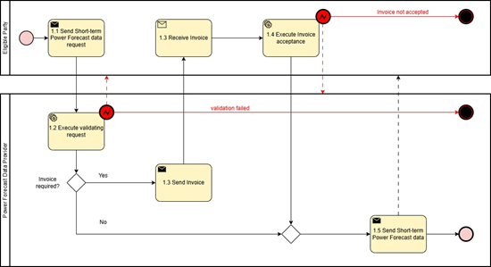
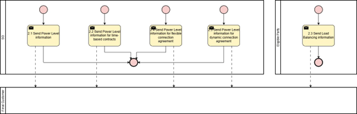

# Task 4-5_02 – Electromobility: Short-term Power Forecast  

## Context

(1) For the context of the present document, a short-term forecast considers a time window from the current operational hour and extending up to days, weeks and up to one year ahead and differs from a long-term forecast that typically considers a time horizon of 0-10 years.   
(2) The energy sector is undergoing rapid transformation driven by decarbonization, decentralization, digitalisation and electrification.   
(3) The growing integration of intermittent production, energy storage, intermittent consumption, such as charging of electric Heavy-Duty Vehicles (eHDV), and electrification of industrial processes increases the need for reliable short-term power forecasts with a time horizon of a couple of weeks down to 15 min.  
(4) The connecting system operator (CSO) must safeguard that the necessary resources (e.g. flexible consumption and production) are planned for and procured in energy and power markets to maintain distribution, transmission and/or system stability.  
(5) Significant grid users (SGU) are subject to specific obligations regarding data exchange, system observability, and participation in grid operations.   
(6) All SGUs are mandated to share power forecasts with CSO to enable such planning (Commission Regulation (EU) 2017/1485 (SO GL)).   
(7) An SGU is connected to the grid and deemed to affect its operation. These can include Final Customers with a demand above 1 MW. The implementation varies across Member States.   
(8) An SGU is required to send day, week and one year ahead forecasts to a Transparency Platform according to Transparency Directive (EU) 2004/109.  
(9) Stakeholders, including Final Customers, Charge Point Operators (CPO) and other market participants, require a harmonized approach to power information sharing. To support the deployment of eHDVs it is necessary to facilitate the transparent flow of information for secure and predictable charge planning.  
(10) Misunderstandings in communication of power information create problems for stakeholders. Users of eHDVs need to know in advance the availability of power for a certain charging stop, to be able to plan, arrive on time with goods and avoid fines for late arrival.   
(11) Currently, there are several business models between CSO and CPO and the only available information is the installed peak power (static information), which may differ significantly from the actual average power per hour for a specific hour of a specific day (dynamic information).  
(12) Business models such as connection agreements, time-based contracts, load-balancing, flexible connection agreements and dynamic connection agreements require a harmonized approach to information sharing. 
(13) Time-based contracts have different power levels for different time periods. The contract is static.  
(14) A flexible connection agreement guarantees the customer a minimum power level. When a curtailment is required, the Connecting System Operator (CSO) informs the customer at a predefined time, specifying the reduced power level.  
(15) A dynamic connection agreement guarantees the customer a minimum power level. At a predefined time, the Connecting System Operator (CSO) informs the customer if additional power beyond the minimum can be delivered.  
(16) Load balancing can be used by a CSO to divide power between different users within a certain pre-defined limit, or it can be applied by a CPO to split available power from the CSO between different chargers on a site.  
(17) It is possible that several combinations of these business models can be applied by CPOs which hinders estimating the actual average power per hour that can be used for planning of eHDV charging.   
(18) The Charge Point Operator (CPO) may act in the capacity of a Final Customer and shall receive power level information and exchange short-term power forecasts.

## Chapter I – General Provisions

### Issue 1 — Subject matter and scope  
### Issue 2 — Definitions

## Chapter II – Use Case

## Annex A 

### A1. Fundamental setup

### Table I – General information on Member State environments

| ID | Name | Description |
|----|------|-------------|

## Roles

### Table II – Roles

| Role name | Role type | Role Description |
|----------|----------|-------------|
|Eligible Party|All|An ‘eligible party’ is an entity offering energy-related services to Final Customers. Examples include transmission and distribution system operators, delegated operators and other third parties, aggregators, energy service companies, renewable energy communities, citizen energy communities and balancing service providers.|
|Charge Point Operator||Business|A charge point operator (CPO) is an entity responsible for the deployment, technical operation and lifecycle management of electric‑vehicle charging infrastructure, including the ownership, installation, monitoring, maintenance and optimisation of charging assets.|
|Power Forecast Data Provider|Business|A party responsible for providing power forecast data.|
|Connecting System Operator|Business|The Connecting System Operator (CSO) is defined in Article 2 of Network Code on Demand Response (NCDR).|
|Final Customer|Business|As defined in Article 2(3) of Directive (EU) 2019/944, this refers to a party connected to the grid that purchases electricity for its own use. Note: This also includes the case of active Customer(s) and participants of renewable energy communities or citizen energy communities. A CPO may also act in the role of a Final Customer.|

## Procedures

All roles are expected to be accessing information in secure, authenticated manner and through trusted communication channels. For this reason, the authentication steps used for these communication partners are not listed in the scenarios below.   
An overview of the main procedures for the use case is presented in Table III. More details are included in Tables IV.1 – IV. 2.

### Table III – Procedure Conditions

| No. | Procedure Name | Primary Actor | Pre-condition |
|----|----------|--------------|--------------|
|1|Access Short-term Power Forecast data (Category: Result Submission & Delivery)|Power Forecast data provider|The eligible party has permission to access the requested data. User consent or regulation.| 
|2|Inform Final Customer (Category: Result Submission & Delivery)|CSO|The eligible party has permission to access the requested data. User consent or regulation.|

## Procedure Details

All diagrams describing the procedures are of an illustrative nature. Information objects referred to in column Information exchanged (IDs) are defined in Table V (work in progress). Table IV.1 and IV.2 explain the procedures from Table III in further detail, step by step, together with the information exchanged.

### Table IV.1 – Access Short-term Power Forecast Data

| Step no.| Step | Step Description | Information Producer (actor) | Information receiver (actor) |Information exchanged (IDs)|
|------|-------------|----------|----------|----------|----------|
|1.1|Send Short-term Power Forecast data request|Process steps for power forecast data transfer: Eligible party specifies the requested power forecast data.|Eligible party|Power Forecast data provider|(A) Short-term Power Forecast data request|
|1.2|Execute validating request|Validate request from eligible party. In case of an invalid request, a meaningful indication is provided.|Power Forecast data provider|||
|1.3|Send Invoice|If billing is required the Forecast provider provides an invoice. Otherwise, proceed to 1.5.|Power Forecast data provider|Eligible party|(B) Short-term Power Forecast Data invoice|
|1.4|Execute Invoice acceptance|If billing is requested, the Eligible party accepts the invoice. In case of an invalid request, a meaningful indication is provided.|Eligible party|Power Forecast data provider|(C) Short-term Power Forecast Data Invoice acceptance|
|1.5|Send Short-term Power Forecast data|Process steps for Power forecast data transfer: Eligible party receive the requested forecast data.|Power Forecast data provider|Eligible party|(D) Short-term Power Forecast data| 

*Figure 1: Diagram corresponding to the procedure in Table IV.1.*

---
### Table IV.2 – Inform Final Customer

| Step no.| Step | Step Description | Information Producer (actor) | Information receiver (actor) |Information exchanged (IDs)|
|------|-------------|----------|----------|----------|----------|
|2.1|Send Power Level information for firm connection agreement|Final customer is informed on power level for firm connection agreement.|CSO|Final Customer|(E) Power level information|
|2.2|Send Power Level information for time-based contracts|Final customer is informed on time-based contracts.|CSO|Final Customer|(F) Power level information for time-based contracts|
|2.3|Send Load Balancing information|Final customer is informed on load balancing information.|Eligible party|Final Customer|(G) Load Balancing information |
|2.4|Send Power Level information for flexible connection agreement|Final customer is informed on flexible connection agreement.|CSO|Final Customer|(H) Power level information for flexible connection agreement (how long)|
|2.5|Send Power Level information for dynamic connection agreement|Final customer is informed on dynamic connection agreement.|CSO|Final Customer|(I) Power level information for dynamic connection agreement|

*Figure 2: Diagram corresponding to the procedure in Table IV.2.*

## Information Objects

The technical specification of information objects is under development. 

### Table V

| Information exchanged | Name of information | Description of information exchanged |
|----------------------------|--------------------|--------------------------------------|
|(A)|Short-term Power Forecast data request|The request comprises of a set of information objects (A1)-(A5) as below.|
|(A1)|Location (all fields are optional; not all fields may be left empty; information ensures unique identification)|**Position point** The position point of the asset as a single location as coordinates. E.g. specific CPO location. **Grid Hosting Capacity Service Area** The name of the grid hosting capacity service area (full text name or an abbreviation), could for example be a license area **Connection Point** Identification of customer connection **Polygon** A polygonal area defined by a set of coordinates **Municipality** Municipality **Region** Region **Country** Country **Postal Code** Postal Code **Other relevant information** Field for further locational information (for example Master Resource ID of final customer or address of final customer)|
|(A2)|Periodicity|**Periodicity for the forecast delivery**	Specification of the periodicity for the forecast. One of: minutely, 15-minutely, hourly, daily.|
|(A3)|Forecast Object|Definition of the forecast object. One of: peak power, trough power or total demand.  
|(A4)|Time Interval|Time Interval for the forecast aligning with the chosen periodicity.  startForecastDateTime, endForecastDateTime |
|(A5)|Confidence level  (optional)|Requested confidence level for the forecast. Used for confidence bands. |
|(B)|Long-term Power Forecast data Invoice|**Timestamp** 	Timestamp when data request was processed. Datetime object according to ISO8601. **Invoice Specifications** A standard invoice generated in line with the supplier’s specifications. |
|(C)|Short-term Power Forecast data Invoice acceptance|**Timestamp** Timestamp when Invoice was processed. **Acceptance acknowledgement** A standard invoice acceptance acknowledgement generated in line with the customer’s specifications. |
|(D)| Short-term Power Forecast data|The forecast comprises of a set of information objects (D1)-(D6) |
|(D1)|Power forecast|A time series with the adequate periodicity specified in (A2) for the forecast object defined in (A3).|
|(D2)|Confidence Lower Bound (optional)|A time series with the adequate periodicity specified in A2 with the estimated lower bound for the forecast. |
|(D3)|Confidence Upper Bound (optional)|A time series with the adequate periodicity specified in A2 with the estimated upper bound for the forecast. |
|(D4)|Other uncertainty information (optional)|Further information regarding the forecast’s uncertainty.  |
|(D5)|Methodology information (Optional)|Methodological information regarding the methodology used in producing the forecast. |
|(D6)|Other information (Optional)|Further completing information, e.g. disclaimer information.| 
|(E)| Power level information|TBD| 
|(F)| Power level information for time-based contracts|TBD| 
|(G)| Load Balancing information |TBD| 
|(H)| Power level information for flexible connection agreement (how long)|TBD| 
|(I)| Power level information for dynamic connection agreement|TBD| 

