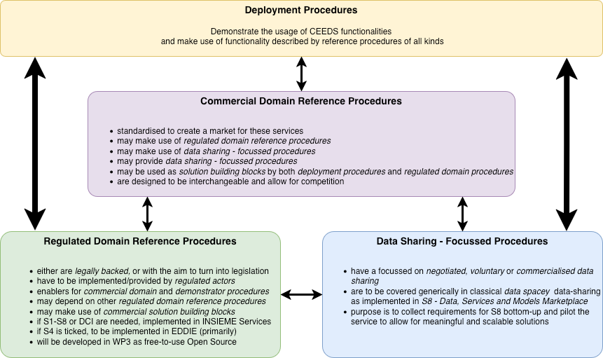

### Regulated Domain Reference Models

| Procedure                                                                                                                                                                                                                                        | Pr.                              | St. | Procedure                                                                                                                          | S1 | S2 | S3 | S4 | S5 | S6 | S7 | S8 | DCI |
|--------------------------------------------------------------------------------------------------------------------------------------------------------------------------------------------------------------------------------------------------|----------------------------------|-----|------------------------------------------------------------------------------------------------------------------------------------|----|----|----|----|----|----|----|----|--|
|                                                                                                                                                                                                                                                  |                                  |     | **T4-2_01 Access to Metering and Consumption Data**                                                                                |
| [T4-2_01_01](regulated-domain/T4-2_01-access-to-metering-and-consumption-data/T4-2_01-access-to-metering-and-consumption-data.md#procedure-1---access-to-validated-historical-metering-and-consumption-data-by-the-final-customer)               |        | L   | Access to validated historical metering and consumption data by the final customer                                                 |    | x  |    |    | x  |    |    |    |  |  
| [T4-2_01_02](regulated-domain/T4-2_01-access-to-metering-and-consumption-data/T4-2_01-access-to-metering-and-consumption-data.md#procedure-2---access-to-validated-historical-metering-and-consumption-data-by-an-eligible-party)                |        | L   | Access to validated historical metering and consumption data by an eligible party                                                  | x  | x  | x  | x  | x  | x  |    |    |  |
| [T4-2_01_03](regulated-domain/T4-2_01-access-to-metering-and-consumption-data/T4-2_01-access-to-metering-and-consumption-data.md#procedure-3---termination-of-service-by-an-eligible-party)                                                      |        | L   | Termination of service by an eligible party                                                                                        | x  | x  | x  | x  | x  | x  |    |    |  |
| [T4-2_01_05](regulated-domain/T4-2_01-access-to-metering-and-consumption-data/T4-2_01-access-to-metering-and-consumption-data.md#procedure-5---activate-near-real-time-data-flow-from-smart-meter-or-smart-metering-system-where-applicable)     |        | L   | Activate near real-time data flow from smart meter or smart metering system                                                        |    |    |    |    |    |    |    |    | x |
| [T4-2_01_06](regulated-domain/T4-2_01-access-to-metering-and-consumption-data/T4-2_01-access-to-metering-and-consumption-data.md#procedure-6---read-near-real-time-data-from-smart-meter-or-smart-metering-system)                               |        | L   | Read near real-time data from smart meter or smart metering system                                                                 |    | x  |    |    |    |    |    |    | x | 
|                                                                                                                                                                                                                                                  |                                  |     | **T4-2_02 Access to Basic Master Data**                                                                                            |
| [T4-2_02_01](regulated-domain/T4-2_02-access-to-basic-master-data/T4-2_02-access-to-basic-master-data.md#procedure-1---access-to-accounting-point-master-data-by-the-final-customer)                                                             |        | C   | Access to accounting point master data by the final customer                                                                       |    | x  |    |    | x  |    |    |    |  | 
| [T4-2_02_02](regulated-domain/T4-2_02-access-to-basic-master-data/T4-2_02-access-to-basic-master-data.md#procedure-2---access-to-accounting-point-master-data-by-an-eligible-party)                                                              |        | C   | Access to accounting point master data by an eligible party                                                                        | x  | x  | x  | x  | x  | x  |    |    |  | 
| [T4-2_02_03](regulated-domain/T4-2_02-access-to-basic-master-data/T4-2_02-access-to-basic-master-data.md#procedure-3---termination-of-access-to-accounting-point-master-data-by-the-eligible-party)                                              |        | C   | Termination of access to accounting point master data by the eligible party                                                        | x  | x  | x  | x  | x  | x  |    |    |  | 
| [T4-2_02_04](regulated-domain/T4-2_02-access-to-basic-master-data/T4-2_02-access-to-basic-master-data.md#procedure-4---revocation-of-access-to-accounting-point-master-data-by-the-final-customer)                                               |        | C   | Revocation of access to accounting point master data by the final customer                                                         |    | x  | x  | x  | x  | x  |    |    |  | 
| [T4-2_02_05](regulated-domain/T4-2_02-access-to-basic-master-data/T4-2_02-access-to-basic-master-data.md#procedure-5---access-to-market-party-master-data)                                                                                       | tbd                              | C   | Access to market party master data                                                                                                 |    | x  | x  |    |    |    |    |    |  |
| [T4-2_02_06](regulated-domain/T4-2_02-access-to-basic-master-data/T4-2_02-access-to-basic-master-data.md#procedure-6---access-to-list-of-market-parties-by-their-role)                                                                           | tbd                              | C   | Access to list of market parties by their role                                                                                     |    | x  | x  |    |    |    |    |    |  |
|                                                                                                                                                                                                                                                  |                                  |     | **T4-2_03 Access to implicit flexibility signals**                                                                                 |
| T4-2_03_01                                                                                                                                                                                                                                       | tbd                              | tbd | Access to residual supply price for period                                                                                         |    | x  | x  | x  | x  | x  |    | x  |  |
| T4-2_03_02                                                                                                                                                                                                                                       | tbd                              | tbd | Access to residual grid fee for period                                                                                             |    | x  | x  | x  | x  | x  |    | x  |  |
| T4-2_03_03                                                                                                                                                                                                                                       | tbd                              | tbd | Access to CESU supply price for period                                                                                             |    | x  | x  | x  | x  | x  |    | x  |  |
| T4-2_03_04                                                                                                                                                                                                                                       | tbd                              | tbd | Access to CESU grid fee for period                                                                                                 |    | x  | x  | x  | x  | x  |    | x  |  |
|                                                                                                                                                                                                                                                  |                                  |     | **T4-2_04 Customer Switching**                                                                                                     |
| T4-2_04_01                                                                                                                                                                                                                                       | tbd                              | L   | Switching supplier                                                                                                                 | x  | x  | x  | x  | x  | x  |    |   |  |
| T4-2_04_02                                                                                                                                                                                                                                       | tbd                              | L   | [optional] Cancellation of switching supplier                                                                                      |    | x  | x  | x  | x  | x  |    |   |  |
|                                                                                                                                                                                                                                                  |                                  |     | **T4-3_01 Collective Self-Consumption and  Energy Communities**                                                                 |
| [T4-3_01_01](regulated-domain/T4-3_01-collective-energy-sharing/T4-3_01-collective-energy-sharing.md#procedure-1---registration-of-a-collective-energy-sharing-unit)                                                                             | dev                              | C   | Registration of a collective energy sharing unit                                                                                   | x  | x  | x  | x  | x  | x  |    |    |  | 
| [T4-3_01_02](regulated-domain/T4-3_01-collective-energy-sharing/T4-3_01-collective-energy-sharing.md#procedure-2---cesu-operator-queries-if-metering-point-may-be-assigned-to-the-cesu)                                                          | dev                              | C   | CESU operator queries if metering point may be assigned                                                                            |    | x  | x  | x  | x  | x  |    |    |  | 
| [T4-3_01_03](regulated-domain/T4-3_01-collective-energy-sharing/T4-3_01-collective-energy-sharing.md#procedure-3---final-customer-queries-if-metering-point-may-be-assigned-to-a-cesu)                                                           | dev                              | C   | Final customer queries if metering point may be assigned to a CESU                                                                 |    | x  | x  | x  | x  | x  |    |    |  | 
| [T4-3_01_04](regulated-domain/T4-3_01-collective-energy-sharing/T4-3_01-collective-energy-sharing.md#procedure-4---cesu-operator-requests-metering-point-to-be-added-to-the-unit-optionally-with-the-info-of-the-share-of-the-energy-allocation) | dev                              | C   | CESU operator requests metering point to be added to the unit [optionally] with the info of  the share of the energy allocation |    | x  | x  | x  | x  |    |    |    |  | 
| [T4-3_01_05](regulated-domain/T4-3_01-collective-energy-sharing/T4-3_01-collective-energy-sharing.md#procedure-5---cesu-operator-requests-metering-point-to-be-assigned-to-cesu-data-eligible-party-too)                                         | dev                              | C   | CESU operator requests metering point to be assigned to CESU data eligible party too                                               |    | x  | x  | x  | x  | x  |    |    |  | 
| [T4-3_01_06](regulated-domain/T4-3_01-collective-energy-sharing/T4-3_01-collective-energy-sharing.md#procedure-6---cesu-operator-requests-metering-point-to-be-removed-from-cesu)                                                                | dev                              | C   | CESU operator requests accounting point to be removed from CESU           a                                                        |    | x  | x  | x  | x  | x  |    |    |  | 
| [T4-3_01_07](regulated-domain/T4-3_01-collective-energy-sharing/T4-3_01-collective-energy-sharing.md#procedure-7---final-customer-requests-its-metering-point-to-be-removed-from-cesu)                                                           | dev                              | C   | Final customer requests its accounting point to be removed from CESU                                                               |    | x  | x  | x  | x  | x  |    |    |  | 
| [T4-3_01_08](regulated-domain/T4-3_01-collective-energy-sharing/T4-3_01-collective-energy-sharing.md#procedure-8---support-to-short-term-flexibility-markets)                                                                                    | **??**                           | D   | Support to short-term flexibility markets                                                                                          | x  | x  | x  | x  | x  | x  |    |    |  | 
| [T4-3_01_09](regulated-domain/T4-3_01-collective-energy-sharing/T4-3_01-collective-energy-sharing.md#procedure-9---energy-management-wwo-flexibility-provision)                                                                                  | **??**                           | D   | Energy management w/wo flexibility provision                                                                                       |    | x  | x  | x  | x  | x  |    |    |  | 
| [T4-3_01_10a](regulated-domain/T4-3_01-collective-energy-sharing/T4-3_01-collective-energy-sharing.md#procedure-10a---flexibility-verification-and-settlement-done-by-flexibility-requesting-party)                                              | **??**                           | D   | Flexibility verification and settlement done by FRP                                                                                |    | x  | x  | x  | x  | x  |    |    |  | 
| [T4-3_01_10b](regulated-domain/T4-3_01-collective-energy-sharing/T4-3_01-collective-energy-sharing.md#procedure-10b---flexibility-verification-and-settlement-done-by-flexibility-market-operator-or-other-third-party-support-tool)             | **??**                           | D   | Flexibility verification and settlement done by flexibility market operator or other third-party support tool                      |    | x  | x  | x  | x  | x  |    |    |  | 
| [T4-3_01_11a](regulated-domain/T4-3_01-collective-energy-sharing/T4-3_01-collective-energy-sharing.md#procedure-11---receive-self-consumption-information-of-energy-allocation)                                                                  | dev                              | C   | Receive self-consumption information for CESU without CESU intervention                                                            |    | x  | x  | x  | x  | x  |    |    |  | 
| [T4-3_01_11b](regulated-domain/T4-3_01-collective-energy-sharing/T4-3_01-collective-energy-sharing.md#procedure-11---receive-self-consumption-information-of-energy-allocation)                                                                  | dev                              | C   | Receive self-consumption information for CESU from CESU dynamic allocation                                                         |    | x  | x  | x  | x  | x  |    |    |  | 
| [T4-3_01_12](regulated-domain/T4-3_01-collective-energy-sharing/T4-3_01-collective-energy-sharing.md#procedure-12---cesu-internal-settlement-wwo-flexibility-provision)                                                                          | **??**                           | D   | CESU internal settlement w/wo flexibility provision                                                                                |    | x  | x  | x  | x  | x  |    |    |  | 
| [T4-3_01_13](regulated-domain/T4-3_01-collective-energy-sharing/T4-3_01-collective-energy-sharing.md#procedure-13---direct-access-to-its-own-data-by-cesu-member)                                                                                | dev                              | C   | Direct access to its own data by CESU member                                                                                       |    | x  | x  | x  | x  | x  |    |    |  | 
| [T4-3_01_14](regulated-domain/T4-3_01-collective-energy-sharing/T4-3_01-collective-energy-sharing.md#procedure-14---change-the-allocation-mechanism-of-the-cesu)                                                                                 | dev                              | C   | Change the allocation mechanism of the CESU                                                                                        |    | x  | x  | x  | x  | x  |    |    |  | 
| [T4-3_01_15](regulated-domain/T4-3_01-collective-energy-sharing/T4-3_01-collective-energy-sharing.md#procedure-15---company-qualification-for-participating-in-flexibility-markets)                                                              | **??**                           | D   | Company qualification for participating in flexibility markets                                                                     |    | x  | x  | x  | x  | x  |    |    |  | 
| [T4-3_01_16](regulated-domain/T4-3_01-collective-energy-sharing/T4-3_01-collective-energy-sharing.md#procedure-16---assets-qualification-for-participating-in-flexibility-markets)                                                               | **??**                           | D   | Assets qualification for participating in flexibility markets                                                                      |    | x  | x  | x  | x  | x  |    |    |  | 
|                                                                                                                                                                                                                                                  |                                  |     | **T4-4_01 Flexible Connection Agreements**                                                                                         |
| [T4-4_01_01](regulated-domain/T4-3_01-collective-energy-sharing/T4-3_01-collective-energy-sharing.md#procedure-1---registration-of-a-collective-energy-sharing-unit)                                                                             |  (dev) | C   | Initialization of Digital Customer Interface                                                                                   | x  | x  |    |    |    |    |    |    | x | 
| [T4-4_01_02](regulated-domain/T4-3_01-collective-energy-sharing/T4-3_01-collective-energy-sharing.md#procedure-1---registration-of-a-collective-energy-sharing-unit)                                                                             |  (dev) | C   | Onboarding of Flexible Customer to FCA                                                                                   | x  | x  |    |    |    |    |    |    | x | 
| [T4-4_01_03](regulated-domain/T4-3_01-collective-energy-sharing/T4-3_01-collective-energy-sharing.md#procedure-1---registration-of-a-collective-energy-sharing-unit)                                                                             |        | C   | Revocation of Flexible Connection Agreement by Customer                                                                                   | x  | x  |    |    |    |    |    |    | x | 
| [T4-4_01_04](regulated-domain/T4-3_01-collective-energy-sharing/T4-3_01-collective-energy-sharing.md#procedure-1---registration-of-a-collective-energy-sharing-unit)                                                                             |        | C   | Termination of Flexible Connection Agreement by CSO                                                                                   |    | x  |    |    |    |    |    |    | x | 
| [T4-4_01_05](regulated-domain/T4-3_01-collective-energy-sharing/T4-3_01-collective-energy-sharing.md#procedure-1---registration-of-a-collective-energy-sharing-unit)                                                                             |  (dev) | C   | Activation or Limitation of Flexibility Event                                                                                   |    | x  |    |    |    |    |    |    | x | 
|                                                                                                                                                                                                                                                  |                                  |     | **T4-4_02 Demand Response Procedures**                                                                                             |
| [T4-4_02_01](regulated-domain/T4-3_01-collective-energy-sharing/T4-3_01-collective-energy-sharing.md#procedure-1---registration-of-a-collective-energy-sharing-unit)                                                                             | cnf                              | C   | General access to Controllable Unit master data by an entitled party                                                                                   | x  | x  | x  | x  | x  | x  |    |    |  | 
| [T4-4_02_02](regulated-domain/T4-3_01-collective-energy-sharing/T4-3_01-collective-energy-sharing.md#procedure-1---registration-of-a-collective-energy-sharing-unit)                                                                             | cnf                              | C   | Controllable Unit registration                                                                                   | x  | x  | x  | x  | x  | x  |    |    |  | 
| [T4-4_02_03](regulated-domain/T4-3_01-collective-energy-sharing/T4-3_01-collective-energy-sharing.md#procedure-1---registration-of-a-collective-energy-sharing-unit)                                                                             | cnf                              | C   | Update Controllable Unit information                                                                                   | x  | x  | x  | x  | x  |    |    |    |  | 
| [T4-4_02_04](regulated-domain/T4-3_01-collective-energy-sharing/T4-3_01-collective-energy-sharing.md#procedure-1---registration-of-a-collective-energy-sharing-unit)                                                                             | cnf                              | C   | De-registration of Controllable Unit                                                                                   | x  | x  | x  | x  | x  |    |    |    |  | 
| [T4-4_02_05](regulated-domain/T4-3_01-collective-energy-sharing/T4-3_01-collective-energy-sharing.md#procedure-1---registration-of-a-collective-energy-sharing-unit)                                                                             | cnf                              | C   | Suspension of Controllable Unit                                                                                   | x  | x  | x  | x  | x  | x  |    |    |  | 
| [T4-4_02_06](regulated-domain/T4-3_01-collective-energy-sharing/T4-3_01-collective-energy-sharing.md#procedure-1---registration-of-a-collective-energy-sharing-unit)                                                                             | cnf                              | C   | Re-activation of Controllable Unit                                                                                   | x  | x  | x  | x  | x  | x  |    |    |  | 
| [T4-4_02_07](regulated-domain/T4-3_01-collective-energy-sharing/T4-3_01-collective-energy-sharing.md#procedure-1---registration-of-a-collective-energy-sharing-unit)                                                                             | cnf                              | C   | Service Provider registration                                                                                   | x  | x  | x  | x  | x  | x  | x  |    |  | 
| [T4-4_02_08](regulated-domain/T4-3_01-collective-energy-sharing/T4-3_01-collective-energy-sharing.md#procedure-1---registration-of-a-collective-energy-sharing-unit)                                                                             | cnf                              | C   | Service Provider application for qualification                                                                                   |    | x  | x  | x  | x  | x  |    |    |  | 
| [T4-4_02_09](regulated-domain/T4-3_01-collective-energy-sharing/T4-3_01-collective-energy-sharing.md#procedure-1---registration-of-a-collective-energy-sharing-unit)                                                                             | cnf                              | C   | Service contract revocation by Final Customer                                                                                   |    | x  | x  | x  | x  | x  |    |    |  | 
| [T4-4_02_10](regulated-domain/T4-3_01-collective-energy-sharing/T4-3_01-collective-energy-sharing.md#procedure-1---registration-of-a-collective-energy-sharing-unit)                                                                             | cnf                              | C   | Service contract termination by Service Provider                                                                                   |    | x  | x  | x  | x  | x  |    |    |  | 
| [T4-4_02_11](regulated-domain/T4-3_01-collective-energy-sharing/T4-3_01-collective-energy-sharing.md#procedure-1---registration-of-a-collective-energy-sharing-unit)                                                                             | cnf                              | C   | SP customer switching or new CU registration                                                                                   |    | x  | x  | x  | x  | x  |    |    |  | 
| [T4-4_02_12](regulated-domain/T4-3_01-collective-energy-sharing/T4-3_01-collective-energy-sharing.md#procedure-1---registration-of-a-collective-energy-sharing-unit)                                                                             | cnf                              | C   | Cancellation of SP registration on CU                                                                                   |    | x  | x  | x  | x  | x  |    |    |  | 
| [T4-4_02_13](regulated-domain/T4-3_01-collective-energy-sharing/T4-3_01-collective-energy-sharing.md#procedure-1---registration-of-a-collective-energy-sharing-unit)                                                                             | cnf                              | C   | Update service provider profile information                                                                                   | x  | x  | x  | x  | x  |    |    |    |  | 
| [T4-4_02_14](regulated-domain/T4-3_01-collective-energy-sharing/T4-3_01-collective-energy-sharing.md#procedure-1---registration-of-a-collective-energy-sharing-unit)                                                                             | cnf                              | C   | Update service provider critical information                                                                                   | x  | x  | x  | x  | x  |    |    |    |  | 
| [T4-4_02_15](regulated-domain/T4-3_01-collective-energy-sharing/T4-3_01-collective-energy-sharing.md#procedure-1---registration-of-a-collective-energy-sharing-unit)                                                                             | cnf                              | C   | De-registration of Service Provider                                                                                   | x  | x  | x  | x  | x  | x  |    |    |  | 
| [T4-4_02_16](regulated-domain/T4-3_01-collective-energy-sharing/T4-3_01-collective-energy-sharing.md#procedure-1---registration-of-a-collective-energy-sharing-unit)                                                                             | cnf                              | C   | Suspension of Service Provider qualification                                                                                   |    | x  | x  | x  | x  | x  |    |    |  | 
| [T4-4_02_17](regulated-domain/T4-3_01-collective-energy-sharing/T4-3_01-collective-energy-sharing.md#procedure-1---registration-of-a-collective-energy-sharing-unit)                                                                             | cnf                              | C   | Revocation of Service Provider qualification                                                                                   | x  | x  | x  | x  | x  | x  |    |    |  | 
| [T4-4_02_18](regulated-domain/T4-3_01-collective-energy-sharing/T4-3_01-collective-energy-sharing.md#procedure-1---registration-of-a-collective-energy-sharing-unit)                                                                             | cnf                              | C   | Reactivation of Service Provider                                                                                   |    | x  | x  | x  | x  | x  |    |    |  | 
| [T4-4_02_19](regulated-domain/T4-3_01-collective-energy-sharing/T4-3_01-collective-energy-sharing.md#procedure-1---registration-of-a-collective-energy-sharing-unit)                                                                             | cnf                              | C   | SPU or SPG grid pre-qualification                                                                                   |    | x  | x  | x  | x  | x  |    |    |  | 
| [T4-4_02_20](regulated-domain/T4-3_01-collective-energy-sharing/T4-3_01-collective-energy-sharing.md#procedure-1---registration-of-a-collective-energy-sharing-unit)                                                                             | cnf                              | C   | SPU or SPG product prequalification                                                                                   |    | x  | x  | x  | x  | x  |    |    | x | 
| [T4-4_02_21](regulated-domain/T4-3_01-collective-energy-sharing/T4-3_01-collective-energy-sharing.md#procedure-1---registration-of-a-collective-energy-sharing-unit)                                                                             | cnf                              | C   | SPU or SPG product verification                                                                                   |    | x  | x  | x  | x  | x  | x  |    | x | 
| [T4-4_02_22](regulated-domain/T4-3_01-collective-energy-sharing/T4-3_01-collective-energy-sharing.md#procedure-1---registration-of-a-collective-energy-sharing-unit)                                                                             | cnf                              | C   | SPU or SPG registration                                                                                   |    | x  | x  | x  | x  | x  |    |    |  | 
| [T4-4_02_23](regulated-domain/T4-3_01-collective-energy-sharing/T4-3_01-collective-energy-sharing.md#procedure-1---registration-of-a-collective-energy-sharing-unit)                                                                             | cnf                              | C   | SPU or SPG update                                                                                   |    | x  | x  | x  | x  | x  | x  |    |  | 
| [T4-4_02_24](regulated-domain/T4-3_01-collective-energy-sharing/T4-3_01-collective-energy-sharing.md#procedure-1---registration-of-a-collective-energy-sharing-unit)                                                                             | cnf                              | C   | SPU or SPG de-registration                                                                                   |    | x  | x  | x  | x  | x  |    |    |  | 
| [T4-4_02_25](regulated-domain/T4-3_01-collective-energy-sharing/T4-3_01-collective-energy-sharing.md#procedure-1---registration-of-a-collective-energy-sharing-unit)                                                                             | cnf                              | C   | SPU or SPG application                                                                                   |    | x  | x  | x  | x  | x  |    |    |  | 
| [T4-4_02_26](regulated-domain/T4-3_01-collective-energy-sharing/T4-3_01-collective-energy-sharing.md#procedure-1---registration-of-a-collective-energy-sharing-unit)                                                                             | cnf                              | C   | SPU or SPG suspension                                                                                   |    | x  | x  | x  | x  | x  |    |    |  | 
| [T4-4_02_27](regulated-domain/T4-3_01-collective-energy-sharing/T4-3_01-collective-energy-sharing.md#procedure-1---registration-of-a-collective-energy-sharing-unit)                                                                             | cnf                              | C   | SPU or SPG re-activation                                                                                   |    | x  | x  | x  | x  | x  |    |    |  | 
| [T4-4_02_28](regulated-domain/T4-3_01-collective-energy-sharing/T4-3_01-collective-energy-sharing.md#procedure-1---registration-of-a-collective-energy-sharing-unit)                                                                             | cnf                              | C   | General access to SPU or SPG master data                                                                                   | x  | x  | x  | x  | x  | x  |    |    |  | 
| [T4-4_02_29](regulated-domain/T4-3_01-collective-energy-sharing/T4-3_01-collective-energy-sharing.md#procedure-1---registration-of-a-collective-energy-sharing-unit)                                                                             | cnf                              | C   | Bidding and activation of a flexibility product                                                                                   |    | x  |    |    |    |    |    |    | x | 
| [T4-4_02_30](regulated-domain/T4-3_01-collective-energy-sharing/T4-3_01-collective-energy-sharing.md#procedure-1---registration-of-a-collective-energy-sharing-unit)                                                                             | cnf                              | C   | Temporary limits                                                                                   |    | x  | x  | x  | x  | x  |    |    |  | 
| [T4-4_02_31](regulated-domain/T4-3_01-collective-energy-sharing/T4-3_01-collective-energy-sharing.md#procedure-1---registration-of-a-collective-energy-sharing-unit)                                                                             | cnf                              | C   | Baseline data handling                                                                                   |    | x  | x  | x  | x  | x  |    |    | x | 
| [T4-4_02_32](regulated-domain/T4-3_01-collective-energy-sharing/T4-3_01-collective-energy-sharing.md#procedure-1---registration-of-a-collective-energy-sharing-unit)                                                                             | cnf                              | C   | Making measurement data available                                                                                   |    | x  | x  | x  | x  | x  |    |    | x | 
| [T4-4_02_33](regulated-domain/T4-3_01-collective-energy-sharing/T4-3_01-collective-energy-sharing.md#procedure-1---registration-of-a-collective-energy-sharing-unit)                                                                             | cnf                              | C   | Quantification                                                                                   |    | x  | x  | x  | x  | x  |    |    | x | 

### Data-Sharing Focussed Reference Models

| Procedure | Pr. | St. | Procedure                                                                                                         | S1 | S2 | S3 | S4 | S5 | S6 | S7 | S8 | DCI |
|-----------|-----|-----|-------------------------------------------------------------------------------------------------------------------|----|----|----|----|----|----|----|----|--|
| T4-5_01   | tbd | C   | **eHDV Long-Term Power Forecast**                                                                               | | | | | | | | | x |
| T4-5_02   | tbd | C   | **eHDV Short-Term Power Forecast**                                                                              | | | | | | | | | x |
| T4-5_03   | tbd | C   | **Distribution grid Long-Term Forecast (available grid capacities)**                                                               | | | | | | | | | x |
| T4-5_04   | tbd | C   | **Distribution grid Short-Term Forecast**                                                                       | | | | | | | | | x |

### Commercial Domain Reference Models

### Deployment Procedures

