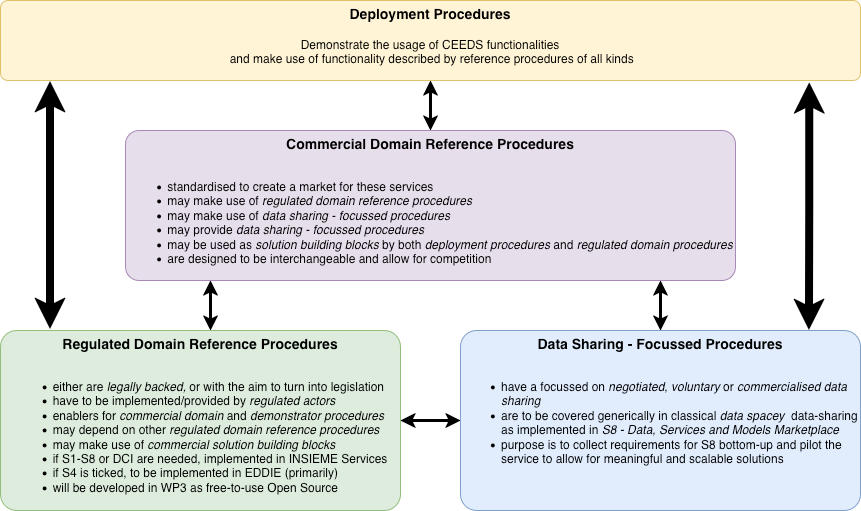

The figure above provides a structured framework for organising how the **functional scope** within the
*Common European Energy Data Space (CEEDS)* and the INSIEME federation are designed, standardised, regulated, and ultimately deployed. The model separates procedures into several complementary
categories, each addressing a distinct dimension of the European energy data ecosystem while maintaining strong interdependencies between them. The framework is aligned with the latest outcomes of the
European Commission’s Data4Energy expert group and foresees a strong governance role for the Energy Data Implementing Acts following Article 24 of Directive (EU) 2019/944.

At the highest level, **Deployment Procedures** represent the operational implementation layer of the framework, describing WHAT is actually deployed as demonstrators in the project. Their primary
purpose is to demonstrate and operationalise CEEDS functionalities by applying the capabilities defined within the various reference procedures. Deployment Procedures translate conceptual and
standardised process definitions into real-world solutions and implementation environments. They enable demonstration projects, pilots, and production deployments that validate both technical
feasibility and regulatory compliance. In essence, Deployment Procedures represent the point where reference models are converted into tangible services and infrastructures, ensuring that CEEDS and
INSIEME functionalities are not only theoretically defined but practically executable.

Central to the framework are the **Commercial-Domain Reference Procedures**, which establish the foundations for market-driven energy data services. These procedures are designed to standardise how
commercial services can be created, exchanged, and scaled across European energy data spaces. They provide reusable solution building blocks that service providers can incorporate into their
offerings, thereby promoting competition and innovation. Commercial-Domain Reference Procedures may rely on regulated domain procedures or data sharing mechanisms, but they remain focused on enabling
voluntary, value-driven service ecosystems. A key characteristic of this layer is interchangeability, which ensures that multiple service providers can deliver comparable services while maintaining
interoperability. Consequently, the Commercial Domain Reference Procedures play a critical role in enabling sustainable business models and supporting the development of a competitive digital energy
service market.

The **Regulated Domain Reference Procedures** form the legal and operational backbone of the framework. These procedures define processes that are either mandated by regulation or expected to become
regulatory requirement, guaranteeing a legally sound availability of needed functionalities. They are typically implemented by regulated actors such as transmission system operators, distribution
system operators, market operators, and regulatory authorities, often as a result of European legislation and/or the Implementing Acts on Data Interoperability following Directive (EU) 2019/944 (like
e.g. Commission Implementing Regulation 2023/1162). Their main objective is to ensure compliance with European and national legislation, guarantee market transparency, and support system reliability
and security of supply. Regulated procedures often establish the baseline infrastructure and governance mechanisms upon which commercial and voluntary services can be built. In this sense, the
regulated domain provides the trusted environment necessary for the broader data ecosystem to function.

Complementing both regulated and commercial procedures are the **Data Sharing-Focused Procedures**. These procedures specifically address mechanisms for voluntary, negotiated, or commercialised data
sharing that extend beyond legally mandated processes. Their purpose is to support innovation by enabling flexible data exchange models between ecosystem participants. Data Sharing-Focused Procedures
are particularly relevant for enabling customer-centric services, advanced analytics, and emerging energy services driven by distributed energy resources and prosumer participation. They also play a
crucial role in feeding requirements into marketplace services, such as the European Data and Services Marketplace, by identifying new opportunities for data-driven value creation. As such, this layer
also represents the experimental and innovation-oriented component of the framework.

All reference procedures may require the utilisation of different **CEEDS Meta-Level Operating Services**, such as participant registries, interoperability testing services, and regulatory compliance
services.

The interaction between these different types of procedures ensures that the ecosystem remains both compliant and innovative. Regulated procedures provide trusted and legally compliant infrastructures
that commercial services can leverage. Commercial procedures translate regulatory and technical capabilities into competitive market services. Data sharing procedures enable experimentation and the
development of new service concepts, which may later evolve into commercial offerings or regulatory processes. Deployment procedures integrate and validate all these elements by implementing them in
real operational contexts.

Overall, the reference procedure model ensures that the European energy data ecosystem evolves in a coordinated and scalable manner. It balances regulatory stability with market flexibility, supports
interoperability across national data spaces, and fosters innovation while maintaining data sovereignty and compliance. Within the INSIEME federation strategy, this layered approach ensures that CEEDS
Meta-Level Operating Services, regulatory processes, commercial service frameworks, and deployment mechanisms work together to create a coherent and resilient European energy data space

### Deployment Procedures

| ID | Pr. | St. | Deployment                              | Commercial | Regulated                                              | Data_Sharing                                | S1 | S2 | S3 | S4 | S5 | S6 | S7 | S8 | DCI |
|----|-----|-----|------------------------------------------|------------|--------------------------------------------------------|---------------------------------------------|----|----|----|----|----|----|----|----|-----|
| 1  |     |     | SavingsFootprint                         | C0001      | T4-2_01, T4-2_02, T4-3_01                              |                                             | X  | X  | X  | X  |    |    | X  |    |     |
| 2  |     |     | ECLIPSE energy app                       |            |                                                        |                                             | X  | X  | X  | X  | X  | X  | X  |    |     |
| 3  |     |     | EC_SCALE – French pilot                  |            |        T4-2_01, T4-2_02, T4-2_03, T4-3_01, T4-4_01 , T4-4_02,                                                |                                             | X  | X  |    | X  |    | X  | X  |    |     |
| 4  |     |     | EC_SCALE – Portuguese pilot              |            |          T4-2_01, T4-2_02, T4-2_03, T4-2_04, T4-3_01,                                              |                                             | X  | X  | X  | X  | X  | X  | X  |    |     |
| 5  |     |     | EC_SCALE – Spanish pilot                 |            |    T4-2_01, T4-2_02, T4-2_03, T4-2_04, T4-3_01,                                                    |                                             | X  | X  |    | X  | X  |    |    |    |     |
| 6  |     |     | EC_SCALE – Austrian pilot                |            |     T4-2_01, T4-2_02, T4-2_03, T4-2_04, T4-3_01,                                                    |                                             |    |    |    |    |    |    |    |    |     |
| 7  |     |     | Cuerva’s Living Lab                      |            | T4-2_01, T4-2_03, T4-3_01, T4-4_01 , T4-4_02           | T4-5_02, T4-5_03, T4-5_04, T4-5_05           |    | X  |    | X  | X  | X  |    |    |     |
| 8  |     |     | Jenny+                                   | C0001      | T4-2_01, T4-2_02, T4-2_03, T4-4_01, T4-4_02            |                                             |    | X  |    | X  | X  | X  |    | X  |     |
| 9  |     |     | SP–Dataspace Connection Adapter          |            |                                                        |                                             | X  | X  | X  | X  |    | X  |    | X  |     |
| 10 |     |     | Metering Point Effectiveness             |            |                                                        |                                             |    | X  | X  |    |    | X  |    |    |     |
| 11 |     |     | ARE                                      |            | T4-4_01, T4-4_02                                       | T4-5_04, T4-5_05                            |    | X  | X  | X  |    | X  |    |    |     |
| 12 |     |     | flexgrid                                 |            |                                                        |                                             |    | X  |    | X  | X  | X  |    | X  |     |
| 13 |     |     | PVFlex                                   |            |                                                        |                                             |    | X  | X  | X  | X  | X  |    |    |     |
| 14 |     |     | eHDMobility                              |            | T4-4_01 , T4-4_02                                      | T4-5_01, T4-5_02, T4-5_03, T4-5_04, T4-5_05 | X  | X  | X  | X  | X  |    | X  |    |     |
| 15 |     |     | OTLL SC                                  |            | T4-2_01, T4-2_02, T4-4_01 , T4-4_02                    | T4-5_04, T4-5_05                            | X  | X  | X  | X  |    | X  | X  |    |     |
| 16 |     |     | Hierarchies                              |            | T4-2_01, T4-2_02, T4-4_01 , T4-4_02                    | T4-5_02, T4-5_04, T4-5_05                   |    | X  |    | X  | X  | X  | X  |    |     |
| 17 |     |     | INTERFLEX                                |            | T4-2_01, T4-2_02, T4-3_01, T4-4_01 , T4-4_02           |                                             | X  | X  | X  |    |    | X  |    | X  |     |
| 18 |     |     | AIGridOpt                                |            |                                                        |                                             |    | X  |    | X  | X  | X  |    |    |     |
| 19 |     |     | PEGNIPO                                  |            | T4-3_01,  T4-4_01 , T4-4_02                            |                                             | X  | X  |    |    |    | X  |    |    |     |
| 20 |     |     | SCDI                                     |            | T4-2_01, T4-2_02,  T4-4_01 , T4-4_02                   |                                             |    | X  |    |    | X  |    | X  | X  |     |

### Commercial Domain Reference Models

You can find an overview of the commercial domain reference models at [Commercial Domain Reference Models](./commercial-domain/commercial-domain.md).

### Regulated Domain Reference Models

You can find an overview of the regulated domain reference models at [Regulated Domain Reference Models](./regulated-domain/regulated-domain.md).

### Data-Sharing Focused Reference Models

You can find an overview of the generic data sharing reference at [Data-Sharing Focused Reference Models](./generic-data-sharing/generic-data-sharing.md).

