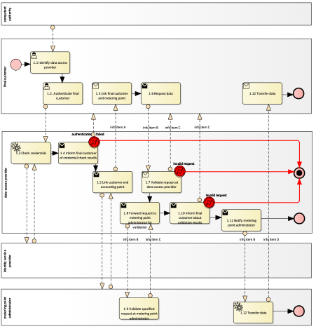
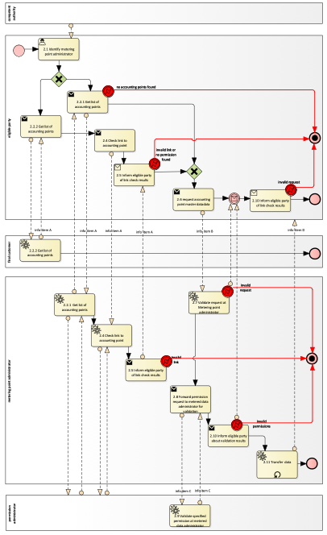
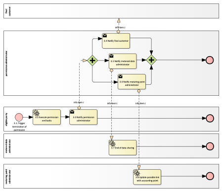
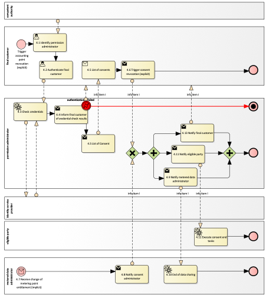
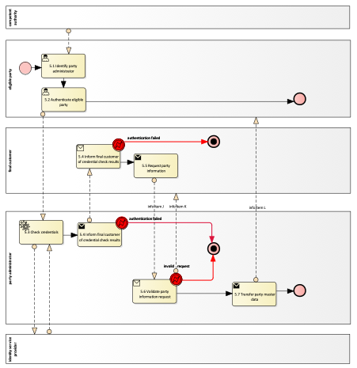
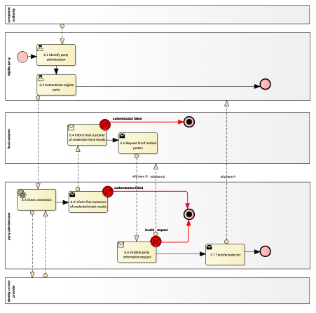

Smart Grids Task Force  - Subgroup Data Interoperability

# Advice for Implementing Act on interoperability requirements and non-discriminatory and transparent procedures for access to common master data.

CONTEXT:

* It was identified that it is advantageous for establishing efficient and maintainable market processes based on data sharing and the eligible party working with that data, that metering point identifiers are de-coupled from the underlying physical metering equipment. That means, that if the underlying physical metering equipment is changed, the metering point identifier doesn’t change. The legal basis for these interoperability requirements and procedures arises from Directive (EU) 2019/944 Articles 23 and 24 with reference to smart metering systems described in Article 20. Previous work of the EU Smart Grids Task Force, especially reports ‘Towards Interoperability within the EU for Electricity and Gas Data Formats and Procedures’ and ‘My Energy Data’ and [TODO reference Part I] has considered these requirements further and has formed the scope and content of this legislative act.
* In many regions, there is more than one way to get master data associated with an accounting point or market party. For example, in some countries, final customers can get their data from their network operator as well as from their supplier. In such cases, only one of these procedures covering the reference model must be mapped, covering at least one procedure for each metering point and for each market party in a Member State.
* Within the context of the procedures described in the reference model, eligible parties are receiving and processing personal data.

Regulation (EU) 2016/679 of the European Parliament and of the Council of 27 April 2016 on the protection of natural persons with regard to the processing of personal data and on the free movement of such data, and repealing Directive 95/46/EC applies to the processing of personal data within the framework of this Implementing Regulation. Given that smart meters qualify as terminal equipment, Directive 2002/58/EC of the European Parliament and of the Council of 12 July 2002 concerning the processing of personal data and the protection of privacy in the electronic communications sector applies as well. Eligible parties have to comply with their obligations under them and under other applicable legislation.
* In the context of the present legislative act, Member States should encourage data access providers and permission administrators to use for their operations as far as possible digital solutions compliant with Regulation (EU) N°910/2014 (the eIDAS Regulation) for identifying electronically and authenticating final customers and/or eligible parties. This will make good use of already rolled out national infrastructure and contribute to increasing the effectiveness of energy-related online services and transactions, electronic business and electronic commerce in the Union. [TODO address potential developments]
* A trustful, digitalised energy market shall have as a principle to verify that the information provided by the parties is exact, creating trust and engagement. Therefore, regular checks on the validity of this essential data should be considered and whereas the verification would not be possible, or negative, final customers and eligible should be informed without undue delay.
* This Implementing Regulation and the reference procedures do not impose any specific approach for the technical implementation of the procedures listed in the reference model. It allows for example the implementation of an independent data hub for energy data or de-centralised infrastructure.
* It is best practice to ensure test structures as mandated in Issues 5 (9) and 7 (6) have sufficient controls in place to prevent side effects on productive environments. This may or may not require physical separation of test structures from productive environments.
* In issue (X) for market party master data and in issue (Y) for accounting point master data, it is mandated that data is made available to its consumers immediately and without undue delay. As a recommendation, in MSs utilising a 'push approach’ for energy market communication, this may mean that the changed data is forwarded immediately after it is changed. In MSs where this information needs to be 'pulled’ actively (e.g., from a data hub), it might be beneficiary to provide notification mechanisms to all entitled parties.
  Reimbursement of costs in the context of this act is regulated in the directive EU 2019/944 article 20 and 23.

In this context, the Smart Grids Task Force is recommending that the Commission services take into account the following elements when they develop the interoperability rules for the implementing acts for access to “metering point and market party master data”, and in line with Article 24 of the Electricity Directive, and accordingly incorporate the issues below.

CHAPTER  I

Regarding GENERAL  PROVISIONS

Issue  1

On subject  matter  and scope

* This Implementing Regulation provides for the establishment of a reference model and minimum requirements for access to accounting point and market party master data, in line with Articles 20(a), 23 and 24 of the Directive (EU) 2019/944.
* This Implementing Regulation applies to Member States to ensure that electricity undertakings apply the interoperability requirements and procedures for access to accounting point and market party master data.
* [FOR_LEGAL_EDITORS: –  include a connecting statement with the General Requirements and the provisions of Part I]
  Issue 2

On definitions

For the purpose of this implementing regulation, the definitions in Article 2 of Directive (EU) 2019/944 [TODO and state that the definitions of Parts I and II] shall apply. In addition, the following definitions shall apply:

* ‘market party’, in the context of this act, means organisations that take part in data exchange for the access to metering and consumption data, master data, supplier switching, demand response and other energy services.
* ‘master data', in the context of this act, means the essential, usually static data that forms the foundation for an effective digitalised energy market communication environment. This data is needed for operational and analytical processes, and it includes the involvement of key business entities and their attributes.
* ‘accounting point’, in the context of this act, means
* ‘connection point’, in the context of this act, means the point where a final customer is connected to the transmission or distribution network. A connection point is identified by a unique set of codes or identifiers that specify its location, technical characteristics, and other relevant information.
  CHAPTER II

Regarding INTEROPERABILITY REQUIREMENTS AND PROCEDURES FOR ACCESS CONNECTION POINT MASTER DATA

Issue 3

On organisational information

Member States shall make the information concerning which parties act as metering point administrator and which parties act as party administrator easily accessible for both final customers and all relevant market parties.

Issue

On responsibilities of party administrator

* Party administrators shall make market party master data available online to final customers and eligible parties, without undue delay and whenever final customer requests access.
* Party administrators shall ensure that final customers can access and make available to eligible parties the party master data under their custody and receive it in a structured, commonly used, machine-readable and interoperable format; making it available via Application Programming Interfaces (APIs) and, as a bulk download
* Party administrators shall ensure that each market party is uniquely identifiable within the scope of a Member States data exchange environment.
* Whenever master data for a market party changes, party administrators shall make available to the final customer and to other market parties the changed information without undue delay.
* Party administrators shall ensure the equal treatment of all eligible parties.
* Party administrators shall maintain and make available to the party a data access log. This information shall be made available online, free of charge, without hindrance and unnecessary delay, whenever the party requests access.
* Whenever data is being transferred to eligible parties, party administrator must ensure in cooperation where applicable with the permission administrator that there is an active consent, legitimate interest or other legal or contractual basis for the data to be transferred.
* Party administrator shall provide eligible parties access to facilities for testing the procedures in this Implementing Regulation.
* Party administrator shall provide eligible parties and other market parties the opportunity to query data at specific points in time, so that they can have a view on the state in the past, the present and on planned future changes.
  Issue

On responsibilities of metering point administrator

* Metering point administrators shall make accounting point master data available online to final customers and eligible parties, without undue delay and whenever the final customer needs to access or share the data.
* Metering point administrator shall ensure that final customers can access and make available to eligible parties their validated metered data and receive it in a structured, commonly used, machine-readable and interoperable format.
* Whenever accounting point master data changes, metering point administrators shall make available to the final customer and eligible parties with an active consent the changed information without undue delay.
* Metering point administrators shall ensure the equal treatment of all eligible parties.
* Metering point administrators shall maintain and make available to the final customer a data access log. This information shall be made available online, free of charge, without hindrance and unnecessary delay, whenever the final customer requests access.
* Whenever data is being transferred to eligible parties, metering point administrators must ensure in cooperation where applicable with the permission administrator that there is an active consent or other legal or contractual basis for the data to be transferred.
* Metering point administrators shall provide eligible parties and final customers the opportunity to query data at specific points in time, so that they can have a view on the state in the past, the present and on planned future changes.
* As long as the data is retained as provisioned by (6), log information as described in (4) shall be kept available.
* Metering point administrators shall provide eligible parties access to facilities for testing the procedures in this Implementing Regulation.
* When metering point administrators are informed about changes in the assignment of final customers to metering points or any other external occurrences that invalidate the existence of active consents previously established within their area of responsibility, they must inform the permission administrator immediately and without unnecessary delay.
  Issue 6

On responsibilities of data access provider

* In accordance to Article 23(2) of Directive (EU) 2019/944, relevant procedures to be used by data access providers for providing access to data as described by the reference model in the annex A1 shall be made publicly available by them.
* Data access providers shall make available online means for final customers to access their accounting point master data in cooperation where applicable with the metered data administrator, without hindrance and unnecessary delay. This shall be possible as defined in the procedures described in scenario ‘access to accounting point master data by the final customer’ in annex A1.
* Data access providers shall maintain and make available to the final customer log information including when the final customer has been provided access to data, which data and when. This information shall be made available online, free of charge, without hindrance and unnecessary delay, whenever the final customer requests access.
* Member states shall ensure that any relevant charges for access to data are set in line with Article 23(5) of Directive (EU) 2019/944.
  Issue 7

On responsibilities of permission administrator

* Permission administrators shall make available online means to grant and revoke consent to eligible parties, without hindrance and unnecessary delay, whenever the final customer needs access. This shall be possible as defined in the procedures described in annex A1.
* Permission administrators shall make available to final customers on their request an overview of active and historical data sharing permissions.
* Permission administrators shall process notifications about invalidations of permissions received in line with the procedures in this Implementing Regulation.
* When permission administrators are notified of an invalidation of a consent, they shall inform the metered data administrator (steps 3.5 and 4.9 in Annex A), the eligible party (if needed, as in step 4.11), the party administrator, the metering point administrator, and the final customer (as in step 3.4 and 4.13) without unnecessary delay.
* Permission administrators shall maintain to the customer a consent provision log. This information shall be made available online, free of charge, without hindrance and unnecessary delay, whenever the final customer requests access.
* Permission administrators shall provide eligible parties access to facilities for testing the procedures in this Implementing Regulation.
* In accordance with Article 23(5) of Directive (EU) 2019/944, relevant procedures to be used by permission administrators for providing access to data as described by the reference model in annex A1 shall be made publicly available by them.
  [END TODO REVIEW RESPONSIBILITIES]

ANNEX A

A1. The reference model for common master data

Table I contains information needed by eligible parties to set up for utilising connection point master data access in a Member State. It is primarily describing information that needs to be accessible for them to register, onboard or establish prerequisite infrastructure to take part in the procedures listed in Table III.

| Table I - General information on Member State environments | Table I - General information on Member State environments | Table I - General information on Member State environments |
| --- | --- | --- |
| ID | Name | Description |
| I1 | National competent authority |  |
| I2 | MS system for ‘‘connection point’ identification |  |
| I3 | MS system for ‘'accounting point’ identification |  |
| I6 | Information on Member State data exchange environment 
(needs to be mapped once per data exchange environment) |  |
| I7 | Information about metering point administrators in a Member State 
(one mapping per each active Metering point administrator metering point administrator operator in a Member State) |  |
| I8 | Information about permission administrators in a Member State 
(at least one mapping per each active consent administrator in a Member State) |  |
| I9 | Party administrator
(at least one party administrator for each party in the Member State of types Metering point administrator, metered data administrator, meter operator, data access provider, Permission administrator,
Eligible party) |  |

[TODO REVIEW WHICH ROLES ARE NEEDED AND BRING IN LINE WITH HEMRM AND LEGISLATION]

[TODO CAN WE REFER TO THE ROLES IN THE OTHER ANNEX? DO WE NEED NEW ROLES FOR MASTER DATA?]

| Table II - Roles | Table II - Roles | Table II - Roles |
| --- | --- | --- |
| Role name | Role type | Role description |
| Final customer | Business | A party connected to the grid that purchases electricity for its own use.
Please note, that this also includes the case of active customer. |
| Competent authority | Business | The national competent authority providing the mappings of national practices. It makes them available online and in an easily usable and publicly accessible form. |
| Party administrator | Business | A party responsible for maintaining the market party characteristics for the energy sector. |
| Eligible party | Business | An ’eligible party' as referred to in 2019/944 Article 23 (2) offering energy-related services to the final customer, but not necessarily directly active in the energy value chain or the physical infrastructure itself.  This can be, amongst others, energy service companies, other final customers, balancing service providers, system operators, energy suppliers. |
| Metered data administrator | Business | A party responsible for storing and distributing validated historical consumption data. |
| Metering point administrator | Business | A party responsible for administrating and making available the metering point characteristics, including registering the parties linked to the metering point. |
| Data access provider | Business | A party responsible for facilitating access to validated historical consumption and accounting point master data to the ‘final customer’. |
| Permission administrator | Business | A party responsible for administrating a register of data access permissions for a set of metering points. The ‘permission administrator’ makes this information available on request for entitled eligible parties in the sector. |
| Identity service provider | Business | A party that manages identity information. It issues, stores, protects, maintains, and manages identity information for a natural or legal person and provides authentication services to relying parties. |
| Meter operator | Business | A party responsible for installing, maintaining, testing, 
certifying and decommissioning physical meters. |

All roles of type Business are expected to be acting in secure, authenticated manner and through trusted communication channels. For this reason, the authentication steps used for these communication partners are not listed in the scenarios below.

[TODO DIFFER BETWEEN METERING POINT AND ACCOUNTING POINT MASTER DATA?]

[PROVIDE A CLEAR DISTINCTION BETWEEN WHAT IS PHYSICAL AND WHAT IS IN THE MARKET – ACCOMPANYING REPORT - ]

| Table III - Procedure Conditions | Table III - Procedure Conditions | Table III - Procedure Conditions | Table III - Procedure Conditions |
| --- | --- | --- | --- |
| No. | Procedure name | Primary actor | Pre-condition |
| Information Object Accounting Point Master Data | Information Object Accounting Point Master Data | Information Object Accounting Point Master Data | Information Object Accounting Point Master Data |
| 1 | Access to accounting point master data by the final customer | Final customer | Final customer is onboarded. |
| 2 | Access to accounting point master data by an eligible party | Eligible party | Final customer is onboarded.
Eligible party is onboarded. |
| 3 | Termination of access to future accounting point master data changes by the eligible party | Eligible party | Scenario 2 has been performed and there is an active permission. |
| 4 | Revocation of access to future accounting point master data changes by the final customer | Final customer | Scenario 2 has been performed and there is an active permission. |
| Information Object Market Party Master Data | Information Object Market Party Master Data | Information Object Market Party Master Data | Information Object Market Party Master Data |
| 5 | Access to market party master data | Any party | - |
| 6 | Access to list of market parties by their role | Any party | - |

All diagrams describing the scenarios are of an illustrative nature and follow Business Process Model and Notation 2.0. Information objects referred in columns Information exchanged (IDs) are defined in Table IV.

[TODO DEFINE NEEDED PROCEDURES STEP BY STEP TOGETHER WITH INFORMATION EXCHANGED]

| Table III.1 – Procedure 1 | Table III.1 – Procedure 1 | Table III.1 – Procedure 1 | Table III.1 – Procedure 1 | Table III.1 – Procedure 1 | Table III.1 – Procedure 1 |
| --- | --- | --- | --- | --- | --- |
| Procedure name | Procedure name | Access to accounting point master data by the final customer | Access to accounting point master data by the final customer | Access to accounting point master data by the final customer | Access to accounting point master data by the final customer |
| Step No. | Step | Step description | Information producer (actor) | Information receiver (actor) | Information exchanged (IDs) |
| 1.1 | Identify data access provider | Final customers identify the data access provider that is responsible for their accounting points under consideration. | Competent authority | Final customer | [not relevant] |
| 1.2 | Authenticate final customer | Final customers identify themselves to the data access provider. | Final customer | Data access provider | [not relevant] |
| 1.3 | Check credentials | Data access provider transfers authentication information to identity service provider. | Data access provider | Identity service provider | [not relevant] |
| 1.4 | Inform final customer of credential check results | Data access provider communicates validation result and provide a meaningful indication in case of an invalid request. | Data access provider | Final customer | [not relevant] |
| 1.5 | Link final customer and accounting point | Final customer finds out accounting point id to request data for. | Data access provider | Final customer | A – Accounting point identification |
| 1.6 | Request data | Final customers specify the requested data. | Final customer | Data access provider | B - Accounting point master data request |
| 1.7 | Validate request at data access provider | The data access provider validates the specified permission request and provide a meaningful indication in case of an invalid request. | Data access provider | Final customer | C - Request validation information |
| 1.8 | Forward request to metering point administrator for validation | Check if the specification of the requested data in terms of time, scope, accessibility etc. is acceptable. | Data access provider | Metering point administrator | B - Accounting point master data request |
| 1.9 | Validate specified request at metering point administrator | The metering point administrator validates the specified permission request. | Metering point administrator | Data access provider | C - Request validation information |
| 1.10 | Inform final customer about validation results | If the input is not valid, a meaningful message should indicate the reason. | Data access provider | Final customer | C - Request validation information |
| 1.11 | Notify metering point administrator | Accounting point master data request needs to be notified to provide the requested data package. | Data access provider | Metering point administrator | B - Accounting point master data request |
| 1.12 | Transfer data | Final customers receive without undue delay the requested data. | Metering point administrator | Final customer | D – Accounting point master data |

| Table III.2 – Procedure 2 | Table III.2 – Procedure 2 | Table III.2 – Procedure 2 | Table III.2 – Procedure 2 | Table III.2 – Procedure 2 | Table III.2 – Procedure 2 |
| --- | --- | --- | --- | --- | --- |
| Procedure name | Procedure name | Access to accounting point master data by an eligible party | Access to accounting point master data by an eligible party | Access to accounting point master data by an eligible party | Access to accounting point master data by an eligible party |
| Step No. | Step | Step description | Information producer (actor) | Information receiver (actor) | Information exchanged (IDs) |
| 2.1 | Identify metering point administrator | Eligible party identify the metering point administrator that is responsible for registering the parties linked to the accounting points under consideration. | Competent authority | Eligible party | [not relevant] |
| 2.2 | Get list of accounting point | Eligible party finds out accounting point id to request data for. | Final customer or metering point administrator | Eligible party | A – Accounting point identification |
| 2.3 | Validate permission at permission administrator | Beside those accounting points that already are linked to the eligible party, the metering point administrator checks with the permission administrator if there are other accounting points for which there is permission for the eligible party having access to. | Permission administrator | Metering point administrator | A – Accounting point identification |
| 2.4 | Check link to accounting point and inform | Metering point administrator checks if the Eligible party is linked to the accounting point(s) given by the final customer and informs about the result, including information if it was an invalid request. | Metering point administrator | Eligible party | A – Accounting point identification |
| 2.5 | Validate permission at permission administrator | Beside those accounting points that already are linked to the eligible party, the metering point administrator checks with the permission administrator for the other accounting points given by the final customer if there is permission for the eligible party having access to. | Permission administrator | Metering point administrator | A – Accounting point identification |
| 2.6 | Request data | Eligible party specify accounting point(s) to get access to. | Eligible party | Metering point administrator | B – Accounting point master data request |
| 2.7 | Validate request at Metering point administrator | Metering point administrator checks if the eligible party is linked to and allowed to receive the information about the accounting point(s) (i.e. checks if the specification of the requested data in terms of time, scope, accessibility, entitlement, etc. is acceptable). | Metering point administrator | Eligible party | [not relevant] |
| 2.8 | Validate request at permission administrator | In step 2.7, if the eligible party is not linked to the accounting point, the metering point administrator can check with the permission administrator if there is a permission for the eligible party for the accounting point, given the terms in the request. | Permission administrator | Metering point administrator | C – Request validation information |
| 2.9 | Inform eligible party about negative validation result | If the eligible party is not linked nor have permission to the accounting point master data, a meaningful message should indicate the reason. | Metering point administrator | Eligible party | C - Request validation information |
| 2.10 | Send data/Receive data | Eligible party receive without undue delay the requested data. | Metering point administrator | Eligible party | D – Accounting point master data |

| Table III.3 – Procedure 3 | Table III.3 – Procedure 3 | Table III.3 – Procedure 3 | Table III.3 – Procedure 3 | Table III.3 – Procedure 3 | Table III.3 – Procedure 3 |
| --- | --- | --- | --- | --- | --- |
| Procedure name | Procedure name | Termination of access to accounting point master data by the eligible party | Termination of access to accounting point master data by the eligible party | Termination of access to accounting point master data by the eligible party | Termination of access to accounting point master data by the eligible party |
| Step No. | Step | Step description | Information producer (actor) | Information receiver (actor) | Information exchanged (IDs) |
| 3.1 | Trigger termination of permission | Eligible party considers the service or purpose referred by the consent terminated. | Eligible party | - | [not relevant] |
| 3.2 | Execute permission end tasks | The eligible party shall perform all tasks required to fulfil its related responsibilities immediately and without undue delay and in accordance with Regulation (EU) 2016/679. | Eligible party | - | [not relevant] |
| 3.3 | Notify permission administrator | The eligible party immediately and without unnecessary delay shall inform the permission administrator. | Eligible party | Permission administrator | J – Notification of termination of service |
| 3.4 | Notify final customer | The permission administrator makes available the information that the permission has been revoked to the final customer. | Permission administrator | Final customer | J – Notification of termination of service |
| 3.5 | Notify metered data administrator | The permission administrator forwards the respective notification to the metered data administrator. | Permission administrator | Metered data administrator | J – Notification of termination of service |
| 3.6 | Notify metering point administrator operator | The permission administrator forwards the respective notification to the Metering point administrator operator. | Permission administrator | Metering point administrator operator | J – Notification of termination of service |
| 3.7 | End of data sharing | The metered data administrator stops transferring data to the eligible party. | Metered data administrator | Eligible party | J – Notification of termination of service |
| 3.8 | Update possible link with accounting point | The metering point administrator operator checks if the link between the eligible party and the accounting point will be affected. | Metering point administrator |  |  |

| Table III.4 – Procedure 4 | Table III.4 – Procedure 4 | Table III.4 – Procedure 4 | Table III.4 – Procedure 4 | Table III.4 – Procedure 4 | Table III.4 – Procedure 4 |
| --- | --- | --- | --- | --- | --- |
| Procedure name | Procedure name | Revocation of access to accounting point master data by the final customer | Revocation of access to accounting point master data by the final customer | Revocation of access to accounting point master data by the final customer | Revocation of access to accounting point master data by the final customer |
| Step No. | Step | Step description | Information producer (actor) | Information receiver (actor) | Information exchanged (IDs) |
| 4.1 | Identify consent administrator | Final customers identify the consent administrator that is responsible for their metering points under consideration. | Competent authority | Final customer | [not relevant] |
| 4.2 | Authenticate final customer | Final customers identify themselves to the consent administrator. | Final customer | Consent administrator | [not relevant] |
| 4.3 | Check credentials | Consent administrator transfers authentication information to identity service provider. | Consent administrator | Identity service provider | [not relevant] |
| 4.4 | Inform final customer of credential check results | Consent administrator communicates validation result and provide a meaningful indication in case of an invalid request. | Consent administrator | Final customer | [not relevant] |
| 4.5 | List of consents | Consent administrator makes available to the final customer a list of active and expired consents he has previously given | Consent administrator | Final customer | I – Established consent information |
| 4.6 | Trigger consent revocation (explicit) | The final customer indicates to the consent administrator which consent shall be revoked. | Final customer | Consent administrator | I – Established consent information |
| 4.7 | Receive change of metering point entitlement (implicit) | External reasons (e.g., a move-out) lead to an invalidation of the entitlement of a final customer to a metering point. The Metering point administrator informs the metered data administrator about these events. | Metering point administrator | Metered data administrator | [not relevant] |
| 4.8 | Notify consent administrator | Metered data administrator informs the consent administrator about the necessity to revoke all consents for the metering point. | Metered data administrator | Consent administrator | I – Established consent information |
| 4.9 | Notify metered data administrator | The consent administrator informs the metered data administrator about the revocation. | Consent administrator | Metered data administrator | I – Established consent information |
| 4.10 | End data sharing | The metered data administrator must not transfer data under the scope of the revoked consent anymore. | Metered data administrator | [not relevant] | [not relevant] |
| 4.11 | Notify eligible party | The consent administrator must inform the affected eligible party immediately and without unnecessary delay. | Consent administrator | Eligible party | I – Established consent information |
| 4.12 | Execute consent end tasks | The eligible party performs all tasks required to fulfil its related responsibilities immediately and without undue delay and in accordance with Regulation (EU) 2016/679. | Eligible party | [not relevant] | [not relevant] |
| 4.13 | Notify final customer | The consent administrator makes available the information that the consent has been revoked to the final customer. | Consent administrator | Costumer | I – Established consent information |

| Table III.5 – Procedure 5 | Table III.5 – Procedure 5 | Table III.5 – Procedure 5 | Table III.5 – Procedure 5 | Table III.5 – Procedure 5 | Table III.5 – Procedure 5 |
| --- | --- | --- | --- | --- | --- |
| Procedure name | Procedure name | Access to market party master data | Access to market party master data | Access to market party master data | Access to market party master data |
| Step No. | Step | Step description | Information producer (actor) | Information receiver (actor) | Information exchanged (IDs) |
| 5.1 | Identify party administrator | Party identifies the party administrator. | Competent authority | Eligible party | [not relevant] |
| 5.2 | Authenticate eligible party | If applicable, party authenticates at party administrator | Eligible party | Party administrator | [not relevant] |
| 5.3 | Check credentials | Party administrator transfers authentication information to identity service provider. | Party administrator | Identity service provider | [not relevant] |
| 5.4 | Inform party of credential check results | Party administrator communicates validation result and provides a meaningful indication in case of an invalid request. | Party administrator | Final customer | [not relevant] |
| 5.5 | Request party information | Eligible parties specify the data they intend to access. | Final customer | Party administrator | J - Party information request |
| 5.6 | Validate party information request | The party administrator validates the request and provides a meaningful indication in case of an invalid request. | Party administrator | Final customer | K- Request validation information |
| 5.7 | Transfer party master data | The party administrator provides the party’s master data. | Party administrator | Eligible party | L– Party master data |

| Table III.6 – Procedure 6 | Table III.6 – Procedure 6 | Table III.6 – Procedure 6 | Table III.6 – Procedure 6 | Table III.6 – Procedure 6 | Table III.6 – Procedure 6 |
| --- | --- | --- | --- | --- | --- |
| Procedure name | Procedure name | Access to list of market parties by their role | Access to list of market parties by their role | Access to list of market parties by their role | Access to list of market parties by their role |
| Step No. | Step | Step description | Information producer (actor) | Information receiver (actor) | Information exchanged (IDs) |
| 6.1 | Identify party administrator | Party identifies the party administrator. | Competent authority | Eligible party | [not relevant] |
| 6.2 | Authenticate eligible party | If applicable, party authenticates at party administrator | Eligible party | Party administrator | [not relevant] |
| 6.3 | Check credentials | Party administrator transfers authentication information to identity service provider. | Party administrator | Identity service provider | [not relevant] |
| 6.4 | Inform party of credential check results | Party administrator communicates validation result and provides a meaningful indication in case of an invalid request. | Party administrator | Final customer | [not relevant] |
| 6.5 | Request list of market parties | Eligible parties specify the data they intend to access. The final customer provides the role of the parties and the point in time of validity. | Final customer | Party administrator | O – Market party list request |
| 6.6 | Validate party information request | The party administrator validates the request and provides a meaningful indication in case of an invalid request. | Party administrator | Final customer | K - Request validation information |
| 6.7 | Transfer party list | The party administrator provides the list of parties for the respective role and timestamp. | Party administrator | Eligible party | P – Market party list |

| Table IV - Information exchanged | Table IV - Information exchanged | Table IV - Information exchanged |
| --- | --- | --- |
| Information exchanged, ID | Name of information | Description of information exchanged |
| A | Accounting point identification |  |
| B | Accounting point master data request |  |
| C | Request validation information |  |
| D | Accounting point master data |  |
| D | Preset consent information |  |
| H | Basic consent information |  |
| I | Established consent information |  |
| J | Notification of termination of service |  |
| K | Details of information on listed consent |  |
| L | Revocation notification by consent administrator |  |
| M | Party information request |  |
| N | Party master data |  |
| O | Party list request | List of the following objects: |
| P | Party list |  |
