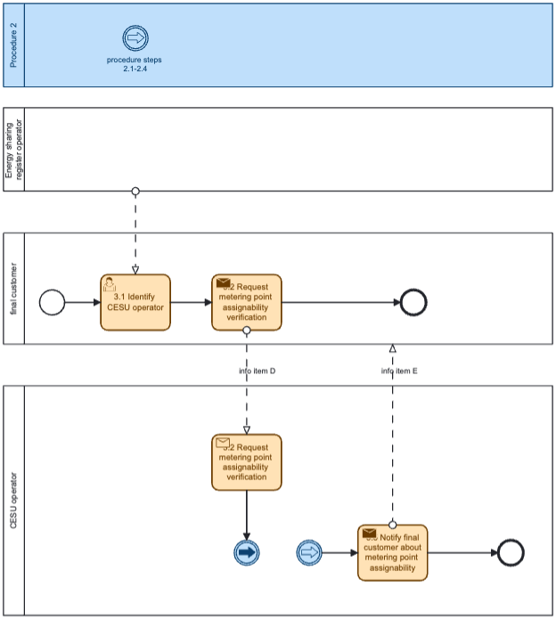
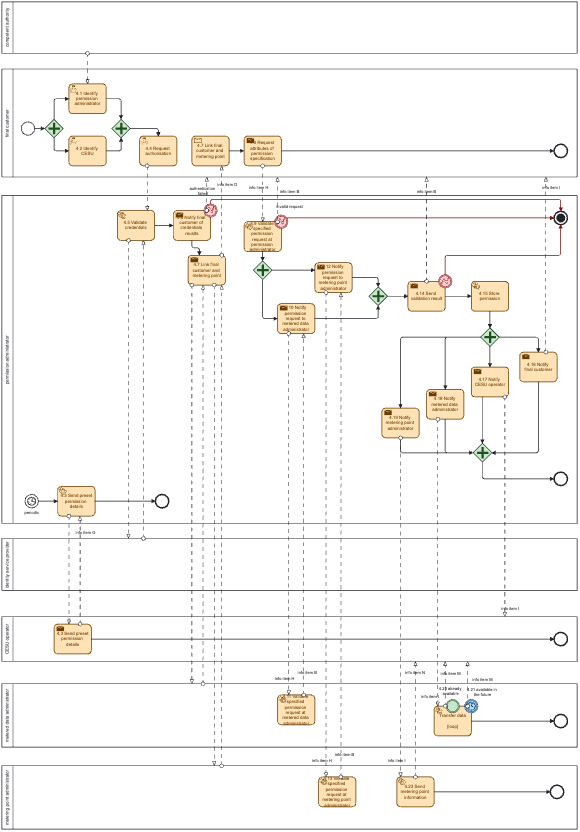
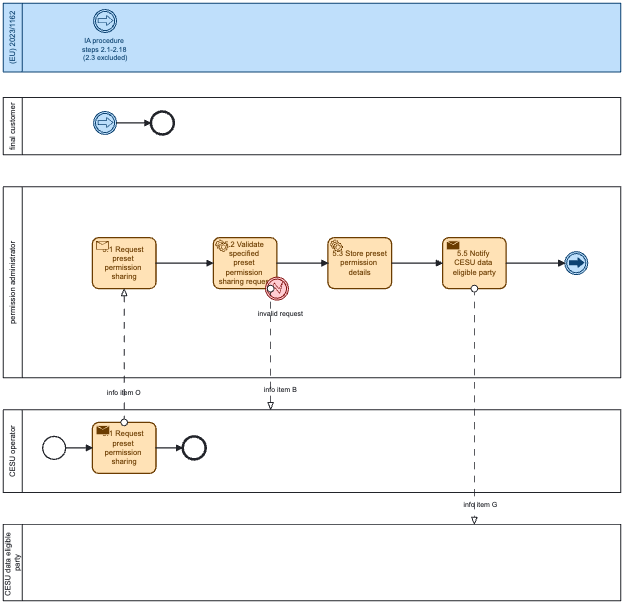
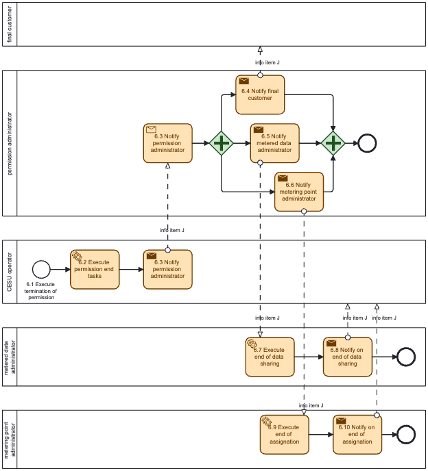
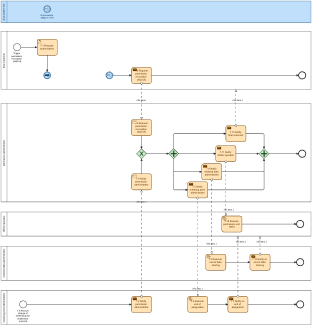
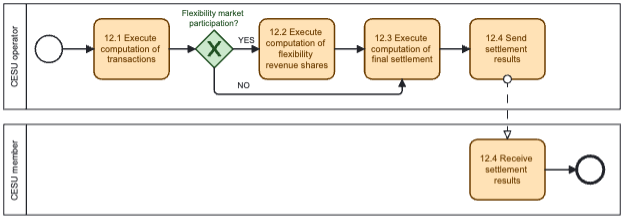
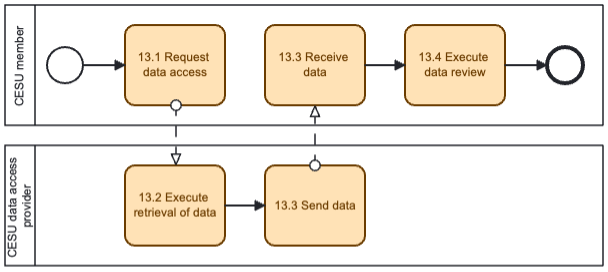
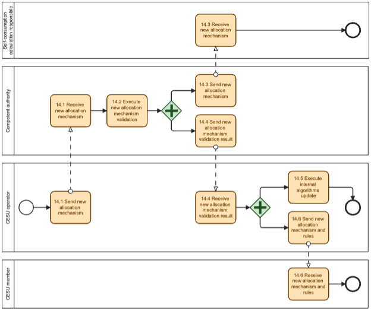

## Context

Project INSIEME – Work package 4

Task 03 – #01 Collective and optimized energy sharing for Energy Communities use cases

## Definitions

In this section, each term is defined:

* ‘energy sharing’ means the self-consumption by active customers of renewable energy either generated or stored offsite or on sites between them by a facility they own, lease or rent in whole or in part or the right to which has been transferred to them by another active customer for a price or free of charge; [as of Directive (EU) 2019/944]
* ‘active customer’ means a final customer, or a group of jointly acting final customers, who consumes or stores electricity generated within its premises located within confined boundaries or self-generated or shared electricity within other premises, or who sells self-generated electricity or participates in flexibility or energy efficiency schemes, provided that those activities do not constitute its primary commercial or professional activity; [as of Directive (EU) 2019/944]
* ‘renewable energy community’ means a legal entity [as of Directive (EU) 2018/2001] Which, in accordance with the applicable national law, is based on open and voluntary participation, is autonomous, and is effectively controlled by shareholders or members that are located in the proximity of the renewable energy projects that are owned and developed by that legal entity; The shareholders or members of which are natural persons, SMEs or local authorities, including municipalities; The primary purpose of which is to provide environmental, economic or social community benefits for its shareholders or members or for the local areas where it operates, rather than financial profits
* ‘citizen energy community’ means a legal entity that [as of Directive (EU) 2019/944] Is based on voluntary and open participation and is effectively controlled by members or shareholders that are natural persons, local authorities, including municipalities, or small enterprises; has for its primary purpose to provide environmental, economic or social community benefits to its members or shareholders or to the local areas where it operates rather than to generate financial profits; and may engage in generation, including from renewable sources, distribution, supply, consumption, aggregation, energy storage, energy efficiency services or charging services for electric vehicles or provide other energy services to its members or shareholders;
* ‘energy from renewable sources or renewable energy’ means energy from renewable non-fossil sources, namely wind, solar (solar thermal and solar photovoltaic) and geothermal energy, ambient energy, tide, wave and other ocean energy, hydropower, biomass, landfill gas, sewage treatment plant gas, and biogas;
* ‘Collective Self-Consumption (CSC)’: Self-Consumption means consuming the electricity that one produces as opposed to providing that energy to the grid. Adding collective to the equation means doing so beyond the individual. CSCs structures can be influenced by proximity criteria which may not be limited to geographical, and concern electrical relation such as connection to a given transformer.
* ‘Microgrids’: A microgrid is a local energy grid that often operates on a private behind the grid meter circuit, sometimes with the ability to connect to the wider network. Essentially, a standard grid but just on a smaller private scale.
* ‘Positive Energy Districts (PEDs)’: Positive Energy Districts, sometimes referred to as Positive Energy Neighborhoods, are energy efficient and energy flexible urban areas or groups of connected buildings integrating local renewables or sourcing them through local guarantees of origins which produce net zero greenhouse gas emissions and actively manage an annual local or regional surplus production of renewable energy. PEDs move beyond electricity and enter the realms of mobility sharing, heat distribution and insulation
* ‘Smart Local Energy Systems’: a Smart Local Energy System (SLES) is a way to bring together different energy assets and infrastructure in a local area or within a renewable energy community, citizen energy community or CSC and make them operate in a smarter way. SLESs automate the use of DERs optimizing the assignment of the necessary coefficients to active customers and automate the trading of associated asset flexibility in energy and ancillary service markets.
* ‘District Self Balancing’: District Self-Balancing is a means of optimization of local grid assets shaped to allow for efficient and effective utilization of DERs, through the capacity to balance supply and demand autonomously at district level and optimize power dispatch. DSB is based on the requirement that DSOs offer a constrained connection to all DSB customers, through different models, and ensure real-time data transparency on network congestions, but do not gain privileged control over connected assets or associated data. This helps solving local congestion challenges and minimize costly grid reinforcements that might be mitigated by the deployment of new decentralized forms of smart electrical load and generation.
* ‘Allocation Coefficient’: Allocation coefficients for collective self-consumption within a CESU are percentages that are used to compute how energy from some CESU member is allocated to other CESU members. Although most regulatory frameworks only allow positive allocation coefficients that must add up 100%, more flexible approaches could also make sense (see [ref] for a discussion on these constraints, especially when providing flexibility to third parties).

## Harmonized roles

All roles of type ‘Business’ are expected to be acting in a secure, authenticated manner and through trusted communication channels. For this reason, the authentication steps used for these communication partners are not listed in the procedures below.

| Role name | Role type | Role description |
|---|---|---|
| Final customer | Business | A party connected to the grid that purchases electricity for its own use. Please note, that this also includes the case of active customer. an individual system user or an entity representing / aggregating several system users (such as citizen energy community, owner of EV charging point in a parking of a housing complex…) |
| Competent authority | Business | A competent authority could be a public or private entity in a Member State. |
| Collective energy sharing unit (CESU) operator | Business | A party responsible for organising a collective energy sharing unit settlement and billing. |
| Technical Aggregator | System | A third party, delegated by the final customer, who combines and controls multiple CUs, and interacts with a Service Provider |
| Metering point administrator | Business | A party responsible for administrating and making available the metering point characteristics, including registering the parties linked to the metering point. |
| Metered data administrator | Business | See Commission Implementing Regulation (EU) 2023/1162. |
| Permission administrator |  | Refers in particular to “smaller” DSOs which do not own / rollout smart metering in direct (leverage From first Implementing Act: A party responsible for administering a register of data access permissions for a set of metering points, making this information available to final customers and eligible parties in the sector, on request. |
| Self-consumption calculation responsible | Business | A party responsible for calculating residual energy and the distribution of self-consumption within a collective energy sharing unit. |
| Collective energy sharing unit (CESU) platform operator | Business | A party responsible for developing, maintaining and operating a digital platform for the operation of a single collective energy sharing unit or multiple collective energy sharing units. |
| Collective energy sharing unit member | Business | Member of a collective energy sharing unit. |
| Supplier | Business | The supplier is responsible for supplying the residual grid usage. |
| Independent aggregator | Business | The independent aggregator has the role of buying the energy surplus and bringing it to the market, being a balance responsible party. |
| Energy sharing register operator | Business | A party responsible to operate the register of energy communities and the members of these communities. |
| CESU data eligible party | Business | A third party entitled to request access to relevant data of a collective energy sharing unit. |
| CESU data access provider | Business | A party providing the data access service which enabled collection of energy data under CESU member consent |
| Data access provider | Business | A party responsible for facilitating access, including in cooperation with other parties, to validated historical metering and consumption data to the final customer or to eligible parties. |
| Flexibility Service Provider (FSP) | Business | A market participant with a legal or contractual obligation to supply local or balancing services to the System Operator |
| System Operator (SO) | Business | DSO or TSO procuring balancing or local services |
| Connecting system operator (CSO) | Business | The national competent authority providing the mappings of national practices. It makes them available online and in an easily usable and publicly accessible form1. |
| Flexibility requesting party (FRP) | Business | A party that has an agreement with one or more flexibility service providers to provide a flexibility service [ref][ref]. Can be a DSO, TSO, or BRP [ref]. |
| Flexibility market operator (FMO) | Business | A party responsible for operating a flexibility market, i.e., provides a service whereby the offers to sell flexibility are matched with bids to buy flexibility (adapted from [ENTSO-E]). |

## Procedure conditions

The status label indicates whether a procedure is mature and established in country Member State contexts, or whether it refers to new processes and workflows which are gaining maturity and are considered important in the overall collective energy sharing reference model.

| No. | Status/ phasing | Procedure name | Primary actor | Pre-condition |
|---|---|---|---|---|
| 1 | Phase 1 | Registration of a collective energy sharing unit | CESU operator | The collective energy sharing unit is formally established. |
| 2 | Phase 1 | CESU operator queries if metering point may be assigned | CESU member | CESU is established. |
| 3 | Phase 1 | Final customer queries if metering point may be assigned to a CESU | Final customer | CESU is established. |
| 4 | Phase 1 | CESU operator requests metering point to be added to the unit [optionally] with the info of the share of the energy allocation | CESU operator | CESU is established. |
| 5 | Phase 2 | CESU operator requests metering point to be assigned to CESU data eligible party too | CESU operator | At least one accounting point of the final customer is assigned to the CESU. |
| 6 | Phase 1 | CESU operator requests accounting point to be removed from CESU | CESU operator | CESU is established. |
| 7 | Phase 1 | Final customer requests its accounting point to be removed from CESU | Final customer | Accounting point is part of CESU. |
| 8 | Phase 2 | Support to short-term flexibility markets | Flexibility market operator | CESU is established. Flexibility market is established. Flexibility service provider completed company qualification and assets qualification to participate in a local flexibility market. CESU operator acts as a technical aggregator that centrally manages the flexible resources of the CESU members willing to provide this service and operates as a flexibility service provider or contract a flexibility service provider to bring the bids to the market and operates as a flexibility service provider or contract a flexibility service provider to bring the bids to the market. |
| 9 | Phase 1 / Phase 2 | Energy management w/wo flexibility provision | CESU operator | CESU is established. CESU (acting as flexibility service provider) completed company qualification and assets qualification. Note: Energy management without flexibility corresponds to phase 1, and with flexibility provision corresponds to phase 2 |
| 10a | Phase 2 | Flexibility verification and settlement done by FRP | Flexibility requesting party | Procedure 8 pre-conditions. participating in flexibility provision. Flexibility market is established. |
| 10b | Phase 2 | Flexibility verification and settlement done by flexibility market operator or other third-party support tool | Flexibility market operator | Procedure 8 pre-conditions. participating in flexibility provision. Flexibility market is established. |
| 11a | Phase 1 | Receive self-consumption information for CESU without CESU intervention | Self-consumption calculation responsible | CESU is established and metering points are added to it. Energy allocation mechanism is established and communicated to the self-consumption calculation responsible. |
| 11b | Phase 1 | Receive self-consumption information for CESU from CESU dynamic allocation | Self-consumption calculation responsible | CESU is established and metering points are added to it. Dynamic energy allocation mechanism is established and communicated to the self-consumption calculation responsible. |
| 12 | Phase 1 / Phase 2 | CESU internal settlement w/wo flexibility provision | CESU operator | For phase 2: Procedure 8 pre-conditions.  CESU is established.  Flexibility market is established.  Note: CESU internal settlement without flexibility corresponds to phase 1, and with flexibility provision corresponds to phase 2 |
| 13 | Phase 1 | Direct access to its own data by CESU member | CESU member | CESU is established. |
| 14 | Phase 1 | Change the allocation mechanism of the CESU | CESU operator | CESU is established.  New rules have been discussed and agreed among the CESU members offline. |
| 15 | Generic | Company qualification for participating in flexibility markets | Flexibility market operator | CESU is established. CESU can operate as a flexibility service, or contract one to represent it in the flexibility market. Flexibility market is established. |
| 16 | Generic | Assets qualification for participating in flexibility markets | Flexibility market operator | CESU is established. CESU can operate as a flexibility service, or contract one to represent it in the flexibility market. Flexibility market is established. |

## Procedures

Procedures for CESU registration, CESU member or final customer onboarding and consent management, access to metering data of accounting point and participation termination

The registration process for a collective energy sharing community begins with selecting participants and identifying their Distributed Energy Resources (DERs) in accordance with the CESU’s goal. This involves evaluating the DERs consumption / production and estimate the economic viability of the community's business model, for instance using a Digital Twin. Economic modeling and financial planning are conducted to support recruitment. CESU operators then attract public and/or private resources to establish and manage a Collective Energy Sharing community. In some countries, Public funding allocation is determined by Distribution System Operators (DSOs), in others by other public authorities (for example CNMC - Comisión Nacional del los Mercados y la Competencia in Spain) taking into account the opportunity to defer grid reinforcements. The use of the public low-voltage grid is compensated in a cost-reflective manner.

A collective self-consumption community is legalized under national regulation. It can be a cooperative, association, or other forms of legal structures recognized in the respective country. The registration requires the establishment of a governance structure that outlines the roles and responsibilities of members, decision-making processes, and profit-sharing mechanisms. The registration process involves the Collective Energy Sharing Unit (CESU) operator, the Final Customer or CESU member, the Distribution System Operator and the locally relevant public validating authority (such as a regulator of ministry of energy). Openness to all energy users is essential; Collective Energy Sharing community schemes should be available to all end-users, from households to industry. This inclusivity ensures the full activation of all Distributed Energy Resources (DERs). Furthermore, CESU communities should be implemented fairly and in a socially responsible manner, ensuring that those who choose not to participate are not disadvantaged. Additionally, consumers wishing to opt for alternative aggregation schemes should still have the freedom to do so, even if they are located within a CESU (when they are registered as CESU member, meaning have their DERs registered in the CESU)

The technical onboarding procedures involve the validation by locally relevant public validating authority (for example ministry of energy in some countries), the technical verification/ assessment from the System Operator on the possibility for a member to enroll in the Collective Energy Sharing Unit, and the CESU member’s consent to collect his energy data (metering or sub metering) and for the qualification of his Control Unit (CU) / Distributed Energy Resource (DER) into a DER Group or Collective Energy Sharing Unit (CESU). Consent is of utter importance as the customer should preserve full control of private data as developed in the EU Data Governance Act. This technical onboarding procedure is coordinated by the CESU operator in collaboration with the participant, system operator, leveraging a data access providing service. The data access providing service should allow any participant to authenticate in the service, identify their DER(s) through unique accounting point(s), run through a consent activation form or a consent revocation form. The CESU operator should be informed about participant consent and also be able to query if an accounting point may be assigned and request an accounting point to be added to the CESU or removed from the CESU, in collaboration with the relevant CESU member.

#### Procedure 1 - Registration of a collective energy sharing unit

| Step No. | Step | Step description | Info producer | Info consumer | Information exchanged |
|---|---|---|---|---|---|
| 1.1 | Identify energy sharing register operator | CESU operators identify the energy sharing register operator that is responsible for operating the register of the energy communities. | Competent authority | CESU operator | [not relevant] |
| 1.2 | Request for CESU registering | CESU operators request the energy sharing register operator to register a new CESU. | CESU operator | Energy sharing register operator | A – CESU registration request |
| 1.3 | Validate specified CESU registration request | Energy sharing register operator validates the CESU registration request and provides a meaningful indication in case of an invalid request. | Energy sharing register operator | CESU operator | B – Request validation information |
| 1.4 | Register CESU | Energy sharing register operator register the CESU, together with a unique identifier for the newly established CESU for reference. | Energy sharing register operator | Energy sharing register operator | C – Established CESU information |
| 1.5 | Notify CESU operator | Energy sharing register operator informs the CESU operator that the CESU has been established. | Energy sharing register operator | CESU operator | C – Established CESU information |

**INFORMATION OBJECTS FOR THIS PROCEDURE**

| ID | Name of information object | Attribute | Description |
|---|---|---|---|
| A | CESU registration request | CESU type | CESU type as Renewable Energy Community or Citizen Energy Community [as of Directive (EU) 2019/944]. |
| A | CESU registration request | Legal entity name | Name identifying the legal entity operating the CESU. |
| A | CESU registration request | Reference person | Name, last name and contacts of the reference person for the legal entity. |
| A | CESU registration request | Allocation mechanism | Static or dynamic method for collective self-consumption computation within the CESU. |
| B | Request validation information | Validation result | Information about the outcome of the validation step. |
| C | Established CESU information | CESU identifier | A unique identifier of the CESU. |
| C | Established CESU information | Creation timestamp | Creation timestamp the energy sharing register operator has attached to the CESU establishment. |

#### Procedure 2 - CESU operator queries if metering point may be assigned to the CESU

| Step No. | Step | Step description | Info producer | Info consumer | Information exchanged |
|---|---|---|---|---|---|
| 2.1 | Request metering point assignability verification | CESU operator requests the metering point administrator to verify if the metering point under consideration can be assigned to the CESU. | CESU operator | Metering point administrator | D – Metering point identification |
| 2.2 | Validate specified metering point assignability verification request | Metering point administrator validates the metering point assignability verification request and provides a meaningful indication in case of an invalid request. | Metering point administrator | CESU operator | B – Request validation information |
| 2.3 | Validate specified metering point assignability | Metering point administrator verifies the metering point assignability and provides a meaningful indication of the verification output. | Metering point administrator | Metering point administrator | E - Assignability verification information |
| 2.4 | Notify CESU operator about metering point assignability | Metering point administrator informs CESU operator about the output of the metering point assignability verification | Metering point administrator | CESU operator | E - Assignability verification information |

**INFORMATION OBJECTS FOR THIS PROCEDURE**

| ID | Name of information object | Attribute | Description |
|---|---|---|---|
| B | Request validation information | Validation result | Information about the outcome of the validation step |
| D | Assignability verification request | Metering point identifier | Unique identifier for the metering point. |
| D | Assignability verification request | CESU identifier | A unique identifier of the CESU. |
| E | Assignability verification information | Verification result | Information about the outcome of the assignability verification step. |

#### Procedure 3 - Final customer queries if metering point may be assigned to a CESU

| Step No. | Step | Step description | Info producer | Info consumer | Information exchanged |
|---|---|---|---|---|---|
| 3.1 | Identify CESU operator | Final customers identify the CESU operator that is responsible for the CESU under consideration. | Energy sharing register operator | Final customer | [not relevant] |
| 3.2 | Request metering point assignability verification | Final customers request the CESU operator to verify if the metering point under consideration can be assigned to the CESU. | Final customer | CESU operator | D – Metering point identification |
| 3.3 | Notify final customer about metering point assignability | CESU operator informs final customer about the output of the metering point assignability verification. | CESU operator | Final customer | E - Assignability verification information |

**INFORMATION OBJECTS FOR THIS PROCEDURE**

| ID | Name of information object | Attribute | Description |
|---|---|---|---|
| B | Request validation information | Validation result | Information about the outcome of the validation step. |
| D | Assignability verification request | Metering point identifier | Unique identifier for the metering point. |
| D | Assignability verification request | CESU identifier | A unique identifier of the CESU. |
| E | Assignability verification information | Verification result | Information about the outcome of the assignability verification step. |

#### Procedure 4 - CESU operator requests metering point to be added to the unit [optionally] with the info of the share of the energy allocation

| Step No. | Step | Step description | Info producer | Info consumer | Information exchanged |
|---|---|---|---|---|---|
| 4.1 | Identify permission administrator | Final customers identify the permission administrator that is responsible for their metering points under consideration. | Competent authority | Final customer | [not relevant] |
| 4.2 | Identify CESU | Final customers identify the CESU to which they intend to join. | [not relevant] | Final customer | [not relevant] |
| 4.3 | Send preset permission details | Specification of permission needed by the eligible party. Optional (but broadly available) means for specifying data needed (for example through a click on a ‘join the energy community’-button) to avoid that the final customer must do complex inputs. Note: the permission administrator should preset the permission details in a reasonable time (e.g., maximum 10 seconds) to guarantee a smooth execution of the procedure’s steps. | CESU operator | Permission administrator | G – Preset permission information |
| 4.4 | Request authorisation | Final customers identify themselves to the permission administrator. | Final customer | Permission administrator | [not relevant] |
| 4.5 | Validate credentials | Permission administrator transfers authentication information to identity service provider. | Permission administrator | Identity service provider | [not relevant] |
| 4.6 | Notify final customer of credential check results | Permission administrator communicates validation result and provides a meaningful indication in case of an invalid request. | Permission administrator | Final customer | [not relevant] |
| 4.7 | Link final customer and metering point | Final customer finds out metering point identifier to request CESU participation and data for. | Permission administrator | Final customer | D – Metering point identification |
| 4.8 | Request attributes of permission specification | Final customers specify the data they intend to make available and confirm their permission to the permission administrator. This can also be assisted by pre-specified permission requests coming from the CESU operator through step 4.3. | Final customer | Permission administrator | H – Basic permission information |
| 4.9 | Validate specified permission request at permission administrator | The permission administrator validates the specified permission request and provides a meaningful indication in case of an invalid request. | Permission administrator | Final customer | B – Request validation information |
| 4.10 | Notify permission request to metered data administrator | If applicable, check if the specification of the requested data in terms of time, scope, accessibility, entitlement, etc. is acceptable. | Permission administrator | Metered data administrator | H – Basic permission information |
| 4.11 | Validate specified permission request at metered data administrator | If applicable, the metered data administrator validates the specified permission request. | Meter data administrator | Permission administrator | B – Request validation information |
| 4.12 | Send permission request to metering point administrator | If applicable, check if the specification of the requested data in terms of time, scope, accessibility, entitlement, etc. is acceptable. | Permission administrator | Metering point administrator | H – Basic permission information |
| 4.13 | Validate specified permission request at metering point administrator | If applicable, the metering point administrator validates the specified permission request. | Metering point administrator | Permission administrator | B – Request validation information |
| 4.14 | Send validation result | If the input is not valid, a meaningful message should indicate the reason. | Permission administrator | Final customer | B – Request validation information |
| 4.15 | Store permission | Permission administrator stores the permission, together with a unique identifier for reference and a timestamp indicating the creation. | Permission administrator | Permission administrator | I – Established permission information |
| 4.16 | Notify final customer | The permission administrator informs the final customer that the permission has been established. | Permission administrator | Final customer | I – Established permission information |
| 4.17 | Notify CESU operator | The permission administrator informs the CESU operator that the permission has been established. | Permission administrator | CESU operator | I – Established permission information |
| 4.18 | Notify metered data administrator | The permission administrator informs the metered data administrator that the permission has been established. | Permission administrator | Metered data administrator | I – Established permission information |
| 4.19 | Notify metering point administrator | The permission administrator informs the metering point administrator that the permission has been established. | Permission administrator | Metering point administrator | I – Established permission information |
| 4.20 | Send already available data | Data is transferred from the metered data administrator as specified in the permission either until the requested reading end point or the current timestamp (for instances where the requested reading end point is in the future) to the eligible party. | [not relevant] | [not relevant] | [not relevant] |
| 4.21 | Send future data when available | For intervals that are not currently available but will be in a future point in time – but also covered by the permission – the respective data is transferred from the metered data administrator using the indication defined by the attribute ‘Transmission schedule’ of information object described in Table III. | [not relevant] | [not relevant] | [not relevant] |
| 4.22 | Send data | Data is actually being transferred to the CESU operator. | Metered data administrator | CESU operator | M – Validated historical data with the final customer information |
| 4.23 | Send metering point information | Metadata for the metering point is transferred to the CESU operator. | Metering point administrator | CESU operator | N – Metering point information |

**INFORMATION OBJECTS FOR THIS PROCEDURE**

| ID | Name of information object | Attribute | Description |
|---|---|---|---|
| B | Request validation information | Validation result | Information about the outcome of the validation step. |
| D | Assignability verification request | Metering point identifier | Unique identifier for the metering point. |
| D | Assignability verification request | CESU identifier | A unique identifier of the CESU. |
| G | Preset permission information | CESU identifier | A unique identifier of the CESU. |
| G | Preset permission information | Metering point identifier | Unique identifier for the metering point. |
| G | Preset permission information | Participation factor | Participation factor of the final customer in the CESU, as a value from 1 to 100, where 100 is the default value. Lower values enable final customers to participate in more than one CESU. |
| G | Preset permission information | Allocation factor (optional) | Fixed share of energy allocated to final customer in case of a static energy distribution method of the CESU. Not relevant in case of dynamic energy sharing distribution method. |
| G | Preset permission information | Metered data specification | Information object F – Metered data specification |
| G | Preset permission information | Purpose | The specified, explicit and legitimate purpose for which the eligible party intends to process the data. For non- personal data this is optional. |
| G | Preset permission information | Transmission schedule | For future metering data covered by the permission, but not available at the time the permission is established, the periodicity - when and how often - data packages are to be made available where applicable. |
| G | Preset permission information | Permission maximum lifetime (optional) | The timestamp after which the CESU operator has to consider the permission as expired or revoked, even if the processing purpose is not fulfilled by then. If specified, the value can not be different from the “Reading end timestamp” of the metered data specification object. |
| H | Basic permission information | Final customer | Final customer that has given the permission. |
| H | Basic permission information | Preset permission information | Information object G – Preset permission information |
| I | Established permission information | Permission identifier | A unique identifier of the permission. |
| I | Established permission information | Creation timestamp | Creation timestamp the permission administrator has attached to the permission. |
| I | Established permission information | Basic permission information | Information object H – Basic permission information |
| M | Validated historical data with final customer information | Validated historical data | Information object E – Validated historical data |
| M | Validated historical data with final customer information | Final customer | Information that allows the CESU operator to potentially verify that it gets the data for the correct final customer. |
| N | Metering point information | Meta information | Master data of the metering point. |

#### Procedure 5 - CESU operator requests metering point to be assigned to CESU data eligible party too

| Step No. | Step | Step description | Info producer | Info consumer | Information exchanged |
|---|---|---|---|---|---|
| 5.1 | Request preset permission sharing | CESU operator requests the permission administrator to share the preset permission information with the CESU data eligible party, to allow the CESU data eligible party to simply request the same data access (as the CESU operator has) for a metering point assigned to the CESU. | CESU operator | Permission administrator | O – Preset permission sharing request |
| 5.2 | Validate specified preset permission sharing request | Permission administrator verifies the preset permission sharing request and provides a meaningful indication of the verification output. | Permission administrator | CESU operator | B – Request validation information |
| 5.3 | Store preset permission details | Permission administrator stores the specification of data needed by the CESU data eligible party. | Permission administrator | Permission administrator | [not relevant] |
| 5.4 | Notify CESU data eligible party | Permission administrator notifies CESU data eligible party about the established preset permission information. | Permission administrator | CESU data eligible party | G – Preset permission information |

**INFORMATION OBJECTS FOR THIS PROCEDURE**

| ID | Name of information object | Attribute | Description |
|---|---|---|---|
| B | Request validation information | Validation result | Information about the outcome of the validation step. |
| G | Preset permission information | CESU identifier | A unique identifier of the CESU. |
| G | Preset permission information | Metering point identifier | Unique identifier for the metering point. |
| G | Preset permission information | Participation factor | Participation factor of the final customer in the CESU, as a value from 1 to 100, where 100 is the default value. Lower values enable final customers to participate in more than one CESU. |
| G | Preset permission information | Allocation factor (optional) | Fixed share of energy allocated to final customer in case of a static energy distribution method of the CESU. Not relevant in case of dynamic energy sharing distribution method. |
| G | Preset permission information | Metered data specification | Information object F – Metered data specification |
| G | Preset permission information | Purpose | The specified, explicit and legitimate purpose for which the eligible party intends to process the data. For non- personal data this is optional. |
| G | Preset permission information | Transmission schedule | For future metering data covered by the permission, but not available at the time the permission is established, the periodicity - when and how often - data packages are to be made available where applicable. |
| G | Preset permission information | Permission maximum lifetime (optional) | The timestamp after which the CESU operator has to consider the permission as expired or revoked, even if the processing purpose is not fulfilled by then. If specified, the value can not be different from the “Reading end timestamp” of the metered data specification object. |
| O | Preset permission sharing request | CESU data eligible party identifier | A unique identifier of the CESU data eligible party. |
| O | Preset permission sharing request | Established permission information | Information object I - Established permission information. |

#### Procedure 6 - CESU operator requests metering point to be removed from CESU

| Step No. | Step | Step description | Info producer | Info consumer | Information exchanged |
|---|---|---|---|---|---|
| 6.1 | Execute termination of permission | CESU operator considers the service or purpose referred by the permission terminated. | CESU operator | - | [not relevant] |
| 6.2 | Execute permission end tasks | The CESU operator shall perform all tasks required to fulfil its related responsibilities immediately and without undue delay and in accordance with Regulation (EU) 2016/679. | CESU operator | - | [not relevant] |
| 6.3 | Notify permission administrator | The CESU operator immediately and without unnecessary delay shall inform the permission administrator. | CESU operator | Permission administrator | J – Notification of termination of service |
| 6.4 | Notify final customer | The permission administrator makes available the information that the permission has been revoked to the final customer. | Permission administrator | Final customer | J – Notification of termination of service |
| 6.5 | Notify metered data administrator | The permission administrator forwards the respective notification to the metered data administrator. | Permission administrator | Metered data administrator | J – Notification of termination of service |
| 6.6 | Notify metering point administrator | The permission administrator forwards the respective notification to the metering point administrator. | Permission administrator | Metering point administrator | J – Notification of termination of service |
| 6.7 | Execute end of data sharing | The metered data administrator stops transferring data to the eligible party. | Metered data administrator | - | [not relevant] |
| 6.8 | Notify on end of data sharing | The metered data administrator forwards the respective notification to the CESU operator. | Metered data administrator | CESU operator | J – Notification of termination of service |
| 6.9 | Execute end of assignation | The metering point administrator dismisses the assignation of the specified metering point from the related CESU. The related participation factor is therefore freed up. | Metering point administrator | - | [not relevant] |
| 6.10 | Notify on end of assignation | The metering point administrator forwards the respective notification to the CESU operator. | Metering point administrator | CESU operator | J – Notification of termination of service |

**INFORMATION OBJECTS FOR THIS PROCEDURE**

| ID | Name of information object | Attribute | Description |
|---|---|---|---|
| J | Notification of termination of service | Permission identifier | A unique identifier of the permission referring to information object I – Established permission information. |
| J | Notification of termination of service | Termination timestamp | Timestamp indicating the point in time when the service is considered terminated. |

#### Procedure 7 - Final customer requests its metering point to be removed from CESU

| Step No. | Step | Step description | Info producer | Info consumer | Information exchanged |
|---|---|---|---|---|---|
| 7.1 | Request authorisation | Final customers identify themselves to the permission administrator. | Final customer | Permission administrator | [not relevant] |
| 7.2 | Request permission revocation (explicit) | The final customer indicates to the permission administrator which permission shall be revoked. | Final customer | Permission administrator | I – Established permission information |
| 7.3 | Receive change of metering point entitlement (implicit) | External reasons (for example, a move-out) lead to an invalidation of the entitlement of a final customer to a metering point. | Metering point administrator | Metering point administrator | [not relevant] |
| 7.4 | Notify permission administrator | Metering point administrator informs the permission administrator about the necessity to revoke all permissions for the metering point. | Metering point administrator | Permission administrator | J – Notification of termination of service |
| 7.5 | Notify metering point administrator | The permission administrator informs the metering point administrator about the revocation. | Permission administrator | Metering point administrator | J – Notification of termination of service |
| 7.6 | Execute end of assignation | The metering point administrator dismisses the assignation of the specified metering point from the related CESU. The related participation factor is therefore freed up. | Metering point administrator | - | [not relevant] |
| 7.7 | Notify on end of assignation | The metering point administrator informs the CESU operator about the revocation. | Metering point administrator | CESU operator | J – Notification of termination of service |
| 7.8 | Notify metered data administrator | The permission administrator informs the metered data administrator about the revocation. | Permission administrator | Metered data administrator | J – Notification of termination of service |
| 7.9 | Execute end of data sharing | The metered data administrator must not transfer data under the scope of the revoked permission anymore. | Metered data administrator | - | [not relevant] |
| 7.10 | Notify on end of data sharing | The metered data administrator informs the CESU operator about the revocation. | Metered data administrator | CESU operator | J – Notification of termination of service |
| 7.11 | Notify CESU operator | The permission administrator must inform the affected eligible party immediately and without unnecessary delay. | Permission administrator | CESU operator | J – Notification of termination of service |
| 7.12 | Execute permission end tasks | The CESU operator performs all tasks required to fulfil its related responsibilities immediately and without undue delay and in accordance with Regulation (EU) 2016/679. | CESU operator | - | [not relevant] |
| 7.13 | Notify final customer | The permission administrator makes available the information that the permission has been revoked to the final customer. | Permission administrator | Final customer | J – Notification of termination of service |

**INFORMATION OBJECTS FOR THIS PROCEDURE**

| ID | Name of information object | Attribute | Description |
|---|---|---|---|
| I | Established permission information | Permission identifier | A unique identifier of the permission. |
| I | Established permission information | Creation timestamp | Creation timestamp the permission administrator has attached to the permission. |
| I | Established permission information | Basic permission information | Information object H – Basic permission information |
| J | Notification of termination of service | Permission identifier | A unique identifier of the permission referring to information object I – Established permission information. |
| J | Notification of termination of service | Termination timestamp | Timestamp indicating the point in time when the service is considered terminated. |

### Platforms and flexibility products (informative)

| Platforms | Markets / products | Horizon | Product description | Remuneration |
|---|---|---|---|---|
| Piclo Flex Flexible Power ElectronConnect Localflex | Peak reduction | LT | Procured in LT auctions where FSPs agree to reduce their demand during pre-defined time windows, typically during periods of high consumption. This service may be fulfilled through LT energy efficiency improvements or behavioural changes that reduce consumption, with a focus on peak demand periods. | Activation only |
| Piclo Flex Flexible Power ElectronConnect Localflex | Scheduled utilisation | ST | Procured in ST auctions where FSPs agree to deliver flexibility during pre-defined time windows. This pre-scheduling allows DSOs to manage grid constraints in advance and provides an opportunity for FSPs that cannot participate in real-time markets. It is useful for addressing forecasted peak demands or grid reinforcement deferral. | Activation only |
| Piclo Flex Flexible Power ElectronConnect Localflex | Operational utilisation | ST | Procured in ST auctions where FSPs agree to have their flexibility activated in real time (or close to real time) based on grid conditions, with the volume of flexibility being agreed shortly before. Hence, FSPs respond dynamically to grid measurements, allowing DSOs to deploy flexibility where and when it is needed, such as in the case of unplanned events such as outages or system faults. | Activation only |
| Piclo Flex Flexible Power ElectronConnect Localflex | Scheduled availability + Operational utilisation | LT+ST | Procured in LT auctions, FSPs agree to be available to provide flexibility during pre-defined time windows. While availability is pre-specified and non-negotiable post-contract, the actual volume of flexibility to be delivered is determined closer to real-time based on grid conditions. This enables DSOs to ensure sufficient contracted flexibility, while optimising dispatch to reflect system needs. | Availability + activation |
| Piclo Flex Flexible Power ElectronConnect Localflex | Variable Availability + Operational Utilisation | LT+ST | Procured in LT auctions, FSPs agree to be available to provide flexibility during pre-defined time windows. However, unlike in the previous product, availability can be refined closer to the delivery window. Like before, activation is determined closer to real time based on actual grid conditions. This product supports long-range forecasting while allowing refinement of operational parameters as system conditions change. | Availability + activation |
| Enedis platform | With capacity reservation | LT+ST | FSPs agree to be available to provide flexibility during pre-defined time windows. Upon receiving an activation order issued by the DSO, the FSPs are required to deliver flexibility. | Availability + activation |
| Enedis platform | Without capacity reservation | ST | The FSPs do not commit to provide flexibility beforehand. Instead, upon receiving an activation order issued by the DSO, they have the option to either accept or reject the request, enabling a more variable and potentially opportunistic participation in the market. | Activation only |
| OMIE platform | Availability | LT | FSPs agree to be available to provide flexibility during pre-defined time windows. Activation is not granted and might be renegotiated closer to delivery. | Availability + activation |
| OMIE platform | Agreed activation | LT | Similar to the Availability product, also involving availability and activation terms. However, in this product, once both terms are agreed, they are not renegotiated later. Thus, it is designed for flexibility procurement when the needs can be forecasted well in advance, and activation can be scheduled ahead of delivery time. | Availability + activation |
| OMIE platform | Activation, optional availability | ST | Procured in ST auctions where FSPs agree to deliver flexibility during pre-defined time windows. Availability is optional, and its negotiation depends on the needs of the DSO. FSPs previously contracted in LT Availability auctions are obliged to submit offers in this market. | Activation + optional availability |
| OMIE platform | Activation | ST | Procured in ST auctions (typically intra-day), FSPs agree to deliver flexibility during pre-defined time windows. Unlike in the previous product, in this case there is no link to the LT market. | Activation only |
| NODES | MaxUsage | LT | Procured in LT auctions, the FSPs commit to limiting their consumption/injection to a certain level during a pre-defined time windows, meaning dispatch signals are not required. Hence, it is suitable for FSPs seeking a simple option that does not need real-time market participation. | Availability only |
| NODES | LongFlex | LT | FSPs commit to a specified availability during pre-defined time windows, subject to potential activation. FSPs offering this product are obliged to later submit ShortFlex offers in the ST market. | Availability + activation |
| NODES | ShortFlex | ST | FSPs commit to actively change their consumption/injection levels during a pre-defined time window. Participation in ShortFlex can either stem from prior LongFlex contracts or independent ST auctions. | Activation only |

#### Procedure 8 - Support to short-term flexibility markets

| Step No. | Step | Step description | Info producer | Info consumer | Information exchanged |
|---|---|---|---|---|---|
| 8.1 | Execute baseline calculation | Flexibility service provider uses internal algorithm to calculate the baseline of the CESU members, using past metering and submetering data. | Flexibility service provider | [internal] | [not relevant] |
| 8.2 | Send baseline | Flexibility service provider sends baselines to the flexibility requesting party. | Flexibility service provider | Flexibility requesting party | A - baselines |
| 8.3 | Execute flexibility needs identification | Flexibility requesting party identifies short-term (ST) flexibility needs (flexibility may be requested by grid zones, which need to be identified). | Flexibility requesting party | [internal] | [not relevant] |
| 8.4 | Send flexibility needs | Flexibility requesting party sends ST flexibility needs to flexibility market operator. | Flexibility requesting party | Flexibility market operator | B - ST flexibility needs |
| 8.5 | Send flexibility needs | Flexibility market operator forwards ST flexibility needs to flexibility service provider. | Flexibility market operator | Flexibility service provider | B - ST flexibility needs |
| 8.6 | Execute bids calculation | Flexibility service provider uses internal algorithm to calculate flexibility bidding curves for the ST flexibility needs, and the baseline of the CESU members. | Flexibility service provider | [internal] | [not relevant] |
| 8.7 | Send bids | Flexibility service provider submits bidding curve and baselines to the flexibility market operator. | Flexibility service provider | Flexibility market operator | C - Bidding curve |
| 8.8 | Execute market clearing | Flexibility market operator clears flexibility market. | Flexibility market operator | [internal] | [not relevant] |
| 8.9 | Send general market results | flexibility market operator informs the flexibility requesting party about the bids that were selected. | Flexibility market operator | Flexibility requesting party | D - ST flexibility market results (general) |
| 8.10 | Send individual market results | Flexibility market operator informs the flexibility service provider about which bids were accepted/rejected. | Flexibility market operator | Flexibility service provider | E - ST flexibility market results (individual) |
| 8.11 | (optional) Send flexibility activation request | Flexibility requesting party sends flexibility activation request to flexibility service provider (only for services requiring activation, and in case the flexibility selected in the market can be partially activated closer to real time). | Flexibility requesting party | Flexibility service provider | F - Flexibility activation request (individual) |
| 8.12 | (optional) Execute recalculation of setpoints | Flexibility service provider receives a flexibility activation request and recalculates assets’ setpoints (see Procedure 9) to provide the requested flexibility | Flexibility service provider | [internal] | [not relevant] |

**INFORMATION OBJECTS FOR THIS PROCEDURE**

| ID | Name of information object | Attribute | Description |
|---|---|---|---|
| A | Baselines |  | Estimated aggregated net consumption of the CESU members from the CESU optimal behaviour when not providing flexibility. It is used to calculate the amount of flexibility actually delivered. |
| B | ST flexibility needs |  | Specification of the flexibility required by the FRP, including location, timeframe, product type, volume, and technical constraints (e.g., voltage level). |
| C | Bidding curve |  | Set of values, submitted by the FSP, indicating the volumes of flexibility offered for the corresponding prices. |
| D | ST flexibility market results (general) |  | List of all bids selected, including volumes and market price (that may be zonal) in a market session. |
| E | ST flexibility market results (individual) |  | List of bids selected (or rejected) in a market session, relevant to a specific FSP, including volumes and market price (that may be zonal). |
| F | Flexibility activation request (individual) |  | Activation request sent to a specific FSP, detailing which bids and volume must be activated. |

#### Procedure 9 - Energy management w/wo flexibility provision

| Step No. | Step | Step description | Info producer | Info consumer | Information exchanged |
|---|---|---|---|---|---|
| 9.1 | Execute retrieval of CESU data | CESU operator retrieves internal CESU data (assets data, opportunity costs). | CESU operator | [internal] | [not relevant] |
| 9.2 | Execute load and generation forecasting | CESU operator forecasts CESU members’ load and generation. | CESU operator | [internal] | [not relevant] |
| 9.3 | Execute setpoints calculation | From the CESU assets data, forecasts, and opportunity costs, the CESU operator calculates assets’ setpoints to minimize specific objectives and comply with the flexibility committed (if participating in a flexibility market). | CESU operator | [internal] | [not relevant] |
| 9.4 | Send setpoints | CESU operator defines assets’ set points in the controllable units. | CESU operator | Controllable unit | A - Assets’ setpoints |
| 9.5 | (optional) Send flexibility activation request | Flexibility requesting party sends flexibility activation requests to CESU operator (acting as Technical Aggregator). | Flexibility requesting party | CESU operator | B - Flexibility activation request (individual) |
| 9.6 | (optional) Execute collection of internal real time measurements | Collect CESU controllable units recent inter real time measurements. | CESU operator | [internal] | [not relevant] |
| 9.7 | (optional) Execute setpoints recalculation | After/if flexibility activation signal is received, CESU operator uses internal algorithm to recalculate optimal assets’ setpoints (now closer to the flexibility provision window). | CESU operator | [internal] | [not relevant] |
| 9.8 | (optional) Send new setpoints | CESU operator defines new set points in the controllable units. | CESU operator | Controllable unit | C - New assets’ setpoints |

**INFORMATION OBJECTS FOR THIS PROCEDURE**

| ID | Name of information object | Attribute | Description |
|---|---|---|---|
| A | Assets’ setpoints |  | Setpoints defined by for each asset, indicating when they should operate and how (for example, when to switch from on to off and vice versa, or for storage units, when to charge or discharge). |
| B | Flexibility activation request (individual) |  | Activation request sent to a specific FSP, detailing which bids and volume must be activated (repeated from Procedure 8). |
| C | New assets’ setpoints |  | New setpoints calculated after receiving a flexibility activation request. These reflect adjustments needed to fulfil the activated flexibility. |

#### Procedure 10 - Flexibility verification and settlement

This procedure is described in two variants (10a and 10b).

#### Procedure 10a - Flexibility verification and settlement done by flexibility requesting party

| Step No. | Step | Step description | Info producer | Info consumer | Information exchanged |
|---|---|---|---|---|---|
| 10a.1 | Send metering data | Metered data administrator sends verified energy measurements to flexibility requesting party. | Metered data administrator | Flexibility requesting party | A - Smart metering data |
| 10a.2 | Verify CESU flexibility provision | Flexibility requesting party calculates flexibility provided by each FSP using energy measurements and baselines. | Flexibility requesting party | [internal] | [not relevant] |
| 10a.3 | Send results and remunerations | Flexibility requesting party sends flexibility provision results and remunerations to flexibility service provider. | Flexibility requesting party | Flexibility service provider | B - Results and remunerations |
| 10a.4 | Send CESU results and remunerations | Flexibility service provider sends flexibility provision results and remunerations to CESU operator. | Flexibility service provider | CESU operator | C - CESU results and remunerations |

#### Procedure 10b - Flexibility verification and settlement done by flexibility market operator or other third-party support tool

| Step No. | Status | Step | Step description | Info producer | Info consumer | Information exchanged |
|---|---|---|---|---|---|---|
| 10b.1 | New / roadmap | Send metering data | Metered data administrator sends verified energy measurements to flexibility market operator. | Metered data administrator | Flexibility market operator | A - Smart metering data |
| 10b.2 | New / roadmap | Verify CESU flexibility provision | Flexibility market operator calculates flexibility provided by each FSP using energy measurements and baselines. | Flexibility market operator | [internal] | [not relevant] |
| 10b.3 | New / roadmap | Send results and remunerations | Flexibility market operator sends flexibility provision results and remunerations to flexibility service provider | Flexibility market operator | Flexibility service provider | B - Results and remunerations |
| 10b.4 |  | Send CESU results and remunerations | Flexibility service provider sends flexibility provision results and remunerations to CESU operator. | Flexibility service provider | CESU operator | C - CESU results and remunerations |

**INFORMATION OBJECTS FOR PROCEDURE 10**

| ID | Name of information object | Attribute | Description |
|---|---|---|---|
| A | Smart metering data |  | Verified smart meter energy measurements, used to calculate the actual flexibility delivered. |
| B | Results and remunerations |  | Results of the flexibility verification process, including the amount of flexibility delivered, price and corresponding remuneration for each FSP. |
| C | CESU results and remunerations |  | Disaggregated flexibility provision results and associated remuneration, sent to the CESU operator for settlement with individual CESU members. |

#### Procedure 11 - Receive self-consumption information of energy allocation

This procedure is described in two variants (11a and 11b).

#### Procedure 11a - Receive self-consumption information for CESU without CESU intervention (fixed AC, proportional-to-consumption AC, etc.)

| Step No. | Step | Step description | Info producer | Info consumer | Information exchanged |
|---|---|---|---|---|---|
| 11a.1 | Send metering data | Metered data administrator sends verified energy measurements to the self-consumption calculation responsible. | Metered data administrator | Self-consumption calculation responsible | A - Metering data |
| 11a.2 | Execute energy allocations calculation | Self-consumption calculation responsible calculates energy allocations based on the pre-defined mechanisms. | Self-consumption calculation responsible | [internal] | [not relevant] |
| 11a.3 | Send energy data and allocations | Self-consumption calculation responsible sends energy allocations to the CESU operator. | Self-consumption calculation responsible | CESU operator | A - Metering data B - Energy allocation C - Energy self-consumed D - Grid access tariffs E - Energy surplus |
| 11a.4 | Send self-consumption results | Self-consumption calculation responsible sends energy self-consumed by CESU members to their contracted suppliers to discount the energy self-consumed from the energy billed. | Self-consumption calculation responsible | Supplier | C - Energy self-consumed |
| 11a.5 | Execute calculation of energy bills | Contracted suppliers calculate the individual energy bills of the CESU members | Supplier | [internal] | [not relevant] |
| 11a.6 | Send energy bill | Contracted suppliers invoice the energy bills to CESU members with the self-consumed energy subtracted. | Supplier | CESU member | F - Energy bill |
| 11a.7 | Send self-consumption results | Self-consumption calculation responsible sends energy surplus after self-consumption to the Independent Aggregator. | Self-consumption calculation responsible | Independent Aggregator | E - Energy surplus |
| 11a.8 | Execute calculation of energy surplus revenues | Independent Aggregator computes revenues from energy surplus. | Independent Aggregator | [internal] | [not relevant] |
| 11a.9 | Send payment of energy surplus | Independent Aggregator pay either the CESU aggregated or the individual CESU members, the revenues from energy surplus. | Independent Aggregator | CESU member | G - Energy surplus revenues |

**INFORMATION OBJECTS FOR THIS PROCEDURE**

| ID | Name of information object | Attribute | Description |
|---|---|---|---|
| A | Metering data |  | Verified energy measurements, used for self-consumption calculations. |
| B | Energy allocation |  | Allocation of energy across CESU members, based on the pre-defined rules. |
| C | Energy self-consumed |  | Amount of energy consumed by each CESU member from local generation. |
| D | Grid access tariffs |  | Tariffs for using the public electricity grid. |
| E | Energy surplus |  | Excess energy not self-consumed and sent to the grid. |
| F | Energy bill |  | Final energy bill issued by the supplier to each CESU member, reflecting the deduction of self-consumed energy. |
| G | Energy surplus revenues |  | Payment made by the Independent Aggregator to the CESU member based on the energy surplus injected into the grid. |

#### Procedure 11b - Procedure 11b

| Step No. | Step | Step description | Info producer | Info consumer | Information exchanged |
|---|---|---|---|---|---|
| 11b.1 | Send metering data | Metered data administrator sends verified energy measurements to the self-consumption calculation responsible. | Metered data administrator | Self-consumption calculation responsible | A - Metering data |
| 11b.2 | Send default allocation | Self-consumption calculation responsible sends default allocation to CESU operator. | Self-consumption calculation responsible | CESU operator | B - Default allocations |
| 11b.3 | Execute computing of local transactions | CESU operator computes optimal local transactions and prices using pre-defined criteria. | CESU operator | [internal] | [not relevant] |
| 11b.4 | Execute computing of dynamic allocation coefficients | CESU operator uses optimal local transactions and prices to calculate dynamic allocation coefficients. | CESU operator | [internal] | [not relevant] |
| 11b.5 | Send dynamic allocation coefficients | CESU operator sends resulting dynamic allocation coefficients to the self-consumption calculation responsible. | CESU operator | Self-consumption calculation responsible | C - Allocation results |
| 11b.6 | Validate allocation coefficients | Self-consumption calculation responsible verifies dynamic allocation coefficients. | Self-consumption calculation responsible | [internal] | [not relevant] |
| 11b.7 | Send validation results | Self-consumption calculation responsible sends verification results to CESU operator. Note: if errors are detected, use default allocation from 11b.2. | Self-consumption calculation responsible | CESU operator | D - Verification results |
| 11b.8 | Execute dynamic energy allocation computation | Self-consumption calculation responsible calculates dynamic energy allocation and all related results. | Self-consumption calculation responsible | [internal] | [not relevant] |
| 11b.9 | Send metering data and energy allocations | Self-consumption calculation responsible computes the energy allocations based on the pre-defined mechanisms and sends them with measurements to the CESU operator. | Self-consumption calculation responsible | CESU operator | A - Metering data C - Allocation results E - Energy self-consumed F - Grid access tariffs G - Energy surplus |
| 11b.10 | Send self-consumption results | Self-consumption calculation responsible sends energy self-consumed by CESU members to their contracted suppliers to discount the energy self-consumed from the energy billed. | Self-consumption calculation responsible | Supplier | E - Energy self-consumed |
| 11b.11 | Execute calculation of energy bills | Contracted suppliers calculate the individual energy bills of the CESU members | Supplier | [internal] | [not relevant] |
| 11b.12 | Send energy bill | Contracted suppliers invoice the energy bills to CESU members with the self-consumed energy subtracted. | Supplier | CESU member | H - Energy bill |
| 11b.13 | Send self-consumption results | Self-consumption calculation responsible sends energy surplus after self-consumption either aggregated to the CESU operator or per CESU members to the contracted Aggregator. | Self-consumption calculation responsible | Independent Aggregator | G - Energy surplus |
| 11b.14 | Execute calculation of energy surplus | Independent Aggregator computes either the CESU aggregated or the individual CESU members energy bills. | Independent Aggregator | [internal] | [not relevant] |
| 11b.15 | Send payment of energy surplus | Independent Aggregator pays for the revenues from energy surplus to the CESU members. | Independent Aggregator | CESU member | I - Energy surplus revenues |

**INFORMATION OBJECTS FOR THIS PROCEDURE**

| ID | Name of information object | Attribute | Description |
|---|---|---|---|
| A | Metering data |  | Verified energy measurements, used for self-consumption calculations (repeated from Procedure 11.a). |
| B | Default allocation |  | Allocation of energy across CESU members. But using the default allocation mechanism when the dynamic allocation process fails validation. Used as a fallback mechanism for distributing energy among CESU members. |
| C | Allocation results |  | Allocation of energy across CESU members. |
| D | Verification results |  | Outcome of the validation process, confirming if the dynamic allocation results are acceptable (or need to be replaced with the default). |
| E | Energy self-consumed |  | Amount of energy consumed by each CESU member from local generation (repeated from Procedure 11.a). |
| F | Grid access tariffs |  | Tariffs for using the public electricity grid (repeated from Procedure 11.a). |
| G | Energy surplus |  | Excess energy not self-consumed and sent to the grid (repeated from Procedure 11.a). |
| H | Energy bill |  | Final energy bill issued by the supplier to each CESU member, reflecting the deduction of self-consumed energy (repeated from Procedure 11.a). |
| I | Energy surplus revenues |  | Payment made by the Independent Aggregator to the CESU member based on the energy surplus injected into the grid (repeated from Procedure 11.a). |

#### Procedure 12 - CESU internal settlement w/wo flexibility provision

| Step No. | Status | Step | Step description | Info producer | Info consumer | Information exchanged |
|---|---|---|---|---|---|---|
| 12.1 | Core | Execute computation of transactions | CESU operator computes internal transactions from energy allocations, prices, and pricing mechanism selected. | CESU operator | [internal] | [not relevant] |
| 12.2 | New / roadmap / optional | (optional) Execute computation of flexibility revenue shares | CESU operator computes flexibility revenue shares from the flexibility finally provided and share revenues among CESU members, in case of participating in a flexibility market. | CESU operator | [internal] | [not relevant] |
| 12.3 | Core | Execute computation of final settlement | CESU operator computes final settlement, including energy transactions, flexibility, self-consumption grid access tariffs, usage fees, etc. | CESU operator | [internal] | [not relevant] |
| 12.4 | Core | Send settlement results | CESU operator uses invoicing systems to communicate final settlement to the CESU members. | CESU operator | CESU member | A - Settlement and invoicing |

**INFORMATION OBJECTS FOR THIS PROCEDURE**

| ID | Name of information object | Attribute | Description |
|---|---|---|---|
| A | Settlement and invoicing |  | Final internal settlement information sent to each CESU member, including energy transaction results, revenue shares from flexibility (if applicable), grid access tariffs, usage fees, etc. Used for internal invoicing within the CESU. |

#### Procedure 13 - Direct access to its own data by CESU member

| Step No. | Status | Step | Step description | Info producer | Info consumer | Information exchanged |
|---|---|---|---|---|---|---|
| 13.1 | Core | Request data access | CESU member requests access to the CESU data access provider to review its data. | CESU member | CESU data access provider | A - Access request |
| 13.2 | Core | Execute retrieval of data | CESU data access provider retrieves data for the metering points associated with the CESU member. | CESU data access provider | [internal] | [not relevant] |
| 13.3 | Core | Send data | Requested data is presented to the CESU member. | CESU data access provider | CESU member | B - CESU member data |
| 13.4 | Core | Execute data review | CESU member reviews data. | CESU member | [internal] | [not relevant] |

**INFORMATION OBJECTS FOR THIS PROCEDURE**

| ID | Name of information object | Attribute | Description |
|---|---|---|---|
| A | Access request |  | Request issued by a CESU member to retrieve CESU data related to them. |
| B | CESU member data |  | The data returned to the CESU member. May include, for instance, metering data, energy allocations, self-consumption values, flexibility provision records, and internal settlement information. |

#### Procedure 14 - Change the allocation mechanism of the CESU

| Step No. | Status | Step | Step description | Info producer | Info consumer | Information exchanged |
|---|---|---|---|---|---|---|
| 14.1 | Core | Send new allocation mechanism | CESU operator sends new energy allocation mechanism to request updating the current one. The mechanism must correspond with one of those defined in the national regulation. | CESU operator | Competent authority | A - Energy allocation mechanism |
| 14.2 | Core | Execute new allocation mechanism validation | Competent authority validates the allocation mechanism proposed according to the national regulation. | Competent authority | [internal] | [not relevant] |
| 14.3 | Core | Send new allocation mechanism | Competent authority sends the new allocation mechanism to self-consumption calculation responsible. | Competent authority | Self-consumption calculation responsible | A - Energy allocation mechanism |
| 14.4 | Core | Send new allocation mechanism validation result | Competent authority notifies CESU operator if the request is valid and if the allocation mechanism has been updated. | Competent authority | CESU operator | B - Energy allocation mechanism update notification |
| 14.5 | Core | Execute internal algorithms update | CESU operator updates internal algorithms according to the new allocation mechanism and business model options. Several internal algorithms may be affected. | CESU operator | [internal] | [not relevant] |
| 14.6 | Core | Send new allocation mechanism and rules | CESU operator notifies CESU members about successful update. | CESU operator | CESU member | A - Energy allocation mechanism C - New rules and pricing mechanism |

**INFORMATION OBJECTS FOR THIS PROCEDURE**

| ID | Name of information object | Attribute | Description |
|---|---|---|---|
| A | Energy allocation mechanism |  | The new energy allocation mechanism proposed for the CESU. Since it must comply with national regulation, it is sent to the designated competent authority for approval. |
| B | Energy allocation mechanism update notification |  | Official confirmation from the competent authority indicating whether the proposed allocation mechanism has been validated. |
| C | New rules and pricing mechanism |  | Notification regarding the update of the energy allocation mechanism, including any new pricing models or operational rules. |

#### Procedure 15 - Company qualification for participating in flexibility markets

| Step No. | Step | Step description | Info producer | Info consumer | Information exchanged |
|---|---|---|---|---|---|
| 15.1 | Send company qualification request | CESU operator submits a company qualification request using the flexibility market operator. | CESU operator | Flexibility market operator | A - Company qualification request |
| 15.2 | Send company qualification request | Flexibility market operator forwards new company qualification request to the flexibility requesting party. | Flexibility market operator | Flexibility requesting party | A - Company qualification request |
| 15.3 | Execute company qualification validation | Flexibility requesting party assesses if the CESU operator satisfies pre-defined company requirements to be a flexibility service provider. | Flexibility requesting party | [internal] | [not relevant] |
| 15.4 | Send company qualification results | Flexibility requesting party sends company qualification results to the flexibility market operator. | Flexibility requesting party | Flexibility market operator | B - Company qualification results |
| 15.5 | Send company qualification results | flexibility market operator notifies CESU operator about company qualification results. | Flexibility market operator | CESU operator | B - Company qualification results |

**INFORMATION OBJECTS FOR THIS PROCEDURE**

| ID | Name of information object | Attribute | Description |
|---|---|---|---|
| A | Company qualification request |  | Application submitted to initiate the qualification process. Includes organization profile, audit reports, insurance information, legal compliance documents, and other relevant information. |
| B | Company qualification results |  | Outcome of the qualification process, indicating whether the FSP (CESU operator) meets the eligibility criteria or not. |

#### Procedure 16 - Assets qualification for participating in flexibility markets

| Step No. | Step | Step description | Info producer | Info consumer | Information exchanged |
|---|---|---|---|---|---|
| 16.1 | Send assets’ data | CESU members send their flexible assets data to the CESU operator to participate in the flexibility provision service. | CESU member | CESU operator | A - Assets data |
| 16.2 | Execute assets eligibility check | CESU operator check asset eligibility (technical features such as connectivity, controllability, etc) | CESU operator | [internal] | [not relevant] |
| 16.3 | Send assets eligibility notification | CESU operator notify CESU member about the provisional eligibility for providing flexibility, to be confirmed later by the flexibility market operator | CESU operator | CESU member | B - Internal assets qualification result |
| 16.4 | Send assets’ data | (Qualified) Flexibility service provider uploads assets data to the flexibility market operator | CESU operator | Flexibility market operator | A - Assets data |
| 16.5 | Execute assets eligibility check | Flexibility market operator automatically checks assets’ eligibility based on location and technical criteria including voltage level, power, and capacity. | Flexibility market operator | [internal] | [not relevant] |
| 16.6 | Send assets’ data | Flexibility market operator sends assets data to the flexibility requesting party. | Flexibility market operator | Flexibility requesting party | A - Assets data |
| 16.7 | (optional) Execute assets eligibility check | Flexibility requesting party checks upload assets, assess the eligibility of the assets, and has the option to manually disqualify any asset they wish. | Flexibility requesting party | [internal] | [not relevant] |
| 16.8 | (optional) Send assets eligibility notification | Flexibility requesting party posts information about disqualified assets. | Flexibility requesting party | Flexibility market operator | C - Assets qualification result |
| 16.9 | Send assets eligibility notification | Flexibility market operator notifies CESU operator about assets eligibility for flexibility provision | Flexibility market operator | CESU operator | C - Asset qualification result |
| 16.10 | Send assets eligibility notification | CESU operator notifies CESU members about their assets’ eligibility for flexibility provision | CESU operator | CESU member | C - Asset qualification result |

**INFORMATION OBJECTS FOR THIS PROCEDURE**

| ID | Name of information object | Attribute | Description |
|---|---|---|---|
| A | Energy allocation mechanism |  | Technical parameters of the assets, including location, controllability, capacity, and connectivity. |
| B | Internal assets qualification result |  | Preliminary asset eligibility assessment. Shared with CESU members as provisional status. |
| C | Asset qualification result |  | Official confirmation (or rejection) of asset eligibility for participating in flexibility markets. |

## Data exchanged

| ID | Name of information object | Attribute | Description |
|---|---|---|---|
| A | CESU registration request | CESU type | CESU type as Renewable Energy Community or Citizen Energy Community [as of Directive (EU) 2019/944]. |
| A | CESU registration request | Legal entity name | Name identifying the legal entity operating the CESU. |
| A | CESU registration request | Reference person | Name, last name and contacts of the reference person for the legal entity. |
| A | CESU registration request | Allocation mechanism | Static or dynamic method for collective self-consumption computation within the CESU. |
| B | Request validation information | Validation result | Information about the outcome of the validation step. |
| C | Established CESU information | CESU identifier | A unique identifier of the CESU. |
| C | Established CESU information | Creation timestamp | Creation timestamp the energy sharing register operator has attached to the CESU establishment. |
| D | Assignability verification request | Metering point identifier | Unique identifier for the metering point. |
| D | Assignability verification request | CESU identifier | A unique identifier of the CESU. |
| E | Assignability verification information | Verification result | Information about the outcome of the assignability verification step. |
| F | Metered data specification | Reading start timestamp | Start of the time interval covered by the data package. |
| F | Metered data specification | Reading end timestamp (optional) | Optional end of the time interval covered by the data package. |
| F | Metered data specification | Direction | Flow direction metered by the metering point. This can be either solely production, consumption, or combined. |
| F | Metered data specification | Energy product | Energy product measured by the metering point (for example, active energy, re-active energy). |
| G | Preset permission information | CESU identifier | A unique identifier of the CESU. |
| G | Preset permission information | Metering point identifier | Unique identifier for the metering point. |
| G | Preset permission information | Participation factor | Participation factor of the final customer in the CESU, as a value from 1 to 100, where 100 is the default value. Lower values enable final customers to participate in more than one CESU. |
| G | Preset permission information | Allocation factor (optional) | Fixed share of energy allocated to final customer in case of a static energy distribution method of the CESU. Not relevant in case of dynamic energy sharing distribution method. |
| G | Preset permission information | Metered data specification | Information object F – Metered data specification |
| G | Preset permission information | Purpose | The specified, explicit and legitimate purpose for which the eligible party intends to process the data. For non- personal data this is optional. |
| G | Preset permission information | Transmission schedule | For future metering data covered by the permission, but not available at the time the permission is established, the periodicity - when and how often - data packages are to be made available where applicable. |
| G | Preset permission information | Permission maximum lifetime (optional) | The timestamp after which the CESU operator has to consider the permission as expired or revoked, even if the processing purpose is not fulfilled by then. If specified, the value can not be different from the “Reading end timestamp” of the metered data specification object. |
| H | Basic permission information | Final customer | Final customer that has given the permission. |
| H | Basic permission information | Preset permission information | Information object G – Preset permission information |
| I | Established permission information | Permission identifier | A unique identifier of the permission. |
| I | Established permission information | Creation timestamp | Creation timestamp the permission administrator has attached to the permission. |
| I | Established permission information | Basic permission information | Information object H – Basic permission information |
| J | Notification of termination of service | Permission identifier | A unique identifier of the permission referring to information object I – Established permission information. |
| J | Notification of termination of service | Termination timestamp | Timestamp indicating the point in time when the service is considered terminated. |
| L | Validated historical data | Meta information |  |
| L | Validated historical data | Metering point identifier | Unique identifier for the metering point. |
| L | Validated historical data | Creation timestamp | Timestamp when the data package has been generated. |
| L | Validated historical data | Energy product | Energy product measured by the metering point (for example, active energy, re active energy). |
| L | Validated historical data | Reading start timestamp | Start timestamp of the time series. |
| L | Validated historical data | Reading end timestamp | End timestamp of the time series. |
| L | Validated historical data | Unit of measure | The measurement unit in which the quantities in field ‘Quantity’ have been stated. |
| L | Validated historical data | Start timestamp | Start timestamp of interval. |
| L | Validated historical data | End timestamp | Start timestamp of interval. |
| L | Validated historical data | Direction | Flow direction metered by the metering point. This can either be production, consumption or combined. |
| L | Validated historical data | Quality of reading | Indication of the quality of the interval reading (for instance, based on the fact that the value is metered or estimated). |
| L | Validated historical data | Quantity | Volume consumed or generated. |
| M | Validated historical data with final customer information | Validated historical data | Information object E – Validated historical data |
| M | Validated historical data with final customer information | Final customer | Information that allows the CESU operator to potentially verify that it gets the data for the correct final customer. |
| N | Metering point information | Meta information | Master data of the metering point. |
| O | Preset permission sharing request | CESU data eligible party identifier | A unique identifier of the CESU data eligible party. |
| O | Preset permission sharing request | Established permission information | Information object I - Established permission information. |
