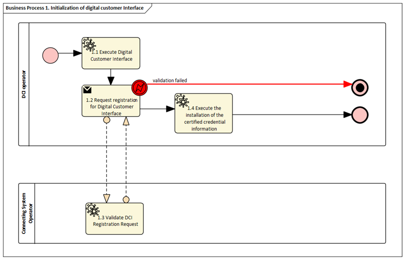
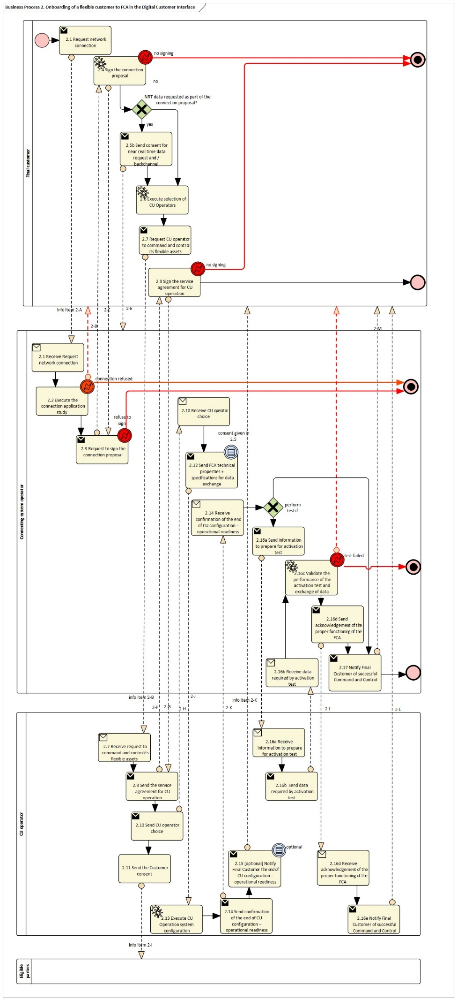
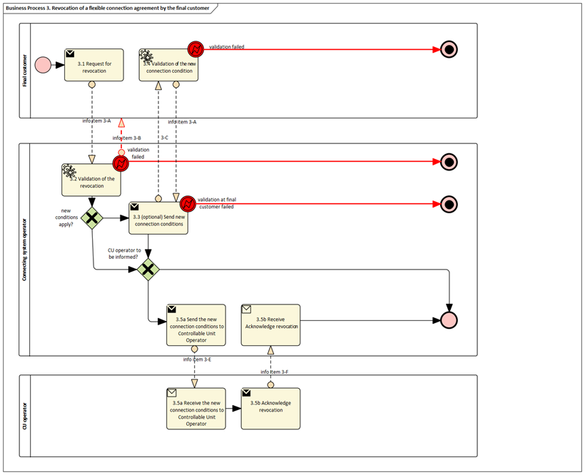
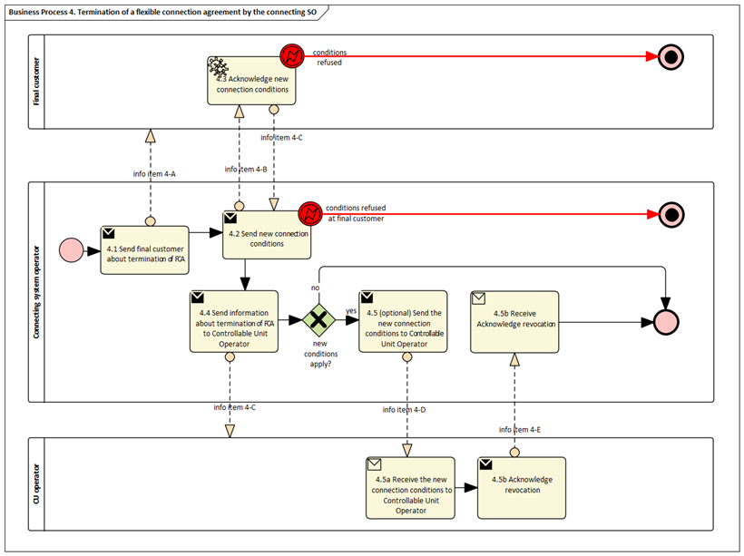
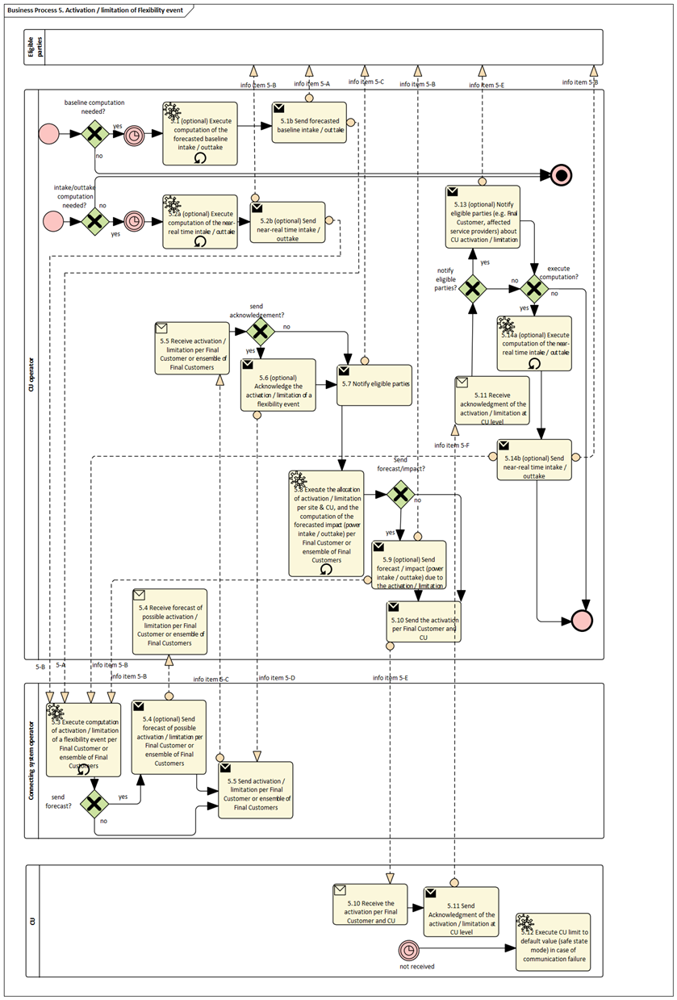

<!-- Placeholders do demonstrate links -->
## Definitions
For the purpose of this implementing regulation, the definitions in Article 2 of Directive (EU) 2019/944 [TODO and state that the definitions in other pieces of European Legislation] shall apply. In addition, the following definitions shall apply: 

* 'Flexible customer' means an individual system user engaged or willing to engage in a flexibility program.  

* 'Controllable Unit' means a single power-generating module and/or a single demand unit pursuant to Article 2(5) of [RfG NC 2.0] and Article 2(4) of [DC NC 2.0], or an ensemble of power-generating modules and/or demand units behind the same accounting point if these power-generating modules and demand units are commonly controlled by a single Power Control System. 

* 'Power Control System' means a system or a device, which can control or limit the power flows of one or several CUs, to ensure compliance with the performances required and certified in line with the applicable national framework. If required, the power control system should be able to receive or send information. 

* 'Flexibility program' means a structured initiative or framework designed to leverage the flexibility from FCs or CUs to achieve specific objectives within the energy system. These programs are typically organized by system operators, service providers, or regulatory bodies to manage and optimize energy consumption and generation as well as avoid congestion. A flexibility program encompasses frameworks such as market-based flexibility monetization activities by an FSP, direct flexibility mechanisms operated by SOs such a Flexible Connection Agreements, or self-consumption, citizen energy sharing communities. 

* 'Controllable unit operator' means an entity in charge of remotely commanding and controlling CUs and sending and receiving all relevant information and command/control signals to do so. 

* 'Flexibility event' means the end-to-end series of operations and information exchanges pursuant to a given Flexibility program in which a Technical Aggregator orchestrates the activation of CUs with the relevant stakeholders. The flexibility event involves the transmission of a flexibility request or a flexibility offer, an activation message, and the real-time observability, and later settlement with system users.  

* 'Digital customer interface' means a communication link that enables data exchange between network operators (DSOs) and customers or their CUs. It plays a central role in the integration of CUs. 

* 'Digital Customer Interface Operator' means …  

Needed ? 

* 'Technical Aggregator' means an entity responsible for orchestrating a flexibility program on behalf of on or several FCs and monitoring their performance over time.  

* 'Flexibility program facilitator' means an entity representing / aggregating several system users (such as citizen energy community, owner of EV charging points in a parking of a housing complex…) or a flexibility service provider

## Abbreviations 

CU: Controllable Unit

CSO: Connecting System Operator     

CUO: Controllable Unit operator 

FC: Flexible Customer  

FCA: Flexibility Connection Agreement 
SPU: ???
SPG: ???

### Responsibilities of ...

[TODO]

## Annex

Table I contains information needed by [Stakeholder 1 and 2...] to set up for utilising flexbile connection agreement and temporary limits set at SPU, SPG or parts of SPG level (Pursuant to Network Code Demand Response or in the context of any Flexibility program) in a memebr state. 

### General Information
| ID  | Name | Description |
|-----|------|-------------|
| I1  | National competent authority | <ul><li><b>Name:</b> Name of appointed national competent authority.</li><li><b>Website:</b> Website of appointed national competent authority.</li><li><b>Official contact:</b> Contact details for managing the mappings of national practices.</li></ul> |
| I2  | Digital Customer Interfaces employed | <ul><li><b>Name:</b> Name of the digital customer interface.</li><li><b>Link:</b> URL of a website containing documentation on the DCI.</li><li><b>Mode:</b> In-cloud, on-premise, or other (please describe).</li><li><b>Data exchange standards:</b> Documentation of standards and interfaces used for communication with system operators and other relevant actors. <i>Note: For each DCI, Procedure 1 must be mapped.</i></li></ul> |
| I3  | Information about permission administrators in a Member State | <ul><li><b>Name:</b> Name of the organisation.</li><li><b>Type of identification:</b> ACER, LEI, BIC, EIC, GLN/GS1, or NIC.</li><li><b>Identification of organisation:</b> Code within the selected identification scheme.</li><li><b>Website:</b> Link to the consent administration web application.</li><li><b>User interface:</b> URL or user portal.</li><li><b>Official contact:</b> Contact details for data sharing.</li><li><b>Consent management responsibility for:</b> Metered data administrators covered.</li><li><b>Documentation of access:</b> Explanation of Member State provisions.</li><li><b>Identity service provider:</b> Used for customer authentication.</li><li><b>Eligible party onboarding:</b> Procedure for production environment.</li><li><b>Eligible party test onboarding:</b> Procedure for test environment.</li><li><b>Price list:</b> Costs for eligible parties.</li></ul> |
### Relevant Roles                                                                                                                        
| Role name                                | Role type | Role description                                                                                                                            |
|------------------------------------------|-----------|---------------------------------------------------------------------------------------------------------------------------------------------|
| FC                            | Business  | A party connected to the grid that is engaged or willing to engage in a flexibility program. From Implementing Act on Demand Response. As defined in Article 2(3) of Directive (EU) 2019/944. This refers to a party connected to the grid that purchases electricity for its own use.  *Note: this also includes the case of active customer and participants of renewable energy communities or citizen energy communities.* |
| CSO (also listed CSO)                 | Business  | A system operator operating the network where a customer is connected. From Implementing Act on Demand Response                                                                                                                                         |
| CUO (Also named Technical Aggregator)             | Business  | A third party operating the CU delegated by the final customer to command and control the CUs on the final customer premises which enables or orchestrates the participation of the final customer in a flexibility program.  *To be checked: consistency with Implementing Act on Demand Response*                                                                                                                                         |
| Digital Customer Interface Operator                | Business  | From Implementing Act on Demand Response. The DCI operator constitutes a critical role in establishing the communication channel via the digital interface. It is expected that the system operator, end customer, technical operator, and CUO will hold this role during the initial phase to ensure proper configuration and communication integrity. |

All roles of type Business are expected to be acting in secure, authenticated manner and through trusted communication channels. For this reason, the authentication steps used for these communication partners are not listed in the scenarios below.  

### Procedures

| No. | Procedure Name                              | Primary Actor  | Preconditions                                         |
|-----|---------------------------------------------|----------------|-------------------------------------------------------|
| 1   | Initialization of digital customer interface  | DCI operator | The DCI Operator has physical/virtual access to the DCI hardware or service.  |
| 2   |Onboarding of a FC to FCA in the Digital Customer Interface|CUO | System user having (or planning to have) a CU on its premises and willing to engage in a flexibility program. List of prequalified CUOs made available by the CSO (see Implementing Act on Demand Response). CUO is onboarded (see Implementing Act on Demand Response)|
| 3   | Revocation of a flexible connection agreement by the final customer                                            |Final custome| A final customer is onboarded to a flexible connection agreement|
| 4   |  Termination of a flexible connection agreement by the CSO                                            |         CSO        | A final customer is onboarded to a flexible connection agreement. |
| 5   | RActivation or limitation of flexibility     |CSO | CUO operating the CU of one or several FCs. The CUO defines and sends per CU the default value of intake / outtake to its (safe state) (consistent with guaranteed capacity for connection agreement) |

## Procedure 1 - Initialization of digital customer Interface

| Step No. | Step | Step description | Information producer (actor) | Information receiver (actor) | Information exchanged (IDs) |
|----------|------|-----------------|------------------------------|------------------------------|-----------------------------|
| 1.1 | Execute Digital Customer Interface (pre-condition) | <ul><li>The DCI Operator (Final Customer or Technical Aggregator) installs and configures the means to communicate directly or indirectly with the CSO. This may be on-premise or cloud-based.</li><li><b>Pre-condition:</b> The DCI Operator has physical or virtual access to the DCI hardware or service.</li><li><b>Post-condition:</b> The DCI is operational and can initiate communication with the CSO.</li></ul> | DCI operator | n/a | — |
| 1.2 | Request registration for Digital Customer Interface | <ul><li>During setup, the DCI generates or is assigned a unique identification string. This identifier is provided to the DCI Operator and forwarded to the CSO for certification.</li><li><b>Pre-condition:</b> The DCI is initialised and capable of generating or receiving an identifier.</li><li><b>Post-condition:</b> The CSO has received the DCI identification information.</li></ul> | DCI operator | (Digital) CSO | 1-A – DCI identification information |
| 1.3 | Validate DCI registration request | <ul><li>The CSO validates that the provided DCI identifier belongs to the Final Customer and/or the DCI Operator. This includes checking data consistency and ensuring that contractual and master data are up to date.</li><li>If applicable, the CSO may issue digital credentials and certificates (e.g. PKI/X.509) to secure further interactions.</li><li>The CSO may employ authentication via eIDAS eID and eIDAS Trust Services (for public/private key creation and timestamp synchronisation).</li><li>If validation fails, an error flow is triggered providing a meaningful indication to the requester.</li><li><b>Pre-condition:</b> The CSO has received the DCI identification information.</li><li><b>Post-condition:</b> The DCI is validated and, if successful, certified credentials are issued; otherwise, an error message is sent to the requester.</li></ul> | (Digital) CSO | DCI operator | 1-B – DCI certification information |
| 1.4 | Install certified credential information (post-condition) | <ul><li>The DCI Operator installs the certified credential information (e.g. CSO-signed authentication certificate) into the DCI.</li><li><b>Pre-condition:</b> The DCI Operator has received valid certified credential information from the CSO.</li><li><b>Post-condition:</b> The DCI contains valid certified credential information, enabling secure communication with the CSO.</li></ul> | DCI operator | DCI operator | — |

| Information exchanged (ID) | Name of information | Description of information exchanged |
|----------------------------|---------------------|--------------------------------------|
| 1-A | DCI identification information | <ul><li><b>DCI identifier:</b> Identifier used by the DCI in further communication</li><li><b>Certification request:</b> If applicable, a certification request string to be signed by the CSO as a trusted authority</li><li><b>Identifier of the Final Customer:</b> Final Customer identification to be understood by the CSO</li><li><b>Identifier of the CUO:</b> If applicable and if different from the Final Customer, the identification of the CUO</li></ul> |
| 1-B | DCI certification information | <ul><li><b>DCI identification information:</b> Information object 1-A provided for validation</li><li><b>Confirmation result:</b> Result of the step, e.g. success or invalid data</li><li><b>Signed certificate:</b> If applicable, the signed certificate for the PKI key pair</li><li><b>CSO DCI identification:</b> Identification of the DCI as registered at the CSO (for further communication)</li></ul> |

## Procedure 2 - Onboarding of a FC to FCA in the Digital Customer Interface

## Procedure 2 - Onboarding of a Final Customer to FCA in the Digital Customer Interface

| Step No. | Step | Step description | Information producer (actor) | Information receiver (actor) | Information exchanged (IDs) |
|----------|------|-----------------|------------------------------|------------------------------|-----------------------------|
| 2.1 | Request network connection | The Final Customer applies for a connection providing power requirement attributes. | Final Customer | CSO | 2-A Connection application |
| 2.2 | Execute connection application study | The CSO processes the connection request and defines the proposal to the Final Customer:<ul><li>A connection with firm capacity matching the customer request</li><li>One or more proposals for Flexible Connection Agreements specifying FCA conditions (if applicable)</li><li>Refusal of connection (if applicable)</li></ul> | CSO | Final Customer | — |
| 2.3 | Request to sign connection proposal | The CSO sends the connection proposal to the Final Customer. <i>Note: A regular connection proposal is consistent with FCA conditions where flexible capacity is 0, the time block is "always", and the agreed duration is 0.</i> | CSO | Final Customer | 2-B FCA conditions |
| 2.4 | Sign connection proposal | The Final Customer accepts or rejects the connection proposal.  If the proposal is a firm connection agreement and no CU control or real-time access is required by the CSO, the process ends here.  If an FCA or CU control is required, the process continues. | Final Customer | CSO | 2-C Acceptance of connection proposal |
| 2.5a (Optional) | Request near real-time data access | To enable FCA network operation, the CSO may require access to near real-time energy data of the Final Customer. | CSO | Final Customer | 2-D Near real-time data needed by CSO |
| 2.5b | Provide consent for near real-time data | The Final Customer accepts or rejects access to near real-time energy data. If rejected, the proposal may be terminated or limited to firm capacity only. | Final Customer | CSO | 2-E Customer consent for near real-time data |
| 2.6 | Select CUO | The Final Customer selects a CUO from the list of pre-qualified CUOs maintained by the CSO. | Final Customer | — | — |
| 2.7 | Request CUO to operate flexible assets | The Final Customer contacts the selected CUO and provides FCA conditions. | Final Customer | CUO | 2-B FCA conditions |
| 2.8 | Send service agreement proposal | The CUO sends a service agreement proposal including:<ul><li>Consent for data sharing and control</li><li>Mandate for CUO to interact with CSO</li><li>Service level agreement</li><li>Other terms and conditions</li></ul> | CUO | Final Customer | 2-F Service agreement for CU operation |
| 2.9 | Sign service agreement | The Final Customer accepts or rejects the service agreement. If rejected, another CUO must be selected. | Final Customer | CUO | 2-G Consent for service agreement |
| 2.10 | Notify CUO selection | The CUO informs the CSO that it has been selected. | CUO | CSO | 2-H Chosen CUO |
| 2.11 | Send customer consent | The CUO forwards the Final Customer's consent to eligible parties. | CUO | Eligible parties | 2-I Customer consent to share and access data |
| 2.12 | Send FCA technical specifications | The CSO provides FCA characteristics and data exchange specifications to the CUO. | CSO | CUO | 2-J FCA technical specifications |
| 2.13 | Configure CU operation system | The CUO configures the CU and performs technical prerequisites for FCA commissioning. | CUO | — | — |
| 2.14 | Send operational readiness confirmation | The CUO informs the CSO that CU command and control is operational. | CUO | CSO | 2-K Operational readiness notification |
| 2.15 (Optional) | Notify Final Customer of readiness | The CUO informs the Final Customer about successful command and control readiness. | CUO | Final Customer | 2-K Operational readiness notification |
| 2.16a (Optional) | Initiate activation test | The CSO triggers an FCA activation test according to Procedure 5. | CSO | CUO | 2-L Activation test preparation information |
| 2.16b | Provide activation test data | The CUO provides required activation test data according to Procedure 5. | CUO | CSO | Procedure 5 related information objects |
| 2.16c | Validate activation test | The CSO validates activation test performance and data exchange. | CSO | — | — |
| 2.16d | Send activation test acknowledgement | The CSO confirms proper FCA functioning and authorises commissioning or requests repetition. | CSO | CUO | 2-M Activation test result confirmation |
| 2.16e | Notify Final Customer | The CUO informs the Final Customer of activation test results. | CUO | Final Customer | 2-M Activation test result confirmation |
| 2.17 | Confirm FCA commissioning authorisation | The CSO confirms FCA commissioning authorisation. | CSO | Final Customer | 2-N FCA commissioning authorisation |

### Information exchanged – Procedure 2 – Onboarding of a Final Customer to FCA in the Digital Customer Interface

| Information exchanged (ID) | Name of information | Description of information exchanged |
|----------------------------|---------------------|--------------------------------------|
| 2-A | Connection application | <ul><li>Power</li><li>(Optional) Type of CU</li><li>(Optional) Connection Point identifier</li><li>(Optional) Requested power per time block</li></ul> |
| 2-B | FCA conditions | <ul><li>Maximum capacity (in both directions – guaranteed and flexible – by time block)</li><li>Agreed duration (expected date for granting connection to the entire requested firm capacity or permanent FCA)</li><li>Applicable network charges</li><li>(Optional) Minimum intake/outtake when FCA is activated</li><li>(Optional) Additional contractual information</li><li>(Optional) Need for near real-time data</li><li>(Optional) Need for forecast of power intake / outtake</li><li>Safe-state setpoint (minimum guaranteed connection capacity) in case of loss of communication</li></ul> |
| 2-C | Acceptance of connection proposal | <ul><li>Yes / No</li></ul> |
| 2-D | Near real-time data needed by CSO | <ul><li>Request for technical data (referred to Procedure 5, information object 5-B), specifying at least latency and periodicity</li></ul> |
| 2-E | Customer consent for near real-time data | <ul><li>Yes / No</li></ul> |
| 2-F | Service agreement for CU operation | <ul><li>Consent for data sharing (data with CUO and data to be forwarded to eligible parties)</li><li>Consent for command and control by CUO</li><li>Mandate (representation contract) for CUO to interact with CSO on behalf of the Final Customer</li><li>Service level agreement</li><li>Other terms and conditions</li></ul> |
| 2-G | Consent for service agreement for CU operation | <ul><li>Consent (Yes / No)</li></ul> |
| 2-H | Chosen CUO | <ul><li>Identification of CUO</li></ul> |
| 2-I | Consent for service agreement for CU operation | <ul><li>List of data associated with customer consent</li></ul> |
| 2-J | FCA technical specifications | <ul><li>Includes information from 2-B and 2-D</li><li>Technical parameters such as latency and frequency</li><li>Connectivity information (e.g. IP address)</li></ul> |
| 2-K | Operational readiness notification | <ul><li>Status: Ready</li></ul> |
| 2-L | Information to prepare for the activation test | To be defined |
| 2-M | Activation test result confirmation | <ul><li>Successful / Failed</li><li>Authorised / Not authorised</li></ul> |
| 2-N | FCA commissioning authorisation | <ul><li>Authorised firm capacity</li><li>Authorised flexible capacity</li></ul> |

## Procedure 3 - Revocation of a flexible connection agreement by the final customer

Procedure 3 - Revocation by a Final Customer of a FCA in the Digital Customer Interface
| Step No. | Step | Step description | Information producer (actor) | Information receiver (actor) | Information exchanged (IDs) |
|----------|------|-----------------|------------------------------|------------------------------|-----------------------------|
| 3.1 | Request revocation | The final customer requests revocation of the Flexible Connection Agreement (FCA). | Final Customer | CSO | 3-A Revocation request |
| 3.2 | Validate revocation | The CSO validates the revocation request. | CSO | Final Customer | 3-B Revocation validation |
| 3.3 (Optional) | Send new connection conditions | The CSO informs the final customer about the new (fallback) connection agreement. <i>Note: The fallback conditions may have been defined at the time of the FCA proposal.</i> | CSO | Final Customer | 3-C New (fallback) contractual conditions |
| 3.4 | Validate new connection conditions | The final customer validates the new connection conditions. | Final Customer | CSO | 3-D New (fallback) connection validation |
| 3.5a (Optional) | Send new connection conditions to CUO | If there is still a need for a CUO (e.g. to command and control the CU to ensure compliance with firm capacity or to provide forecast or near-real-time data), the CSO informs the CUO about the revocation and the new connection conditions. | CSO | CUO | 3-E Technical specifications of Connection Agreement |
| 3.5b | Acknowledge revocation | The CUO acknowledges the revocation of the FCA. | CUO | CSO | 3-F Acknowledgement |

### Information exchanged – Procedure 3 – Revocation of a Flexible Connection Agreement by the Final Customer

| Information exchanged (ID) | Name of information | Description of information exchanged |
|----------------------------|---------------------|--------------------------------------|
| 3-A | Revocation request | <ul><li>Capacity (in both directions) by time block</li><li>(Optional) Type of CU</li><li>Connection Agreement Point identifier</li></ul> |
| 3-B | Revocation validation | <ul><li>Consent (Yes / No)</li></ul> |
| 3-C | New (fallback) contractual conditions | <ul><li>Capacity (in both directions) by time block</li><li>Applicable network charges</li><li>(Optional) Additional contractual information</li><li>(Optional) Need for near real-time data</li><li>(Optional) Need for forecast of power intake / outtake</li><li>Safe state setpoint (minimum guaranteed connection capacity) in case of loss of communication</li><li>(Optional) Alternatives</li><li>Same as 2-B except no information on agreed duration</li></ul> |
| 3-D | New (fallback) connection validation | Consent (Yes / No) or alternative chosen (if implemented) |
| 3-E | Technical specifications of Connection Agreement | Same as 2-J Technical specifications of Connection Agreement |
| 3-F | Acknowledgement | Confirmation of receipt |

## Procedure 4 - Termination of a flexible connection agreement by the CSO

Procedure 4 - Termination by a CSO of a Final Customer FCA in the Digital Customer Interface

| Step No. | Step | Step description | Information producer (actor) | Information receiver (actor) | Information exchanged (IDs) |
|----------|------|-----------------|------------------------------|------------------------------|-----------------------------|
| 4.1 | Send final customer information about termination of FCA | CSO informs the final customer about termination of the FCA. | CSO | Final Customer | 4-A Termination information |
| 4.2 | Send new connection conditions | CSO informs the final customer about the new connection conditions. | CSO | Final Customer | 4-B New (fallback) contractual conditions (same as 3-C) |
| 4.3 | Acknowledge new connection conditions (including, if implemented, choice of alternative) | The Final Customer acknowledges the new connection conditions or chooses a proposed alternative. | Final Customer | CSO | 4-C New (fallback) connection acknowledgement |
| 4.4 | Send information about termination of FCA to CUO | CSO informs the CUO about termination of the FCA. | CSO | CUO | 4-C Information Object |
| 4.5 | Send the new connection conditions to CUO | If there is still a need for a CUO (e.g. to command and control the CU to ensure compliance with firm capacity or to provide forecast or near-real-time data), the CSO informs the CUO about the termination and the new connection conditions. | CSO | CUO | 4-D Technical specifications of Connection Agreement (same as 2-J and 3-E) |
| 4.6 | Acknowledge termination of FCA | The CUO acknowledges termination of the FCA (and, if Step 4.5 is implemented, reception of new connection agreement conditions). | CUO | CSO | 4-E Acknowledgment |

### Table IV.4 – Information exchanged – Procedure 4 – Termination of a Final Customer FCA in the Digital Customer Interface

| Information exchanged (ID) | Name of information | Description of information exchanged |
|----------------------------|---------------------|--------------------------------------|
| 4-A | Termination information | <ul><li>Information about termination of the FCA (reason, effective date/time, and any applicable contractual references).</li></ul> |
| 4-B | New (fallback) contractual conditions | <ul><li>Capacity (guaranteed) in both directions by time block</li><li>Applicable network charges</li><li>(Optional) Additional contractual information</li><li>(Optional) Need for near real-time data</li><li>(Optional) Need for forecast of power intake / outtake</li><li>(Optional) Alternatives (if applicable)</li><li>(Optional) Type of CU</li><li>(Optional) Connection Agreement Point identifier</li></ul> |
| 4-C | New (fallback) connection acknowledgement | <ul><li>Acknowledgement by the Final Customer (e.g. accepted / rejected, or alternative chosen if implemented).</li></ul> |
| 4-D | Technical specifications of Connection Agreement | <ul><li>Same as 2-J and 3-E</li><li>Capacity (guaranteed) in both directions by time block</li><li>Applicable network charges</li><li>(Optional) Additional contractual information</li><li>(Optional) Near real-time data requirements</li><li>(Optional) Forecast of power intake / outtake requirements</li><li>(Optional) Alternatives (if applicable)</li><li>(Optional) Type of CU</li><li>(Optional) Connection Agreement Point identifier</li></ul> |
| 4-E | Acknowledgement | <ul><li>Received</li></ul> |

Missing here a procedure : if final customer revokes (likely to provoke the end of FCA) or switches CUO (likely same as onboarding in FCA at the step of selecting CUO – in the meantime, capacity may be limited to guaranteed capacity only)

## Procedure 5 – Activation / limitation of a flexibility event

| Step No. | Step | Step description | Information producer (actor) | Information receiver (actor) | Information exchanged (IDs) |
|----------|------|-----------------|------------------------------|------------------------------|-----------------------------|
| 5.1a (Optional) | Compute forecasted baseline intake / outtake | The CUO computes or updates forecasted baseline intake / outtake for each Final Customer or ensemble of Final Customers (FCA, SPU, SPG or part of SPG) when no activation or limitation is applied. | CUO | — | — |
| 5.1b | Send forecasted baseline intake / outtake | The CUO sends the forecasted baseline intake / outtake. | CUO | CSO and eligible parties | 5-A Forecasted baseline intake / outtake |
| 5.2a (Optional) | Compute near-real-time intake / outtake | The CUO computes or updates near-real-time intake / outtake when no activation or limitation is applied. | CUO | — | — |
| 5.2b | Send near-real-time intake / outtake | The CUO sends near-real-time intake / outtake. | CUO | CSO and eligible parties | 5-B Near-real-time intake / outtake |
| 5.3 | Compute activation / limitation | The CSO computes activation or limitation of a flexibility event pursuant to the connection agreement or applicable framework. | CSO | — | — |
| 5.4 (Optional) | Send forecast activation / limitation | The CSO sends forecasts of possible activation or limitation. <i>Note: The CSO may inform the CUO in advance.</i> | CSO | CUO | 5-C Limit notification or activation |
| 5.5 | Send activation / limitation | The CSO sends the requested activation or limitation. | CSO | CUO | 5-C Limit notification or activation |
| 5.6 (Optional) | Acknowledge activation / limitation | The CUO acknowledges the activation or limitation. | CUO | CSO | 5-D Activation / limitation receipt notification |
| 5.7 | Notify eligible parties | The CSO notifies affected parties (e.g. suppliers, BRPs). | CSO | Eligible parties | Same as 5-C |
| 5.8 | Allocate activation / limitation per CU | The CUO computes:<ul><li>Allocation of activation or limitation per site and CU</li><li>Forecasted impact (power intake / outtake)</li></ul> | CUO | — | — |
| 5.9 (Optional) | Send forecasted impact | The CUO sends forecasted impact due to activation or limitation. | CUO | CSO and eligible parties | Same as 5-B |
| 5.10 | Send CU activation / limitation | The CUO activates or limits each CU. | CUO | CU | 5-E CU activation / limitation notification |
| 5.11 | Acknowledge CU activation / limitation | The CU acknowledges activation or limitation. | CU | CUO | 5-F Activation / limitation receipt notification at CU level |
| 5.12 | Execute safe state mode | If the CU receives no communication within a defined time, it switches to default safe state capacity. | CU | — | — |
| 5.13 (Optional) | Notify eligible parties of CU status | The CUO notifies affected parties about CU activation or limitation. | CUO | Eligible parties | Same as 5-E |
| 5.14a (Optional) | Compute near-real-time intake / outtake | The CUO computes updated near-real-time intake / outtake during or after activation. | CUO | — | — |
| 5.14b | Send near-real-time intake / outtake | The CUO sends updated near-real-time intake / outtake. | CUO | CSO and eligible parties | 5-B Near-real-time intake / outtake |

**Important note:**

This procedure loops: steps 5.13.a and 5.13.b are the same as steps 5.2.a and 5.2.b.

**This procedure considers a single CUO per site, which will be the case for the overwhelming majority of Final Customers.**

The limitations set by CSO must be respected by the Final Customer, regardless the number of CUOs active within its premises.

If there are several CUOs active on premises, the Final Customer shall designate a “Master CUO” which will be responsible for ensuring the respect of any limitation /activation order set by a CSO on the Final Customer i.e. allocating the flexibility activated or limited at the connection / connection agreement point among all CUOs that are active within the Final Customer premises, that is the Master CUO and all subsequent CUOs. In such a case, procedure 5 would need to be adapted where the Master CUO would send orders or limitations directly to its own CU, or per System user to other all subsequent CUOs, which in turn will send orders or limitations to their own CUs.

An allocation rule should be defined by the Final Customer, such as priority to activate assets or priority to not activate assets.

Additional rules should be defined, specifying whether the master CUO is eligible to know the identity of subsequent CUO or whether they should be anonymized, rules if there is incompliance of a subsequent CUO and so forth. Such rules, procedures and data exchange would be complex and difficult to streamline.

This procedure considers a single CUO per site, which will be the case for the overwhelming majority of Final Customers.
### Information exchanged – Procedure 5 – Activation or limitation of a flexibility event

| Information exchanged (ID) | Name of information | Description of information exchanged |
|----------------------------|---------------------|--------------------------------------|
| 5-A | Forecasted baseline intake / outtake | <ul><li>Time series of active / reactive power in both directions</li></ul> |
| 5-B | Near real-time intake / outtake | <ul><li>Actual power (active / reactive)</li></ul> |
| 5-C | Limit notification or activation per Final Customer or ensemble of Final Customers | <ul><li>Maximum active / reactive power in one or both directions</li><li>Time frame (start time / end time)</li><li>(Optional) Minimum active / reactive power in one or both directions</li><li>(Optional) Legal or contractual provision pursuant to the limitation or activation</li><li>Identification of the Final Customer or ensemble of Final Customers</li></ul> |
| 5-D | (Optional) Limitation / activation receipt notification of flexibility event | <ul><li>(Optional) Yes – received and can comply</li><li>(Optional) Yes – received and cannot comply</li></ul> |
| 5-E | CU limit / activation notification at CU level | <ul><li>Maximum and/or minimum active / reactive power in one or both directions</li><li>Time frame (start time / end time)</li></ul> |
| 5-F | (Optional) Limitation / activation receipt notification at CU level | <ul><li>(Optional) Yes – received and can comply</li><li>(Optional) Yes – received and cannot comply</li></ul> |

Missing procedures:

· Onboarding of local services: provided by NCDR

· Onboarding of energy communities: provided by Task 4.3

· Procedures for back office and settlement to be reviewed and adapted from the procedures for Network Code Demand Response

