# The reference model for data required for demand response.*

The reference model for data required for demand response is composed of a set of reference procedures for access to data and the necessary information exchanges between roles acted by market participants relating to this specific case. 

The tables in this Annex reflect this set of information that constitutes the reference model. The procedural steps that are set out may be combined or carried out in a different order when applied at the national level. 

Table I contains information regarding the national market structure and environment. It is particularly useful to eligible parties that would like to set up their operation in the respective territory and utilise demand response data access in each Member State. This table must be read in conjunction with Commission Implementing Regulation (EU) 2023/1162 and Commission Implementing Regulation (EU) 2025/XXX. Table I is listing information that needs to be accessible for eligible parties to register, on-board or establish prerequisite infrastructure to take part in the procedures listed in Table III and accordingly communicate and exchange information with relevant market participants occupying the roles and undertaking the responsibilities indicated in Table II.

Some of the procedural steps described in Table III are marked as Conditional, it means that their implementation depends on the rules specified at national level.. 
When the steps as marked as optional, it means that the implementation depends on the objects they relate to [for some baselining methods, baseline validation does not need to go through all the steps]. 

## Context/ Whereas

## Definitions

## Abbreviations 

<li> CU: Controllable Unit
<li> SO: System Operator     
<li> SPU: ???
<li> SPG: ???

## Responsibilities of Market Roles

### Responsibilities of ...

[TODO]

## Annex

### Additional General Information

| ID | Name | Information | Description |
|----|------|-------------|-------------|
| I1 | Common access point | Organisation details | <ul><li><b>Name</b>: Name of the organisation responsible for operating the common access point of the flexibility information system, as stated in NCDR.<li><b>Type of identification</b>: ACER registration code, LEI, BIC, EIC, GLN/GS1, or NIC.<li><b>Identification of organisation</b>: Code or identification based on the selected identification type.<li><b>Website</b>: Website of the common access point.<li><b>Onboarding (test)</b>: Description of how to onboard as a service provider.<li><b>Onboarding (production)</b>: Instructions for onboarding to the production environment.<li><b>Data exchange standard(s)</b>: List of data exchange standard(s).</li></ul> |
| I2 | CU module administrator(s) | Organisation details | <ul><li><b>Name</b>: Name of the organisation responsible for a CU module.<li><b>Type of identification</b>: ACER, LEI, BIC, EIC, GLN/GS1, or NIC.<li><b>Identification of organisation</b>: Code or identification based on the selected identification type.<li><b>Website</b>: Website of the CU module administrator.<li><b>Area(s)</b>: Region(s) or grid area(s) where the CU module administrator has operational responsibility.<li><b>Onboarding (test)</b>: Description of onboarding to a test environment.<li><b>Onboarding (production)</b>: Description of onboarding to the productive environment.<li><b>Data exchange standard(s)</b>: List of data exchange standard(s) for interaction with relevant market parties and systems.</li></ul> |
| I3 | SP module administrator(s) | Organisation details | <ul><li><b>Name</b>: Name of the organisation responsible for an SP module.<li><b>Type of identification</b>: ACER, LEI, BIC, EIC, GLN/GS1, or NIC.<li><b>Identification of organisation</b>: Code or identification based on the selected identification type.<li><b>Website</b>: Website of the SP module administrator.<li><b>Procuring SO and services</b>: List of procuring system operators and balancing or local services concerned.<li><b>Onboarding (test)</b>: Description of onboarding to a test environment.<li><b>Onboarding (live)</b>: Description of onboarding to the productive environment.<li><b>Data exchange standard(s)</b>: List of data exchange standard(s) for interaction with relevant market parties and systems.</li></ul> |
| I4 | Single access point (local services) | Publication access | <ul><li><b>Website</b>: Link to the single access point referred to in NCDR.<li><b>Operator</b>: Party responsible for operating the access point.<li><b>Data exchange standard(s)</b>: Standards used to publish data online in a machine-readable manner.</li></ul> |
| I5 | Single access point (balancing services) | Publication access | <ul><li><b>Website</b>: Link to the single access point for public information on balancing markets.<li><b>Operator</b>: Party responsible for operating the access point.<li><b>Data exchange standard(s)</b>: Standards used to publish data online in a machine-readable manner.</li></ul> |
| I6 | National T&C for baselining methods | Legal documentation | <ul><li><b>Link</b>: URL of the national website where the terms and conditions are published and updated (Article 5(5)(a) of NCDR).</li></ul> |
| I7 | National T&C for service providers | Legal documentation | <ul><li><b>Link</b>: URL of the national website where the terms and conditions are published and updated (Article 5(5)(b) of NCDR).</li></ul> |
| I8 | National T&C for flexibility information system | Legal documentation | <ul><li><b>Link</b>: URL of the national website where the terms and conditions are published and updated (Article 5(5)(c) of NCDR).</li></ul> |
| I9 | Flexibility information system public data | Public access | <ul><li><b>Link</b>: URL(s) of online applications where free-to-access flexibility information system data is published.</li></ul> |
| I10 | Service validation point identification system | Identification system | <ul><li><b>Name</b>: National term for customer connection point “service validation point”.<li><b>Identification system</b>: Description of identification system(s) used (one per service validation point).</li></ul> |
| I11 | Accounting point identification system | Identification system | <ul><li><b>Name</b>: National term for “accounting point”.<li><b>Identification system</b>: Description of identification system(s) used (one per accounting point).</li></ul> |
| I12 | Service provider qualification requirements | Documentation | <ul><li><b>Documentation</b>: Description of how service providers can obtain product requirements and procuring system operators for qualification.</li></ul> |
| I13 | Dedicated measurement device data administrator | Organisation details | <ul><li><b>Name</b>: Name of the organisation responsible for dedicated measurement device data.<li><b>Type of identification</b>: ACER, LEI, BIC, EIC, GLN/GS1, or NIC.<li><b>Identification of organisation</b>: Code or identification based on the selected identification type.<li><b>Website</b>: Website of the administrator.<li><b>Onboarding (test)</b>: Description of onboarding as a service provider.<li><b>Onboarding (production)</b>: Instructions for onboarding to the production environment.<li><b>Data exchange standard(s)</b>: List of data exchange standard(s).</li></ul> |
| I14 | Calculated data administrator | Organisation details | <ul><li><b>Name</b>: Name of the organisation responsible for calculated data.<li><b>Type of identification</b>: ACER, LEI, BIC, EIC, GLN/GS1, or NIC.<li><b>Identification of organisation</b>: Code or identification based on the selected identification type.<li><b>Website</b>: Website of the administrator.<li><b>Onboarding (test)</b>: Description of onboarding as a service provider.<li><b>Onboarding (production)</b>: Instructions for onboarding to the production environment.<li><b>Data exchange standard(s)</b>: List of data exchange standard(s).</li></ul> |
| I15 | CU registration responsible | Organisation details | <ul><li><b>Name</b>: Name of the organisation responsible for CU registration.<li><b>Type of identification</b>: ACER, LEI, BIC, EIC, GLN/GS1, or NIC.<li><b>Identification of organisation</b>: Code or identification based on the selected identification type.<li><b>Website</b>: Website of the CU registration responsible.<li><b>Onboarding (test)</b>: Description of onboarding as a service provider.<li><b>Onboarding (production)</b>: Instructions for onboarding to the production environment.<li><b>Data exchange standard(s)</b>: List of data exchange standard(s).</li></ul> |
| I16 | Temporary limits applicability | Documentation | <ul><li><b>Documentation</b>: Description of how temporary limits are applied according to national terms and conditions.</li></ul> |

### Relevant Roles

| Role name | Role type | Role description |
|----------|-----------|------------------|
| Final customer | Business | As defined in Article 2(3) of Directive (EU) 2019/944. This refers to a party connected to the grid that purchases electricity for its own use.   **Note:** This also includes active customers and participants of renewable energy communities or citizen energy communities. |
| Service provider | Business | As defined in Article 2 of NCDR. |
| CU module administrator | Business | A party responsible for a functional platform of a flexibility information system that contains, manages, and makes available master data about controllable units (see also NCDR, Article 2). |
| SP module administrator | Business | A party responsible for a functional platform of a flexibility information system that contains, manages, and makes available data about service providers. |
| Eligible party | Business | As defined in Article 2 of Commission Implementing Regulation (EU) 2023/1162. |
| Baseline calculator | Business | A party responsible for calculating the baseline of a resource according to a baselining method (see also NCDR, Title II). |
| Baseline administrator | Business | A party responsible for making the calculated or validated baseline available to entitled parties. |
| Metered data administrator | Business | As defined in Article 2 of Commission Implementing Regulation (EU) 2023/1162. |
| Metering point administrator | Business | As defined in Article 2 of Commission Implementing Regulation (EU) 2023/1162. |
| Connecting system operator | Business | As defined in Article 2 of NCDR. |
| Procuring system operator | Business | As defined in Article 2 of NCDR. |
| System operator | Business | As defined in Article 2 of NCDR. |
| Quantification data aggregator | Business | A party responsible for the aggregation of metering, dedicated measurement device, or calculated data in accordance with defined market rules. |
| Quantification responsible | Business | A party responsible for calculating the difference between the baseline and the corresponding unitary or aggregated metering, dedicated measurement device, or calculated data for a specific timeframe. |
| Dedicated measurement device data administrator (DMD) | Business | A party responsible for storing and distributing validated dedicated measurement device data from dedicated measurement devices. |
| Near real-time metering data administrator | Business | A party responsible for storing and distributing validated near real-time metering and consumption data from a smart meter or smart metering system. |
| Calculated data administrator | Business | A party responsible for storing and distributing validated calculated data. |
| CU registration responsible | Business | A party entitled to interact with the CU module to register, update, and de-register CU master data. |
| Entitled party | Business | A party that must receive or send data because they are responsible for performing specific tasks according to the terms and conditions pursuant to Articles 11, 14, and 24 of NCDR and Article 18 of Commission Regulation (EU) 2017/2195. |
| Affected party | Business | A party that must be informed about a change of responsibility as a direct consequence of executing a referred procedure under this Implementing Regulation. This role may be assigned to one or more eligible parties based on national rules. |
| Product pre-qualification responsible | Business | A party performing a product pre-qualification as described in Articles 18 and 20 of NCDR and in accordance with national terms and conditions pursuant to Article 11 of NCDR. |
| Product verification responsible | Business | A party performing a product verification as described in Articles 18 and 19 of NCDR and in accordance with national terms and conditions pursuant to Article 11 of NCDR. |
| Activation test responsible | Business | A party performing an activation test as described in Articles 18, 19, and 20 of NCDR and in accordance with national terms and conditions pursuant to Article 11 of NCDR. |
| Grid pre-qualification coordinator | Business | A party responsible for coordinating a grid pre-qualification as described in the national terms and conditions for TSO–DSO and DSO–DSO coordination pursuant to Article 45 of NCDR. |
| Temporary limit administrator | Business | A party responsible for storing and distributing temporary limits on system elements, SPUs, SPGs, or parts of SPGs to entitled parties. |
| Service requiring responsible | Business | To be defined. |

All roles of type Business are expected to be acting in a secure, authenticated manner and through trusted communication channels. For this reason, the authentication steps used for these communication partners are not listed in the procedures below. 

### Procedures

| No. | Procedure name / Description | Primary actor | Pre-condition |
|----:|------------------------------|---------------|---------------|
| 1 | **General access to Controllable Unit master data by an entitled party** Describe information exchanges for access to CU master data by an entitled party. | Entitled party | <ul><li>The entitled party has permission to access the requested data in the flexibility information system.</li></ul> |
| 2 | **Controllable Unit registration** Information exchanges for CU registration in the CU module. <i>[NCDR, Article 28(a)]</i> | CU registration responsible | <ul><li>The final customer informs the CU registration responsible of the intent to register a CU.<li>The CU registration responsible obtains the required master data.<li>The CU is linked to an accounting point and the link is verified.<li>All required permissions are granted by relevant data owners.</li></ul> |
| 3 | **Update Controllable Unit information** Information exchanges for updating CU master data. <i>[NCDR, Article 28(b)]</i> | CU registration responsible | <ul><li>The final customer requests the update.<li>The CU exists in the CU module.<li>The CU registration responsible has valid permission from the final customer.</li></ul> |
| 4 | **De-registration of Controllable Unit** Information exchanges for CU de-registration. <i>[NCDR, Article 28(d)]</i> | CU registration responsible | <ul><li>The CU exists in the CU module.<li>The final customer requests de-registration.<li>Necessary data is available.<li>Valid permission from the final customer exists.</li></ul> |
| 5 | **Suspension of Controllable Unit** Suspension according to national terms and conditions. <i>[NCDR, Article 28(c)]</i> | Entitled party | <ul><li>Preventive measures were insufficient.<li>The entitled party is informed of the need for suspension.<li>The CU exists in the CU module.</li></ul> |
| 6 | **Re-activation of Controllable Unit** Re-activation according to national terms and conditions. <i>[NCDR, Article 28(i)]</i> | Entitled party | <ul><li>The service provider and final customer are informed.<li>The CU exists in the CU module.</li></ul> |
| 7 | **Service Provider registration** Registration process in the flexibility information system. <i>[NCDR, Article 27(a)]</i> | Service provider | <ul><li>The service provider has fulfilled all regulatory obligations.</li></ul> |
| 8 | **Service Provider application for qualification** | Service provider | <ul><li>The service provider is registered.<li>The service provider knows the relevant procuring system operator and product.</li></ul> |
| 9 | **Service contract revocation by Final Customer** <i>[NCDR, Article 28(g)]</i> | Final customer | <ul><li>A valid service contract exists.<li>The final customer has a valid reason or lost entitlement.</li></ul> |
| 10 | **Service contract termination by Service Provider** <i>[NCDR, Article 28(h)]</i> | Service provider | <ul><li>A valid service contract exists.<li>The service provider has a valid reason to terminate.</li></ul> |
| 11 | **SP customer switching or new CU registration** <i>[NCDR, Article 28(f)]</i> | Service provider (new) | <ul><li>CU is registered.<li>SP is registered and qualified.</li></ul> |
| 12 | **Cancellation of SP registration on CU** | Service provider | <ul><li>A pending SP registration exists.<li>The cancellation occurs before service start.</li></ul> |
| 13 | **Update service provider profile information** <i>[NCDR, Article 27(c)]</i> | Service provider | <ul><li>Service provider is registered in the SP module.</li></ul> |
| 14 | **Update service provider critical information** <i>[NCDR, Article 27(c)]</i> | Service provider | <ul><li>Service provider is registered.</li></ul> |
| 15 | **De-registration of Service Provider** | Service provider | <ul><li>Service provider is registered.<li>No active SPUs or SPGs exist.</li></ul> |
| 16 | **Suspension of Service Provider qualification** <i>[NCDR, Article 27(d)]</i> | Procuring or assigned system operator | <ul><li>SP exists and is approved.<li>Related SPUs/SPGs cannot participate during suspension.</li></ul> |
| 17 | **Revocation of Service Provider qualification** | Procuring system operator | <ul><li>SP is qualified by the operator.<li>No active SPUs/SPGs.<li>Non-compliance with national terms and conditions.</li></ul> |
| 18 | **Reactivation of Service Provider** | System operator | <ul><li>Suspension was previously applied.<li>Re-activation request is issued.</li></ul> |
| 19 | **SPU or SPG grid pre-qualification** <i>[NCDR, Article 27(f)]</i> | Grid pre-qualification coordinator | <ul><li>Relevant operators are known.<li>SPU/SPG is registered and applied for participation.<li>All related CUs are assigned.</li></ul> |
| 20 | **SPU or SPG product prequalification** | Product prequalification responsible | <ul><li>Application process completed.<li>SP is registered and qualified.</li></ul> |
| 21 | **SPU or SPG product verification** | Product verification responsible | <ul><li>Temporary qualification exists.<li>Service delivery is ongoing.</li></ul> |
| 22 | **SPU or SPG registration** <i>[NCDR, Article 27(a)]</i> | Service provider | <ul><li>Service provider is registered in the SP module.</li></ul> |
| 23 | **SPU or SPG update** <i>[NCDR, Article 27(c)]</i> | Eligible party | <ul><li>SPU/SPG is registered.<li>Eligible party is authorized.</li></ul> |
| 24 | **SPU or SPG de-registration** <i>[NCDR, Article 27(e)]</i> | Service provider | <ul><li>SPU/SPG is registered.<li>SPU/SPG is not active.</li></ul> |
| 25 | **SPU or SPG application** <i>[NCDR, Article 27(b)]</i> | Service provider | <ul><li>SP is qualified and not suspended.<li>CU and SPU/SPG master data exist.</li></ul> |
| 26 | **SPU or SPG suspension** <i>[NCDR, Article 27(d)]</i> | System operator | <ul><li>SPU/SPG is registered.<li>Suspension decision exists.</li></ul> |
| 27 | **SPU or SPG re-activation** | System operator | <ul><li>SPU/SPG suspension exists.<li>Reversal decision exists.<li>SP is not suspended.</li></ul> |
| 28 | **General access to SPU or SPG master data** | Entitled party | <ul><li>The entitled party has permission to access the requested data.</li></ul> |
| 29 | **Bidding and activation of a flexibility product** | Service requiring responsible | <ul><li>Service provider is qualified.<li>SPU/SPG is prequalified.<li>Relevant information is available in the FIS.</li></ul> |
| 30 | **Temporary limits** | Relevant system operator | <ul><li>Forecast data is available.<li>Analysis concludes a temporary limit is required.</li></ul> |
| 31 | **Baseline data handling** | Baseline calculator | <ul><li>Valid permissions exist.<li>A baseline is required.<li>A baselining method is selected.</li></ul> |
| 32 | **Making measurement data available** | Quantification data aggregator | <ul><li>Necessary permissions exist.<li>Required data is available and validated.</li></ul> |
| 33 | **Quantification** | Quantification responsible | <ul><li>Quantification is required.<li>Relevant timeframe is known.<li>All data is validated.</li></ul> |

Information objects referred to in columns Information exchanged (IDs) are defined in Table IV. The steps in the scenarios might not always be executed as a complete, consecutive sequence. In some cases, it might be a collection of sub-sequences not necessarily dependent on each other.

#### Procedure 1 - General access to Controllable Unit master data by an entitled party 

| Step No. | Step | Step description | Information producer (actor) | Information receiver (actor) | Information exchanged (ID) |
|:--:|------|------------------|------------------------------|------------------------------|----------------------------|
| 1.1 | Request for CU master data | An entitled party requests access to the CU master data for all controllable units (CUs) registered in the flexibility information system and linked to the requesting entitled party. | Entitled party | CU module administrator | A – CU master data request |
| 1.2 | Validate CU master data request | The CU module administrator validates whether the request is permitted and provides a meaningful response in case the request is invalid. | CU module administrator | Entitled party | B – Request validation information |
| 1.3 | Send list of CU master data | The CU module administrator sends the requested CU master data from the flexibility information system. | CU module administrator | Entitled party | C – CU master data |

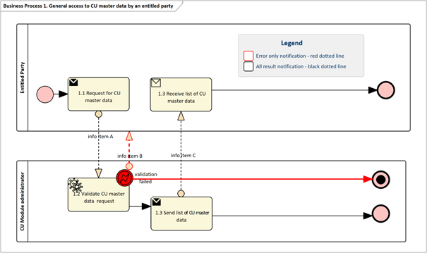 

#### Procedure 2 - Controllable unit registration

| Step No. | Step | Step description | Information producer (actor) | Information receiver (actor) | Information exchanged (ID) |
|:--:|------|------------------|------------------------------|------------------------------|----------------------------|
| 2.1 | Request CU registration | The CU registration responsible sends a CU registration request to the CU module administrator. The request may include an existing identification code for the CU, if one exists. | CU registration responsible | CU module administrator | D – CU registration request |
| 2.2 | Validate CU registration request | The CU module administrator validates whether the information provided satisfies the registration requirements. In case of an invalid request, a meaningful indication is provided. | CU module administrator | CU registration responsible | B – Request validation information |
| 2.3a | (Conditional) Request permission | (If required by national terms and conditions) Request permission for the assignment of the CU and the sharing of relevant data with the CU registration responsible and other entitled parties on behalf of the final customer for (de-)registration and update purposes. | CU module administrator | Final customer | – |
| 2.3b | (Conditional) Validate permission | The final customer accepts or rejects the permission request allowing relevant personal data to be used for market processes and accessed by involved third parties.   **Note:** When mapping national practices, it is important to describe how the requesting party is informed about an accepted or rejected permission request. | Final customer | CU module administrator | – |
| 2.3c | (Conditional) Notify about permissions | The CU module administrator notifies the CU registration responsible about the permission granted by the final customer to share CU master data.   **Note:** The permission shall be established similarly to Table III.2 in the Annex of Commission Implementing Regulation (EU) 2023/1162. | CU module administrator | CU registration responsible | – |
| 2.4 | Store CU identification | The CU module administrator creates a new entry for the CU in the CU module with a unique identifier and a creation timestamp. If a CU identification code was provided in step 2.1, that code is used instead of creating a new one. | CU module administrator | Not applicable | – |
| 2.5 | Send CU identification | The CU module administrator sends the CU identification to the CU registration responsible. | CU module administrator | CU registration responsible | E – CU identification |
| 2.6 | Send CU master data | The CU registration responsible sends the required CU master data to the CU module administrator for the registration process. | CU registration responsible | CU module administrator | C – CU master data |
| 2.7a | (Conditional) Request CU grid prequalification | The CU module administrator sends CU master data to the grid prequalification coordinator to verify that the CU can be operated, in accordance with NCDR Article 28(e). | CU module administrator | Grid prequalification coordinator | C – CU master data |
| 2.7b | Send CU grid prequalification result | The grid prequalification coordinator sends the validation result of the CU to the CU module administrator. | Grid prequalification coordinator | CU module administrator | B – Request validation information |
| 2.7c | Notify CU grid prequalification result | The CU module administrator notifies the CU registration responsible of the CU grid prequalification result. | CU module administrator | CU registration responsible | B – Request validation information |
| 2.8 | Notify registered CU module data | In case of successful registration, the CU module administrator notifies the CU registration responsible about the updated CU module information. | CU module administrator | CU registration responsible | C – CU master data |
| 2.9 | Notify successful CU registration | The CU module administrator notifies the required entitled parties about the successful registration of the CU. | CU module administrator | Entitled parties | C – CU master data |

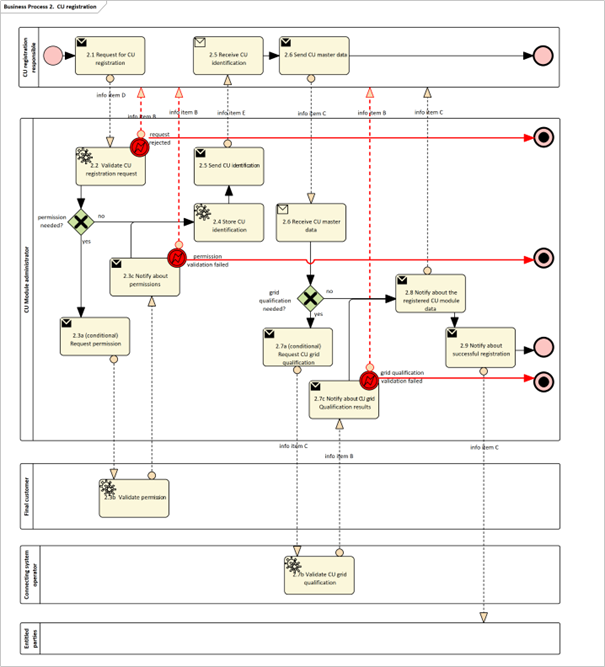 

#### Procedure 3 - Update Controllable unit information

| Step No. | Step | Step description | Information producer (actor) | Information receiver (actor) | Information exchanged (ID) |
|:--:|------|------------------|------------------------------|------------------------------|----------------------------|
| 3.1 | Request CU update | The CU registration responsible requests an update of the CU master data.   **Note:** The CU registration responsible sends the CU master data to be updated using information object F. | CU registration responsible | CU module administrator | C – CU master data |
| 3.2 | Validate CU update request | The CU module administrator validates whether the information provided is complete. In case of an invalid request, a meaningful indication is provided.   **Note for modelling:** End the process if the provided CU master data is not sufficient. | CU module administrator | CU registration responsible | B – Request validation information |
| 3.3a | (Conditional) Request permission | (If required by national terms and conditions) Request permission for the change of CU master data on behalf of the final customer. | CU module administrator | Final customer | – |
| 3.3b | (Conditional) Validate permission | The final customer accepts or rejects the permission request to change the CU master data.   **Note:** When mapping national practices, it is important to describe how the requesting party is informed about an accepted or rejected permission request. | Final customer | CU module administrator | – |
| 3.3c | (Conditional) Notify about permissions | The CU module administrator notifies the CU registration responsible about the permission granted by the final customer to change the CU master data.   **Note:** The permission shall be established similarly to Table III.2 in the Annex of Commission Implementing Regulation (EU) 2023/1162. | CU module administrator | CU registration responsible | – |
| 3.4a | (Conditional) Request CU grid prequalification | The CU module administrator sends updated CU master data to the grid prequalification coordinator to initiate the CU grid prequalification process due to the update.   In accordance with NCDR Article 28(e). | CU module administrator | Grid prequalification coordinator | C – CU master data |
| 3.4b | Validate CU grid qualification | The grid prequalification coordinator sends the validation results for the CU to the CU module administrator. | Grid prequalification coordinator | CU module administrator | B – Request validation information |
| 3.4c | Notify CU grid prequalification result | The CU module administrator notifies the CU registration responsible of the CU grid prequalification validation result. | CU module administrator | CU registration responsible | B – Request validation information |
| 3.5 | Store updated CU data | If the validation in step 3.4 is successful, the CU module administrator updates the CU master data in the CU module and sets a timestamp indicating the latest update. | CU module administrator | Not applicable | – |
| 3.6 | Notify updated CU module data | In case of a successful CU information update, the CU module administrator notifies the CU registration responsible about the updated CU module information. | CU module administrator | CU registration responsible | C – CU master data |
| 3.7 | Notify updated CU master data | In case of a successful CU information update, the CU module administrator notifies entitled parties about the updated CU module information. | CU module administrator | Entitled parties | C – CU master data |

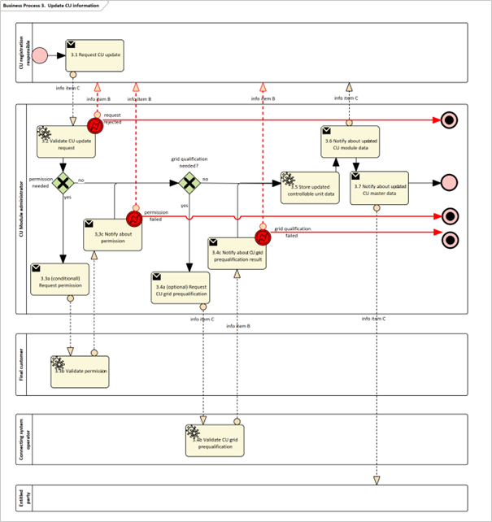 

#### Procedure 4 - De-registration of CU

| Step No. | Step | Step description | Information producer (actor) | Information receiver (actor) | Information exchanged (ID) |
|:--:|------|------------------|------------------------------|------------------------------|----------------------------|
| 4.1 | Request de-registration of CU | The CU registration responsible requests the de-registration of a controllable unit (CU) from the CU module. | CU registration responsible | CU module administrator | F – CU de-registration request |
| 4.2 | Validate CU de-registration request | The CU module administrator validates whether the CU fulfils the requirements for de-registration. In case of an invalid request, a meaningful indication is provided. | CU module administrator | CU registration responsible | B – Request validation information |
| 4.3 | De-register CU | The CU module administrator de-registers the CU immediately or schedules a date for the de-registration. | CU module administrator | Not applicable | – |
| 4.4 | Notify CU de-registration | In case of a successful CU de-registration, the CU module administrator sends the updated CU module information to the CU registration responsible. | CU module administrator | CU registration responsible | G – CU de-registration notification |
| 4.5 | Notify CU module update | In case of a successful CU de-registration, the CU module administrator notifies the entitled parties. | CU module administrator | Entitled parties | G – CU de-registration notification |

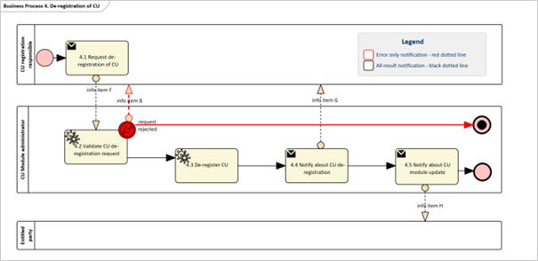 

#### Procedure 5 - Suspension of CU by an entitled party

| Step No. | Step | Step description | Information producer (actor) | Information receiver (actor) | Information exchanged (ID) |
|:--:|------|------------------|------------------------------|------------------------------|----------------------------|
| 5.1 | Request suspension of CU | The party entitled to suspend a CU according to national terms and conditions sends a request to suspend a controllable unit (CU) to the CU module administrator. | Party entitled to suspend a CU according to national terms and conditions | CU module administrator | H – CU suspension request |
| 5.2 | Validate CU suspension request | The CU module administrator validates the suspension request and verifies the entitlement of the requesting party. | CU module administrator | Party entitled to suspend a CU according to national terms and conditions | B – Request validation information |
| 5.3 | Suspend CU | The CU module administrator suspends the CU in the CU module. | CU module administrator | Not applicable | – |
| 5.4 | Notify updated CU module data | If applicable, the CU module administrator notifies the service provider to which the CU is assigned. | CU module administrator | Service provider | I – CU suspension notification |
| 5.5 | (Conditional) Notify suspended CU | If required, the CU module administrator notifies the final customer about the CU suspension. | CU module administrator | Final customer | I – CU suspension notification |
| 5.6 | Notify other parties about CU suspension | The CU module administrator informs all affected parties about the CU suspension. | CU module administrator | Affected parties | I – CU suspension notification |

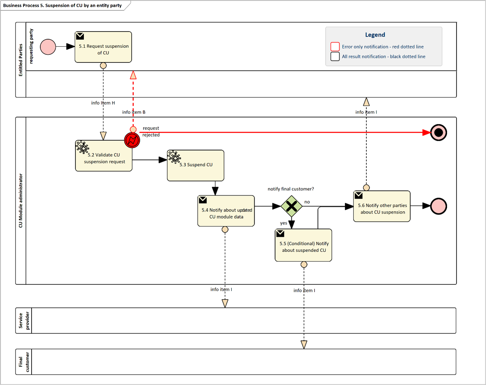 

#### Procedure 6 - Re-activation of CU 

| Step No. | Step | Step description | Information producer (actor) | Information receiver (actor) | Information exchanged (ID) |
|:--:|------|------------------|------------------------------|------------------------------|----------------------------|
| 6.1 | Request re-activation of CU | The party entitled to re-activate a CU requests re-activation of a CU to the CU module administrator. The entitled party is defined in the national terms and conditions for the flexibility information system (e.g., connecting and procuring system operators). | Party entitled to re-activate a CU according to national terms and conditions | CU module administrator | J – CU re-activation request |
| 6.2 | Validate CU re-activation request | The CU module administrator validates the request and verifies the entitlement of the requesting party. | CU module administrator | Party entitled to re-activate a CU according to national terms and conditions | B – Request validation information |
| 6.3a | (Conditional) Request CU grid prequalification | The CU module administrator sends CU master data to the connecting system operator to initiate the CU grid prequalification process due to updated CU master data. In accordance with NCDR, Article 28 (e). | CU module administrator | Grid prequalification coordinator | C – CU master data |
| 6.3b | Validate CU grid qualification | The connecting system operator sends the CU module administrator the validation results for the CU. | Grid prequalification coordinator | CU module administrator | B – Request validation information |
| 6.3c | Notify about CU grid prequalification result | The CU module administrator notifies the party entitled to re-activate a CU of the validation result of the CU grid prequalification. | CU module administrator | Party entitled to re-activate a CU according to national terms and conditions | B – Request validation information |
| 6.4 | Re-activate CU | The CU module administrator re-activates the CU in the CU module. | CU module administrator | Not applicable | – |
| 6.5 | (Conditional) Notify about re-activated CU | If required, notify the final customer about CU re-activation. | CU module administrator | Final customer | K – CU re-activation notification |
| 6.6 | Notify about updated CU module data | Notify the service provider assigned to the CU about the re-activation. | CU module administrator | Service provider | K – CU re-activation notification |
| 6.7 | Notify other parties about CU re-activation | The CU module administrator informs all affected parties of the CU re-activation. | CU module administrator | Affected parties | K – CU re-activation notification |

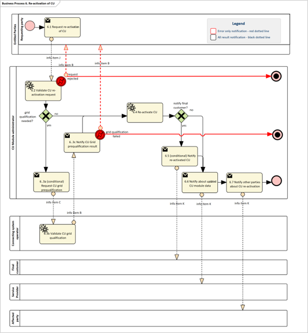 

#### Procedure 7 - Service provider registration

| Step No. | Step | Step description | Information producer (actor) | Information receiver (actor) | Information exchanged (ID) |
|:--:|------|------------------|------------------------------|------------------------------|----------------------------|
| 7.1 | Request registration | The service provider (SP) applies for access (account) to the flexibility information system. The SP may register with an existing identification code if valid according to national terms and conditions, or request a new identification code. | Service provider | SP module operator | L – Service provider registration request |
| 7.2 | Validate registration request | The SP module operator validates whether the service provider is eligible for access and provides a meaningful indication in case of an invalid request. | SP module operator | Service provider | B – Request validation information |
| 7.3 | Send credentials | Upon successful validation, the SP module operator sends credentials to the SP, including a unique identification code. | SP module operator | Service provider | M – Service provider identification information |
| 7.4 | Request update of profile information | The SP sends generic profile information (excluding product-specific information) to the SP module operator. | Service provider | SP module operator | N – Service provider profile information |
| 7.5 | Validate request to update profile information | The SP module operator validates the completeness of the profile update and provides an indication in case of an invalid request. | SP module operator | Service provider | B – Request validation information |
| 7.6 | Validate profile | The SP module operator validates the correctness of the provided profile information. | SP module operator | Service provider | B – Request validation information |
| 7.7 | Notify about successful SP registration | The SP module operator informs the service provider about the result of their registration. | SP module operator | Service provider | O – Service provider registration confirmation |
| 7.8 | Notify about newly registered service provider | The SP module operator notifies relevant entitled parties about the successful registration of the service provider. | SP module operator | Entitled parties | N – Service provider profile information |

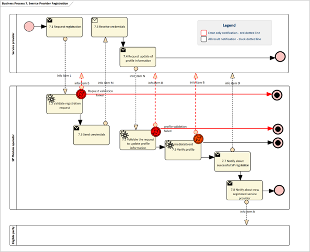 

#### Procedure 8 - Service provider application for qualification

| Step No. | Step | Step description | Information producer (actor) | Information receiver (actor) | Information exchanged (ID) |
|:--:|------|------------------|------------------------------|------------------------------|----------------------------|
| 8.1 | Request service provider qualification | The SP requests service provider qualification in the Flexibility Information System with the required product-specific information. | Service provider | SP module operator | P – Request for service provider qualification |
| 8.2 | Validate qualification request | The SP module operator validates whether the request is valid and provides a meaningful indication in case of an invalid request. | SP module operator | Service provider | B – Request validation information |
| 8.3 | Register service provider qualification request | The SP module operator registers the service provider qualification process in the initial status. | SP module operator | [not relevant] | [not relevant] |
| 8.4 | Request to process service provider application for qualification | The SP module operator forwards a new service provider application for qualification to the relevant Procuring system operator and provides the SP’s registered data. | SP module operator | Procuring system operator | P – Request for service provider qualification |
| 8.5 | Execute qualification | The Procuring System Operator initiates the qualification process, checking requirements in Article 17 of NCDR and other relevant conditions. A simplified qualification process may be applied if the SP is already qualified for another product. | Procuring System Operator | [not relevant] | [not relevant] |
| 8.6 | Update status when changed | During the qualification process, the Procuring System Operator updates the SP module with the status of the qualification process. | Procuring System Operator | SP module operator | Q – Service provider qualification status update |
| 8.7 | Acknowledge the updated status | The SP module operator acknowledges the updated qualification status back to the procuring system operator or provides a meaningful indication in case of a problem. | SP module operator | Procuring System Operator | B – Request validation information |
| 8.8 | Register updated status | The SP module operator registers the updated status for the service provider qualification process. | SP module operator | [not relevant] | [not relevant] |
| 8.9 | Notify qualification status | The SP module operator notifies the SP when the qualification status is updated. If the qualification process is not finished, the process loops back to step 8.5. | SP module operator | Service provider | Q – Service provider qualification status update |

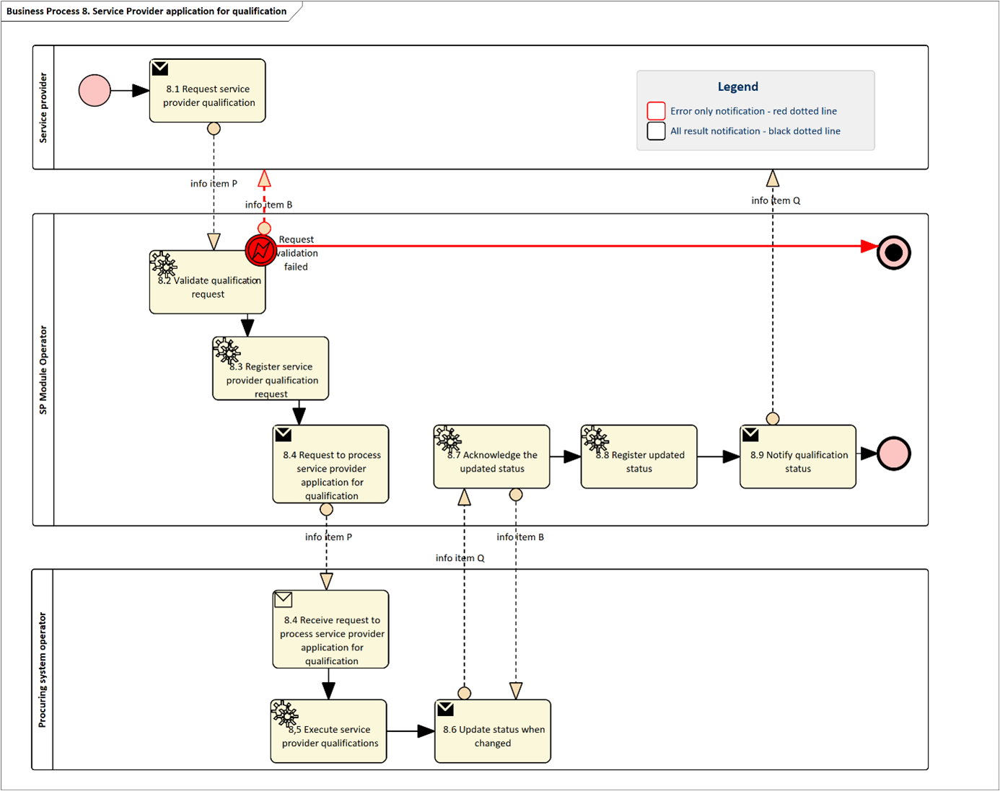 

#### Procedure 9 - Service contract revocation by final customer

| Step No. | Step | Step description | Information producer (actor) | Information receiver (actor) | Information exchanged (ID) |
|:--:|------|------------------|------------------------------|------------------------------|----------------------------|
| 9.1 | Request contract termination | The final customer informs their service provider that they want to terminate the existing contract on a certain termination date.    **Note:** This is the main starting point of the procedure. | Final customer | Service provider | R – Contract termination request |
| 9.2 | Validate and acknowledge contract termination request | The service provider validates the request and provides either a meaningful indication of an invalid request or an acknowledgement of a valid request. | Service provider | Final customer | B – Request validation information |
| 9.3 | Request to remove the assignment of the CU | The service provider informs the CU module that the linking between the SP and CU should be terminated on the given termination date. | Service provider | CU module administrator | S – CU assignment data |
| 9.4 | Validate explicit request to remove assignment of the CU | The CU module administrator validates the request and confirms that the request to remove the assignment of the CU is being processed or provides a meaningful indication of an invalid request. | CU module administrator | Service provider | B – Request validation information |
| 9.5 | Request to process change of accounting point entitlement (implicit) | External reasons (e.g., move-out) lead to an invalidation of the final customer’s entitlement to an accounting point and implicit contract termination. The metering point administrator informs the CU module administrator about these events.    **Note:** This is an alternative starting point for the procedure. | Metering point administrator | CU module administrator | T – Accounting point entitlement notification |
| 9.6 | Validate request to process change of accounting point entitlement | The CU module administrator validates that the request to trigger implicit contract termination is technically correct. In case of an invalid request, a meaningful indication should be provided. | CU module administrator | Metering point administrator | B – Request validation information |
| 9.7 | Execute removal of CU assignment | The CU module administrator removes the assignment of the CU from the service provider. | CU module administrator | [not relevant] | [not relevant] |
| 9.8 | Notify about contractless CU | The CU module administrator notifies entitled parties that the CU no longer has an active service provider. | CU module administrator | Entitled parties | U – Contractless CU notification |
| 9.9 | (Conditional) Notify contract revocation | (Conditional based on national terms and conditions) The CU module administrator notifies the final customer that the contract revocation process has been finished. | CU module administrator | Final customer | V – Contract termination notification |
| 9.10 | Send removal of CU assignment | The CU module administrator informs that the service provider will no longer be linked to the CU after the termination date. | CU module administrator | Service provider | S – CU assignment data |
| 9.11 | (Conditional) Notify contract revocation | (Conditional based on national terms and conditions) The service provider notifies the final customer that the contract revocation process has been finished. | Service provider | Final customer | V – Contract termination notification |

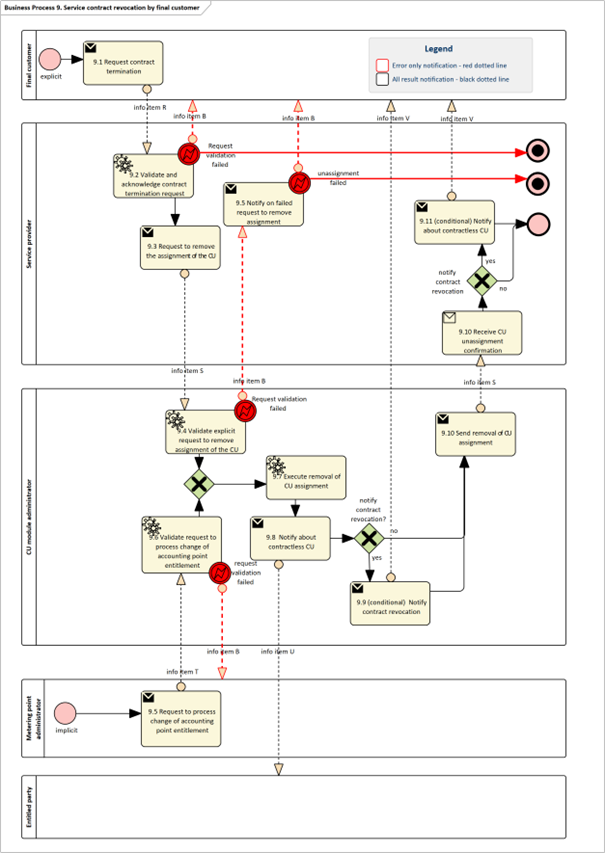 

#### Procedure 10 - Service contract termination by service provider

| Step No. | Step | Step description | Information producer (actor) | Information receiver (actor) | Information exchanged (IDs) |
|:--:|------|------------------|------------------------------|------------------------------|----------------------------|
| 10.1 | Send contract termination message | The service provider informs their customer that they terminate the existing contract on a certain termination date according to national terms and conditions. | Service provider | Final customer | R – Contract termination request |
| 10.2 | Request to remove the assignment of the CU | The service provider informs the CU module administrator that the linking between the SP and CU should be terminated on the given termination date. | Service provider | CU module administrator | S – CU assignment data |
| 10.3 | Validate request to remove assignment of the CU | The CU module administrator validates the request and confirms that the request to remove the assignment of the CU is being processed or provides a meaningful indication of an invalid request. | CU module administrator | Service provider | B – Request validation information |
| 10.4 | Execute removal of CU assignment | The CU module administrator removes the assignment of the CU from the service provider. | CU module administrator | [not relevant] | [not relevant] |
| 10.5 | Send removal of CU assignment | The CU module administrator informs that the service provider will no longer be linked to the controllable unit after the termination date. | CU module administrator | Service provider | S – CU assignment data |
| 10.6 | Notify about contract-less CU | The CU module administrator notifies entitled parties that the CU no longer has an active service provider. | CU module administrator | Entitled parties | U – Contractless CU notification |
| 10.7 | (Conditional) Notify contract termination | (Conditional based on national terms and conditions) The CU module administrator notifies the final customer that the contract termination process has been finished. | CU module administrator | Final customer | V – Contract termination notification |
| 10.8 | (Conditional) Notify contract termination | (Conditional based on national terms and conditions) The service provider notifies the final customer that the contract termination process has been finished. | Service provider | Final customer | V – Contract termination notification |

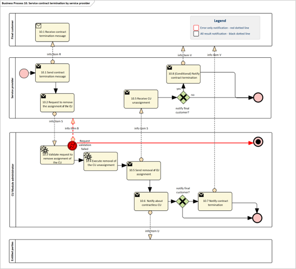 

#### Procedure 11 - SP Customer switching or new registration on CU 

| Step No. | Step                                   | Step description                                                                                                     | Info producer (actor)        | Info receiver (actor)  | Information exchanged (IDs)             |
|----------|----------------------------------------|----------------------------------------------------------------------------------------------------------------------|----------------------|----------------|-----------------------------------|
| 11.1      | Request service offer          | The final customer contacts a potential new service provider in order to obtain an offer, which may lead to a new contract for demand response services. | Final customer | Service provider (new)                    | W – New service provider contract request
| 11.2 | Validate service offer request | The new service provider validates the request of the final customer to determine whether an offer for demand response services can be made. | Service provider (new) | Final customer | B – Request validation information |
| 11.3a | Check for possible contractual obstructs | Depending on national rules, the new service provider will check for possible contractual obstructions with the current contract that could occur when the new contract is activated. | Service provider (new) | [not relevant] | [not relevant] |
| 11.3b | Solve issues with present service provider | The new service provider distributes – on authorization of the final customer – the needed information to solve issues with the present service provider for activation of the new contract. | Service provider (new) | Service provider (present) | [not relevant] |
| 11.3c | Communicate resolution results | The present service provider informs the new service provider of the resolution results. | Service provider (present) | Service provider (new) | [not relevant] |
| 11.3d | Notify final customer of validation results | The new service provider informs the final customer of the result. | Service provider (new) | Final customer | B – Request validation information |
| 11.4a | Request upfront CU master data | The new service provider – having permission from the final customer – requests the upfront CU master data from the CU module administrator. | Service provider (new) | CU module administrator | X – Up-front CU master data request |
| 11.4b | Validate upfront CU master data request | The CU module administrator validates the upfront CU master data request and provides a meaningful indication in case of an invalid request. | CU module administrator | Service provider (new) | Y – Up-front CU master data |
| 11.4c | Provide up-front CU master data | The CU module administrator sends the requested CU master data to the new service provider. | CU module administrator | Service provider (new) | Y – Up-front CU master data |
| 11.4d | Notify about CU validation results | The new service provider informs the final customer of receiving and processing the CU characteristics and whether the switching process can continue to the contracting phase. | Service provider (new) | Final customer | B – Request validation information |
| 11.5 | Request contract signing | The new service provider requests the final customer to sign the new contract for CU services on the requested date. | Service provider (new) | Final customer | Z – Contract confirmation |
| 11.6 | Execute sign contract | The final customer signs the contract for CU services on the requested date and sends the signed contract back to the new service provider. If the customer does not wish to sign the contract, the process should stop here. | Final customer | Service provider (new) | Z – Contract confirmation |
| 11.7 | Request registration of SP on CU | The new service provider requests to be registered in the CU module as the (new) service provider for the CU per the requested date. | Service provider (new) | CU module administrator | AA – Technical contract registration request |
| 11.8 | Validate registration of SP on CU request | The CU module administrator validates the specified registration of the SP on the CU request. In case of an invalid request, a meaningful indication is provided. | CU module administrator | Service provider (new) | AB – Contract registration result |
| 11.9 | Send results for registration of SP on CU request | The CU module administrator informs the new service provider of the results; in case of an invalid request, a meaningful indication is provided. | CU module administrator | Service provider (new) | AB – Contract registration result |
| TF11.10 | Notify about registration of SP on CU validation result | The new service provider informs the final customer of the registration of the CU validation results. | Service provider (new) | Final customer | B – Request validation information |
| 11.11a | Request permission | Request permission for the change of service provider in CU master data on behalf of the final customer. | CU module administrator | Final customer | – |
| 11.11b | Validate permission | The final customer accepts the permission request for the change of service provider in the CU master data. | Final customer | CU module administrator | – |
| 11.11c | Notify about permissions | Notify the service provider about the permission given by the final customer to change the service provider in the CU master data. | CU module administrator | Service provider (new) | – |
| 11.12 | Send SP on CU registration result | The CU module operator informs the new service provider of the registration of the SP on the CU result. | CU module operator | Service provider (new) | AC – Contract registration result to SP |
| 11.13 | Notify about SP on CU registration result | The new service provider informs the final customer of the registration of the new SP on the CU result. | Service provider (new) | Final customer | Z – Contract registration result |
| 11.14 | Notify about CU registration | The CU module administrator notifies all affected parties directly after positive validation of the registration of the SP on CU request. | CU module administrator | Affected parties | AD – Contract registration notification to affected parties |
| 11.15 | Register in new service provider Flexibility Information System | The CU module administrator registers a new service provider in the CU module as the new service provider for the CU, per the specified future date. | CU module administrator | [not relevant] | [not relevant] |
| 11.16 | Notify on CU master data | Entitled parties receive updated CU master data due to the SP registration process on the CU at the specified date. | CU module administrator | Entitled parties | AE – CU master data notification |

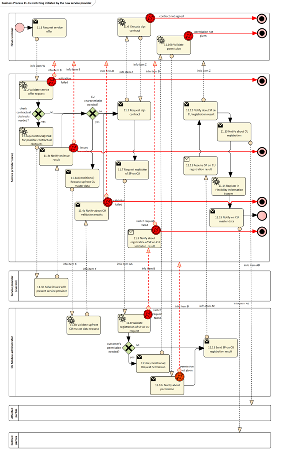 

#### Procedure 12 - Cancellation of SP registration  on CU
| Step No. | Step                                   | Step description                                                                                                     | Info producer (actor)        | Info receiver (actor)  | Information exchanged (IDs)             |
|----------|----------------------------------------|----------------------------------------------------------------------------------------------------------------------|----------------------|----------------|-----------------------------------|
| 12.1 | Request cancellation of new service provider contract | The final customer requests cancellation of the new service provider contract with the newly contracted service provider. | Final customer | Service provider (new) | AF – Contract cancellation request |
| 12.2 | Validate request | The new service provider validates the existence of the contract with the final customer for the CU and that the cancellation date request is before the start date of service in the new contract. | Service provider (new) | Final customer | B – Request validation information |
| 12.3 | Validate registration of new service provider on CU | The new service provider validates the registration of SP on CU request in the CU module based on a new contract. | Service provider (new) | [not relevant] | [not relevant] |
| 12.4 | Request cancellation of new contract in the CU module | The new service provider requests to cancel the pending registration of the new SP on the CU in the CU module due to the cancellation of the new service provider contract. | Service provider (new) | CU module administrator | AG – Contract registration cancellation in CU module request |
| 12.5 | Validate cancellation request | The CU module administrator checks if the new service provider is registered on the CU for service on the start date of the new contract. | CU module administrator | Service provider (new) | B – Request validation information |
| 12.6 | Notify about new contract in the CU module validation result | The new service provider notifies the final customer about the new contract in the CU module validation results. | Service provider (new) | Final customer | B – Request validation information |
| 12.7a | Request permission | Request permission for the change of service provider in CU master data on behalf of the final customer. | CU module administrator | Final customer | – |
| 12.7b | Validate permission | The final customer accepts the permission request for the change of service provider in the CU master data. | Final customer | CU module administrator | – |
| 12.7c | Notify about permissions | Notify the service provider about the permission given by the final customer to change the service provider in the CU master data. | CU module administrator | Service provider (new) | – |
| 12.8 | Send SP on cancellation request result | The CU module administrator informs the new service provider of the cancellation of the SP on the CU validation result. | CU module administrator | Service provider (new) | AH – Contract registration cancellation in CU module result |
| 12.9 | Notify about cancellation request result | The new service provider informs the final customer of the cancellation of the SP on the CU validation result. | Service provider (new) | Final customer | B – Request validation information |
| 12.10 | Cancel the pending registration of SP on CU | The CU module administrator cancels the pending registration of the SP on the CU in the CU module. | CU module administrator | [not relevant] | [not relevant] |
| 12.11 | Notify about cancellation of registration of SP on CU | The CU module administrator notifies the affected parties of the cancellation of the registration of the SP on the CU. | CU module administrator | Affected parties | AI – Cancellation notification to affected parties |
| 12.12 | Cancel contract | The new service provider cancels the service provider contract with the final customer. | Service provider (new) | [not relevant] | [not relevant] |
| 12.13 | Notify about cancellation of contract | The new service provider notifies the final customer of the cancellation of the new service provider contract. | Service provider (new) | Final customer | AJ – Cancellation notification to the final customer |

 

#### Procedure 13 - Update Service Provider profile information 
| Step No. | Step                                   | Step description                                                                                                     | Info producer (actor)        | Info receiver (actor)  | Information exchanged (IDs)             |
|----------|----------------------------------------|----------------------------------------------------------------------------------------------------------------------|----------------------|----------------|-----------------------------------|
| 13.1 | Request information update | Service provider makes a request to update their information in an SP module. The information to be updated contains basic profile information, which does not require the service provider qualification status to be re-considered. | Service provider | SP module administrator | N – Service provider profile information |
| 13.2 | Validate update request | The SP module administrator validates the information update request and provides a meaningful indication in case of an invalid request. | SP module administrator | Service provider | B – Request validation information |
| 13.3 | Register updated information | The SP module administrator saves the updated SP profile information. | SP module administrator | [not relevant] | [not relevant] |
| 13.4 | Notify about updated SP information | The SP module administrator notifies entitled parties about the updated SP profile information. | SP module administrator | Entitled party | N – Service provider profile information |
| 13.5 | Notify update result | The SP module administrator notifies the service provider of the update result. | SP module administrator | Service provider | N – Service provider profile information |

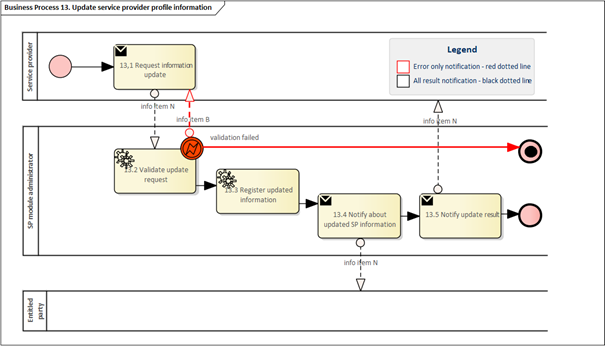 

#### Procedure 14 - Update Service Provider critical information 
| Step No. | Step                                   | Step description                                                                                                     | Info producer (actor)        | Info receiver (actor)  | Information exchanged (IDs)             |
|----------|----------------------------------------|----------------------------------------------------------------------------------------------------------------------|----------------------|----------------|-----------------------------------|
| 14.1 | Request information update | Service provider makes a request to update their information in an SP module. The information to be updated contains critical information that may require the service provider qualification status to be re-considered. | Service provider | SP module administrator | N – Service provider profile information |
| 14.2 | Validate update request | The SP module administrator validates the information update request and provides a meaningful indication in case of an invalid request. | SP module administrator | Service provider | B – Request validation information |
| 14.3 | Register updated information | The SP module administrator saves the updated information. | SP module administrator | [not relevant] | [not relevant] |
| 14.4 | Send updated SP information | The SP module administrator notifies the procuring system operator or other assigned system operator about the updated SP information. | SP module administrator | Procuring system operator | N – Service provider profile information |
| 14.5 | Execute assessment | The procuring system operator or other assigned system operator assesses the updated critical profile information and may consider re-assessment, communication testing, or suspension procedures as per national terms and conditions and Art. 17 of NC DR. | Procuring system operator | [not relevant] | [not relevant] |
| 14.6 | Notify update result | The SP module administrator notifies the service provider of the update result. | SP module administrator | Service provider | N – Service provider profile information |

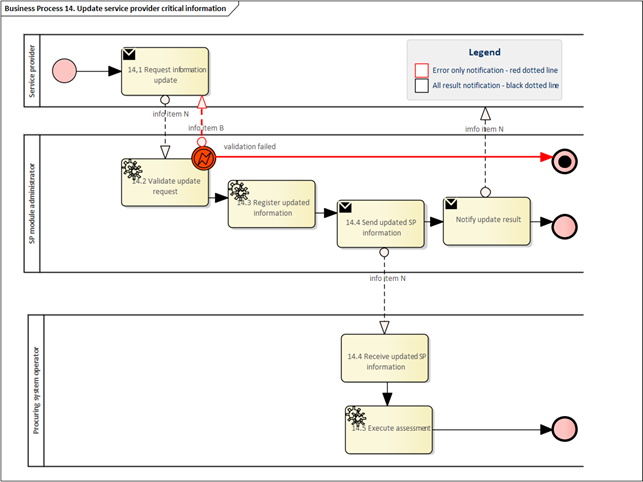 

#### Procedure 15 - De-registration of Service Provider 
| Step No. | Step                                   | Step description                                                                                                     | Info producer (actor)        | Info receiver (actor)  | Information exchanged (IDs)             |
|----------|----------------------------------------|----------------------------------------------------------------------------------------------------------------------|----------------------|----------------|-----------------------------------|
| 15.1 | Request de-registration | The service provider requests de-registration from an SP module from a specified de-registration date. | Service provider | SP module administrator | AK – Service provider de-registration request |
| 15.2 | Validate de-registration request | The SP module administrator validates the request and confirms that the de-registration request is being processed or provides meaningful information in case of an invalid request. | SP module administrator | Service provider | B – Request validation information |
| 15.3 | Execute de-registration of SPUs and SPGs | The SP module administrator de-registers all SPUs or SPGs of the service provider from the requested date. | SP module administrator | [not relevant] | [not relevant] |
| 15.4 | Execute de-registration of the SP | The SP module administrator proceeds with the de-registration of the service provider from the requested date. | SP module administrator | [not relevant] | [not relevant] |
| 15.5 | Notify about de-registration | The SP module administrator notifies the service provider of the de-registration of the service provider from the requested date. | SP module administrator | Service provider | AL – SP de-registration notification |
| 15.6 | Notify about de-registration | The SP module administrator notifies entitled parties of the de-registration of the service provider from a certain date and for specified products. | SP module administrator | Entitled party | AL – SP de-registration notification |

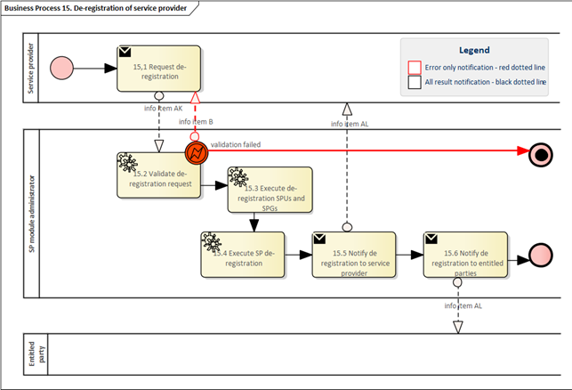 

#### Procedure 16 - Suspension of Service Provider qualification by System Operator

| Step No. | Step                                   | Step description                                                                                                     | Info producer (actor)        | Info receiver (actor)  | Information exchanged (IDs)             |
|----------|----------------------------------------|----------------------------------------------------------------------------------------------------------------------|----------------------|----------------|-----------------------------------|
| 16.1 | Request suspension of SP | The system operator requests suspension of the SP product application qualification(s) with a meaningful reason. | System operator | SP module administrator | AM – SP-Product-SO suspension request |
| 16.2 | Validate SP suspension request | The SP module administrator validates the request and, in case of an invalid request, provides a meaningful indication. | SP module administrator | System operator | B – Request validation information |
| 16.3 | Register suspension | The SP module administrator suspends the relevant SP qualifications, resulting in the SP no longer being qualified to offer services from the affected SPGs or SPUs. | SP module administrator | [not relevant] | [not relevant] |
| 16.4 | Notify SP | The SP module administrator notifies the service provider of the suspension, including the reason given by the system operator. | SP module administrator | Service provider | AN – SP-Product-SO suspension notification |
| 16.5 | Notify about SP suspension | (Conditional) The SP module administrator notifies the final customer about the SP suspension. | SP module administrator | Final customer | AN – SP-Product-SO suspension notification |
| 16.6 | Notify about SP suspension | The SP module administrator notifies all entitled parties of the SP suspension. | SP module administrator | Entitled party | AN – SP-Product-SO suspension notification |

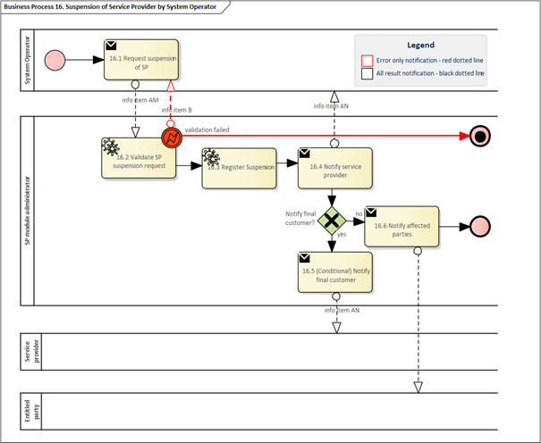 

#### Procedure 17 - Revocation of Service provider 

| Step No. | Step                                   | Step description                                                                                                     | Info producer (actor)        | Info receiver (actor)  | Information exchanged (IDs)             |
|----------|----------------------------------------|----------------------------------------------------------------------------------------------------------------------|----------------------|----------------|-----------------------------------|
| 17.1 | Request revocation of SP | The procuring system operator requests the SP module administrator to revoke the qualification of a service provider and its SPU or SPG on one or more balancing or local products. | Procuring system operator | SP module administrator | AO – SP revocation request |
| 17.2 | Validate SP revocation request | The SP module administrator validates the revocation request and the entitlement of the requesting procuring system operator. In case of an invalid request, a meaningful indication is provided. | SP module administrator | Procuring system operator | B – Request validation information |
| 17.3 | Register revocation | The SP module administrator updates the qualification status of the service provider and its SPU or SPG on one or more balancing or local products. | SP module administrator | [not relevant] | [not relevant] |
| 17.4 | Notify about SP revocation | The SP module administrator notifies the service provider about the update of the qualification status of the service provider and its SPU or SPG on one or more balancing or local products. | SP module administrator | Service provider | AP – SP revocation notification |
| 17.5 | Notify about SP revocation | The SP module administrator notifies all entitled parties about the update of the qualification status of the service provider and its SPU or SPG on one or more balancing or local products. | SP module administrator | Entitled party | AP – SP revocation notification |

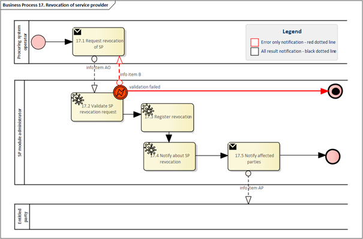 

#### Procedure 18 - Reactivation of Service provider  

| Step No. | Step                                   | Step description                                                                                                     | Info producer (actor)        | Info receiver (actor)  | Information exchanged (IDs)             |
|----------|----------------------------------------|----------------------------------------------------------------------------------------------------------------------|----------------------|----------------|-----------------------------------|
| 18.1 | Request re-activation of SP | The system operator requests re-activation of the suspended product qualification(s) of the service provider. | System operator | SP module administrator | AQ – SP-Product-SO reactivation request |
| 18.2 | Validate re-activation request | The SP module administrator validates the re-activation request and, in case of an invalid request, provides a meaningful indication. | SP module administrator | System operator | B – Request validation information |
| 18.3 | Register re-activation | The SP module administrator removes the suspension of the qualification(s) of the service provider, allowing the SP to again offer services from the affected SPGs or SPUs. | SP module administrator | [not relevant] | [not relevant] |
| 18.4 | Notify SP | The SP module administrator notifies the service provider of the re-activation, including the reason given by the system operator. | SP module administrator | Service provider | AR – SP-Product-SO reactivation notification |
| 18.5 | Notify about SP re-activation | (Conditional) The SP module administrator notifies the final customer about the SP re-activation. | SP module administrator | Final customer | AR – SP-Product-SO reactivation notification |
| 18.6 | Notify about SP re-activation | The SP module administrator notifies all entitled parties of the SP re-activation. | SP module administrator | Entitled party | AR – SP-Product-SO reactivation notification |

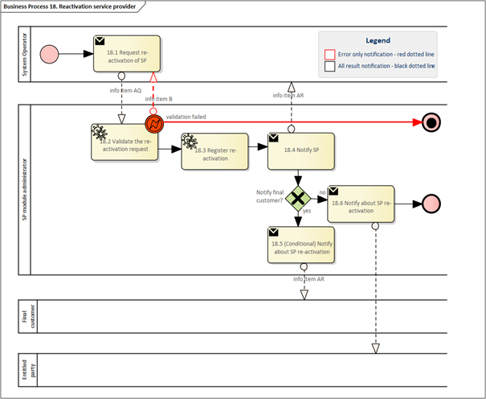 

#### Procedure 19 - SPU or SPG grid equalification 

| Step No. | Step                                   | Step description                                                                                                     | Info producer (actor)        | Info receiver (actor)  | Information exchanged (IDs)             |
|----------|----------------------------------------|----------------------------------------------------------------------------------------------------------------------|----------------------|----------------|-----------------------------------|
| 19.1 | Request grid prequalification | The entitled party sends a request to the relevant Grid PREQUALIFICATION coordinator to coordinate Grid PREQUALIFICATION. | Entitled party | Grid PREQUALIFICATION coordinator | AS – Grid PREQUALIFICATION request |
| 19.2 | Execute grid prequalification coordination | The Grid PREQUALIFICATION coordinator coordinates the Grid prequalification process as described in national terms and conditions pursuant to Article 45 of NC DR. | Grid PREQUALIFICATION coordinator | [not relevant] | [not relevant] |
| 19.3 | Notify grid prequalification results | The Grid PREQUALIFICATION coordinator sends the status of the completed Grid prequalification to the entitled parties. | Grid PREQUALIFICATION coordinator | Entitled parties | AT – Grid PREQUALIFICATION result |

 

#### Procedure 20 - SPG or SPU product prequalification

| Step No. | Step                                   | Step description                                                                                                     | Info producer (actor)        | Info receiver (actor)  | Information exchanged (IDs)             |
|----------|----------------------------------------|----------------------------------------------------------------------------------------------------------------------|----------------------|----------------|-----------------------------------|
| 20.1 | Notify information about the start of the product prequalification | The product prequalification responsible informs the service provider that product prequalification according to national terms and conditions has started. | Product prequalification responsible | Service provider | AU – Information about the start of a product prequalification |
| 20.1a | Send technical data for the product prequalification | (Conditional) The service provider sends the required technical data for performing the product prequalification. | Service provider | Product prequalification responsible | AV – Technical data for product prequalification |
| 20.2 | Send the technical data | The product prequalification responsible sends the technical data to the SP module administrator, who stores it. | Product prequalification responsible | SP module administrator | AV – Technical data for product prequalification |
| 20.3 | Execute product prequalification | The product prequalification responsible performs the product prequalification, making use of the procedure General Access to SPG or SPU data to obtain the necessary data. | Product prequalification responsible | [not relevant] | [not relevant] |
| 20.4a | Request activation test | (Conditional) According to national terms and conditions, the product prequalification responsible requests an activation test. Grid prequalification may be required beforehand, and connecting and impacted system operators are informed. | Product prequalification responsible | Activation test responsible | AW – Request activation test |
| 20.4b | Execute activation test | The activation test responsible performs the activation test. | Activation test responsible | Service provider | AX – Activation test |
| 20.4c | Send activation test result | The activation test responsible sends the result of the activation test to the product prequalification responsible and entitled parties. | Activation test responsible | Product prequalification responsible and entitled parties | B – Request validation information |
| 20.5 | Execute SPU or SPG confirmation | The product prequalification responsible confirms the SPU or SPG characteristics registered by the service provider. | Product prequalification responsible | [not relevant] | [not relevant] |
| 20.6 | Notify the result of the product prequalification | The product prequalification responsible notifies the entitled parties of the result of the product prequalification. | Product prequalification responsible | Entitled parties | AY – Product prequalification result |

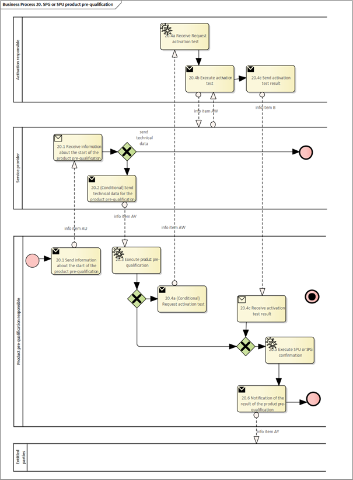 

#### Procedure 21 - SPG or SPU product verification 

| Step No. | Step                                   | Step description                                                                                                     | Info producer (actor)        | Info receiver (actor)  | Information exchanged (IDs)             |
|----------|----------------------------------------|----------------------------------------------------------------------------------------------------------------------|----------------------|----------------|-----------------------------------|
| 21.1 | Notify information about the start of the product verification | (Conditional) The product verification responsible informs the service provider that a product verification according to national terms and conditions has been started. | Product verification responsible | Service provider | AZ – Information about the start of a product verification |
| 21.2a | Request (aggregated) metered data for product verification | (Conditional) The product verification responsible requests the validated (aggregated) metered data required to perform the ex-post verification from the quantification data aggregator. | Product verification responsible | Quantification data aggregator | BA – Validated (aggregated) metered data request |
| 21.2b | Send (aggregated) metered data for product verification | The quantification data aggregator sends the requested (aggregated) metered data to perform the ex-post verification. | Quantification data aggregator | Product verification responsible | BB – Timeseries |
| 21.3 | Execute product verification | The product verification responsible performs the product verification according to national terms and conditions. An activation test may be requested as per NC DR Art. 19(3). | Product verification responsible | [not relevant] | [not relevant] |
| 21.4 | Execute SPU or SPG confirmation | The product verification responsible confirms the SPU or SPG characteristics registered in the SP module. | Product verification responsible | [not relevant] | [not relevant] |
| 21.5 | Notify the result of the product verification | The product verification responsible notifies the entitled parties of the result of the ex-post product verification. | Product verification responsible | Entitled parties | BC – Product verification result |

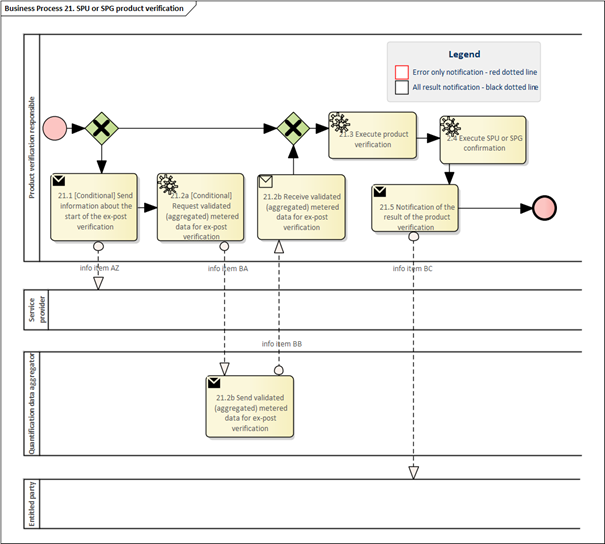 

#### Procedure 22 - SPU or SPG registration 

| Step No. | Step                                   | Step description                                                                                                     | Info producer (actor)        | Info receiver (actor)  | Information exchanged (IDs)             |
|----------|----------------------------------------|----------------------------------------------------------------------------------------------------------------------|----------------------|----------------|-----------------------------------|
| 22.1 | Request SPU or SPG registration | The service provider requests registration of a new SPU or SPG in the flexibility information system. An existing valid identification code may be reused, or a new one may be requested and assigned according to national terms and conditions. | Service provider | SP module administrator | BD – SPU or SPG registration request |
| 22.2 | Validate SPU or SPG registration request | The SP module administrator validates that the service provider is not suspended and that the request is eligible for creating a European-wide unique identification for an SPU or SPG. In case of an invalid request, a meaningful indication is provided. | SP module administrator | Service provider | B – Request validation information |
| 22.3 | Register SPU or SPG | The SP module administrator registers the SPU or SPG in the SP module. | SP module administrator | [not relevant] | [not relevant] |
| 22.4 | Notify about successful SPU or SPG registration | The SP module administrator informs the service provider of the result of the SPU or SPG registration request. | SP module administrator | Service provider | BE – SPU or SPG registration confirmation |

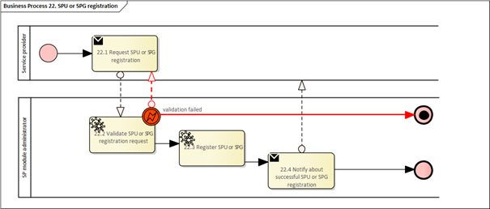 

#### Procedure 23 - SPU or SPG update  

| Step No. | Step                                   | Step description                                                                                                     | Info producer (actor)        | Info receiver (actor)  | Information exchanged (IDs)             |
|----------|----------------------------------------|----------------------------------------------------------------------------------------------------------------------|----------------------|----------------|-----------------------------------|
| 23.1 | Request SPU or SPG update | The entitled party requests an update of an SPU or SPG, providing the relevant data. | Entitled party | SP module administrator | BF – SPU or SPG update request |
| 23.2 | Validate SPU or SPG update request | The SP module administrator validates whether the request is eligible for updating the SPU or SPG and provides a meaningful indication in case of an invalid request. | SP module administrator | Entitled party | B – Request validation information |
| 23.3 | Register SPU or SPG update | The SP module administrator updates the SPU or SPG in the SP module of the flexibility information system. | SP module administrator | [not relevant] | [not relevant] |
| 23.4 | Notify about successful SPU or SPG update | The SP module administrator informs the service provider about the result of the SPU or SPG update request. | SP module administrator | Service provider | BG – SPU or SPG update confirmation |
| 23.5 | Notify updated SPU or SPG data | The SP module administrator informs entitled parties about the updated SPU or SPG data. | SP module administrator | Entitled party | BH – SPU or SPG update notification |

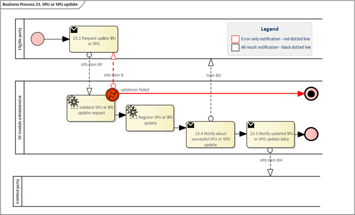 

#### Procedure 24 - SPU or SPG de-registration  

| Step No. | Step                                   | Step description                                                                                                     | Info producer (actor)        | Info receiver (actor)  | Information exchanged (IDs)             |
|----------|----------------------------------------|----------------------------------------------------------------------------------------------------------------------|----------------------|----------------|-----------------------------------|
| 24.1 | Request SPU or SPG de-registration | The service provider requests de-registration of an SPU or SPG, providing its unique SP identification and the European-wide unique identification code for the SPU or SPG. | Service provider | SP module administrator | BI – SPU or SPG de-registration request |
| 24.2 | Validate SPU or SPG de-registration request | The SP module administrator validates whether the service provider is registered and whether the request is eligible for de-registering the European-wide unique identification of an SPU or SPG. In case of an invalid request, a meaningful indication is provided. | SP module administrator | Service provider | B – Request validation information |
| 24.3 | Execute de-registration of SPU or SPG | The SP module administrator de-registers the SPU or SPG in the SP module. | SP module administrator | [not relevant] | [not relevant] |
| 24.4 | Notify about successful SPU or SPG de-registration | The SP module administrator informs the service provider of the result of the SPU or SPG de-registration request. | SP module administrator | Service provider | BJ – SPU or SPG de-registration confirmation |

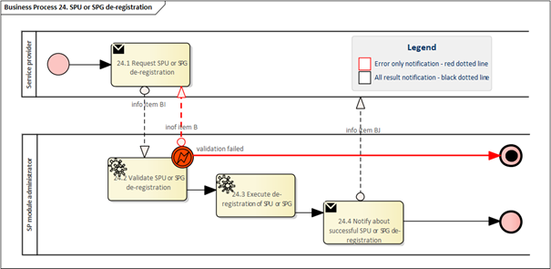 

#### Procedure 25 - SPU or SPG application  

| Step No. | Step                                   | Step description                                                                                                     | Info producer (actor)        | Info receiver (actor)  | Information exchanged (IDs)             |
|----------|----------------------------------------|----------------------------------------------------------------------------------------------------------------------|----------------------|----------------|-----------------------------------|
| 25.1 | Request for product application | The service provider applies for products with their SPU or SPG as defined in national terms and conditions for service providers. | Service provider | SP module administrator | BK – SPU or SPG product application request |
| 25.2 | Validate product application request | The SP module administrator validates the product application request and, in case of an invalid request, provides a meaningful indication. | SP module administrator | Service provider | B – Request validation information |
| 25.3 | Register product application | The SP module administrator registers the product application in the flexibility information system. | SP module administrator | [not relevant] | [not relevant] |
| 25.4 | Send product application | The SP module administrator informs the relevant procuring system operator about the pending product application. | SP module administrator | Procuring system operator | BK – SPU or SPG product application request |
| 25.5 | Validate product application for completeness | The procuring system operator validates that the product application is complete as defined in national terms and conditions and provides the result, including information on required prequalification or verification. | Procuring system operator | SP module administrator | B – Request validation information |
| 25.6 | Register product application as complete | The SP module administrator registers the product application as complete in the flexibility information system. | SP module administrator | [not relevant] | [not relevant] |
| 25.7 | Notify about complete product application to service provider | The SP module administrator notifies the service provider of the complete product application. | SP module administrator | Service provider | BL – SPU or SPG product application confirmation |
| 25.8 | Notify about complete product application to entitled parties | The SP module administrator notifies entitled parties (including the service provider and possibly connecting or impacted system operators) of the complete product application. | SP module administrator | Entitled party | BM – SPU or SPG product application notification |

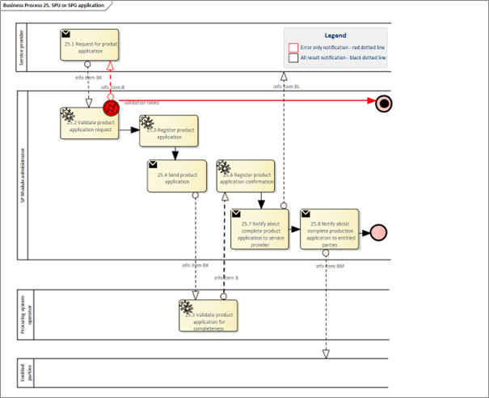 

#### Procedure 26 - SPU or SPG suspension  

| Step No. | Step                                   | Step description                                                                                                     | Info producer (actor)        | Info receiver (actor)  | Information exchanged (IDs)             |
|----------|----------------------------------------|----------------------------------------------------------------------------------------------------------------------|----------------------|----------------|-----------------------------------|
| 26.1 | Request SPU or SPG suspension | The system operator requests temporary suspension of an SPU or SPG qualification for a product, specifying the meaningful reason. | System operator | SP module administrator | BN – SPU or SPG suspension request |
| 26.2 | Validate SPU or SPG suspension request | The SP module administrator validates the suspension request and, in case of an invalid request, provides a meaningful indication. | SP module administrator | System operator | B – Request validation information |
| 26.3 | Register updated status for the SPG or SPU | The SP module administrator suspends the SPG or SPU in the SP module for the requested product. | SP module administrator | [not relevant] | [not relevant] |
| 26.4 | Notify about SPU or SPG suspension | The SP module administrator notifies the service provider of the SPG or SPU about the suspension, including the reason and the initiating entity. | SP module administrator | Service provider | BO – SPU or SPG suspension notification |
| 26.5 | Notify about updated SPU or SPG information to entitled parties | The SP module administrator notifies entitled parties about the updated status of the SPG or SPU. | SP module administrator | Entitled party | BO – SPU or SPG suspension notification |

 

#### Procedure 27 - SPU or SPG re-activation  

| Step No. | Step                                   | Step description                                                                                                     | Info producer (actor)        | Info receiver (actor)  | Information exchanged (IDs)             |
|----------|----------------------------------------|----------------------------------------------------------------------------------------------------------------------|----------------------|----------------|-----------------------------------|
| 27.1 | Request SPU or SPG re-activation | The system operator requests re-activation of a suspended SPU or SPG for a product, specifying the meaningful reason. | System operator | SP module administrator | BP – SPU or SPG re-activation request |
| 27.2 | Validate SPU or SPG re-activation request | The SP module administrator validates the re-activation request and, in case of an invalid request, provides a meaningful indication. | SP module administrator | System operator | B – Request validation information |
| 27.3 | Register updated status for the SPU or SPG | The SP module administrator re-activates the SPU or SPG in the SP module for the requested product. | SP module administrator | [not relevant] | [not relevant] |
| 27.4 | Notify about SPU or SPG re-activation | The SP module administrator notifies the service provider of the SPU or SPG about the re-activation, including the reason for the re-activation. | SP module administrator | Service provider | BQ – SPU or SPG re-activation notification |
| 27.5 | Notify about updated SPU or SPG information | The SP module administrator notifies entitled parties about the updated status of the SPU or SPG. | SP module administrator | Entitled party | BQ – SPU or SPG re-activation notification |

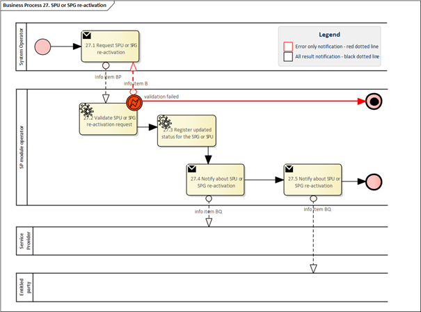 

#### Procedure 28 - General access to SPU or SPG master data by an entitled party   
| Step No. | Step                                   | Step description                                                                                                     | Info producer (actor)        | Info receiver (actor)  | Information exchanged (IDs)             |
|----------|----------------------------------------|----------------------------------------------------------------------------------------------------------------------|----------------------|----------------|-----------------------------------|
| 28.1 | Request for SPU or SPG master data | An entitled party requests the SPU or SPG master data for an SPU or SPG registered in the flexibility information system and linked to the requesting entitled party. | Entitled party | SP module administrator | BR – SPU or SPG master data request |
| 28.2 | Validate SPU or SPG master data request | The SP module administrator validates whether the master data request is permitted and provides a meaningful indication in case of an invalid request. | SP module administrator | Entitled party | B – Request validation information |
| 28.3 | Notify SPU or SPG master data | The SP module administrator sends the requested SPU or SPG master data from the flexibility information system to the entitled party. | SP module administrator | Entitled party | BS – SPU or SPG master data result |

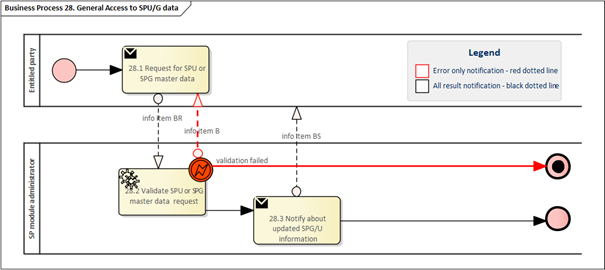 
                                            
#### Procedure 29 - Bidding and activation of active power flexibility product

| Step No. | Step | Step Description | Information producer (actor) | Information receiver (actor) | Information exchanged (IDs) |
|----|----|----|----|----|----|
| 29.1 | Send Bid[s] | The Service Provider makes their bid[s] available to the Service acquiring responsible . | Service Provider | Service acquiring responsible | BT - Bid information |
| 29.2 | Validate received bid[s] | Service acquiring responsible validates the received bid[s] | Service acquiring responsible | [not relevant] | [not relevant] |
| 29.3 | Execute selection of bids | Service acquiring responsible executes necessary actions to trigger the selection of bid[s] and gets the related results.    **Note:** selection takes place as a result from this step but is not described it might include different parties (automated by algorithm, etc.) | Service acquiring responsible | [not relevant] | [not relevant] |
| 29.4 | Notify of selected bid[s] to the Service Provider | The Service acquiring responsible sends the information that the bid[s] of the service provider has been selected and the related information. | Service acquiring responsible | Service Provider | CI– Selection of bid[s] |
| 29.5 | [conditional] Send an activation message of selected bid[s] to the Service Provider | The Service acquirer responsible sends the information that the bid[s] of the service provider has been activated and the related information. | Service acquireing responsible | Service Provider | BU – Activation of bid[s] |
| 29.6 | [conditional] Send a response to the activation message of selected bid[s] | The Service Provider sends a response with information on the implementation of the activation message. | Service Provider | Service acquiring responsible | XX- Response to activation of bid[s] |
| 29.7 | [conditional] Notify Information about rejected bid | The Service acquirer notifies the service provider about the reason for their rejected bid | Service acquiring responsibleer | Service Provider | BV – Rejected bid information |

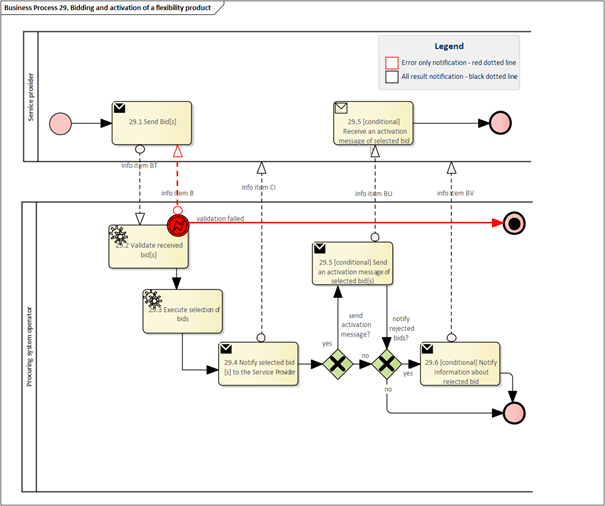 

#### Procedure 30 - (conditional) Temporary limits

| Step No. | Step | Step Description | Information producer (actor) | Information receiver (actor) | Information exchanged (IDs) |
|----|----|----|----|----|----|
| 30.1 | Execute Temporary limit determination | The relevant system operator updates an existing or sets a new temporary limit on system elements, SPUs, SPGs or parts of SPGs | System operator | [not relevant] | [not relevant] |
| 30.2 | Send temporary limit | The relevant system operator sends the determined temporary limit to the Temporary limit administrator | System operator | Temporary limit administrator | BW - Temporary limit |
| 30.3 | Notify temporary limit | The temporary limit administrator distributes the received temporary limit to the entitled party. | Temporary limit administrator | Entitled Party | BW - Temporary limit |
1) This procedure only needs to be mapped if the SPs as entitled parties are actively involved in this procedure based on the national Terms and conditions.

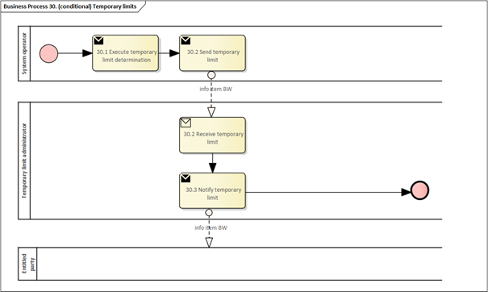 

#### Procedure 31 -  Table Baseline data handling

| Step No. | Step | Step Description | Information producer (actor) | Information receiver (actor) | Information exchanged (IDs) |
|----|----|----|----|----|----|
| 31.1 | [Conditional] Request necessary data to determine the baseline | The Baseline calculator requests the necessary data to determine the baseline from an entitled party defined in the national TC | Baseline calculator | Entitled party | XXX |
| 31.1 | Send necessary data to determine the baseline | An entitled party defined in the national TC will acquire the relevant data used in the baselining method for the resource or group of resources and send the data to the baseline calculator. | Entitled party | Baseline calculator | BX – Baseline information |
| 31.2 | Determine baseline | The baseline calculator calculates or otherwise determines the baseline using the baselining method and the relevant data. | Baseline calculator | [not relevant] | [not relevant] |
| 31.3 | Send the baseline | The baseline calculator sends the baseline to the baseline administrator. | Baseline calculator | Baseline administrator | BB –Timeseries |
| 31.4 | Notify about the baseline data | The baseline administrator makes the baseline available to entitled parties. | Baseline administrator | Entitled parties | BB –Timeseries |

**Note:** In case the entities involved in the procedure depend on the aggregation level of the baseline, the procedure should be mapped multiple times in the national reporting.

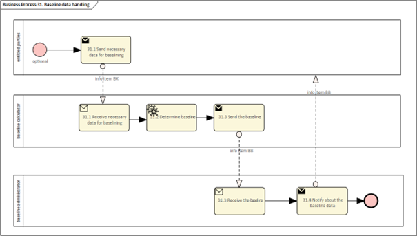 

#### Procedure 32 - Table Making measurement data available

| Step No. | Step | Step Description | Information producer (actor) | Information receiver (actor) | Information exchanged (IDs) |
|----|----|----|----|----|----|
| 32.1a | [Conditional] Request validated historical metering and consumption data for CU | The quantification data aggregator requests validated historical metering and consumption data from the metered data administrator for the controllable units. | Quantification data aggregator | Metered data administrator | BY - “Metered data request” - defined as object H in the Implementing Regulation (EU) 2023/1162 |
| 32.1b | Validate request for validated historical metering and consumption data for CU | The metered data administrator validates the specified request for validated historical metering and consumption data and provides a meaningful indication in case of an invalid request. | Metered data administrator | Quantification data aggregator | B – Request validation information |
| 32.1c | Send validated historical metering and consumption data for CU | The metered data administrator makes available validated historical metering and consumption data to the quantification data aggregator. | Metered data administrator | Quantification data aggregator | BZ - “Validated historical data” - defined as object F in the Implementing Regulation (EU) 2023/1162” |
| 32.2a | [Conditional] Request for validated DMD data for CU | The quantification data aggregator requests validated DMD data from the dedicated measurement device data administrator for the controllable units. | Quantification data aggregator | Dedicated measurement device data administrator | CA – DMD data request |
| 32.2b | Validate request DMD data for CU | The dedicated measurement device data administrator validates the specified request for dedicated measurement device data and provides a meaningful indication in case of an invalid request. | Dedicated measurement device data administrator | Quantification data aggregator | B – Request validation information |
| 32.2c | Send validated DMD data for CU | A dedicated measurement device data administrator makes available validated DMD data to the quantification data aggregator. | Dedicated measurement device data administrator | Quantification data aggregator | BB – Timeseries |
| 32.3a | [Conditional] Request for validated near-real-time metering and consumption data for CU | The quantification data aggregator requests validated near real-time metering and consumption data from the near real-time metering data administrator for the controllable units. | Quantification data aggregator | Near real-time metering data administrator | CB – near real-time metering and consumption data request |
| 32.3b | Validate request near real-time metering and consumption measurement data for CU | The near real-time metering data administrator validates the specified request for near real-time metering and consumption data and provides a meaningful indication in case of an invalid request. | Near real-time metering data administrator | Quantification data aggregator | B – Request validation information |
| 32.3c | Send validated near real-time metering and consumption data for CU | Near real-time metering data administrator makes available validated near real-time metering and consumption data to the quantification data aggregator. | Near real-time metering data administrator | Quantification data aggregator | BB – Timeseries |
| 32.4a | [Conditional] Request calculated data for CU | The quantification data aggregator requests validated calculated data from the calculated data administrator for the controllable units. | Quantification data aggregator | Quantification data administrator Calculated data administrator | CC – Calculated data request |
| 32.4b | Validate request calculated data for CU | The calculated data administrator validates the specified request for calculated data and provides a meaningful indication in case of an invalid request. | Calculated data administrator | Quantification data aggregator | B – Request validation information |
| 32.4c | Send validated calculated data | The calculated data administrator makes validated calculated values available to the quantification data aggregator. | Calculated data administrator | Quantification data aggregator | BB – Timeseries |

In the procedure ‘Making measurement data available’ the steps for request (32.1.a, 32.2.a, 32.3.a and 32.4.a) and validate request (32.1.b, 32.2.b, 32.3.b and 32.4.b) may be omitted in cases where the respective data administrator provides the data proactively.

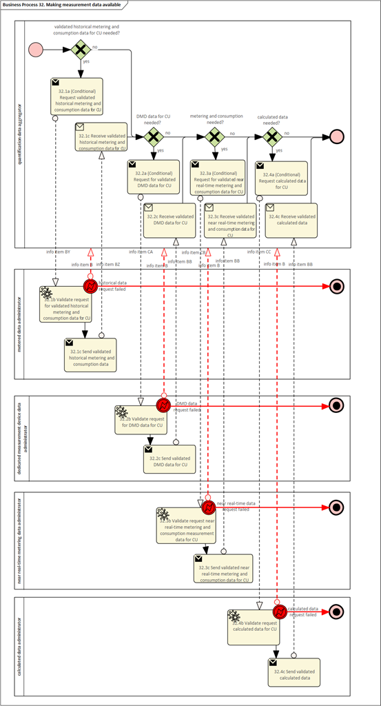 

#### Procedure 33 - Table Quantification

| Step No. | Step | Step Description | Information producer (actor) | Information receiver (actor) | Information exchanged (IDs) |
|----|----|----|----|----|----|
| 33.1 | Request validated (aggregated) metered data for the activation period. | The Quantification responsible requests the validated (aggregated) metered data from the quantification data aggregator for the activation period.    **Note:** The validated (aggregated) metered data might reflect different levels, e.g., individual CU, part of SPG or SPU, SPU, or SPGs, among others. | Quantification responsible | Quantification data aggregator | BA – validated (aggregated) metered data request |
| 33.2 | Validate validated (aggregated) metered data request. | The quantification data aggregator validates the specified validated (aggregated) metered data request and provides a meaningful indication in case of an invalid request. | Quantification data aggregator | Quantification responsible | B – Request validation information |
| 33.3 | Send validated (aggregated) metered data | The quantification data aggregator makes available the requested validated (aggregated) metered data. | Quantification data aggregator | Quantification responsible | BB – timeseries |
| 33.4 | Request baseline for the activation period | The Quantification responsible requests the baseline from the baseline administrator.   **Note:** The baseline might reflect different aggregation levels, e.g., individual CU, part of SPG or SPU, SPU, or SPGs, among others. | Quantification responsible | Baseline administrator | CF – Request Baseline |
| 33.5 | Validate baseline request | The baseline administrator validates the specified baseline request and provides a meaningful indication in case of an invalid request. | Baseline administrator | Quantification responsible | B – Request validation information |
| 33.6 | Send baseline data | The baseline administrator sends back the requested baseline. | Baseline administrator | Quantification responsible | BB – Timeseries |
| 33.7 | Quantify the requested volume | The Quantification responsible determines the delivered volume. | Quantification responsible |  | [not relevant] |
| 33.8 | Notify the quantified volume | The Quantification responsible makes available the result of the quantification. | Quantification responsible | Entitled Party | BB – Timeseries |

In the procedure ‘Quantification the steps for request (33.1, 33.4) and validate request (33.2, 33.5) may be omitted in cases where the Baseline administrator or Quantification data aggregator provides the data proactively.

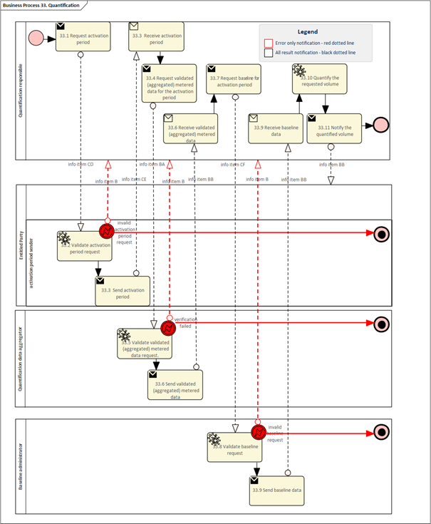 

#### Procedure 34 - (Optional) Baseline validation

| Step No. | Step | Step Description | Information producer (actor) | Information receiver (actor) | Information exchanged (IDs) |
|----|----|----|----|----|----|
| 34.1a | [Optional] Request activation period | Baseline validation is responsible for requesting activation period(s) as appropriate, and if applicable, for the validation process. | Baseline validation responsible | Entitled party | CD – Activation period request |
| 34.1b | Send activation period | The entitled party makes available the requested activation period(s). | Entitled party | Baseline validation responsible | CE – Activation period |
| 34.2a | [Optional] Request information used in determining the baseline | Baseline validation responsible requests the information used in determining the baseline, if applicable, and for a timeframe appropriate for the validation process. | Baseline validation responsible | Entitled party | CG – Baseline information request |
| 34.2b | Send baseline information | The entitled party makes available the requested information used in determining the baseline. | Entitled party | Baseline validation responsible | BX – Baseline information |
| 34.3a | [Optional] Request baseline | Baseline validation responsible requests the baseline from the baseline admnistrator, if applicable, and for a timeframe appropriate for the validation process. | Baseline validation responsible | Baseline administrator | CF – Request Baseline |
| 34.3b | Send baseline | The baseline administrator makes available the requested baseline. | Baseline administrator | Baseline validation responsible | BB – Timeseries |
| 34.4a | [Optional] Request validated metered data | Baseline validation is responsible requests validating metered data, if applicable, and for a timeframe appropriate for the validation process. | Baseline validation responsible | Quantification data aggregator | BB – Timeseries |
| 34.4b | Send validated metered data | Quantification data aggregator makes available the requested validated metered data. | Quantification data aggregator | Baseline validation responsible | BB – Timeseries |
| 34.5 | Validate baseline | Baseline validation is responsible for validating the baseline using information and a timeframe appropriate for the validation process. | Baseline validation responsible | [not relevant] | [not relevant] |
| 34.6 | [Conditional] Notify baseline validation result | Baseline validation is responsible for notifying parties of the validation result as defined in the national TC for baselining methods. | Baseline validation responsible | Entitled parties | CH – Baseline validation result |

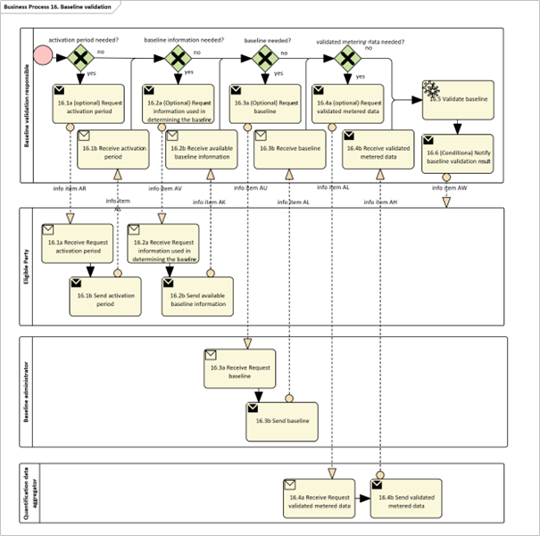 

### Data Exchanged

| ID  | Name of Information | Description of Information Exchanged |
|-----|-------------------|-------------------------------------|
| A   | CU master data request | **Entitled party:** Entitled party which is issuing the information request **Request type:** CU master data list |
| B   | Request validation information | **Validation result:** Information about the outcome of the validation step. |
| C   | CU master data | **CU module:** Identification of the CU module **CU identification:** Nationally unique identification of the controllable unit **Service provider:** If the controllable unit is assigned to a service provider, the identification of the service provider. **Service delivery status:** An indication whether the CU is: - Operational - Suspended **Accounting point identifier(s):** Identifier of the accounting point(s) the controllable unit has an impact on. **Locational information:** Optional. Information about the location of the connection point of the CU. For example metering grid area. **Technical characteristics:** Information on technical characteristics of CU (e.g., minimum and maximum capacity of a battery, ramp-up times, etc.) **Data exchange standard implemented:** If applicable, the reference to the information exchange standard implemented by the controllable unit. **Customer connection point identifier:** Identifier of the customer connection point the controllable unit is connected to. **Metering configuration characteristics:** CU measured by one or more, or a combination of the following: - DMD - Smart metering system - Calculated data method (NCDR Article 12 – Settlement volumes determination) **Active time period:** Time period when the CU is active. |
| D   | CU registration request | **CU module:** Identification of a flexibility information system module **Identification:** Identification of the final customer **Registration date:** Date for when the registration shall be considered active **CU identification:** An existing European wide unique identification code for the CU to be used in registration, if already available. |
| E   | CU identification | **CU identification:** Nationally unique identification of the CU **Creation date:** Date of CU ID creation |
| F   | CU de-registration request | **CU module:** Identification of a flexibility information system module at EU level **CU identification:** Nationally unique identification of the controllable unit **De-registration date:** Date for when the de-registration shall be considered active **Reason:** Reason for the de-registration request |
| G   | CU de-registration notification | **CU identification:** Nationally unique identification of the CU **De-registration process date:** Date for when the de-registration has been processed **De-registration date:** Date for when the de-registration shall be considered active **Reason:** Reason for the de-registration |
| H   | CU suspension request | **CU identification:** Nationally unique identification of the CU **Suspension date:** Date for when the suspension shall be considered active **Reason:** Reason for the suspension request |
| I   | CU suspension notification | **CU identification:** Nationally unique identification of the CU **Suspension date:** Date for when the suspension shall be considered active **Reason:** Reason for the suspension |
| J   | CU re-activation request | **CU identification:** Nationally unique identification of the CU **Re-activation timestamp:** Timestamp from when the re-activation shall be active **Reason:** Reason for the re-activation request |
| K   | CU re-activation notification | **CU identification:** Nationally unique identification of the CU **Re-activation timestamp:** Timestamp from when the re-activation shall be active **Reason:** Reason for the re-activation |
| L   | Service provider registration request | **Name:** Name of the service provider in a human-readable and clearly identifiable form **SP module identification:** Identification of SP module **Service provider identification:** An existing European wide unique identification code for the service provider to be used in registration |
| M   | Service provider identification information | **Service provider identification:** A European wide unique identification code the service provider was registered with, if the service provider already has one **SP module identification:** Identification of SP module **Sign-in information:** Credentials or other information to be used by the service provider to sign in into the SP module |
| N   | Service provider profile information | **Service provider identification:** A European wide unique identification code for the service provider **License issued by the NRA:** If applicable **Name:** Name of the service provider in a human-readable and clearly identifiable form **Contact information:** Comprising of at least phone number, email, and postal address **Settlement information:** Comprise of at least the VAT number or other identification if applicable, bank account and other related data **SP module identification:** Identification of the flexibility information system SP module with which the service provider intends to register **Critical profile information:** Profile information that could lead to re-assessing the qualification status of the service provider as defined in national terms and conditions and Art 22 of NC DR |
| O   | Service provider registration confirmation | **Service provider identification:** A European wide unique identification code the service provider was registered with **SP module identification:** Identification of the SP module **Date:** Date of when the registration has been completed |
| P   | Request for service provider qualification | **Procuring system operator identification:** Identification of the procuring system operator responsible for the qualification **Service provider identification:** Identification of the service provider to be qualified **Product identification:** Identification of the product for which the service provider should be qualified |
| Q   | Service provider qualification status update | **Service provider identification:** Identification of the service provider to be qualified **Procuring system operator identification:** Identification of the procuring system operator responsible for qualification **Product identification:** Identification of the product for which the service provider should be qualified **Qualification status:** Status of the qualification process **Reason:** Information complementing the status |
| R   | Contract termination request | **Final customer identification:** Identification of the final customer **CU Identification:** A unique identifier of the controllable unit **Termination date:** Date of the requested contract termination |
| S   | CU assignment data | **CU identification:** A unique identifier of the controllable unit **Service provider identification:** A unique identifier of the Service Provider **Date:** Date at which the CU should be unassigned from the service provider **Type of assignment:** Type for the change in CU assignment, e.g., add service provider, remove service provider |
| T   | Accounting point entitlement notification | **Accounting point identification:** Identification of the accounting point **Final customer identification:** Identification of the final customer **Date:** Date at which the change takes place **Type of change:** Type for the change in accounting point entitlement, e.g., lose entitlement, gain entitlement |
| U   | Contractless CU notification | **CU identification:** Identification of the controllable unit **Date:** Date at which the CU is left without a service provider |
| V   | Contract termination notification | **CU identification:** Identification of the respective controllable unit of the terminated contract **Final customer identification:** Identification of the final customer of the terminated contract **Service provider identification:** Identification of the service provider of the terminated contract **Termination date:** Date at which the contract termination takes place |
| W   | New service provider contract request | **CU identification:** Nationally unique identifier of the CU **Accounting point identification(s):** Identifier(s) of the accounting point(s) for which the controllable unit has an impact **Requested start date:** Requested date by the final customer for start of CU services by the service provider |
| X   | Up-front CU master data request | **CU identification:** Nationally unique identifier of the CU **Service provider identification:** Identification of the service provider **Request reason:** Reason for requesting access to CU master data |
| Y   | Up-front CU master data | **CU module:** Identification of the CU module **CU identification:** Nationally unique identification of the controllable unit **Service delivery status:** An indication whether the CU is: - Operational - Suspended **Accounting point identifier(s):** Identifier of the accounting point(s) the controllable unit has an impact on **Locational information:** Optional. Information about the location of the connection point of the CU, e.g., metering grid area **Technical characteristics:** Information on technical characteristics of CU (e.g., minimum and maximum capacity of a battery, ramp-up times, etc.) **Data exchange standard implemented:** If applicable, the reference to the information exchange standard implemented by the controllable unit **Customer connection point identifier:** Identifier of the customer connection point the controllable unit is connected to **Metering configuration characteristics:** CU measured by one or more, or a combination of the following: - DMD - Smart metering system - Calculated data method (NCDR Article 12 – Settlement volumes determination) **Active time period:** Time period when the CU is active |
| Z   | Contract confirmation | **Information:** Information about the confirmed contract |
| AA  | Technical contract registration request | **Start date:** The date requested by the new service provider to take over the CU services for this CU. Must be in the future of the request date **CU identification:** The nationally unique identification of the CU that is intended to be switched to a new service provider **New service provider identification:** European-wide unique identification of the service provider |
| AB  | Contract registration result | **CU identification:** A unique identifier of the CU **Success reasoning:** Reasoning of the CU switching result, if applicable |                                            |
| AC  | Contract registration result to SP | **CU identification:** Nationally unique identification of the CU **New service provider identification:** Identification of the service provider **Request result:** {if rejected} A code specifying (one of) the reason(s) for the rejection of the requested switch of service provider. The codes are not specified in the Regulation and should be described in business standardisation. |
| AD  | Contract registration notification to affected parties | **CU identification:** Nationally unique identification of the CU **Handover date:** The date on which the present affected party no longer has the service responsibility for this CU (LOSS) or the date on which the new affected party will have the service responsibility for this CU (GAIN) |
| AE  | CU master data notification | **CU identification:** Nationally unique identification of the CU **Handover date:** The date on which the present affected party no longer has the service responsibility for this CU (LOSS) or the date on which the new affected party will have the service responsibility for this CU (GAIN) **Accounting point identification(s):** Identifier of the accounting points the controllable unit has an impact on **New service provider identification:** European-wide unique identifier of the service provider |
| AF  | Contract cancellation request | No definition, free format |
| AG  | Contract registration cancellation in CU module request | **Start date:** The date on which the new service provider was to take over the service for this CU. Must be in the future **CU identification:** Nationally unique identification of the CU **New service provider identification:** Identification of the service provider |
| AH  | Contract registration cancellation in CU module result | **CU identification:** Nationally unique identification of the CU **New service provider identification:** Identification of the service provider **Request result:** {if rejected} A code specifying (one of) the reason(s) for the rejection of the requested cancellation of service provider switch request. The codes are not specified in the Regulation and should be described in business standardisation. |
| AI  | Cancellation notification to affected parties | **Start date:** The date on which the new service provider was to take over the service for this CU. Must be in the future **CU identification:** Nationally unique identification of the CU |
| AJ  | Cancellation notification to final customer | No definition, free format |
| AK  | SP de-registration request | **SP identification:** European wide unique identification of the SP **SP module identification (optional):** European wide unique identification of the SP module **De-registration date:** Date for the de-registration of the SP |
| AL  | SP de-registration notification | **SP identification:** European wide unique identification of the SP **De-registration date:** Date for the deregistration of the SP |
| AM  | SP-Product-SO Suspension request | **Service provider identification:** Identification of the service provider to be qualified **Procuring system operator identification:** Identification of the procuring system operator responsible for qualification **Product identification:** Identification of the product for which the service provider should be suspended **From date-time:** Suspension start date and time **Status:** Status of the suspension **Reason:** Information complementing the status |
| AN  | SP-Product-SO Suspension notification | **Service provider identification:** Identification of the service provider to be qualified **Procuring system operator identification:** Identification of the procuring system operator responsible for qualification **Product identification:** Identification of the product for which the service provider is suspended **Suspension status:** Status of the suspension **Reason:** Information complementing the status |
| AO  | SP revocation request | **SP identification:** European wide unique identification of the SP **SP module identification (optional):** European wide unique identification of the SP module **Revocation date:** Date for when the revocation shall be considered active **Reason:** Reason for the revocation request |
| AP  | SP revocation notification | **SP identification:** European wide unique identification of the SP **SP module identification (optional):** European wide unique identification of the SP module **Revocation date:** Date for when the revocation shall be considered active **Reason:** Reason for the revocation request |
| AQ  | SP-Product-SO reactivation request | **Service provider identification:** Identification of the service provider to be qualified **Procuring system operator identification:** Identification of the procuring system operator responsible for qualification **Product identification:** Identification of the product to be reactivated **From date-time:** Reactivation from date and time **Status:** Status of suspension **Reason:** Information complementing the status |
| AR  | SP-Product-SO reactivation notification | **Service provider identification:** Identification of the service provider to be qualified **Procuring system operator identification:** Identification of the procuring system operator responsible for qualification **Product identification:** Identification of the product for which the service provider is reactivated after suspension **Suspension status:** Status of the suspension |
| AS  | Grid PREQUALIFICATION request | **Reason:** Information specifying the reason for Grid PREQUALIFICATION request **Product:** Name of the product intended to be delivered and defined at national level **Identifier to reference object:** Unique identifier for the object of reference |
| AT  | Grid PREQUALIFICATION result | **Status:** Possible statuses: “Grid PREQUALIFICATION not approved”, “Grid PREQUALIFICATION conditionally approved” or “Grid PREQUALIFICATION approved”; if the deadline is exceeded, default status is "Grid PREQUALIFICATION approved" **Identifier to reference object:** Unique identifier for the object of reference **Reason:** Information complementing the status (e.g., conditions for conditional approval, reason for not approved) **Validity Period:** Start and end date during which the Grid PREQUALIFICATION is valid |
| AU  | Information about the start of a product prequalification | **SP identification:** European wide unique identification of the SP **SPU or SPG identification:** European wide unique identification of the SPU or SPG **Product identification:** European wide unique identification of the product |
| AV  | Technical data for product prequalification | **SP identification:** European wide unique identification of the SP **SPU or SPG identification:** European wide unique identification of the SPU or SPG **Product identification:** European wide unique identification of the product **Technical prequalification data:** Technical data necessary for performing prequalification according to national terms and conditions |
| AW  | Request activation test | **SP identification:** European wide unique identification of the SP **SPU or SPG identification:** European wide unique identification of the SPU or SPG **Product identification:** European wide unique identification of the product |
| AX  | Activation test | **SP identification:** European wide unique identification of the SP **SPU or SPG identification:** European wide unique identification of the SPU or SPG **Product identification:** European wide unique identification of the product **Activation data:** Data for performing the activation test |
| AY  | Product prequalification result | **SP identification:** European wide unique identification of the SP **SPU or SPG identification:** European wide unique identification of the SPU or SPG **Product identification:** European wide unique identification of the product **Result:** Result about the outcome of the product prequalification |
| AZ  | Information about the start of a product verification | **SP identification:** European wide unique identification of the SP **SPU or SPG identification:** European wide unique identification of the SPU or SPG **Product identification:** European wide unique identification of the product **Reason:** Reason for the product verification |
| BA  | Validated (aggregated) metered data request | **Identifier to reference object:** Unique identifier for the object of reference **(optional) Type of reference object:** Specifies the type of reference object (e.g., CU, metering point, SPG or SPU) **BB:** Information object BA1 – validated (aggregated) metered data specification |
| BA1 | Validated (aggregated) metered data specification | **Start timestamp:** Start of the time interval covered by the data package **End timestamp:** End of the time interval covered by the data package **Direction:** Flow direction of the requested data (production, consumption, or combined) **Energy product:** Energy product of the requested data (e.g., active energy, reactive energy) |
| BB  | Time series | **Type of timeseries:** Identification of the type of time series (e.g., Baseline, calculated data, aggregated data) **Identifier to reference object:** Unique identifier for the object of reference **(optional) Type of reference object:** Specifies the type of reference object (e.g., CU, metering point, SPG or SPU) **Creation timestamp:** Timestamp when the data package was generated **Energy product:** Energy product of the time series (e.g., active energy, reactive energy) **Start timestamp:** Start timestamp of the time series **End timestamp:** End timestamp of the time series **Unit:** Unit in which quantities in 'Quantity' are stated **For each interval:** Details per interval |
| BC  | Product verification result | **SP identification:** European wide unique identification of the SP **SPU or SPG identification:** European wide unique identification of the SPU or SPG **Product identification:** European wide unique identification of the product **Result:** Result about the outcome of the product verification |
| BD  | SPU or SPG registration request | **SP module:** Identification of a flexibility information system module at EU level **SPU or SPG master data:** Information object for SPU or SPG master data (only available data is expected, others optional) **Preferred registration date:** Date when the registration shall be considered active |
| BE  | SPU or SPG registration confirmation | **SP identification:** European wide unique identification of the SP **Registration date:** Timestamp when the registration was performed **SPU or SPG identification:** European wide unique identification of the SPU or SPG |
| BF  | SPU or SPG update request | **SP module:** Identification of a flexibility information system module **SPU or SPG master data:** Information object for SPU or SPG master data (only changed data expected, others optional) **Reason:** Reason or category for the update **Information validity:** Period during which updated data attributes are valid |
| BG  | SPU or SPG update confirmation | **SP module:** Identification of a flexibility information system module **SPU or SPG identification:** Existing European wide unique identification code for SPU or SPG **Update date:** Timestamp when the update was registered in the SP module |
| BH  | SPU or SPG update notification | **SP module:** Identification of a flexibility information system module **SPU or SPG master data:** Information object for SPU or SPG master data **Reason:** Reason or category for the update **Information validity:** Period during which updated data attributes are valid |
| BI  | SPU or SPG de-registration request | **SP module:** Identification of a flexibility information system module **SP identification:** European wide unique identification of the SP **SPU or SPG identification:** European wide unique identification of the SPU or SPG **De-registration date:** Date when de-registration shall be considered active **Reason:** (Optional) Reason for the de-registration request |
| BJ  | SPU or SPG de-registration confirmation | **SP identification:** European wide unique identification of the SP **SPU or SPG identification:** European wide unique identification of the SPU or SPG **De-registration process date:** Date when de-registration has been processed **De-registration date:** Date when de-registration was performed |
| BK  | SPU or SPG product application request | **SP module:** Identification of a flexibility information system module at EU level **SP identification:** European wide unique identification of the SP **SPU or SPG identification:** European wide unique identification of the SPU or SPG **Application date:** Date of the application **Products:** Balancing or local product services to be provided with the SPU or SPG |
| BL  | SPU or SPG product application confirmation | **SP module:** Identification of a flexibility information system module **SP identification:** European wide unique identification of the SP **System operator identification:** Identification of the procuring system operator who confirmed the application as complete **SPU or SPG identification:** European wide unique identification of the SPU or SPG **Confirmation date:** Date of confirmation that the application is complete **Products:** Balancing or local products to be provided |
| BM  | SPU or SPG product application notification | **SP module:** Identification of a flexibility information system module **SP identification:** European wide unique identification of the SP **System operator identification:** Identification of the procuring system operator who confirmed the application as complete **SPU or SPG identification:** European wide unique identification of the SPU or SPG **Confirmation date:** Date of confirmation that the application is complete **Products:** Balancing or local products to be provided |
| BN  | SPU or SPG suspension request | **SP module:** Identification of a flexibility information system module **SPU or SPG identification:** European wide unique identification of the SP **Suspension date:** Timestamp when the suspension takes place **Product:** Balancing or local product for which the right to provide service is suspended **Reason:** Reason for the suspension |
| BO  | SPU or SPG suspension notification | **SP module:** Identification of a flexibility information system module **System operator identification:** Identification of the system operator who suspended the SPU or SPG **SPU or SPG identification:** European wide unique identification of the SP **Suspension date:** Timestamp when the suspension takes place **Product:** Balancing or local product for which the right to provide service is suspended **Reason:** Reason for the suspension |
| BP  | SPU or SPG re-activation request | **SP module:** Identification of a flexibility information system module **SPU or SPG identification:** Identification of the SPU or SPG **Re-activation date:** Timestamp when re-activation takes place **Product:** Balancing or local product for which re-activation of the right to provide service occurs **Reason:** (Optional) Reason for the re-activation |
| BQ  | SPU or SPG re-activation notification | **SP module:** Identification of a flexibility information system module **System operator identification:** Identification of the system operator who suspended the SPU or SPG **SPU or SPG identification:** Identification of the SPU or SPG **Re-activation date:** Timestamp when re-activation takes place **Product:** Balancing or local product for which re-activation occurs **Reason:** (Optional) Reason for the re-activation |
| BR  | SPU or SPG master data request | **SP module:** Identification of a flexibility information system module **SPU or SPG identification:** European wide unique identification code for the SPU or SPG |
| BS  | SPU or SPG master data result | **SP module:** Identification of a flexibility information system module **SPU or SPG master data:** Information object for SPU or SPG master data |
| BT  | Bid information | **Bid identification:** Unique identifier for the bid **(optional) Locational information:** Area affected by the bid **BidTimeSeries information:** &nbsp;&nbsp;• Identifier to reference object &nbsp;&nbsp;• (optional) Type of reference object &nbsp;&nbsp;• Creation timestamp &nbsp;&nbsp;• Energy product &nbsp;&nbsp;• Start timestamp &nbsp;&nbsp;• End timestamp &nbsp;&nbsp;• Unit &nbsp;&nbsp;• Price unit **For each interval:** &nbsp;&nbsp;• Start timestamp &nbsp;&nbsp;• End timestamp &nbsp;&nbsp;• Direction (Up/Down) &nbsp;&nbsp;• Price &nbsp;&nbsp;• Quantity **Divisibility:** Indicates if the bid may be partially accepted **Product Type:** Type of product **Identifier to reference object:** Unique identifier for reference object in the bid **(optional) Type of reference object:** Specifies type of reference object |
| BU  | Activation of bid[s] | **Bid identification:** Reference to bid information object **Activation time period** **BidTimeSeries information:** &nbsp;&nbsp;• Identifier to reference object &nbsp;&nbsp;• (optional) Type of reference object &nbsp;&nbsp;• Creation timestamp &nbsp;&nbsp;• Energy product &nbsp;&nbsp;• Start timestamp &nbsp;&nbsp;• End timestamp &nbsp;&nbsp;• Unit **For each interval:** &nbsp;&nbsp;• Start timestamp &nbsp;&nbsp;• End timestamp &nbsp;&nbsp;• Direction (Up/Down) &nbsp;&nbsp;• Quantity |
| BV  | Rejected bid information | **Bid identification:** Reference to bid information object **Reason:** Reason for rejection of the bid |
| BW  | Temporary limit | **Identifier to reference object:** Unique identifier for the object of reference **(optional) Type of reference object:** Specifies type of reference object (system element, SPU, SPG, parts of SPG) **Creation timestamp:** Timestamp when data package generated **Start timestamp:** Start timestamp of time series **End timestamp:** End timestamp of time series **Reason:** Reason for temporary limit **Unit:** Unit of 'Quantity' **For each interval:** &nbsp;&nbsp;• Start timestamp &nbsp;&nbsp;• End timestamp &nbsp;&nbsp;• Direction (system elements: active power flow; SPUs/SPGs: energy injection/withdrawal) &nbsp;&nbsp;• Quantity |
| BX  | Baseline information | **Identifier to reference object:** Unique identifier for object of reference **(optional) Type of reference object:** Specifies type (CU, metering point, SPG, SPU, etc.) **Baselining method:** Identifier for baselining method used **Baseline data:** All data required to specify the baseline including method used |
| CA  | DMD data request | **Identifier to reference object:** Unique identifier for object of reference **(optional) Type of reference object:** Specifies type (CU, metering point, SPG, SPU, etc.) **DMD data specification:** Information object CA1 – DMD data specification |
| CA1 | DMD data specification | **Start timestamp:** Start of time interval covered by data package **End timestamp:** End of time interval covered by data package **Direction:** Flow direction (production, consumption, or combined) **Energy product:** Energy product of requested data (e.g., active energy, reactive energy) |
| CB  | Near real-time metering and consumption data request | **Identifier to reference object:** Unique identifier for object of reference **(optional) Type of reference object:** Specifies type (CU, metering point, SPG, SPU, etc.) **Near real-time metering and consumption data specification:** Information object CB1 – near real-time metering and consumption data specification |
| CB1 | Near real-time metering and consumption data specification | **Start timestamp:** Start of the time interval covered by the data package **End timestamp:** End of the time interval covered by the data package **Direction:** Flow direction of the requested data (production, consumption, or combined) **Energy product:** Energy product of the requested data (e.g., active energy, reactive energy) |
| CC  | Calculated data request | **Identifier to reference object:** Unique identifier for the object of reference **(optional) Type of reference object:** Specifies the type (CU, metering point, SPG, SPU, etc.) **Calculated data specification:** Information object CC1 – Calculated data specification |
| CC1 | Calculated data specification | **Start timestamp:** Start of the time interval covered by the data package **End timestamp:** End of the time interval covered by the data package **Direction:** Flow direction of the requested data (production, consumption, or combined) **Energy product:** Energy product of the requested data (e.g., active energy, reactive energy) |
| CD  | Activation period request | **Identifier to reference object:** Unique identifier for the object of reference **(optional) Type of reference object:** Specifies the type (CU, metering point, SPG, SPU, etc.) **Identification of bid:** Unique identification of the bid |
| CE  | Activation period | **Identifier to reference object:** Unique identifier for the object of reference **(optional) Type of reference object:** Specifies the type (CU, metering point, SPG, SPU, etc.) **Begin:** Begin of considered period **End:** End of considered period |
| CF  | Baseline request | **Identifier to reference object:** Unique identifier for the object of reference **(optional) Type of reference object:** Specifies the type (CU, metering point, SPG, SPU, etc.) **Period start:** Start of the period for which baseline is requested **Period end:** End of the period for which baseline is requested |
| CG  | Baseline information request | **Identifier to reference object:** Unique identifier for the object of reference **(optional) Type of reference object:** Specifies the type (CU, metering point, SPG, SPU, etc.) **(optional) Start timestamp:** Start timestamp for baseline information request **(optional) End timestamp:** End timestamp for baseline information request |
| CH  | Baseline validation result | **Identifier to reference object:** Unique identifier for the object of reference **(optional) Type of reference object:** Specifies the type (CU, metering point, SPG, SPU, etc.) **Baseline validation result:** Information object B – request validation information |
| CI  | Selection of bid[s] | **Bid identification:** Refers to identification from bid information object **Activation time period:** Period for which selected bids are activated |
| CJ  | SPU or SPG master data | **SP identification:** European wide unique identification of the SP **SPU or SPG identification:** Existing European wide unique identification code (optional when requesting new identification code) **Status value:** Status of SPU or SPG for each balancing or local product, with timestamp **Start timestamp:** Start timestamp of the recorded status **Maximum active power:** Maximum active power available from SPU or SPG **Maximum reactive power:** Maximum reactive power available from SPU or SPG **SPU or SPG data attributes:** Other data attributes as defined nationally **For each CU assigned to SPU/SPG:** &nbsp;&nbsp;• CU identification &nbsp;&nbsp;• Start timestamp of CU assignment &nbsp;&nbsp;• End timestamp of CU assignment |